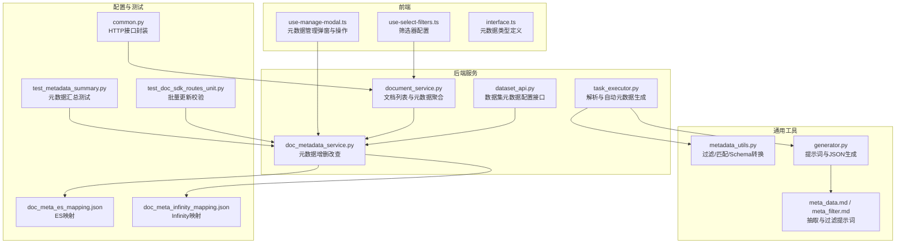
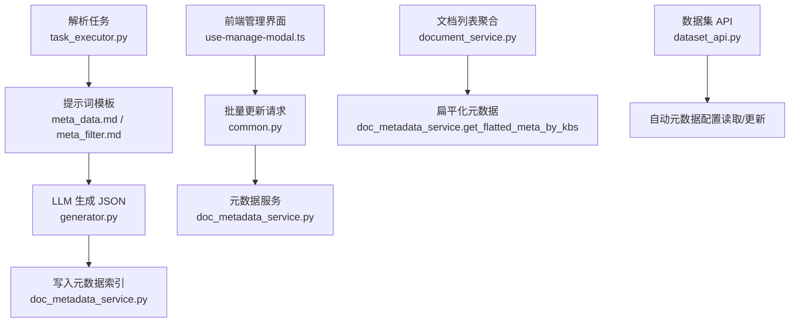
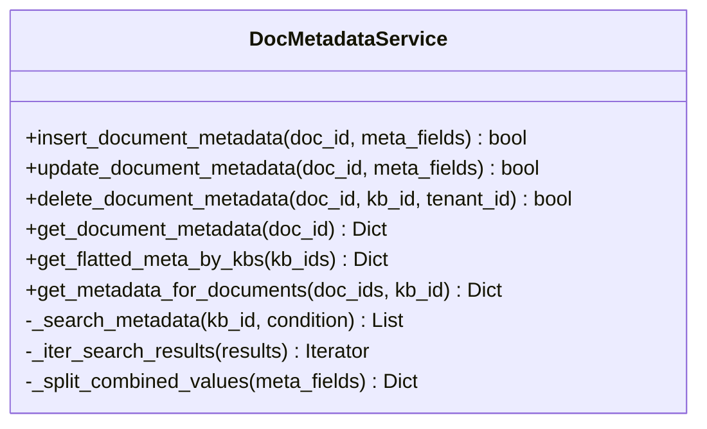
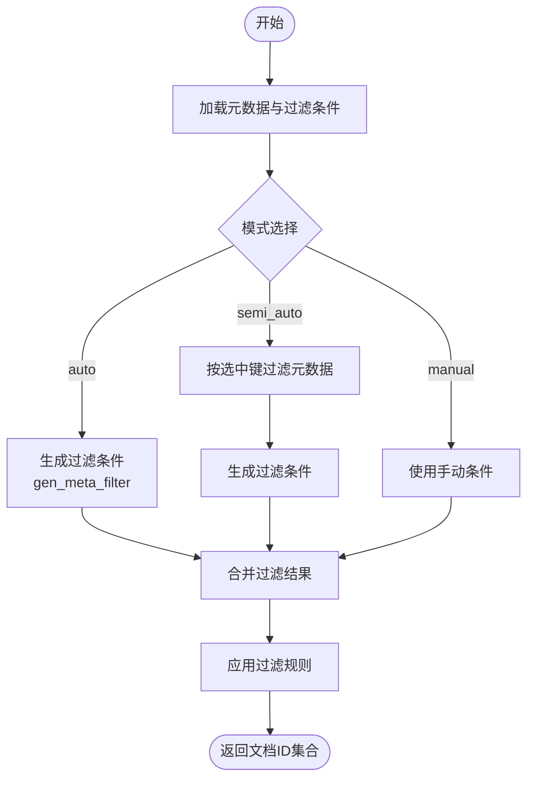
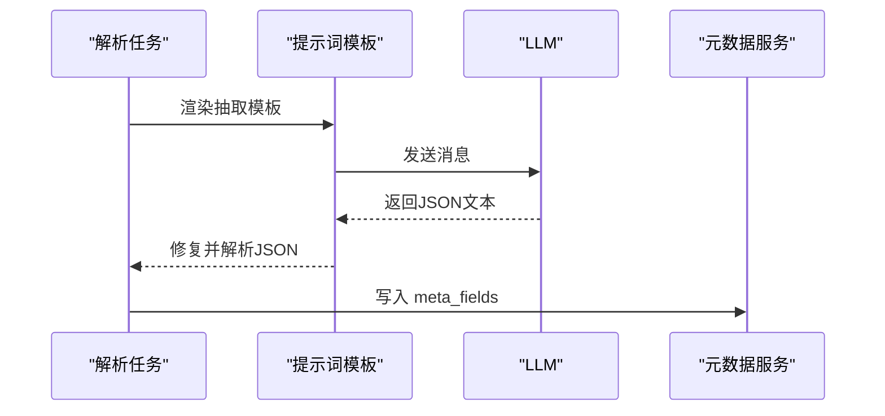
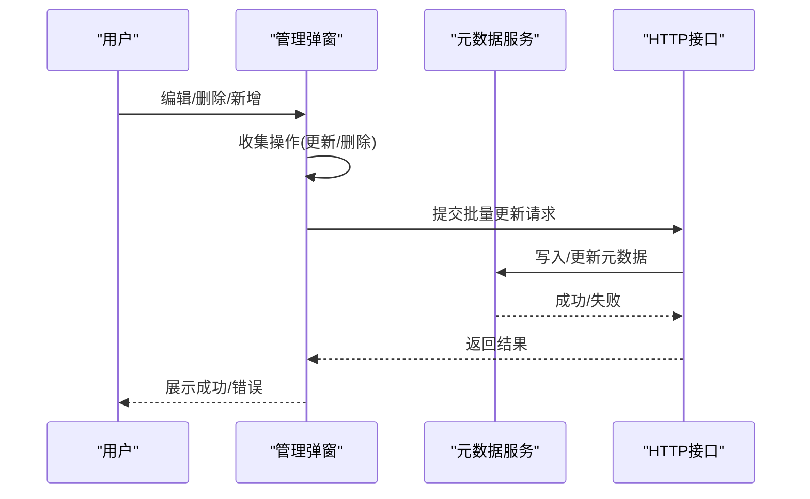
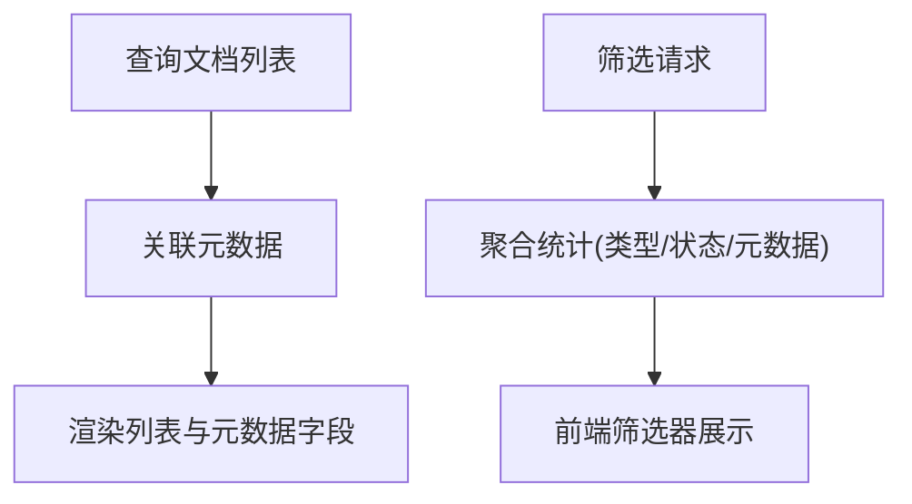
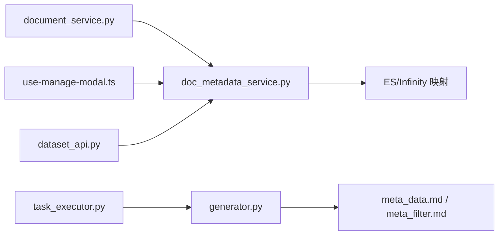

# 元数据管理

<cite>
**本文引用的文件**
- [doc_metadata_service.py](file://api/db/services/doc_metadata_service.py)
- [metadata_utils.py](file://common/metadata_utils.py)
- [generator.py](file://rag/prompts/generator.py)
- [meta_data.md](file://rag/prompts/meta_data.md)
- [meta_filter.md](file://rag/prompts/meta_filter.md)
- [use-manage-modal.ts](file://web/src/pages/dataset/components/metedata/hooks/use-manage-modal.ts)
- [interface.ts](file://web/src/pages/dataset/components/metedata/interface.ts)
- [use-select-filters.ts](file://web/src/pages/dataset/dataset/use-select-filters.ts)
- [doc_meta_es_mapping.json](file://conf/doc_meta_es_mapping.json)
- [doc_meta_infinity_mapping.json](file://conf/doc_meta_infinity_mapping.json)
- [task_executor.py](file://rag/svr/task_executor.py)
- [document_service.py](file://api/db/services/document_service.py)
- [dataset_api.py](file://api/apps/restful_apis/dataset_api.py)
- [test_metadata_summary.py](file://test/testcases/test_http_api/test_file_management_within_dataset/test_metadata_summary.py)
- [test_doc_sdk_routes_unit.py](file://test/testcases/test_http_api/test_file_management_within_dataset/test_doc_sdk_routes_unit.py)
- [common.py](file://test/testcases/test_web_api/common.py)
</cite>

## 目录
1. [简介](#简介)
2. [项目结构](#项目结构)
3. [核心组件](#核心组件)
4. [架构总览](#架构总览)
5. [详细组件分析](#详细组件分析)
6. [依赖分析](#依赖分析)
7. [性能考虑](#性能考虑)
8. [故障排查指南](#故障排查指南)
9. [结论](#结论)
10. [附录](#附录)

## 简介
本技术文档围绕 RAGFlow 的“元数据管理”能力，系统阐述文档元数据的生成、存储、检索、编辑与导出机制。重点覆盖以下方面：
- 自动元数据：基于解析流程与大模型提示词的字段抽取、枚举约束、组合值拆分与去重。
- 手动元数据：单条/批量更新、删除、设置模板与内置字段。
- 搜索与过滤：全文检索、字段过滤、高级查询（包含日期范围、空值判断、集合运算）、结果排序与聚合。
- 导出：支持 CSV/JSON 等格式导出，以及按条件批量导出与格式定制。
- 最佳实践：标准化字段定义、性能优化、数据治理策略。

## 项目结构
元数据相关代码主要分布在如下模块：
- 后端服务层：文档与元数据服务、任务执行器、数据集 API。
- 通用工具：元数据过滤与匹配、JSON Schema 转换。
- 前端交互：元数据管理弹窗、表格操作、筛选器。
- 配置映射：ES/Infinity 元数据索引结构。
- 测试用例：元数据汇总、批量更新校验。

图表来源
- [use-manage-modal.ts:1-562](file://web/src/pages/dataset/components/metedata/hooks/use-manage-modal.ts#L1-562)
- [use-select-filters.ts:1-89](file://web/src/pages/dataset/dataset/use-select-filters.ts#L1-89)
- [interface.ts:1-56](file://web/src/pages/dataset/components/metedata/interface.ts#L1-56)
- [document_service.py:1-800](file://api/db/services/document_service.py#L1-800)
- [doc_metadata_service.py:1-1076](file://api/db/services/doc_metadata_service.py#L1-1076)
- [task_executor.py:410-430](file://rag/svr/task_executor.py#L410-430)
- [dataset_api.py:431-518](file://api/apps/restful_apis/dataset_api.py#L431-518)
- [metadata_utils.py:1-344](file://common/metadata_utils.py#L1-344)
- [generator.py:480-503](file://rag/prompts/generator.py#L480-503)
- [meta_data.md:1-14](file://rag/prompts/meta_data.md#L1-14)
- [meta_filter.md:1-72](file://rag/prompts/meta_filter.md#L1-72)
- [doc_meta_es_mapping.json:1-30](file://conf/doc_meta_es_mapping.json#L1-30)
- [doc_meta_infinity_mapping.json:1-5](file://conf/doc_meta_infinity_mapping.json#L1-5)
- [test_metadata_summary.py:1-33](file://test/testcases/test_http_api/test_file_management_within_dataset/test_metadata_summary.py#L1-33)
- [test_doc_sdk_routes_unit.py:629-651](file://test/testcases/test_http_api/test_file_management_within_dataset/test_doc_sdk_routes_unit.py#L629-651)
- [common.py:372-399](file://test/testcases/test_web_api/common.py#L372-399)

章节来源
- [doc_metadata_service.py:1-1076](file://api/db/services/doc_metadata_service.py#L1-1076)
- [metadata_utils.py:1-344](file://common/metadata_utils.py#L1-344)
- [generator.py:480-503](file://rag/prompts/generator.py#L480-503)
- [meta_data.md:1-14](file://rag/prompts/meta_data.md#L1-14)
- [meta_filter.md:1-72](file://rag/prompts/meta_filter.md#L1-72)
- [use-manage-modal.ts:1-562](file://web/src/pages/dataset/components/metedata/hooks/use-manage-modal.ts#L1-562)
- [interface.ts:1-56](file://web/src/pages/dataset/components/metedata/interface.ts#L1-56)
- [use-select-filters.ts:1-89](file://web/src/pages/dataset/dataset/use-select-filters.ts#L1-89)
- [doc_meta_es_mapping.json:1-30](file://conf/doc_meta_es_mapping.json#L1-30)
- [doc_meta_infinity_mapping.json:1-5](file://conf/doc_meta_infinity_mapping.json#L1-5)
- [task_executor.py:410-430](file://rag/svr/task_executor.py#L410-430)
- [document_service.py:1-800](file://api/db/services/document_service.py#L1-800)
- [dataset_api.py:431-518](file://api/apps/restful_apis/dataset_api.py#L431-518)
- [test_metadata_summary.py:1-33](file://test/testcases/test_http_api/test_file_management_within_dataset/test_metadata_summary.py#L1-33)
- [test_doc_sdk_routes_unit.py:629-651](file://test/testcases/test_http_api/test_file_management_within_dataset/test_doc_sdk_routes_unit.py#L629-651)
- [common.py:372-399](file://test/testcases/test_web_api/common.py#L372-399)

## 核心组件
- 文档元数据服务：负责元数据的插入、更新、删除、查询、分页检索、扁平化聚合与空表清理。
- 通用元数据工具：提供过滤匹配、自动过滤规则生成、Schema 转换、去重合并等。
- 提示词引擎：定义元数据抽取与过滤的提示词模板，并通过 LLM 生成结构化 JSON。
- 前端元数据管理：提供表格化展示、批量编辑、删除、保存与设置模板。
- 解析与自动元数据：在解析流程中调用 LLM 进行字段抽取并写入元数据索引。
- 数据集 API：提供自动元数据配置的读取与更新接口。

章节来源
- [doc_metadata_service.py:36-1076](file://api/db/services/doc_metadata_service.py#L36-1076)
- [metadata_utils.py:42-344](file://common/metadata_utils.py#L42-344)
- [generator.py:480-503](file://rag/prompts/generator.py#L480-503)
- [meta_data.md:1-14](file://rag/prompts/meta_data.md#L1-14)
- [meta_filter.md:1-72](file://rag/prompts/meta_filter.md#L1-72)
- [use-manage-modal.ts:135-497](file://web/src/pages/dataset/components/metedata/hooks/use-manage-modal.ts#L135-497)
- [task_executor.py:410-430](file://rag/svr/task_executor.py#L410-430)
- [dataset_api.py:431-518](file://api/apps/restful_apis/dataset_api.py#L431-518)

## 架构总览
RAGFlow 的元数据采用“文档级 JSON 对象”存储于 ES/Infinity，每租户独立索引。解析阶段可启用自动元数据抽取，将 LLM 生成的 JSON 写入 meta_fields 字段；前端提供管理界面进行批量编辑与设置；检索侧支持按字段过滤、逻辑组合与排序。

图表来源
- [task_executor.py:410-430](file://rag/svr/task_executor.py#L410-430)
- [generator.py:480-503](file://rag/prompts/generator.py#L480-503)
- [meta_data.md:1-14](file://rag/prompts/meta_data.md#L1-14)
- [meta_filter.md:1-72](file://rag/prompts/meta_filter.md#L1-72)
- [doc_metadata_service.py:317-486](file://api/db/services/doc_metadata_service.py#L317-486)
- [use-manage-modal.ts:374-497](file://web/src/pages/dataset/components/metedata/hooks/use-manage-modal.ts#L374-497)
- [common.py:392-394](file://test/testcases/test_web_api/common.py#L392-394)
- [document_service.py:160-185](file://api/db/services/document_service.py#L160-185)
- [dataset_api.py:431-518](file://api/apps/restful_apis/dataset_api.py#L431-518)

## 详细组件分析

### 组件A：文档元数据服务（DocMetadataService）
职责与特性：
- 插入/更新/删除：支持 ES 与 Infinity 的不同路径，ES 使用部分更新，Infinity 回退为删除+插入。
- 分页检索与结果迭代：统一处理 ES、Infinity、OceanBase 返回格式，支持大数据量分页。
- 扁平化聚合：将多文档元数据展开为字段->值->文档ID集合，便于过滤与统计。
- 组合值拆分与去重：对“多值合并”场景进行拆分与去重，提升检索准确性。
- 空表清理：检测并删除空元数据表，避免资源浪费。

图表来源
- [doc_metadata_service.py:36-1076](file://api/db/services/doc_metadata_service.py#L36-1076)

章节来源
- [doc_metadata_service.py:317-486](file://api/db/services/doc_metadata_service.py#L317-486)
- [doc_metadata_service.py:688-761](file://api/db/services/doc_metadata_service.py#L688-761)
- [doc_metadata_service.py:269-315](file://api/db/services/doc_metadata_service.py#L269-315)

### 组件B：通用元数据工具（metadata_utils）
职责与特性：
- 条件转换：将外部条件映射为内部统一格式。
- 元数据过滤：支持字符串包含/不包含、集合包含/不包含、前缀/后缀、空值/非空、数值比较等。
- 自动过滤规则生成：根据问题与可用元数据生成过滤条件，支持约束与半自动模式。
- Schema 转换：将列表或 JSON Schema 形式转换为统一 JSON Schema。
- 更新合并：将新元数据合并到已有元数据，支持去重与类型处理。

图表来源
- [metadata_utils.py:162-224](file://common/metadata_utils.py#L162-224)
- [generator.py:480-503](file://rag/prompts/generator.py#L480-503)

章节来源
- [metadata_utils.py:22-39](file://common/metadata_utils.py#L22-39)
- [metadata_utils.py:42-160](file://common/metadata_utils.py#L42-160)
- [metadata_utils.py:162-224](file://common/metadata_utils.py#L162-224)
- [metadata_utils.py:274-344](file://common/metadata_utils.py#L274-344)

### 组件C：提示词与自动元数据生成
职责与特性：
- 元数据抽取提示词：严格证据、枚举过滤、零幻觉输出、仅 JSON。
- 元数据过滤提示词：从用户问题生成过滤条件，支持逻辑连接与运算符约束。
- LLM 生成：通过模板渲染与长度适配，生成结构化 JSON 并缓存。

图表来源
- [task_executor.py:410-430](file://rag/svr/task_executor.py#L410-430)
- [generator.py:899-911](file://rag/prompts/generator.py#L899-911)
- [meta_data.md:1-14](file://rag/prompts/meta_data.md#L1-14)
- [doc_metadata_service.py:317-398](file://api/db/services/doc_metadata_service.py#L317-398)

章节来源
- [task_executor.py:410-430](file://rag/svr/task_executor.py#L410-430)
- [generator.py:899-911](file://rag/prompts/generator.py#L899-911)
- [meta_data.md:1-14](file://rag/prompts/meta_data.md#L1-14)

### 组件D：前端元数据管理（表格与操作）
职责与特性：
- 表格数据转换：支持从后端返回的多种格式转为表格数据结构。
- 操作收集：收集更新/删除操作，支持单值删除、整行删除、批量删除与值更新。
- 保存与设置：提交操作到后端，支持保存为数据集模板与单文件设置。
- 类型定义：统一元数据字段类型、值类型与表格数据结构。

图表来源
- [use-manage-modal.ts:135-497](file://web/src/pages/dataset/components/metedata/hooks/use-manage-modal.ts#L135-497)
- [common.py:392-394](file://test/testcases/test_web_api/common.py#L392-394)

章节来源
- [use-manage-modal.ts:32-133](file://web/src/pages/dataset/components/metedata/hooks/use-manage-modal.ts#L32-133)
- [use-manage-modal.ts:135-497](file://web/src/pages/dataset/components/metedata/hooks/use-manage-modal.ts#L135-497)
- [interface.ts:1-56](file://web/src/pages/dataset/components/metedata/interface.ts#L1-56)

### 组件E：文档列表与筛选（聚合与过滤）
职责与特性：
- 列表聚合：文档列表查询时合并元数据字段，支持返回空元数据文档。
- 筛选聚合：统计文件类型、状态、元数据字段分布，支持“空元数据”计数。
- 前端筛选：提供类型、状态、元数据字段的筛选器配置。

图表来源
- [document_service.py:160-185](file://api/db/services/document_service.py#L160-185)
- [document_service.py:187-277](file://api/db/services/document_service.py#L187-277)
- [use-select-filters.ts:11-89](file://web/src/pages/dataset/dataset/use-select-filters.ts#L11-89)

章节来源
- [document_service.py:160-185](file://api/db/services/document_service.py#L160-185)
- [document_service.py:187-277](file://api/db/services/document_service.py#L187-277)
- [use-select-filters.ts:11-89](file://web/src/pages/dataset/dataset/use-select-filters.ts#L11-89)

### 组件F：数据集自动元数据配置
职责与特性：
- 获取与更新：提供自动元数据配置的读取与更新接口，支持开启/关闭与模板设置。

章节来源
- [dataset_api.py:431-518](file://api/apps/restful_apis/dataset_api.py#L431-518)

## 依赖分析
- DocMetadataService 依赖 DocStore 连接（ES/Infinity）与知识库信息，用于索引命名与租户隔离。
- DocumentService 在文档列表与筛选中依赖 DocMetadataService 获取/聚合元数据。
- 通用工具 metadata_utils 依赖提示词生成器与 LLM Bundle，用于自动过滤与抽取。
- 前端 use-manage-modal.ts 依赖后端接口与类型定义，实现表格化编辑与批量更新。

图表来源
- [document_service.py:160-185](file://api/db/services/document_service.py#L160-185)
- [doc_metadata_service.py:160-267](file://api/db/services/doc_metadata_service.py#L160-267)
- [task_executor.py:410-430](file://rag/svr/task_executor.py#L410-430)
- [generator.py:480-503](file://rag/prompts/generator.py#L480-503)
- [meta_data.md:1-14](file://rag/prompts/meta_data.md#L1-14)
- [meta_filter.md:1-72](file://rag/prompts/meta_filter.md#L1-72)
- [use-manage-modal.ts:374-497](file://web/src/pages/dataset/components/metedata/hooks/use-manage-modal.ts#L374-497)
- [dataset_api.py:431-518](file://api/apps/restful_apis/dataset_api.py#L431-518)

章节来源
- [document_service.py:160-185](file://api/db/services/document_service.py#L160-185)
- [doc_metadata_service.py:160-267](file://api/db/services/doc_metadata_service.py#L160-267)
- [task_executor.py:410-430](file://rag/svr/task_executor.py#L410-430)
- [generator.py:480-503](file://rag/prompts/generator.py#L480-503)
- [use-manage-modal.ts:374-497](file://web/src/pages/dataset/components/metedata/hooks/use-manage-modal.ts#L374-497)
- [dataset_api.py:431-518](file://api/apps/restful_apis/dataset_api.py#L431-518)

## 性能考虑
- 分页与排序：元数据检索默认按 id 排序以支持 ES 的 search_after，避免深分页开销。
- 索引命名：按租户维度建立独立索引，降低跨租户干扰与锁竞争。
- 空表清理：删除后检查并删除空表，减少无效索引占用。
- 批量更新：前端收集操作后一次性提交，减少多次往返。
- LLM 缓存：抽取与过滤结果进行缓存，避免重复调用。
- 去重与拆分：对组合值进行拆分与去重，减少冗余匹配成本。

章节来源
- [doc_metadata_service.py:192-196](file://api/db/services/doc_metadata_service.py#L192-196)
- [doc_metadata_service.py:556-641](file://api/db/services/doc_metadata_service.py#L556-641)
- [task_executor.py:410-430](file://rag/svr/task_executor.py#L410-430)
- [metadata_utils.py:227-236](file://common/metadata_utils.py#L227-236)

## 故障排查指南
- 批量更新参数校验：当 document_ids 不是数组、更新缺少 key 或删除缺少 key 时，会返回明确错误信息。
- 元数据汇总异常：若后端聚合失败，前端仍可回退显示空元数据计数。
- 删除失败：删除元数据时若记录不存在或索引不存在，视为成功（幂等），避免误报。

章节来源
- [test_doc_sdk_routes_unit.py:629-651](file://test/testcases/test_http_api/test_file_management_within_dataset/test_doc_sdk_routes_unit.py#L629-651)
- [document_service.py:244-247](file://api/db/services/document_service.py#L244-247)
- [doc_metadata_service.py:503-555](file://api/db/services/doc_metadata_service.py#L503-555)

## 结论
RAGFlow 的元数据管理以“文档级 JSON 对象”为核心，结合解析期自动抽取与前端交互式编辑，形成完整的元数据生命周期闭环。通过统一的过滤与聚合工具、稳定的索引结构与健壮的错误处理，既满足复杂检索需求，又具备良好的扩展性与可维护性。

## 附录

### 元数据字段抽取与过滤提示词
- 元数据抽取：严格证据、枚举过滤、零幻觉、仅 JSON 输出。
- 元数据过滤：支持逻辑连接、运算符约束、日期范围、空值判断。

章节来源
- [meta_data.md:1-14](file://rag/prompts/meta_data.md#L1-14)
- [meta_filter.md:1-72](file://rag/prompts/meta_filter.md#L1-72)

### 元数据索引映射
- ES 映射：keyword 类型的 id/kb_id，动态对象 meta_fields。
- Infinity 映射：varchar id/kb_id，json meta_fields。

章节来源
- [doc_meta_es_mapping.json:1-30](file://conf/doc_meta_es_mapping.json#L1-30)
- [doc_meta_infinity_mapping.json:1-5](file://conf/doc_meta_infinity_mapping.json#L1-5)

### 元数据汇总与批量更新测试
- 元数据汇总：验证后端聚合逻辑与前端展示。
- 批量更新：验证参数校验与错误提示。

章节来源
- [test_metadata_summary.py:1-33](file://test/testcases/test_http_api/test_file_management_within_dataset/test_metadata_summary.py#L1-33)
- [test_doc_sdk_routes_unit.py:629-651](file://test/testcases/test_http_api/test_file_management_within_dataset/test_doc_sdk_routes_unit.py#L629-651)