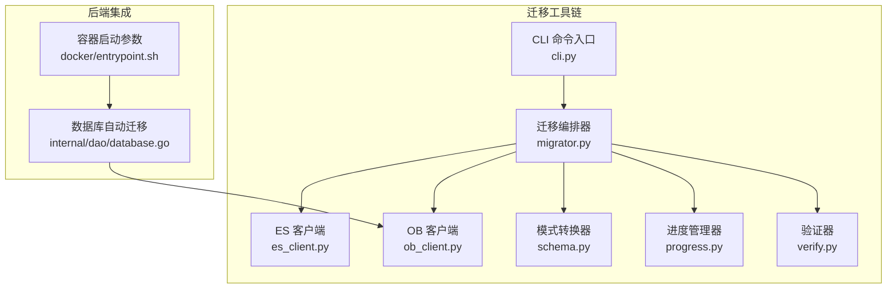
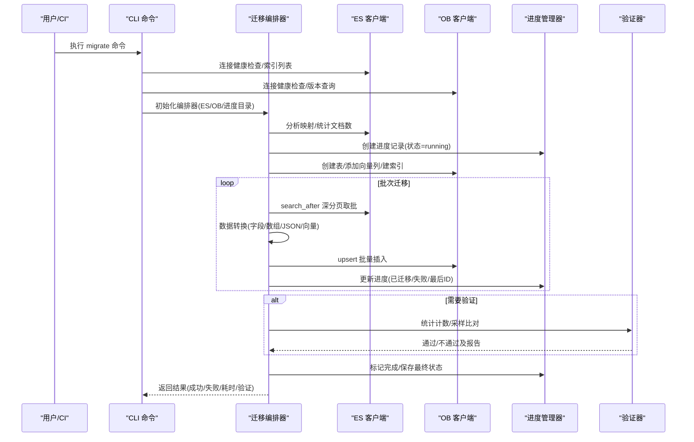
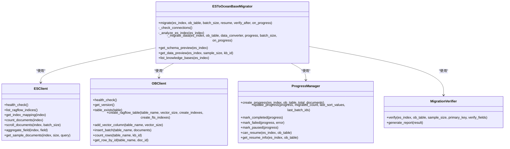
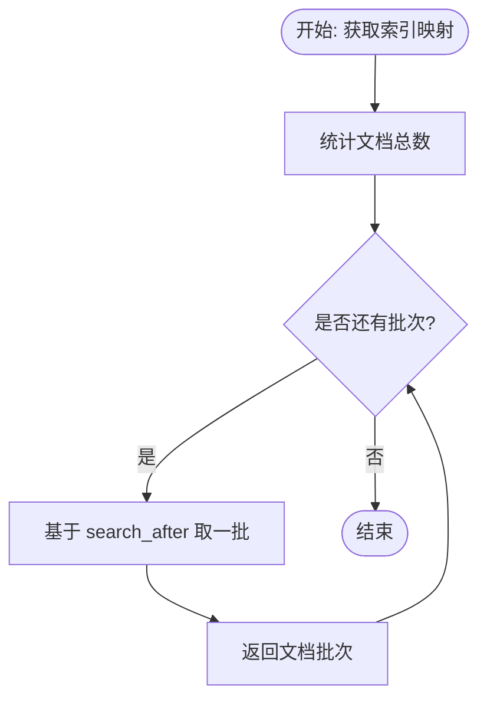
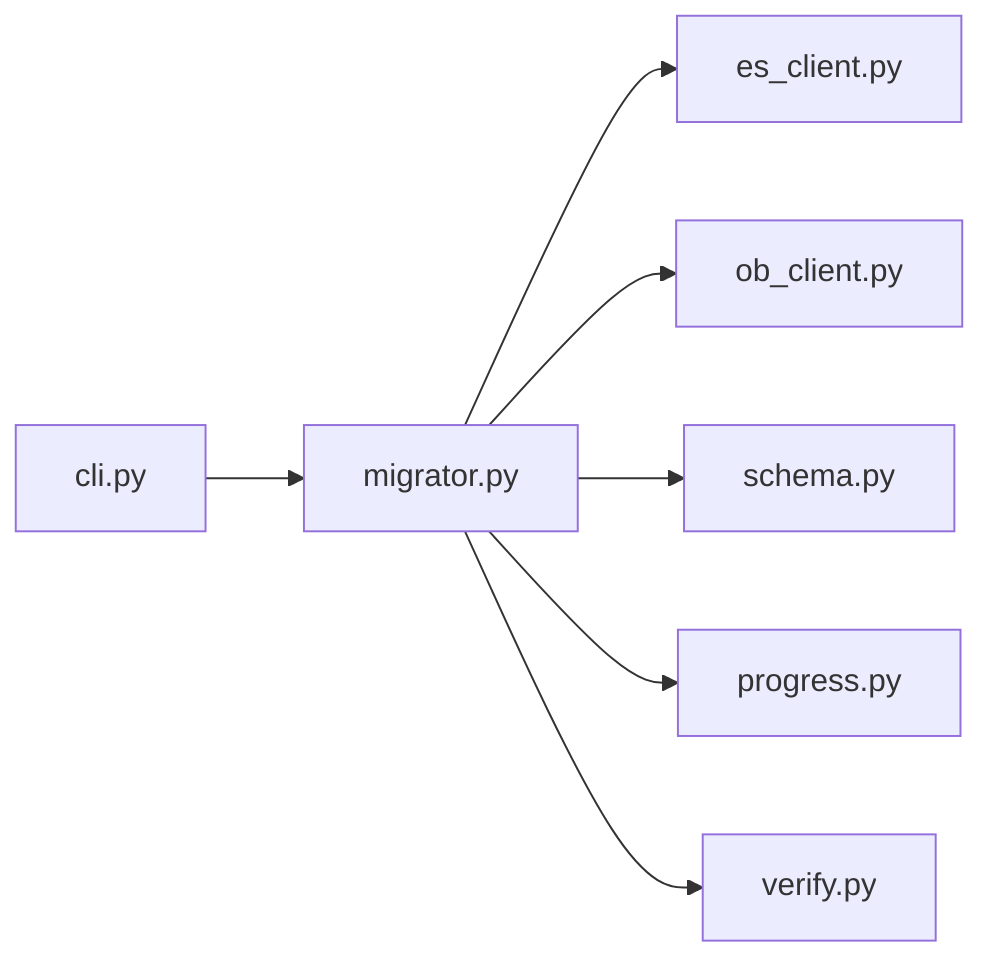
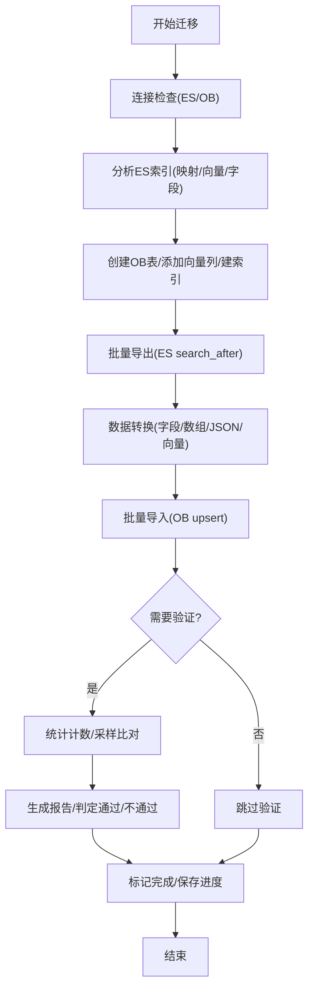

# 数据迁移策略

<cite>
**本文档引用的文件**
- [tools/es-to-oceanbase-migration/README.md](file://tools/es-to-oceanbase-migration/README.md)
- [tools/es-to-oceanbase-migration/src/es_ob_migration/__init__.py](file://tools/es-to-oceanbase-migration/src/es_ob_migration/__init__.py)
- [tools/es-to-oceanbase-migration/src/es_ob_migration/cli.py](file://tools/es-to-oceanbase-migration/src/es_ob_migration/cli.py)
- [tools/es-to-oceanbase-migration/src/es_ob_migration/migrator.py](file://tools/es-to-oceanbase-migration/src/es_ob_migration/migrator.py)
- [tools/es-to-oceanbase-migration/src/es_ob_migration/schema.py](file://tools/es-to-oceanbase-migration/src/es_ob_migration/schema.py)
- [tools/es-to-oceanbase-migration/src/es_ob_migration/es_client.py](file://tools/es-to-oceanbase-migration/src/es_ob_migration/es_client.py)
- [tools/es-to-oceanbase-migration/src/es_ob_migration/ob_client.py](file://tools/es-to-oceanbase-migration/src/es_ob_migration/ob_client.py)
- [tools/es-to-oceanbase-migration/src/es_ob_migration/progress.py](file://tools/es-to-oceanbase-migration/src/es_ob_migration/progress.py)
- [tools/es-to-oceanbase-migration/src/es_ob_migration/verify.py](file://tools/es-to-oceanbase-migration/src/es_ob_migration/verify.py)
- [tools/es-to-oceanbase-migration/tests/test_progress.py](file://tools/es-to-oceanbase-migration/tests/test_progress.py)
- [tools/es-to-oceanbase-migration/tests/test_verify.py](file://tools/es-to-oceanbase-migration/tests/test_verify.py)
- [internal/dao/database.go](file://internal/dao/database.go)
- [docker/entrypoint.sh](file://docker/entrypoint.sh)
- [docs/administrator/backup_and_migration.md](file://docs/administrator/backup_and_migration.md)
</cite>

## 目录
1. [引言](#引言)
2. [项目结构](#项目结构)
3. [核心组件](#核心组件)
4. [架构总览](#架构总览)
5. [详细组件分析](#详细组件分析)
6. [依赖关系分析](#依赖关系分析)
7. [性能考虑](#性能考虑)
8. [故障排查指南](#故障排查指南)
9. [结论](#结论)
10. [附录](#附录)

## 引言
本文件系统化阐述 RAGFlow 跨存储后端的数据迁移策略与实施方案，重点覆盖从 Elasticsearch 到 OceanBase 的迁移机制。内容包含迁移架构设计（工具链、任务调度、状态跟踪）、迁移流程（导出、格式转换、导入、一致性验证）、批量迁移工具（CLI、Web 界面工具）、验证机制（一致性检查、进度监控、错误处理与回滚策略），以及最佳实践、性能优化与风险评估。

## 项目结构
RAGFlow 的迁移能力由独立的 Python 工具模块提供，位于 tools/es-to-oceanbase-migration，围绕 CLI 命令、迁移编排器、客户端适配层、模式转换器、进度管理器与验证器构成完整工具链；同时，RAGFlow 后端在数据库层面具备自动迁移能力，支持重复运行时的安全跳过策略。

**图表来源**
- [tools/es-to-oceanbase-migration/src/es_ob_migration/cli.py:33-574](file://tools/es-to-oceanbase-migration/src/es_ob_migration/cli.py#L33-L574)
- [tools/es-to-oceanbase-migration/src/es_ob_migration/migrator.py:29-371](file://tools/es-to-oceanbase-migration/src/es_ob_migration/migrator.py#L29-L371)
- [tools/es-to-oceanbase-migration/src/es_ob_migration/es_client.py:13-293](file://tools/es-to-oceanbase-migration/src/es_ob_migration/es_client.py#L13-L293)
- [tools/es-to-oceanbase-migration/src/es_ob_migration/ob_client.py:35-442](file://tools/es-to-oceanbase-migration/src/es_ob_migration/ob_client.py#L35-L442)
- [tools/es-to-oceanbase-migration/src/es_ob_migration/schema.py:105-452](file://tools/es-to-oceanbase-migration/src/es_ob_migration/schema.py#L105-L452)
- [tools/es-to-oceanbase-migration/src/es_ob_migration/progress.py:15-220](file://tools/es-to-oceanbase-migration/src/es_ob_migration/progress.py#L15-L220)
- [tools/es-to-oceanbase-migration/src/es_ob_migration/verify.py:45-350](file://tools/es-to-oceanbase-migration/src/es_ob_migration/verify.py#L45-L350)
- [internal/dao/database.go:170-196](file://internal/dao/database.go#L170-L196)
- [docker/entrypoint.sh:1-149](file://docker/entrypoint.sh#L1-L149)

**章节来源**
- [tools/es-to-oceanbase-migration/README.md:1-500](file://tools/es-to-oceanbase-migration/README.md#L1-L500)
- [tools/es-to-oceanbase-migration/src/es_ob_migration/__init__.py:1-42](file://tools/es-to-oceanbase-migration/src/es_ob_migration/__init__.py#L1-L42)

## 核心组件
- 迁移编排器：负责连接检查、索引分析、表创建/列添加、批量迁移、进度更新、可选验证与结果汇总。
- ES/OB 客户端：封装 Elasticsearch 8+ 的 search_after 深分页与 OceanBase 的 upsert、索引创建、向量列添加等操作。
- 模式转换器：解析 ES 映射，识别已知字段、未知字段与向量维度，生成 OceanBase 列定义与数据类型转换规则。
- 进度管理器：持久化迁移进度，支持断点续传、暂停恢复、状态查询。
- 验证器：对比 ES 与 OB 文档计数与样本字段一致性，输出报告并判定通过与否。
- CLI：提供 migrate、verify、list-indices、list-kb、schema、sample、status 等子命令，支持批量索引迁移与自动化流水线。
- 后端自动迁移：GORM 自动迁移安全跳过重复索引/列/表错误，确保重复部署不会破坏现有结构。

**章节来源**
- [tools/es-to-oceanbase-migration/src/es_ob_migration/migrator.py:29-371](file://tools/es-to-oceanbase-migration/src/es_ob_migration/migrator.py#L29-L371)
- [tools/es-to-oceanbase-migration/src/es_ob_migration/es_client.py:13-293](file://tools/es-to-oceanbase-migration/src/es_ob_migration/es_client.py#L13-L293)
- [tools/es-to-oceanbase-migration/src/es_ob_migration/ob_client.py:35-442](file://tools/es-to-oceanbase-migration/src/es_ob_migration/ob_client.py#L35-L442)
- [tools/es-to-oceanbase-migration/src/es_ob_migration/schema.py:105-452](file://tools/es-to-oceanbase-migration/src/es_ob_migration/schema.py#L105-L452)
- [tools/es-to-oceanbase-migration/src/es_ob_migration/progress.py:15-220](file://tools/es-to-oceanbase-migration/src/es_ob_migration/progress.py#L15-L220)
- [tools/es-to-oceanbase-migration/src/es_ob_migration/verify.py:45-350](file://tools/es-to-oceanbase-migration/src/es_ob_migration/verify.py#L45-L350)
- [tools/es-to-oceanbase-migration/src/es_ob_migration/cli.py:33-574](file://tools/es-to-oceanbase-migration/src/es_ob_migration/cli.py#L33-L574)
- [internal/dao/database.go:170-196](file://internal/dao/database.go#L170-L196)

## 架构总览
迁移架构采用“CLI → 编排器 → 客户端 → 存储”的分层设计，ES 使用 search_after 实现高效深分页，OB 使用 upsert 批量写入并自动维护索引。编排器贯穿迁移全生命周期，进度文件持久化到本地目录，便于中断恢复与审计。

**图表来源**
- [tools/es-to-oceanbase-migration/src/es_ob_migration/cli.py:67-194](file://tools/es-to-oceanbase-migration/src/es_ob_migration/cli.py#L67-L194)
- [tools/es-to-oceanbase-migration/src/es_ob_migration/migrator.py:56-226](file://tools/es-to-oceanbase-migration/src/es_ob_migration/migrator.py#L56-L226)
- [tools/es-to-oceanbase-migration/src/es_ob_migration/es_client.py:177-234](file://tools/es-to-oceanbase-migration/src/es_ob_migration/es_client.py#L177-L234)
- [tools/es-to-oceanbase-migration/src/es_ob_migration/ob_client.py:348-372](file://tools/es-to-oceanbase-migration/src/es_ob_migration/ob_client.py#L348-L372)
- [tools/es-to-oceanbase-migration/src/es_ob_migration/progress.py:121-196](file://tools/es-to-oceanbase-migration/src/es_ob_migration/progress.py#L121-L196)
- [tools/es-to-oceanbase-migration/src/es_ob_migration/verify.py:69-125](file://tools/es-to-oceanbase-migration/src/es_ob_migration/verify.py#L69-L125)

## 详细组件分析

### 迁移编排器（ESToOceanBaseMigrator）
- 负责迁移全流程编排：连接检查、ES 索引分析、OB 表创建/列添加、批量迁移、进度更新、可选验证与结果汇总。
- 支持断点续迁：读取进度文件，跳过已完成批次，从上次位置继续。
- 提供预览能力：schema 预览、数据样本预览、知识库聚合列表。

**图表来源**
- [tools/es-to-oceanbase-migration/src/es_ob_migration/migrator.py:29-371](file://tools/es-to-oceanbase-migration/src/es_ob_migration/migrator.py#L29-L371)
- [tools/es-to-oceanbase-migration/src/es_ob_migration/es_client.py:13-293](file://tools/es-to-oceanbase-migration/src/es_ob_migration/es_client.py#L13-L293)
- [tools/es-to-oceanbase-migration/src/es_ob_migration/ob_client.py:35-442](file://tools/es-to-oceanbase-migration/src/es_ob_migration/ob_client.py#L35-L442)
- [tools/es-to-oceanbase-migration/src/es_ob_migration/progress.py:49-220](file://tools/es-to-oceanbase-migration/src/es_ob_migration/progress.py#L49-L220)
- [tools/es-to-oceanbase-migration/src/es_ob_migration/verify.py:45-350](file://tools/es-to-oceanbase-migration/src/es_ob_migration/verify.py#L45-L350)

**章节来源**
- [tools/es-to-oceanbase-migration/src/es_ob_migration/migrator.py:56-226](file://tools/es-to-oceanbase-migration/src/es_ob_migration/migrator.py#L56-L226)

### ES 客户端（ESClient）
- 支持 ES 8+ 的 search_after 深分页滚动，避免 scroll API 的限制。
- 提供索引映射、设置、文档计数、聚合、样本获取等能力，用于迁移前分析与验证。

**图表来源**
- [tools/es-to-oceanbase-migration/src/es_ob_migration/es_client.py:177-234](file://tools/es-to-oceanbase-migration/src/es_ob_migration/es_client.py#L177-L234)

**章节来源**
- [tools/es-to-oceanbase-migration/src/es_ob_migration/es_client.py:91-234](file://tools/es-to-oceanbase-migration/src/es_ob_migration/es_client.py#L91-L234)

### OB 客户端（OBClient）
- 创建 RAGFlow 兼容表，包含固定列、索引与向量列；支持向量列增量添加与索引创建。
- 使用 upsert 批量写入，支持按 kb_id 过滤计数与样本查询。

**章节来源**
- [tools/es-to-oceanbase-migration/src/es_ob_migration/ob_client.py:104-372](file://tools/es-to-oceanbase-migration/src/es_ob_migration/ob_client.py#L104-L372)

### 模式转换器（SchemaConverter/DataConverter）
- 解析 ES 映射，识别已知字段、未知字段与向量字段，推断向量维度。
- 将 ES 文档转换为 OB 行格式，处理数组、JSON、字符串、整型、浮点、文本与向量等类型。

**章节来源**
- [tools/es-to-oceanbase-migration/src/es_ob_migration/schema.py:117-446](file://tools/es-to-oceanbase-migration/src/es_ob_migration/schema.py#L117-L446)

### 进度管理器（ProgressManager）
- 以 JSON 文件形式持久化迁移进度，包含总文档数、已迁移数、失败数、最后批次 ID、状态与时间戳。
- 支持创建、更新、完成、失败、暂停标记，以及断点续迁信息查询。

**章节来源**
- [tools/es-to-oceanbase-migration/src/es_ob_migration/progress.py:49-220](file://tools/es-to-oceanbase-migration/src/es_ob_migration/progress.py#L49-L220)
- [tools/es-to-oceanbase-migration/tests/test_progress.py:44-261](file://tools/es-to-oceanbase-migration/tests/test_progress.py#L44-L261)

### 验证器（MigrationVerifier）
- 对比 ES 与 OB 的文档计数与样本字段一致性，支持数组/JSON/文本/向量等字段的特殊比较逻辑。
- 输出结构化报告，给出通过/不通过结论与问题清单。

**章节来源**
- [tools/es-to-oceanbase-migration/src/es_ob_migration/verify.py:69-350](file://tools/es-to-oceanbase-migration/src/es_ob_migration/verify.py#L69-L350)
- [tools/es-to-oceanbase-migration/tests/test_verify.py:83-254](file://tools/es-to-oceanbase-migration/tests/test_verify.py#L83-L254)

### CLI 工具链
- migrate：单索引或多索引批量迁移，支持断点续迁、批量大小、验证开关与进度目录。
- verify：独立验证 ES 与 OB 的一致性。
- list-indices/list-kb/schema/sample/status：辅助诊断与预览。

**章节来源**
- [tools/es-to-oceanbase-migration/src/es_ob_migration/cli.py:33-574](file://tools/es-to-oceanbase-migration/src/es_ob_migration/cli.py#L33-L574)

### 后端自动迁移与容器集成
- GORM 自动迁移安全跳过重复索引/列/表错误，保证重复部署安全。
- 容器启动参数支持禁用 Web 服务、任务执行器、数据同步器等组件，便于迁移期间隔离环境。

**章节来源**
- [internal/dao/database.go:170-196](file://internal/dao/database.go#L170-L196)
- [docker/entrypoint.sh:6-149](file://docker/entrypoint.sh#L6-L149)

## 依赖关系分析
- 组件内聚性高：编排器聚合 ES/OB 客户端、模式转换器、进度管理器与验证器。
- 外部依赖清晰：ES 使用官方 Python SDK；OB 使用 pyobvector 与 SQLAlchemy 类型映射。
- 无循环依赖：各模块职责单一，接口稳定。

**图表来源**
- [tools/es-to-oceanbase-migration/src/es_ob_migration/__init__.py:12-41](file://tools/es-to-oceanbase-migration/src/es_ob_migration/__init__.py#L12-L41)

**章节来源**
- [tools/es-to-oceanbase-migration/src/es_ob_migration/__init__.py:12-41](file://tools/es-to-oceanbase-migration/src/es_ob_migration/__init__.py#L12-L41)

## 性能考虑
- 深分页效率：ES 使用 search_after 替代 scroll，避免深度分页的性能退化。
- 批量写入：OB upsert 批量插入，减少网络往返与事务开销。
- 索引策略：按需创建常规索引、全文索引与向量索引，平衡查询性能与写入成本。
- 内存与并发：合理设置批量大小与连接池大小，避免内存峰值与连接争用。
- 数据类型转换：针对数组/JSON/文本进行必要的序列化与清洗，降低写入失败率。

[本节为通用指导，无需特定文件引用]

## 故障排查指南
- 连接失败
  - 使用 status 命令检查 ES 与 OB 连接与版本。
  - 确认认证方式（API Key 或用户名密码）与 SSL 设置。
- 迁移中断
  - 使用 --resume 参数自动恢复；检查进度文件是否存在且状态有效。
  - 若状态异常，可手动删除进度文件后重新开始。
- 验证失败
  - 查看验证报告中的缺失项与差异字段，定位数据不一致原因。
  - 检查数组/JSON 字段的序列化差异与空值处理。
- 索引/列冲突
  - OB 表已存在会中止迁移以防数据冲突；请先清理或更换表名。
  - GORM 自动迁移会跳过重复索引/列/表错误，避免重复部署破坏结构。

**章节来源**
- [tools/es-to-oceanbase-migration/src/es_ob_migration/cli.py:478-521](file://tools/es-to-oceanbase-migration/src/es_ob_migration/cli.py#L478-L521)
- [tools/es-to-oceanbase-migration/src/es_ob_migration/migrator.py:133-143](file://tools/es-to-oceanbase-migration/src/es_ob_migration/migrator.py#L133-L143)
- [tools/es-to-oceanbase-migration/src/es_ob_migration/verify.py:260-295](file://tools/es-to-oceanbase-migration/src/es_ob_migration/verify.py#L260-L295)
- [internal/dao/database.go:170-196](file://internal/dao/database.go#L170-L196)

## 结论
RAGFlow 的数据迁移策略以 CLI 工具链为核心，结合编排器、客户端、模式转换、进度管理与验证器，形成完整的跨存储后端迁移闭环。其特性包括：RAGFlow 专属模式、ES 8+ 深分页、向量字段自动识别、批量 upsert、断点续迁、一致性验证与报告输出。配合后端 GORM 自动迁移的安全跳过机制与容器启动参数的环境隔离，可实现低风险、可审计、可恢复的生产级迁移。

## 附录

### 迁移流程图（导出/转换/导入/验证）

**图表来源**
- [tools/es-to-oceanbase-migration/src/es_ob_migration/migrator.py:94-226](file://tools/es-to-oceanbase-migration/src/es_ob_migration/migrator.py#L94-L226)
- [tools/es-to-oceanbase-migration/src/es_ob_migration/verify.py:69-125](file://tools/es-to-oceanbase-migration/src/es_ob_migration/verify.py#L69-L125)

### 最佳实践
- 迁移窗口规划：选择业务低峰期，预留验证与回滚时间。
- 批量大小调优：根据集群资源与网络状况调整 batch-size，观察失败率与延迟。
- 断点续迁：启用 --resume，确保进度文件可访问且权限正确。
- 验证策略：开启 --verify，设置合理的样本规模，关注计数差异与字段匹配率。
- 回滚准备：保留 ES 原始索引与进度文件，必要时可回退至 ES。

**章节来源**
- [tools/es-to-oceanbase-migration/README.md:15-500](file://tools/es-to-oceanbase-migration/README.md#L15-L500)

### 风险评估与缓解
- 数据不一致：通过验证器与报告发现差异，优先修复关键字段映射。
- 写入失败：检查数据类型转换与空值处理，必要时预清洗。
- 中断风险：使用断点续迁与进度文件，避免重复写入。
- 索引冲突：迁移前清理或重命名目标表，遵循安全跳过策略。

**章节来源**
- [tools/es-to-oceanbase-migration/src/es_ob_migration/verify.py:260-295](file://tools/es-to-oceanbase-migration/src/es_ob_migration/verify.py#L260-L295)
- [internal/dao/database.go:170-196](file://internal/dao/database.go#L170-L196)