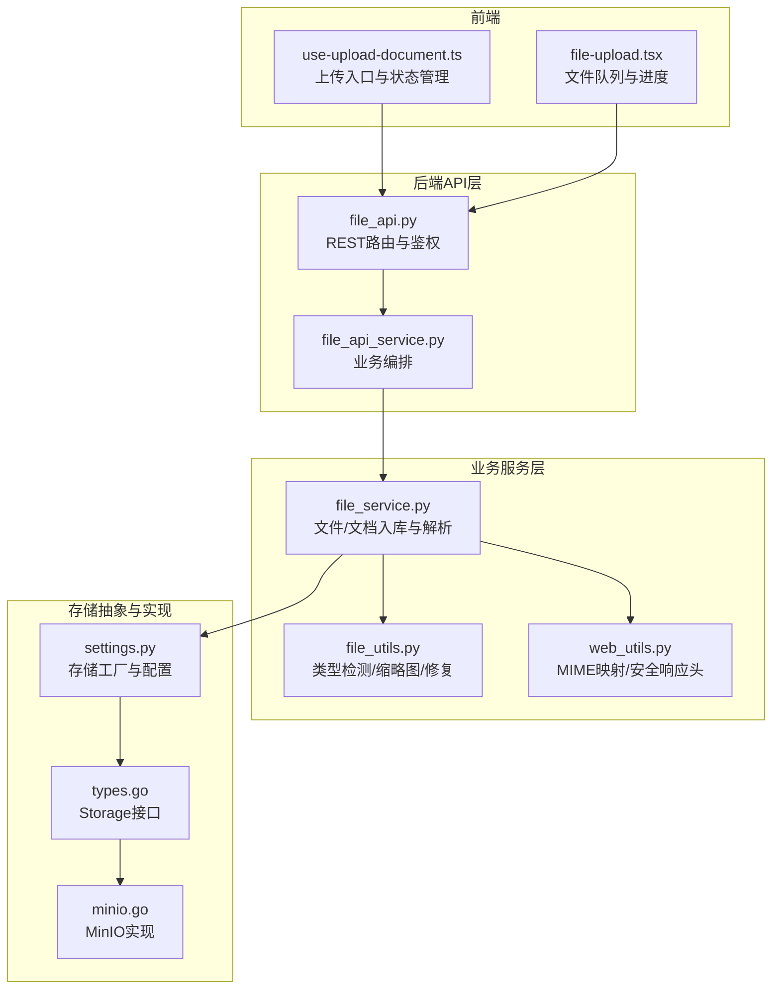
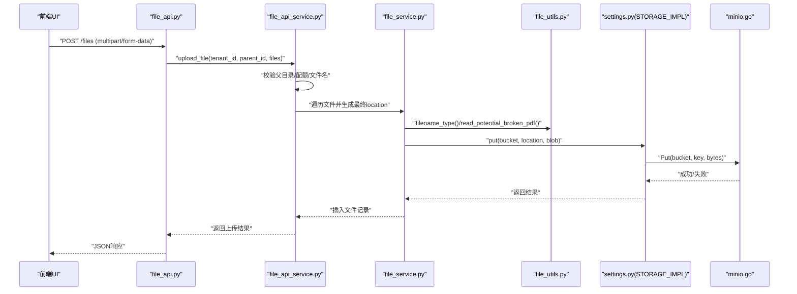
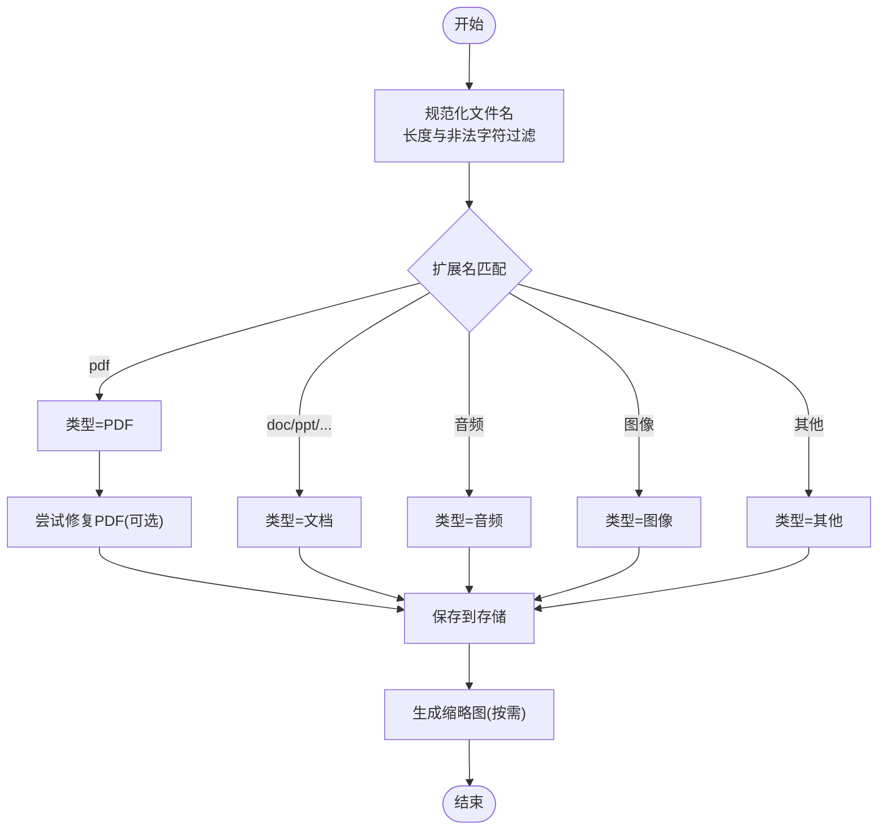
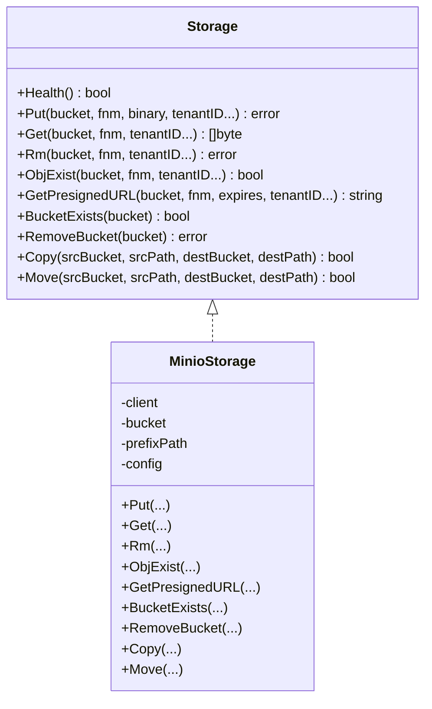

# 文档上传流程

<cite>
**本文引用的文件**
- [api/apps/restful_apis/file_api.py](file://api/apps/restful_apis/file_api.py)
- [api/apps/services/file_api_service.py](file://api/apps/services/file_api_service.py)
- [api/db/services/file_service.py](file://api/db/services/file_service.py)
- [api/utils/file_utils.py](file://api/utils/file_utils.py)
- [api/utils/web_utils.py](file://api/utils/web_utils.py)
- [common/settings.py](file://common/settings.py)
- [internal/storage/types.go](file://internal/storage/types.go)
- [internal/storage/minio.go](file://internal/storage/minio.go)
- [api/constants.py](file://api/constants.py)
- [test/testcases/test_http_api/test_file_app/test_file_routes.py](file://test/testcases/test_http_api/test_file_app/test_file_routes.py)
- [test/testcases/test_web_api/test_document_app/test_upload_info_unit.py](file://test/testcases/test_web_api/test_document_app/test_upload_info_unit.py)
- [web/src/pages/dataset/dataset/use-upload-document.ts](file://web/src/pages/dataset/dataset/use-upload-document.ts)
- [web/src/components/file-upload.tsx](file://web/src/components/file-upload.tsx)
</cite>

## 目录
1. [简介](#简介)
2. [项目结构](#项目结构)
3. [核心组件](#核心组件)
4. [架构总览](#架构总览)
5. [详细组件分析](#详细组件分析)
6. [依赖分析](#依赖分析)
7. [性能考虑](#性能考虑)
8. [故障排查指南](#故障排查指南)
9. [结论](#结论)
10. [附录](#附录)

## 简介
本文件面向RAGFlow中文档从上传到存储的完整流程，系统化阐述以下关键主题：
- 文件类型检测机制：基于扩展名的二进制头部识别、MIME类型映射与文件格式验证
- 文件大小限制与验证规则：单文件大小限制、批量上传限制、格式兼容性检查
- 临时存储机制：内存缓存策略、临时文件管理、存储清理机制
- 并发上传处理：多线程上传、进度跟踪、错误恢复、断点续传
- 配置示例、性能优化建议与常见问题解决方案

## 项目结构
RAGFlow采用前后端分离与多语言混合架构，文档上传涉及如下层次：
- 前端（React）：负责用户交互、文件选择、进度展示与错误提示
- 后端API层（Python Quart）：接收请求、参数校验、权限控制与路由分发
- 业务服务层（Python）：封装文件操作、数据库与存储接口调用
- 存储抽象层（Go接口 + 多实现）：统一Put/Get/Rm/ObjExist等能力
- 存储实现（如MinIO）：具体对象存储后端

图表来源
- [api/apps/restful_apis/file_api.py:43-96](file://api/apps/restful_apis/file_api.py#L43-L96)
- [api/apps/services/file_api_service.py:32-102](file://api/apps/services/file_api_service.py#L32-L102)
- [api/db/services/file_service.py:432-518](file://api/db/services/file_service.py#L432-L518)
- [api/utils/file_utils.py:46-80](file://api/utils/file_utils.py#L46-L80)
- [api/utils/web_utils.py:46-104](file://api/utils/web_utils.py#L46-L104)
- [internal/storage/types.go:65-102](file://internal/storage/types.go#L65-L102)
- [internal/storage/minio.go:130-168](file://internal/storage/minio.go#L130-L168)
- [common/settings.py:158-171](file://common/settings.py#L158-L171)

章节来源
- [api/apps/restful_apis/file_api.py:43-96](file://api/apps/restful_apis/file_api.py#L43-L96)
- [api/apps/services/file_api_service.py:32-102](file://api/apps/services/file_api_service.py#L32-L102)
- [api/db/services/file_service.py:432-518](file://api/db/services/file_service.py#L432-L518)
- [api/utils/file_utils.py:46-80](file://api/utils/file_utils.py#L46-L80)
- [api/utils/web_utils.py:46-104](file://api/utils/web_utils.py#L46-L104)
- [internal/storage/types.go:65-102](file://internal/storage/types.go#L65-L102)
- [internal/storage/minio.go:130-168](file://internal/storage/minio.go#L130-L168)
- [common/settings.py:158-171](file://common/settings.py#L158-L171)

## 核心组件
- 文件API控制器：负责接收multipart/form-data或JSON创建请求，进行基础参数校验与鉴权
- 文件服务编排：根据父目录、路径与文件名生成最终存储位置，执行去重与冲突处理
- 文件服务实现：完成文档入库、内容哈希、缩略图生成、存储写入与任务调度
- 类型检测工具：基于扩展名的文件类型判定，支持PDF修复与缩略图生成
- MIME映射与安全响应头：根据扩展名生成Content-Type并应用安全下载头
- 存储抽象与实现：统一接口屏蔽MinIO/GCS/S3等差异，提供Put/Get/Rm/ObjExist等能力

章节来源
- [api/apps/restful_apis/file_api.py:43-96](file://api/apps/restful_apis/file_api.py#L43-L96)
- [api/apps/services/file_api_service.py:32-102](file://api/apps/services/file_api_service.py#L32-L102)
- [api/db/services/file_service.py:432-518](file://api/db/services/file_service.py#L432-L518)
- [api/utils/file_utils.py:46-80](file://api/utils/file_utils.py#L46-L80)
- [api/utils/web_utils.py:46-104](file://api/utils/web_utils.py#L46-L104)
- [internal/storage/types.go:65-102](file://internal/storage/types.go#L65-L102)
- [internal/storage/minio.go:130-168](file://internal/storage/minio.go#L130-L168)

## 架构总览
下图展示了从浏览器到存储系统的端到端上传链路，包含类型检测、MIME映射、并发处理与存储落盘。

图表来源
- [api/apps/restful_apis/file_api.py:66-81](file://api/apps/restful_apis/file_api.py#L66-L81)
- [api/apps/services/file_api_service.py:50-102](file://api/apps/services/file_api_service.py#L50-L102)
- [api/db/services/file_service.py:483-486](file://api/db/services/file_service.py#L483-L486)
- [api/utils/file_utils.py:200-237](file://api/utils/file_utils.py#L200-L237)
- [common/settings.py:314-335](file://common/settings.py#L314-L335)
- [internal/storage/minio.go:130-168](file://internal/storage/minio.go#L130-L168)

## 详细组件分析

### 文件类型检测与MIME映射
- 扩展名驱动的类型判定：通过正则匹配扩展名，归类为PDF、文档、音频、图像等类型
- PDF修复与鲁棒性：对潜在损坏的PDF尝试Ghostscript修复，避免解析失败
- 缩略图生成：针对PDF、图片等生成小尺寸预览图，限制最大体积防止内存溢出
- MIME映射与安全下载头：根据扩展名生成Content-Type，并在下载时应用安全响应头

图表来源
- [api/utils/file_utils.py:46-80](file://api/utils/file_utils.py#L46-L80)
- [api/utils/file_utils.py:200-237](file://api/utils/file_utils.py#L200-L237)
- [api/utils/file_utils.py:83-147](file://api/utils/file_utils.py#L83-L147)
- [api/utils/web_utils.py:46-104](file://api/utils/web_utils.py#L46-L104)

章节来源
- [api/utils/file_utils.py:46-80](file://api/utils/file_utils.py#L46-L80)
- [api/utils/file_utils.py:200-237](file://api/utils/file_utils.py#L200-L237)
- [api/utils/file_utils.py:83-147](file://api/utils/file_utils.py#L83-L147)
- [api/utils/web_utils.py:46-104](file://api/utils/web_utils.py#L46-L104)

### 文件大小限制与验证规则
- 单文件大小限制：通过环境变量控制最大内容长度，用于限制上传体大小
- 批量上传限制：通过环境变量限制每个用户的文件数量
- 格式兼容性检查：仅允许已知扩展名的文件进入后续流程，未知类型直接拒绝
- 资源保护：对缩略图与PDF修复设置上限，避免DoS与内存溢出

章节来源
- [common/settings.py:362-365](file://common/settings.py#L362-L365)
- [api/apps/services/file_api_service.py:51-53](file://api/apps/services/file_api_service.py#L51-L53)
- [api/utils/file_utils.py:37-39](file://api/utils/file_utils.py#L37-L39)
- [api/constants.py:26](file://api/constants.py#L26)

### 临时存储机制与清理
- 临时缓存策略：上传信息接口会将文件先写入“下载”桶中，便于后续预览与下载
- 临时文件管理：使用UUID作为临时键，结合时间戳与用户标识，确保唯一性
- 存储清理：删除文档时同步清理对应对象存储中的文件；删除文件夹时递归清理

章节来源
- [api/db/services/file_service.py:572-580](file://api/db/services/file_service.py#L572-L580)
- [api/db/services/file_service.py:582-625](file://api/db/services/file_service.py#L582-L625)
- [api/db/services/file_service.py:628-685](file://api/db/services/file_service.py#L628-L685)

### 并发上传与进度跟踪
- 多线程上传：服务层使用线程池执行磁盘读取、存储写入与数据库操作，提升吞吐
- 进度跟踪：前端组件维护文件队列与进度状态，支持逐个文件的上传进度展示
- 错误恢复：对单个文件失败进行隔离，不影响其他文件的处理
- 断点续传：当前实现未见服务端断点续传逻辑，建议客户端分片+服务端校验以实现

章节来源
- [api/apps/services/file_api_service.py:50-102](file://api/apps/services/file_api_service.py#L50-L102)
- [web/src/components/file-upload.tsx:55-160](file://web/src/components/file-upload.tsx#L55-L160)

### 下载与预览流程
- 下载接口：根据文件元数据获取存储桶与键，生成安全响应头并返回二进制流
- 预览：对于图片与文本文件，支持直接返回Base64或解析后的文本内容

章节来源
- [api/apps/restful_apis/file_api.py:258-300](file://api/apps/restful_apis/file_api.py#L258-L300)
- [api/db/services/file_service.py:688-709](file://api/db/services/file_service.py#L688-L709)

## 依赖分析
- 接口与实现解耦：Go定义的Storage接口屏蔽不同云厂商差异，Python侧通过工厂模式注入具体实现
- 配置驱动：存储实现由环境变量决定，运行时动态创建实例
- 前后端协作：前端负责UI与进度，后端负责类型检测、存储与数据库一致性

图表来源
- [internal/storage/types.go:65-102](file://internal/storage/types.go#L65-L102)
- [internal/storage/minio.go:33-387](file://internal/storage/minio.go#L33-L387)

章节来源
- [internal/storage/types.go:65-102](file://internal/storage/types.go#L65-L102)
- [internal/storage/minio.go:33-387](file://internal/storage/minio.go#L33-L387)
- [common/settings.py:158-171](file://common/settings.py#L158-L171)

## 性能考虑
- 线程池与异步：服务层使用线程池执行I/O密集型任务，避免阻塞主协程
- 存储幂等与去重：通过对象存在性检查与重命名策略避免重复写入
- 缓存与预览：缩略图与临时下载桶减少重复解析成本
- 超时与重试：存储实现内置重试与健康检查，提升稳定性

## 故障排查指南
- 上传失败但部分成功：前端根据返回码区分全部失败与部分成功，提示用户保留成功项
- 不支持的文件类型：当类型检测返回“其他”时，直接拒绝并提示不支持
- 用户配额超限：当用户文件数达到上限时，返回明确错误信息
- 下载异常：检查Content-Type与扩展名映射是否正确，确认对象存在性

章节来源
- [web/src/pages/dataset/dataset/use-upload-document.ts:35-58](file://web/src/pages/dataset/dataset/use-upload-document.ts#L35-L58)
- [test/testcases/test_web_api/test_document_app/test_upload_info_unit.py:118-139](file://test/testcases/test_web_api/test_document_app/test_upload_info_unit.py#L118-L139)
- [test/testcases/test_http_api/test_file_app/test_file_routes.py:202-211](file://test/testcases/test_http_api/test_file_app/test_file_routes.py#L202-L211)

## 结论
RAGFlow的文档上传流程以类型检测与MIME映射为核心，结合线程池并发与存储抽象，实现了稳定高效的文件入库与存储。通过环境变量与配置工厂，系统具备良好的可扩展性与可运维性。建议在后续版本中引入断点续传与更细粒度的配额控制，进一步提升用户体验与安全性。

## 附录
- 配置示例
  - 最大内容长度：通过环境变量设置单文件最大大小
  - 批量上传限制：通过环境变量设置用户最大文件数量
  - 存储实现：通过环境变量选择MinIO/GCS/S3等后端
- 建议
  - 引入客户端分片与服务端校验，实现断点续传
  - 对高并发场景增加队列与限速策略
  - 完善日志与指标埋点，定位性能瓶颈