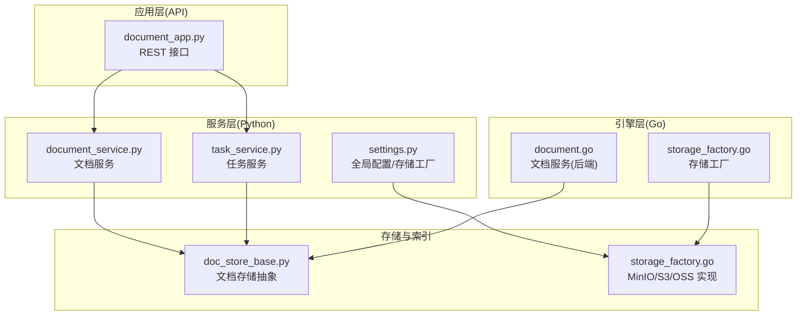
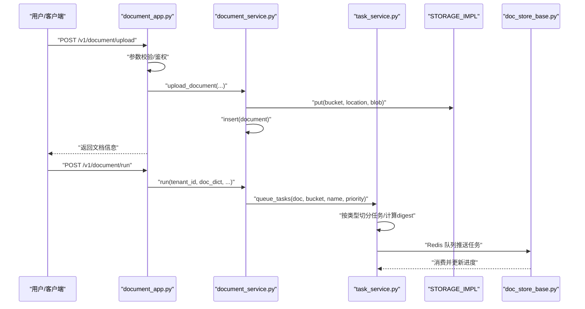
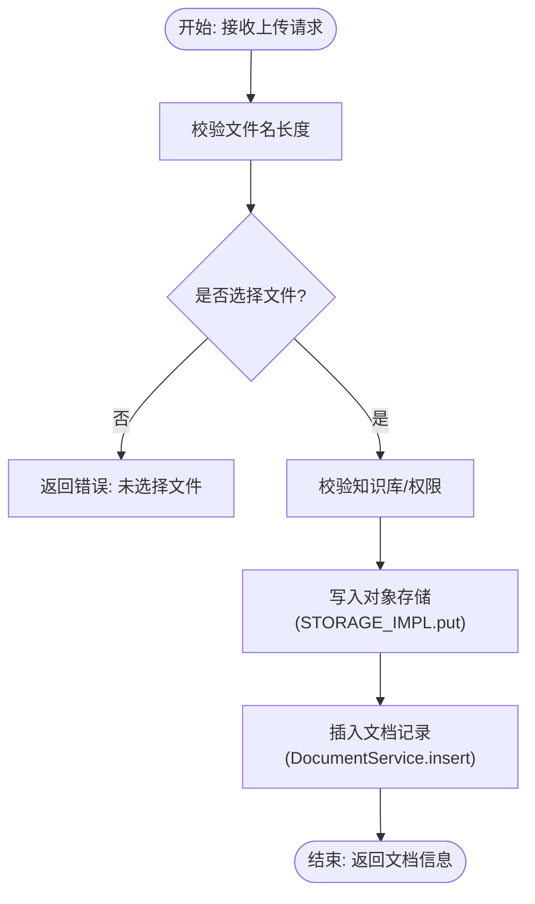
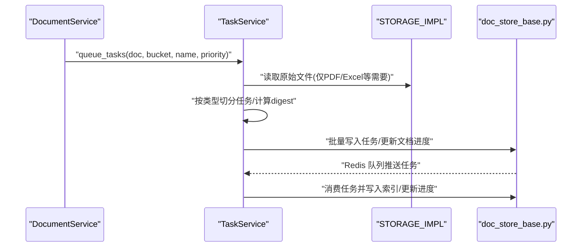
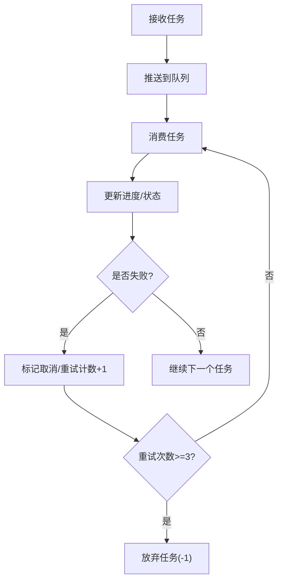
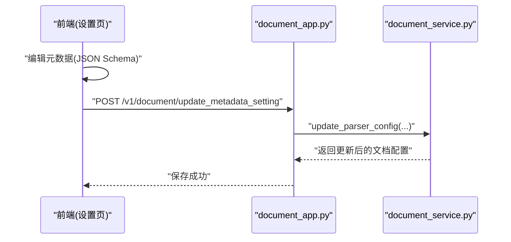
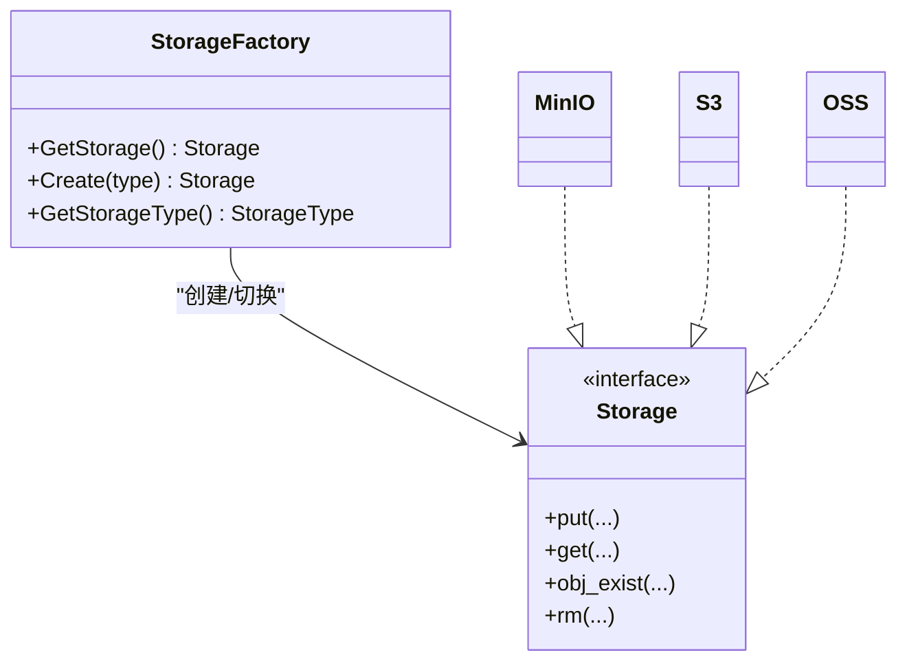
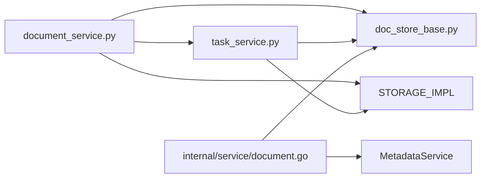

# 文档存储管理

<cite>
**本文引用的文件**
- [document_app.py](file://api/apps/document_app.py)
- [document_service.py](file://api/db/services/document_service.py)
- [task_service.py](file://api/db/services/task_service.py)
- [doc_store_base.py](file://common/doc_store/doc_store_base.py)
- [storage_factory.go](file://internal/storage/storage_factory.go)
- [settings.py](file://common/settings.py)
- [document.go](file://internal/service/document.go)
- [__init__.py](file://deepdoc/parser/__init__.py)
- [progress.py](file://tools/es-to-oceanbase-migration/src/es_ob_migration/progress.py)
- [test_parse_documents.py](file://test/testcases/test_sdk_api/test_file_management_within_dataset/test_parse_documents.py)
- [test_parse_documents.py](file://test/testcases/test_http_api/test_file_management_within_dataset/test_parse_documents.py)
- [common-item.tsx](file://web/src/pages/dataset/dataset-setting/configuration/common-item.tsx)
- [use-manage-modal.ts](file://web/src/pages/dataset/components/metedata/hooks/use-manage-modal.ts)
- [manage-modal.tsx](file://web/src/pages/dataset/components/metedata/manage-modal.tsx)
</cite>

## 目录
1. [引言](#引言)
2. [项目结构](#项目结构)
3. [核心组件](#核心组件)
4. [架构总览](#架构总览)
5. [详细组件分析](#详细组件分析)
6. [依赖分析](#依赖分析)
7. [性能考虑](#性能考虑)
8. [故障排查指南](#故障排查指南)
9. [结论](#结论)
10. [附录](#附录)

## 引言
本技术文档围绕 RAGFlow 中“文档存储管理”的完整生命周期进行系统化梳理，覆盖文档上传、格式校验、并发解析、进度追踪、错误恢复、版本控制、跨存储迁移、元数据管理与导出、配置与性能优化、以及故障恢复策略。文档面向开发者与运维人员，既提供代码级实现细节，也给出可操作的实践建议。

## 项目结构
RAGFlow 的文档存储管理由三层协同完成：
- 应用层（API）：负责请求接入、参数校验、鉴权与调用服务层。
- 服务层（Python）：封装数据库、存储、解析与任务队列等业务逻辑。
- 引擎层（Go）：提供文档服务、元数据聚合与检索能力。

图表来源
- [document_app.py:67-114](file://api/apps/document_app.py#L67-L114)
- [document_service.py:396-401](file://api/db/services/document_service.py#L396-L401)
- [task_service.py:355-460](file://api/db/services/task_service.py#L355-L460)
- [doc_store_base.py:143-271](file://common/doc_store/doc_store_base.py#L143-L271)
- [storage_factory.go:31-171](file://internal/storage/storage_factory.go#L31-L171)
- [settings.py:287-312](file://common/settings.py#L287-L312)

章节来源
- [document_app.py:67-114](file://api/apps/document_app.py#L67-L114)
- [document_service.py:396-401](file://api/db/services/document_service.py#L396-L401)
- [task_service.py:355-460](file://api/db/services/task_service.py#L355-L460)
- [doc_store_base.py:143-271](file://common/doc_store/doc_store_base.py#L143-L271)
- [storage_factory.go:31-171](file://internal/storage/storage_factory.go#L31-L171)
- [settings.py:287-312](file://common/settings.py#L287-L312)

## 核心组件
- 文档上传与校验：接收文件或 URL，执行名称长度、类型、权限校验，并写入对象存储与数据库。
- 解析与任务编排：根据文档类型与解析器配置生成任务切片，支持并发与重用已解析块。
- 进度与状态：统一记录文档与任务进度、运行状态、失败信息，支持取消与重试。
- 元数据管理：自动/手动元数据生成、聚合、过滤、导出与前端可视化配置。
- 存储与索引：抽象文档存储接口，支持多种后端；统一索引命名与查询。
- 跨存储迁移：提供进度跟踪、断点续传、回滚与验证机制。

章节来源
- [document_app.py:67-114](file://api/apps/document_app.py#L67-L114)
- [document_service.py:792-800](file://api/db/services/document_service.py#L792-L800)
- [task_service.py:355-460](file://api/db/services/task_service.py#L355-L460)
- [doc_store_base.py:143-271](file://common/doc_store/doc_store_base.py#L143-L271)
- [storage_factory.go:31-171](file://internal/storage/storage_factory.go#L31-L171)
- [settings.py:287-312](file://common/settings.py#L287-L312)

## 架构总览
下图展示从用户上传到解析入库的关键交互路径，以及与存储、索引、任务队列的关系。

图表来源
- [document_app.py:67-114](file://api/apps/document_app.py#L67-L114)
- [document_service.py:396-401](file://api/db/services/document_service.py#L396-L401)
- [task_service.py:355-460](file://api/db/services/task_service.py#L355-L460)
- [doc_store_base.py:191-236](file://common/doc_store/doc_store_base.py#L191-L236)

## 详细组件分析

### 组件一：文档上传与校验
- 文件类型检测与大小限制：对文件名长度、空文件、URL 格式进行校验；通过知识库权限检查与租户配额控制。
- 临时存储与去重：使用对象存储实现二进制写入，重复文件名自动追加后缀；缩略图生成与持久化。
- 返回结构：包含文档 ID、名称、类型、大小、解析器 ID、位置等关键字段。

图表来源
- [document_app.py:67-114](file://api/apps/document_app.py#L67-L114)
- [document_service.py:396-401](file://api/db/services/document_service.py#L396-L401)

章节来源
- [document_app.py:67-114](file://api/apps/document_app.py#L67-L114)
- [document_service.py:396-401](file://api/db/services/document_service.py#L396-L401)

### 组件二：文档解析与任务编排
- 多格式支持：PDF、Excel、HTML、JSON、Markdown、TXT、EPUB 等，解析器在 deepdoc/parser 中统一导出。
- 并发与切片：PDF 按页范围切片，Excel 按行范围切片；非结构化文档整文切片；每片任务携带 digest 用于复用。
- 任务重用：若上一次任务配置与页/行范围一致且已完成，则直接复用其块 ID，避免重复解析。
- 任务队列：通过 Redis 推送未完成任务，消费端持续更新进度与状态。

图表来源
- [task_service.py:355-460](file://api/db/services/task_service.py#L355-L460)
- [__init__.py:17-41](file://deepdoc/parser/__init__.py#L17-L41)

章节来源
- [task_service.py:355-460](file://api/db/services/task_service.py#L355-L460)
- [__init__.py:17-41](file://deepdoc/parser/__init__.py#L17-L41)

### 组件三：进度跟踪与错误恢复
- 进度规则：进度消息追加并限制行数；进度值更新遵循严格条件，防止回退；记录处理时长。
- 取消与重试：通过 Redis 标记取消；超过最大重试次数标记放弃；失败状态与消息持久化。
- 前端展示：列表页与详情页均显示进度、状态、运行时长与错误信息。

图表来源
- [task_service.py:298-347](file://api/db/services/task_service.py#L298-L347)
- [task_service.py:509-524](file://api/db/services/task_service.py#L509-L524)

章节来源
- [task_service.py:298-347](file://api/db/services/task_service.py#L298-L347)
- [task_service.py:509-524](file://api/db/services/task_service.py#L509-L524)

### 组件四：元数据管理
- 自动生成：基于解析器配置启用自动元数据抽取，支持内置字段与自定义 JSON Schema。
- 手动编辑：前端提供表格化编辑器，支持描述、枚举值、值开关等设置。
- 聚合与过滤：支持按字段聚合统计、按条件筛选文档集合。
- 导出与配置：支持导出元数据摘要与设置，便于迁移与审计。

图表来源
- [common-item.tsx:382-509](file://web/src/pages/dataset/dataset-setting/configuration/common-item.tsx#L382-L509)
- [use-manage-modal.ts:86-133](file://web/src/pages/dataset/components/metedata/hooks/use-manage-modal.ts#L86-L133)
- [manage-modal.tsx:215-262](file://web/src/pages/dataset/components/metedata/manage-modal.tsx#L215-L262)
- [document_app.py:477-494](file://api/apps/document_app.py#L477-L494)

章节来源
- [common-item.tsx:382-509](file://web/src/pages/dataset/dataset-setting/configuration/common-item.tsx#L382-L509)
- [use-manage-modal.ts:86-133](file://web/src/pages/dataset/components/metedata/hooks/use-manage-modal.ts#L86-L133)
- [manage-modal.tsx:215-262](file://web/src/pages/dataset/components/metedata/manage-modal.tsx#L215-L262)
- [document_app.py:477-494](file://api/apps/document_app.py#L477-L494)

### 组件五：版本控制与回滚策略
- 版本标识：通过任务 digest 与块 ID 复用机制实现“逻辑版本”；同一配置与范围的任务可共享块。
- 回滚策略：当解析器或分块策略变更时，重新生成 digest，触发新任务队列；旧块可通过清理索引与存储回收。
- 历史保留：通过任务表与索引中的块 ID 关联，支持按文档维度清理或保留。

章节来源
- [task_service.py:462-506](file://api/db/services/task_service.py#L462-L506)

### 组件六：跨存储后端与迁移
- 存储后端：支持 MinIO、S3、OSS，通过工厂模式动态初始化与切换。
- 迁移工具：提供进度跟踪、断点续传、状态持久化与回滚能力；支持从 Elasticsearch 到 OceanBase 的迁移。

图表来源
- [storage_factory.go:31-171](file://internal/storage/storage_factory.go#L31-L171)

章节来源
- [storage_factory.go:31-171](file://internal/storage/storage_factory.go#L31-L171)
- [settings.py:287-312](file://common/settings.py#L287-L312)
- [progress.py:15-220](file://tools/es-to-oceanbase-migration/src/es_ob_migration/progress.py#L15-L220)

### 组件七：并发解析与性能优化
- 并发模型：单文档多任务并行，任务粒度按页/行切分；支持多线程池与 Redis 队列。
- 性能优化：任务 digest 复用块 ID；大文档按页/行批量处理；索引批量写入。
- 测试验证：SDK 与 HTTP API 测试用例覆盖并发解析场景，确保稳定性。

章节来源
- [task_service.py:355-460](file://api/db/services/task_service.py#L355-L460)
- [test_parse_documents.py:242-272](file://test/testcases/test_sdk_api/test_file_management_within_dataset/test_parse_documents.py#L242-L272)
- [test_parse_documents.py:189-219](file://test/testcases/test_http_api/test_file_management_within_dataset/test_parse_documents.py#L189-L219)

## 依赖分析
- 文档服务依赖：对象存储实现（STORAGE_IMPL）、文档存储连接（docStoreConn）、Redis 队列、知识库与租户上下文。
- 任务服务依赖：任务表、文档表、租户表、Redis 取消标记、索引连接。
- 引擎服务依赖：DAO 层、引擎实例、元数据服务。

图表来源
- [document_service.py:396-401](file://api/db/services/document_service.py#L396-L401)
- [task_service.py:355-460](file://api/db/services/task_service.py#L355-L460)
- [doc_store_base.py:143-271](file://common/doc_store/doc_store_base.py#L143-L271)
- [document.go:32-51](file://internal/service/document.go#L32-L51)

章节来源
- [document_service.py:396-401](file://api/db/services/document_service.py#L396-L401)
- [task_service.py:355-460](file://api/db/services/task_service.py#L355-L460)
- [doc_store_base.py:143-271](file://common/doc_store/doc_store_base.py#L143-L271)
- [document.go:32-51](file://internal/service/document.go#L32-L51)

## 性能考虑
- 存储与索引
  - 使用对象存储统一接口，避免业务耦合；对大文件采用分片/分页解析。
  - 索引批量写入与字段裁剪，减少网络与存储压力。
- 任务调度
  - 任务 digest 复用块 ID，显著降低重复解析成本。
  - 任务粒度适配文档类型：PDF/Excel 按页/行，文本类整文。
- 并发与资源
  - 通过 Redis 队列与多消费者实现高吞吐；注意数据库锁与重试上限。
- 前端体验
  - 进度消息截断与状态刷新，避免长文本导致的渲染卡顿。

## 故障排查指南
- 上传失败
  - 检查文件名长度、URL 格式、知识库权限与配额限制。
  - 对象存储写入异常：确认凭证、桶名与网络连通性。
- 解析失败
  - 查看任务进度消息与失败标记；确认重试次数与取消标记。
  - 索引不存在或表缺失：检查索引创建与文档存储连接状态。
- 元数据异常
  - 自动元数据未生效：确认解析器配置中启用元数据与字段定义。
  - 前端编辑未保存：检查表单提交与设置页保存流程。

章节来源
- [document_app.py:516-583](file://api/apps/document_app.py#L516-L583)
- [task_service.py:298-347](file://api/db/services/task_service.py#L298-L347)

## 结论
RAGFlow 的文档存储管理以“上传-解析-索引-元数据-迁移”为主线，形成可扩展、可观测、可恢复的完整闭环。通过任务切片与复用、统一存储抽象与索引接口、前端元数据可视化配置，系统在保证高性能的同时提供了良好的可维护性与可演进性。

## 附录

### A. 配置示例与最佳实践
- 存储后端配置
  - MinIO/S3/OSS：在服务启动配置中指定类型与连接参数，工厂自动初始化。
  - 参考路径：[storage_factory.go:47-121](file://internal/storage/storage_factory.go#L47-L121)、[settings.py:287-312](file://common/settings.py#L287-L312)
- 解析器与分块策略
  - PDF/Excel 任务页/行切分与 digest 复用，详见：[task_service.py:355-460](file://api/db/services/task_service.py#L355-L460)
- 元数据设置
  - 前端设置页与表单转换逻辑：[common-item.tsx:382-509](file://web/src/pages/dataset/dataset-setting/configuration/common-item.tsx#L382-L509)、[use-manage-modal.ts:86-133](file://web/src/pages/dataset/components/metedata/hooks/use-manage-modal.ts#L86-L133)、[manage-modal.tsx:215-262](file://web/src/pages/dataset/components/metedata/manage-modal.tsx#L215-L262)

### B. 数据迁移与回滚
- 进度跟踪与断点续传
  - 迁移进度持久化、状态机与恢复信息：[progress.py:15-220](file://tools/es-to-oceanbase-migration/src/es_ob_migration/progress.py#L15-L220)
- 回滚策略
  - 支持暂停、失败标记与状态恢复；迁移完成后清理中间状态。

### C. 并发测试参考
- SDK 与 HTTP API 并发解析测试用例
  - [test_parse_documents.py:242-272](file://test/testcases/test_sdk_api/test_file_management_within_dataset/test_parse_documents.py#L242-L272)
  - [test_parse_documents.py:189-219](file://test/testcases/test_http_api/test_file_management_within_dataset/test_parse_documents.py#L189-L219)