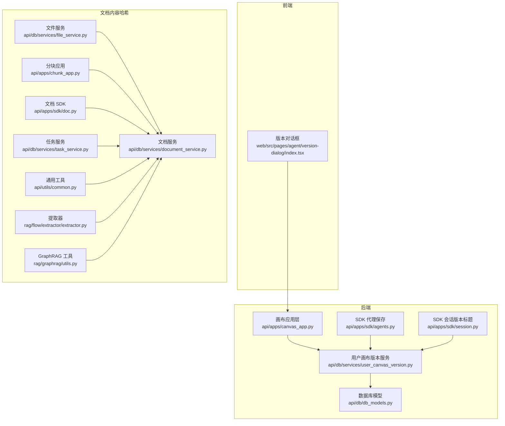
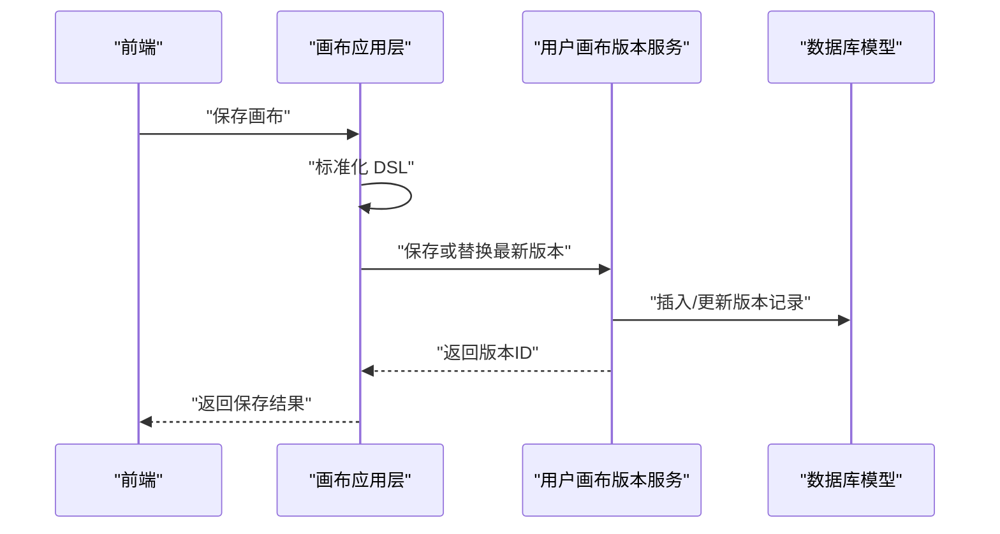
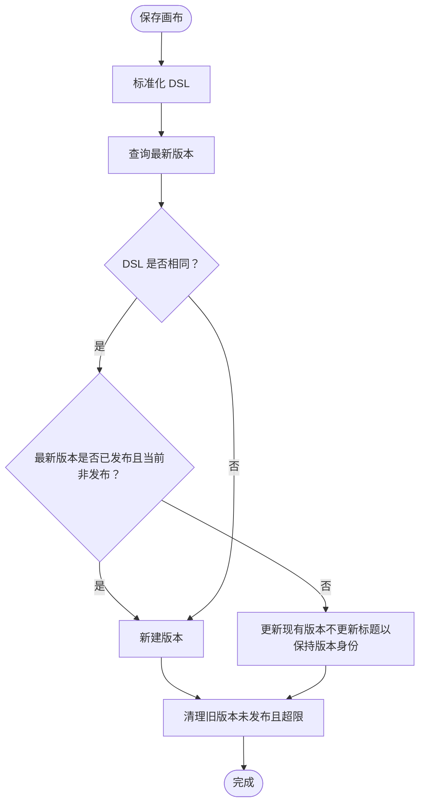
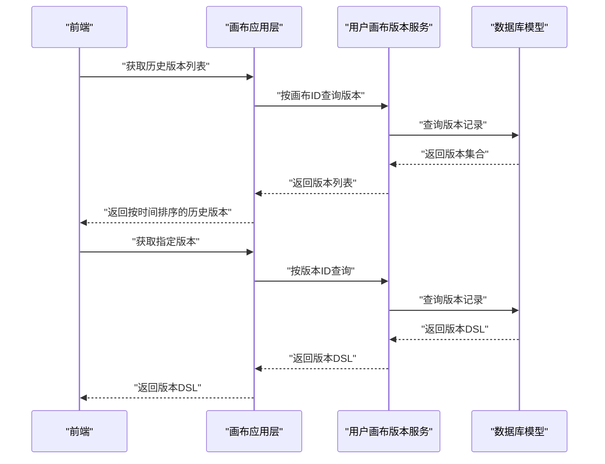
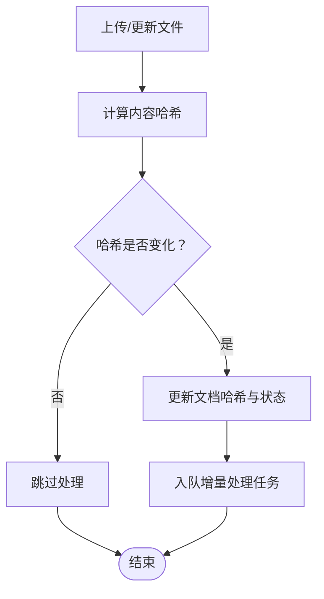
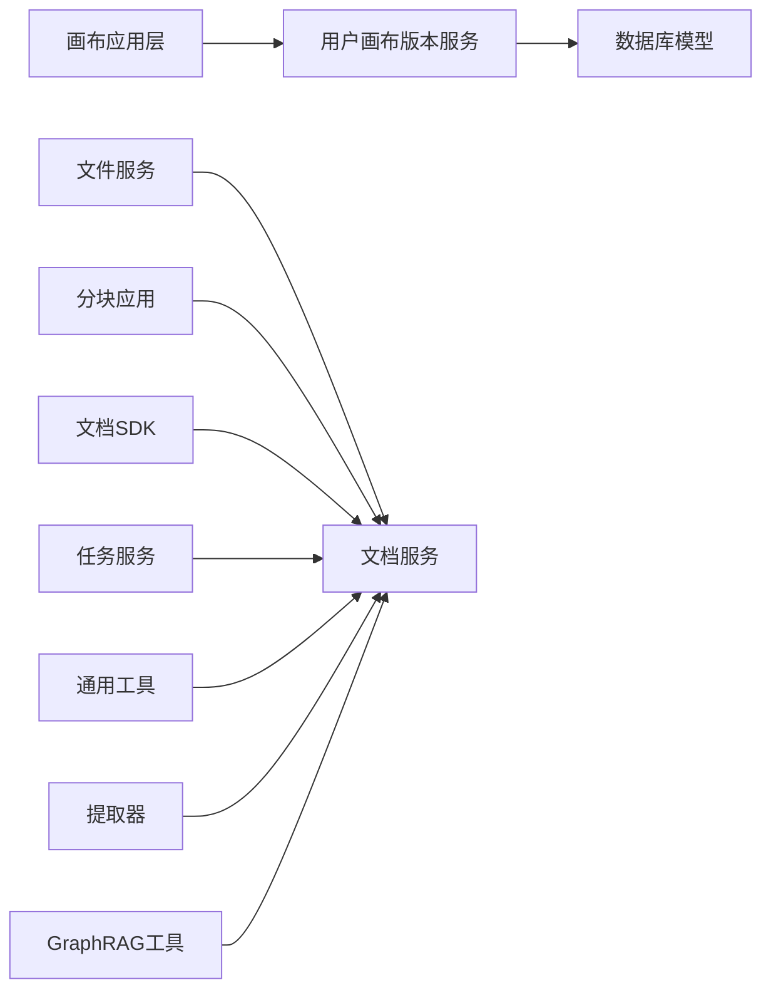

# 文档版本控制

<cite>
**本文引用的文件**
- [common/versions.py](file://common/versions.py)
- [internal/utility/version.go](file://internal/utility/version.go)
- [api/db/db_models.py](file://api/db/db_models.py)
- [api/db/services/user_canvas_version.py](file://api/db/services/user_canvas_version.py)
- [api/apps/canvas_app.py](file://api/apps/canvas_app.py)
- [api/apps/sdk/agents.py](file://api/apps/sdk/agents.py)
- [api/apps/sdk/session.py](file://api/apps/sdk/session.py)
- [web/src/pages/agent/version-dialog/index.tsx](file://web/src/pages/agent/version-dialog/index.tsx)
- [test/testcases/test_web_api/test_canvas_app/test_canvas_routes_unit.py](file://test/testcases/test_web_api/test_canvas_app/test_canvas_routes_unit.py)
- [api/db/services/file_service.py](file://api/db/services/file_service.py)
- [api/apps/chunk_app.py](file://api/apps/chunk_app.py)
- [api/apps/sdk/doc.py](file://api/apps/sdk/doc.py)
- [api/db/services/document_service.py](file://api/db/services/document_service.py)
- [api/db/services/task_service.py](file://api/db/services/task_service.py)
- [api/utils/common.py](file://api/utils/common.py)
- [rag/flow/extractor/extractor.py](file://rag/flow/extractor/extractor.py)
- [rag/graphrag/utils.py](file://rag/graphrag/utils.py)
</cite>

## 目录
1. [引言](#引言)
2. [项目结构](#项目结构)
3. [核心组件](#核心组件)
4. [架构总览](#架构总览)
5. [详细组件分析](#详细组件分析)
6. [依赖分析](#依赖分析)
7. [性能考虑](#性能考虑)
8. [故障排查指南](#故障排查指南)
9. [结论](#结论)
10. [附录](#附录)

## 引言
本技术文档聚焦于 RAGFlow 中“文档版本控制”的完整机制，围绕以下目标展开：版本控制策略（自动版本生成、版本号规则、版本继承关系）、版本存储机制（版本数据分离存储、版本差异计算、版本合并策略）、版本操作功能（版本比较、版本回滚、版本删除、版本导出）、版本冲突处理（并发修改检测、冲突解决方案、版本合并算法），并提供最佳实践、性能优化建议、版本迁移方案与故障恢复策略。

## 项目结构
RAGFlow 的版本控制主要体现在两类对象上：
- 用户画布（Canvas）版本：通过用户画布版本服务持久化画布 DSL 及元数据，支持历史版本列表、按时间排序、发布标记等。
- 文档内容版本：通过文档内容哈希（content_hash）进行变更检测，结合文件服务与任务服务实现增量更新与一致性保障。

图表来源
- [api/apps/canvas_app.py:98-104](file://api/apps/canvas_app.py#L98-L104)
- [api/db/services/user_canvas_version.py:126-181](file://api/db/services/user_canvas_version.py#L126-L181)
- [api/db/db_models.py:1073-1084](file://api/db/db_models.py#L1073-L1084)
- [api/apps/sdk/agents.py:99-101](file://api/apps/sdk/agents.py#L99-L101)
- [api/apps/sdk/session.py](file://api/apps/sdk/session.py#L108)
- [web/src/pages/agent/version-dialog/index.tsx:66-102](file://web/src/pages/agent/version-dialog/index.tsx#L66-L102)
- [api/db/services/file_service.py:458-462](file://api/db/services/file_service.py#L458-L462)
- [api/apps/chunk_app.py](file://api/apps/chunk_app.py#L305)
- [api/apps/sdk/doc.py](file://api/apps/sdk/doc.py#L1236)
- [api/db/services/document_service.py](file://api/db/services/document_service.py#L975)
- [api/db/services/task_service.py](file://api/db/services/task_service.py#L422)
- [api/utils/common.py](file://api/utils/common.py#L28)
- [rag/flow/extractor/extractor.py](file://rag/flow/extractor/extractor.py#L68)
- [rag/graphrag/utils.py](file://rag/graphrag/utils.py#L25)

章节来源
- [api/apps/canvas_app.py:98-104](file://api/apps/canvas_app.py#L98-L104)
- [api/db/services/user_canvas_version.py:126-181](file://api/db/services/user_canvas_version.py#L126-L181)
- [api/db/db_models.py:1073-1084](file://api/db/db_models.py#L1073-L1084)

## 核心组件
- 用户画布版本服务：负责版本的持久化、去重、最新版本保护、发布状态管理与历史清理。
- 画布应用层：在保存、运行、获取等流程中触发版本记录与查询。
- 数据库模型：定义用户画布与版本表结构，包含 DSL、标题、描述、发布标记与时间戳字段。
- 文档内容哈希：通过 xxHash 等算法对文档内容进行哈希，用于变更检测与增量处理。
- 文件服务与任务服务：支撑文档上传、下载、删除与任务队列，配合内容哈希实现一致性。
- 前端版本对话框：展示历史版本列表、选择版本并预览或回滚。

章节来源
- [api/db/services/user_canvas_version.py:10-185](file://api/db/services/user_canvas_version.py#L10-L185)
- [api/apps/canvas_app.py:98-104](file://api/apps/canvas_app.py#L98-L104)
- [api/db/db_models.py:1073-1084](file://api/db/db_models.py#L1073-L1084)
- [api/db/services/file_service.py:458-462](file://api/db/services/file_service.py#L458-L462)
- [web/src/pages/agent/version-dialog/index.tsx:66-102](file://web/src/pages/agent/version-dialog/index.tsx#L66-L102)

## 架构总览
RAGFlow 的版本控制采用“事件驱动 + 模型持久化”的架构：
- 事件触发：保存画布时自动写入版本；运行画布后根据结果提交版本；获取画布时返回最近发布版本的时间戳。
- 版本存储：版本数据与当前画布 DSL 分离存储，版本表包含唯一标识、所属画布、标题、描述、发布标记与 DSL。
- 内容版本：文档内容通过 content_hash 进行变更检测，结合文件与任务服务实现增量处理与一致性。

图表来源
- [api/apps/canvas_app.py:98-104](file://api/apps/canvas_app.py#L98-L104)
- [api/db/services/user_canvas_version.py:126-181](file://api/db/services/user_canvas_version.py#L126-L181)
- [api/db/db_models.py:1073-1084](file://api/db/db_models.py#L1073-L1084)

## 详细组件分析

### 组件一：用户画布版本服务（版本策略与存储）
- 自动版本生成：每次保存画布时，若最新版本 DSL 未变化且非发布态，则更新现有版本；若 DSL 发生变化或最新版本已发布，则新建版本。
- 版本号规则：版本 ID 使用 UUID 字符串，确保全局唯一性；版本标题由用户昵称、画布标题与时间戳组合生成，便于识别。
- 版本继承关系：版本以创建时间倒序排列，最新版本优先；发布标记 release 用于区分正式发布版本与草稿版本。
- 存储机制：版本表独立存储，包含 user_canvas_id、dsl、title、description、release 等字段；通过服务层的查询接口支持历史版本列表与最新版本标题获取。
- 清理策略：未发布的版本超过阈值（默认 20）时，仅保留最新的若干条，其余删除，避免历史版本无限增长。

图表来源
- [api/db/services/user_canvas_version.py:126-181](file://api/db/services/user_canvas_version.py#L126-L181)

章节来源
- [api/db/services/user_canvas_version.py:10-185](file://api/db/services/user_canvas_version.py#L10-L185)
- [api/db/db_models.py:1073-1084](file://api/db/db_models.py#L1073-L1084)

### 组件二：画布应用层（版本操作与集成）
- 版本比较：通过历史版本列表接口按更新时间降序返回，便于对比不同版本的 DSL 差异。
- 版本回滚：可基于历史版本 ID 获取版本 DSL 并替换当前画布 DSL，实现回滚。
- 版本删除：服务层提供删除未发布版本的能力，支持批量清理。
- 版本导出：历史版本 DSL 可通过版本 ID 接口获取，便于外部导出与归档。
- 发布标记：保存时可设置 release 标记，用于区分正式发布版本；获取画布时返回最近发布版本的更新时间戳。

图表来源
- [api/apps/canvas_app.py:556-572](file://api/apps/canvas_app.py#L556-L572)
- [api/db/services/user_canvas_version.py:37-55](file://api/db/services/user_canvas_version.py#L37-L55)

章节来源
- [api/apps/canvas_app.py:556-572](file://api/apps/canvas_app.py#L556-L572)
- [api/apps/canvas_app.py:139-156](file://api/apps/canvas_app.py#L139-L156)
- [api/db/services/user_canvas_version.py:37-55](file://api/db/services/user_canvas_version.py#L37-L55)

### 组件三：文档内容版本（变更检测与增量处理）
- 变更检测：文档模型包含 content_hash 字段，文件服务在上传/更新时计算新哈希并与旧哈希比较，若不同则标记文档变更。
- 增量处理：任务服务与文档服务在处理流程中利用哈希与索引状态进行增量更新，避免重复处理。
- 哈希算法：多处使用 xxHash（如分块、文档 SDK、通用工具等），保证高性能与低碰撞概率。
- 合并策略：在图谱构建与实体解析等场景，通过 GraphChange 记录节点/边的新增与合并，实现版本间差异的可控合并。

图表来源
- [api/db/services/file_service.py:458-462](file://api/db/services/file_service.py#L458-L462)
- [api/db/services/document_service.py](file://api/db/services/document_service.py#L975)
- [api/db/services/task_service.py](file://api/db/services/task_service.py#L422)
- [api/utils/common.py](file://api/utils/common.py#L28)
- [rag/flow/extractor/extractor.py](file://rag/flow/extractor/extractor.py#L68)
- [rag/graphrag/utils.py](file://rag/graphrag/utils.py#L25)

章节来源
- [api/db/db_models.py](file://api/db/db_models.py#L911)
- [api/db/services/file_service.py:458-462](file://api/db/services/file_service.py#L458-L462)
- [api/apps/chunk_app.py](file://api/apps/chunk_app.py#L305)
- [api/apps/sdk/doc.py](file://api/apps/sdk/doc.py#L1236)
- [api/db/services/document_service.py](file://api/db/services/document_service.py#L975)
- [api/db/services/task_service.py](file://api/db/services/task_service.py#L422)
- [api/utils/common.py](file://api/utils/common.py#L28)
- [rag/flow/extractor/extractor.py](file://rag/flow/extractor/extractor.py#L68)
- [rag/graphrag/utils.py](file://rag/graphrag/utils.py#L25)

### 组件四：前端版本对话框（用户交互）
- 展示历史版本：加载版本列表并按更新时间排序，支持选择与查看。
- 预览与回滚：点击版本项可预览 DSL 或触发回滚操作（由应用层实现）。
- 加载状态：提供加载指示与错误提示，提升用户体验。

章节来源
- [web/src/pages/agent/version-dialog/index.tsx:66-102](file://web/src/pages/agent/version-dialog/index.tsx#L66-L102)

## 依赖分析
- 画布应用层依赖用户画布版本服务进行版本持久化与查询。
- 用户画布版本服务依赖数据库模型进行 CRUD 操作。
- 文档相关内容依赖文件服务、任务服务与文档服务，结合 content_hash 实现变更检测。
- SDK 与会话模块在保存与运行过程中复用版本服务，确保一致的版本行为。

图表来源
- [api/apps/canvas_app.py:98-104](file://api/apps/canvas_app.py#L98-L104)
- [api/db/services/user_canvas_version.py:126-181](file://api/db/services/user_canvas_version.py#L126-L181)
- [api/db/db_models.py:1073-1084](file://api/db/db_models.py#L1073-L1084)
- [api/db/services/file_service.py:458-462](file://api/db/services/file_service.py#L458-L462)
- [api/apps/chunk_app.py](file://api/apps/chunk_app.py#L305)
- [api/apps/sdk/doc.py](file://api/apps/sdk/doc.py#L1236)
- [api/db/services/document_service.py](file://api/db/services/document_service.py#L975)
- [api/db/services/task_service.py](file://api/db/services/task_service.py#L422)
- [api/utils/common.py](file://api/utils/common.py#L28)
- [rag/flow/extractor/extractor.py](file://rag/flow/extractor/extractor.py#L68)
- [rag/graphrag/utils.py](file://rag/graphrag/utils.py#L25)

章节来源
- [api/apps/canvas_app.py:98-104](file://api/apps/canvas_app.py#L98-L104)
- [api/db/services/user_canvas_version.py:126-181](file://api/db/services/user_canvas_version.py#L126-L181)
- [api/db/db_models.py:1073-1084](file://api/db/db_models.py#L1073-L1084)

## 性能考虑
- 哈希计算：使用 xxHash 对文档内容进行快速哈希，降低 CPU 开销；在分块与文档 SDK 中统一使用，减少重复实现。
- 查询优化：版本查询按时间倒序，避免全表扫描；历史版本列表分页与批量处理，限制单次返回数量。
- 存储分离：版本表与画布 DSL 分离，减少主表膨胀；未发布版本清理策略控制历史规模。
- 并发处理：任务队列与增量处理结合哈希判断，避免重复工作；在高并发场景下建议增加幂等校验与重试机制。

## 故障排查指南
- 历史版本查询失败：检查版本服务的异常捕获与返回消息，确认数据库连接与权限。
- 版本回滚无效：确认目标版本 ID 正确且 DSL 可被标准化；检查版本发布状态与保护逻辑。
- 文档变更未生效：核对 content_hash 是否正确更新；检查文件服务与任务服务的执行链路。
- 单元测试验证：参考测试用例对历史版本列表与版本获取进行断言，定位异常点。

章节来源
- [test/testcases/test_web_api/test_canvas_app/test_canvas_routes_unit.py:1191-1226](file://test/testcases/test_web_api/test_canvas_app/test_canvas_routes_unit.py#L1191-L1226)
- [api/apps/canvas_app.py:556-572](file://api/apps/canvas_app.py#L556-L572)

## 结论
RAGFlow 的版本控制通过“画布版本服务 + 文档内容哈希”的双轨机制，实现了自动版本生成、清晰的版本继承关系、高效的变更检测与增量处理。配合完善的版本操作与前端交互，满足了从开发到生产的版本管理需求。建议在生产环境中结合监控与告警，持续优化版本清理策略与哈希计算性能。

## 附录

### 最佳实践
- 保存策略：频繁改动的画布建议开启发布标记，区分草稿与正式版本。
- 增量处理：上传文档时优先使用 content_hash 判断变更，减少重复处理。
- 版本清理：定期清理未发布的旧版本，避免历史版本占用存储与查询开销。
- 并发控制：在高并发场景下，确保版本保存与回滚的幂等性与一致性。

### 版本迁移方案
- 导出历史版本：通过版本 ID 接口导出 DSL，建立本地归档。
- 批量导入：在新环境重建版本表与画布 DSL，确保版本顺序与发布标记一致。
- 校验一致性：比对 content_hash 与索引状态，确保迁移后数据一致。

### 故障恢复策略
- 回滚至上一个发布版本：通过历史版本接口获取 DSL 并替换当前画布。
- 清理异常版本：删除未发布的异常版本，释放资源并恢复查询性能。
- 监控与告警：对版本服务与文档哈希计算进行监控，及时发现异常。