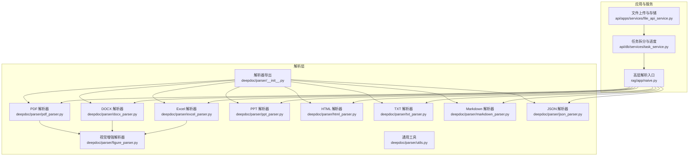
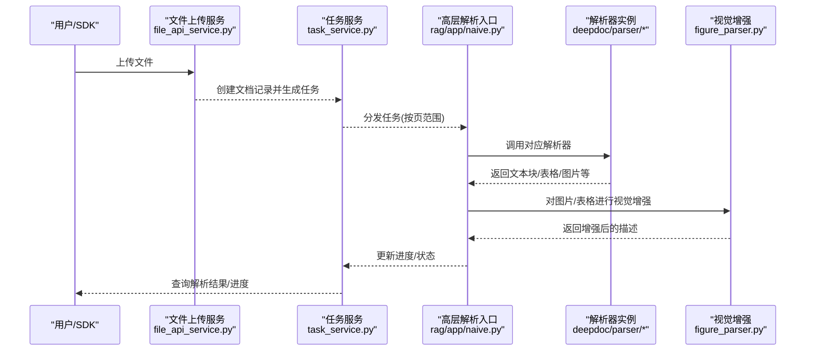
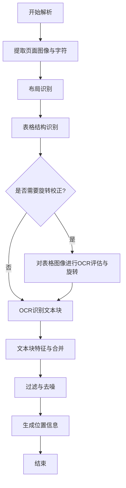
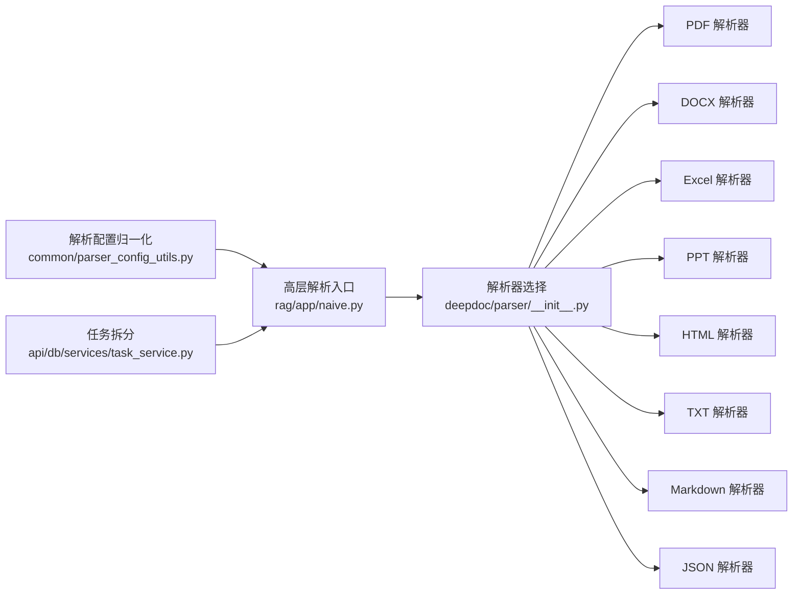

# 文档解析处理

<cite>
**本文引用的文件**
- [deepdoc/parser/__init__.py](file://deepdoc/parser/__init__.py)
- [deepdoc/parser/pdf_parser.py](file://deepdoc/parser/pdf_parser.py)
- [deepdoc/parser/docx_parser.py](file://deepdoc/parser/docx_parser.py)
- [deepdoc/parser/excel_parser.py](file://deepdoc/parser/excel_parser.py)
- [deepdoc/parser/ppt_parser.py](file://deepdoc/parser/ppt_parser.py)
- [deepdoc/parser/html_parser.py](file://deepdoc/parser/html_parser.py)
- [deepdoc/parser/txt_parser.py](file://deepdoc/parser/txt_parser.py)
- [deepdoc/parser/markdown_parser.py](file://deepdoc/parser/markdown_parser.py)
- [deepdoc/parser/json_parser.py](file://deepdoc/parser/json_parser.py)
- [deepdoc/parser/figure_parser.py](file://deepdoc/parser/figure_parser.py)
- [deepdoc/parser/utils.py](file://deepdoc/parser/utils.py)
- [common/parser_config_utils.py](file://common/parser_config_utils.py)
- [api/apps/services/file_api_service.py](file://api/apps/services/file_api_service.py)
- [api/db/services/task_service.py](file://api/db/services/task_service.py)
- [rag/app/naive.py](file://rag/app/naive.py)
- [test/testcases/test_http_api/test_file_management_within_dataset/test_parse_documents.py](file://test/testcases/test_http_api/test_file_management_within_dataset/test_parse_documents.py)
- [test/testcases/test_sdk_api/test_file_management_within_dataset/test_parse_documents.py](file://test/testcases/test_sdk_api/test_file_management_within_dataset/test_parse_documents.py)
</cite>

## 目录
1. [简介](#简介)
2. [项目结构](#项目结构)
3. [核心组件](#核心组件)
4. [架构总览](#架构总览)
5. [详细组件分析](#详细组件分析)
6. [依赖分析](#依赖分析)
7. [性能考量](#性能考量)
8. [故障排查指南](#故障排查指南)
9. [结论](#结论)
10. [附录](#附录)

## 简介
本技术文档围绕 RAGFlow 的多格式文档解析机制与处理流程展开，系统性阐述支持的文档类型（PDF、Word、Excel、PowerPoint、图片、HTML、JSON、Markdown、TXT 等）、解析器架构（工厂模式、多解析器并行处理、解析结果标准化）、并发解析机制（任务调度、资源管理、进度监控、错误处理）、解析质量控制（格式识别准确性、内容完整性、性能优化），并提供解析器扩展指南、自定义解析器开发、解析结果验证与调试方法。

## 项目结构
RAGFlow 的解析能力主要集中在 deepdoc/parser 模块，同时在 rag/app 中提供高层入口与调度逻辑，在 api/db/services 中负责任务拆分与进度管理。测试用例覆盖了并发解析场景与结果校验。

**图表来源**
- [deepdoc/parser/__init__.py:17-41](file://deepdoc/parser/__init__.py#L17-L41)
- [deepdoc/parser/pdf_parser.py:56-110](file://deepdoc/parser/pdf_parser.py#L56-L110)
- [deepdoc/parser/docx_parser.py:31-185](file://deepdoc/parser/docx_parser.py#L31-L185)
- [deepdoc/parser/excel_parser.py:29-318](file://deepdoc/parser/excel_parser.py#L29-L318)
- [deepdoc/parser/ppt_parser.py:22-106](file://deepdoc/parser/ppt_parser.py#L22-L106)
- [deepdoc/parser/html_parser.py:39-214](file://deepdoc/parser/html_parser.py#L39-L214)
- [deepdoc/parser/txt_parser.py:23-68](file://deepdoc/parser/txt_parser.py#L23-L68)
- [deepdoc/parser/markdown_parser.py:23-322](file://deepdoc/parser/markdown_parser.py#L23-L322)
- [deepdoc/parser/json_parser.py:27-180](file://deepdoc/parser/json_parser.py#L27-L180)
- [deepdoc/parser/figure_parser.py:192-282](file://deepdoc/parser/figure_parser.py#L192-L282)
- [rag/app/naive.py:948-973](file://rag/app/naive.py#L948-L973)
- [api/db/services/task_service.py:376-408](file://api/db/services/task_service.py#L376-L408)
- [api/apps/services/file_api_service.py:32-102](file://api/apps/services/file_api_service.py#L32-L102)

**章节来源**
- [deepdoc/parser/__init__.py:17-41](file://deepdoc/parser/__init__.py#L17-L41)
- [rag/app/naive.py:948-973](file://rag/app/naive.py#L948-L973)
- [api/db/services/task_service.py:376-408](file://api/db/services/task_service.py#L376-L408)
- [api/apps/services/file_api_service.py:32-102](file://api/apps/services/file_api_service.py#L32-L102)

## 核心组件
- 解析器导出与工厂模式
  - 通过 deepdoc/parser/__init__.py 统一导出各类解析器类名，形成“工厂式”入口，便于上层按类型选择具体解析器。
- 多格式解析器
  - PDF：布局识别、表格结构识别、OCR、旋转校正、文本合并与过滤。
  - Word/PowerPoint：段落与表格抽取、形状排序与层级处理。
  - Excel：多引擎加载（openpyxl/pandas/calamine）、图片提取、HTML/Markdown 输出。
  - HTML/TXT/Markdown/JSON：内容清洗、标题与块级元素识别、分块策略、编码检测。
  - 图片：结合视觉模型进行描述增强。
- 通用工具
  - 文本读取与编码检测、LazyImage 支持等。

**章节来源**
- [deepdoc/parser/__init__.py:17-41](file://deepdoc/parser/__init__.py#L17-L41)
- [deepdoc/parser/pdf_parser.py:56-110](file://deepdoc/parser/pdf_parser.py#L56-L110)
- [deepdoc/parser/docx_parser.py:31-185](file://deepdoc/parser/docx_parser.py#L31-L185)
- [deepdoc/parser/excel_parser.py:29-318](file://deepdoc/parser/excel_parser.py#L29-L318)
- [deepdoc/parser/ppt_parser.py:22-106](file://deepdoc/parser/ppt_parser.py#L22-L106)
- [deepdoc/parser/html_parser.py:39-214](file://deepdoc/parser/html_parser.py#L39-L214)
- [deepdoc/parser/txt_parser.py:23-68](file://deepdoc/parser/txt_parser.py#L23-L68)
- [deepdoc/parser/markdown_parser.py:23-322](file://deepdoc/parser/markdown_parser.py#L23-L322)
- [deepdoc/parser/json_parser.py:27-180](file://deepdoc/parser/json_parser.py#L27-L180)
- [deepdoc/parser/figure_parser.py:192-282](file://deepdoc/parser/figure_parser.py#L192-L282)
- [deepdoc/parser/utils.py:20-33](file://deepdoc/parser/utils.py#L20-L33)

## 架构总览
RAGFlow 的解析流程从高层入口开始，根据文件类型选择对应解析器；对于 PDF/DOCX/XLSX 等复杂格式，可能进一步触发视觉增强（OCR/表格结构识别/图片描述）。任务层面由任务服务进行页面级切分与进度推进，前端或 SDK 层负责并发调度与状态查询。

**图表来源**
- [api/apps/services/file_api_service.py:32-102](file://api/apps/services/file_api_service.py#L32-L102)
- [api/db/services/task_service.py:376-408](file://api/db/services/task_service.py#L376-L408)
- [rag/app/naive.py:948-973](file://rag/app/naive.py#L948-L973)
- [deepdoc/parser/pdf_parser.py:56-110](file://deepdoc/parser/pdf_parser.py#L56-L110)
- [deepdoc/parser/figure_parser.py:192-282](file://deepdoc/parser/figure_parser.py#L192-L282)

## 详细组件分析

### PDF 解析器
- 关键特性
  - 布局识别（ONNX/Ascend 可选）、表格结构识别、OCR 检测与识别、表格旋转校正、文本块特征工程与合并、过滤与位置信息保留。
  - 并发限制：基于设备数量的信号量控制，避免 GPU/CPU 资源争抢。
  - 字体/编码异常检测：针对 CID 映射失败、子集字体导致的乱码进行识别与回退策略。
- 数据流与处理阶段
  - 页面级图像与字符提取 → 布局识别 → 表格结构识别 → OCR 回退与坐标映射 → 文本块合并与过滤 → 位置信息标准化。

**图表来源**
- [deepdoc/parser/pdf_parser.py:56-110](file://deepdoc/parser/pdf_parser.py#L56-L110)
- [deepdoc/parser/pdf_parser.py:413-560](file://deepdoc/parser/pdf_parser.py#L413-L560)
- [deepdoc/parser/pdf_parser.py:707-797](file://deepdoc/parser/pdf_parser.py#L707-L797)
- [deepdoc/parser/pdf_parser.py:798-800](file://deepdoc/parser/pdf_parser.py#L798-L800)

**章节来源**
- [deepdoc/parser/pdf_parser.py:56-110](file://deepdoc/parser/pdf_parser.py#L56-L110)
- [deepdoc/parser/pdf_parser.py:413-560](file://deepdoc/parser/pdf_parser.py#L413-L560)
- [deepdoc/parser/pdf_parser.py:707-797](file://deepdoc/parser/pdf_parser.py#L707-L797)
- [deepdoc/parser/pdf_parser.py:798-800](file://deepdoc/parser/pdf_parser.py#L798-L800)

### Word 解析器
- 关键特性
  - 段落与运行（runs）遍历、分页标记识别、表格内容抽取与结构化拼接、图片懒加载封装。
- 流程
  - 打开文档 → 遍历段落 → 按页边界聚合 → 抽取表格 → 返回文本块与表格列表。

**章节来源**
- [deepdoc/parser/docx_parser.py:31-185](file://deepdoc/parser/docx_parser.py#L31-L185)

### Excel 解析器
- 关键特性
  - 多引擎容错加载（openpyxl/pandas/calamine）、CSV 自动识别与转换、图片锚点提取、HTML/Markdown 输出、行数上限与稀疏行扫描优化。
- 流程
  - 文件头判断 → 引擎选择与加载 → 行迭代与清洗 → 表格/图片/描述输出。

**章节来源**
- [deepdoc/parser/excel_parser.py:29-318](file://deepdoc/parser/excel_parser.py#L29-L318)

### PowerPoint 解析器
- 关键特性
  - 形状排序、分级列表处理、表格单元拼接、组形状递归提取。
- 流程
  - 加载演示文稿 → 按页遍历 → 形状提取 → 文本拼接 → 返回每页文本块。

**章节来源**
- [deepdoc/parser/ppt_parser.py:22-106](file://deepdoc/parser/ppt_parser.py#L22-L106)

### HTML 解析器
- 关键特性
  - 编码检测、脚本/style 清理、注释移除、块级标签识别、标题层级映射、表格分块与令牌计数。
- 流程
  - 解码/读取 → 清洗与解析 → 递归提取文本块 → 合并与分块 → 表格单独输出。

**章节来源**
- [deepdoc/parser/html_parser.py:39-214](file://deepdoc/parser/html_parser.py#L39-L214)

### TXT/Markdown/JSON 解析器
- TXT：按自定义分隔符切分，结合令牌计数进行分块。
- Markdown：表格抽取与渲染、元素级提取（标题/代码块/列表/引用/段落）。
- JSON/JSONL：结构化切分与序列化，支持列表预处理与最小/最大块大小控制。

**章节来源**
- [deepdoc/parser/txt_parser.py:23-68](file://deepdoc/parser/txt_parser.py#L23-L68)
- [deepdoc/parser/markdown_parser.py:23-322](file://deepdoc/parser/markdown_parser.py#L23-L322)
- [deepdoc/parser/json_parser.py:27-180](file://deepdoc/parser/json_parser.py#L27-L180)

### 视觉增强解析器（图片/表格）
- 功能
  - 将图片与描述组合，按上下文注入提示词，调用视觉模型生成描述，支持线程池并发与超时控制。
- 入口
  - 针对 PDF/DOCX/XLSX 的增强包装函数，统一调度 VisionFigureParser。

**章节来源**
- [deepdoc/parser/figure_parser.py:192-282](file://deepdoc/parser/figure_parser.py#L192-L282)

## 依赖分析
- 解析器导出
  - 通过 deepdoc/parser/__init__.py 导出各解析器类名，形成统一工厂入口。
- 配置归一化
  - common/parser_config_utils.py 提供布局识别器名称与模型名的归一化处理。
- 任务拆分与并发
  - api/db/services/task_service.py 根据文档类型与页面范围生成任务数组，支持按页大小切分。
  - 测试用例展示并发解析场景（ThreadPoolExecutor + as_completed）。

**图表来源**
- [common/parser_config_utils.py:20-34](file://common/parser_config_utils.py#L20-L34)
- [rag/app/naive.py:948-973](file://rag/app/naive.py#L948-L973)
- [deepdoc/parser/__init__.py:17-41](file://deepdoc/parser/__init__.py#L17-L41)
- [api/db/services/task_service.py:376-408](file://api/db/services/task_service.py#L376-L408)

**章节来源**
- [common/parser_config_utils.py:20-34](file://common/parser_config_utils.py#L20-L34)
- [api/db/services/task_service.py:376-408](file://api/db/services/task_service.py#L376-L408)

## 性能考量
- 并发与资源管理
  - PDF 解析器内置设备级信号量，限制并行度以避免资源争用。
  - 视觉增强使用线程池与超时装饰器，保障长耗时任务不阻塞主流程。
- 任务切分
  - 任务服务按页大小切分，支持大文档分片处理，降低单次内存压力。
- I/O 与编码
  - 采用编码检测与懒加载（LazyImage）减少无效解码与内存占用。
- 算法优化
  - Excel 行扫描二分查找实际数据行，避免全表扫描；Markdown/HTML 分块结合令牌计数，提升吞吐。

**章节来源**
- [deepdoc/parser/pdf_parser.py:70-74](file://deepdoc/parser/pdf_parser.py#L70-L74)
- [deepdoc/parser/figure_parser.py:190-282](file://deepdoc/parser/figure_parser.py#L190-L282)
- [api/db/services/task_service.py:376-408](file://api/db/services/task_service.py#L376-L408)
- [deepdoc/parser/excel_parser.py:155-196](file://deepdoc/parser/excel_parser.py#L155-L196)

## 故障排查指南
- 常见问题定位
  - 编码/字体乱码：检查 PDF 字体子集与 CID 映射检测逻辑，必要时启用 OCR 回退。
  - Excel 加载失败：确认 openpyxl/pandas/calamine 顺序与异常分支，优先尝试 calamine。
  - 视觉模型不可用：确认租户默认视觉模型配置，若缺失则跳过增强。
  - 进度卡住：核对任务切分页范围与回调更新，确保每个任务完成才推进。
- 并发与稳定性
  - 使用测试用例中的并发模式（线程池 + 完成回调）验证大规模文档解析的稳定性与正确性。
- 结果验证
  - 通过测试断言文档状态（DONE）、处理时间、进度消息等指标，确保解析链路完整。

**章节来源**
- [deepdoc/parser/pdf_parser.py:268-321](file://deepdoc/parser/pdf_parser.py#L268-L321)
- [deepdoc/parser/excel_parser.py:31-67](file://deepdoc/parser/excel_parser.py#L31-L67)
- [deepdoc/parser/figure_parser.py:50-91](file://deepdoc/parser/figure_parser.py#L50-L91)
- [test/testcases/test_http_api/test_file_management_within_dataset/test_parse_documents.py:199-219](file://test/testcases/test_http_api/test_file_management_within_dataset/test_parse_documents.py#L199-L219)
- [test/testcases/test_sdk_api/test_file_management_within_dataset/test_parse_documents.py:248-272](file://test/testcases/test_sdk_api/test_file_management_within_dataset/test_parse_documents.py#L248-L272)

## 结论
RAGFlow 的文档解析体系以模块化解析器为核心，配合任务切分与并发调度，实现了对多格式文档的高可靠解析。PDF/DOCX/XLSX 等复杂格式通过布局识别、表格结构识别与视觉增强进一步提升解析质量。通过编码检测、懒加载与令牌计数等手段优化性能，并以测试用例保障并发场景下的稳定性与正确性。

## 附录

### 解析器扩展指南
- 新增解析器步骤
  - 在 deepdoc/parser 下新增解析器文件，实现统一调用接口（如 __call__），返回标准结构（文本块/表格/图片等）。
  - 在 deepdoc/parser/__init__.py 中导出新解析器类名，确保上层可发现。
  - 在 rag/app/naive.py 或相应入口中添加类型匹配与调用逻辑。
  - 如涉及视觉增强，参考 figure_parser 的包装与并发模式。
- 标准化输出
  - 文本块建议包含文本内容与位置信息；表格/图片建议提供描述与元数据；JSON/HTML/Mardown 需要保持结构化一致性。
- 质量控制
  - 增加编码检测与异常回退（如 OCR 回退）；对大文档进行分块与令牌计数；对图片/表格进行上下文增强与坐标映射。

**章节来源**
- [deepdoc/parser/__init__.py:17-41](file://deepdoc/parser/__init__.py#L17-L41)
- [deepdoc/parser/figure_parser.py:192-282](file://deepdoc/parser/figure_parser.py#L192-L282)
- [rag/app/naive.py:948-973](file://rag/app/naive.py#L948-L973)