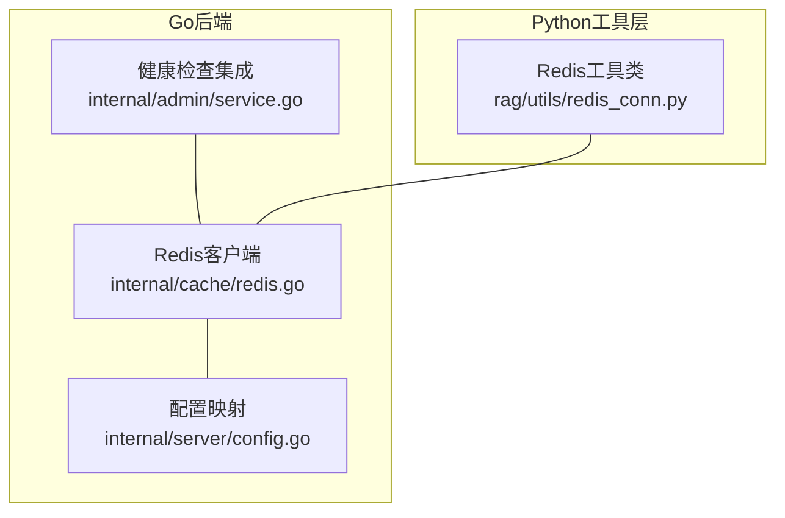
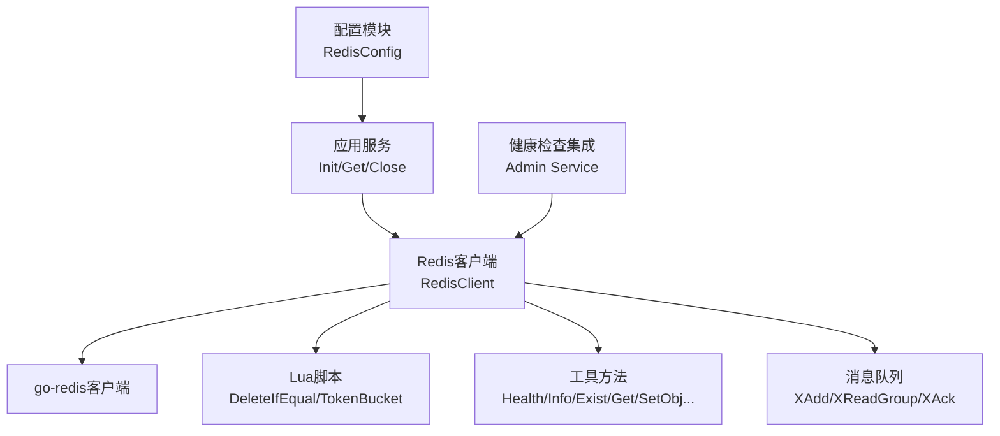
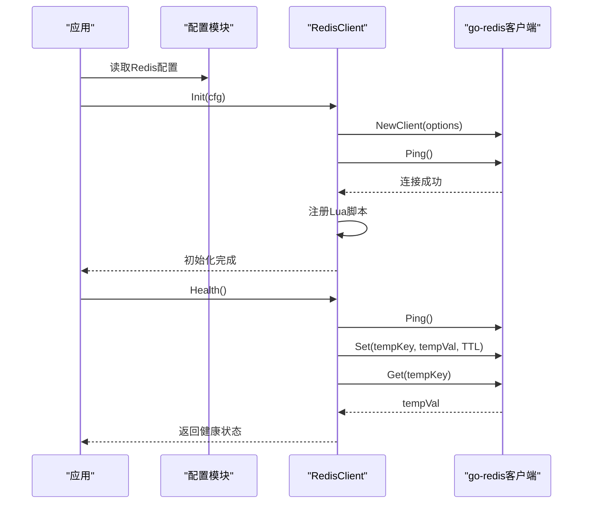
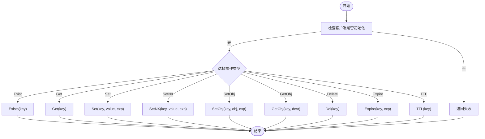
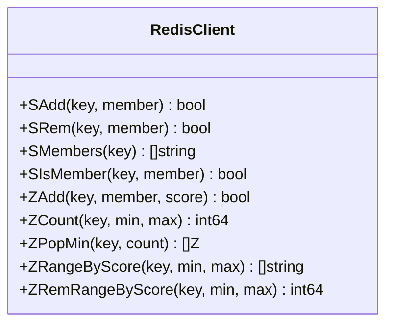
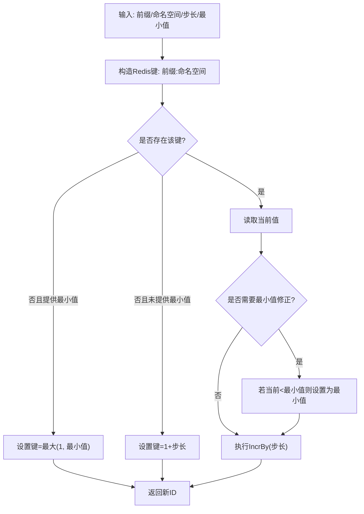
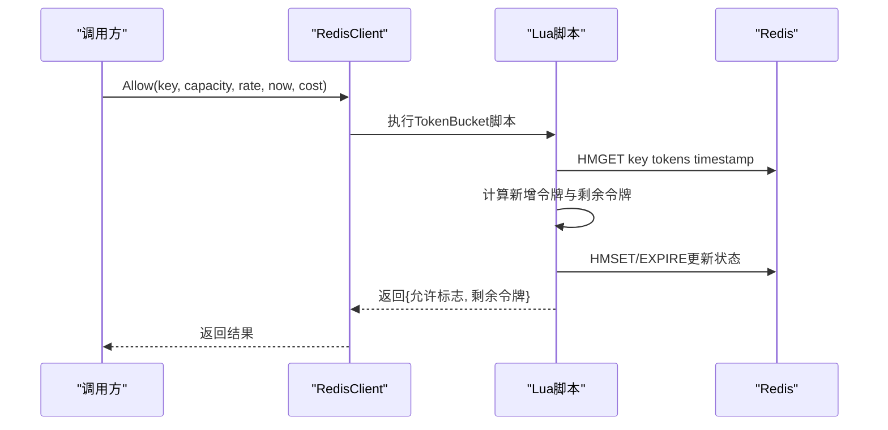
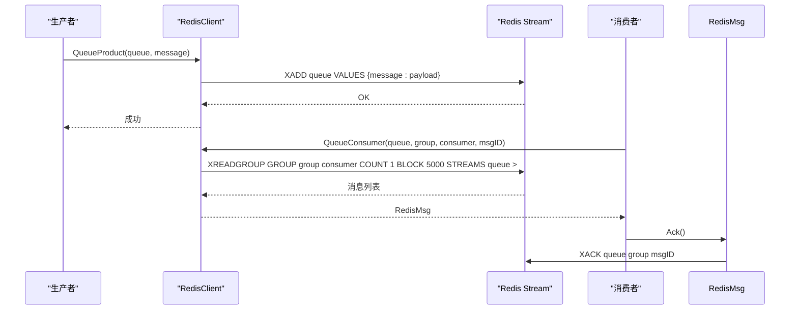
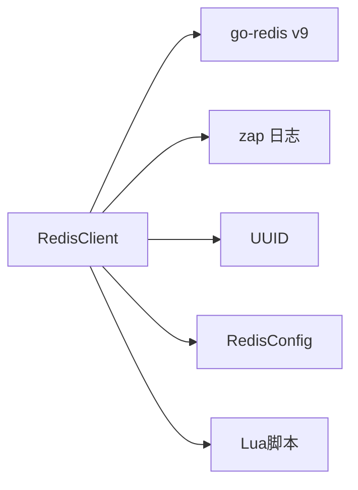

# Redis缓存系统

<cite>
**本文档引用的文件**
- [redis.go](file://internal/cache/redis.go)
- [redis_conn.py](file://rag/utils/redis_conn.py)
- [config.go](file://internal/server/config.go)
- [service.go](file://internal/admin/service.go)
</cite>

## 目录
1. [简介](#简介)
2. [项目结构](#项目结构)
3. [核心组件](#核心组件)
4. [架构总览](#架构总览)
5. [详细组件分析](#详细组件分析)
6. [依赖关系分析](#依赖关系分析)
7. [性能考虑](#性能考虑)
8. [故障排查指南](#故障排查指南)
9. [结论](#结论)
10. [附录](#附录)

## 简介
本技术文档围绕Redis缓存系统进行深入解析，覆盖客户端初始化流程（连接配置、连接池管理、健康检查）、键值操作接口（Get/Set/Exist等基础操作及SetNX原子性设置、JSON序列化存储）、集合操作（SAdd/SRem/SMembers等集合管理、ZAdd/ZRangeByScore等有序集合操作）、自动递增ID生成机制（命名空间隔离、最小值保证、并发安全）、Lua脚本优化（原子性删除、令牌桶限流）等关键能力，并提供Redis配置参数说明、性能调优建议、故障处理策略与监控指标设置。

## 项目结构
Redis缓存系统在后端以Go语言实现，在前端/工具层以Python实现，二者通过统一的配置与接口协同工作：
- Go实现：位于internal/cache/redis.go，提供全局Redis客户端、健康检查、信息采集、键值与集合操作、自动递增ID生成、Lua脚本封装（原子删除、令牌桶限流）、消息队列（Stream）等能力。
- Python实现：位于rag/utils/redis_conn.py，提供与Go侧等价的键值/集合/流式消息队列操作、自动递增ID生成、原子锁与分布式锁等工具。
- 配置：位于internal/server/config.go，定义Redis配置结构体与配置映射逻辑；同时在文档中给出配置项说明。

**图表来源**
- [redis.go:107-145](file://internal/cache/redis.go#L107-L145)
- [config.go:196-202](file://internal/server/config.go#L196-L202)
- [service.go:1080-1096](file://internal/admin/service.go#L1080-L1096)

**章节来源**
- [redis.go:107-145](file://internal/cache/redis.go#L107-L145)
- [config.go:196-202](file://internal/server/config.go#L196-L202)
- [service.go:1080-1096](file://internal/admin/service.go#L1080-L1096)

## 核心组件
- 全局Redis客户端：单例模式，封装go-redis客户端并扩展工具方法（健康检查、信息采集、键值/集合/流操作、Lua脚本执行、自动递增ID生成、令牌桶限流）。
- 配置模块：定义RedisConfig结构体，支持从配置文件与环境变量加载host、port、password、db等参数。
- 健康检查：提供Ping连通性检测与写入读出验证，确保连接可用。
- Lua脚本：内置原子删除与令牌桶限流脚本，提升高并发场景下的性能与一致性。
- 消息队列：基于Redis Streams实现生产/消费、消费者组、ACK、Pending消息查询与重入队列等。

**章节来源**
- [redis.go:42-49](file://internal/cache/redis.go#L42-L49)
- [redis.go:107-145](file://internal/cache/redis.go#L107-L145)
- [redis.go:165-186](file://internal/cache/redis.go#L165-L186)
- [redis.go:61-105](file://internal/cache/redis.go#L61-L105)
- [redis.go:630-750](file://internal/cache/redis.go#L630-L750)

## 架构总览
Redis缓存系统采用“配置驱动 + 单例客户端 + Lua脚本优化”的架构设计，既满足高并发下的原子性与性能需求，又提供完善的健康检查与监控能力。

**图表来源**
- [redis.go:107-145](file://internal/cache/redis.go#L107-L145)
- [redis.go:42-49](file://internal/cache/redis.go#L42-L49)
- [redis.go:61-105](file://internal/cache/redis.go#L61-L105)
- [config.go:196-202](file://internal/server/config.go#L196-L202)
- [service.go:1080-1096](file://internal/admin/service.go#L1080-L1096)

## 详细组件分析

### 客户端初始化与健康检查
- 初始化流程：根据配置创建go-redis客户端，执行Ping连通性测试，成功后注册全局单例，并预编译Lua脚本。
- 健康检查：先Ping，再写入临时键并读取校验，确保网络与权限正常。
- 信息采集：调用INFO命令解析关键指标（版本、内存、客户端数、QPS等），用于监控与诊断。

**图表来源**
- [redis.go:107-145](file://internal/cache/redis.go#L107-L145)
- [redis.go:165-186](file://internal/cache/redis.go#L165-L186)

**章节来源**
- [redis.go:107-145](file://internal/cache/redis.go#L107-L145)
- [redis.go:165-186](file://internal/cache/redis.go#L165-L186)

### 键值操作接口
- 基础操作：Exist、Get、Set、SetNX、Delete、Expire、TTL等。
- 对象序列化：SetObj/GetObj提供JSON序列化与反序列化，便于存储复杂对象。
- 并发安全：SetNX用于原子性设置；Transaction封装NX事务管道；GetOrCreateKey提供“先取后设”的原子性保障。

**图表来源**
- [redis.go:276-371](file://internal/cache/redis.go#L276-L371)
- [redis.go:307-344](file://internal/cache/redis.go#L307-L344)
- [redis.go:845-883](file://internal/cache/redis.go#L845-L883)

**章节来源**
- [redis.go:276-371](file://internal/cache/redis.go#L276-L371)
- [redis.go:307-344](file://internal/cache/redis.go#L307-L344)
- [redis.go:845-883](file://internal/cache/redis.go#L845-L883)

### 集合与有序集合操作
- 集合操作：SAdd、SRem、SMembers、SIsMember，支持成员添加、移除、枚举与存在性判断。
- 有序集合：ZAdd、ZCount、ZPopMin、ZRangeByScore、ZRemRangeByScore，支持按分数范围查询、弹出最小元素、删除指定分数区间等。

**图表来源**
- [redis.go:410-534](file://internal/cache/redis.go#L410-L534)

**章节来源**
- [redis.go:410-534](file://internal/cache/redis.go#L410-L534)

### 自动递增ID生成机制
- 命名空间隔离：通过“前缀:命名空间”形式区分不同业务域的ID生成器。
- 最小值保证：可选ensureMinimum参数，确保起始值不低于指定阈值。
- 并发安全：使用IncrBy原子自增；首次生成时设置合理初始值，避免冲突。
- Go与Python双实现：Go侧提供GenerateAutoIncrementID，Python侧提供generate_auto_increment_id，均遵循相同语义。

**图表来源**
- [redis.go:564-612](file://internal/cache/redis.go#L564-L612)
- [redis_conn.py:293-335](file://rag/utils/redis_conn.py#L293-L335)

**章节来源**
- [redis.go:564-612](file://internal/cache/redis.go#L564-L612)
- [redis_conn.py:293-335](file://rag/utils/redis_conn.py#L293-L335)

### Lua脚本优化
- 原子删除：DeleteIfEqual在Lua中比较当前值与期望值，相等则删除并返回1，否则返回0，避免竞态条件。
- 令牌桶限流：TokenBucket在Lua中维护tokens与timestamp，按时间补充令牌，不足cost则拒绝，支持动态过期。
- 调用方式：通过Script.Run或封装的Allow/AllowN接口执行，确保原子性与高性能。

**图表来源**
- [redis.go:61-105](file://internal/cache/redis.go#L61-L105)
- [redis.go:945-985](file://internal/cache/redis.go#L945-L985)

**章节来源**
- [redis.go:61-105](file://internal/cache/redis.go#L61-L105)
- [redis.go:945-985](file://internal/cache/redis.go#L945-L985)

### 消息队列（Redis Streams）
- 生产：QueueProduct将消息序列化后写入Stream。
- 消费：QueueConsumer支持消费者组创建、阻塞读取、ACK确认、Pending消息查询与重入队列。
- 工具：RedisMsg封装消息ID、内容与ACK操作，简化上层使用。

**图表来源**
- [redis.go:630-750](file://internal/cache/redis.go#L630-L750)

**章节来源**
- [redis.go:630-750](file://internal/cache/redis.go#L630-L750)

## 依赖关系分析
- 组件耦合：RedisClient对go-redis有直接依赖；对Lua脚本有运行时依赖；对配置模块有初始化依赖。
- 外部依赖：go-redis v9作为核心客户端库；zap用于日志记录；UUID用于临时键生成。
- 风险点：Lua脚本需与Redis版本兼容；Stream消费者组创建需幂等处理；健康检查应避免频繁写入。

**图表来源**
- [redis.go:19-35](file://internal/cache/redis.go#L19-L35)
- [config.go:196-202](file://internal/server/config.go#L196-L202)

**章节来源**
- [redis.go:19-35](file://internal/cache/redis.go#L19-L35)
- [config.go:196-202](file://internal/server/config.go#L196-L202)

## 性能考虑
- 连接与超时：默认连接超时为5秒，建议结合网络延迟调整；批量操作优先使用Pipeline减少RTT。
- Lua脚本：原子性删除与令牌桶限流通过Lua执行，避免往返开销，适合高并发场景。
- 缓存命中：合理设置TTL与键空间设计，避免大Key与热点Key集中；利用SetNX与事务管道降低竞争。
- 监控指标：使用Info接口采集内存、客户端、QPS等指标，结合业务峰值设定容量与过期策略。

[本节为通用指导，无需具体文件引用]

## 故障排查指南
- 连接失败：检查配置host/port/password/db；确认网络可达与ACL权限；查看初始化错误日志。
- 健康检查失败：执行Health()返回false时，检查Ping与临时键读写；关注超时与权限问题。
- Lua脚本异常：核对脚本语法与Redis版本兼容性；确认脚本已正确注册与缓存。
- 消息队列问题：消费者组不存在时自动创建；注意ACK丢失导致的消息堆积；定期清理Pending消息。

**章节来源**
- [redis.go:107-145](file://internal/cache/redis.go#L107-L145)
- [redis.go:165-186](file://internal/cache/redis.go#L165-L186)
- [redis.go:630-750](file://internal/cache/redis.go#L630-L750)

## 结论
该Redis缓存系统通过“配置驱动 + 单例客户端 + Lua脚本优化”的设计，在保证高并发原子性的同时提供了完善的健康检查与监控能力。键值、集合、有序集合与消息队列等核心能力覆盖常见业务场景；自动递增ID生成机制支持命名空间隔离与最小值保证；令牌桶限流与原子删除脚本进一步提升了系统的性能与可靠性。建议在生产环境中结合监控指标与容量规划，持续优化连接参数与键空间设计。

[本节为总结，无需具体文件引用]

## 附录

### Redis配置参数说明
- host：Redis主机地址（支持host:port格式或单独host与port字段）。
- port：Redis端口，默认6379。
- password：访问密码（可选）。
- db：数据库索引，默认1。
- username：Redis ACL用户名（Redis 6+，可选）。

**章节来源**
- [config.go:196-202](file://internal/server/config.go#L196-L202)
- [config.go:544-570](file://internal/server/config.go#L544-L570)
- [docs/administrator/configurations.md:169-174](file://docs/administrator/configurations.md#L169-L174)

### 监控指标设置
- 使用Info接口采集以下关键指标：
  - redis_version：Redis版本
  - server_mode：服务器模式
  - used_memory：已用内存
  - total_system_memory：系统总内存
  - mem_fragmentation_ratio：内存碎片比
  - connected_clients：连接客户端数
  - blocked_clients：阻塞客户端数
  - instantaneous_ops_per_sec：瞬时每秒操作数
  - total_commands_processed：累计命令数

**章节来源**
- [redis.go:188-225](file://internal/cache/redis.go#L188-L225)

### 健康检查集成
- 管理后台服务在启动时调用Redis Health()进行连通性检测，失败时返回超时与错误信息，便于运维快速定位问题。

**章节来源**
- [service.go:1080-1096](file://internal/admin/service.go#L1080-L1096)