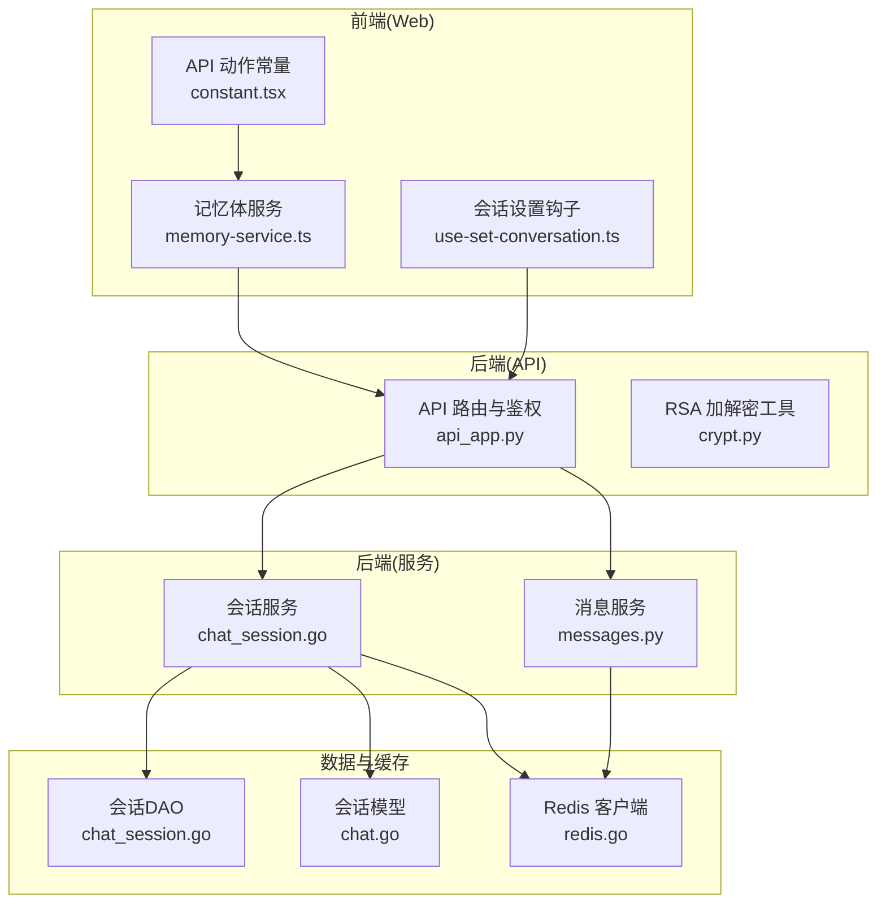
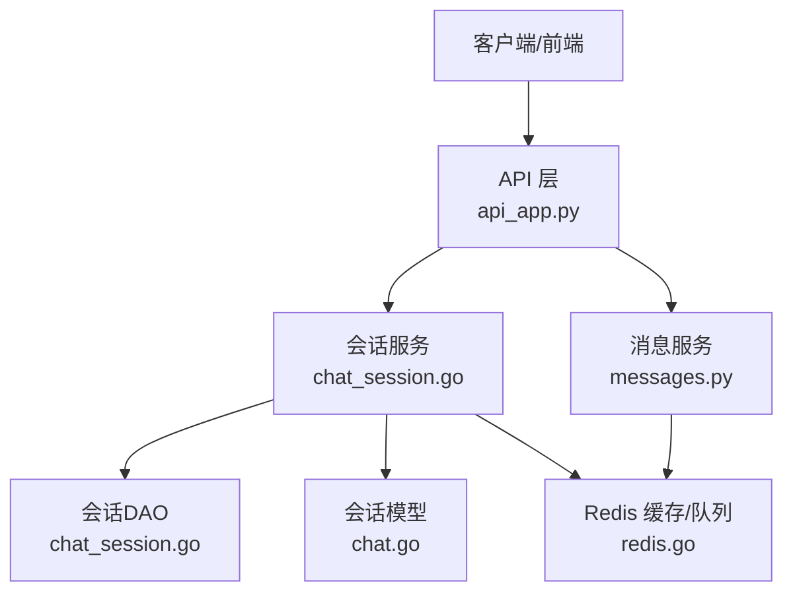
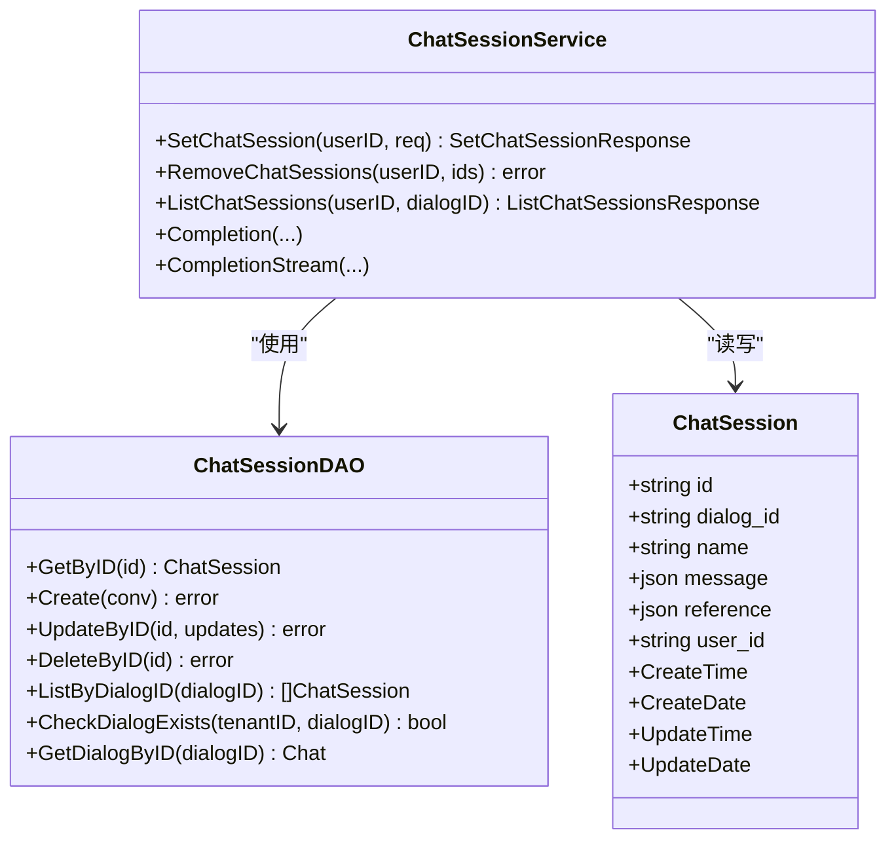
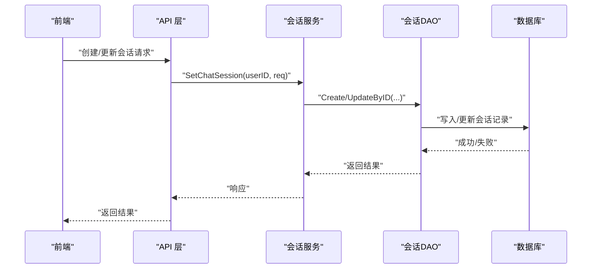
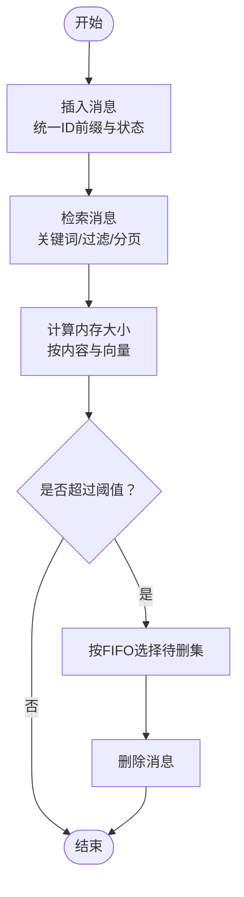
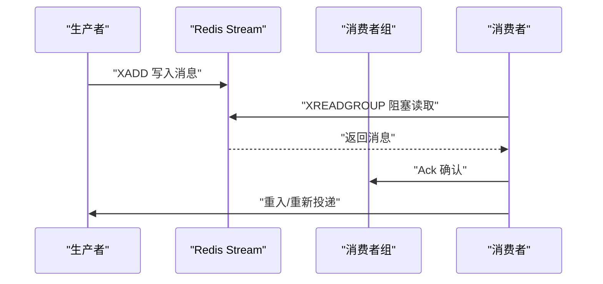
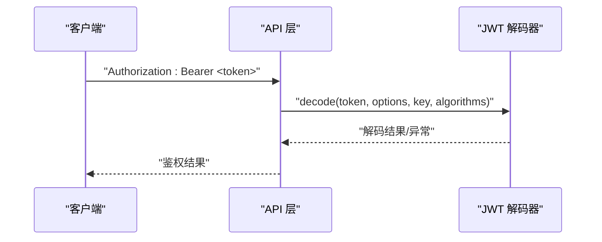
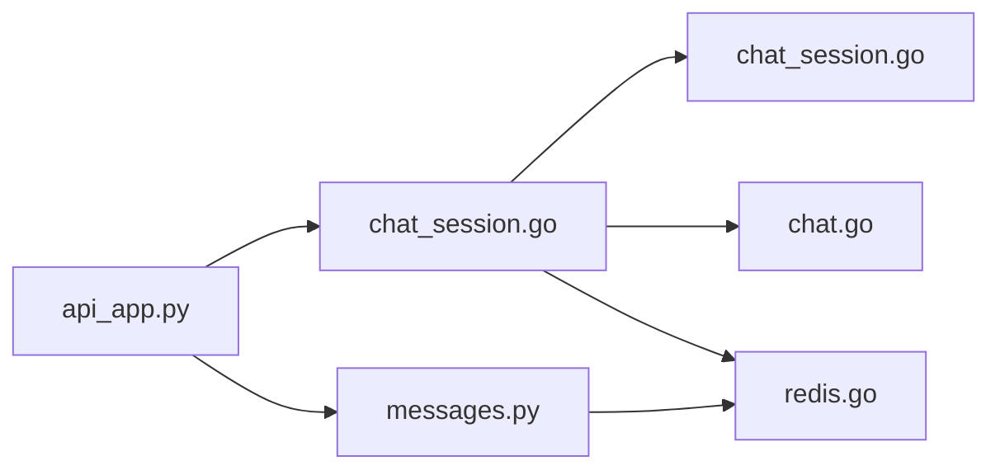

# 会话状态管理

<cite>
**本文引用的文件**
- [internal/model/chat.go](file://internal/model/chat.go)
- [internal/service/chat_session.go](file://internal/service/chat_session.go)
- [internal/dao/chat_session.go](file://internal/dao/chat_session.go)
- [internal/cache/redis.go](file://internal/cache/redis.go)
- [memory/services/messages.py](file://memory/services/messages.py)
- [internal/server/config.go](file://internal/server/config.go)
- [api/apps/api_app.py](file://api/apps/api_app.py)
- [api/utils/crypt.py](file://api/utils/crypt.py)
- [web/src/services/memory-service.ts](file://web/src/services/memory-service.ts)
- [web/src/pages/memory/constant.tsx](file://web/src/pages/memory/constant.tsx)
- [web/src/pages/next-chats/hooks/use-set-conversation.ts](file://web/src/pages/next-chats/hooks/use-set-conversation.ts)
- [test/testcases/test_web_api/common.py](file://test/testcases/test_web_api/common.py)
</cite>

## 目录
1. [引言](#引言)
2. [项目结构](#项目结构)
3. [核心组件](#核心组件)
4. [架构总览](#架构总览)
5. [详细组件分析](#详细组件分析)
6. [依赖分析](#依赖分析)
7. [性能考虑](#性能考虑)
8. [故障排查指南](#故障排查指南)
9. [结论](#结论)
10. [附录](#附录)

## 引言
本文件围绕“会话状态管理”主题，系统梳理并解释该系统在用户会话存储、序列化与反序列化、会话标识符生成、会话过期处理、会话数据持久化与分布式同步、消息存储与检索、消息队列管理与批量操作、会话安全（验证、权限、加密）、性能优化与容量规划、以及故障恢复等方面的设计与实现要点。文档以代码为依据，辅以图示帮助读者快速理解整体架构与关键流程。

## 项目结构
会话状态管理横跨后端 Go 服务层、Python 服务层、前端 Web 层与测试用例，主要涉及以下模块：
- 会话模型与服务：Go 后端定义对话与会话的数据模型，并提供会话创建、更新、删除与列表查询等服务逻辑。
- 消息存储与检索：Python 层提供消息索引、插入、更新、删除、分页检索、向量大小计算与遗忘策略等能力。
- 缓存与消息队列：Go 层通过 Redis 提供键值缓存、分布式锁、事务性写入、流式消息队列（XADD/XREADGROUP）等能力。
- 安全与认证：API 层使用 JWT 与密钥管理；前端通过 SDK 与后端交互；密码采用 RSA 加解密工具。
- 前端交互：Web 层提供记忆体（Memory）与聊天对话的调用封装与常量定义。

图表来源
- [internal/service/chat_session.go:62-152](file://internal/service/chat_session.go#L62-L152)
- [memory/services/messages.py:44-63](file://memory/services/messages.py#L44-L63)
- [internal/cache/redis.go:614-829](file://internal/cache/redis.go#L614-L829)
- [api/apps/api_app.py:26-53](file://api/apps/api_app.py#L26-L53)
- [api/utils/crypt.py:26-60](file://api/utils/crypt.py#L26-L60)
- [web/src/services/memory-service.ts:1-42](file://web/src/services/memory-service.ts#L1-L42)
- [web/src/pages/next-chats/hooks/use-set-conversation.ts:10-31](file://web/src/pages/next-chats/hooks/use-set-conversation.ts#L10-L31)

章节来源
- [internal/service/chat_session.go:62-152](file://internal/service/chat_session.go#L62-L152)
- [memory/services/messages.py:44-63](file://memory/services/messages.py#L44-L63)
- [internal/cache/redis.go:614-829](file://internal/cache/redis.go#L614-L829)
- [api/apps/api_app.py:26-53](file://api/apps/api_app.py#L26-L53)
- [api/utils/crypt.py:26-60](file://api/utils/crypt.py#L26-L60)
- [web/src/services/memory-service.ts:1-42](file://web/src/services/memory-service.ts#L1-L42)
- [web/src/pages/next-chats/hooks/use-set-conversation.ts:10-31](file://web/src/pages/next-chats/hooks/use-set-conversation.ts#L10-L31)

## 核心组件
- 会话模型与DAO：定义对话与会话的字段与持久化接口，支持按会话ID获取、创建、更新、删除与按对话ID列表查询。
- 会话服务：负责会话创建（UUID 生成与裁剪）、名称规范化、初始消息注入、引用初始化、更新时间维护等。
- 消息服务：提供消息索引、插入、更新、删除、分页检索、最近消息查询、向量大小统计、遗忘策略（FIFO/容量）等。
- Redis 缓存与消息队列：提供键值缓存、NX 事务、流式消息生产/消费、消费者组、Pending 查询、重入与确认等。
- 安全与认证：API 层基于 JWT 验证；密码采用 RSA 加解密工具；前端通过 SDK 与后端交互。
- 前端交互：封装记忆体与会话相关 API 调用，定义动作常量。

章节来源
- [internal/model/chat.go:52-66](file://internal/model/chat.go#L52-L66)
- [internal/dao/chat_session.go:31-94](file://internal/dao/chat_session.go#L31-L94)
- [internal/service/chat_session.go:62-152](file://internal/service/chat_session.go#L62-L152)
- [memory/services/messages.py:44-63](file://memory/services/messages.py#L44-L63)
- [internal/cache/redis.go:614-829](file://internal/cache/redis.go#L614-L829)
- [api/apps/api_app.py:26-53](file://api/apps/api_app.py#L26-L53)
- [api/utils/crypt.py:26-60](file://api/utils/crypt.py#L26-L60)
- [web/src/services/memory-service.ts:1-42](file://web/src/services/memory-service.ts#L1-L42)

## 架构总览
会话状态管理采用“模型-服务-DAO-缓存/队列”的分层架构。前端通过 API 网关访问后端服务，后端服务对数据库进行读写，并利用 Redis 进行缓存与消息队列处理。消息服务与会话服务分别承担会话历史与消息检索/管理职责。

图表来源
- [internal/service/chat_session.go:62-152](file://internal/service/chat_session.go#L62-L152)
- [memory/services/messages.py:44-63](file://memory/services/messages.py#L44-L63)
- [internal/cache/redis.go:614-829](file://internal/cache/redis.go#L614-L829)
- [api/apps/api_app.py:26-53](file://api/apps/api_app.py#L26-L53)

## 详细组件分析

### 会话数据结构与生命周期
- 数据模型：会话模型包含会话ID、所属对话ID、名称、消息JSON、引用JSON、用户ID及通用时间戳字段。
- 生命周期：
  - 创建：生成 UUID 并裁剪至固定长度，注入初始消息（如“你好，我是助手”），初始化空引用数组，记录创建/更新时间。
  - 更新：支持名称更新与时间戳刷新。
  - 删除：硬删除（按会话ID或对话ID集合）。
  - 列表：按对话ID倒序列出所有会话。

图表来源
- [internal/model/chat.go:52-66](file://internal/model/chat.go#L52-L66)
- [internal/service/chat_session.go:62-152](file://internal/service/chat_session.go#L62-L152)
- [internal/dao/chat_session.go:31-94](file://internal/dao/chat_session.go#L31-L94)

章节来源
- [internal/model/chat.go:52-66](file://internal/model/chat.go#L52-L66)
- [internal/service/chat_session.go:62-152](file://internal/service/chat_session.go#L62-L152)
- [internal/dao/chat_session.go:31-94](file://internal/dao/chat_session.go#L31-L94)

### 会话标识符生成与序列化
- 会话ID生成：使用 UUID 生成器，去除短横线并限制最大长度，确保全局唯一且可控长度。
- 序列化/反序列化：会话消息与引用以 JSON 存储，服务层在构建会话消息时进行深拷贝与格式转换，保证一致性与可扩展性。

章节来源
- [internal/service/chat_session.go:101-106](file://internal/service/chat_session.go#L101-L106)
- [internal/service/chat_session.go:120-131](file://internal/service/chat_session.go#L120-L131)
- [internal/service/chat_session.go:536-550](file://internal/service/chat_session.go#L536-L550)

### 会话过期处理与自动清理
- TTL 设置：Redis 键值写入时可指定过期时间（例如变量存储中的密钥 TTL），用于防止长期占用。
- 自动清理：通过 Redis 事务（NX）与管道执行，保证原子性；同时提供清理过期键的健康检查与信息查询。
- 会话过期：会话模型未直接内置过期字段，可通过外部定时任务或业务策略结合 Redis TTL 实现。

章节来源
- [internal/server/config.go:196-202](file://internal/server/config.go#L196-L202)
- [internal/cache/redis.go:614-628](file://internal/cache/redis.go#L614-L628)
- [internal/cache/redis.go:165-186](file://internal/cache/redis.go#L165-L186)

### 会话数据持久化与分布式同步
- 持久化：会话与消息通过 DAO 写入数据库；消息服务支持向量索引与分页检索。
- 分布式同步：Redis 流式消息队列提供生产/消费与消费者组能力，支持 Pending 查询与重入，保障消息可靠传递与幂等处理。

图表来源
- [internal/service/chat_session.go:62-152](file://internal/service/chat_session.go#L62-L152)
- [internal/dao/chat_session.go:41-53](file://internal/dao/chat_session.go#L41-L53)

章节来源
- [internal/service/chat_session.go:62-152](file://internal/service/chat_session.go#L62-L152)
- [internal/dao/chat_session.go:41-53](file://internal/dao/chat_session.go#L41-L53)

### 消息存储与检索
- 索引与插入：消息服务为每个用户维度创建独立索引，插入时统一设置消息ID前缀与状态字段。
- 更新/删除：支持按条件更新与删除，保持状态字段一致性。
- 检索：支持按关键词、Agent/会话ID过滤、分页排序；可检索最近消息与向量内容。
- 大小统计与遗忘：提供消息大小计算与 FIFO 选择待删除消息集，支持按容量阈值触发清理。

图表来源
- [memory/services/messages.py:44-63](file://memory/services/messages.py#L44-L63)
- [memory/services/messages.py:149-178](file://memory/services/messages.py#L149-L178)
- [memory/services/messages.py:180-210](file://memory/services/messages.py#L180-L210)
- [memory/services/messages.py:212-248](file://memory/services/messages.py#L212-L248)

章节来源
- [memory/services/messages.py:44-63](file://memory/services/messages.py#L44-L63)
- [memory/services/messages.py:149-178](file://memory/services/messages.py#L149-L178)
- [memory/services/messages.py:180-210](file://memory/services/messages.py#L180-L210)
- [memory/services/messages.py:212-248](file://memory/services/messages.py#L212-L248)

### 消息队列管理与批量操作
- 生产：将消息对象序列化为 JSON 后写入 Redis Stream。
- 消费：支持消费者组、阻塞读取、Pending 查询与重入；消费后需显式 Ack。
- 批量：通过分页与迭代器模式支持批量拉取与处理。

图表来源
- [internal/cache/redis.go:630-726](file://internal/cache/redis.go#L630-L726)
- [internal/cache/redis.go:728-740](file://internal/cache/redis.go#L728-L740)
- [internal/cache/redis.go:752-772](file://internal/cache/redis.go#L752-L772)
- [internal/cache/redis.go:774-799](file://internal/cache/redis.go#L774-L799)
- [internal/cache/redis.go:801-829](file://internal/cache/redis.go#L801-L829)

章节来源
- [internal/cache/redis.go:630-726](file://internal/cache/redis.go#L630-L726)
- [internal/cache/redis.go:728-740](file://internal/cache/redis.go#L728-L740)
- [internal/cache/redis.go:752-772](file://internal/cache/redis.go#L752-L772)
- [internal/cache/redis.go:774-799](file://internal/cache/redis.go#L774-L799)
- [internal/cache/redis.go:801-829](file://internal/cache/redis.go#L801-L829)

### 会话安全机制
- JWT 验证：API 层从请求头解析 Bearer Token，按配置校验签名算法、受众与签发方等参数。
- 密钥管理：使用 RSA 公私钥对进行密码加解密，避免明文传输与存储。
- 前端交互：Web 层通过封装的 API 服务与 SDK 进行调用，减少直接暴露底层细节。

图表来源
- [api/apps/api_app.py:26-53](file://api/apps/api_app.py#L26-L53)
- [api/utils/crypt.py:26-60](file://api/utils/crypt.py#L26-L60)

章节来源
- [api/apps/api_app.py:26-53](file://api/apps/api_app.py#L26-L53)
- [api/utils/crypt.py:26-60](file://api/utils/crypt.py#L26-L60)

### 前端交互与测试用例
- 前端封装：记忆体服务与会话设置钩子封装了常见 API 调用，便于复用。
- 测试用例：提供记忆体配置、消息列表、新增消息、删除消息、更新状态等接口的测试方法。

章节来源
- [web/src/services/memory-service.ts:1-42](file://web/src/services/memory-service.ts#L1-L42)
- [web/src/pages/memory/constant.tsx:1-5](file://web/src/pages/memory/constant.tsx#L1-L5)
- [web/src/pages/next-chats/hooks/use-set-conversation.ts:10-31](file://web/src/pages/next-chats/hooks/use-set-conversation.ts#L10-L31)
- [test/testcases/test_web_api/common.py:606-644](file://test/testcases/test_web_api/common.py#L606-L644)

## 依赖分析
- 组件耦合：会话服务依赖 DAO 与模型；消息服务依赖 Redis 与文档引擎连接；API 层依赖会话与消息服务。
- 外部依赖：Redis（键值与流）、数据库（GORM）、第三方模型服务（通过模型包加载）。
- 循环依赖：当前结构未见循环导入，分层清晰。

图表来源
- [api/apps/api_app.py:26-53](file://api/apps/api_app.py#L26-L53)
- [internal/service/chat_session.go:62-152](file://internal/service/chat_session.go#L62-L152)
- [memory/services/messages.py:44-63](file://memory/services/messages.py#L44-L63)
- [internal/cache/redis.go:614-829](file://internal/cache/redis.go#L614-L829)

章节来源
- [api/apps/api_app.py:26-53](file://api/apps/api_app.py#L26-L53)
- [internal/service/chat_session.go:62-152](file://internal/service/chat_session.go#L62-L152)
- [memory/services/messages.py:44-63](file://memory/services/messages.py#L44-L63)
- [internal/cache/redis.go:614-829](file://internal/cache/redis.go#L614-L829)

## 性能考虑
- Redis 原子写入：使用 NX 与管道（Pipeline）提升写入吞吐与一致性。
- 流式消息：通过消费者组与阻塞读取降低延迟，配合 Pending 查询与重入保障可靠性。
- 消息大小控制：通过 FIFO 策略与容量阈值控制内存增长，避免热点消息导致的膨胀。
- 序列化成本：消息与会话均采用 JSON 存储，建议在插入前进行必要的字段裁剪与压缩（如需要）。
- 并发与锁：Redis Lua 脚本与分布式锁可用于高并发场景下的原子操作与互斥控制。

## 故障排查指南
- Redis 连接失败：检查主机、端口、密码与 DB；通过健康检查键验证连通性。
- 消息队列无消费：确认消费者组是否存在、Pending 数量、阻塞读取是否超时；必要时手动重入消息。
- 会话创建失败：检查对话是否存在、UUID 生成与裁剪逻辑、初始消息注入是否成功。
- 消息检索为空：确认索引是否存在、过滤条件是否正确、分页偏移与条数是否合理。
- JWT 验证失败：核对密钥、算法、受众与签发方配置，确保请求头格式正确。

章节来源
- [internal/cache/redis.go:165-186](file://internal/cache/redis.go#L165-L186)
- [internal/cache/redis.go:657-726](file://internal/cache/redis.go#L657-L726)
- [internal/service/chat_session.go:94-151](file://internal/service/chat_session.go#L94-L151)
- [memory/services/messages.py:29-37](file://memory/services/messages.py#L29-L37)

## 结论
该会话状态管理系统以清晰的分层架构实现了会话与消息的完整生命周期管理，结合 Redis 的键值与流式能力，提供了高可用、可扩展的消息传递与状态持久化方案。通过 JWT 与 RSA 加解密强化了安全性，前端封装提升了易用性。建议在生产环境中进一步完善 TTL 策略、监控与告警体系，并持续评估消息队列与索引的容量与性能瓶颈。

## 附录
- 关键配置项参考：Redis 主机、端口、密码与 DB；文档引擎类型（Elasticsearch/Infinity）；存储实现（MinIO/S3/OSS/GCS）。
- 前端 API 常量与服务封装：记忆体与会话相关动作常量与请求封装，便于统一管理与扩展。

章节来源
- [internal/server/config.go:196-202](file://internal/server/config.go#L196-L202)
- [internal/server/config.go:114-141](file://internal/server/config.go#L114-L141)
- [internal/server/config.go:143-194](file://internal/server/config.go#L143-L194)
- [web/src/pages/memory/constant.tsx:1-5](file://web/src/pages/memory/constant.tsx#L1-L5)
- [web/src/services/memory-service.ts:1-42](file://web/src/services/memory-service.ts#L1-L42)