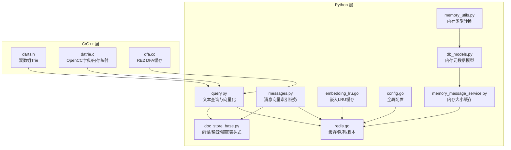
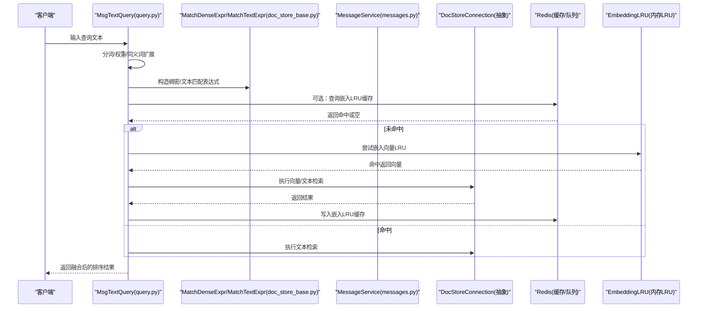
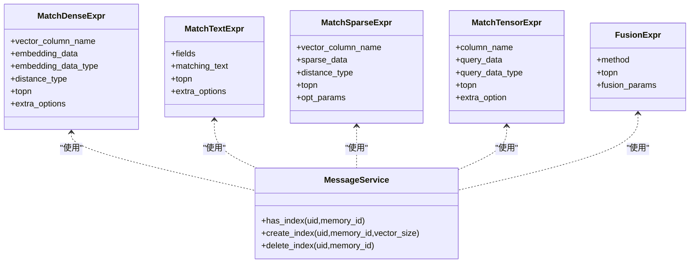
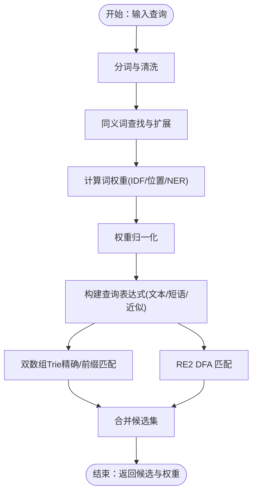
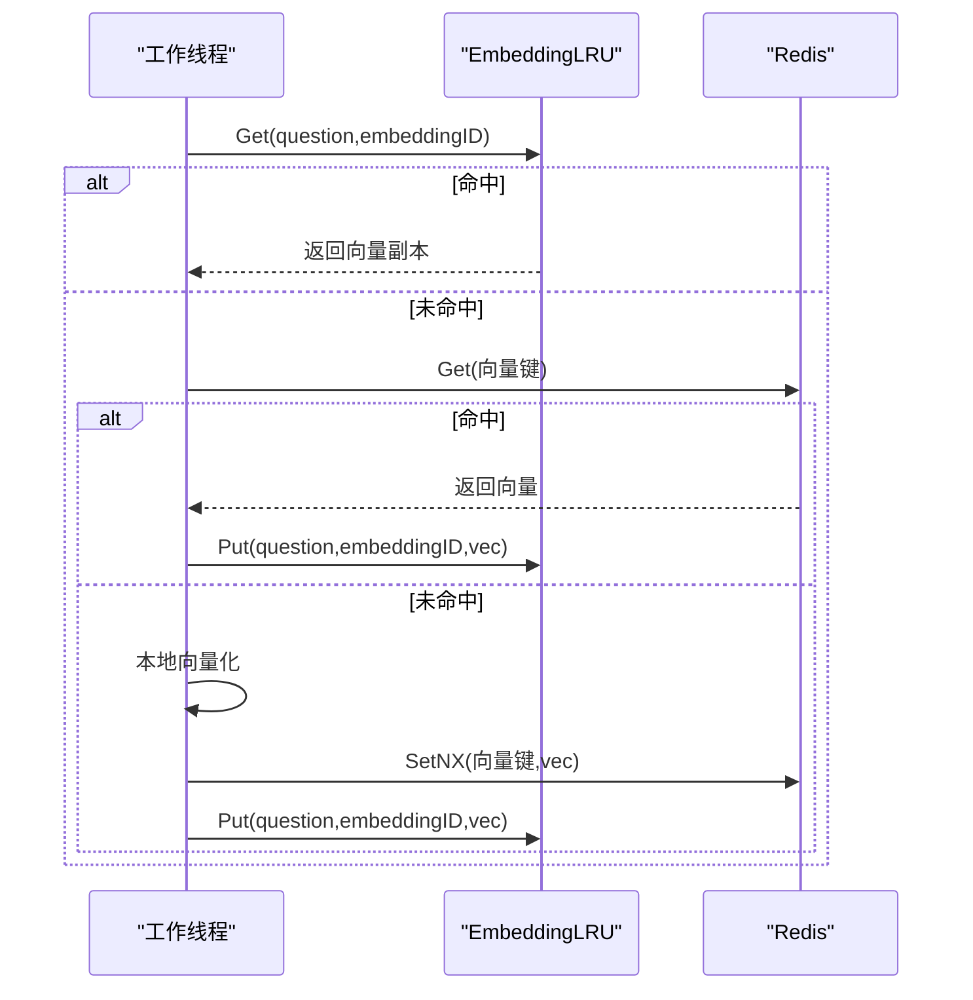
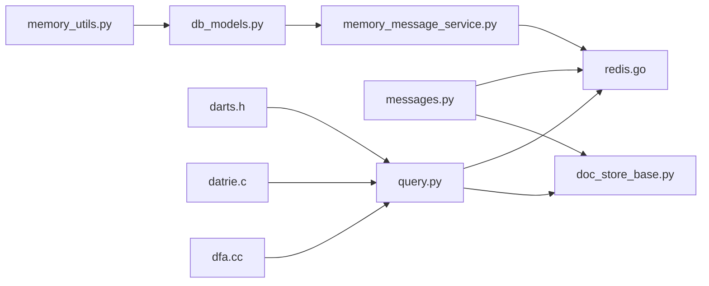

# 内存存储系统

<cite>
**本文引用的文件**
- [memory/services/messages.py](file://memory/services/messages.py)
- [memory/services/query.py](file://memory/services/query.py)
- [common/doc_store/doc_store_base.py](file://common/doc_store/doc_store_base.py)
- [internal/cache/redis.go](file://internal/cache/redis.go)
- [internal/utility/embedding_lru.go](file://internal/utility/embedding_lru.go)
- [internal/utility/scheduled_task.go](file://internal/utility/scheduled_task.go)
- [internal/server/config.go](file://internal/server/config.go)
- [api/db/joint_services/memory_message_service.py](file://api/db/joint_services/memory_message_service.py)
- [api/db/db_models.py](file://api/db/db_models.py)
- [api/utils/memory_utils.py](file://api/utils/memory_utils.py)
- [internal/cpp/darts/darts.h](file://internal/cpp/darts/darts.h)
- [internal/cpp/opencc/dictionary/datrie.c](file://internal/cpp/opencc/dictionary/datrie.c)
- [internal/cpp/re2/dfa.cc](file://internal/cpp/re2/dfa.cc)
- [api/utils/health_utils.py](file://api/utils/health_utils.py)
</cite>

## 目录
1. [简介](#简介)
2. [项目结构](#项目结构)
3. [核心组件](#核心组件)
4. [架构总览](#架构总览)
5. [详细组件分析](#详细组件分析)
6. [依赖分析](#依赖分析)
7. [性能考虑](#性能考虑)
8. [故障排查指南](#故障排查指南)
9. [结论](#结论)
10. [附录](#附录)

## 简介
本文件面向“内存存储系统”的技术文档，聚焦于向量存储设计、倒排索引实现、缓存策略、内存优化、高可用保障与监控调优。内容基于仓库中的消息检索与内存模型相关模块进行提炼与整合，帮助读者从代码层面理解系统如何在内存中组织、索引与查询向量与文本，并通过多级缓存与配置化能力实现高性能与可维护性。

## 项目结构
围绕“内存存储系统”，本仓库的关键目录与文件如下：
- 向量与检索表达式定义：common/doc_store/doc_store_base.py
- 消息向量索引服务：memory/services/messages.py
- 文本查询与向量化封装：memory/services/query.py
- 缓存与队列：internal/cache/redis.go
- 嵌入向量LRU缓存：internal/utility/embedding_lru.go
- 定时任务与状态上报：internal/utility/scheduled_task.go
- 配置中心：internal/server/config.go
- 内存元数据与缓存：api/db/db_models.py、api/db/joint_services/memory_message_service.py、api/utils/memory_utils.py
- 倒排/前缀树/正则引擎（C/C++）：internal/cpp/darts/darts.h、internal/cpp/opencc/dictionary/datrie.c、internal/cpp/re2/dfa.cc
- 健康检查与监控：api/utils/health_utils.py

图示来源
- [memory/services/query.py:26-41](file://memory/services/query.py#L26-L41)
- [memory/services/messages.py:27-42](file://memory/services/messages.py#L27-L42)
- [common/doc_store/doc_store_base.py:56-127](file://common/doc_store/doc_store_base.py#L56-L127)
- [internal/cache/redis.go:107-145](file://internal/cache/redis.go#L107-L145)
- [internal/utility/embedding_lru.go:24-46](file://internal/utility/embedding_lru.go#L24-L46)
- [internal/server/config.go:32-49](file://internal/server/config.go#L32-L49)
- [api/db/db_models.py:1306-1323](file://api/db/db_models.py#L1306-L1323)
- [api/db/joint_services/memory_message_service.py:296-318](file://api/db/joint_services/memory_message_service.py#L296-L318)
- [api/utils/memory_utils.py:19-55](file://api/utils/memory_utils.py#L19-L55)
- [internal/cpp/darts/darts.h:405-517](file://internal/cpp/darts/darts.h#L405-L517)
- [internal/cpp/opencc/dictionary/datrie.c:45-88](file://internal/cpp/opencc/dictionary/datrie.c#L45-L88)
- [internal/cpp/re2/dfa.cc:183-201](file://internal/cpp/re2/dfa.cc#L183-L201)

章节来源
- [memory/services/query.py:26-41](file://memory/services/query.py#L26-L41)
- [memory/services/messages.py:27-42](file://memory/services/messages.py#L27-L42)
- [common/doc_store/doc_store_base.py:56-127](file://common/doc_store/doc_store_base.py#L56-L127)
- [internal/cache/redis.go:107-145](file://internal/cache/redis.go#L107-L145)
- [internal/utility/embedding_lru.go:24-46](file://internal/utility/embedding_lru.go#L24-L46)
- [internal/server/config.go:32-49](file://internal/server/config.go#L32-L49)
- [api/db/db_models.py:1306-1323](file://api/db/db_models.py#L1306-L1323)
- [api/db/joint_services/memory_message_service.py:296-318](file://api/db/joint_services/memory_message_service.py#L296-L318)
- [api/utils/memory_utils.py:19-55](file://api/utils/memory_utils.py#L19-L55)
- [internal/cpp/darts/darts.h:405-517](file://internal/cpp/darts/darts.h#L405-L517)
- [internal/cpp/opencc/dictionary/datrie.c:45-88](file://internal/cpp/opencc/dictionary/datrie.c#L45-L88)
- [internal/cpp/re2/dfa.cc:183-201](file://internal/cpp/re2/dfa.cc#L183-L201)

## 核心组件
- 向量/稀疏/稠密表达式与匹配器：统一抽象了文本、稠密向量、稀疏向量与张量的查询表达式，便于上层按需组合。
- 消息向量索引服务：负责为每个记忆体（memory）创建/删除/检测向量索引，索引命名规则与向量维度由服务生成。
- 文本查询与向量化：对输入文本进行分词、同义词扩展、权重归一化，生成可执行的匹配表达式与关键词集合；同时支持将查询向量封装为稠密向量表达式。
- 缓存与队列：提供Redis客户端封装，内置Lua脚本（原子删除、令牌桶）、Stream消费/确认、有序集合操作等，支撑高并发场景。
- 嵌入向量LRU缓存：线程安全的LRU缓存，以问题+嵌入ID为复合键，避免重复向量化开销。
- 定时任务：周期性健康上报与任务调度，带重入保护与错误恢复。
- 配置中心：集中管理服务端口、数据库、Redis、文档引擎、存储引擎等配置。
- 内存元数据与缓存：记录内存大小、遗忘策略、温度系数等；提供Redis缓存读写与初始化。
- 倒排/前缀树/正则：C/C++实现的双数组Trie、OpenCC字典内存映射、RE2 DFA缓存，用于高效文本匹配与加速查询。

章节来源
- [common/doc_store/doc_store_base.py:56-127](file://common/doc_store/doc_store_base.py#L56-L127)
- [memory/services/messages.py:27-42](file://memory/services/messages.py#L27-L42)
- [memory/services/query.py:26-41](file://memory/services/query.py#L26-L41)
- [internal/cache/redis.go:107-145](file://internal/cache/redis.go#L107-L145)
- [internal/utility/embedding_lru.go:24-46](file://internal/utility/embedding_lru.go#L24-L46)
- [internal/utility/scheduled_task.go:79-157](file://internal/utility/scheduled_task.go#L79-L157)
- [internal/server/config.go:32-49](file://internal/server/config.go#L32-L49)
- [api/db/db_models.py:1306-1323](file://api/db/db_models.py#L1306-L1323)
- [api/db/joint_services/memory_message_service.py:296-318](file://api/db/joint_services/memory_message_service.py#L296-L318)
- [internal/cpp/darts/darts.h:405-517](file://internal/cpp/darts/darts.h#L405-L517)
- [internal/cpp/opencc/dictionary/datrie.c:45-88](file://internal/cpp/opencc/dictionary/datrie.c#L45-L88)
- [internal/cpp/re2/dfa.cc:183-201](file://internal/cpp/re2/dfa.cc#L183-L201)

## 架构总览
下图展示从查询到向量/文本匹配、再到缓存与存储的整体流程。

图示来源
- [memory/services/query.py:26-41](file://memory/services/query.py#L26-L41)
- [common/doc_store/doc_store_base.py:56-127](file://common/doc_store/doc_store_base.py#L56-L127)
- [memory/services/messages.py:27-42](file://memory/services/messages.py#L27-L42)
- [internal/cache/redis.go:107-145](file://internal/cache/redis.go#L107-L145)
- [internal/utility/embedding_lru.go:55-72](file://internal/utility/embedding_lru.go#L55-L72)

## 详细组件分析

### 向量存储与相似度计算
- 数据结构
  - 稠密向量表达式：封装向量列名、向量数据、距离类型（如余弦）、TopK与额外选项。
  - 稀疏向量表达式：支持索引-值对列表，便于稀疏特征检索。
  - 张量/文本表达式：用于混合检索与高维张量匹配。
- 相似度与查询
  - 查询向量封装：根据向量维度动态生成列名，构造稠密向量表达式并指定距离度量与阈值。
  - 文本查询：对输入进行分词、去噪、细粒度切分、同义词扩展与短语匹配，生成最小匹配阈值与原始查询保留字段。
- 索引与存储
  - 索引命名：基于用户ID与记忆体ID生成唯一索引名。
  - 索引创建/删除/存在性检查：通过连接接口完成，具体实现由后端文档引擎提供。

图示来源
- [common/doc_store/doc_store_base.py:56-127](file://common/doc_store/doc_store_base.py#L56-L127)
- [memory/services/messages.py:27-42](file://memory/services/messages.py#L27-L42)

章节来源
- [memory/services/query.py:26-41](file://memory/services/query.py#L26-L41)
- [memory/services/messages.py:27-42](file://memory/services/messages.py#L27-L42)
- [common/doc_store/doc_store_base.py:56-127](file://common/doc_store/doc_store_base.py#L56-L127)

### 倒排索引与权重计算
- 词项映射与文档频率（DF）
  - 权重计算模块维护停用词集、命名实体词典与文档频率映射，用于计算IDF与词位权重。
  - 权重归一化确保总和为1，便于后续融合排序。
- 合并与查询
  - 通过双数组Trie（Double Array Trie）实现高效精确匹配与前缀匹配。
  - OpenCC字典采用内存映射或分配方式加载，减少I/O与内存占用。
  - 正则引擎（RE2 DFA）使用读写锁与状态缓存，降低大规模并发下的缓存污染与竞争。

图示来源
- [internal/cpp/darts/darts.h:405-517](file://internal/cpp/darts/darts.h#L405-L517)
- [internal/cpp/opencc/dictionary/datrie.c:45-88](file://internal/cpp/opencc/dictionary/datrie.c#L45-L88)
- [internal/cpp/re2/dfa.cc:183-201](file://internal/cpp/re2/dfa.cc#L183-L201)

章节来源
- [internal/service/nlp/term_weight.go:443-496](file://internal/service/nlp/term_weight.go#L443-L496)
- [internal/cpp/darts/darts.h:405-517](file://internal/cpp/darts/darts.h#L405-L517)
- [internal/cpp/opencc/dictionary/datrie.c:45-88](file://internal/cpp/opencc/dictionary/datrie.c#L45-L88)
- [internal/cpp/re2/dfa.cc:183-201](file://internal/cpp/re2/dfa.cc#L183-L201)

### 缓存策略设计
- LRU淘汰
  - 嵌入向量LRU：以“问题+嵌入ID”为复合键，线程安全，支持Get/Put/Remove/Clear/Len。
- 预加载机制
  - 通过定时任务定期上报状态与健康信息，结合缓存初始化流程，保证关键路径的缓存热身。
- 缓存一致性
  - Redis提供原子操作（SETNX、管道事务）与Lua脚本（令牌桶、条件删除），降低竞态与不一致风险。
- 分层缓存
  - 内存LRU（EmbeddingLRU）与Redis缓存协同：高频向量优先内存命中，低频或批量更新走Redis，避免热点失效风暴。

图示来源
- [internal/utility/embedding_lru.go:55-102](file://internal/utility/embedding_lru.go#L55-L102)
- [internal/cache/redis.go:373-408](file://internal/cache/redis.go#L373-L408)

章节来源
- [internal/utility/embedding_lru.go:24-141](file://internal/utility/embedding_lru.go#L24-L141)
- [internal/cache/redis.go:107-145](file://internal/cache/redis.go#L107-L145)
- [internal/utility/scheduled_task.go:79-157](file://internal/utility/scheduled_task.go#L79-L157)

### 内存优化技术
- 内存池与对象复用
  - C++侧使用自动数组/栈与位向量，减少频繁分配与拷贝。
- 垃圾回收优化
  - Go侧通过原子标志与panic恢复，避免长时间阻塞；Redis使用Lua脚本减少网络往返与GC压力。
- 内存映射
  - OpenCC字典优先尝试mmap，失败回退到malloc，兼顾大词典的快速加载与内存占用控制。
- 压缩与稀疏表示
  - 稀疏向量表达式支持索引-值对，降低高维向量存储与传输成本。

章节来源
- [internal/cpp/darts/darts.h:525-533](file://internal/cpp/darts/darts.h#L525-L533)
- [internal/cpp/opencc/dictionary/datrie.c:45-88](file://internal/cpp/opencc/dictionary/datrie.c#L45-L88)
- [internal/cache/redis.go:61-104](file://internal/cache/redis.go#L61-L104)
- [common/doc_store/doc_store_base.py:24-55](file://common/doc_store/doc_store_base.py#L24-L55)

### 高可用性保障
- 内存镜像与容量扩展
  - 内存模型包含容量与遗忘策略字段，支持LRU/FIFO等策略；通过Redis缓存记录当前内存大小，便于扩容与迁移。
- 故障转移与数据恢复
  - Redis提供Stream消费组与Pending消息处理，配合ACK与重入队列，实现消息可靠投递与故障恢复。
- 健康检查
  - 统一健康检查接口返回连接状态、延迟、吞吐等指标，辅助运维判断与自动切换。

章节来源
- [api/db/db_models.py:1306-1323](file://api/db/db_models.py#L1306-L1323)
- [api/db/joint_services/memory_message_service.py:296-318](file://api/db/joint_services/memory_message_service.py#L296-L318)
- [internal/cache/redis.go:630-726](file://internal/cache/redis.go#L630-L726)
- [api/utils/health_utils.py:174-198](file://api/utils/health_utils.py#L174-L198)

## 依赖分析
- Python层
  - query.py依赖term_weight与synonym进行权重与同义词扩展，依赖doc_store_base生成匹配表达式。
  - messages.py依赖settings中的消息存储连接，完成索引生命周期管理。
  - redis.go提供统一的Redis客户端封装与Lua脚本，被多处服务共享。
  - memory_message_service.py与db_models.py共同维护内存元数据与缓存。
- C/C++层
  - darts.h与datrie.c分别提供高效前缀/精确匹配与字典内存映射。
  - re2/dfa.cc提供正则DFA缓存与读写锁，降低并发冲突。

图示来源
- [memory/services/query.py:26-41](file://memory/services/query.py#L26-L41)
- [memory/services/messages.py:27-42](file://memory/services/messages.py#L27-L42)
- [common/doc_store/doc_store_base.py:56-127](file://common/doc_store/doc_store_base.py#L56-L127)
- [internal/cache/redis.go:107-145](file://internal/cache/redis.go#L107-L145)
- [api/db/joint_services/memory_message_service.py:296-318](file://api/db/joint_services/memory_message_service.py#L296-L318)
- [api/db/db_models.py:1306-1323](file://api/db/db_models.py#L1306-L1323)
- [api/utils/memory_utils.py:19-55](file://api/utils/memory_utils.py#L19-L55)
- [internal/cpp/darts/darts.h:405-517](file://internal/cpp/darts/darts.h#L405-L517)
- [internal/cpp/opencc/dictionary/datrie.c:45-88](file://internal/cpp/opencc/dictionary/datrie.c#L45-L88)
- [internal/cpp/re2/dfa.cc:183-201](file://internal/cpp/re2/dfa.cc#L183-L201)

章节来源
- [memory/services/query.py:26-41](file://memory/services/query.py#L26-L41)
- [memory/services/messages.py:27-42](file://memory/services/messages.py#L27-L42)
- [common/doc_store/doc_store_base.py:56-127](file://common/doc_store/doc_store_base.py#L56-L127)
- [internal/cache/redis.go:107-145](file://internal/cache/redis.go#L107-L145)
- [api/db/joint_services/memory_message_service.py:296-318](file://api/db/joint_services/memory_message_service.py#L296-L318)
- [api/db/db_models.py:1306-1323](file://api/db/db_models.py#L1306-L1323)
- [api/utils/memory_utils.py:19-55](file://api/utils/memory_utils.py#L19-L55)
- [internal/cpp/darts/darts.h:405-517](file://internal/cpp/darts/darts.h#L405-L517)
- [internal/cpp/opencc/dictionary/datrie.c:45-88](file://internal/cpp/opencc/dictionary/datrie.c#L45-L88)
- [internal/cpp/re2/dfa.cc:183-201](file://internal/cpp/re2/dfa.cc#L183-L201)

## 性能考虑
- 向量检索
  - 使用稠密向量表达式与TopK裁剪，结合距离度量（如余弦）与相似度阈值，平衡召回与速度。
  - 嵌入向量LRU显著降低重复编码开销，建议合理设置容量与并发访问策略。
- 文本检索
  - 双数组Trie与RE2 DFA结合，前缀/精确/正则多场景覆盖；权重归一化与最小匹配阈值控制召回质量。
- 缓存
  - Redis原子操作与Lua脚本减少RTT与竞态；Stream消费组实现可靠消息传递；定时任务保障缓存热身。
- 存储
  - 稀疏向量与内存映射字典降低内存占用；索引命名与维度动态列名提升可扩展性。

[本节为通用指导，无需列出章节来源]

## 故障排查指南
- 健康检查
  - 通过健康工具获取连接状态、延迟、吞吐与错误信息，定位慢查询与连接异常。
- Redis相关
  - 使用Ping/Info/Exist等方法验证连通性与资源使用；利用Lua脚本与原子操作排查竞态。
- 定时任务
  - 观察任务是否重复执行或卡死，检查原子标志与panic恢复日志。
- 内存与容量
  - 通过内存模型字段与Redis缓存记录的大小，评估容量与遗忘策略是否合理。

章节来源
- [api/utils/health_utils.py:174-198](file://api/utils/health_utils.py#L174-L198)
- [internal/cache/redis.go:165-186](file://internal/cache/redis.go#L165-L186)
- [internal/utility/scheduled_task.go:124-142](file://internal/utility/scheduled_task.go#L124-L142)
- [api/db/db_models.py:1306-1323](file://api/db/db_models.py#L1306-L1323)
- [api/db/joint_services/memory_message_service.py:296-318](file://api/db/joint_services/memory_message_service.py#L296-L318)

## 结论
该内存存储系统以“表达式抽象+多级缓存+配置化+C/C++加速”为核心，实现了从文本到向量的高效检索与融合排序。通过LRU与Redis的协同、DFA/Trie/内存映射等底层优化，系统在高并发与大数据规模下仍保持稳定与高性能。结合健康检查与容量策略，可进一步增强可用性与可运维性。

[本节为总结，无需列出章节来源]

## 附录
- 关键配置项
  - 服务器端口、模式、数据库、Redis、文档引擎、存储引擎等集中于配置中心，便于环境差异化部署。
- 内存元数据
  - 记录内存名称、类型（原始/语义/情节/程序性）、存储类型、嵌入模型、遗忘策略、温度系数、系统/用户提示等。

章节来源
- [internal/server/config.go:32-49](file://internal/server/config.go#L32-L49)
- [api/db/db_models.py:1306-1323](file://api/db/db_models.py#L1306-L1323)
- [api/utils/memory_utils.py:19-55](file://api/utils/memory_utils.py#L19-L55)