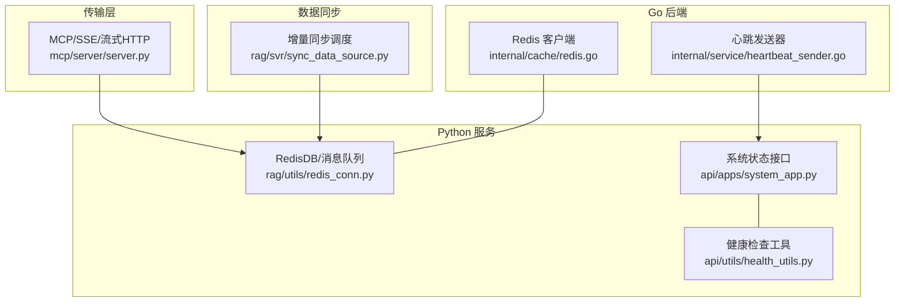
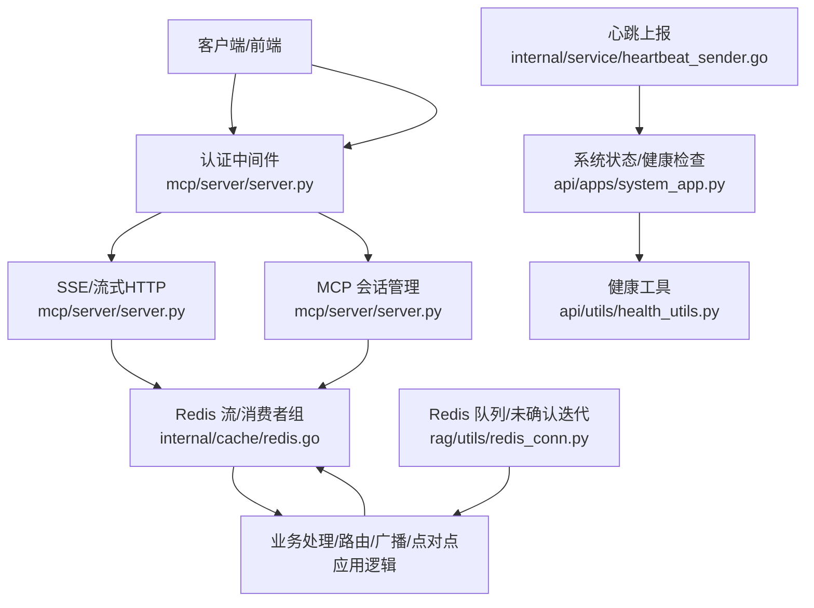
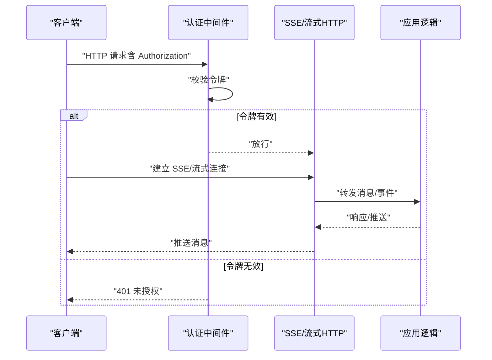
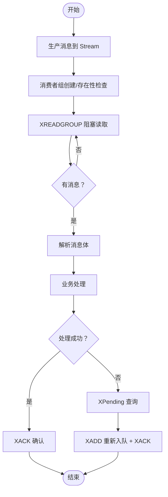
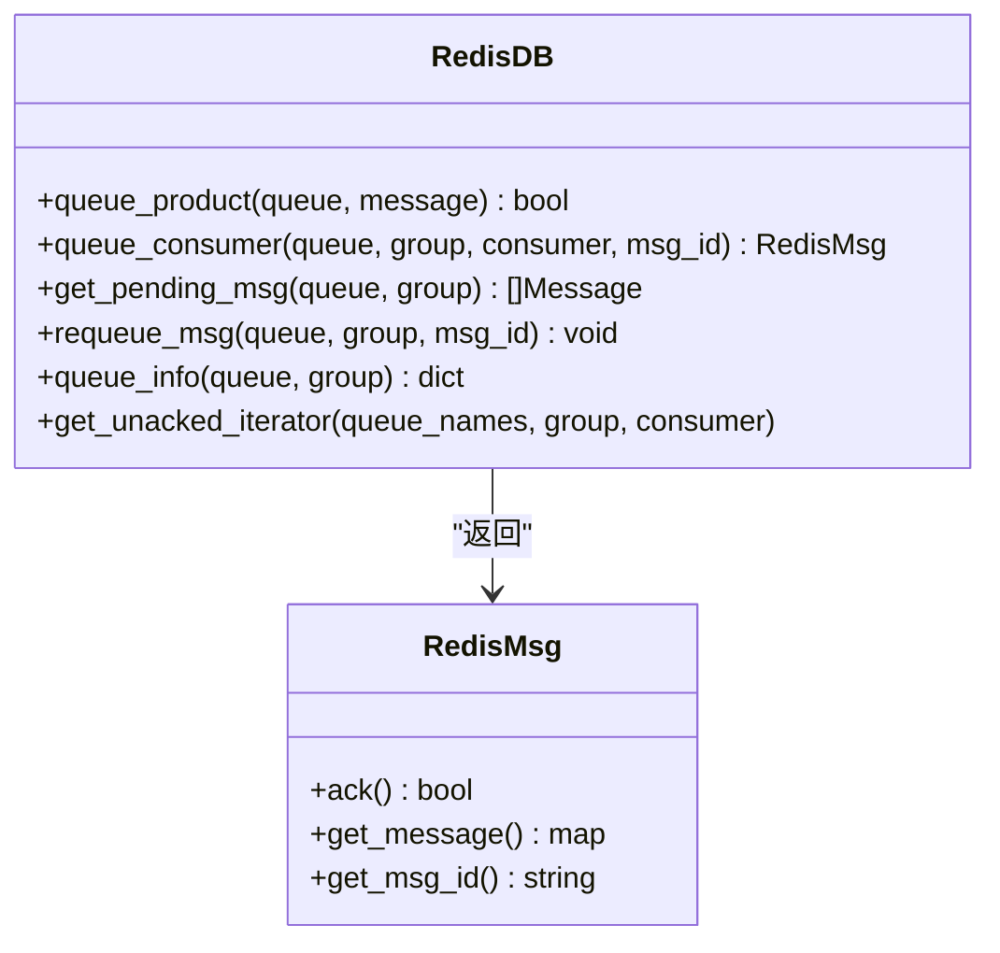
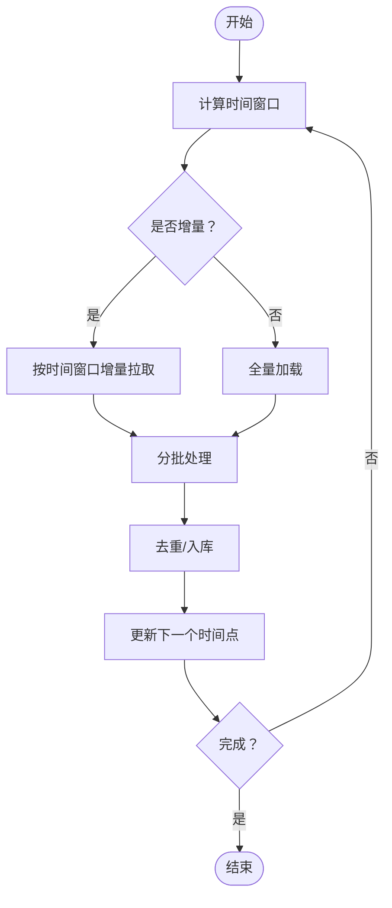
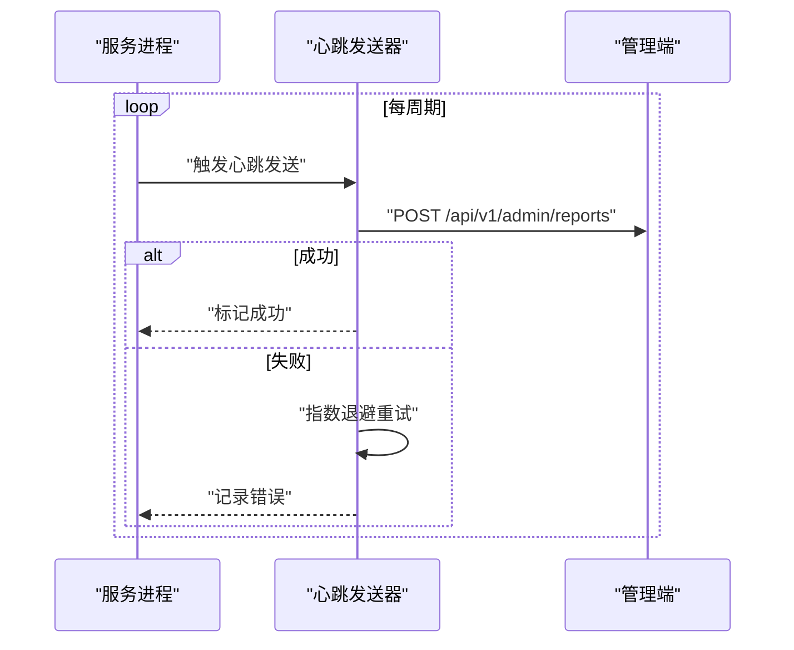
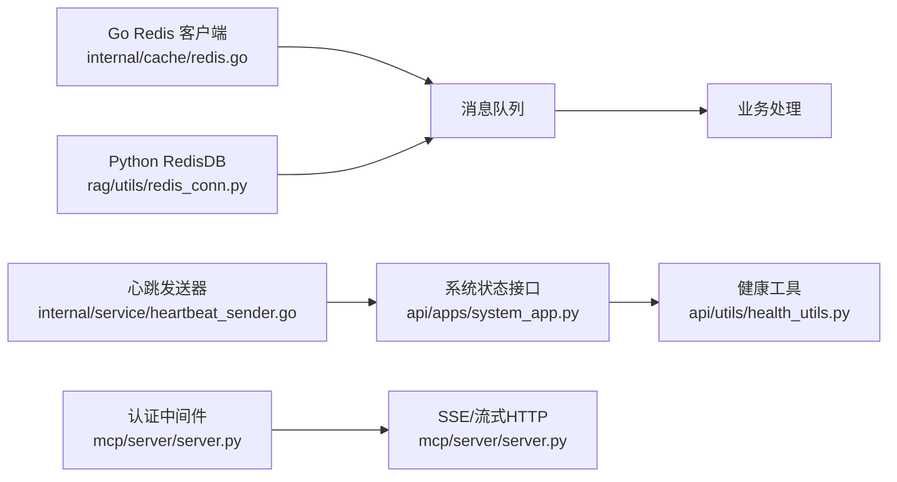

# 实时通信支持

<cite>
**本文引用的文件**
- [internal/cache/redis.go](file://internal/cache/redis.go)
- [rag/utils/redis_conn.py](file://rag/utils/redis_conn.py)
- [api/apps/system_app.py](file://api/apps/system_app.py)
- [api/utils/health_utils.py](file://api/utils/health_utils.py)
- [internal/service/heartbeat_sender.go](file://internal/service/heartbeat_sender.go)
- [rag/svr/sync_data_source.py](file://rag/svr/sync_data_source.py)
- [mcp/server/server.py](file://mcp/server/server.py)
</cite>

## 目录
1. [简介](#简介)
2. [项目结构](#项目结构)
3. [核心组件](#核心组件)
4. [架构总览](#架构总览)
5. [详细组件分析](#详细组件分析)
6. [依赖分析](#依赖分析)
7. [性能考虑](#性能考虑)
8. [故障排查指南](#故障排查指南)
9. [结论](#结论)
10. [附录](#附录)

## 简介
本技术文档聚焦于实时通信系统的实现与优化，围绕以下目标展开：WebSocket 连接管理（连接建立、心跳检测、断线重连、连接池管理）、消息推送机制（消息路由、广播机制、点对点通信、消息确认）、订阅发布模式（主题订阅、消息过滤、负载均衡、消息去重）、消息队列处理（队列管理、消息优先级、批量处理、失败重试）、实时数据同步（状态同步、事件传播、一致性保证、冲突解决），并提供性能优化、网络异常处理、安全防护与监控告警机制。

## 项目结构
本仓库中与实时通信密切相关的模块主要分布在如下位置：
- Go 后端缓存与消息队列：internal/cache/redis.go
- Python 消息队列与分布式锁：rag/utils/redis_conn.py
- 系统健康与任务执行器心跳：api/apps/system_app.py、api/utils/health_utils.py
- 心跳上报服务：internal/service/heartbeat_sender.go
- 数据源增量同步与并发控制：rag/svr/sync_data_source.py
- MCP/SSE/流式 HTTP 传输入口：mcp/server/server.py

图表来源
- [internal/cache/redis.go:1-800](file://internal/cache/redis.go#L1-L800)
- [rag/utils/redis_conn.py:1-553](file://rag/utils/redis_conn.py#L1-L553)
- [api/apps/system_app.py:1-378](file://api/apps/system_app.py#L1-L378)
- [api/utils/health_utils.py:1-365](file://api/utils/health_utils.py#L1-L365)
- [internal/service/heartbeat_sender.go:1-144](file://internal/service/heartbeat_sender.go#L1-L144)
- [rag/svr/sync_data_source.py:1-800](file://rag/svr/sync_data_source.py#L1-L800)
- [mcp/server/server.py:564-623](file://mcp/server/server.py#L564-L623)

章节来源
- [internal/cache/redis.go:1-800](file://internal/cache/redis.go#L1-L800)
- [rag/utils/redis_conn.py:1-553](file://rag/utils/redis_conn.py#L1-L553)
- [api/apps/system_app.py:1-378](file://api/apps/system_app.py#L1-L378)
- [api/utils/health_utils.py:1-365](file://api/utils/health_utils.py#L1-L365)
- [internal/service/heartbeat_sender.go:1-144](file://internal/service/heartbeat_sender.go#L1-L144)
- [rag/svr/sync_data_source.py:1-800](file://rag/svr/sync_data_source.py#L1-L800)
- [mcp/server/server.py:564-623](file://mcp/server/server.py#L564-L623)

## 核心组件
- Redis 消息队列与流式处理：提供生产/消费、消费者组、ACK、Pending 查询、重新入队等能力，支撑消息路由与可靠投递。
- Python RedisDB：封装 Redis 命令、Lua 脚本、分布式锁、队列操作与未确认消息迭代器，用于任务执行器与数据同步。
- 系统状态与健康检查：统一对外暴露系统健康状态、Redis 连通性、任务执行器心跳集合，便于运维与监控。
- 心跳上报服务：向管理端定期上报服务状态，作为运行时健康度量的一部分。
- 数据源增量同步：基于时间窗口的增量拉取与批处理，结合并发限制与超时控制，保障大规模数据同步的稳定性。
- 传输层入口：MCP/SSE/流式 HTTP 提供多种实时传输通道，配合认证中间件确保访问安全。

章节来源
- [internal/cache/redis.go:630-829](file://internal/cache/redis.go#L630-L829)
- [rag/utils/redis_conn.py:386-508](file://rag/utils/redis_conn.py#L386-L508)
- [api/apps/system_app.py:159-171](file://api/apps/system_app.py#L159-L171)
- [api/utils/health_utils.py:308-326](file://api/utils/health_utils.py#L308-L326)
- [internal/service/heartbeat_sender.go:79-143](file://internal/service/heartbeat_sender.go#L79-L143)
- [rag/svr/sync_data_source.py:80-185](file://rag/svr/sync_data_source.py#L80-L185)
- [mcp/server/server.py:564-623](file://mcp/server/server.py#L564-L623)

## 架构总览
实时通信由“传输层”“消息队列层”“业务处理层”“监控与健康层”构成。传输层负责接入与认证；消息队列层提供可靠的消息分发；业务处理层完成消息路由、广播、点对点投递与确认；监控与健康层提供系统状态与任务执行器心跳。

图表来源
- [mcp/server/server.py:564-623](file://mcp/server/server.py#L564-L623)
- [internal/cache/redis.go:630-829](file://internal/cache/redis.go#L630-L829)
- [rag/utils/redis_conn.py:386-508](file://rag/utils/redis_conn.py#L386-L508)
- [api/apps/system_app.py:159-171](file://api/apps/system_app.py#L159-L171)
- [api/utils/health_utils.py:308-326](file://api/utils/health_utils.py#L308-L326)
- [internal/service/heartbeat_sender.go:79-143](file://internal/service/heartbeat_sender.go#L79-L143)

## 详细组件分析

### WebSocket/传输层与认证
- 认证中间件：对特定路径（如 /messages/、/sse、/mcp）进行授权校验，缺失或无效令牌直接拒绝。
- SSE/流式 HTTP：提供长连接消息通道，结合会话管理器实现多路复用与初始化选项传递。
- 安全策略：通过中间件拦截未授权请求，避免未认证访问敏感接口。

图表来源
- [mcp/server/server.py:564-623](file://mcp/server/server.py#L564-L623)

章节来源
- [mcp/server/server.py:564-623](file://mcp/server/server.py#L564-L623)

### 消息队列与消费者组（Go）
- 生产：将消息以 JSON 形式写入 Redis Stream，支持重试与错误记录。
- 消费：使用 XREADGROUP 创建/加入消费者组，按需阻塞等待消息，支持 ACK 与 Pending 查询。
- 重试与重新入队：通过 XADD/XACK/XRANGE 实现消息重新入队与确认，保障至少一次投递。
- 健康与信息：提供 Ping、Info、消费者组信息查询，辅助运维与监控。

图表来源
- [internal/cache/redis.go:630-829](file://internal/cache/redis.go#L630-L829)

章节来源
- [internal/cache/redis.go:630-829](file://internal/cache/redis.go#L630-L829)

### 消息队列与消费者组（Python）
- 队列操作：生产/消费、消费者组创建、Pending 查询、重新入队、队列信息查询。
- 未确认迭代器：遍历指定队列的未确认消息，支持跨多个队列聚合扫描。
- 分布式锁：基于 Redis 的 Lua 脚本实现原子性删除与获取，保障并发安全。

图表来源
- [rag/utils/redis_conn.py:386-508](file://rag/utils/redis_conn.py#L386-L508)

章节来源
- [rag/utils/redis_conn.py:386-508](file://rag/utils/redis_conn.py#L386-L508)

### 订阅发布与负载均衡
- 主题与消费者组：通过不同队列名实现主题隔离，消费者组实现负载均衡与容错。
- 广播与点对点：同一主题下多消费者实例可实现广播；单消费者实例实现点对点。
- 消息过滤：在业务层根据消息类型/目标用户/租户等字段进行过滤与路由。
- 去重：利用 Redis SETNX 或分布式锁确保幂等处理，避免重复消费。

章节来源
- [internal/cache/redis.go:664-725](file://internal/cache/redis.go#L664-L725)
- [rag/utils/redis_conn.py:446-470](file://rag/utils/redis_conn.py#L446-L470)

### 实时数据同步与一致性
- 增量同步：基于时间戳窗口的增量拉取，避免全量扫描带来的压力。
- 批处理与并发：通过信号量限制并发任务数，结合批次大小控制内存与吞吐。
- 超时与异常：统一捕获超时与异常，记录完整堆栈，更新同步日志状态。
- 冲突解决：通过哈希标识与去重逻辑，避免重复入库与冲突。

图表来源
- [rag/svr/sync_data_source.py:80-185](file://rag/svr/sync_data_source.py#L80-L185)

章节来源
- [rag/svr/sync_data_source.py:80-185](file://rag/svr/sync_data_source.py#L80-L185)

### 心跳检测与断线重连
- 心跳上报：定时向管理端发送心跳，携带版本、主机、端口等元信息，失败时重试并记录。
- 任务执行器心跳：从 Redis 中读取最近心跳记录，判断执行器存活状态。
- 断线重连：队列消费侧对连接异常进行重试与恢复，确保消息不丢失。

图表来源
- [internal/service/heartbeat_sender.go:79-143](file://internal/service/heartbeat_sender.go#L79-L143)

章节来源
- [internal/service/heartbeat_sender.go:79-143](file://internal/service/heartbeat_sender.go#L79-L143)
- [api/apps/system_app.py:159-171](file://api/apps/system_app.py#L159-L171)
- [api/utils/health_utils.py:308-326](file://api/utils/health_utils.py#L308-L326)

## 依赖分析
- Go Redis 客户端与 Python RedisDB 共同支撑消息队列能力，二者在接口设计上保持一致，便于跨语言协作。
- 系统状态接口依赖健康检查工具与 Redis 连通性，任务执行器心跳通过有序集合存储与范围查询实现。
- 传输层中间件与认证逻辑前置，确保只有授权请求进入后续处理链。
- 心跳发送器与系统状态接口形成闭环，前者提供运行态指标，后者汇总展示。

图表来源
- [internal/cache/redis.go:1-800](file://internal/cache/redis.go#L1-L800)
- [rag/utils/redis_conn.py:1-553](file://rag/utils/redis_conn.py#L1-L553)
- [api/apps/system_app.py:159-171](file://api/apps/system_app.py#L159-L171)
- [api/utils/health_utils.py:308-326](file://api/utils/health_utils.py#L308-L326)
- [internal/service/heartbeat_sender.go:79-143](file://internal/service/heartbeat_sender.go#L79-L143)
- [mcp/server/server.py:564-623](file://mcp/server/server.py#L564-L623)

章节来源
- [internal/cache/redis.go:1-800](file://internal/cache/redis.go#L1-L800)
- [rag/utils/redis_conn.py:1-553](file://rag/utils/redis_conn.py#L1-L553)
- [api/apps/system_app.py:159-171](file://api/apps/system_app.py#L159-L171)
- [api/utils/health_utils.py:308-326](file://api/utils/health_utils.py#L308-L326)
- [internal/service/heartbeat_sender.go:79-143](file://internal/service/heartbeat_sender.go#L79-L143)
- [mcp/server/server.py:564-623](file://mcp/server/server.py#L564-L623)

## 性能考虑
- 连接与池化：Redis 客户端采用全局单例与 Ping 健康探测，减少连接开销；建议在高并发场景下启用连接池参数调优。
- 阻塞读取与批量：XREADGROUP 支持阻塞读取与批量返回，降低轮询成本；合理设置 Count 与 Block 时间平衡延迟与吞吐。
- 并发与限流：同步任务通过信号量限制并发，避免资源争用；消息处理侧可引入速率限制脚本（Lua）控制突发流量。
- 序列化与压缩：消息体采用 JSON 序列化，建议在大体量场景下评估压缩策略与字段裁剪。
- 缓存与索引：利用 Redis ZSet 存储任务执行器心跳，范围查询高效；注意键空间与过期策略避免内存膨胀。

## 故障排查指南
- Redis 连接异常：检查 Ping 健康探测与 Info 输出，定位网络、认证与配置问题。
- 消息积压与 Pending：通过 XPending 查询 Pending 列表，必要时重新入队并确认处理逻辑。
- 未确认消息扫描：使用未确认迭代器遍历队列，逐步修复卡住的消息。
- 心跳与存活：核对系统状态接口中的任务执行器心跳集合，判断服务存活与延迟。
- 认证失败：确认中间件是否正确提取 Authorization 头，避免 401 误拒。
- 增量同步异常：检查时间窗口与批次大小，关注超时与异常堆栈，及时回滚与重试。

章节来源
- [internal/cache/redis.go:752-829](file://internal/cache/redis.go#L752-L829)
- [rag/utils/redis_conn.py:446-508](file://rag/utils/redis_conn.py#L446-L508)
- [api/apps/system_app.py:159-171](file://api/apps/system_app.py#L159-L171)
- [api/utils/health_utils.py:308-326](file://api/utils/health_utils.py#L308-L326)
- [mcp/server/server.py:564-623](file://mcp/server/server.py#L564-L623)
- [rag/svr/sync_data_source.py:80-185](file://rag/svr/sync_data_source.py#L80-L185)

## 结论
该实时通信体系以 Redis 为核心，结合 Go 与 Python 双栈实现消息队列、传输层与健康监控，具备可靠的消费者组、ACK/Pending 管理与未确认迭代能力。通过认证中间件、心跳上报与系统状态接口，形成完整的可观测与可维护闭环。在高并发与大规模数据同步场景下，建议进一步优化连接池、阻塞参数与速率限制，并完善告警与自愈机制。

## 附录
- 安全与合规：严格启用认证中间件，最小权限原则分配令牌；对敏感字段进行脱敏与加密。
- 监控与告警：基于系统状态接口与健康工具输出的关键指标（连接、延迟、QPS、慢查询、连接池统计）建立阈值告警。
- 运维建议：定期清理过期键与 Pending 长尾消息；对热点队列进行拆分与分区；在高峰期动态调整并发与批量参数。