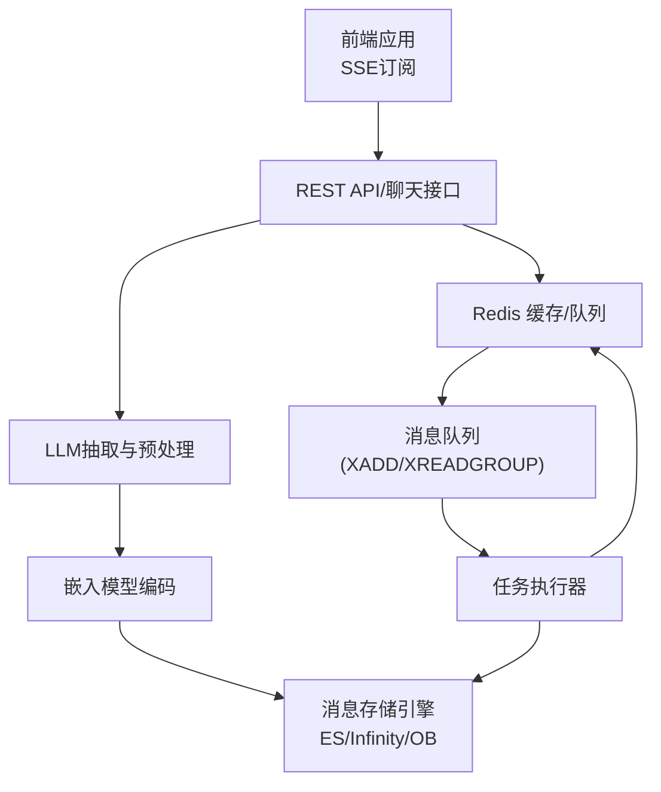
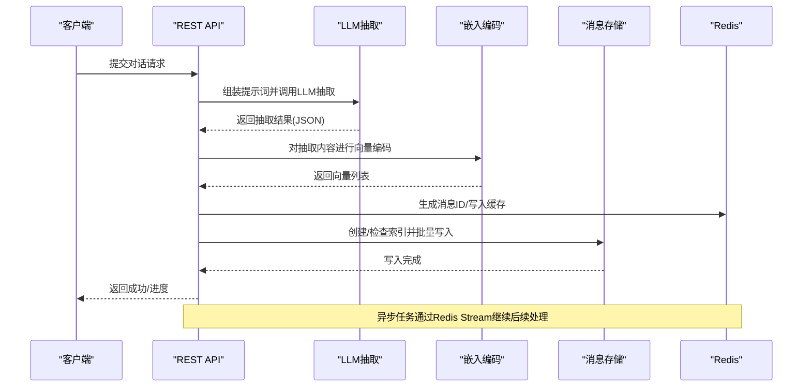
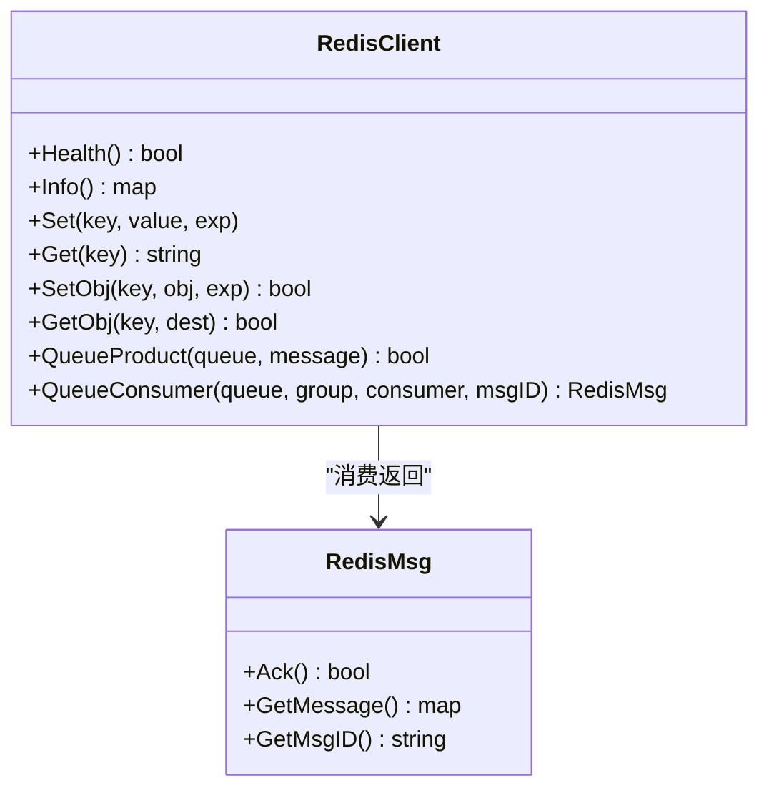
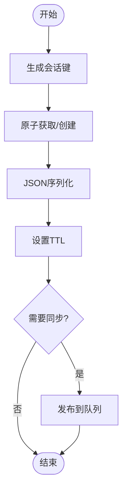
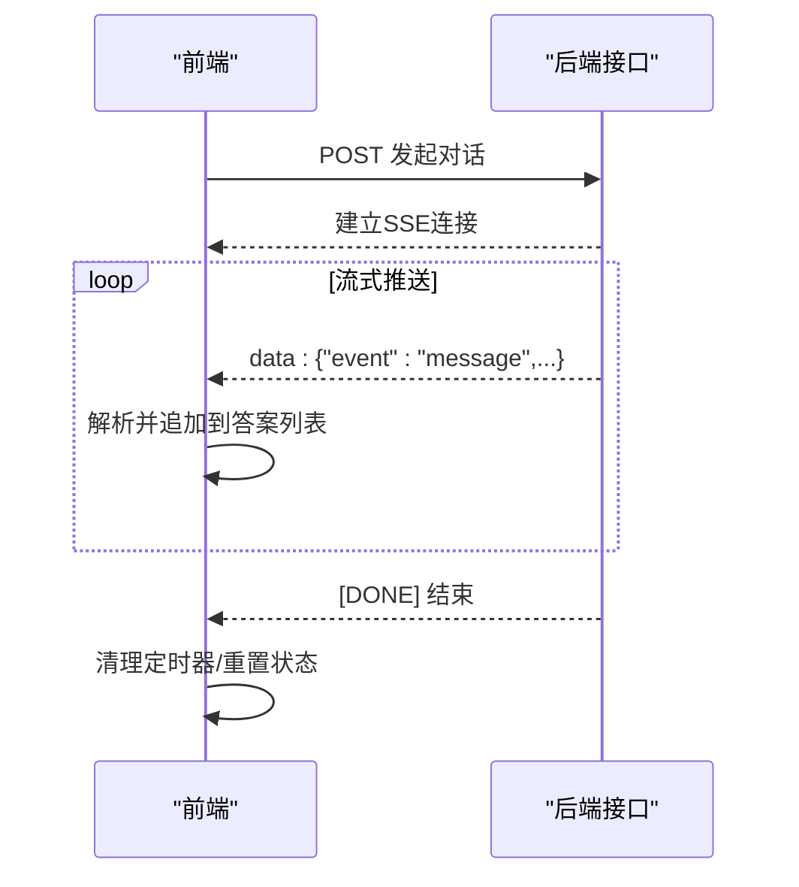
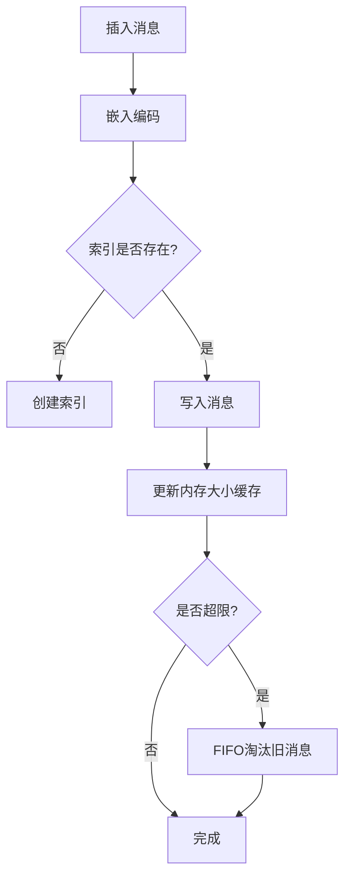
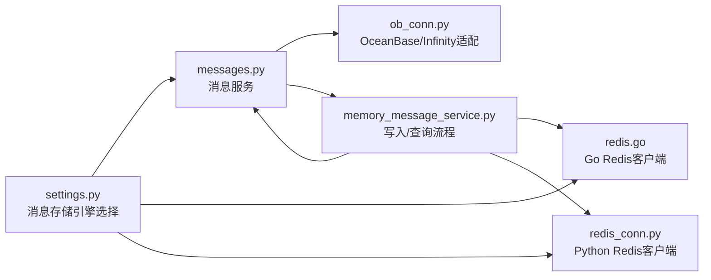

# 消息存储系统

<cite>
**本文档引用的文件**
- [redis.go](file://internal/cache/redis.go)
- [redis_conn.py](file://rag/utils/redis_conn.py)
- [messages.py](file://memory/services/messages.py)
- [memory_message_service.py](file://api/db/joint_services/memory_message_service.py)
- [settings.py](file://common/settings.py)
- [config.go](file://internal/server/config.go)
- [values.yaml](file://helm/values.yaml)
- [msg_util.py](file://memory/utils/msg_util.py)
- [ob_conn.py](file://memory/utils/ob_conn.py)
- [http_api_reference.md](file://docs/references/http_api_reference.md)
- [use-send-message.ts](file://web/src/hooks/use-send-message.ts)
- [use-chat-request.ts](file://web/src/hooks/use-chat-request.ts)
</cite>

## 目录
1. [简介](#简介)
2. [项目结构](#项目结构)
3. [核心组件](#核心组件)
4. [架构总览](#架构总览)
5. [详细组件分析](#详细组件分析)
6. [依赖关系分析](#依赖关系分析)
7. [性能考量](#性能考量)
8. [故障排除指南](#故障排除指南)
9. [结论](#结论)
10. [附录](#附录)

## 简介
本文件面向RAGFlow的消息存储系统，聚焦于消息的持久化、检索、向量化与实时通信支撑。内容涵盖：
- Redis缓存与消息队列：连接池、键值设计、过期策略、集群部署与健康检查
- 会话状态管理：用户会话存储、过期处理、序列化与分布式同步
- 实时通信：WebSocket/SSE连接管理、消息推送、订阅发布与队列处理
- 内存存储：向量索引、倒排/全文检索、缓存策略与内存优化
- 高可用：主从复制、故障转移、备份与恢复
- 配置示例、性能调优、监控指标与故障排除

## 项目结构
消息存储系统由多层协作构成：
- 前端通过SSE流接收实时消息
- 后端服务负责消息提取、嵌入、索引与查询
- Redis用于缓存、分布式锁、消息队列与任务编排
- 文档存储引擎（Elasticsearch/Infinity/OceanBase）承载消息向量与文本检索
- Helm模板提供Redis集群部署能力

图示来源
- [redis.go:631-726](file://internal/cache/redis.go#L631-L726)
- [redis_conn.py:386-444](file://rag/utils/redis_conn.py#L386-L444)
- [memory_message_service.py:175-221](file://api/db/joint_services/memory_message_service.py#L175-L221)
- [settings.py:287-300](file://common/settings.py#L287-L300)

章节来源
- [redis.go:107-145](file://internal/cache/redis.go#L107-L145)
- [redis_conn.py:114-145](file://rag/utils/redis_conn.py#L114-L145)
- [settings.py:287-300](file://common/settings.py#L287-L300)

## 核心组件
- Redis客户端封装：提供连接初始化、健康检查、信息采集、键值操作、集合/有序集操作、自增ID生成、Lua脚本、Stream队列生产/消费、ACK/Pending重入等
- 消息服务：对消息进行插入、更新、删除、分页查询、最近消息检索、向量相似度检索、大小统计与淘汰
- 存储引擎适配：根据配置选择ES/Infinity/OceanBase作为消息存储后端，并支持向量字段解析与融合检索
- 任务队列：通过Redis Stream实现任务编排，支持消费者组、ACK、Pending消息重取
- 前端SSE：基于浏览器EventSource解析流式响应，实时渲染对话

章节来源
- [redis.go:42-105](file://internal/cache/redis.go#L42-L105)
- [messages.py:27-42](file://memory/services/messages.py#L27-L42)
- [memory_message_service.py:38-91](file://api/db/joint_services/memory_message_service.py#L38-L91)
- [use-send-message.ts:95-194](file://web/src/hooks/use-send-message.ts#L95-L194)

## 架构总览
消息从产生到持久化与检索的关键路径如下：

图示来源
- [memory_message_service.py:38-91](file://api/db/joint_services/memory_message_service.py#L38-L91)
- [messages.py:44-63](file://memory/services/messages.py#L44-L63)
- [redis.go:631-726](file://internal/cache/redis.go#L631-L726)

## 详细组件分析

### Redis缓存与消息队列
- 连接池与初始化
  - Go侧Redis客户端通过单例初始化，支持Ping健康检查与信息采集
  - Python侧RedisDB通过Valkey StrictRedis连接，注册Lua脚本，支持自动重连
- 键值设计
  - 自增ID：使用命名空间前缀（如“id_generator:memory”）
  - 内存大小缓存：以“memory_{memory_id}”为键
  - LLM/Embed缓存：以哈希计算得到的十六进制字符串为键
- 过期策略
  - 缓存项统一设置TTL（如24小时）
  - Lua令牌桶脚本结合EXPIRE控制键生命周期
- 集群与部署
  - Helm模板启用Redis并可配置持久化
  - 服务配置中将Redis识别为消息队列类型
- Stream队列
  - 生产：XADD写入消息体
  - 消费：XREADGROUP按消费者组读取，ACK确认
  - Pending重取：XPendingExt与XRange+XAdd重入

图示来源
- [redis.go:107-145](file://internal/cache/redis.go#L107-L145)
- [redis.go:631-726](file://internal/cache/redis.go#L631-L726)
- [redis.go:728-750](file://internal/cache/redis.go#L728-L750)

章节来源
- [redis.go:107-145](file://internal/cache/redis.go#L107-L145)
- [redis.go:631-726](file://internal/cache/redis.go#L631-L726)
- [redis.go:752-779](file://internal/cache/redis.go#L752-L779)
- [redis_conn.py:114-145](file://rag/utils/redis_conn.py#L114-L145)
- [redis_conn.py:386-444](file://rag/utils/redis_conn.py#L386-L444)
- [redis_conn.py:472-508](file://rag/utils/redis_conn.py#L472-L508)
- [config.go:300-315](file://internal/server/config.go#L300-L315)
- [values.yaml:225-246](file://helm/values.yaml#L225-L246)

### 会话状态管理
- 用户会话存储
  - 使用Redis存储会话元数据与临时状态，键名采用命名空间隔离
  - 支持原子获取或创建密钥，避免并发竞争
- 会话过期处理
  - 通过TTL控制短期会话；长生命周期状态配合业务逻辑清理
- 会话数据序列化
  - JSON序列化对象，确保跨进程/并发安全
- 分布式会话同步
  - 通过Redis分布式锁与原子操作保证一致性

图示来源
- [redis_conn.py:337-371](file://rag/utils/redis_conn.py#L337-L371)
- [redis_conn.py:191-198](file://rag/utils/redis_conn.py#L191-L198)

章节来源
- [redis_conn.py:337-371](file://rag/utils/redis_conn.py#L337-L371)
- [redis_conn.py:191-198](file://rag/utils/redis_conn.py#L191-L198)

### 实时通信支持（SSE）
- 前端SSE解析
  - 使用EventSourceParserStream逐条解析服务端事件
  - 流式数据以JSON形式推送，前端累积并渲染
- 后端接口
  - 接口返回SSE流，事件类型为“message”，包含消息ID、会话ID、时间戳与增量内容
- 中断与停止
  - 前端提供AbortController中断请求，避免资源泄漏

图示来源
- [use-send-message.ts:95-194](file://web/src/hooks/use-send-message.ts#L95-L194)
- [use-chat-request.ts:523-548](file://web/src/hooks/use-chat-request.ts#L523-L548)
- [http_api_reference.md:4380-4421](file://docs/references/http_api_reference.md#L4380-L4421)

章节来源
- [use-send-message.ts:95-194](file://web/src/hooks/use-send-message.ts#L95-L194)
- [use-chat-request.ts:523-548](file://web/src/hooks/use-chat-request.ts#L523-L548)
- [http_api_reference.md:4380-4421](file://docs/references/http_api_reference.md#L4380-L4421)

### 内存存储系统（向量/倒排/缓存）
- 向量存储与索引
  - 按租户ID与记忆体ID构建索引名称，首次写入时创建向量索引
  - 支持向量相似度检索与融合表达式（权重组合）
- 倒排/全文检索
  - 根据配置选择文档引擎（ES/Infinity/OB），统一字段映射与过滤条件
  - 支持隐藏已标记“遗忘”的消息
- 缓存策略
  - 记忆体大小缓存：在Redis中维护当前内存占用，写入时增量更新
  - FIFO淘汰：当容量超限时按有效时间顺序删除旧消息
- 内存优化
  - 仅在必要字段上建立输出，避免冗余传输
  - 向量字段动态解析真实列名，减少不必要的字段投影

图示来源
- [messages.py:34-42](file://memory/services/messages.py#L34-L42)
- [messages.py:212-248](file://memory/services/messages.py#L212-L248)
- [memory_message_service.py:189-221](file://api/db/joint_services/memory_message_service.py#L189-L221)
- [ob_conn.py:194-296](file://memory/utils/ob_conn.py#L194-L296)

章节来源
- [messages.py:34-42](file://memory/services/messages.py#L34-L42)
- [messages.py:212-248](file://memory/services/messages.py#L212-L248)
- [memory_message_service.py:189-221](file://api/db/joint_services/memory_message_service.py#L189-L221)
- [ob_conn.py:194-296](file://memory/utils/ob_conn.py#L194-L296)

### 高可用与容灾
- 主从复制与故障转移
  - Redis集群部署由Helm模板提供，可启用持久化
  - 服务配置将Redis识别为消息队列，便于任务执行器接入
- 数据备份与恢复
  - 文档存储引擎支持多种后端（ES/Infinity/OB），可根据环境切换
  - 建议结合各自平台的快照/备份策略
- 任务队列可靠性
  - 消费者组ACK失败时可通过Pending重取与重新入队保证不丢消息

章节来源
- [values.yaml:225-246](file://helm/values.yaml#L225-L246)
- [config.go:300-315](file://internal/server/config.go#L300-L315)
- [redis.go:752-779](file://internal/cache/redis.go#L752-L779)
- [redis_conn.py:483-494](file://rag/utils/redis_conn.py#L483-L494)

## 依赖关系分析

图示来源
- [settings.py:287-300](file://common/settings.py#L287-L300)
- [messages.py:27-42](file://memory/services/messages.py#L27-L42)
- [redis.go:107-145](file://internal/cache/redis.go#L107-L145)
- [redis_conn.py:114-145](file://rag/utils/redis_conn.py#L114-L145)
- [memory_message_service.py:38-91](file://api/db/joint_services/memory_message_service.py#L38-L91)
- [ob_conn.py:194-296](file://memory/utils/ob_conn.py#L194-L296)

章节来源
- [settings.py:287-300](file://common/settings.py#L287-L300)
- [messages.py:27-42](file://memory/services/messages.py#L27-L42)
- [redis.go:107-145](file://internal/cache/redis.go#L107-L145)
- [redis_conn.py:114-145](file://rag/utils/redis_conn.py#L114-L145)
- [memory_message_service.py:38-91](file://api/db/joint_services/memory_message_service.py#L38-L91)
- [ob_conn.py:194-296](file://memory/utils/ob_conn.py#L194-L296)

## 性能考量
- Redis
  - 使用Lua脚本实现原子操作（令牌桶、删除相等值），降低网络往返
  - Stream消费者组避免重复消费，提高吞吐
  - TTL与EXPIRE结合，自动清理过期键，释放内存
- 存储引擎
  - 向量字段动态解析，仅投影必要列，减少I/O
  - 融合检索权重可调，平衡关键词与向量匹配
- 前端
  - SSE按事件增量推送，前端仅渲染最新片段，降低DOM压力

## 故障排除指南
- Redis连接失败
  - 检查主机/端口/密码/数据库配置
  - 使用Health方法进行连通性测试
- Stream消费异常
  - 查看Pending消息数量，必要时重入队列
  - 确认消费者组已存在且未被破坏
- 内存超限
  - 检查内存大小缓存键值，确认FIFO淘汰是否生效
  - 调整记忆体容量或遗忘策略
- 嵌入/抽取失败
  - 核对LLM配置与系统提示词
  - 关注任务进度与错误日志

章节来源
- [redis.go:165-186](file://internal/cache/redis.go#L165-L186)
- [redis.go:752-779](file://internal/cache/redis.go#L752-L779)
- [memory_message_service.py:197-210](file://api/db/joint_services/memory_message_service.py#L197-L210)
- [msg_util.py:19-37](file://memory/utils/msg_util.py#L19-L37)

## 结论
RAGFlow的消息存储系统通过Redis实现高性能缓存与任务编排，结合多后端文档存储引擎提供向量与文本检索能力。系统支持SSE实时通信、分布式锁与原子操作，具备良好的扩展性与可靠性。建议在生产环境中启用Redis持久化、合理设置TTL与队列组策略，并根据业务负载调整向量维度与融合权重。

## 附录
- 配置示例
  - Redis：Helm模板启用并配置持久化
  - 文档引擎：通过环境变量选择ES/Infinity/OB
- 监控指标
  - Redis：连接数、内存使用、碎片率、QPS
  - 存储：索引大小、查询延迟、写入吞吐
- 最佳实践
  - 使用命名空间隔离键
  - 合理设置TTL与过期策略
  - 优先使用消费者组与ACK机制
  - 在前端使用AbortController中断SSE请求