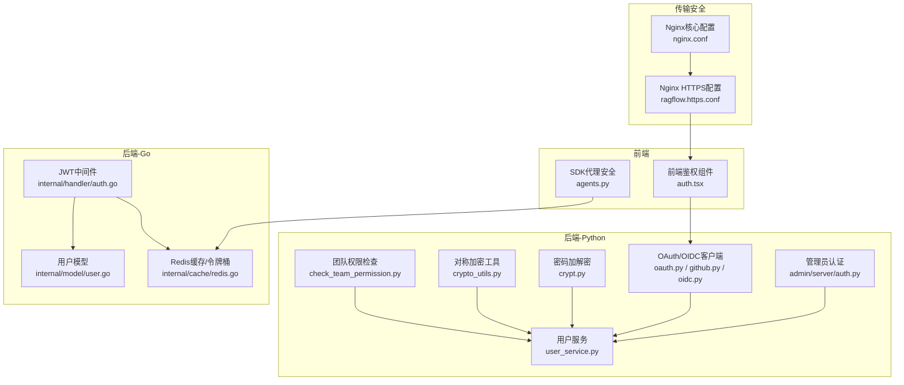
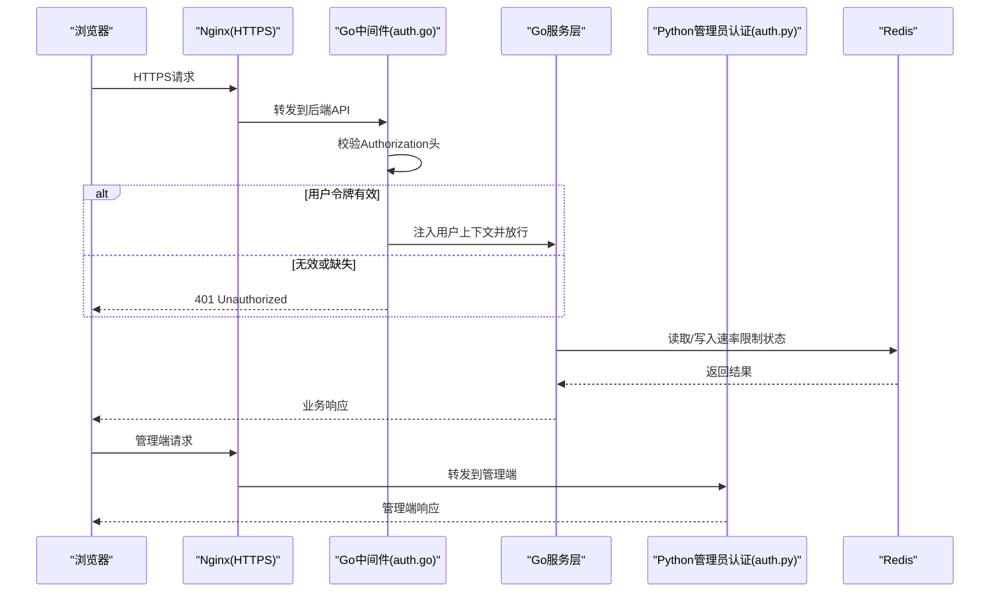
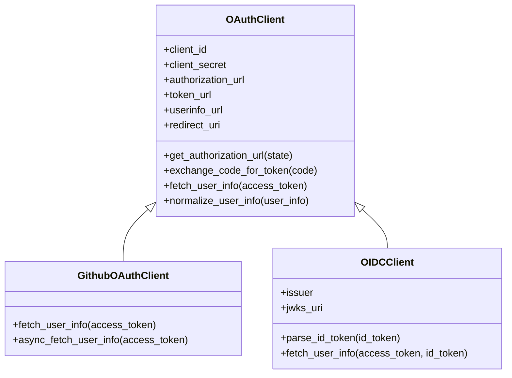
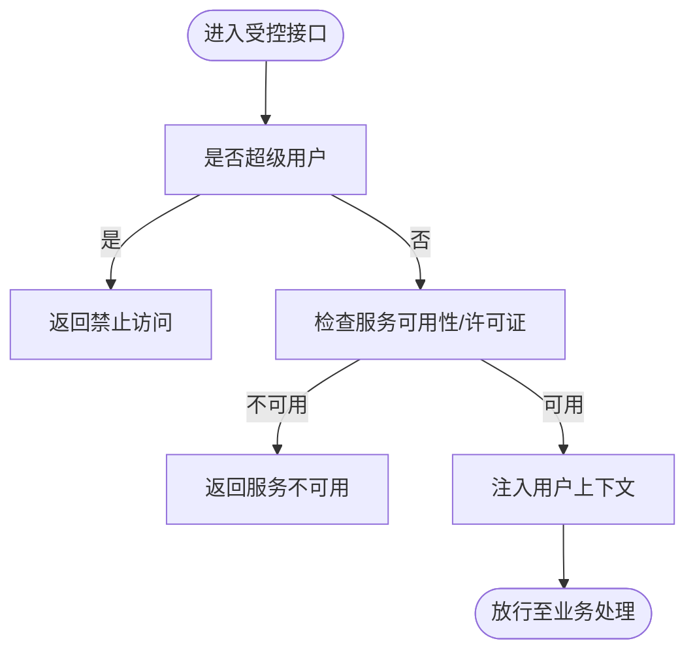
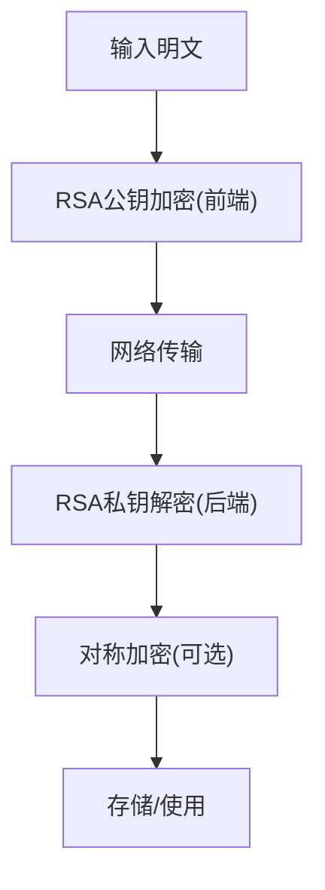
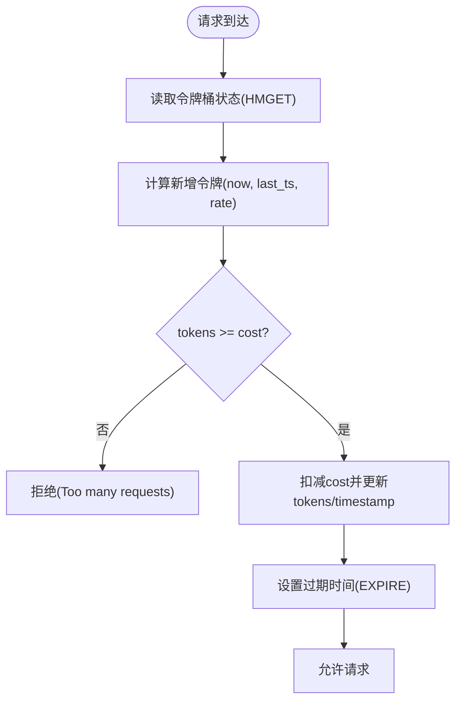
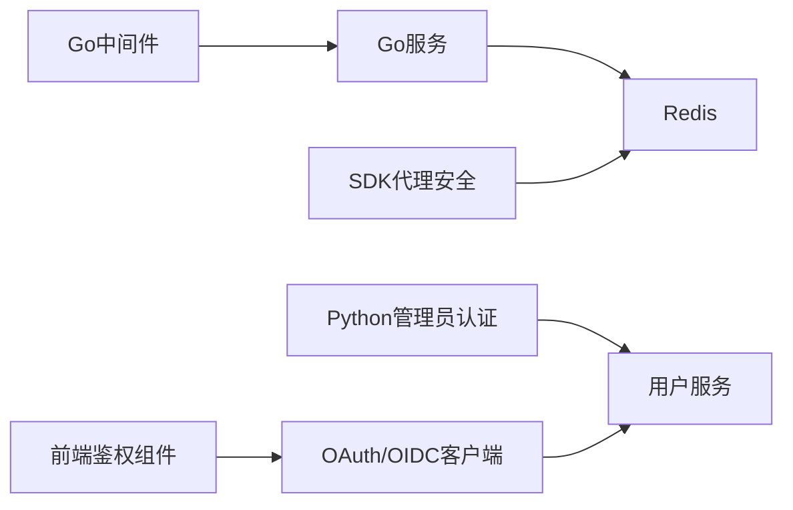

# 安全与权限

<cite>
**本文引用的文件**
- [oauth.py](file://api/apps/auth/oauth.py)
- [github.py](file://api/apps/auth/github.py)
- [oidc.py](file://api/apps/auth/oidc.py)
- [auth.py（后端）](file://admin/server/auth.py)
- [auth.go（Go处理器）](file://internal/handler/auth.go)
- [crypt.py](file://api/utils/crypt.py)
- [crypto_utils.py](file://common/crypto_utils.py)
- [check_team_permission.py](file://api/common/check_team_permission.py)
- [user.go（Go模型）](file://internal/model/user.go)
- [user_service.py](file://api/db/services/user_service.py)
- [redis.go（Go缓存）](file://internal/cache/redis.go)
- [ragflow.https.conf](file://docker/nginx/ragflow.https.conf)
- [nginx.conf](file://docker/nginx/nginx.conf)
- [auth.tsx（前端Webhook鉴权）](file://web/src/pages/agent/form/begin-form/webhook/auth.tsx)
- [agents.py（SDK代理安全）](file://api/apps/sdk/agents.py)
</cite>

## 目录
1. [简介](#简介)
2. [项目结构](#项目结构)
3. [核心组件](#核心组件)
4. [架构总览](#架构总览)
5. [详细组件分析](#详细组件分析)
6. [依赖分析](#依赖分析)
7. [性能考虑](#性能考虑)
8. [故障排查指南](#故障排查指南)
9. [结论](#结论)
10. [附录](#附录)

## 简介
本文件面向RAGFlow的安全与权限体系，系统化梳理认证授权机制、权限控制模型、数据安全与传输安全、速率限制与审计能力，并提供可落地的安全配置与运维建议。内容覆盖后端Python/Go服务、SDK与前端组件，帮助管理员构建安全可靠的部署环境。

## 项目结构
围绕“安全与权限”的关键代码分布在以下模块：
- 认证与授权：OAuth/OIDC客户端、JWT解析、管理员登录校验、用户服务
- 权限控制：租户/团队权限检查、RBAC角色字段
- 数据安全：RSA加解密、对称加密工具、敏感信息存储
- 传输安全：Nginx HTTPS重定向与证书配置
- 速率限制：Redis Lua令牌桶实现
- 前端与SDK：Webhook鉴权类型、SDK代理安全校验

**图表来源**
- [auth.tsx（前端Webhook鉴权）:99-113](file://web/src/pages/agent/form/begin-form/webhook/auth.tsx#L99-L113)
- [agents.py（SDK代理安全）:295-334](file://api/apps/sdk/agents.py#L295-L334)
- [oauth.py:1-152](file://api/apps/auth/oauth.py#L1-L152)
- [github.py:1-89](file://api/apps/auth/github.py#L1-L89)
- [oidc.py:1-108](file://api/apps/auth/oidc.py#L1-L108)
- [auth.py（后端）:1-228](file://admin/server/auth.py#L1-L228)
- [user_service.py:1-329](file://api/db/services/user_service.py#L1-L329)
- [crypt.py:1-66](file://api/utils/crypt.py#L1-L66)
- [crypto_utils.py:1-375](file://common/crypto_utils.py#L1-L375)
- [check_team_permission.py:1-60](file://api/common/check_team_permission.py#L1-L60)
- [auth.go（Go处理器）:1-96](file://internal/handler/auth.go#L1-L96)
- [user.go（Go模型）:1-47](file://internal/model/user.go#L1-L47)
- [redis.go（Go缓存）:1-800](file://internal/cache/redis.go#L1-L800)
- [ragflow.https.conf:1-47](file://docker/nginx/ragflow.https.conf#L1-L47)
- [nginx.conf:1-34](file://docker/nginx/nginx.conf#L1-L34)

**章节来源**
- [oauth.py:1-152](file://api/apps/auth/oauth.py#L1-L152)
- [github.py:1-89](file://api/apps/auth/github.py#L1-L89)
- [oidc.py:1-108](file://api/apps/auth/oidc.py#L1-L108)
- [auth.py（后端）:1-228](file://admin/server/auth.py#L1-L228)
- [auth.go（Go处理器）:1-96](file://internal/handler/auth.go#L1-L96)
- [crypt.py:1-66](file://api/utils/crypt.py#L1-L66)
- [crypto_utils.py:1-375](file://common/crypto_utils.py#L1-L375)
- [check_team_permission.py:1-60](file://api/common/check_team_permission.py#L1-L60)
- [user.go（Go模型）:1-47](file://internal/model/user.go#L1-L47)
- [user_service.py:1-329](file://api/db/services/user_service.py#L1-L329)
- [redis.go（Go缓存）:1-800](file://internal/cache/redis.go#L1-L800)
- [ragflow.https.conf:1-47](file://docker/nginx/ragflow.https.conf#L1-L47)
- [nginx.conf:1-34](file://docker/nginx/nginx.conf#L1-L34)
- [auth.tsx（前端Webhook鉴权）:99-113](file://web/src/pages/agent/form/begin-form/webhook/auth.tsx#L99-L113)
- [agents.py（SDK代理安全）:295-334](file://api/apps/sdk/agents.py#L295-L334)

## 核心组件
- 认证与授权
  - OAuth/OIDC客户端：统一的OAuth流程封装，支持GitHub与OIDC ID Token解析与签名验证
  - 管理员认证：基于Flask-Login与自定义序列化器的访问令牌加载
  - JWT中间件：Gin中间件校验Authorization头并注入用户上下文
- 权限控制
  - RBAC角色字段：用户模型含超级用户标记与角色ID
  - 团队权限：知识库/文件级租户权限与加入租户列表的交叉校验
- 数据安全
  - RSA加解密：前后端交互使用的非对称加密
  - 对称加密工具：AES/SM4对称加密与PBKDF2派生密钥
- 传输安全
  - Nginx HTTPS重定向与证书挂载
- 速率限制
  - Redis Lua令牌桶：原子计数与过期策略
- 前端与SDK
  - Webhook鉴权类型：Token/Basic/JWT/None
  - SDK代理安全：请求头令牌与Basic Auth校验

**章节来源**
- [oauth.py:1-152](file://api/apps/auth/oauth.py#L1-L152)
- [github.py:1-89](file://api/apps/auth/github.py#L1-L89)
- [oidc.py:1-108](file://api/apps/auth/oidc.py#L1-L108)
- [auth.py（后端）:1-228](file://admin/server/auth.py#L1-L228)
- [auth.go（Go处理器）:1-96](file://internal/handler/auth.go#L1-L96)
- [user.go（Go模型）:1-47](file://internal/model/user.go#L1-L47)
- [check_team_permission.py:1-60](file://api/common/check_team_permission.py#L1-L60)
- [crypt.py:1-66](file://api/utils/crypt.py#L1-L66)
- [crypto_utils.py:1-375](file://common/crypto_utils.py#L1-L375)
- [redis.go（Go缓存）:1-800](file://internal/cache/redis.go#L1-L800)
- [auth.tsx（前端Webhook鉴权）:99-113](file://web/src/pages/agent/form/begin-form/webhook/auth.tsx#L99-L113)
- [agents.py（SDK代理安全）:295-334](file://api/apps/sdk/agents.py#L295-L334)

## 架构总览
下图展示从浏览器到后端服务的关键安全路径：前端通过Nginx终止TLS，后端进行JWT/令牌校验与权限检查，必要时调用Redis进行速率限制或状态查询。

**图表来源**
- [auth.go（Go处理器）:42-96](file://internal/handler/auth.go#L42-L96)
- [redis.go（Go缓存）:71-104](file://internal/cache/redis.go#L71-L104)
- [ragflow.https.conf:9-33](file://docker/nginx/ragflow.https.conf#L9-L33)
- [auth.py（后端）:40-73](file://admin/server/auth.py#L40-L73)

## 详细组件分析

### 认证系统设计
- OAuth/OIDC客户端
  - 统一的授权URL生成、授权码换Token、用户信息获取流程
  - OIDC支持从发现端点加载元数据，使用PyJWKClient解析并验证ID Token签名
- 管理员认证（Python）
  - 使用itsdangerous序列化器加载Authorization头中的访问令牌，校验格式与有效性
  - 登录成功后生成UUID型access_token并持久化，同时记录登录时间
- JWT中间件（Go）
  - 从Authorization头提取令牌，优先按用户令牌查询，再回退到API令牌
  - 拒绝超级用户访问特定URL，确保管理面隔离
- 前端Webhook鉴权
  - 支持Token/Basic/JWT/None四种模式，按类型渲染对应表单控件

**图表来源**
- [oauth.py:32-152](file://api/apps/auth/oauth.py#L32-L152)
- [github.py:21-89](file://api/apps/auth/github.py#L21-L89)
- [oidc.py:22-108](file://api/apps/auth/oidc.py#L22-L108)

**章节来源**
- [oauth.py:1-152](file://api/apps/auth/oauth.py#L1-L152)
- [github.py:1-89](file://api/apps/auth/github.py#L1-L89)
- [oidc.py:1-108](file://api/apps/auth/oidc.py#L1-L108)
- [auth.py（后端）:40-73](file://admin/server/auth.py#L40-L73)
- [auth.go（Go处理器）:42-96](file://internal/handler/auth.go#L42-L96)
- [auth.tsx（前端Webhook鉴权）:99-113](file://web/src/pages/agent/form/begin-form/webhook/auth.tsx#L99-L113)

### 授权控制机制
- RBAC与资源访问控制
  - 用户模型包含超级用户标记与角色ID，用于区分管理员与普通用户
  - 团队权限检查：知识库/文件权限为TEAM时，需与用户加入的租户集合匹配
- 管理员专用校验
  - Python侧提供装饰器与校验函数，拒绝非管理员或未激活用户访问管理端

**图表来源**
- [auth.go（Go处理器）:42-96](file://internal/handler/auth.go#L42-L96)
- [user.go（Go模型）:22-41](file://internal/model/user.go#L22-L41)
- [check_team_permission.py:25-60](file://api/common/check_team_permission.py#L25-L60)

**章节来源**
- [user.go（Go模型）:1-47](file://internal/model/user.go#L1-L47)
- [user_service.py:158-163](file://api/db/services/user_service.py#L158-L163)
- [check_team_permission.py:1-60](file://api/common/check_team_permission.py#L1-L60)
- [auth.go（Go处理器）:42-96](file://internal/handler/auth.go#L42-L96)

### 数据安全保护
- 敏感数据加密
  - RSA：前后端交互采用RSA公私钥对密码进行加解密，避免明文传输
  - 对称加密：AES-256/SM4-CBC与PBKDF2派生密钥，带魔数前缀标识加密数据
- 传输安全
  - Nginx监听443并强制从80跳转，证书挂载于容器内路径
- 访问日志
  - Nginx开启访问/错误日志，便于审计与问题定位

**图表来源**
- [crypt.py:26-60](file://api/utils/crypt.py#L26-L60)
- [crypto_utils.py:66-119](file://common/crypto_utils.py#L66-L119)
- [nginx.conf:17-21](file://docker/nginx/nginx.conf#L17-L21)
- [ragflow.https.conf:9-15](file://docker/nginx/ragflow.https.conf#L9-L15)

**章节来源**
- [crypt.py:1-66](file://api/utils/crypt.py#L1-L66)
- [crypto_utils.py:1-375](file://common/crypto_utils.py#L1-L375)
- [nginx.conf:1-34](file://docker/nginx/nginx.conf#L1-L34)
- [ragflow.https.conf:1-47](file://docker/nginx/ragflow.https.conf#L1-L47)

### 速率限制与防护
- 令牌桶算法
  - Redis中以Lua脚本原子实现令牌桶：容量、速率、当前令牌数、时间戳
  - 请求时尝试扣减成本令牌，不足则拒绝
- SDK代理安全
  - 支持请求头令牌与Basic Auth两种校验方式，失败即抛出异常

**图表来源**
- [redis.go（Go缓存）:71-104](file://internal/cache/redis.go#L71-L104)
- [agents.py（SDK代理安全）:295-334](file://api/apps/sdk/agents.py#L295-L334)

**章节来源**
- [redis.go（Go缓存）:1-800](file://internal/cache/redis.go#L1-L800)
- [agents.py（SDK代理安全）:295-334](file://api/apps/sdk/agents.py#L295-L334)

### 会话管理策略
- 访问令牌
  - 管理端登录成功后生成UUID型access_token并持久化，作为后续鉴权依据
  - 查询时对空令牌、短令牌、已失效令牌进行拒绝，防止暴力猜测
- 中间件注入
  - Go中间件将用户ID、邮箱等信息注入上下文，供后续处理使用

**章节来源**
- [auth.py（后端）:147-172](file://admin/server/auth.py#L147-L172)
- [user_service.py:44-66](file://api/db/services/user_service.py#L44-L66)
- [auth.go（Go处理器）:56-93](file://internal/handler/auth.go#L56-L93)

## 依赖分析
- 组件耦合
  - Go中间件依赖用户服务查询令牌与用户信息；Redis提供速率限制与原子操作
  - Python管理员认证依赖用户服务与数据库；前端Webhook鉴权与SDK代理安全分别在各自边界内
- 外部依赖
  - OIDC使用PyJWT与PyJWKClient进行签名验证
  - Nginx负责TLS终止与静态资源分发

**图表来源**
- [auth.go（Go处理器）:30-40](file://internal/handler/auth.go#L30-L40)
- [redis.go（Go缓存）:108-145](file://internal/cache/redis.go#L108-L145)
- [auth.py（后端）:18-37](file://admin/server/auth.py#L18-L37)
- [user_service.py:33-42](file://api/db/services/user_service.py#L33-L42)
- [oauth.py:32-46](file://api/apps/auth/oauth.py#L32-L46)
- [auth.tsx（前端Webhook鉴权）:99-113](file://web/src/pages/agent/form/begin-form/webhook/auth.tsx#L99-L113)
- [agents.py（SDK代理安全）:295-334](file://api/apps/sdk/agents.py#L295-L334)

**章节来源**
- [auth.go（Go处理器）:1-96](file://internal/handler/auth.go#L1-L96)
- [redis.go（Go缓存）:1-800](file://internal/cache/redis.go#L1-L800)
- [auth.py（后端）:1-228](file://admin/server/auth.py#L1-L228)
- [user_service.py:1-329](file://api/db/services/user_service.py#L1-L329)
- [oauth.py:1-152](file://api/apps/auth/oauth.py#L1-L152)
- [auth.tsx（前端Webhook鉴权）:99-113](file://web/src/pages/agent/form/begin-form/webhook/auth.tsx#L99-L113)
- [agents.py（SDK代理安全）:295-334](file://api/apps/sdk/agents.py#L295-L334)

## 性能考虑
- Redis Lua脚本原子性与低延迟，适合高并发令牌桶场景
- Nginx启用gzip与静态资源缓存，降低后端压力
- 建议对高频接口开启缓存与连接池复用，减少数据库与外部OAuth提供商的往返

[本节为通用指导，无需具体文件引用]

## 故障排查指南
- 认证失败
  - 检查Authorization头是否存在与格式是否正确（Go中间件会直接返回401）
  - 确认access_token未被注销或长度小于阈值（Python用户服务对短令牌直接拒绝）
- 管理端访问受限
  - 非管理员或未激活用户会被拒绝；确认数据库中用户状态与角色
- OIDC ID Token验证失败
  - 检查issuer元数据发现端点可达，JWKS密钥可拉取，算法与受众匹配
- 速率限制触发
  - 查看Redis中对应键的状态与过期时间；调整容量/速率参数
- 传输安全问题
  - 确认Nginx证书路径与权限；80→443重定向生效

**章节来源**
- [auth.go（Go处理器）:42-96](file://internal/handler/auth.go#L42-L96)
- [user_service.py:44-66](file://api/db/services/user_service.py#L44-L66)
- [oidc.py:60-86](file://api/apps/auth/oidc.py#L60-L86)
- [redis.go（Go缓存）:71-104](file://internal/cache/redis.go#L71-L104)
- [ragflow.https.conf:9-15](file://docker/nginx/ragflow.https.conf#L9-L15)

## 结论
RAGFlow在认证授权方面提供了多层保障：OAuth/OIDC对接外部身份源、JWT中间件与管理员专用校验、RBAC角色与团队权限检查、Redis令牌桶速率限制、RSA与对称加密的数据保护，以及Nginx的TLS终止与日志记录。结合本文的安全配置与运维建议，可帮助管理员构建安全、稳定且可审计的部署环境。

[本节为总结，无需具体文件引用]

## 附录
- 安全配置清单
  - Nginx：启用443监听、强制HTTP→HTTPS跳转、挂载完整证书链
  - Redis：启用健康检查与最小权限连接
  - 密钥与证书：定期轮换，限制访问范围
- 常见威胁与缓解
  - 强制TLS：仅允许HTTPS流量
  - 最小权限：RBAC与团队权限严格控制资源访问
  - 输入校验：令牌长度与格式校验，拒绝空/短令牌
  - 速率限制：针对高频接口启用令牌桶，防爆破与滥用
  - 审计日志：开启Nginx访问/错误日志，定期巡检

[本节为通用指导，无需具体文件引用]