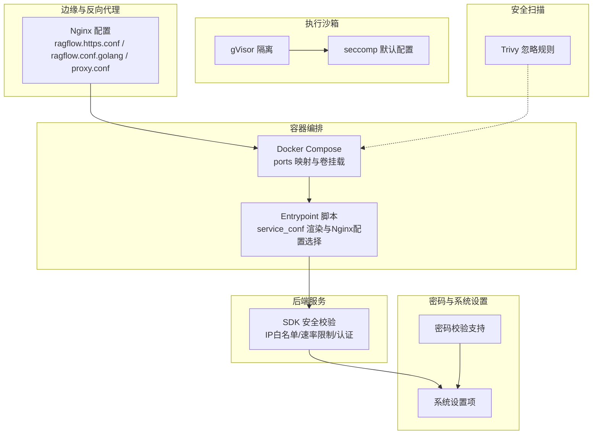
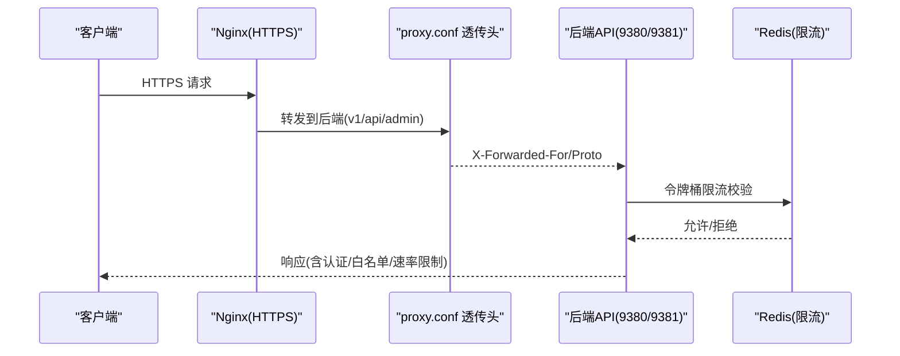
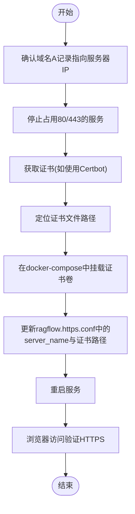
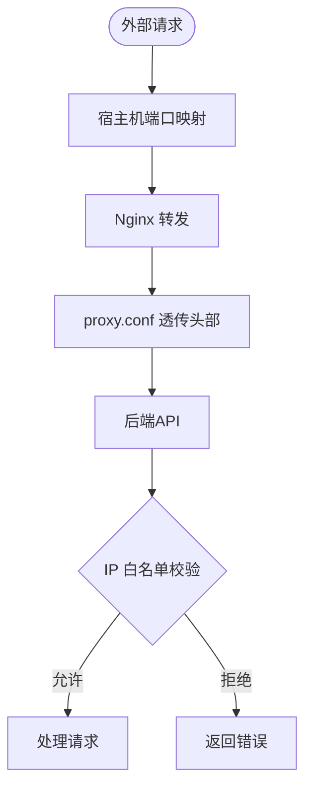
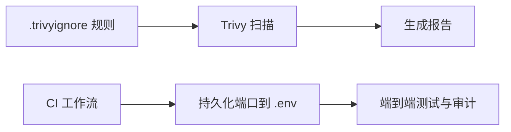
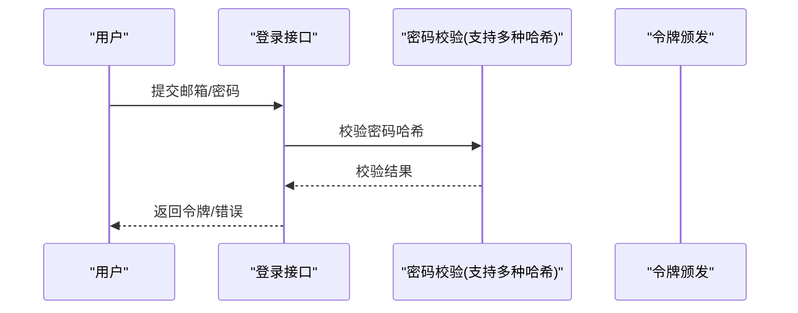
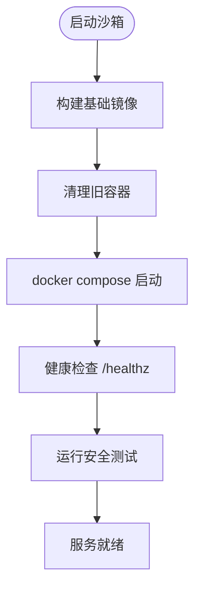
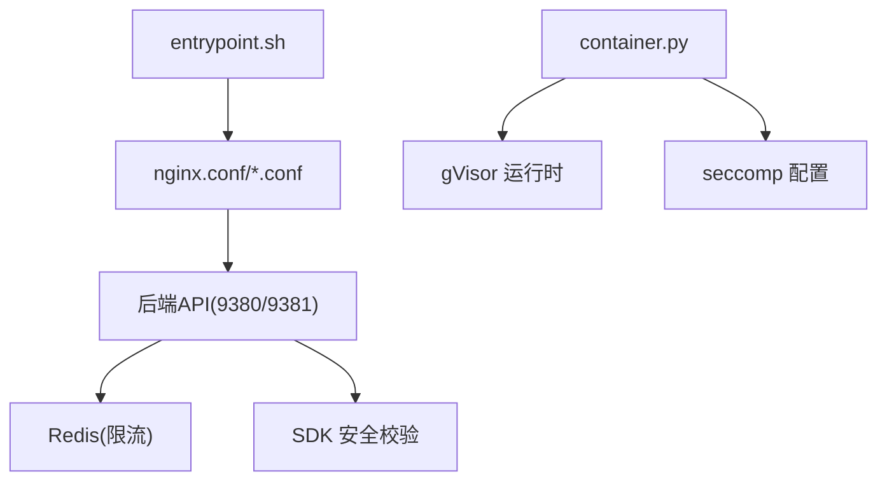

# 安全配置

<cite>
**本文引用的文件**
- [docker/nginx/ragflow.https.conf](file://docker/nginx/ragflow.https.conf)
- [docker/nginx/proxy.conf](file://docker/nginx/proxy.conf)
- [docker/nginx/nginx.conf](file://docker/nginx/nginx.conf)
- [docker/nginx/ragflow.conf.golang](file://docker/nginx/ragflow.conf.golang)
- [docker/docker-compose.yml](file://docker/docker-compose.yml)
- [docker/service_conf.yaml.template](file://docker/service_conf.yaml.template)
- [docker/entrypoint.sh](file://docker/entrypoint.sh)
- [docker/README.md](file://docker/README.md)
- [api/apps/sdk/agents.py](file://api/apps/sdk/agents.py)
- [agent/sandbox/executor_manager/seccomp-profile-default.json](file://agent/sandbox/executor_manager/seccomp-profile-default.json)
- [agent/sandbox/executor_manager/core/container.py](file://agent/sandbox/executor_manager/core/container.py)
- [agent/sandbox/README.md](file://agent/sandbox/README.md)
- [agent/sandbox/scripts/start.sh](file://agent/sandbox/scripts/start.sh)
- [internal/admin/password.go](file://internal/admin/password.go)
- [conf/system_settings.json](file://conf/system_settings.json)
- [.trivyignore](file://.trivyignore)
</cite>

## 目录
1. [简介](#简介)
2. [项目结构](#项目结构)
3. [核心组件](#核心组件)
4. [架构总览](#架构总览)
5. [详细组件分析](#详细组件分析)
6. [依赖关系分析](#依赖关系分析)
7. [性能考量](#性能考量)
8. [故障排查指南](#故障排查指南)
9. [结论](#结论)
10. [附录](#附录)

## 简介
本文件面向RAGFlow的安全配置管理，围绕以下目标展开：SSL/TLS证书的申请、安装与更新；防火墙与网络边界（端口、代理、白名单）策略；安全扫描工具集成（静态分析、依赖漏洞、镜像扫描）；安全策略配置（密码、会话、访问控制）；安全配置模板、验证与变更管理；安全基线检查、合规配置与审计建议。内容以仓库中实际实现为依据，结合部署与运行时配置，提供可操作的最佳实践。

## 项目结构
RAGFlow的安全相关能力主要分布在如下位置：
- 反向代理与TLS：Nginx配置与HTTPS重定向、证书挂载、代理头透传
- 部署编排：Docker Compose端口映射、卷挂载、环境变量模板
- 后端安全校验：SDK侧IP白名单、速率限制、令牌与Basic认证
- 执行沙箱：gVisor隔离与可选seccomp系统调用限制
- 密码与系统设置：密码哈希算法支持、系统设置项
- 安全扫描：Trivy忽略规则、CI端口持久化

图表来源
- [docker/nginx/ragflow.https.conf:1-46](file://docker/nginx/ragflow.https.conf#L1-L46)
- [docker/nginx/ragflow.conf.golang:1-33](file://docker/nginx/ragflow.conf.golang#L1-L33)
- [docker/nginx/proxy.conf:1-12](file://docker/nginx/proxy.conf#L1-L12)
- [docker/docker-compose.yml:32-38](file://docker/docker-compose.yml#L32-L38)
- [docker/entrypoint.sh:182-197](file://docker/entrypoint.sh#L182-L197)
- [api/apps/sdk/agents.py:249-334](file://api/apps/sdk/agents.py#L249-L334)
- [agent/sandbox/executor_manager/seccomp-profile-default.json:1-56](file://agent/sandbox/executor_manager/seccomp-profile-default.json#L1-L56)
- [agent/sandbox/executor_manager/core/container.py:82-115](file://agent/sandbox/executor_manager/core/container.py#L82-L115)
- [internal/admin/password.go:39-47](file://internal/admin/password.go#L39-L47)
- [.trivyignore:1-15](file://.trivyignore#L1-L15)

章节来源
- [docker/nginx/ragflow.https.conf:1-46](file://docker/nginx/ragflow.https.conf#L1-L46)
- [docker/nginx/ragflow.conf.golang:1-33](file://docker/nginx/ragflow.conf.golang#L1-L33)
- [docker/nginx/proxy.conf:1-12](file://docker/nginx/proxy.conf#L1-L12)
- [docker/docker-compose.yml:32-38](file://docker/docker-compose.yml#L32-L38)
- [docker/entrypoint.sh:182-197](file://docker/entrypoint.sh#L182-L197)
- [api/apps/sdk/agents.py:249-334](file://api/apps/sdk/agents.py#L249-L334)
- [agent/sandbox/executor_manager/seccomp-profile-default.json:1-56](file://agent/sandbox/executor_manager/seccomp-profile-default.json#L1-L56)
- [agent/sandbox/executor_manager/core/container.py:82-115](file://agent/sandbox/executor_manager/core/container.py#L82-L115)
- [internal/admin/password.go:39-47](file://internal/admin/password.go#L39-L47)
- [.trivyignore:1-15](file://.trivyignore#L1-L15)

## 核心组件
- 反向代理与TLS
  - 使用Nginx在80端口进行HTTP到HTTPS重定向，并在443端口启用SSL，证书通过卷挂载注入。
  - 提供多套后端代理方案（Python/Go/Hybrid），由入口脚本按环境变量动态切换。
- 访问控制与速率限制
  - SDK侧提供IP白名单、基于Redis的令牌桶限流、请求体大小限制，以及Header/Basic认证校验。
- 执行沙箱安全
  - 基于gVisor进行用户态内核隔离；可选启用seccomp限制系统调用集。
- 密码与系统设置
  - 支持多种密码哈希格式校验；系统设置项包含邮件、沙箱提供方等配置。
- 安全扫描
  - Trivy忽略规则用于排除静态资源误报；CI中持久化端口便于测试与审计。

章节来源
- [docker/nginx/ragflow.https.conf:1-46](file://docker/nginx/ragflow.https.conf#L1-L46)
- [docker/entrypoint.sh:182-197](file://docker/entrypoint.sh#L182-L197)
- [api/apps/sdk/agents.py:249-334](file://api/apps/sdk/agents.py#L249-L334)
- [agent/sandbox/executor_manager/core/container.py:82-115](file://agent/sandbox/executor_manager/core/container.py#L82-L115)
- [agent/sandbox/executor_manager/seccomp-profile-default.json:1-56](file://agent/sandbox/executor_manager/seccomp-profile-default.json#L1-L56)
- [internal/admin/password.go:39-47](file://internal/admin/password.go#L39-L47)
- [conf/system_settings.json:1-88](file://conf/system_settings.json#L1-L88)
- [.trivyignore:1-15](file://.trivyignore#L1-L15)

## 架构总览
下图展示从客户端到后端服务的典型HTTPS流量路径，以及SDK侧安全校验点：

图表来源
- [docker/nginx/ragflow.https.conf:25-33](file://docker/nginx/ragflow.https.conf#L25-L33)
- [docker/nginx/proxy.conf:1-12](file://docker/nginx/proxy.conf#L1-L12)
- [api/apps/sdk/agents.py:249-334](file://api/apps/sdk/agents.py#L249-L334)

章节来源
- [docker/nginx/ragflow.https.conf:1-46](file://docker/nginx/ragflow.https.conf#L1-L46)
- [docker/nginx/proxy.conf:1-12](file://docker/nginx/proxy.conf#L1-L12)
- [api/apps/sdk/agents.py:249-334](file://api/apps/sdk/agents.py#L249-L334)

## 详细组件分析

### 组件A：SSL/TLS证书配置与HTTPS
- 证书申请与安装
  - 支持Let’s Encrypt与自签名证书两种方式；证书文件通过卷挂载至Nginx。
  - HTTPS配置文件包含证书与私钥路径、Gzip与静态资源缓存策略。
- 证书更新流程
  - 更新卷挂载路径或重新生成证书后，重启容器使新证书生效。
- 代理与端口
  - 80端口用于重定向；443端口承载HTTPS；后端API通过本地回环转发。

图表来源
- [docker/README.md:210-271](file://docker/README.md#L210-L271)
- [docker/nginx/ragflow.https.conf:1-46](file://docker/nginx/ragflow.https.conf#L1-L46)

章节来源
- [docker/README.md:210-271](file://docker/README.md#L210-L271)
- [docker/nginx/ragflow.https.conf:1-46](file://docker/nginx/ragflow.https.conf#L1-L46)

### 组件B：防火墙与网络边界（端口、代理、白名单）
- 端口配置
  - Web(HTTP/HTTPS)、API、Admin、MCP、Go服务端口在Compose中显式映射。
- 访问控制
  - SDK侧提供IP白名单校验，支持单IP与CIDR。
- 代理头透传
  - 通过proxy.conf设置Host、X-Forwarded-For、X-Forwarded-Proto等，确保后端正确识别客户端信息与协议。

图表来源
- [docker/docker-compose.yml:32-38](file://docker/docker-compose.yml#L32-L38)
- [docker/nginx/proxy.conf:1-12](file://docker/nginx/proxy.conf#L1-L12)
- [api/apps/sdk/agents.py:253-272](file://api/apps/sdk/agents.py#L253-L272)

章节来源
- [docker/docker-compose.yml:32-38](file://docker/docker-compose.yml#L32-L38)
- [docker/nginx/proxy.conf:1-12](file://docker/nginx/proxy.conf#L1-L12)
- [api/apps/sdk/agents.py:253-272](file://api/apps/sdk/agents.py#L253-L272)

### 组件C：安全扫描工具集成
- 静态资源与第三方库扫描
  - 使用Trivy对镜像与依赖进行漏洞扫描；通过.trivyignore排除前端静态资源误报。
- CI与端口持久化
  - CI工作流中将各服务端口写入.env，便于测试与审计一致性。

图表来源
- [.trivyignore:1-15](file://.trivyignore#L1-L15)
- [.github/workflows/tests.yml:195-216](file://.github/workflows/tests.yml#L195-L216)

章节来源
- [.trivyignore:1-15](file://.trivyignore#L1-L15)
- [.github/workflows/tests.yml:195-216](file://.github/workflows/tests.yml#L195-L216)

### 组件D：安全策略配置（密码、会话、登录限制）
- 密码策略
  - 支持多种密码哈希格式校验（如pbkdf2、scrypt），便于与历史系统兼容。
- 会话与登录
  - 登录成功后由后端颁发令牌；前端展示当前密码占位符，修改密码需旧密码校验。
- 登录尝试限制
  - SDK侧提供速率限制与白名单机制，降低暴力破解风险。

图表来源
- [internal/admin/password.go:39-47](file://internal/admin/password.go#L39-L47)
- [admin/client/user.py:61-77](file://admin/client/user.py#L61-L77)

章节来源
- [internal/admin/password.go:39-47](file://internal/admin/password.go#L39-L47)
- [admin/client/user.py:61-77](file://admin/client/user.py#L61-L77)

### 组件E：执行沙箱安全（gVisor与seccomp）
- 隔离与限制
  - 容器以只读根文件系统、临时内存分区、非特权用户运行；可选启用seccomp限制系统调用。
- 启动与测试
  - 启动脚本构建基础镜像并启动服务，随后执行安全测试用例，最后输出健康状态。

图表来源
- [agent/sandbox/scripts/start.sh:37-72](file://agent/sandbox/scripts/start.sh#L37-L72)
- [agent/sandbox/README.md:121-149](file://agent/sandbox/README.md#L121-L149)

章节来源
- [agent/sandbox/executor_manager/core/container.py:82-115](file://agent/sandbox/executor_manager/core/container.py#L82-L115)
- [agent/sandbox/executor_manager/seccomp-profile-default.json:1-56](file://agent/sandbox/executor_manager/seccomp-profile-default.json#L1-L56)
- [agent/sandbox/scripts/start.sh:37-72](file://agent/sandbox/scripts/start.sh#L37-L72)
- [agent/sandbox/README.md:121-149](file://agent/sandbox/README.md#L121-L149)

## 依赖关系分析
- Nginx配置依赖于入口脚本根据API_PROXY_SCHEME选择具体配置文件。
- 后端API依赖Redis进行令牌桶限流。
- 沙箱容器依赖gVisor运行时与可选seccomp配置。

图表来源
- [docker/entrypoint.sh:182-197](file://docker/entrypoint.sh#L182-L197)
- [docker/nginx/nginx.conf:64-94](file://docker/nginx/nginx.conf#L64-L94)
- [api/apps/sdk/agents.py:299-314](file://api/apps/sdk/agents.py#L299-L314)
- [agent/sandbox/executor_manager/core/container.py:82-115](file://agent/sandbox/executor_manager/core/container.py#L82-L115)
- [agent/sandbox/executor_manager/seccomp-profile-default.json:1-56](file://agent/sandbox/executor_manager/seccomp-profile-default.json#L1-L56)

章节来源
- [docker/entrypoint.sh:182-197](file://docker/entrypoint.sh#L182-L197)
- [docker/nginx/nginx.conf:64-94](file://docker/nginx/nginx.conf#L64-L94)
- [api/apps/sdk/agents.py:299-314](file://api/apps/sdk/agents.py#L299-L314)
- [agent/sandbox/executor_manager/core/container.py:82-115](file://agent/sandbox/executor_manager/core/container.py#L82-L115)
- [agent/sandbox/executor_manager/seccomp-profile-default.json:1-56](file://agent/sandbox/executor_manager/seccomp-profile-default.json#L1-L56)

## 性能考量
- Nginx代理缓冲与超时参数影响长连接与大文件传输稳定性。
- 令牌桶限流参数（容量、窗口）需结合业务峰值QPS调整，避免误杀。
- 沙箱容器内存限制与seccomp策略会影响执行性能与安全性平衡。

## 故障排查指南
- HTTPS证书问题
  - 确认证书链完整性与server_name匹配；检查卷挂载路径与权限。
- 代理头丢失
  - 核对proxy.conf是否被正确包含；确认Nginx日志中X-Forwarded-*是否存在。
- 速率限制触发
  - 检查Redis可用性与键空间；核对限流窗口与容量配置。
- 沙箱启动失败
  - 查看gVisor与seccomp支持情况；确认容器运行参数（只读、tmpfs、用户）。
- CI端口不一致
  - 确认.env中端口已持久化且与Compose映射一致。

章节来源
- [docker/nginx/ragflow.https.conf:1-46](file://docker/nginx/ragflow.https.conf#L1-L46)
- [docker/nginx/proxy.conf:1-12](file://docker/nginx/proxy.conf#L1-L12)
- [api/apps/sdk/agents.py:299-314](file://api/apps/sdk/agents.py#L299-L314)
- [agent/sandbox/executor_manager/core/container.py:82-115](file://agent/sandbox/executor_manager/core/container.py#L82-L115)
- [.github/workflows/tests.yml:195-216](file://.github/workflows/tests.yml#L195-L216)

## 结论
RAGFlow在边缘层提供完善的HTTPS与代理能力，在后端侧具备IP白名单、速率限制与认证校验等安全控制点，并通过gVisor与seccomp强化执行沙箱的安全边界。结合Trivy扫描与CI端口持久化，形成从部署到运行的闭环安全实践。建议在生产环境中启用HTTPS、严格白名单与限流策略，并定期轮换证书与密钥，持续审计系统设置与沙箱配置。

## 附录
- 安全配置模板与示例
  - Nginx HTTPS配置模板与端口映射参考：[ragflow.https.conf:1-46](file://docker/nginx/ragflow.https.conf#L1-L46)、[docker-compose.yml:32-38](file://docker/docker-compose.yml#L32-L38)
  - 服务配置模板（数据库、对象存储、Redis等）参考：[service_conf.yaml.template:1-172](file://docker/service_conf.yaml.template#L1-L172)
  - 入口脚本（渲染配置与选择Nginx配置）参考：[entrypoint.sh:154-197](file://docker/entrypoint.sh#L154-L197)
- 配置验证方法
  - 通过Nginx健康检查与后端/管理服务的健康端点进行验证。
  - 使用沙箱安全测试脚本验证隔离与限制策略。
- 配置变更管理
  - 在Compose中更新端口与卷映射后，重启容器使变更生效。
  - 对系统设置项（如邮件、沙箱提供方）通过系统设置接口进行管理。
- 安全基线检查清单
  - 启用HTTPS并强制重定向；仅开放必要端口；启用IP白名单与限流；定期轮换证书与密钥；启用Trivy扫描并维护忽略规则；审查沙箱运行参数与seccomp策略。
- 合规性配置指南
  - 证书链完整性与有效期；代理头透传符合合规审计要求；密码哈希策略满足最小强度要求；限流与日志保留满足监管要求。
- 安全配置审计
  - 审计Nginx配置、后端安全校验、沙箱隔离与seccomp策略、系统设置项与扫描规则，确保与基线一致。