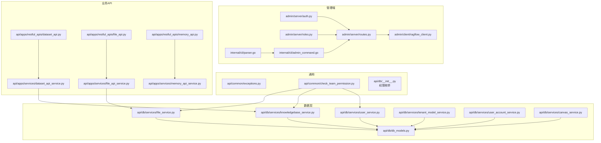
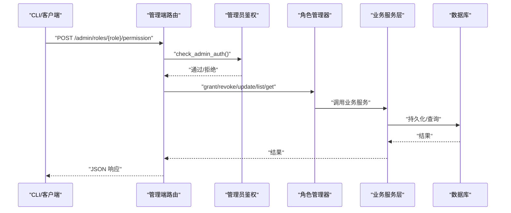
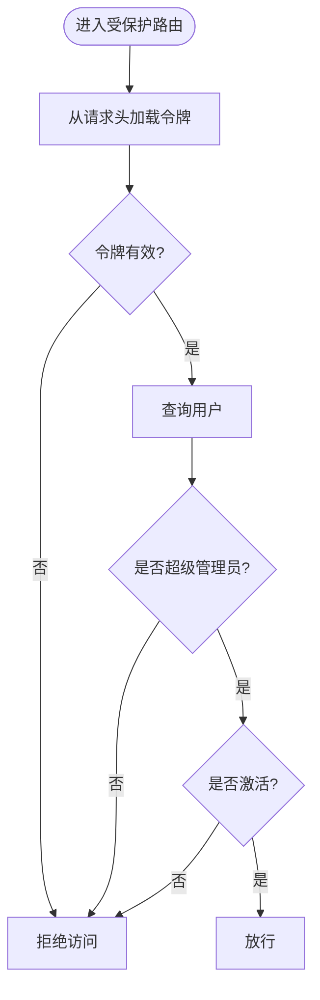
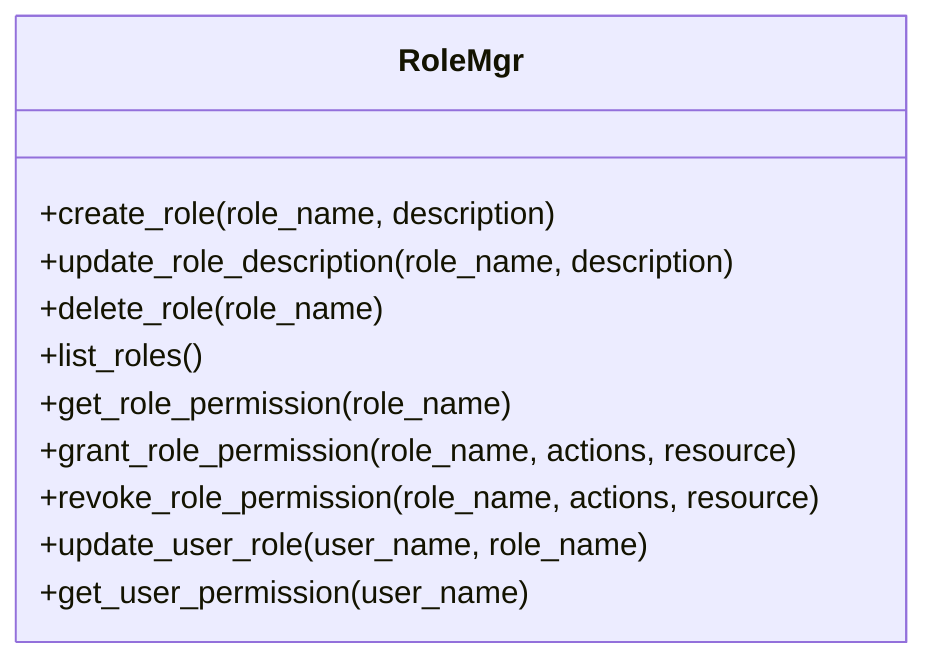
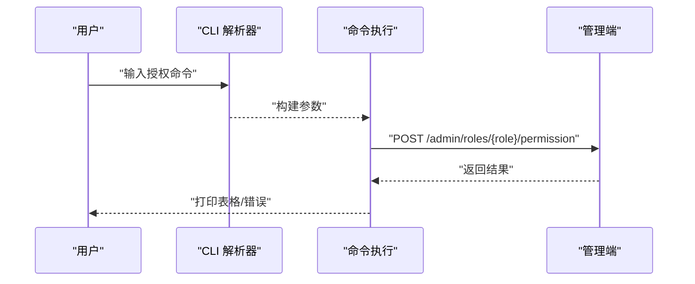
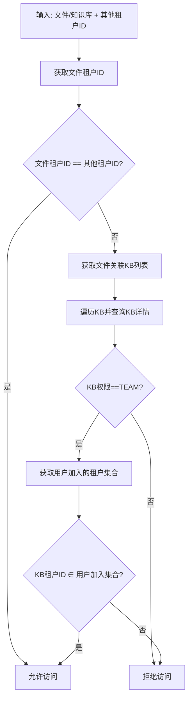
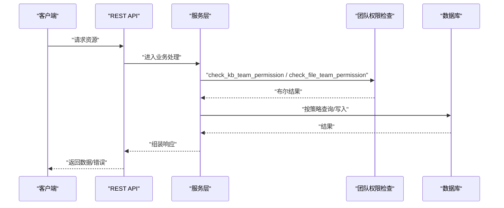
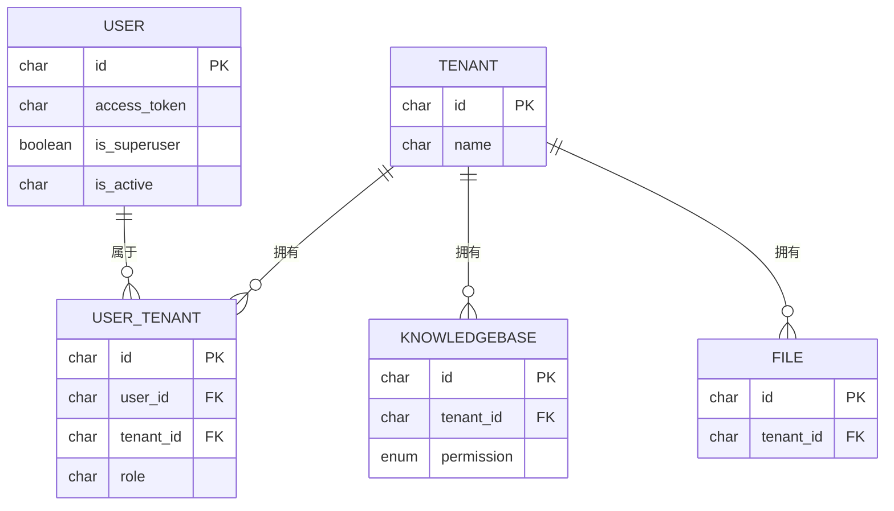
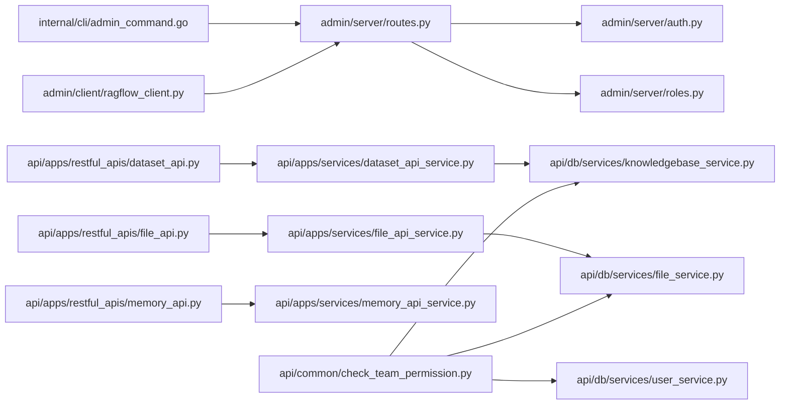

# 授权控制

<cite>
**本文引用的文件**
- [admin/server/auth.py](file://admin/server/auth.py)
- [admin/server/roles.py](file://admin/server/roles.py)
- [admin/server/routes.py](file://admin/server/routes.py)
- [admin/client/ragflow_client.py](file://admin/client/ragflow_client.py)
- [internal/cli/parser.go](file://internal/cli/parser.go)
- [internal/cli/admin_command.go](file://internal/cli/admin_command.go)
- [api/common/check_team_permission.py](file://api/common/check_team_permission.py)
- [api/common/exceptions.py](file://api/common/exceptions.py)
- [api/db/__init__.py](file://api/db/__init__.py)
- [api/db/db_models.py](file://api/db/db_models.py)
- [api/apps/tenant_app.py](file://api/apps/tenant_app.py)
- [web/src/constants/permission.ts](file://web/src/constants/permission.ts)
- [api/apps/restful_apis/dataset_api.py](file://api/apps/restful_apis/dataset_api.py)
- [api/apps/restful_apis/file_api.py](file://api/apps/restful_apis/file_api.py)
- [api/apps/restful_apis/memory_api.py](file://api/apps/restful_apis/memory_api.py)
- [api/apps/services/dataset_api_service.py](file://api/apps/services/dataset_api_service.py)
- [api/apps/services/file_api_service.py](file://api/apps/services/file_api_service.py)
- [api/apps/services/memory_api_service.py](file://api/apps/services/memory_api_service.py)
- [api/db/services/file_service.py](file://api/db/services/file_service.py)
- [api/db/services/knowledgebase_service.py](file://api/db/services/knowledgebase_service.py)
- [api/db/services/user_service.py](file://api/db/services/user_service.py)
- [api/db/services/tenant_model_service.py](file://api/db/services/tenant_model_service.py)
- [api/db/services/user_account_service.py](file://api/db/services/user_account_service.py)
- [api/db/services/canvas_service.py](file://api/db/services/canvas_service.py)
</cite>

## 目录
1. [简介](#简介)
2. [项目结构](#项目结构)
3. [核心组件](#核心组件)
4. [架构总览](#架构总览)
5. [详细组件分析](#详细组件分析)
6. [依赖分析](#依赖分析)
7. [性能考虑](#性能考虑)
8. [故障排查指南](#故障排查指南)
9. [结论](#结论)
10. [附录](#附录)

## 简介
本文件系统性梳理 RAGFlow 的授权控制体系，聚焦 RBAC 权限模型与团队权限检查机制，覆盖角色定义、权限分配、访问控制列表、API 级别权限控制、数据访问权限与操作权限等多层策略，并给出权限异常处理、配置指南与审计建议。

## 项目结构
围绕授权控制的关键目录与文件：
- 后端管理服务：管理员鉴权、角色管理接口、CLI 解析与调用
- 前端常量：权限角色枚举
- 数据库模型与服务：用户、租户、知识库、文件等实体及权限字段
- 业务 API 与服务：数据集、文件、记忆体等 API 及其服务层的权限校验

图表来源
- [admin/server/auth.py:1-228](file://admin/server/auth.py#L1-L228)
- [admin/server/roles.py:1-77](file://admin/server/roles.py#L1-L77)
- [admin/server/routes.py:337-414](file://admin/server/routes.py#L337-L414)
- [internal/cli/parser.go:1144-1214](file://internal/cli/parser.go#L1144-L1214)
- [internal/cli/admin_command.go:841-881](file://internal/cli/admin_command.go#L841-L881)
- [admin/client/ragflow_client.py:388-438](file://admin/client/ragflow_client.py#L388-L438)
- [api/common/check_team_permission.py:1-60](file://api/common/check_team_permission.py#L1-L60)
- [api/db/__init__.py:21-31](file://api/db/__init__.py#L21-L31)
- [api/db/db_models.py:707-782](file://api/db/db_models.py#L707-L782)
- [api/apps/restful_apis/dataset_api.py](file://api/apps/restful_apis/dataset_api.py)
- [api/apps/restful_apis/file_api.py](file://api/apps/restful_apis/file_api.py)
- [api/apps/restful_apis/memory_api.py](file://api/apps/restful_apis/memory_api.py)
- [api/apps/services/dataset_api_service.py](file://api/apps/services/dataset_api_service.py)
- [api/apps/services/file_api_service.py](file://api/apps/services/file_api_service.py)
- [api/apps/services/memory_api_service.py](file://api/apps/services/memory_api_service.py)
- [api/db/services/file_service.py](file://api/db/services/file_service.py)
- [api/db/services/knowledgebase_service.py](file://api/db/services/knowledgebase_service.py)
- [api/db/services/user_service.py](file://api/db/services/user_service.py)
- [api/db/services/tenant_model_service.py](file://api/db/services/tenant_model_service.py)
- [api/db/services/user_account_service.py](file://api/db/services/user_account_service.py)
- [api/db/services/canvas_service.py](file://api/db/services/canvas_service.py)

章节来源
- [admin/server/auth.py:1-228](file://admin/server/auth.py#L1-L228)
- [admin/server/roles.py:1-77](file://admin/server/roles.py#L1-L77)
- [admin/server/routes.py:337-414](file://admin/server/routes.py#L337-L414)
- [internal/cli/parser.go:1144-1214](file://internal/cli/parser.go#L1144-L1214)
- [internal/cli/admin_command.go:841-881](file://internal/cli/admin_command.go#L841-L881)
- [admin/client/ragflow_client.py:388-438](file://admin/client/ragflow_client.py#L388-L438)
- [api/common/check_team_permission.py:1-60](file://api/common/check_team_permission.py#L1-L60)
- [api/db/__init__.py:21-31](file://api/db/__init__.py#L21-L31)
- [api/db/db_models.py:707-782](file://api/db/db_models.py#L707-L782)

## 核心组件
- 管理员鉴权与中间件
  - 基于令牌的登录加载器与管理员权限校验装饰器，确保仅超级管理员可访问管理端路由。
- 角色管理器
  - 提供角色 CRUD、权限授予/撤销、用户角色更新与查询等接口，当前为占位实现，后续需落地持久化存储。
- 管理端路由
  - 暴露角色与权限管理的 REST 接口，统一使用管理员鉴权装饰器。
- CLI 与客户端
  - Go 侧命令解析与执行，Python 客户端封装 HTTP 调用，支持授予/撤销角色权限与用户角色变更。
- 团队权限检查
  - 基于知识库与文件的租户 ID 与权限策略（ME/TEAM），以及用户加入的租户集合进行判定。
- 权限异常与响应
  - 自定义异常类型与错误码，统一返回格式。
- 权限枚举与前端常量
  - 定义租户权限策略（ME/TEAM）与前端权限角色枚举。

章节来源
- [admin/server/auth.py:131-144](file://admin/server/auth.py#L131-L144)
- [admin/server/roles.py:23-77](file://admin/server/roles.py#L23-L77)
- [admin/server/routes.py:337-414](file://admin/server/routes.py#L337-L414)
- [internal/cli/parser.go:1144-1214](file://internal/cli/parser.go#L1144-L1214)
- [internal/cli/admin_command.go:841-881](file://internal/cli/admin_command.go#L841-L881)
- [admin/client/ragflow_client.py:388-438](file://admin/client/ragflow_client.py#L388-L438)
- [api/common/check_team_permission.py:25-59](file://api/common/check_team_permission.py#L25-L59)
- [api/common/exceptions.py:18-44](file://api/common/exceptions.py#L18-L44)
- [api/db/__init__.py:21-31](file://api/db/__init__.py#L21-L31)
- [web/src/constants/permission.ts:1-5](file://web/src/constants/permission.ts#L1-L5)

## 架构总览
下图展示从客户端到后端管理接口、再到服务层与数据库的授权控制链路，以及团队权限检查在数据访问中的位置。

图表来源
- [admin/server/routes.py:337-414](file://admin/server/routes.py#L337-L414)
- [admin/server/auth.py:131-144](file://admin/server/auth.py#L131-L144)
- [admin/server/roles.py:23-77](file://admin/server/roles.py#L23-L77)
- [internal/cli/admin_command.go:841-881](file://internal/cli/admin_command.go#L841-L881)
- [admin/client/ragflow_client.py:388-438](file://admin/client/ragflow_client.py#L388-L438)

## 详细组件分析

### 管理员鉴权与中间件
- 登录加载器：从请求头中提取令牌并校验有效性，返回当前用户对象。
- 管理员校验装饰器：要求用户存在、是超级管理员且处于激活状态，否则抛出异常。
- 登录流程：校验凭据后生成访问令牌并记录登录信息。

图表来源
- [admin/server/auth.py:40-73](file://admin/server/auth.py#L40-L73)
- [admin/server/auth.py:131-144](file://admin/server/auth.py#L131-L144)

章节来源
- [admin/server/auth.py:40-73](file://admin/server/auth.py#L40-L73)
- [admin/server/auth.py:131-144](file://admin/server/auth.py#L131-L144)

### 角色管理器与管理端路由
- 角色管理器：提供创建、更新、删除、列出角色；查询/授予/撤销角色权限；更新用户角色；查询用户权限等方法，当前为占位实现，需对接持久化存储。
- 管理端路由：暴露角色与权限管理的 REST 接口，参数校验与错误处理由装饰器与异常类统一处理。

图表来源
- [admin/server/roles.py:23-77](file://admin/server/roles.py#L23-L77)

章节来源
- [admin/server/roles.py:23-77](file://admin/server/roles.py#L23-L77)
- [admin/server/routes.py:337-414](file://admin/server/routes.py#L337-L414)

### CLI 与客户端交互
- Go 侧解析器：解析 SQL 风格的授权命令（grant/revoke permission），构造参数字典。
- Go 侧命令执行：以管理员模式向管理端发起 HTTP 请求，处理响应与错误。
- Python 客户端：封装 HTTP 请求，打印表格化结果或错误信息。

图表来源
- [internal/cli/parser.go:1144-1214](file://internal/cli/parser.go#L1144-L1214)
- [internal/cli/admin_command.go:841-881](file://internal/cli/admin_command.go#L841-L881)
- [admin/client/ragflow_client.py:388-438](file://admin/client/ragflow_client.py#L388-L438)

章节来源
- [internal/cli/parser.go:1144-1214](file://internal/cli/parser.go#L1144-L1214)
- [internal/cli/admin_command.go:841-881](file://internal/cli/admin_command.go#L841-L881)
- [admin/client/ragflow_client.py:388-438](file://admin/client/ragflow_client.py#L388-L438)

### 团队权限检查机制
- 知识库权限：若知识库权限为 TEAM，则需判断当前用户是否加入过该租户。
- 文件权限：根据文件所属租户 ID 或关联的知识库权限策略，结合用户加入的租户集合进行判定。

图表来源
- [api/common/check_team_permission.py:25-59](file://api/common/check_team_permission.py#L25-L59)
- [api/db/services/file_service.py](file://api/db/services/file_service.py)
- [api/db/services/knowledgebase_service.py](file://api/db/services/knowledgebase_service.py)
- [api/db/services/user_service.py](file://api/db/services/user_service.py)

章节来源
- [api/common/check_team_permission.py:25-59](file://api/common/check_team_permission.py#L25-L59)

### API 级别权限控制与数据访问权限
- 租户应用（团队管理）：对团队成员邀请、移除、列表、同意加入等操作进行鉴权与角色校验。
- 数据集/文件/记忆体 API：在服务层与业务逻辑处结合租户权限策略与团队权限检查进行访问控制。

图表来源
- [api/apps/tenant_app.py:49-74](file://api/apps/tenant_app.py#L49-L74)
- [api/apps/tenant_app.py:117-144](file://api/apps/tenant_app.py#L117-L144)
- [api/apps/restful_apis/dataset_api.py](file://api/apps/restful_apis/dataset_api.py)
- [api/apps/restful_apis/file_api.py](file://api/apps/restful_apis/file_api.py)
- [api/apps/restful_apis/memory_api.py](file://api/apps/restful_apis/memory_api.py)
- [api/apps/services/dataset_api_service.py](file://api/apps/services/dataset_api_service.py)
- [api/apps/services/file_api_service.py](file://api/apps/services/file_api_service.py)
- [api/apps/services/memory_api_service.py](file://api/apps/services/memory_api_service.py)

章节来源
- [api/apps/tenant_app.py:49-74](file://api/apps/tenant_app.py#L49-L74)
- [api/apps/tenant_app.py:117-144](file://api/apps/tenant_app.py#L117-L144)
- [api/apps/restful_apis/dataset_api.py](file://api/apps/restful_apis/dataset_api.py)
- [api/apps/restful_apis/file_api.py](file://api/apps/restful_apis/file_api.py)
- [api/apps/restful_apis/memory_api.py](file://api/apps/restful_apis/memory_api.py)

### 权限模型与数据结构
- 权限枚举
  - 用户在租户内的角色：owner、admin、normal、invite
  - 租户资源权限策略：me（仅本人）、team（团队可见）
- 数据模型要点
  - 用户表包含访问令牌、是否超级管理员等字段
  - 租户与用户关联表记录角色
  - 知识库/文件等资源表包含租户 ID 与权限策略字段

图表来源
- [api/db/db_models.py:707-782](file://api/db/db_models.py#L707-L782)
- [api/db/__init__.py:21-31](file://api/db/__init__.py#L21-L31)

章节来源
- [api/db/__init__.py:21-31](file://api/db/__init__.py#L21-L31)
- [api/db/db_models.py:707-782](file://api/db/db_models.py#L707-L782)

## 依赖分析
- 组件耦合
  - 管理端路由依赖管理员鉴权装饰器与角色管理器
  - CLI 与客户端依赖管理端路由
  - 业务 API 依赖服务层，服务层依赖团队权限检查与数据库服务
- 外部依赖
  - Flask 登录与序列化、Peewee ORM、数据库连接池与重试机制
- 潜在循环依赖
  - 当前模块间为单向依赖，未见循环

图表来源
- [admin/server/routes.py:337-414](file://admin/server/routes.py#L337-L414)
- [admin/server/auth.py:131-144](file://admin/server/auth.py#L131-L144)
- [admin/server/roles.py:23-77](file://admin/server/roles.py#L23-L77)
- [internal/cli/admin_command.go:841-881](file://internal/cli/admin_command.go#L841-L881)
- [admin/client/ragflow_client.py:388-438](file://admin/client/ragflow_client.py#L388-L438)
- [api/apps/restful_apis/dataset_api.py](file://api/apps/restful_apis/dataset_api.py)
- [api/apps/restful_apis/file_api.py](file://api/apps/restful_apis/file_api.py)
- [api/apps/restful_apis/memory_api.py](file://api/apps/restful_apis/memory_api.py)
- [api/apps/services/dataset_api_service.py](file://api/apps/services/dataset_api_service.py)
- [api/apps/services/file_api_service.py](file://api/apps/services/file_api_service.py)
- [api/apps/services/memory_api_service.py](file://api/apps/services/memory_api_service.py)
- [api/common/check_team_permission.py:25-59](file://api/common/check_team_permission.py#L25-L59)
- [api/db/services/file_service.py](file://api/db/services/file_service.py)
- [api/db/services/knowledgebase_service.py](file://api/db/services/knowledgebase_service.py)
- [api/db/services/user_service.py](file://api/db/services/user_service.py)

章节来源
- [admin/server/routes.py:337-414](file://admin/server/routes.py#L337-L414)
- [admin/server/auth.py:131-144](file://admin/server/auth.py#L131-L144)
- [admin/server/roles.py:23-77](file://admin/server/roles.py#L23-L77)
- [internal/cli/admin_command.go:841-881](file://internal/cli/admin_command.go#L841-L881)
- [admin/client/ragflow_client.py:388-438](file://admin/client/ragflow_client.py#L388-L438)
- [api/common/check_team_permission.py:25-59](file://api/common/check_team_permission.py#L25-L59)

## 性能考虑
- 数据库连接池与重试：数据库层提供连接池与指数退避重试，降低瞬时故障影响。
- 查询优化：团队权限检查涉及多次查询，建议在服务层缓存用户加入的租户集合，减少重复查询。
- 并发控制：锁机制采用数据库自旋锁，避免并发冲突导致的重复授权。

## 故障排查指南
- 管理员权限不足
  - 现象：返回“非管理员”或“用户未激活”
  - 排查：确认用户是否为超级管理员且状态为激活；检查令牌格式与有效期
- 角色管理接口报错
  - 现象：角色管理接口返回 500 或提示未实现
  - 排查：当前角色管理器为占位实现，需补充持久化逻辑
- 团队权限检查不生效
  - 现象：跨租户访问被拒绝
  - 排查：确认知识库权限策略为 TEAM 且用户已加入对应租户；检查文件与知识库关联关系
- CLI/客户端调用失败
  - 现象：授予/撤销权限失败
  - 排查：确认服务器类型为 admin 模式；检查网络连通性与管理端路由可用性

章节来源
- [admin/server/auth.py:131-144](file://admin/server/auth.py#L131-L144)
- [admin/server/roles.py:23-77](file://admin/server/roles.py#L23-L77)
- [api/common/check_team_permission.py:25-59](file://api/common/check_team_permission.py#L25-L59)
- [internal/cli/admin_command.go:841-881](file://internal/cli/admin_command.go#L841-L881)
- [admin/client/ragflow_client.py:388-438](file://admin/client/ragflow_client.py#L388-L438)

## 结论
RAGFlow 的授权控制以管理员鉴权与 RBAC 模型为核心，结合团队权限检查实现多层级访问控制。当前角色管理器为占位实现，建议尽快完善持久化与权限存储；同时在服务层引入缓存与锁机制，提升权限判定与并发安全性。

## 附录

### 权限配置指南
- 初始化默认管理员账户与租户
  - 若无活动管理员，系统会初始化默认管理员并创建默认租户
- 设置租户权限策略
  - 将资源权限设置为 team，启用团队共享；设置为 me 仅本人可见
- 分配角色与权限
  - 使用管理端路由或 CLI 客户端授予/撤销角色权限；更新用户角色

章节来源
- [admin/server/auth.py:75-129](file://admin/server/auth.py#L75-L129)
- [api/db/__init__.py:28-31](file://api/db/__init__.py#L28-L31)
- [admin/server/routes.py:337-414](file://admin/server/routes.py#L337-L414)
- [internal/cli/parser.go:1144-1214](file://internal/cli/parser.go#L1144-L1214)
- [internal/cli/admin_command.go:841-881](file://internal/cli/admin_command.go#L841-L881)
- [admin/client/ragflow_client.py:388-438](file://admin/client/ragflow_client.py#L388-L438)

### 权限模型设计建议
- 明确权限边界：将“资源权限策略（ME/TEAM）”与“用户角色（owner/admin/normal/invite）”分离，便于细粒度控制
- 引入权限矩阵：为每个资源类型建立动作集合（读/写/删除/管理），并与角色绑定
- 审计与追踪：记录权限变更日志，便于回溯与合规检查

### 团队权限检查最佳实践
- 在服务层统一入口进行权限判定，避免分散逻辑
- 对频繁查询的用户租户集合进行缓存，降低数据库压力
- 对跨租户操作增加显式的二次确认与审计日志