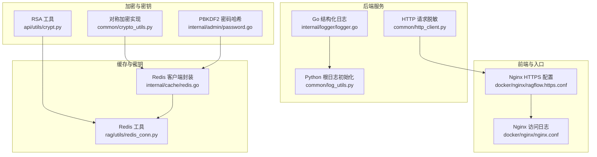
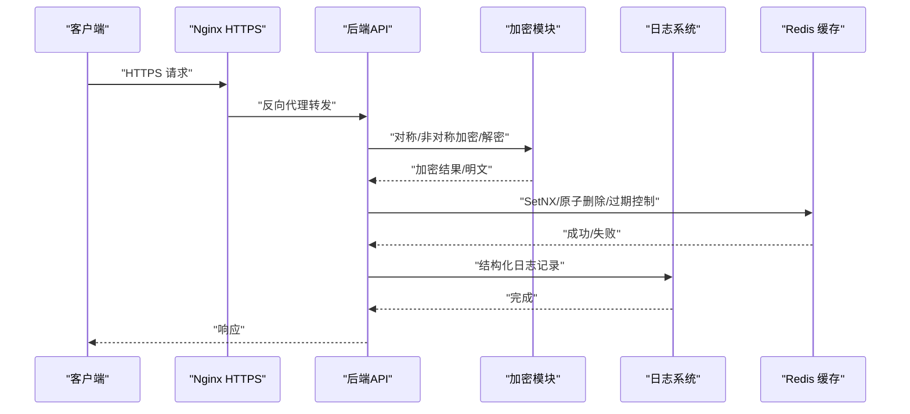
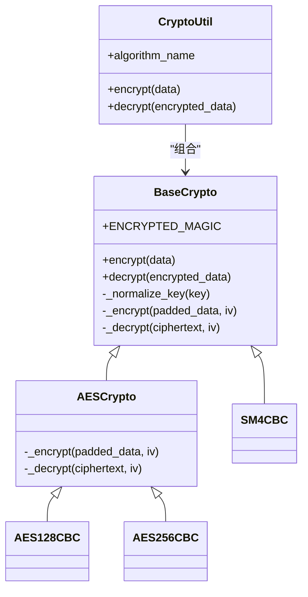
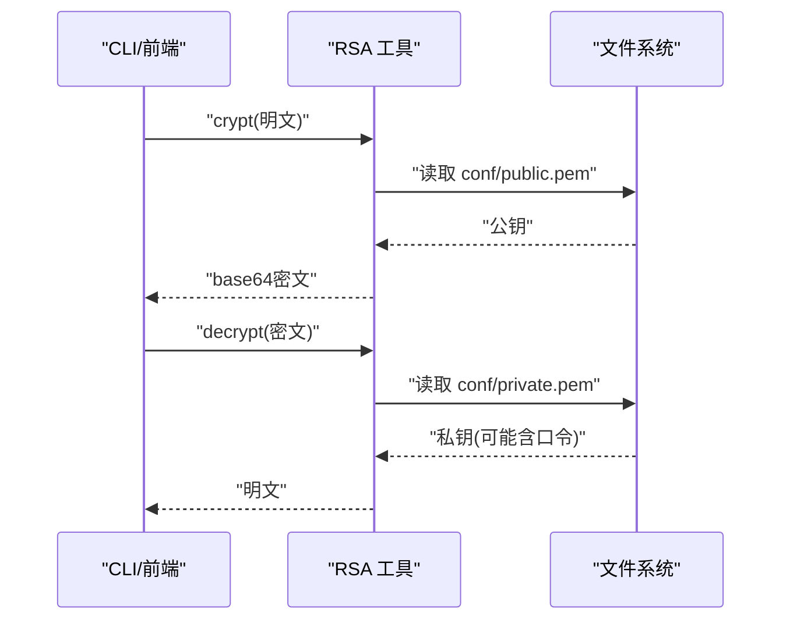
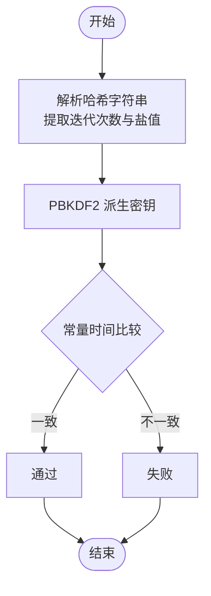
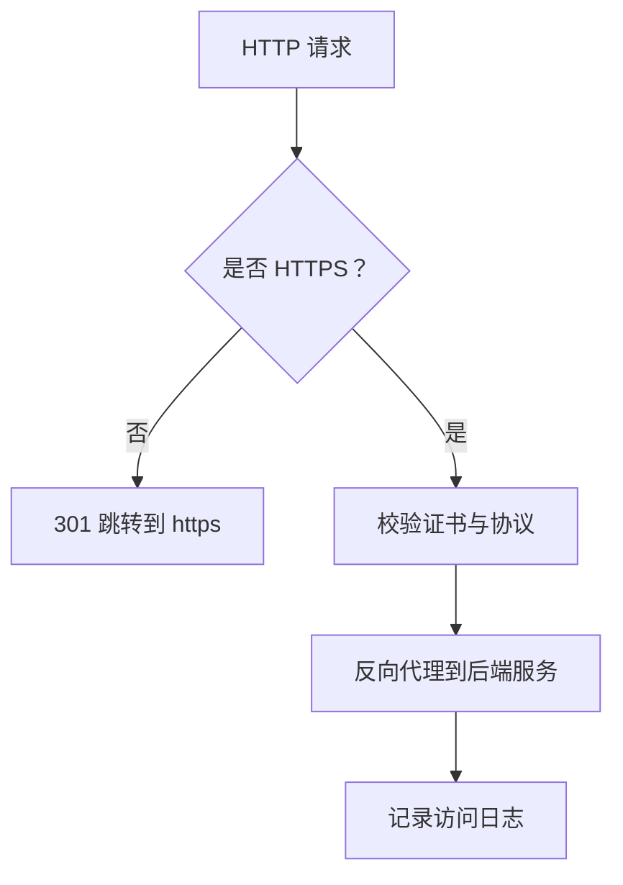
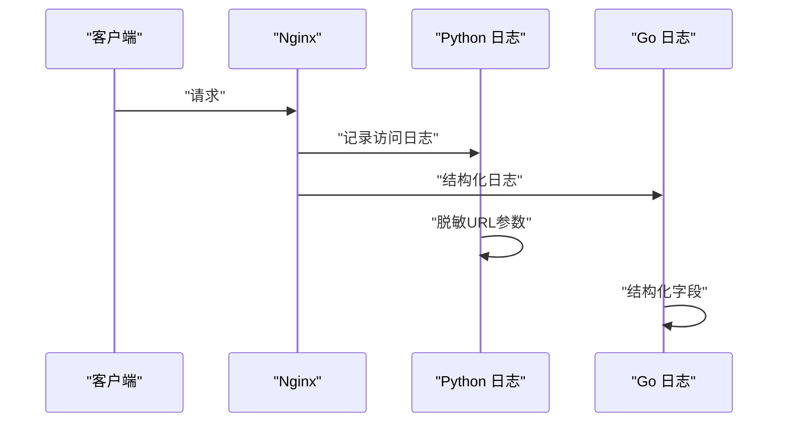
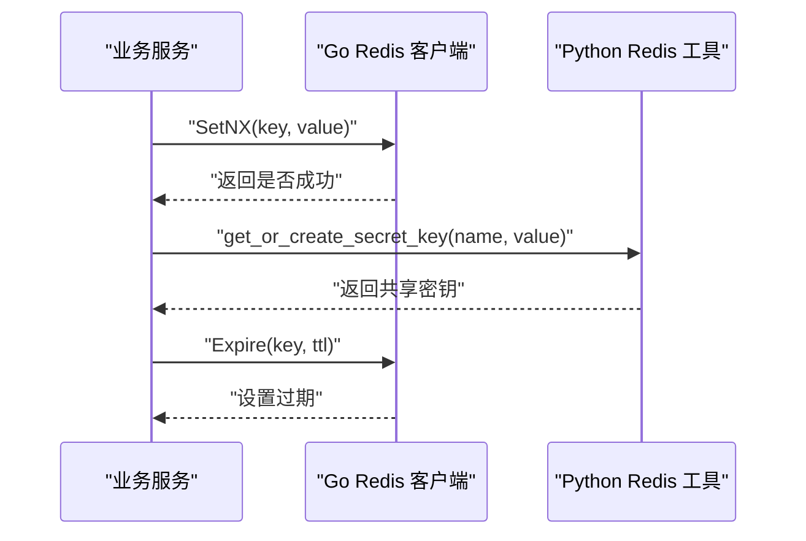
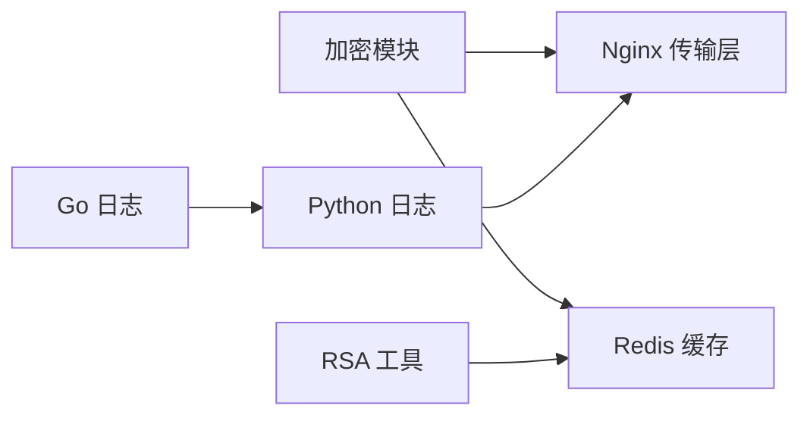

# 数据安全保护

<cite>
**本文引用的文件**
- [crypto_utils.py](file://common/crypto_utils.py)
- [crypt.py](file://api/utils/crypt.py)
- [password.go](file://internal/admin/password.go)
- [redis.go](file://internal/cache/redis.go)
- [redis_conn.py](file://rag/utils/redis_conn.py)
- [ragflow.https.conf](file://docker/nginx/ragflow.https.conf)
- [nginx.conf](file://docker/nginx/nginx.conf)
- [http_client.py](file://common/http_client.py)
- [log_utils.py（Python）](file://common/log_utils.py)
- [logger.go](file://internal/logger/logger.go)
- [SECURITY.md](file://SECURITY.md)
- [cli.go](file://internal/cli/cli.go)
- [config.go](file://internal/server/config.go)
</cite>

## 目录
1. [简介](#简介)
2. [项目结构](#项目结构)
3. [核心组件](#核心组件)
4. [架构总览](#架构总览)
5. [详细组件分析](#详细组件分析)
6. [依赖分析](#依赖分析)
7. [性能考虑](#性能考虑)
8. [故障排查指南](#故障排查指南)
9. [结论](#结论)
10. [附录](#附录)

## 简介
本文件面向RAGFlow的数据安全保护机制，系统化梳理并解释以下关键能力与实践：
- 敏感数据加密：对称加密（AES-128/256-CBC、SM4-CBC）、非对称加密（RSA-PKCS1_v1_5）与哈希算法在系统中的应用场景与实现要点。
- 传输安全：HTTPS/TLS配置、证书管理、Nginx代理层安全参数与日志记录。
- 访问日志与审计：后端zap日志、前端Nginx访问日志、敏感URL参数脱敏策略。
- 缓存安全：Redis连接健康检查、原子写入与键过期控制，以及密钥生成与获取的并发一致性保障。
- 数据脱敏与隐私：日志中对敏感查询参数的清洗策略。
- 合规与风险：已知安全问题修复建议、漏洞预防与响应流程。

## 项目结构
围绕数据安全的关键目录与文件分布如下：
- 加密与密钥管理：common/crypto_utils.py（对称加密）、api/utils/crypt.py（RSA非对称）、internal/admin/password.go（密码哈希与校验）。
- 传输与证书：docker/nginx/ragflow.https.conf、docker/nginx/nginx.conf。
- 日志与审计：common/log_utils.py（Python根日志初始化）、internal/logger/logger.go（Go结构化日志）。
- 缓存与密钥：internal/cache/redis.go（Go Redis客户端封装）、rag/utils/redis_conn.py（Python Redis工具）。
- 安全策略与漏洞：SECURITY.md（已知漏洞与修复建议）。
- 配置与CLI：internal/cli/cli.go、internal/server/config.go（配置解析与打印）。

**图表来源**
- [ragflow.https.conf:1-47](file://docker/nginx/ragflow.https.conf#L1-L47)
- [nginx.conf:1-34](file://docker/nginx/nginx.conf#L1-L34)
- [logger.go:1-139](file://internal/logger/logger.go#L1-L139)
- [log_utils.py（Python）:1-87](file://common/log_utils.py#L1-L87)
- [http_client.py:53-88](file://common/http_client.py#L53-L88)
- [crypto_utils.py:1-375](file://common/crypto_utils.py#L1-L375)
- [crypt.py:1-66](file://api/utils/crypt.py#L1-L66)
- [password.go:105-156](file://internal/admin/password.go#L105-L156)
- [redis.go:122-883](file://internal/cache/redis.go#L122-L883)
- [redis_conn.py:337-371](file://rag/utils/redis_conn.py#L337-L371)

**章节来源**
- [ragflow.https.conf:1-47](file://docker/nginx/ragflow.https.conf#L1-L47)
- [nginx.conf:1-34](file://docker/nginx/nginx.conf#L1-L34)
- [logger.go:1-139](file://internal/logger/logger.go#L1-L139)
- [log_utils.py（Python）:1-87](file://common/log_utils.py#L1-L87)
- [http_client.py:53-88](file://common/http_client.py#L53-L88)
- [crypto_utils.py:1-375](file://common/crypto_utils.py#L1-L375)
- [crypt.py:1-66](file://api/utils/crypt.py#L1-L66)
- [password.go:105-156](file://internal/admin/password.go#L105-L156)
- [redis.go:122-883](file://internal/cache/redis.go#L122-L883)
- [redis_conn.py:337-371](file://rag/utils/redis_conn.py#L337-L371)

## 核心组件
- 对称加密与密钥派生：基于密码学库实现AES-128/256-CBC与SM4-CBC，采用PBKDF2进行密钥派生，统一魔数标识与PKCS7填充。
- 非对称加密与密钥管理：RSA-PKCS1_v1_5用于前后端交互的密码加解密，私钥以PEM格式存储并支持口令解密。
- 哈希与密码学：PBKDF2用于密码哈希验证，常量时间比较防止时序攻击；SHA1用于特定场景下的整数映射（测试用途）。
- 传输安全：Nginx强制HTTP重定向至HTTPS，配置SSL证书路径与代理转发；开启Gzip压缩与静态资源缓存控制。
- 日志与审计：Go zap结构化日志与Python根日志轮转；HTTP请求URL参数脱敏，避免凭据泄露。
- 缓存安全：Redis健康检查、原子SetNX、DeleteIfEqual Lua脚本、TTL控制与键过期；并发场景下密钥生成的一致性保障。

**章节来源**
- [crypto_utils.py:25-317](file://common/crypto_utils.py#L25-L317)
- [crypt.py:26-60](file://api/utils/crypt.py#L26-L60)
- [password.go:105-156](file://internal/admin/password.go#L105-L156)
- [password.go:196-241](file://internal/admin/password.go#L196-L241)
- [ragflow.https.conf:1-47](file://docker/nginx/ragflow.https.conf#L1-L47)
- [nginx.conf:1-34](file://docker/nginx/nginx.conf#L1-L34)
- [log_utils.py（Python）:25-87](file://common/log_utils.py#L25-L87)
- [logger.go:32-139](file://internal/logger/logger.go#L32-L139)
- [http_client.py:53-88](file://common/http_client.py#L53-L88)
- [redis.go:122-883](file://internal/cache/redis.go#L122-L883)
- [redis_conn.py:337-371](file://rag/utils/redis_conn.py#L337-L371)

## 架构总览
下图展示从Nginx到后端服务、日志与缓存的整体数据流与安全控制点：

**图表来源**
- [ragflow.https.conf:1-47](file://docker/nginx/ragflow.https.conf#L1-L47)
- [logger.go:108-139](file://internal/logger/logger.go#L108-L139)
- [log_utils.py（Python）:25-87](file://common/log_utils.py#L25-L87)
- [crypto_utils.py:256-317](file://common/crypto_utils.py#L256-L317)
- [crypt.py:26-60](file://api/utils/crypt.py#L26-L60)
- [redis.go:346-408](file://internal/cache/redis.go#L346-L408)

## 详细组件分析

### 对称加密与密钥派生（AES-128/256-CBC、SM4-CBC）
- 设计要点
  - 统一魔数标识加密数据头，便于识别与解密。
  - 使用PBKDF2进行密钥派生，固定盐值与迭代次数，确保可重复且安全。
  - PKCS7填充与CBC模式组合，IV随机生成或显式传入。
  - 提供工厂类选择算法，支持AES-128/256-CBC与SM4-CBC。
- 应用场景
  - 存储敏感配置项或令牌的本地加密。
  - 与缓存/数据库字段的透明加密。
- 安全建议
  - 严格管理密钥环境变量与密钥轮换策略。
  - 避免硬编码密钥，确保不同环境独立密钥。
  - 定期评估PBKDF2迭代次数与哈希算法强度。

**图表来源**
- [crypto_utils.py:25-317](file://common/crypto_utils.py#L25-L317)

**章节来源**
- [crypto_utils.py:25-317](file://common/crypto_utils.py#L25-L317)

### 非对称加密与密钥管理（RSA-PKCS1_v1_5）
- 设计要点
  - 前端/CLI使用公钥加密，后端使用私钥解密，私钥PEM文件支持口令保护。
  - 提供兼容多种输入格式的解密函数，增强向前兼容性。
- 应用场景
  - 传输密码或短文本令牌，避免明文在网络中暴露。
- 安全建议
  - 私钥文件权限最小化，仅限运行账户读取。
  - 定期轮换RSA密钥对并更新相关配置。

**图表来源**
- [crypt.py:26-60](file://api/utils/crypt.py#L26-L60)

**章节来源**
- [crypt.py:26-60](file://api/utils/crypt.py#L26-L60)

### 密码哈希与校验（PBKDF2）
- 设计要点
  - 支持PBKDF2哈希格式识别与验证，常量时间比较防止时序侧信道。
  - 生成与验证均使用SHA-256与固定长度派生密钥。
- 应用场景
  - 用户密码存储与登录校验。
- 安全建议
  - 迭代次数应随硬件能力提升而增加。
  - 与多因子认证结合，降低单点风险。

**图表来源**
- [password.go:105-156](file://internal/admin/password.go#L105-L156)

**章节来源**
- [password.go:105-156](file://internal/admin/password.go#L105-L156)

### 传输安全（HTTPS/TLS、证书与代理）
- 配置要点
  - HTTP自动跳转HTTPS，确保所有流量走TLS。
  - 明确指定SSL证书与私钥路径，启用Gzip压缩与静态资源长期缓存。
  - Nginx主配置定义访问日志格式与输出位置。
- 安全建议
  - 使用受信CA签发的证书，定期更新证书链。
  - 关闭不必要协议版本与弱密码套件（需在上游服务或Nginx额外配置）。
  - 限制代理体大小，防止滥用。

**图表来源**
- [ragflow.https.conf:1-47](file://docker/nginx/ragflow.https.conf#L1-L47)
- [nginx.conf:1-34](file://docker/nginx/nginx.conf#L1-L34)

**章节来源**
- [ragflow.https.conf:1-47](file://docker/nginx/ragflow.https.conf#L1-L47)
- [nginx.conf:1-34](file://docker/nginx/nginx.conf#L1-L34)

### 访问日志与审计（用户行为追踪与敏感信息脱敏）
- 日志系统
  - Go zap结构化日志，支持级别控制与调用者信息。
  - Python根日志轮转，按大小与备份数量管理日志文件。
- 敏感信息脱敏
  - HTTP URL脱敏：移除查询参数、片段与用户信息，仅保留必要部分。
- 审计建议
  - 将敏感字段纳入脱敏白名单，避免误记录。
  - 定期巡检日志目录配额与权限。

**图表来源**
- [nginx.conf:17-21](file://docker/nginx/nginx.conf#L17-L21)
- [log_utils.py（Python）:25-87](file://common/log_utils.py#L25-L87)
- [logger.go:32-139](file://internal/logger/logger.go#L32-L139)
- [http_client.py:53-88](file://common/http_client.py#L53-L88)

**章节来源**
- [nginx.conf:17-21](file://docker/nginx/nginx.conf#L17-L21)
- [log_utils.py（Python）:25-87](file://common/log_utils.py#L25-L87)
- [logger.go:32-139](file://internal/logger/logger.go#L32-L139)
- [http_client.py:53-88](file://common/http_client.py#L53-L88)

### 缓存数据安全（Redis）
- 安全能力
  - 健康检查与Ping测试，确保连接可用。
  - 原子写入（SetNX）、DeleteIfEqual（Lua脚本）、TTL控制与键过期。
  - 并发场景下“获取或创建密钥”的一致性保障。
- 应用场景
  - 令牌缓存、会话状态、密钥生成与共享。
- 安全建议
  - Redis启用认证与网络隔离，仅内网访问。
  - 合理设置TTL与清理策略，避免敏感数据长期驻留。

**图表来源**
- [redis.go:346-408](file://internal/cache/redis.go#L346-L408)
- [redis_conn.py:337-371](file://rag/utils/redis_conn.py#L337-L371)

**章节来源**
- [redis.go:122-883](file://internal/cache/redis.go#L122-L883)
- [redis_conn.py:337-371](file://rag/utils/redis_conn.py#L337-L371)

### 数据脱敏与隐私保护策略
- URL参数脱敏：移除client_secret、secret、code、access_token、refresh_token、password、token、app_secret等敏感键。
- 日志脱敏：仅记录必要信息，避免明文记录令牌与凭证。
- 最佳实践
  - 在数据库与缓存层对敏感字段进行加密存储。
  - 审计所有敏感操作（如密钥生成、令牌发放）。

**章节来源**
- [http_client.py:53-88](file://common/http_client.py#L53-L88)

### 合规性与已知漏洞
- 已知问题
  - Pickle反序列化存在代码执行风险，需严格限制导入模块与名称。
- 修复建议
  - 实施受限Unpickler，仅允许白名单模块与属性。
  - 引入更安全的序列化方案（如JSON、MessagePack）替代pickle。
- 预防与响应
  - 定期代码扫描与依赖漏洞检测。
  - 建立漏洞上报渠道与应急处置流程。

**章节来源**
- [SECURITY.md:1-75](file://SECURITY.md#L1-L75)

## 依赖分析
- 组件耦合
  - 加密模块与缓存模块松耦合，通过接口/方法调用交互。
  - 日志模块独立于业务逻辑，提供统一输出与脱敏策略。
  - Nginx作为传输层边界，集中处理TLS与访问日志。
- 外部依赖
  - Python加密库（对称/非对称）、Go zap日志库、Redis客户端。
- 潜在风险
  - 密钥管理不当导致的解密失败或密钥泄露。
  - Redis未授权访问与弱口令引发的数据泄露。

**图表来源**
- [crypto_utils.py:256-317](file://common/crypto_utils.py#L256-L317)
- [crypt.py:26-60](file://api/utils/crypt.py#L26-L60)
- [redis.go:346-408](file://internal/cache/redis.go#L346-L408)
- [logger.go:32-139](file://internal/logger/logger.go#L32-L139)
- [log_utils.py（Python）:25-87](file://common/log_utils.py#L25-L87)

**章节来源**
- [crypto_utils.py:256-317](file://common/crypto_utils.py#L256-L317)
- [crypt.py:26-60](file://api/utils/crypt.py#L26-L60)
- [redis.go:346-408](file://internal/cache/redis.go#L346-L408)
- [logger.go:32-139](file://internal/logger/logger.go#L32-L139)
- [log_utils.py（Python）:25-87](file://common/log_utils.py#L25-L87)

## 性能考虑
- 加密性能
  - AES-256-CBC与SM4-CBC在现代CPU上性能良好，建议根据合规要求选择算法。
  - PBKDF2迭代次数越高安全性越好但开销越大，需平衡安全与性能。
- 日志性能
  - 结构化日志与轮转策略减少I/O压力，建议按磁盘容量与吞吐量调整轮转参数。
- 缓存性能
  - Redis原子操作与Lua脚本减少往返，合理设置TTL避免内存膨胀。

## 故障排查指南
- 传输层问题
  - 检查Nginx HTTPS监听与证书路径是否正确，确认端口占用与防火墙放行。
- 日志问题
  - Go与Python日志路径与权限，确认轮转策略生效。
- 缓存问题
  - Redis健康检查失败时，检查连接参数、认证与网络连通性。
- 加密问题
  - 确认密钥长度与算法匹配，PBKDF2盐值与迭代次数一致。
- 安全问题
  - 若出现pickle相关异常，核查受限Unpickler配置与白名单模块。

**章节来源**
- [ragflow.https.conf:1-47](file://docker/nginx/ragflow.https.conf#L1-L47)
- [nginx.conf:1-34](file://docker/nginx/nginx.conf#L1-L34)
- [logger.go:88-93](file://internal/logger/logger.go#L88-L93)
- [log_utils.py（Python）:25-87](file://common/log_utils.py#L25-L87)
- [redis.go:122-145](file://internal/cache/redis.go#L122-L145)
- [SECURITY.md:1-75](file://SECURITY.md#L1-L75)

## 结论
RAGFlow在数据安全方面提供了较为完善的基础设施：对称与非对称加密、PBKDF2密码哈希、Nginx HTTPS与访问日志、Redis原子操作与缓存安全、以及敏感信息脱敏策略。建议在生产环境中进一步强化密钥轮换、TLS策略、Redis访问控制与漏洞扫描流程，持续提升整体安全水平。

## 附录

### 安全配置检查清单
- 传输层
  - 是否强制HTTPS，证书链完整，私钥权限最小化。
  - 是否关闭不必要协议与弱密码套件（需补充）。
- 日志与审计
  - 日志轮转策略是否启用，脱敏规则是否覆盖敏感参数。
  - 是否记录必要的审计字段（用户、操作、时间、结果）。
- 缓存与密钥
  - Redis是否启用认证与网络隔离，TTL与清理策略是否合理。
  - 密钥生成与获取是否具备并发一致性保障。
- 加密与密钥管理
  - 是否使用强算法（AES-256/SM4），PBKDF2迭代次数是否足够。
  - 是否定期轮换密钥与证书，密钥存储是否安全。

### 漏洞扫描与响应建议
- 扫描范围
  - 依赖库版本扫描、Pickle反序列化风险、密码哈希强度、Redis未授权访问。
- 响应流程
  - 发现漏洞立即隔离受影响组件，修复后回归测试，发布补丁并通知用户。