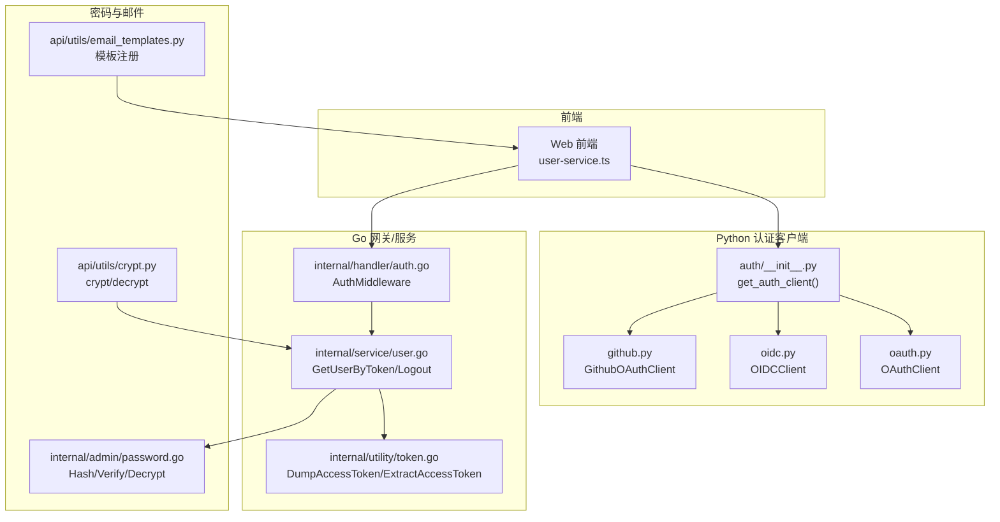
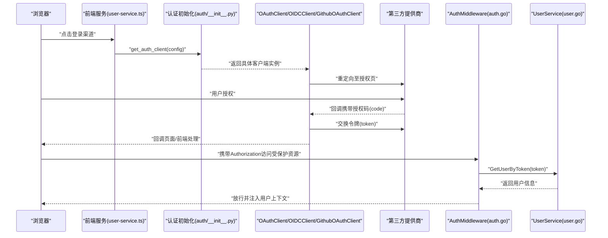
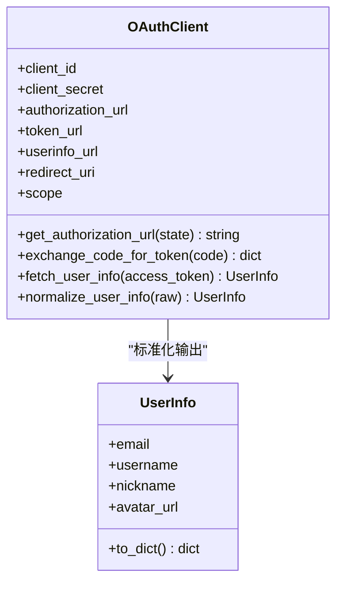
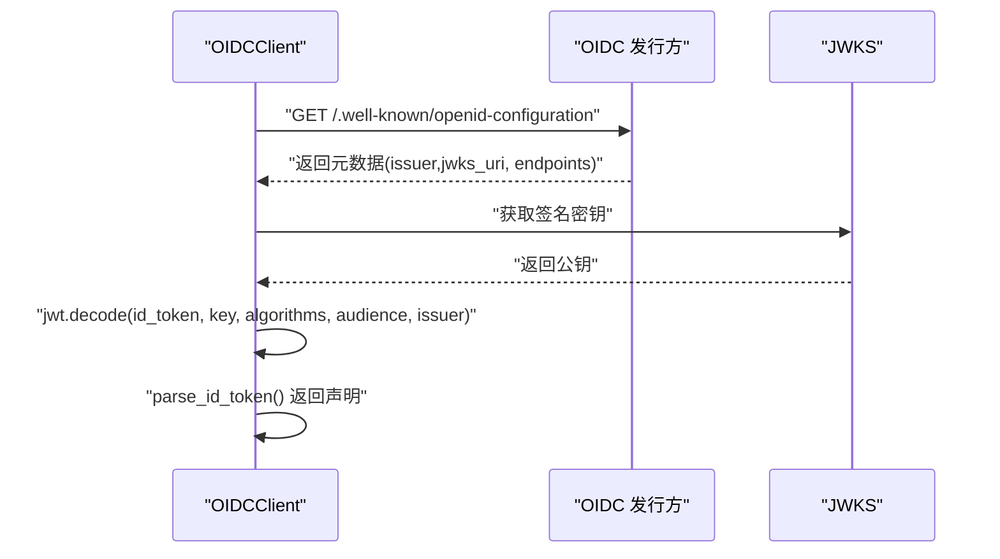
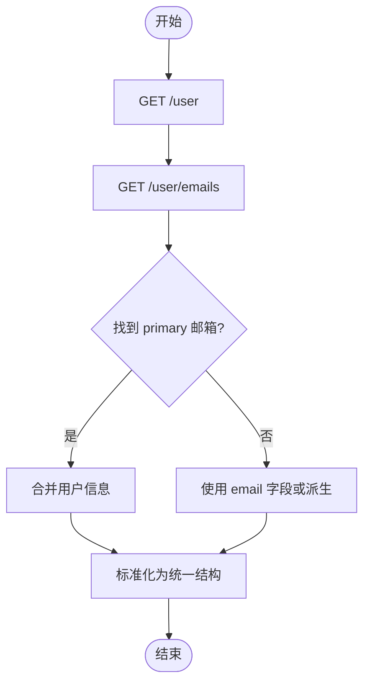
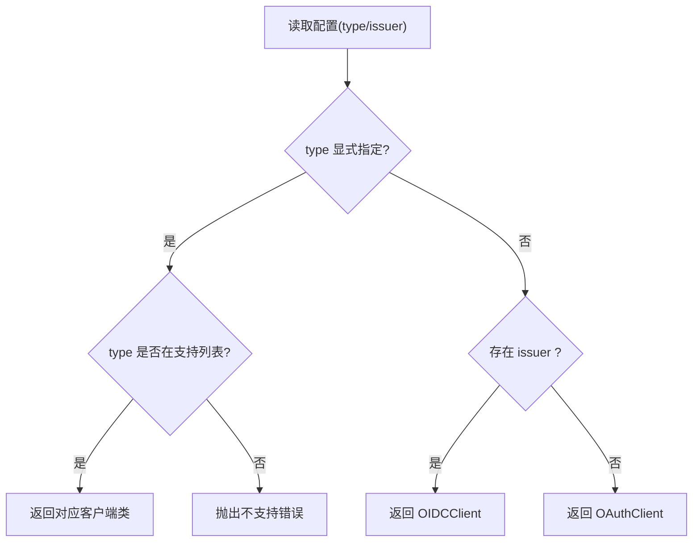
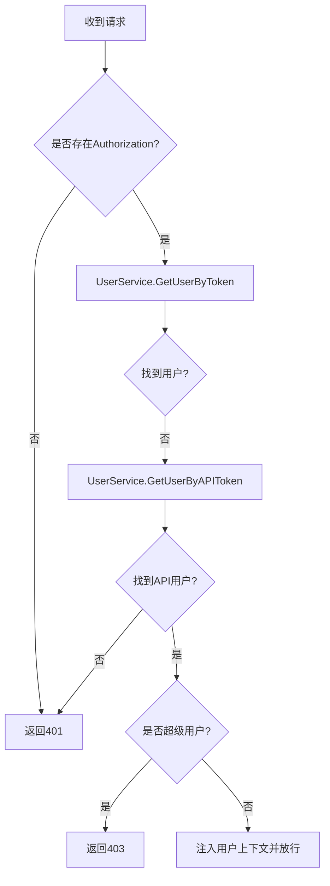
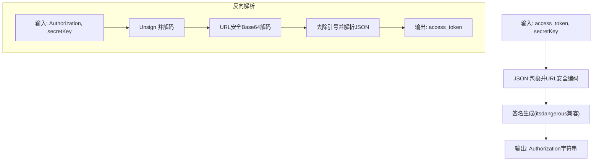
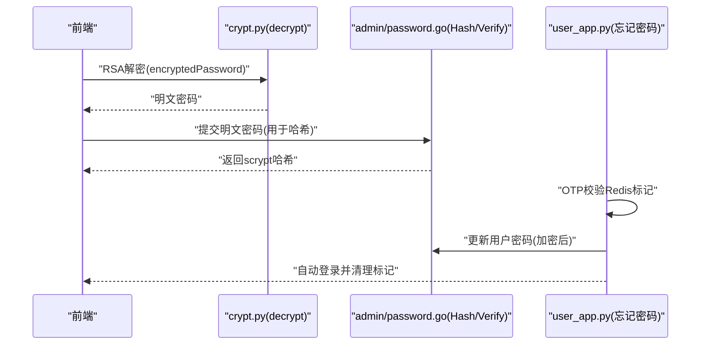
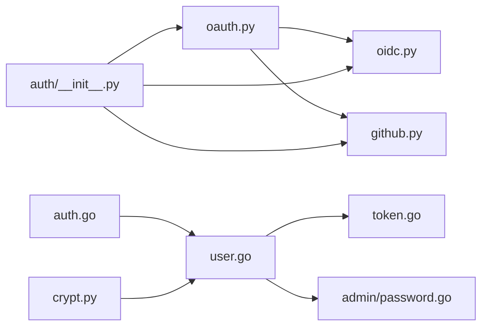

# 认证系统

<cite>
**本文引用的文件**
- [api/apps/auth/__init__.py](file://api/apps/auth/__init__.py)
- [api/apps/auth/oauth.py](file://api/apps/auth/oauth.py)
- [api/apps/auth/oidc.py](file://api/apps/auth/oidc.py)
- [api/apps/auth/github.py](file://api/apps/auth/github.py)
- [api/apps/auth/README.md](file://api/apps/auth/README.md)
- [internal/handler/auth.go](file://internal/handler/auth.go)
- [internal/service/user.go](file://internal/service/user.go)
- [internal/utility/token.go](file://internal/utility/token.go)
- [api/utils/crypt.py](file://api/utils/crypt.py)
- [internal/admin/password.go](file://internal/admin/password.go)
- [api/apps/user_app.py](file://api/apps/user_app.py)
- [web/src/services/user-service.ts](file://web/src/services/user-service.ts)
- [api/utils/email_templates.py](file://api/utils/email_templates.py)
</cite>

## 目录
1. [简介](#简介)
2. [项目结构](#项目结构)
3. [核心组件](#核心组件)
4. [架构总览](#架构总览)
5. [详细组件分析](#详细组件分析)
6. [依赖分析](#依赖分析)
7. [性能考虑](#性能考虑)
8. [故障排查指南](#故障排查指南)
9. [结论](#结论)
10. [附录](#附录)

## 简介
本文件面向RAGFlow的认证系统，围绕以下目标展开：深入解释基于“访问令牌”的认证机制（令牌生成、验证、失效）、OAuth2/OIDC集成方案（授权流程、令牌交换、用户信息获取）、第三方提供商（如GitHub）对接、密码管理（加密、校验、重置）以及配置与安全最佳实践。文档同时提供可视化图示与分层说明，帮助不同技术背景的读者理解并正确使用认证能力。

## 项目结构
认证相关能力横跨后端Python服务、Go网关与内部服务、前端Web调用三部分：
- Python认证客户端：封装OAuth2/OIDC/GitHub对接，统一用户信息结构
- Go网关与内部服务：负责令牌解析、用户查询、中间件鉴权
- 前端：发起登录渠道跳转、回调处理
- 密码工具：RSA加解密、密码哈希与校验、邮件模板

图表来源
- [api/apps/auth/__init__.py:29-40](file://api/apps/auth/__init__.py#L29-L40)
- [api/apps/auth/oauth.py:32-62](file://api/apps/auth/oauth.py#L32-L62)
- [api/apps/auth/oidc.py:22-44](file://api/apps/auth/oidc.py#L22-L44)
- [api/apps/auth/github.py:21-33](file://api/apps/auth/github.py#L21-L33)
- [internal/handler/auth.go:42-95](file://internal/handler/auth.go#L42-L95)
- [internal/service/user.go:647-683](file://internal/service/user.go#L647-L683)
- [internal/utility/token.go:76-127](file://internal/utility/token.go#L76-L127)
- [api/utils/crypt.py:26-42](file://api/utils/crypt.py#L26-L42)
- [internal/admin/password.go:49-197](file://internal/admin/password.go#L49-L197)
- [api/utils/email_templates.py:21-41](file://api/utils/email_templates.py#L21-L41)

章节来源
- [api/apps/auth/README.md:1-77](file://api/apps/auth/README.md#L1-L77)

## 核心组件
- OAuthClient：通用OAuth2客户端，支持生成授权URL、交换令牌、拉取用户信息、标准化用户字段
- OIDCClient：在OAuth2基础上扩展OIDC元数据发现、ID Token解析与签名验证
- GithubOAuthClient：针对GitHub的适配，补充邮箱主次逻辑与用户信息标准化
- AuthMiddleware（Go）：HTTP中间件，从请求头提取并验证访问令牌，注入用户上下文
- UserService（Go）：令牌解析、用户查询、登出失效
- 令牌工具（Go）：访问令牌与Authorization头互转
- 密码工具（Python/Go）：RSA加解密、Werkzeug兼容哈希与校验、常量时间比较
- 用户应用接口（Python）：忘记密码流程（OTP校验、重置、自动登录）

章节来源
- [api/apps/auth/oauth.py:32-152](file://api/apps/auth/oauth.py#L32-L152)
- [api/apps/auth/oidc.py:22-108](file://api/apps/auth/oidc.py#L22-L108)
- [api/apps/auth/github.py:21-89](file://api/apps/auth/github.py#L21-L89)
- [internal/handler/auth.go:42-95](file://internal/handler/auth.go#L42-L95)
- [internal/service/user.go:647-683](file://internal/service/user.go#L647-L683)
- [internal/utility/token.go:76-127](file://internal/utility/token.go#L76-L127)
- [api/utils/crypt.py:26-42](file://api/utils/crypt.py#L26-L42)
- [internal/admin/password.go:49-197](file://internal/admin/password.go#L49-L197)
- [api/apps/user_app.py:1011-1060](file://api/apps/user_app.py#L1011-L1060)

## 架构总览
下图展示从浏览器到后端认证链路的关键交互：前端触发第三方登录，回调到Python认证客户端，再由Go网关进行令牌验证与用户注入。

图表来源
- [web/src/services/user-service.ts:129-154](file://web/src/services/user-service.ts#L129-L154)
- [api/apps/auth/__init__.py:29-40](file://api/apps/auth/__init__.py#L29-L40)
- [api/apps/auth/oauth.py:48-62](file://api/apps/auth/oauth.py#L48-L62)
- [api/apps/auth/oidc.py:60-86](file://api/apps/auth/oidc.py#L60-L86)
- [api/apps/auth/github.py:35-53](file://api/apps/auth/github.py#L35-L53)
- [internal/handler/auth.go:42-95](file://internal/handler/auth.go#L42-L95)
- [internal/service/user.go:647-683](file://internal/service/user.go#L647-L683)

## 详细组件分析

### OAuth2 客户端（OAuthClient）
- 职责：构造授权URL、交换授权码为访问令牌、拉取用户信息、标准化用户字段
- 关键点：
  - 授权URL参数包含client_id、redirect_uri、response_type、可选scope与state
  - 令牌交换使用标准grant_type=authorization_code
  - 用户信息通过Bearer Token访问用户信息接口，并标准化为统一结构

图表来源
- [api/apps/auth/oauth.py:32-152](file://api/apps/auth/oauth.py#L32-L152)

章节来源
- [api/apps/auth/oauth.py:32-152](file://api/apps/auth/oauth.py#L32-L152)

### OIDC 客户端（OIDCClient）
- 职责：基于issuer自动发现OIDC元数据，解析并验证ID Token（含签名），合并ID Token与用户信息
- 关键点：
  - 自动加载/.well-known/openid-configuration
  - 使用PyJWKClient从jwks_uri获取签名密钥，验证ID Token签名与audience/issuer
  - 合并ID Token声明与用户信息接口返回，统一标准化

图表来源
- [api/apps/auth/oidc.py:22-108](file://api/apps/auth/oidc.py#L22-L108)

章节来源
- [api/apps/auth/oidc.py:22-108](file://api/apps/auth/oidc.py#L22-L108)

### GitHub OAuth 客户端（GithubOAuthClient）
- 职责：针对GitHub的适配，自动设置授权/令牌/用户信息端点与默认scope，并拉取主邮箱
- 关键点：
  - userinfo_url + "/emails" 拉取邮箱列表，选择primary为email
  - 标准化时优先login/name，回退策略与OAuth2一致

图表来源
- [api/apps/auth/github.py:35-89](file://api/apps/auth/github.py#L35-L89)

章节来源
- [api/apps/auth/github.py:21-89](file://api/apps/auth/github.py#L21-L89)

### 认证初始化与客户端类型推断
- get_auth_client根据配置自动推断类型：若存在issuer则OIDC，否则OAuth2；也可显式指定type
- 支持类型映射：oauth2、oidc、github

图表来源
- [api/apps/auth/__init__.py:29-40](file://api/apps/auth/__init__.py#L29-L40)

章节来源
- [api/apps/auth/__init__.py:17-40](file://api/apps/auth/__init__.py#L17-L40)

### Go 中间件与令牌解析（AuthMiddleware）
- 从Authorization头提取令牌，优先用户访问令牌，其次API令牌
- 校验失败返回401；超级用户访问特定路径返回403
- 注入用户上下文供后续处理器使用

图表来源
- [internal/handler/auth.go:42-95](file://internal/handler/auth.go#L42-L95)
- [internal/service/user.go:647-683](file://internal/service/user.go#L647-L683)

章节来源
- [internal/handler/auth.go:42-95](file://internal/handler/auth.go#L42-L95)
- [internal/service/user.go:647-683](file://internal/service/user.go#L647-L683)

### 令牌生成与序列化（Go）
- 访问令牌与Authorization头之间的转换采用itsdangerous兼容序列化（URL安全Base64、带时间戳签名）
- 提供DumpAccessToken与ExtractAccessToken，确保与Python侧一致

图表来源
- [internal/utility/token.go:76-127](file://internal/utility/token.go#L76-L127)

章节来源
- [internal/utility/token.go:40-127](file://internal/utility/token.go#L40-L127)

### 密码管理（加密、校验、重置）
- 加密：前端使用RSA公钥对“已Base64编码的明文”进行PKCS#1_v1_5加密，后端使用私钥解密
- 存储：Werkzeug兼容的scrypt哈希（N=32768, r=8, p=1），盐以Base64字符串形式存储
- 登录校验：常量时间比较避免时序攻击
- 忘记密码：OTP验证通过后，使用加密后的密码更新用户密码并自动登录

图表来源
- [api/utils/crypt.py:26-42](file://api/utils/crypt.py#L26-L42)
- [internal/admin/password.go:49-197](file://internal/admin/password.go#L49-L197)
- [api/apps/user_app.py:1011-1060](file://api/apps/user_app.py#L1011-L1060)

章节来源
- [api/utils/crypt.py:26-42](file://api/utils/crypt.py#L26-L42)
- [internal/admin/password.go:49-197](file://internal/admin/password.go#L49-L197)
- [api/apps/user_app.py:1011-1060](file://api/apps/user_app.py#L1011-L1060)

## 依赖分析
- 组件内聚性：OAuthClient作为基类，OIDCClient/GithubOAuthClient在其上扩展，职责清晰
- 外部依赖：OIDC使用PyJWT与PyJWKClient；Go侧使用itsdangerous兼容库
- 循环依赖：未见循环导入；Go与Python模块边界明确

图表来源
- [api/apps/auth/oauth.py:32-152](file://api/apps/auth/oauth.py#L32-L152)
- [api/apps/auth/oidc.py:22-108](file://api/apps/auth/oidc.py#L22-L108)
- [api/apps/auth/github.py:21-89](file://api/apps/auth/github.py#L21-L89)
- [api/apps/auth/__init__.py:17-40](file://api/apps/auth/__init__.py#L17-L40)
- [internal/handler/auth.go:30-40](file://internal/handler/auth.go#L30-L40)
- [internal/service/user.go:47-57](file://internal/service/user.go#L47-L57)
- [internal/utility/token.go:76-127](file://internal/utility/token.go#L76-L127)
- [api/utils/crypt.py:26-42](file://api/utils/crypt.py#L26-L42)
- [internal/admin/password.go:49-197](file://internal/admin/password.go#L49-L197)

## 性能考虑
- 异步网络请求：OAuthClient提供异步版本（async_exchange_code_for_token、async_fetch_user_info），建议在高并发场景使用
- 常量时间比较：密码校验采用constant-time比较，降低时序侧信道风险
- 令牌长度与格式：中间件对令牌长度进行快速校验，避免无效查询
- 缓存与元数据：OIDC元数据建议缓存于进程内存，减少每次请求的网络开销

## 故障排查指南
- 授权失败
  - 检查redirect_uri与提供商配置是否一致
  - 确认scope是否正确传递
- 令牌交换失败
  - 核对client_id/client_secret是否正确
  - 检查token_url可达性与超时设置
- 用户信息拉取失败
  - 确认access_token有效且具备所需scope
  - 对GitHub需确认邮箱primary字段存在
- OIDC ID Token验证失败
  - 检查issuer与jwks_uri是否可访问
  - 确认audience与issuer匹配
- 登录/登出异常
  - 登录失败：检查密码解密流程与哈希一致性
  - 登出后仍可访问：确认令牌已被设置为无效值
- 忘记密码
  - OTP未验证：检查Redis标记状态
  - 密码不匹配：确认两次输入一致
  - 更新失败：检查数据库写入权限与异常日志

章节来源
- [api/apps/auth/oauth.py:65-88](file://api/apps/auth/oauth.py#L65-L88)
- [api/apps/auth/oidc.py:60-86](file://api/apps/auth/oidc.py#L60-L86)
- [api/apps/auth/github.py:35-53](file://api/apps/auth/github.py#L35-L53)
- [internal/handler/auth.go:42-95](file://internal/handler/auth.go#L42-L95)
- [internal/service/user.go:647-683](file://internal/service/user.go#L647-L683)
- [api/apps/user_app.py:1011-1060](file://api/apps/user_app.py#L1011-L1060)

## 结论
RAGFlow的认证体系以“访问令牌”为核心，结合Python侧OAuth2/OIDC/GitHub客户端与Go侧中间件、令牌工具、密码工具形成完整闭环。通过统一的用户信息结构与严格的令牌校验流程，系统在保证安全性的同时提供了良好的可扩展性与易用性。建议在生产环境中启用HTTPS、严格校验回调地址、定期轮换密钥与证书，并对OIDC元数据进行缓存以提升性能。

## 附录

### 认证配置指南
- OAuth2
  - 配置项：type、client_id、client_secret、authorization_url、token_url、userinfo_url、redirect_uri、scope
- OIDC
  - 配置项：type、issuer、client_id、client_secret、redirect_uri；其余端点由元数据发现
- GitHub
  - 配置项：type、client_id、client_secret、redirect_uri；scope默认为user:email

章节来源
- [api/apps/auth/README.md:12-45](file://api/apps/auth/README.md#L12-L45)

### 安全最佳实践
- 传输安全：强制使用HTTPS，防止令牌与凭据泄露
- 回调安全：严格校验redirect_uri，避免开放重定向
- 令牌安全：短令牌生命周期、支持登出失效、避免在日志中打印令牌
- 密码安全：使用Werkzeug兼容哈希、常量时间比较、RSA端到端加密
- OIDC安全：校验issuer与audience、使用JWKS动态获取密钥、限制算法与密钥大小

### 常见问题速查
- “无效访问令牌”：检查令牌格式、长度与数据库一致性
- “未找到用户”：确认令牌是否正确绑定到用户记录
- “ID Token验证失败”：核对jwks_uri与签名算法
- “GitHub邮箱为空”：确认primary邮箱存在且有权限访问