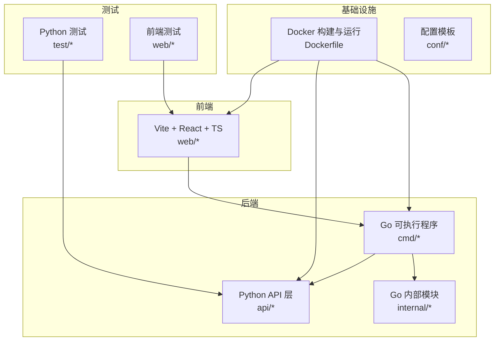
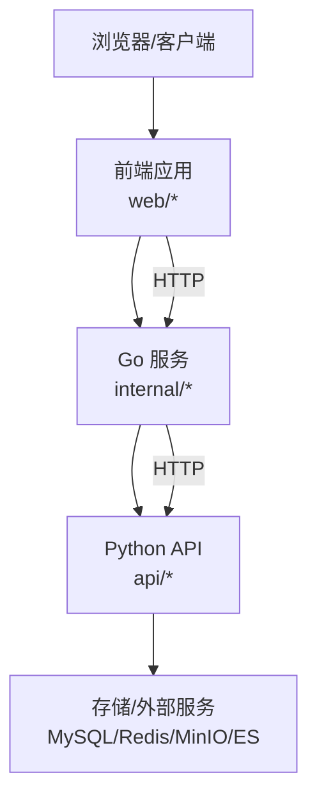
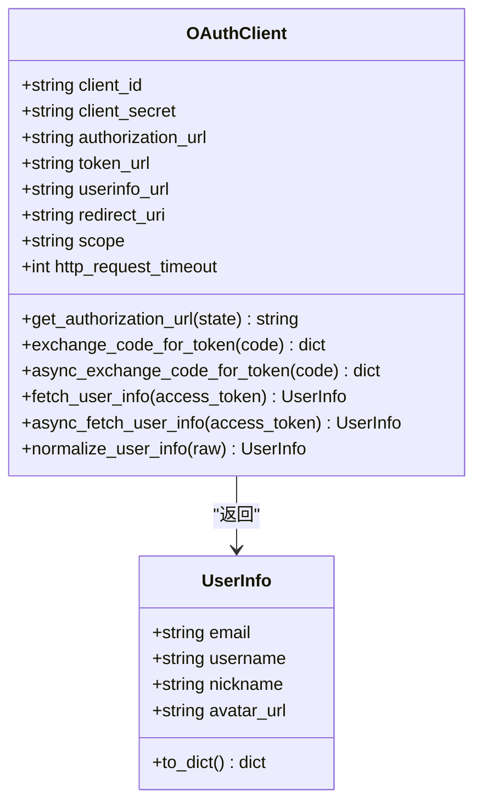
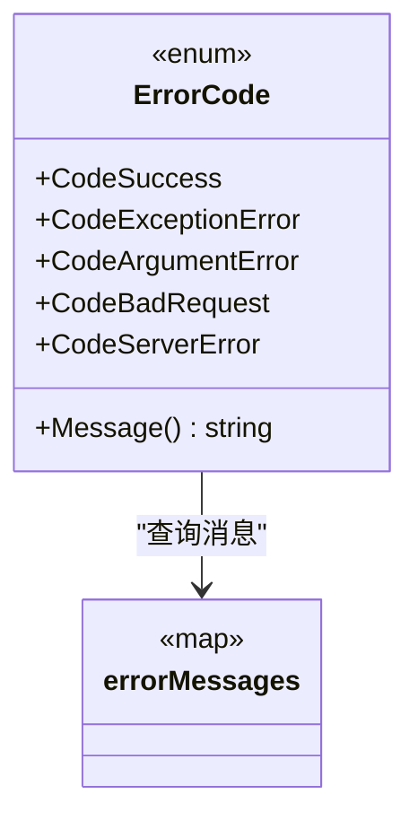
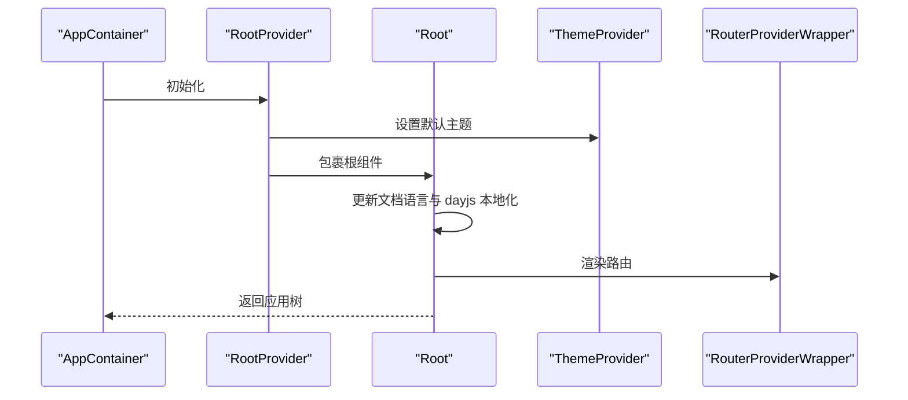
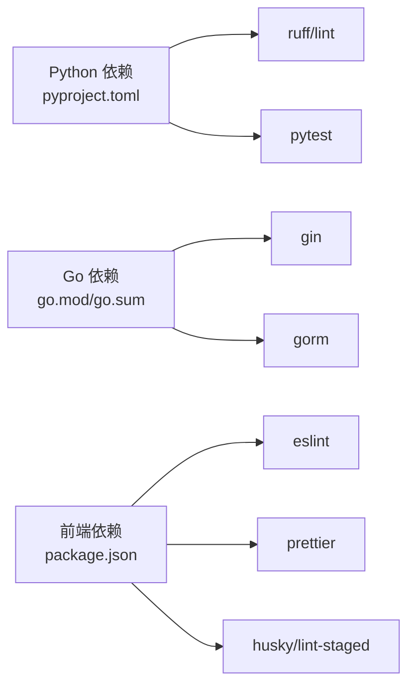

# 代码规范

<cite>
**本文引用的文件**
- [README.md](file://README.md)
- [Dockerfile](file://Dockerfile)
- [.pre-commit-config.yaml](file://.pre-commit-config.yaml)
- [pyproject.toml](file://pyproject.toml)
- [go.mod](file://go.mod)
- [go.sum](file://go.sum)
- [web/.eslintrc.cjs](file://web/.eslintrc.cjs)
- [web/.prettierrc](file://web/.prettierrc)
- [web/package.json](file://web/package.json)
- [web/tsconfig.json](file://web/tsconfig.json)
- [internal/common/error_code.go](file://internal/common/error_code.go)
- [api/apps/auth/oauth.py](file://api/apps/auth/oauth.py)
- [web/src/app.tsx](file://web/src/app.tsx)
- [.agents/rules/named.md](file://.agents/rules/named.md)
</cite>

## 目录
1. [引言](#引言)
2. [项目结构](#项目结构)
3. [核心组件](#核心组件)
4. [架构总览](#架构总览)
5. [详细组件分析](#详细组件分析)
6. [依赖分析](#依赖分析)
7. [性能考虑](#性能考虑)
8. [故障排查指南](#故障排查指南)
9. [结论](#结论)
10. [附录](#附录)

## 引言
本文件为 RAGFlow 项目的统一代码规范文档，覆盖 Python、Go、TypeScript/JavaScript 三大语言的编码标准与工程化实践，旨在帮助开发者编写一致、可读、可维护的高质量代码。内容基于仓库现有配置与代码示例进行提炼总结，并辅以可视化图示帮助理解。

## 项目结构
RAGFlow 采用多语言混合架构：后端服务由 Go 主程序与 Python 后端共同组成；前端使用 TypeScript/Vite；同时通过 Docker 进行统一打包与发布。关键目录与职责概览如下：
- cmd：Go 可执行程序入口（server_main.go、admin_server.go 等）
- internal：Go 内部模块（handler、service、model、router 等）
- api：Python REST API 应用（apps、db、utils 等）
- web：前端应用（Vite + React + TypeScript）
- common：通用工具与数据源适配层
- conf：系统配置模板
- docker：容器化与编排
- test：测试套件（pytest、playwright、jest）

图表来源
- [Dockerfile:178-220](file://Dockerfile#L178-L220)
- [README.md:140-144](file://README.md#L140-L144)

章节来源
- [README.md:140-144](file://README.md#L140-L144)
- [Dockerfile:178-220](file://Dockerfile#L178-L220)

## 核心组件
本节聚焦三类语言的关键规范与最佳实践。

### Python 编码规范
- 风格与格式
  - 使用 ruff 进行静态检查与格式化，行宽限制为 200，忽略部分规则，启用异步相关规则集。
  - 通过 pre-commit 在提交前自动执行检查与修复。
- 命名约定
  - 模块与包：小写、无下划线；避免通用词如 util、common。
  - 函数/方法：驼峰或下划线均可，但需保持团队一致性；布尔返回建议以 is_/has_/can_ 开头。
  - 常量：全大写 + 下划线分隔。
  - 错误变量：以 Err 前缀命名。
- 类与接口
  - 类名使用驼峰；字段与方法遵循同组命名风格。
  - 文档字符串：函数/类应提供清晰的 docstring，参数与返回值明确。
- 异常处理
  - 明确区分业务异常与系统异常；对外抛出时携带上下文信息。
- 并发与异步
  - 优先使用 asyncio；网络请求统一通过封装的 http 客户端。
- 注释与文档
  - 关键逻辑添加注释；公共接口与变更点补充文档字符串。

章节来源
- [.pre-commit-config.yaml:14-20](file://.pre-commit-config.yaml#L14-L20)
- [pyproject.toml:196-202](file://pyproject.toml#L196-L202)
- [api/apps/auth/oauth.py:32-152](file://api/apps/auth/oauth.py#L32-L152)

### Go 编码规范
- 包与目录
  - 包名全部小写、无下划线；目录短而有意义；避免通用名。
- 文件与结构
  - 文件名小写 + 下划线；测试文件以 _test.go 结尾；平台特定文件以 _linux.go 等结尾。
  - 接口命名以 -er 结尾（Reader/Writer/Handler）；结构体与方法驼峰命名。
- 错误处理
  - 错误变量以 Err 前缀；错误消息统一管理并通过方法返回。
- 并发与协程
  - 使用 goroutine 与 channel；避免共享可变状态；必要时使用互斥锁。
- 项目结构
  - cmd/ 存放主程序入口；internal/ 放置内部模块；pkg/ 提供公开库；api/ 定义 API 规范。

章节来源
- [.agents/rules/named.md:1-192](file://.agents/rules/named.md#L1-L192)
- [internal/common/error_code.go:19-47](file://internal/common/error_code.go#L19-L47)

### 前端开发规范（TypeScript/React）
- 工具链
  - ESLint + TypeScript + React 插件；Prettier 统一格式；husky + lint-staged 自动化。
  - 路由与国际化：使用 React Router 与 i18n；主题切换通过 antd ConfigProvider。
- 命名与结构
  - 组件文件使用 kebab-case；hooks 以 use- 前缀；类型定义位于 interfaces/ 或组件内部。
- 类型安全
  - tsconfig 严格模式开启；禁止未使用局部变量与参数；switch 必须穷举。
- 样式与主题
  - 使用 TailwindCSS 与 antd 主题算法；支持明暗主题切换。
- 性能与可维护性
  - QueryClient 全局缓存策略；组件懒加载与按需引入；避免深层嵌套与重复渲染。

章节来源
- [web/.eslintrc.cjs:1-74](file://web/.eslintrc.cjs#L1-L74)
- [web/.prettierrc:1-13](file://web/.prettierrc#L1-L13)
- [web/package.json:7-21](file://web/package.json#L7-L21)
- [web/tsconfig.json:17-21](file://web/tsconfig.json#L17-L21)
- [web/src/app.tsx:79-140](file://web/src/app.tsx#L79-L140)

## 架构总览
RAGFlow 的整体架构由前端、后端 Go 服务与 Python API 三层构成，通过 Docker 统一打包与部署。Go 侧负责路由与业务编排，Python 侧提供 REST API 与数据处理能力，前端通过 Vite 构建并使用 React 生态。

图表来源
- [Dockerfile:178-220](file://Dockerfile#L178-L220)
- [internal/common/error_code.go:19-47](file://internal/common/error_code.go#L19-L47)
- [api/apps/auth/oauth.py:32-152](file://api/apps/auth/oauth.py#L32-L152)

## 详细组件分析

### Python OAuth 客户端组件
该组件实现 OAuth 授权流程，包括授权链接生成、授权码换取令牌、用户信息获取与标准化。关键点：
- 参数构造与 URL 编码；超时控制；异常包装为业务错误。
- 异步与同步版本并存，满足不同场景需求。
- 用户信息标准化，兼容多平台字段差异。

图表来源
- [api/apps/auth/oauth.py:21-152](file://api/apps/auth/oauth.py#L21-L152)

章节来源
- [api/apps/auth/oauth.py:32-152](file://api/apps/auth/oauth.py#L32-L152)

### Go 错误码与消息管理
Go 侧通过统一的错误码枚举与消息映射，确保错误信息的一致性与可维护性。关键点：
- 错误码枚举定义；消息映射表；Message() 方法统一输出。
- 便于上层统一处理与国际化扩展。

图表来源
- [internal/common/error_code.go:19-83](file://internal/common/error_code.go#L19-L83)

章节来源
- [internal/common/error_code.go:19-83](file://internal/common/error_code.go#L19-L83)

### 前端应用根组件与主题国际化
前端应用通过根组件统一注入主题、国际化与全局状态，关键点：
- QueryClientProvider 全局缓存；ConfigProvider 主题与语言；Toaster 通知。
- 国际化切换与语言映射；响应式断点配置；开发环境调试工具按需加载。

图表来源
- [web/src/app.tsx:90-178](file://web/src/app.tsx#L90-L178)

章节来源
- [web/src/app.tsx:79-140](file://web/src/app.tsx#L79-L140)

## 依赖分析
- Python 依赖管理
  - 使用 pyproject.toml 与 ruff 配置；pytest 作为测试框架；覆盖率配置在 pyproject.toml 中。
- Go 依赖管理
  - go.mod 与 go.sum 管理第三方库；模块替换与版本锁定。
- 前端依赖管理
  - package.json 管理依赖与脚本；husky + lint-staged + prettier + eslint 实现提交前检查。

图表来源
- [pyproject.toml:196-202](file://pyproject.toml#L196-L202)
- [go.mod:5-25](file://go.mod#L5-L25)
- [web/package.json:7-21](file://web/package.json#L7-L21)

章节来源
- [pyproject.toml:196-202](file://pyproject.toml#L196-L202)
- [go.mod:5-25](file://go.mod#L5-L25)
- [web/package.json:7-21](file://web/package.json#L7-L21)

## 性能考虑
- Python
  - 使用 ruff 提升检查效率；pytest 并行与缓存优化；合理设置超时与重试。
- Go
  - 控制 goroutine 数量与通道缓冲；避免频繁 GC；使用连接池与复用。
- 前端
  - 组件懒加载与按需引入；QueryClient 缓存策略；TailwindCSS 与 CSS-in-JS 权衡。

## 故障排查指南
- 提交前检查失败
  - 确认已安装并启用 pre-commit；检查 ruff 与格式化规则是否符合配置。
- Python 测试异常
  - 查看 pytest 输出与覆盖率报告；关注警告转错误的配置。
- Go 构建问题
  - 检查 go.mod/go.sum 版本匹配；模块替换是否正确。
- 前端构建/格式化异常
  - 确认 Node 版本与依赖安装；husky 钩子是否生效；ESLint/Prettier 规则冲突。

章节来源
- [.pre-commit-config.yaml:1-20](file://.pre-commit-config.yaml#L1-L20)
- [pyproject.toml:204-238](file://pyproject.toml#L204-L238)
- [web/package.json:7-21](file://web/package.json#L7-L21)

## 结论
通过统一的工具链与编码规范，RAGFlow 在多语言协作中实现了高一致性与可维护性。建议在日常开发中：
- 严格遵守各语言的命名与结构规范；
- 使用 pre-commit、ESLint、ruff 等工具自动化质量把关；
- 在变更关键路径时补充文档与注释；
- 持续优化测试覆盖与性能指标。

## 附录
- 代码格式化与提交钩子
  - Python：ruff + ruff-format + pre-commit
  - Go：gofmt + vet（建议配合 pre-commit）
  - 前端：ESLint + Prettier + husky + lint-staged
- 建议的注释与文档字符串标准
  - 函数/类：说明用途、参数、返回值、异常
  - 复杂逻辑：补充背景与边界条件
  - 对外接口：明确调用方注意事项与兼容性