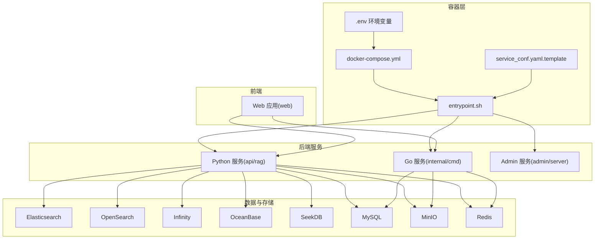
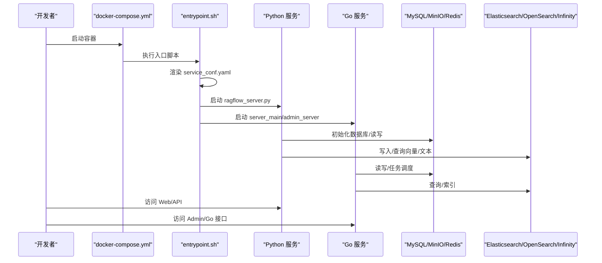
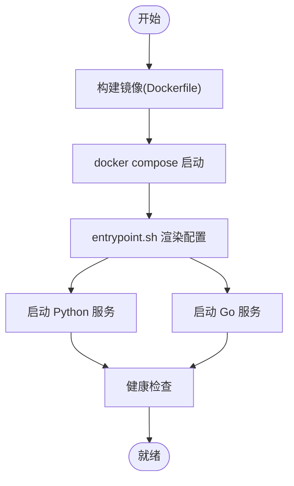
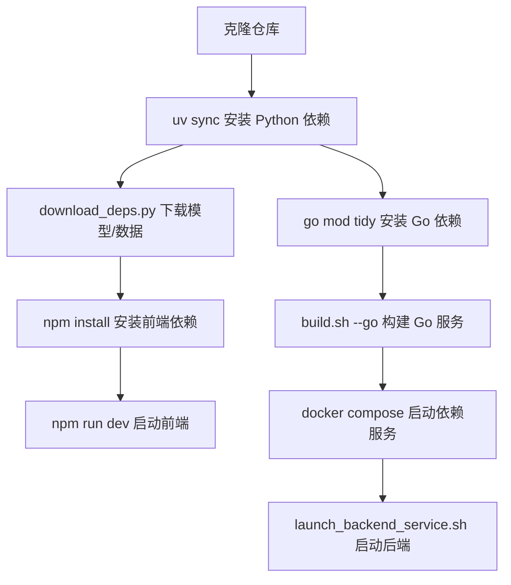
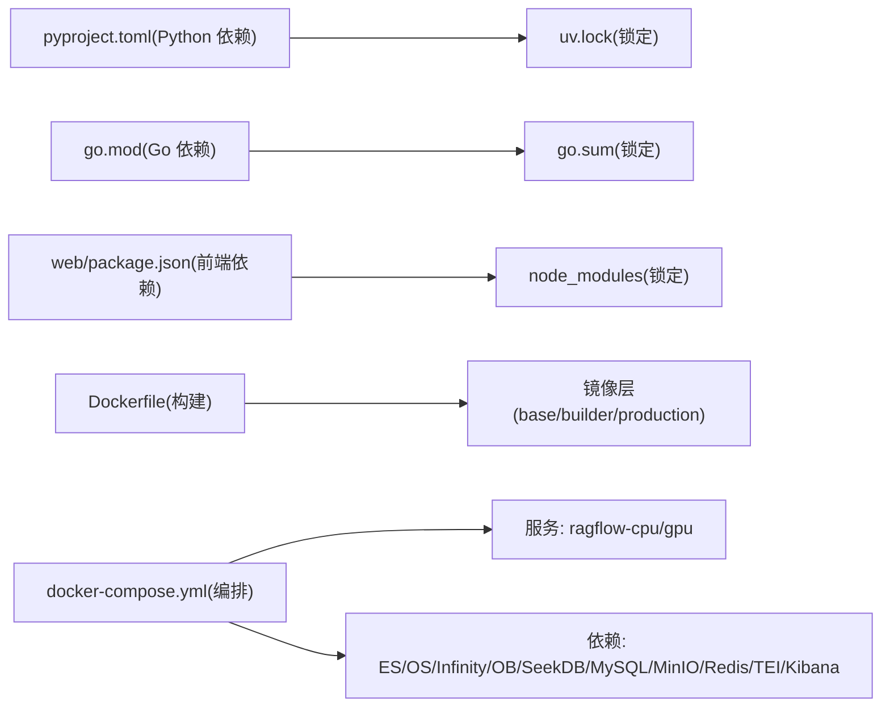

# 开发环境搭建

<cite>
**本文档引用的文件**
- [README.md](file://README.md)
- [docker/docker-compose.yml](file://docker/docker-compose.yml)
- [docker/docker-compose-base.yml](file://docker/docker-compose-base.yml)
- [docker/.env](file://docker/.env)
- [docker/service_conf.yaml.template](file://docker/service_conf.yaml.template)
- [docker/entrypoint.sh](file://docker/entrypoint.sh)
- [docker/launch_backend_service.sh](file://docker/launch_backend_service.sh)
- [Dockerfile](file://Dockerfile)
- [pyproject.toml](file://pyproject.toml)
- [go.mod](file://go.mod)
- [web/package.json](file://web/package.json)
- [sdk/python/pyproject.toml](file://sdk/python/pyproject.toml)
- [download_deps.py](file://download_deps.py)
- [build.sh](file://build.sh)
- [agent/sandbox/docker-compose.yml](file://agent/sandbox/docker-compose.yml)
</cite>

## 目录
1. [简介](#简介)
2. [项目结构](#项目结构)
3. [核心组件](#核心组件)
4. [架构总览](#架构总览)
5. [详细组件分析](#详细组件分析)
6. [依赖关系分析](#依赖关系分析)
7. [性能考虑](#性能考虑)
8. [故障排除指南](#故障排除指南)
9. [结论](#结论)
10. [附录](#附录)

## 简介
本指南面向希望在本地进行 RAGFlow 开发与调试的工程师，覆盖以下内容：
- 容器化开发环境：镜像构建、容器编排、服务依赖管理
- 源码编译部署：Python 虚拟环境、Go 模块、前端依赖安装
- 依赖管理：包管理器使用、版本控制、依赖冲突解决
- 开发工具配置：IDE 设置、调试配置、代码格式化工具
- 环境变量配置：数据库连接、API 密钥、第三方服务
- 常见问题排查：端口冲突、权限问题、版本不兼容

## 项目结构
RAGFlow 采用多语言混合架构（Go、Python、前端），并提供 Docker 与源码两种开发方式。关键目录与职责概览：
- docker：容器化相关配置、Compose 编排、入口脚本、模板配置
- api：后端 Python 服务（Flask/Quart）
- internal：Go 后端服务与内部模块
- web：前端应用（Vite + React）
- agent：智能体与沙箱执行器
- deepdoc/rag：文档解析与检索增强核心
- sdk/python：Python SDK
- common：通用工具与连接器
- conf：系统配置模板
- bin：Go 二进制产物

**图表来源**
- [docker/docker-compose.yml:1-135](file://docker/docker-compose.yml#L1-L135)
- [docker/docker-compose-base.yml:1-326](file://docker/docker-compose-base.yml#L1-L326)
- [docker/.env:1-292](file://docker/.env#L1-L292)
- [docker/service_conf.yaml.template:1-172](file://docker/service_conf.yaml.template#L1-L172)
- [docker/entrypoint.sh:1-340](file://docker/entrypoint.sh#L1-L340)

**章节来源**
- [README.md:148-254](file://README.md#L148-L254)
- [docker/docker-compose.yml:1-135](file://docker/docker-compose.yml#L1-L135)
- [docker/docker-compose-base.yml:1-326](file://docker/docker-compose-base.yml#L1-L326)

## 核心组件
- 容器编排与服务发现：通过 docker-compose.yml 组合后端服务与依赖，.env 提供统一环境变量，service_conf.yaml.template 作为运行时配置模板
- 入口脚本：entrypoint.sh 负责渲染配置、启动 Nginx 与后端服务、按需启用 Admin/MCP 服务、初始化数据库表、等待依赖健康检查
- 后端服务：
  - Python 服务：api/ragflow_server.py、admin/server/admin_server.py
  - Go 服务：bin/server_main、bin/admin_server
- 数据与存储：Elasticsearch、OpenSearch、Infinity、OceanBase、SeekDB、MySQL、MinIO、Redis
- 前端：web 目录下的 Vite 应用，提供可视化界面与 API 交互

**章节来源**
- [docker/entrypoint.sh:150-340](file://docker/entrypoint.sh#L150-L340)
- [docker/docker-compose.yml:1-135](file://docker/docker-compose.yml#L1-L135)
- [docker/docker-compose-base.yml:1-326](file://docker/docker-compose-base.yml#L1-L326)
- [docker/service_conf.yaml.template:1-172](file://docker/service_conf.yaml.template#L1-L172)

## 架构总览
下图展示容器化开发环境中的服务交互与数据流。

**图表来源**
- [docker/entrypoint.sh:266-319](file://docker/entrypoint.sh#L266-L319)
- [docker/docker-compose.yml:4-49](file://docker/docker-compose.yml#L4-L49)
- [docker/docker-compose-base.yml:176-242](file://docker/docker-compose-base.yml#L176-L242)

## 详细组件分析

### 容器化开发环境
- 镜像构建
  - 使用 Dockerfile 多阶段构建：基础镜像安装系统依赖、Node.js、ODBC 驱动、Chrome/Driver；builder 阶段安装 Python 依赖与前端资源；production 阶段复制运行时产物
  - 支持中国镜像加速与代理配置，uv.lock 固定依赖版本
- 容器编排
  - docker-compose.yml 定义 ragflow-cpu/gpu 服务，映射端口、挂载日志与配置模板、加载 .env
  - docker-compose-base.yml 定义依赖服务（ES/OS/Infinity/OB/SeekDB/MySQL/MinIO/Redis/TEI/Kibana），通过 profiles 控制启用
- 服务依赖管理
  - 通过 .env 统一管理主机名、端口、密码、日志级别、嵌入模型等
  - service_conf.yaml.template 将环境变量注入到运行时配置，支持多种文档引擎切换

**图表来源**
- [Dockerfile:1-220](file://Dockerfile#L1-L220)
- [docker/docker-compose.yml:1-135](file://docker/docker-compose.yml#L1-L135)
- [docker/entrypoint.sh:150-197](file://docker/entrypoint.sh#L150-L197)

**章节来源**
- [Dockerfile:1-220](file://Dockerfile#L1-L220)
- [docker/docker-compose.yml:1-135](file://docker/docker-compose.yml#L1-L135)
- [docker/docker-compose-base.yml:1-326](file://docker/docker-compose-base.yml#L1-L326)
- [docker/.env:1-292](file://docker/.env#L1-L292)
- [docker/service_conf.yaml.template:1-172](file://docker/service_conf.yaml.template#L1-L172)

### 源码编译部署
- Python 环境
  - 使用 uv 进行依赖同步与安装，pyproject.toml 指定 Python 版本与依赖范围
  - download_deps.py 下载模型、NLP 数据与第三方二进制，支持镜像加速
- Go 模块
  - go.mod 管理 Go 依赖，build.sh 提供 C++ 库与 Go 服务的构建、清理、运行流程
- 前端依赖
  - web/package.json 管理前端依赖与脚本，Vite 构建生产资源

**图表来源**
- [pyproject.toml:1-289](file://pyproject.toml#L1-L289)
- [download_deps.py:1-82](file://download_deps.py#L1-L82)
- [web/package.json:1-197](file://web/package.json#L1-L197)
- [build.sh:1-215](file://build.sh#L1-L215)
- [docker/docker-compose-base.yml:1-326](file://docker/docker-compose-base.yml#L1-L326)
- [docker/launch_backend_service.sh:1-130](file://docker/launch_backend_service.sh#L1-L130)

**章节来源**
- [pyproject.toml:1-289](file://pyproject.toml#L1-L289)
- [download_deps.py:1-82](file://download_deps.py#L1-L82)
- [web/package.json:1-197](file://web/package.json#L1-L197)
- [build.sh:1-215](file://build.sh#L1-L215)
- [docker/launch_backend_service.sh:1-130](file://docker/launch_backend_service.sh#L1-L130)

### 依赖管理
- 包管理器
  - Python：uv（同步、锁定、安装），pyproject.toml 定义主依赖与测试分组
  - Go：go mod（依赖解析与版本固定）
  - 前端：npm（package.json 管理依赖与脚本）
- 版本控制
  - Dockerfile 中 uv.lock 固定 Python 依赖版本
  - go.mod 固定 Go 依赖版本
  - 前端依赖通过 package-lock 或 yarn.lock（由 npm 管理）
- 依赖冲突解决
  - 优先使用锁定文件确保一致性
  - 镜像加速与代理配置可缓解网络问题
  - 对于系统库（如 libpcre2、jemalloc）提供安装建议

**章节来源**
- [Dockerfile:150-163](file://Dockerfile#L150-L163)
- [pyproject.toml:181-183](file://pyproject.toml#L181-L183)
- [go.mod:1-110](file://go.mod#L1-L110)
- [web/package.json:1-197](file://web/package.json#L1-L197)

### 开发工具配置
- IDE 设置
  - Python：推荐 VS Code + Python/uv 插件，启用 lint（ruff）、测试（pytest）
  - Go：Go 插件、vet、gofumpt
  - 前端：TypeScript + ESLint + Prettier
- 调试配置
  - Python：pytest 配置与标记，测试覆盖率报告
  - Go：dlv 调试器，build.sh 支持本地运行
  - 前端：Vite dev server，热更新
- 代码格式化与校验
  - ruff（Python）、ESLint（前端）、pre-commit 钩子

**章节来源**
- [pyproject.toml:196-289](file://pyproject.toml#L196-L289)
- [web/package.json:17-21](file://web/package.json#L17-L21)
- [build.sh:124-142](file://build.sh#L124-L142)

### 环境变量配置
- 关键变量（摘录）
  - 文档引擎选择：DOC_ENGINE（elasticsearch/infinity/oceanbase/opensearch/seekdb）
  - 设备类型：DEVICE（cpu/gpu）
  - 服务端口：SVR_WEB_HTTP_PORT、SVR_HTTP_PORT、ADMIN_SVR_HTTP_PORT、SVR_MCP_PORT、GO_HTTP_PORT、GO_ADMIN_PORT
  - 数据库：MYSQL_HOST、MYSQL_PORT、MYSQL_DBNAME、MYSQL_PASSWORD
  - 存储：MINIO_HOST、MINIO_PORT、MINIO_USER、MINIO_PASSWORD
  - 缓存：REDIS_HOST、REDIS_PORT、REDIS_PASSWORD
  - 嵌入服务：TEI_IMAGE_CPU/GPU、TEI_MODEL、TEI_PORT
  - 日志与行为：LOG_LEVELS、REGISTER_ENABLED、THREAD_POOL_MAX_WORKERS
- 配置模板
  - service_conf.yaml.template 将上述变量映射到后端配置，entrypoint.sh 在容器启动时渲染为最终配置

**章节来源**
- [docker/.env:1-292](file://docker/.env#L1-L292)
- [docker/service_conf.yaml.template:1-172](file://docker/service_conf.yaml.template#L1-L172)
- [docker/entrypoint.sh:150-173](file://docker/entrypoint.sh#L150-L173)

### 开发工具配置（续）
- Python 工具链
  - uv：安装、同步、锁定
  - ruff：lint 规则与忽略项
  - pytest：测试收集、标记、覆盖率
- 前端工具链
  - Vite：开发服务器、构建
  - ESLint/Prettier：代码质量与格式化
  - Husky/lint-staged：提交前检查
- Go 工具链
  - go build：生成二进制
  - build.sh：封装构建、清理、运行流程

**章节来源**
- [pyproject.toml:196-289](file://pyproject.toml#L196-L289)
- [web/package.json:7-21](file://web/package.json#L7-L21)
- [build.sh:1-215](file://build.sh#L1-L215)

## 依赖关系分析

**图表来源**
- [pyproject.toml:1-289](file://pyproject.toml#L1-L289)
- [go.mod:1-110](file://go.mod#L1-L110)
- [web/package.json:1-197](file://web/package.json#L1-L197)
- [Dockerfile:1-220](file://Dockerfile#L1-L220)
- [docker/docker-compose.yml:1-135](file://docker/docker-compose.yml#L1-L135)
- [docker/docker-compose-base.yml:1-326](file://docker/docker-compose-base.yml#L1-L326)

**章节来源**
- [pyproject.toml:1-289](file://pyproject.toml#L1-L289)
- [go.mod:1-110](file://go.mod#L1-L110)
- [web/package.json:1-197](file://web/package.json#L1-L197)
- [Dockerfile:1-220](file://Dockerfile#L1-L220)
- [docker/docker-compose.yml:1-135](file://docker/docker-compose.yml#L1-L135)
- [docker/docker-compose-base.yml:1-326](file://docker/docker-compose-base.yml#L1-L326)

## 性能考虑
- 内存与线程
  - 通过 MEM_LIMIT 控制容器内存上限，避免 OOM
  - THREAD_POOL_MAX_WORKERS 调整线程池大小，平衡吞吐与资源占用
- 深度学习推理
  - DEVICE=cpu/gpu 切换推理设备；GPU 模式需 nvidia 运行时
  - TEI 模型选择影响显存占用，合理选择模型大小
- 数据库与缓存
  - MySQL 最大连接数、最大包大小；Redis 内存策略与密码保护
- 前端构建
  - NODE_OPTIONS="--max-old-space-size=4096" 避免大项目构建内存不足

[本节为通用指导，无需特定文件引用]

## 故障排除指南
- 端口冲突
  - 修改 docker/.env 中服务端口映射（如 SVR_HTTP_PORT、MINIO_PORT、REDIS_PORT）
  - 确认宿主机未占用相同端口
- 权限问题
  - Docker 卷权限：确保挂载目录对容器用户可读写
  - MinIO/MySQL/Redis 默认密码需修改为强口令
- 版本不兼容
  - Python：确保使用 pyproject.toml 指定的 Python 版本
  - Go：go.mod 固定版本，必要时清理 go.sum 并重新 go mod tidy
  - 前端：node 版本满足 package.json engines 字段
- 网络与健康检查
  - entrypoint.sh 会等待依赖健康检查，若超时检查失败，查看对应服务日志
- 代理与镜像
  - Dockerfile 与 .env 支持镜像加速与代理配置，下载失败时检查网络与代理设置
- 沙箱执行器
  - 启用沙箱需在 .env 中开启并添加 hosts 映射，拉取基础镜像后再启动

**章节来源**
- [docker/.env:1-292](file://docker/.env#L1-L292)
- [docker/entrypoint.sh:242-258](file://docker/entrypoint.sh#L242-L258)
- [docker/docker-compose-base.yml:148-174](file://docker/docker-compose-base.yml#L148-L174)
- [Dockerfile:78-97](file://Dockerfile#L78-L97)

## 结论
通过容器化与源码两种方式，RAGFlow 提供了灵活且一致的本地开发体验。建议：
- 新手优先使用容器化方式快速启动
- 需要深度调试或二次开发时，采用源码方式并结合 uv/go/npm 工具链
- 严格遵循环境变量与配置模板，确保各组件间的一致性
- 建立完善的依赖锁定与镜像加速策略，提高开发效率与稳定性

[本节为总结，无需特定文件引用]

## 附录

### 快速启动指南（容器化）
- 准备工作
  - 安装 Docker 与 Docker Compose
  - 配置 .env（端口、密码、文档引擎）
- 启动步骤
  - docker compose -f docker/docker-compose.yml up -d
  - 查看日志确认服务就绪
  - 在浏览器访问 http://IP（默认 80 端口）

**章节来源**
- [README.md:158-254](file://README.md#L158-L254)
- [docker/docker-compose.yml:1-135](file://docker/docker-compose.yml#L1-L135)

### 快速启动指南（源码）
- 准备工作
  - 安装 uv、pre-commit
  - 安装 Python 依赖：uv sync --python 3.12
  - 下载依赖：uv run download_deps.py
  - 启动依赖服务：docker compose -f docker/docker-compose-base.yml up -d
  - 配置 hosts 解析
- 启动后端
  - source .venv/bin/activate
  - export PYTHONPATH=$(pwd)
  - bash docker/launch_backend_service.sh
- 启动前端
  - cd web
  - npm install
  - npm run dev

**章节来源**
- [README.md:318-389](file://README.md#L318-L389)
- [docker/launch_backend_service.sh:1-130](file://docker/launch_backend_service.sh#L1-L130)

### Go 服务构建与运行
- 构建 C++ 库与 Go 服务：./build.sh --all
- 运行：./build.sh --run
- 清理：./build.sh --clean

**章节来源**
- [build.sh:1-215](file://build.sh#L1-L215)

### Python SDK 开发
- 依赖与测试：sdk/python/pyproject.toml
- 测试命令：pytest（支持标记与覆盖率）

**章节来源**
- [sdk/python/pyproject.toml:1-32](file://sdk/python/pyproject.toml#L1-L32)