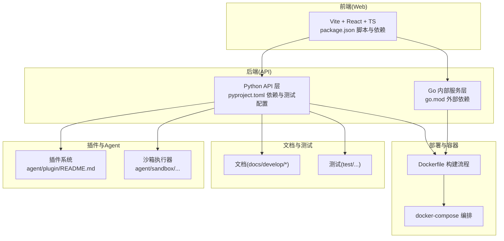
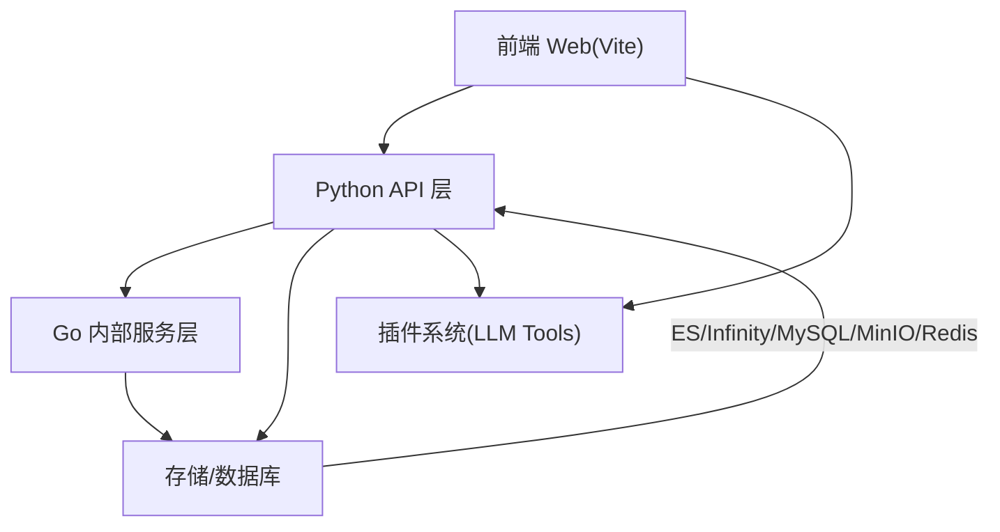
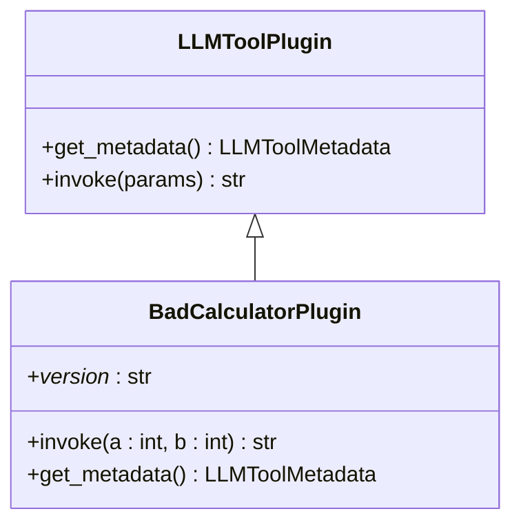
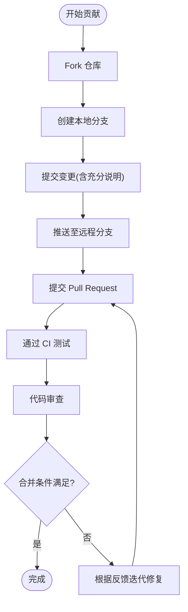
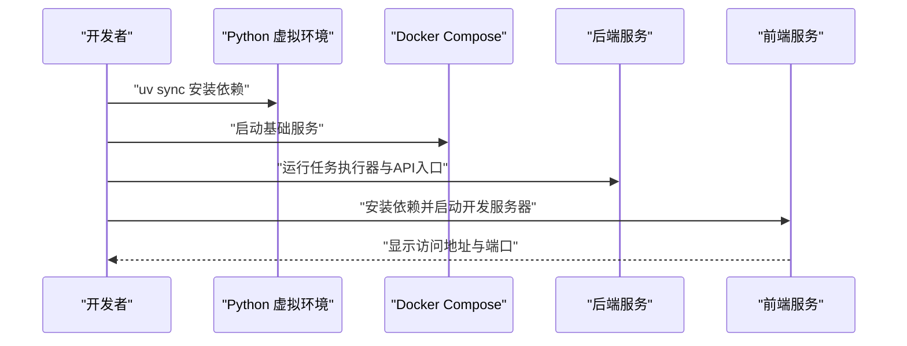
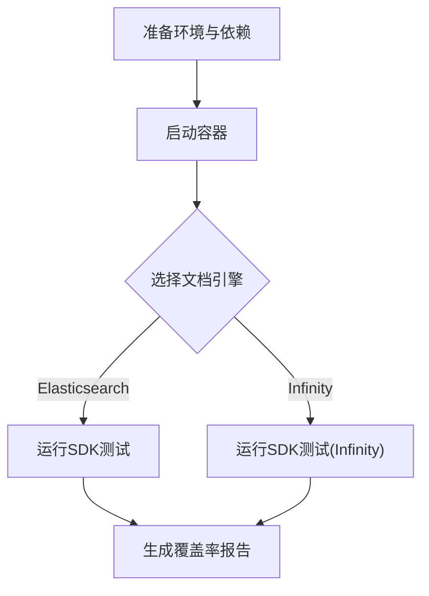
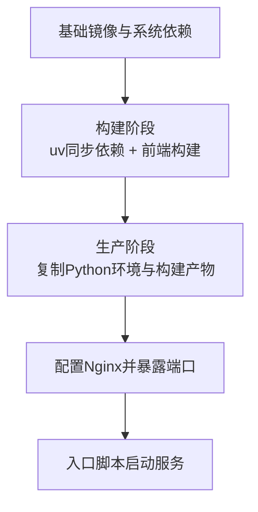
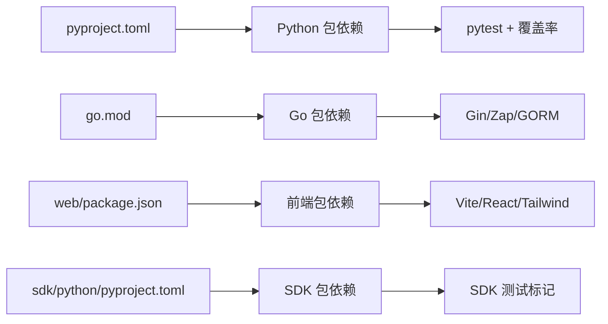

# 开发者指南

<cite>
**本文引用的文件**
- [pull_request_template.md](file://.github/pull_request_template.md)
- [contributing.md](file://docs/develop/contributing.md)
- [build_docker_image.mdx](file://docs/develop/build_docker_image.mdx)
- [launch_ragflow_from_source.md](file://docs/develop/launch_ragflow_from_source.md)
- [.pre-commit-config.yaml](file://.pre-commit-config.yaml)
- [pyproject.toml](file://pyproject.toml)
- [go.mod](file://go.mod)
- [.eslintrc.cjs](file://web/.eslintrc.cjs)
- [.prettierrc](file://web/.prettierrc)
- [agent/plugin/README.md](file://agent/plugin/README.md)
- [test/README.md](file://test/README.md)
- [sdk/python/pyproject.toml](file://sdk/python/pyproject.toml)
- [web/package.json](file://web/package.json)
- [Dockerfile](file://Dockerfile)
</cite>

## 目录
1. [简介](#简介)
2. [项目结构](#项目结构)
3. [核心组件](#核心组件)
4. [架构总览](#架构总览)
5. [详细组件分析](#详细组件分析)
6. [依赖分析](#依赖分析)
7. [性能考虑](#性能考虑)
8. [故障排查指南](#故障排查指南)
9. [结论](#结论)
10. [附录](#附录)

## 简介
本指南面向RAGFlow的开发者与贡献者，旨在帮助新成员快速融入团队并高效开展开发工作。内容覆盖代码规范、贡献流程、调试技巧、扩展开发、开发环境搭建、依赖管理与构建流程等，帮助你在Python、Go、前端等多语言环境下高质量地参与RAGFlow的迭代与扩展。

## 项目结构
RAGFlow采用多模块分层组织方式：
- 后端服务：Go后端（内部服务、路由、DAO、服务层）、Python后端（API、应用服务、数据处理、工具集）
- 前端：基于Vite + React + TypeScript的Web界面
- 插件与Agent：插件系统、沙箱执行器、工具集合
- 文档与测试：官方文档、测试用例与基准测试
- 部署与容器化：Docker镜像构建、Compose编排、Nginx配置

图表来源
- [Dockerfile:1-220](file://Dockerfile#L1-L220)
- [pyproject.toml:1-289](file://pyproject.toml#L1-L289)
- [go.mod:1-110](file://go.mod#L1-L110)
- [web/package.json:1-197](file://web/package.json#L1-L197)
- [agent/plugin/README.md:1-98](file://agent/plugin/README.md#L1-L98)
- [test/README.md:1-98](file://test/README.md#L1-L98)

章节来源
- [Dockerfile:1-220](file://Dockerfile#L1-L220)
- [pyproject.toml:1-289](file://pyproject.toml#L1-L289)
- [go.mod:1-110](file://go.mod#L1-L110)
- [web/package.json:1-197](file://web/package.json#L1-L197)
- [agent/plugin/README.md:1-98](file://agent/plugin/README.md#L1-L98)
- [test/README.md:1-98](file://test/README.md#L1-L98)

## 核心组件
- Python后端与API：提供REST接口、业务服务、数据模型与工具集，统一通过uv进行依赖管理与测试运行。
- Go内部服务：负责路由、DAO、缓存、存储、服务编排等，使用Gin、Zap、GORM等生态。
- 前端Web：Vite工程，React + TypeScript，Ant Design Pro组件体系，支持Storybook与Jest测试。
- 插件系统：支持LLM工具插件加载与元数据描述，便于扩展工具能力。
- 测试与基准：涵盖SDK/API/HTTP测试、覆盖率统计、Playwright端到端测试。
- 容器化与部署：Docker多阶段构建，Nginx静态资源服务，Compose一键拉起。

章节来源
- [pyproject.toml:1-289](file://pyproject.toml#L1-L289)
- [go.mod:1-110](file://go.mod#L1-L110)
- [web/package.json:1-197](file://web/package.json#L1-L197)
- [agent/plugin/README.md:1-98](file://agent/plugin/README.md#L1-L98)
- [test/README.md:1-98](file://test/README.md#L1-L98)
- [Dockerfile:1-220](file://Dockerfile#L1-L220)

## 架构总览
RAGFlow整体采用前后端分离与多语言协同的架构：
- 前端通过Vite开发，生产构建产物由Nginx提供静态服务
- 后端API由Python提供REST接口，Go提供内部服务与高性能计算
- 数据与存储通过MySQL、Elasticsearch/OpenSearch、Infinity、MinIO、Redis等第三方组件
- 插件系统与沙箱用于安全可控的外部工具调用与代码执行

图表来源
- [web/package.json:1-197](file://web/package.json#L1-L197)
- [pyproject.toml:1-289](file://pyproject.toml#L1-L289)
- [go.mod:1-110](file://go.mod#L1-L110)
- [agent/plugin/README.md:1-98](file://agent/plugin/README.md#L1-L98)

## 详细组件分析

### 组件A：插件系统（LLM Tools）
插件系统允许在运行时动态加载工具类插件，当前主要支持LLM工具类型。插件需实现元数据描述与调用逻辑，并遵循版本字段约定。

图表来源
- [agent/plugin/README.md:1-98](file://agent/plugin/README.md#L1-L98)

章节来源
- [agent/plugin/README.md:1-98](file://agent/plugin/README.md#L1-L98)

### 组件B：贡献流程与PR模板
贡献流程强调清晰的分支、提交信息、PR描述与CI通过要求；PR模板用于规范问题描述与变更类型选择。

图表来源
- [contributing.md:30-59](file://docs/develop/contributing.md#L30-L59)
- [.github/pull_request_template.md:1-13](file://.github/pull_request_template.md#L1-L13)

章节来源
- [contributing.md:1-59](file://docs/develop/contributing.md#L1-L59)
- [.github/pull_request_template.md:1-13](file://.github/pull_request_template.md#L1-L13)

### 组件C：开发环境与启动流程
从源码启动服务需要准备Python虚拟环境、拉起第三方服务、配置Host与端口、启动后端与前端，并在浏览器访问。

图表来源
- [launch_ragflow_from_source.md:27-150](file://docs/develop/launch_ragflow_from_source.md#L27-L150)

章节来源
- [launch_ragflow_from_source.md:1-150](file://docs/develop/launch_ragflow_from_source.md#L1-L150)

### 组件D：测试与覆盖率
测试体系包含SDK/API/HTTP三层测试，支持按优先级标记与不同文档引擎切换；覆盖率配置可生成HTML报告。

图表来源
- [test/README.md:1-98](file://test/README.md#L1-L98)
- [pyproject.toml:240-289](file://pyproject.toml#L240-L289)

章节来源
- [test/README.md:1-98](file://test/README.md#L1-L98)
- [pyproject.toml:240-289](file://pyproject.toml#L240-L289)

### 组件E：容器化与构建
Dockerfile采用多阶段构建，先在builder阶段安装uv、同步Python依赖、构建前端，再复制到production阶段，最终由entrypoint启动服务并挂载Nginx配置。

图表来源
- [Dockerfile:1-220](file://Dockerfile#L1-L220)

章节来源
- [Dockerfile:1-220](file://Dockerfile#L1-L220)

## 依赖分析
- Python依赖：通过pyproject.toml集中声明，使用uv进行锁定与同步；测试依赖单独分组，支持pytest与覆盖率配置。
- Go依赖：通过go.mod声明，包含Gin、Zap、GORM、AWS SDK、Elasticsearch等常用库。
- 前端依赖：通过package.json声明，包含Ant Design Pro、React Query、TailwindCSS等；脚本涵盖开发、构建、测试、Storybook等。
- 插件与SDK：插件系统与Python SDK各自有独立的pyproject.toml与测试标记。

图表来源
- [pyproject.toml:1-289](file://pyproject.toml#L1-L289)
- [go.mod:1-110](file://go.mod#L1-L110)
- [web/package.json:1-197](file://web/package.json#L1-L197)
- [sdk/python/pyproject.toml:1-32](file://sdk/python/pyproject.toml#L1-L32)

章节来源
- [pyproject.toml:1-289](file://pyproject.toml#L1-L289)
- [go.mod:1-110](file://go.mod#L1-L110)
- [web/package.json:1-197](file://web/package.json#L1-L197)
- [sdk/python/pyproject.toml:1-32](file://sdk/python/pyproject.toml#L1-L32)

## 性能考虑
- 依赖安装与构建：使用uv与npm缓存，减少重复下载；Docker多阶段构建避免冗余层。
- 运行时内存：通过jemalloc预加载提升内存分配效率；Node最大堆设置适配大文件解析。
- 文档引擎切换：可通过环境变量切换Elasticsearch与Infinity，结合测试用例验证性能差异。
- 并发与异步：Python侧pytest异步支持与标记体系，Go侧并发库与连接池设计。

章节来源
- [launch_ragflow_from_source.md:92-108](file://docs/develop/launch_ragflow_from_source.md#L92-L108)
- [test/README.md:68-98](file://test/README.md#L68-L98)
- [pyproject.toml:204-238](file://pyproject.toml#L204-L238)
- [go.mod:1-110](file://go.mod#L1-L110)

## 故障排查指南
- 端口冲突与Host解析：确保docker/service_conf.yaml.template中端口与.env一致，并在/etc/hosts中映射服务名到127.0.0.1。
- HuggingFace访问受限：可通过HF_ENDPOINT设置镜像站点环境变量。
- 停止服务：前端使用pkill npm，后端使用pkill -f "docker/entrypoint.sh"。
- Docker镜像构建失败：检查NEED_MIRROR与索引镜像配置，确保uv.lock与索引一致性。
- 前端样式与命名：ESLint规则限制JSX引号、组件命名与文件夹命名，Prettier统一格式。

章节来源
- [launch_ragflow_from_source.md:67-150](file://docs/develop/launch_ragflow_from_source.md#L67-L150)
- [Dockerfile:78-97](file://Dockerfile#L78-L97)
- [web/.eslintrc.cjs:1-74](file://web/.eslintrc.cjs#L1-L74)
- [web/.prettierrc:1-13](file://web/.prettierrc#L1-L13)

## 结论
本指南提供了RAGFlow开发的全栈实践路径：从代码规范、贡献流程、调试技巧到扩展开发与构建部署。建议新贡献者先完成环境搭建与基础测试，再逐步参与插件与核心模块的开发，严格遵循PR流程与质量门禁，共同维护高质量的开源生态。

## 附录

### A. 代码规范与工具链
- Python
  - 使用Ruff进行代码格式化与静态检查，配置行宽与忽略规则见pyproject.toml。
  - 测试使用pytest，支持标记体系与覆盖率配置。
- Go
  - 使用go.mod管理依赖，遵循Go模块化与版本替换策略。
- 前端
  - ESLint规则覆盖TS/React/Hook/文件命名等；Prettier统一格式。
  - Husky与lint-staged在提交前自动格式化与校验。

章节来源
- [pyproject.toml:196-238](file://pyproject.toml#L196-L238)
- [go.mod:1-110](file://go.mod#L1-L110)
- [web/.eslintrc.cjs:1-74](file://web/.eslintrc.cjs#L1-L74)
- [web/.prettierrc:1-13](file://web/.prettierrc#L1-L13)
- [web/package.json:7-21](file://web/package.json#L7-L21)

### B. 贡献流程要点
- 分支与提交：保持单一主题，提交信息充分描述背景与动机。
- PR描述：标题简洁，必要时关联Issue；对破坏性变更与API变更提供设计细节。
- CI要求：确保所有CI测试通过后再合并。

章节来源
- [contributing.md:30-59](file://docs/develop/contributing.md#L30-L59)
- [.github/pull_request_template.md:1-13](file://.github/pull_request_template.md#L1-L13)

### C. 扩展开发指南
- 插件系统：实现LLMToolPlugin基类，提供get_metadata与invoke方法，遵循版本字段约定。
- 自定义组件：前端组件遵循ESLint/Prettier规则，Storybook辅助可视化与回归测试。
- API扩展：新增Python API与服务层，配套单元测试与集成测试。

章节来源
- [agent/plugin/README.md:1-98](file://agent/plugin/README.md#L1-L98)
- [web/.eslintrc.cjs:58-71](file://web/.eslintrc.cjs#L58-L71)
- [web/.prettierrc:1-13](file://web/.prettierrc#L1-L13)

### D. 开发环境与构建
- 源码启动：uv同步依赖、拉起第三方服务、配置Host与端口、启动后端与前端。
- Docker镜像：多阶段构建，复制前端产物与Python环境，Nginx提供静态服务。
- SDK与测试：安装SDK、配置环境变量、运行不同引擎下的测试套件。

章节来源
- [launch_ragflow_from_source.md:27-150](file://docs/develop/launch_ragflow_from_source.md#L27-L150)
- [build_docker_image.mdx:27-64](file://docs/develop/build_docker_image.mdx#L27-L64)
- [test/README.md:1-98](file://test/README.md#L1-L98)
- [Dockerfile:1-220](file://Dockerfile#L1-L220)