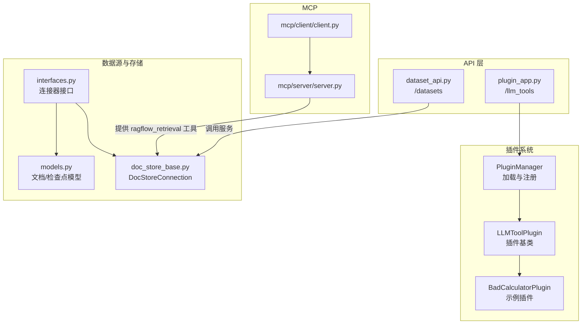
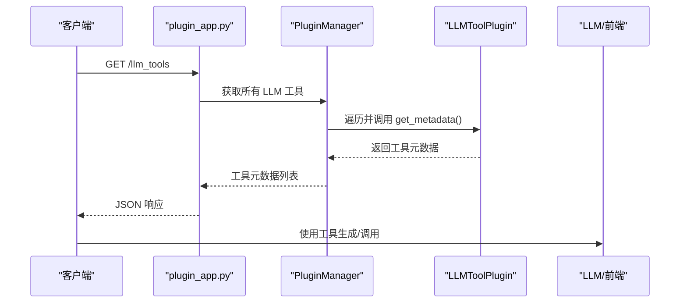
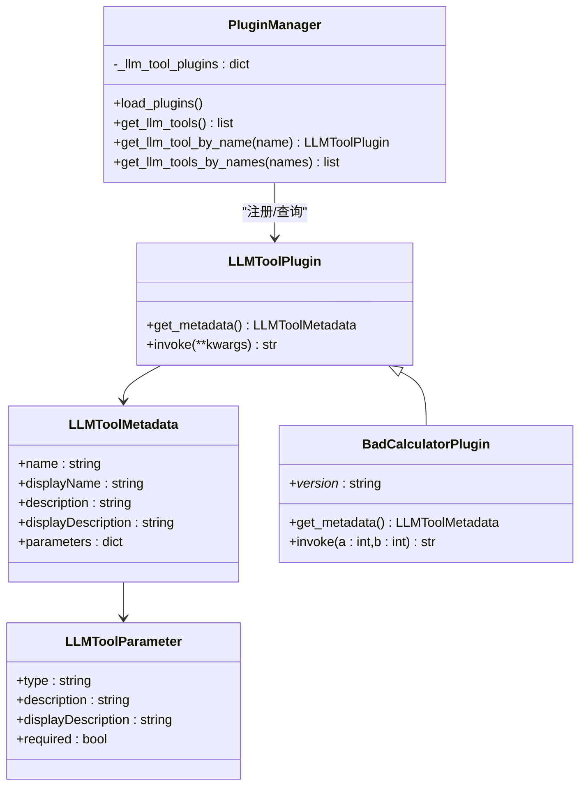
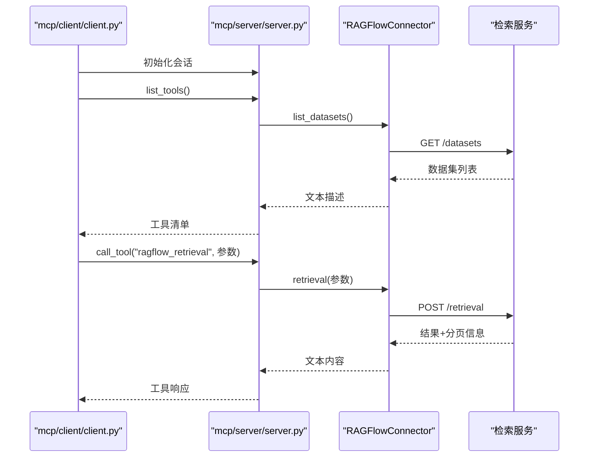
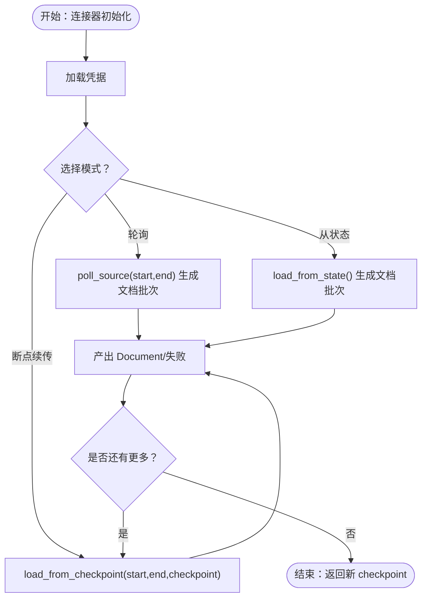
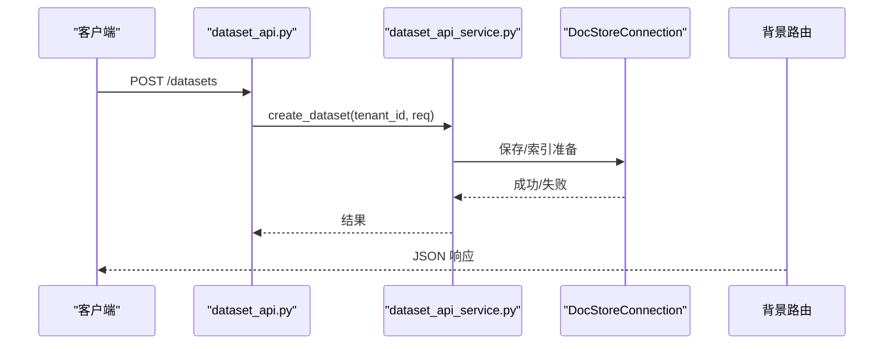
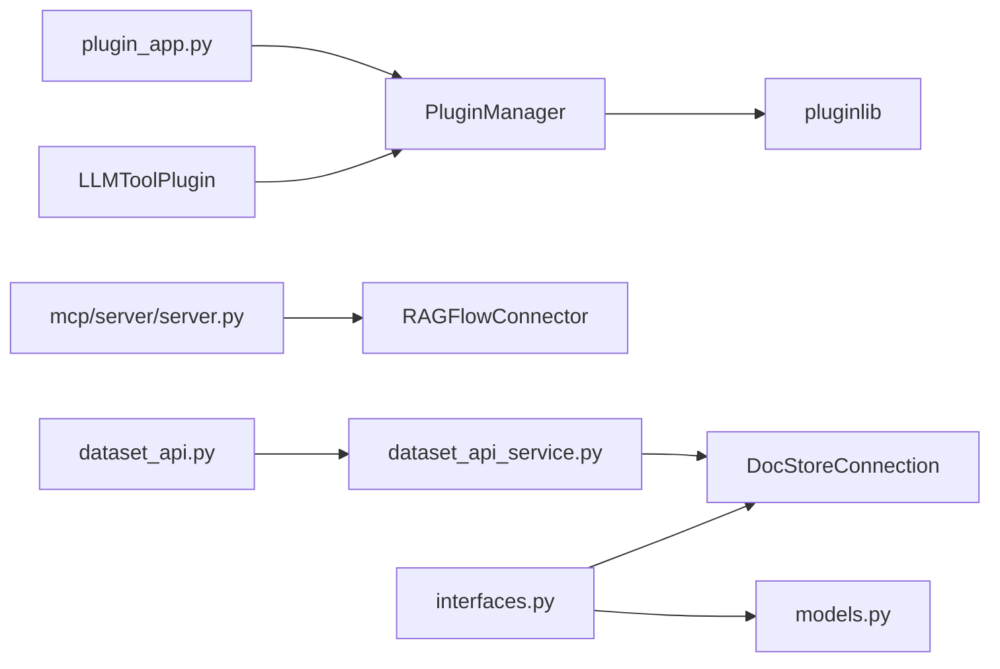

# 扩展开发

<cite>
**本文引用的文件**
- [agent/plugin/README.md](file://agent/plugin/README.md)
- [agent/plugin/__init__.py](file://agent/plugin/__init__.py)
- [agent/plugin/common.py](file://agent/plugin/common.py)
- [agent/plugin/plugin_manager.py](file://agent/plugin/plugin_manager.py)
- [agent/plugin/llm_tool_plugin.py](file://agent/plugin/llm_tool_plugin.py)
- [agent/plugin/embedded_plugins/llm_tools/bad_calculator.py](file://agent/plugin/embedded_plugins/llm_tools/bad_calculator.py)
- [api/apps/plugin_app.py](file://api/apps/plugin_app.py)
- [api/apps/mcp_server_app.py](file://api/apps/mcp_server_app.py)
- [mcp/server/server.py](file://mcp/server/server.py)
- [mcp/client/client.py](file://mcp/client/client.py)
- [api/apps/restful_apis/dataset_api.py](file://api/apps/restful_apis/dataset_api.py)
- [api/apps/services/dataset_api_service.py](file://api/apps/services/dataset_api_service.py)
- [common/data_source/interfaces.py](file://common/data_source/interfaces.py)
- [common/data_source/models.py](file://common/data_source/models.py)
- [common/doc_store/doc_store_base.py](file://common/doc_store/doc_store_base.py)
- [common/constants.py](file://common/constants.py)
</cite>

## 目录
1. [简介](#简介)
2. [项目结构](#项目结构)
3. [核心组件](#核心组件)
4. [架构总览](#架构总览)
5. [详细组件分析](#详细组件分析)
6. [依赖分析](#依赖分析)
7. [性能考虑](#性能考虑)
8. [故障排查指南](#故障排查指南)
9. [结论](#结论)
10. [附录](#附录)

## 简介
本指南面向希望在 RAGFlow 框架上进行扩展开发的工程师，覆盖插件系统、自定义组件（代理组件、数据源连接器、存储适配器）、API 扩展（RESTful、WebSocket、MCP 服务器）与测试实践。文档以代码为依据，提供架构图、流程图与最佳实践建议，帮助你安全地进行模块化设计、接口稳定与向后兼容。

## 项目结构
RAGFlow 的扩展能力主要分布在以下区域：
- 插件系统：位于 agent/plugin，支持 LLM 工具插件的动态加载与注册。
- MCP 服务器与客户端：位于 mcp/server 与 mcp/client，提供标准 MCP 协议的检索工具与会话管理。
- RESTful API：位于 api/apps 下，包含数据集、文件、聊天等服务端点。
- 数据源连接器：位于 common/data_source，定义统一的连接器接口与模型。
- 存储适配器：位于 common/doc_store，抽象不同向量/文档存储的访问接口。
- 常量与类型：位于 common/constants，统一枚举与配置键名。

图表来源
- [agent/plugin/plugin_manager.py:11-46](file://agent/plugin/plugin_manager.py#L11-L46)
- [agent/plugin/llm_tool_plugin.py:22-31](file://agent/plugin/llm_tool_plugin.py#L22-L31)
- [agent/plugin/embedded_plugins/llm_tools/bad_calculator.py:5-37](file://agent/plugin/embedded_plugins/llm_tools/bad_calculator.py#L5-L37)
- [api/apps/plugin_app.py:24-30](file://api/apps/plugin_app.py#L24-L30)
- [api/apps/restful_apis/dataset_api.py:34-330](file://api/apps/restful_apis/dataset_api.py#L34-L330)
- [mcp/server/server.py:432-555](file://mcp/server/server.py#L432-L555)
- [mcp/client/client.py:22-41](file://mcp/client/client.py#L22-L41)
- [common/data_source/interfaces.py:21-103](file://common/data_source/interfaces.py#L21-L103)
- [common/data_source/models.py:89-156](file://common/data_source/models.py#L89-L156)
- [common/doc_store/doc_store_base.py:143-271](file://common/doc_store/doc_store_base.py#L143-L271)

章节来源
- [agent/plugin/README.md:1-98](file://agent/plugin/README.md#L1-L98)
- [agent/plugin/plugin_manager.py:11-46](file://agent/plugin/plugin_manager.py#L11-L46)
- [api/apps/plugin_app.py:24-30](file://api/apps/plugin_app.py#L24-L30)
- [mcp/server/server.py:432-555](file://mcp/server/server.py#L432-L555)
- [common/data_source/interfaces.py:21-103](file://common/data_source/interfaces.py#L21-L103)
- [common/doc_store/doc_store_base.py:143-271](file://common/doc_store/doc_store_base.py#L143-L271)

## 核心组件
- 插件系统
  - 插件类型：llm_tools
  - 加载机制：通过 PluginLoader 递归扫描 embedded_plugins 子目录并注册
  - 生命周期：启动时加载，运行时按名称获取并调用
  - 典型接口：get_metadata（元数据）、invoke（执行）
- MCP 服务器
  - 提供 list_tools/call_tool 等 MCP 协议端点
  - 支持 SSE 与 Streamable HTTP 两种传输模式
  - 通过 RAGFlowConnector 访问后端检索能力
- 数据源连接器
  - 统一接口：Load/Poll/Credentials/Slim/Checkpointed 等
  - 模型：Document/SlimDocument/ConnectorCheckpoint/ConnectorFailure
- 存储适配器
  - 抽象 DocStoreConnection，支持索引创建/删除、搜索、CRUD、聚合等
- RESTful API
  - 数据集管理：创建/删除/更新/列表、知识图谱、GraphRAG/RAPTOR 运行与追踪
  - 服务层封装业务逻辑，路由层负责鉴权与参数校验

章节来源
- [agent/plugin/README.md:7-31](file://agent/plugin/README.md#L7-L31)
- [agent/plugin/common.py:1-1](file://agent/plugin/common.py#L1-L1)
- [agent/plugin/plugin_manager.py:17-29](file://agent/plugin/plugin_manager.py#L17-L29)
- [agent/plugin/llm_tool_plugin.py:22-31](file://agent/plugin/llm_tool_plugin.py#L22-L31)
- [mcp/server/server.py:432-555](file://mcp/server/server.py#L432-L555)
- [common/data_source/interfaces.py:21-103](file://common/data_source/interfaces.py#L21-L103)
- [common/data_source/models.py:89-156](file://common/data_source/models.py#L89-L156)
- [common/doc_store/doc_store_base.py:143-271](file://common/doc_store/doc_store_base.py#L143-L271)
- [api/apps/restful_apis/dataset_api.py:34-330](file://api/apps/restful_apis/dataset_api.py#L34-L330)

## 架构总览
下图展示了插件系统、API 路由、MCP 服务器与数据存储之间的交互关系。

图表来源
- [api/apps/plugin_app.py:24-30](file://api/apps/plugin_app.py#L24-L30)
- [agent/plugin/plugin_manager.py:30-34](file://agent/plugin/plugin_manager.py#L30-L34)
- [agent/plugin/llm_tool_plugin.py:24-27](file://agent/plugin/llm_tool_plugin.py#L24-L27)

章节来源
- [api/apps/plugin_app.py:24-30](file://api/apps/plugin_app.py#L24-L30)
- [agent/plugin/plugin_manager.py:30-34](file://agent/plugin/plugin_manager.py#L30-L34)

## 详细组件分析

### 插件系统分析
- 接口与元数据
  - LLMToolPlugin 定义 get_metadata（返回工具元数据）与 invoke（执行函数）
  - LLMToolParameter/LLMToolMetadata 类型定义了参数类型、描述与必填项
  - llm_tool_metadata_to_openai_tool 将元数据转换为 OpenAI 风格的 function 工具定义
- 加载与注册
  - PluginManager 使用 pluginlib 递归扫描 embedded_plugins 目录
  - 将类型为 llm_tools 的插件注册到内存字典，按 name 索引
- 示例插件
  - BadCalculatorPlugin 展示了版本号、元数据与调用逻辑的最小实现

图表来源
- [agent/plugin/llm_tool_plugin.py:7-52](file://agent/plugin/llm_tool_plugin.py#L7-L52)
- [agent/plugin/plugin_manager.py:11-46](file://agent/plugin/plugin_manager.py#L11-L46)
- [agent/plugin/embedded_plugins/llm_tools/bad_calculator.py:5-37](file://agent/plugin/embedded_plugins/llm_tools/bad_calculator.py#L5-L37)

章节来源
- [agent/plugin/README.md:13-31](file://agent/plugin/README.md#L13-L31)
- [agent/plugin/llm_tool_plugin.py:22-52](file://agent/plugin/llm_tool_plugin.py#L22-L52)
- [agent/plugin/plugin_manager.py:17-46](file://agent/plugin/plugin_manager.py#L17-L46)
- [agent/plugin/embedded_plugins/llm_tools/bad_calculator.py:12-37](file://agent/plugin/embedded_plugins/llm_tools/bad_calculator.py#L12-L37)

### MCP 服务器与客户端分析
- 服务器端点
  - /mcp 与 /sse 提供 Streamable HTTP 与 SSE 两种传输
  - list_tools/call_tool 实现 MCP 协议的工具清单与调用
  - with_api_key 装饰器从请求头提取 Bearer 或 api_key
- 工具实现
  - ragflow_retrieval：根据问题与可选过滤条件检索，返回结构化结果
  - 支持分页、相似度阈值、向量权重、关键词检索、重排模型等参数
- 客户端
  - 通过 SSE 或 Streamable HTTP 与服务器建立会话，列出工具并调用

图表来源
- [mcp/client/client.py:22-41](file://mcp/client/client.py#L22-L41)
- [mcp/server/server.py:432-555](file://mcp/server/server.py#L432-L555)
- [api/apps/mcp_server_app.py:29-123](file://api/apps/mcp_server_app.py#L29-L123)

章节来源
- [mcp/server/server.py:432-555](file://mcp/server/server.py#L432-L555)
- [mcp/client/client.py:22-41](file://mcp/client/client.py#L22-L41)
- [api/apps/mcp_server_app.py:29-123](file://api/apps/mcp_server_app.py#L29-L123)

### 数据源连接器与存储适配器
- 连接器接口
  - Load/Poll/Credentials/Slim/Checkpointed 等接口定义了不同场景下的加载方式
  - CheckpointedConnector 支持断点续传，返回 Document 或 ConnectorFailure，并在迭代结束时返回新 checkpoint
- 模型
  - Document/SlimDocument/ConnectorCheckpoint/ConnectorFailure 等模型用于统一数据结构
- 存储适配器
  - DocStoreConnection 抽象了索引、搜索、CRUD、聚合与 SQL 能力，支持稠密/稀疏向量与融合检索表达式

图表来源
- [common/data_source/interfaces.py:21-103](file://common/data_source/interfaces.py#L21-L103)
- [common/data_source/interfaces.py:261-298](file://common/data_source/interfaces.py#L261-L298)
- [common/data_source/models.py:89-156](file://common/data_source/models.py#L89-L156)

章节来源
- [common/data_source/interfaces.py:21-103](file://common/data_source/interfaces.py#L21-L103)
- [common/data_source/models.py:89-156](file://common/data_source/models.py#L89-L156)
- [common/doc_store/doc_store_base.py:143-271](file://common/doc_store/doc_store_base.py#L143-L271)

### RESTful API 扩展点
- 数据集 API
  - 创建/删除/更新/列表：参数校验、鉴权、服务层处理
  - 知识图谱与 GraphRAG/RAPTOR：队列任务、追踪进度
- 服务层
  - dataset_api_service 对接知识库、文档、文件、任务等服务，完成复杂业务编排

图表来源
- [api/apps/restful_apis/dataset_api.py:34-108](file://api/apps/restful_apis/dataset_api.py#L34-L108)
- [api/apps/services/dataset_api_service.py:33-91](file://api/apps/services/dataset_api_service.py#L33-L91)
- [common/doc_store/doc_store_base.py:167-178](file://common/doc_store/doc_store_base.py#L167-L178)

章节来源
- [api/apps/restful_apis/dataset_api.py:34-330](file://api/apps/restful_apis/dataset_api.py#L34-L330)
- [api/apps/services/dataset_api_service.py:33-91](file://api/apps/services/dataset_api_service.py#L33-L91)

## 依赖分析
- 插件系统
  - 依赖 pluginlib 进行动态加载；通过全局 PluginManager 统一管理
- MCP
  - 依赖 mcp 库与 starlette；RAGFlowConnector 封装对后端检索的调用
- API
  - 路由层依赖登录鉴权装饰器与参数校验；服务层依赖数据库与存储服务
- 数据源与存储
  - 连接器接口与模型解耦具体实现；DocStoreConnection 抽象不同后端

图表来源
- [agent/plugin/plugin_manager.py:18-24](file://agent/plugin/plugin_manager.py#L18-L24)
- [api/apps/plugin_app.py:21-27](file://api/apps/plugin_app.py#L21-L27)
- [mcp/server/server.py:58-93](file://mcp/server/server.py#L58-L93)
- [api/apps/restful_apis/dataset_api.py:21-31](file://api/apps/restful_apis/dataset_api.py#L21-L31)
- [api/apps/services/dataset_api_service.py:21-28](file://api/apps/services/dataset_api_service.py#L21-L28)
- [common/data_source/interfaces.py:21-103](file://common/data_source/interfaces.py#L21-L103)
- [common/data_source/models.py:89-156](file://common/data_source/models.py#L89-L156)
- [common/doc_store/doc_store_base.py:143-178](file://common/doc_store/doc_store_base.py#L143-L178)

章节来源
- [agent/plugin/plugin_manager.py:17-29](file://agent/plugin/plugin_manager.py#L17-L29)
- [mcp/server/server.py:58-93](file://mcp/server/server.py#L58-L93)
- [api/apps/restful_apis/dataset_api.py:21-31](file://api/apps/restful_apis/dataset_api.py#L21-L31)

## 性能考虑
- 插件加载
  - 使用递归扫描嵌入插件目录，建议控制插件数量与体积，避免启动时长过长
- MCP 传输
  - SSE 与 Streamable HTTP 可按需启用；生产环境建议启用 Streamable HTTP 并根据需要开启 JSON 响应模式
- 检索与存储
  - DocStoreConnection 的搜索与聚合操作可能涉及大量数据；合理设置 topn、分页与过滤条件
- 连接器
  - CheckpointedConnector 断点续传减少重复工作；注意异常与失败记录的处理

[本节为通用指导，不直接分析具体文件]

## 故障排查指南
- 插件加载失败
  - 检查插件类是否继承 LLMToolPlugin，是否实现 get_metadata/invoke
  - 确认版本号字段存在且格式正确
- MCP 服务器
  - 确认传输模式启用情况与端点路径；检查 Bearer 或 api_key 是否正确传递
  - 如出现“无法处理操作”错误，检查后端检索接口返回码与消息
- API
  - 登录鉴权失败、参数校验错误、数据库操作异常等均有明确返回码与消息
  - 对于检索/任务类接口，关注服务层返回的错误信息与状态

章节来源
- [agent/plugin/embedded_plugins/llm_tools/bad_calculator.py:10-37](file://agent/plugin/embedded_plugins/llm_tools/bad_calculator.py#L10-L37)
- [mcp/server/server.py:589-646](file://mcp/server/server.py#L589-L646)
- [api/apps/mcp_server_app.py:401-439](file://api/apps/mcp_server_app.py#L401-L439)
- [common/constants.py:45-62](file://common/constants.py#L45-L62)

## 结论
RAGFlow 提供了完善的扩展点：插件系统支持 LLM 工具的即插即用；MCP 服务器标准化了外部工具接入；数据源与存储适配器实现了多后端一致性；RESTful API 则提供了丰富的业务扩展入口。遵循模块化设计、保持接口稳定与向后兼容，结合本文提供的测试与故障排查方法，可以高效地在 RAGFlow 上构建定制化能力。

[本节为总结，不直接分析具体文件]

## 附录

### 开发步骤与最佳实践
- 插件开发
  - 在 embedded_plugins/llm_tools 下新增插件文件，继承 LLMToolPlugin
  - 实现 get_metadata（含 name/displayName/description/parameters）与 invoke
  - 通过 /llm_tools 路由验证插件可用性
- 自定义组件
  - 代理组件：参考现有组件实现输入表单、上游/下游关系与调试接口
  - 数据源连接器：实现 Load/Poll/Checkpointed 等接口之一，确保凭据加载与断点续传
  - 存储适配器：实现 DocStoreConnection 的核心方法，支持常用检索表达式
- API 扩展
  - 新增路由与服务层方法，保持鉴权与参数校验一致
  - 对外暴露的字段与枚举尽量使用 constants 中的定义，确保前后端一致
- 测试
  - 单元测试：针对插件与服务层方法编写
  - 集成测试：模拟 MCP 服务器与 API 调用链路
  - 兼容性测试：验证不同传输模式（SSE/Streamable HTTP）与不同存储后端

章节来源
- [agent/plugin/README.md:13-31](file://agent/plugin/README.md#L13-L31)
- [agent/plugin/llm_tool_plugin.py:22-52](file://agent/plugin/llm_tool_plugin.py#L22-L52)
- [common/constants.py:159-164](file://common/constants.py#L159-L164)
- [mcp/server/server.py:589-646](file://mcp/server/server.py#L589-L646)