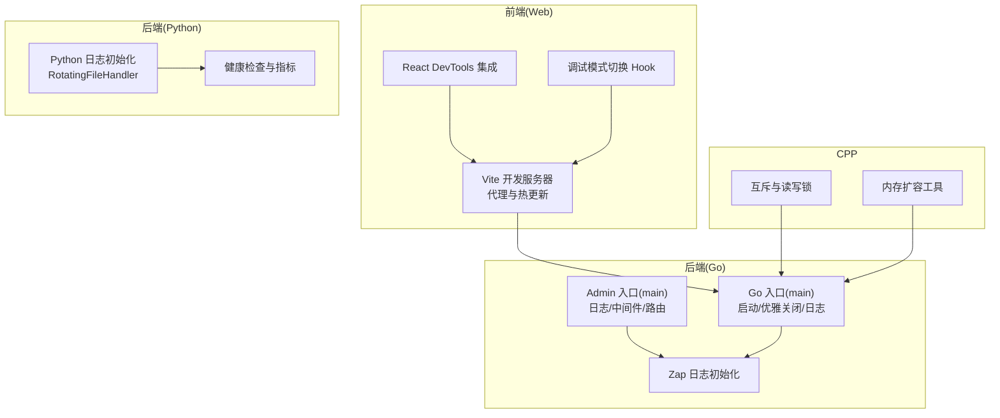
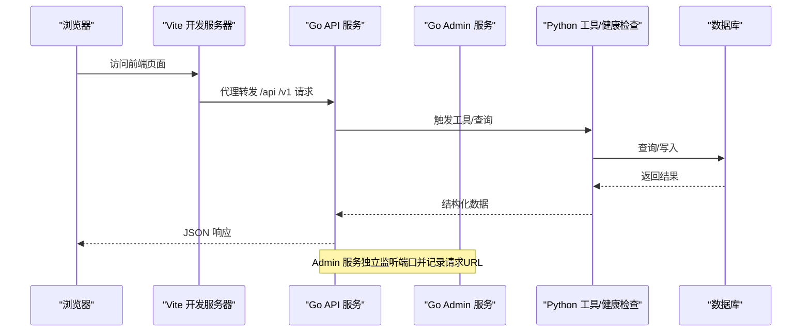
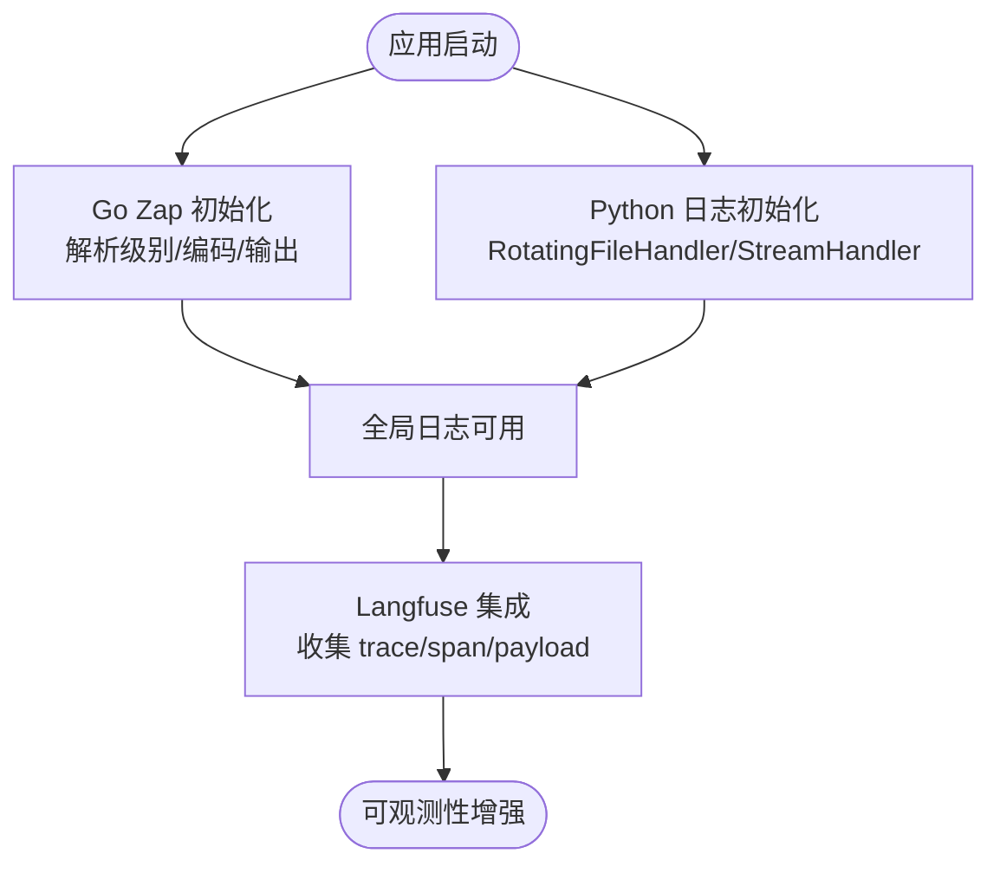
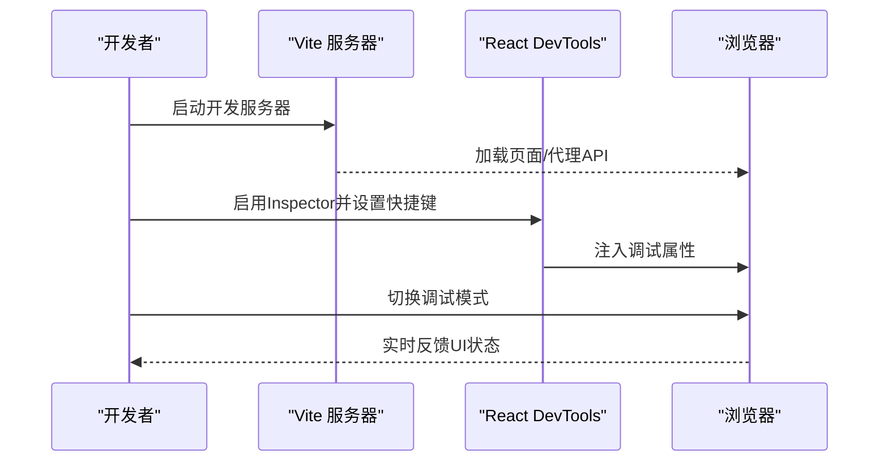
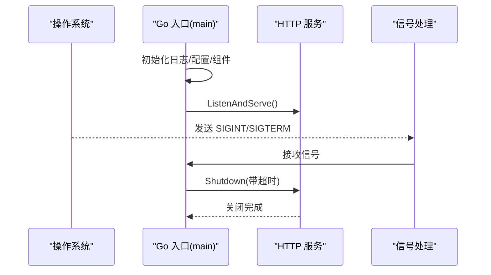
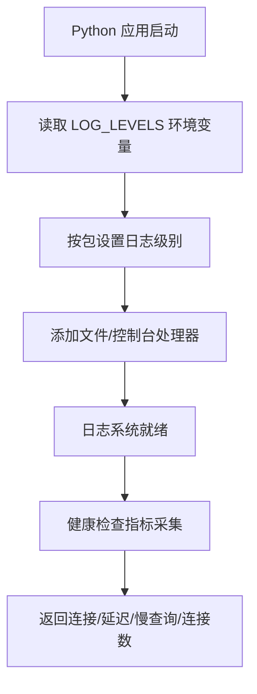
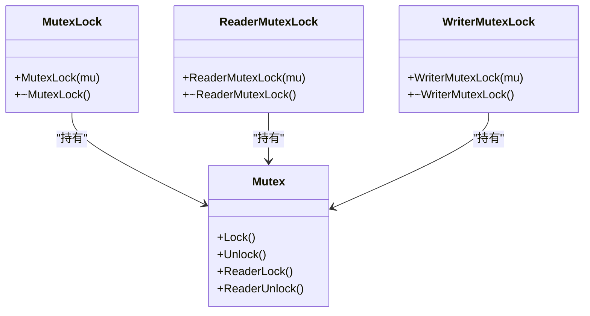
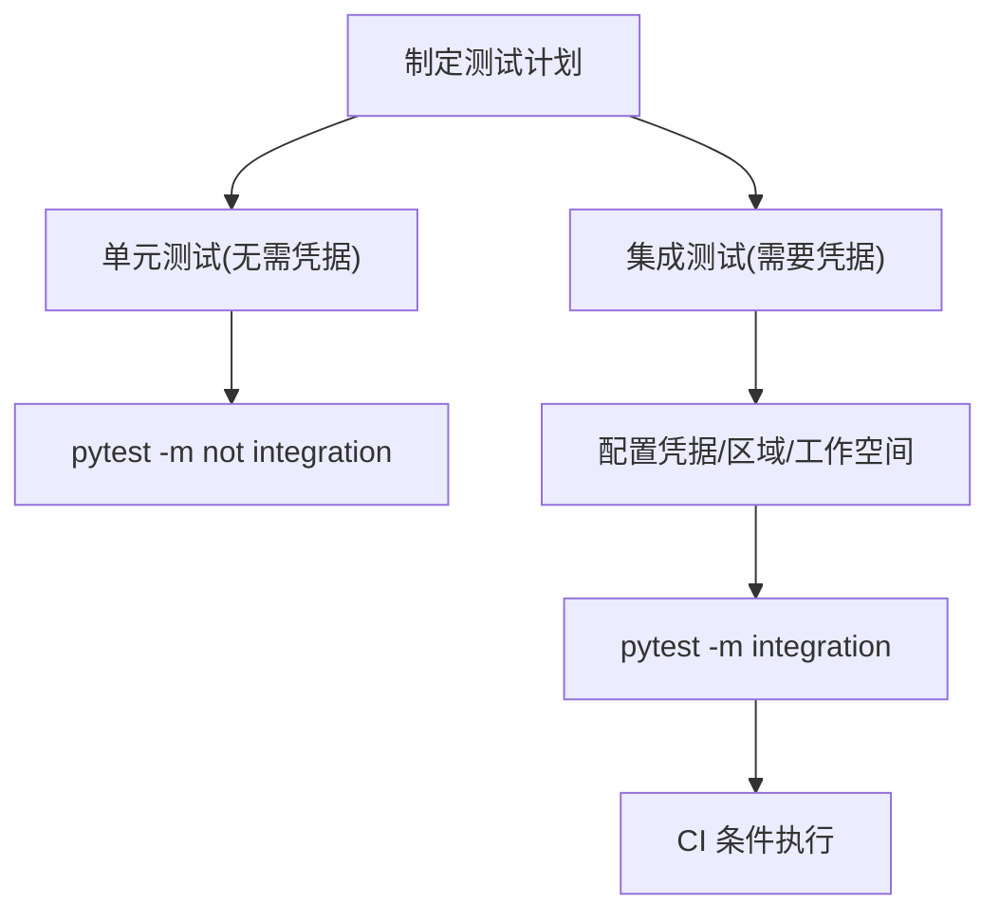
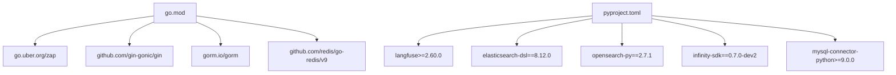

# 调试技巧

<cite>
**本文引用的文件**
- [cmd/server_main.go](file://cmd/server_main.go)
- [cmd/admin_server.go](file://cmd/admin_server.go)
- [internal/logger/logger.go](file://internal/logger/logger.go)
- [common/log_utils.py](file://common/log_utils.py)
- [api/utils/log_utils.py](file://api/utils/log_utils.py)
- [docs/administrator/tracing.mdx](file://docs/administrator/tracing.mdx)
- [web/vite.config.ts](file://web/vite.config.ts)
- [web/src/main.tsx](file://web/src/main.tsx)
- [web/src/pages/next-chats/chat/use-switch-debug-mode.ts](file://web/src/pages/next-chats/chat/use-switch-debug-mode.ts)
- [go.mod](file://go.mod)
- [pyproject.toml](file://pyproject.toml)
- [test/README.md](file://test/README.md)
- [internal/cpp/util/mutex.h](file://internal/cpp/util/mutex.h)
- [internal/cpp/stemmer/utilities.cpp](file://internal/cpp/stemmer/utilities.cpp)
- [api/utils/health_utils.py](file://api/utils/health_utils.py)
- [agent/sandbox/tests/README.md](file://agent/sandbox/tests/README.md)
- [agent/sandbox/tests/QUICKSTART.md](file://agent/sandbox/tests/QUICKSTART.md)
</cite>

## 目录
1. [简介](#简介)
2. [项目结构](#项目结构)
3. [核心组件](#核心组件)
4. [架构总览](#架构总览)
5. [详细组件分析](#详细组件分析)
6. [依赖分析](#依赖分析)
7. [性能考虑](#性能考虑)
8. [故障排查指南](#故障排查指南)
9. [结论](#结论)
10. [附录](#附录)

## 简介
本指南面向RAGFlow项目的开发者与运维人员，系统性梳理前后端调试、日志体系、分布式追踪、性能分析、常见问题定位与测试策略。内容覆盖：
- 日志系统：日志级别配置、结构化输出、多包级别控制、Go/Zap与Python日志初始化
- 前端调试：Vite开发服务器、React DevTools、网络代理与断点调试
- 后端调试：Go服务启动流程、信号处理、优雅关闭；Python测试框架与覆盖率
- 性能分析：数据库健康检查指标、慢查询与连接数监控
- 常见问题：并发与互斥、内存增长、超时与资源泄漏
- 测试策略：单元/集成测试、标记与CI运行建议

## 项目结构
RAGFlow采用多语言混合架构：
- Go后端：API/Admin服务入口、路由、中间件、日志初始化与优雅关闭
- Python后端：API服务层、工具库、健康检查与日志工具
- Web前端：Vite构建、React DevTools集成、本地代理与调试模式
- CPP子模块：分词与检索相关底层实现
- 文档与测试：官方文档中的可观测性指南、测试环境与用例

**图表来源**
- [cmd/server_main.go:45-153](file://cmd/server_main.go#L45-L153)
- [cmd/admin_server.go:50-187](file://cmd/admin_server.go#L50-L187)
- [internal/logger/logger.go:34-86](file://internal/logger/logger.go#L34-L86)
- [common/log_utils.py:25-86](file://common/log_utils.py#L25-L86)
- [api/utils/health_utils.py:174-198](file://api/utils/health_utils.py#L174-L198)
- [internal/cpp/util/mutex.h:84-169](file://internal/cpp/util/mutex.h#L84-L169)
- [internal/cpp/stemmer/utilities.cpp:385-399](file://internal/cpp/stemmer/utilities.cpp#L385-L399)

**章节来源**
- [cmd/server_main.go:45-153](file://cmd/server_main.go#L45-L153)
- [cmd/admin_server.go:50-187](file://cmd/admin_server.go#L50-L187)
- [internal/logger/logger.go:34-86](file://internal/logger/logger.go#L34-L86)
- [common/log_utils.py:25-86](file://common/log_utils.py#L25-L86)
- [api/utils/health_utils.py:174-198](file://api/utils/health_utils.py#L174-L198)
- [internal/cpp/util/mutex.h:84-169](file://internal/cpp/util/mutex.h#L84-L169)
- [internal/cpp/stemmer/utilities.cpp:385-399](file://internal/cpp/stemmer/utilities.cpp#L385-L399)

## 核心组件
- Go服务启动与日志
  - 通过命令行参数覆盖端口，按配置动态重设日志级别，初始化数据库、缓存、存储工厂、变量、分词器与查询构建器，最后启动HTTP服务并注册信号处理进行优雅关闭。
- Admin服务
  - 与API服务类似，但增加请求URL记录中间件，便于调试请求路径。
- Python日志与健康检查
  - 初始化根日志器，支持按包设置级别，输出到文件与控制台；健康检查返回连接状态、延迟、慢查询、活动连接数等关键指标。
- 前端调试工具链
  - Vite开发服务器、React DevTools插件、网络代理、调试模式开关Hook。

**章节来源**
- [cmd/server_main.go:45-153](file://cmd/server_main.go#L45-L153)
- [cmd/admin_server.go:50-187](file://cmd/admin_server.go#L50-L187)
- [common/log_utils.py:25-86](file://common/log_utils.py#L25-L86)
- [api/utils/health_utils.py:174-198](file://api/utils/health_utils.py#L174-L198)
- [web/vite.config.ts:199-206](file://web/vite.config.ts#L199-L206)
- [web/src/main.tsx:1-16](file://web/src/main.tsx#L1-L16)
- [web/src/pages/next-chats/chat/use-switch-debug-mode.ts:1-14](file://web/src/pages/next-chats/chat/use-switch-debug-mode.ts#L1-L14)

## 架构总览
下图展示从浏览器到Go/Admin服务，再到Python工具与数据库的典型调用链路及日志落点。

**图表来源**
- [web/vite.config.ts:33-144](file://web/vite.config.ts#L33-L144)
- [cmd/server_main.go:196-215](file://cmd/server_main.go#L196-L215)
- [cmd/admin_server.go:139-144](file://cmd/admin_server.go#L139-L144)
- [api/utils/health_utils.py:174-198](file://api/utils/health_utils.py#L174-L198)

## 详细组件分析

### 日志系统与分布式追踪
- Go日志(Zap)
  - 支持debug/info/warn/error级别解析，控制台编码格式，可注入调用者信息，提供Info/Error/Debug/Warn/Fatal/Sync等便捷函数。
- Python日志
  - 初始化根日志器，自动创建logs目录，RotatingFileHandler轮转日志，StreamHandler输出到控制台；支持通过环境变量按包设置级别，默认抑制部分第三方包噪音。
- 分布式追踪
  - 文档提供Langfuse集成说明，可在RAGFlow中收集检索与生成步骤的trace、span与prompt/响应元数据，便于定位瓶颈与对比不同提示版本。

**图表来源**
- [internal/logger/logger.go:34-86](file://internal/logger/logger.go#L34-L86)
- [common/log_utils.py:25-86](file://common/log_utils.py#L25-L86)
- [docs/administrator/tracing.mdx:18-73](file://docs/administrator/tracing.mdx#L18-L73)

**章节来源**
- [internal/logger/logger.go:34-139](file://internal/logger/logger.go#L34-L139)
- [common/log_utils.py:25-86](file://common/log_utils.py#L25-L86)
- [docs/administrator/tracing.mdx:18-73](file://docs/administrator/tracing.mdx#L18-L73)

### 前端调试工具
- Vite开发服务器
  - 支持多模式代理方案（python/go/hybrid），端口可配置，HMR覆盖层可关闭，便于区分后端服务。
- React DevTools
  - 通过插件在源码中注入数据属性，并在浏览器中启用Inspector，支持快捷键唤起VS Code定位元素。
- 调试模式
  - 提供切换调试模式的Hook，便于在聊天界面中开启/关闭调试视图。

**图表来源**
- [web/vite.config.ts:199-206](file://web/vite.config.ts#L199-L206)
- [web/src/main.tsx:1-16](file://web/src/main.tsx#L1-L16)
- [web/src/pages/next-chats/chat/use-switch-debug-mode.ts:1-14](file://web/src/pages/next-chats/chat/use-switch-debug-mode.ts#L1-L14)

**章节来源**
- [web/vite.config.ts:199-206](file://web/vite.config.ts#L199-L206)
- [web/src/main.tsx:1-16](file://web/src/main.tsx#L1-L16)
- [web/src/pages/next-chats/chat/use-switch-debug-mode.ts:1-14](file://web/src/pages/next-chats/chat/use-switch-debug-mode.ts#L1-L14)

### 后端调试方法（Go）
- 启动流程
  - 解析命令行端口参数，按配置重设日志级别，初始化数据库、模型工厂、文档引擎、Redis缓存、存储工厂、运行时变量、分词器与查询构建器，随后启动HTTP服务。
- 优雅关闭
  - 注册信号量，收到中断信号后创建带超时上下文并执行Shutdown，确保资源有序释放。
- Admin服务中间件
  - 在Debug模式下启用Gin日志中间件，并统一记录每个请求的URL与方法，便于快速定位接口问题。

**图表来源**
- [cmd/server_main.go:45-153](file://cmd/server_main.go#L45-L153)
- [cmd/admin_server.go:125-134](file://cmd/admin_server.go#L125-L134)

**章节来源**
- [cmd/server_main.go:45-153](file://cmd/server_main.go#L45-L153)
- [cmd/admin_server.go:125-134](file://cmd/admin_server.go#L125-L134)

### 后端调试方法（Python）
- 日志初始化
  - 通过环境变量按包设置日志级别，避免第三方噪声干扰，同时输出到文件与控制台，便于离线分析。
- 健康检查
  - 返回连接状态、延迟、慢查询、活动连接数、最大连接数等指标，用于快速判断数据库健康状况与性能瓶颈。

**图表来源**
- [common/log_utils.py:48-72](file://common/log_utils.py#L48-L72)
- [api/utils/health_utils.py:174-198](file://api/utils/health_utils.py#L174-L198)

**章节来源**
- [common/log_utils.py:48-72](file://common/log_utils.py#L48-L72)
- [api/utils/health_utils.py:174-198](file://api/utils/health_utils.py#L174-L198)

### 并发与互斥（CPP）
- 互斥体与读写锁
  - 提供跨平台的互斥实现，支持独占锁与共享锁，配套RAII风格的锁作用域类，避免忘记解锁。
- 内存扩容
  - 在字符串缓冲区不足时进行扩容，若分配失败则释放旧缓冲并返回空指针，保证异常安全。

**图表来源**
- [internal/cpp/util/mutex.h:84-169](file://internal/cpp/util/mutex.h#L84-L169)

**章节来源**
- [internal/cpp/util/mutex.h:84-169](file://internal/cpp/util/mutex.h#L84-L169)
- [internal/cpp/stemmer/utilities.cpp:385-399](file://internal/cpp/stemmer/utilities.cpp#L385-L399)

### 单元测试与集成测试策略
- 测试框架与标记
  - 使用pytest，定义p0/p1/p2/p3/smoke等标记，严格回溯、彩色输出、禁用警告、覆盖率配置等。
- 测试类型
  - 单元测试无需凭证，集成测试需真实凭据；提供CI脚本示例，仅在具备凭据时运行集成测试。
- 运行建议
  - 使用环境变量选择文档引擎（Elasticsearch/Infinity），按需指定HTTP API测试等级与主机地址。

**图表来源**
- [pyproject.toml:162-237](file://pyproject.toml#L162-L237)
- [test/README.md:10-98](file://test/README.md#L10-L98)
- [agent/sandbox/tests/README.md:16-37](file://agent/sandbox/tests/README.md#L16-L37)
- [agent/sandbox/tests/QUICKSTART.md:1-50](file://agent/sandbox/tests/QUICKSTART.md#L1-L50)

**章节来源**
- [pyproject.toml:162-237](file://pyproject.toml#L162-L237)
- [test/README.md:10-98](file://test/README.md#L10-L98)
- [agent/sandbox/tests/README.md:16-37](file://agent/sandbox/tests/README.md#L16-L37)
- [agent/sandbox/tests/QUICKSTART.md:1-50](file://agent/sandbox/tests/QUICKSTART.md#L1-L50)

## 依赖分析
- Go模块
  - 引入zap、gin、gorm、redis、aws-sdk、elastic等，支撑日志、Web框架、ORM、缓存与云存储。
- Python依赖
  - 包含langfuse、elasticsearch、opensearch、infinity、mysql-connector、opencv、selenium等，覆盖可观测性、搜索引擎、向量引擎与数据源接入。

**图表来源**
- [go.mod:5-25](file://go.mod#L5-L25)
- [pyproject.toml:9-160](file://pyproject.toml#L9-L160)

**章节来源**
- [go.mod:5-25](file://go.mod#L5-L25)
- [pyproject.toml:9-160](file://pyproject.toml#L9-L160)

## 性能考虑
- 数据库健康检查
  - 通过健康工具返回连接状态、延迟、慢查询、活动连接数与最大连接数，结合阈值判断是否健康或降级。
- 日志级别与输出
  - 生产环境建议提升日志级别，减少IO压力；必要时仅保留关键字段，避免过度结构化导致序列化开销。
- 前端构建与压缩
  - Vite配置中移除console与debugger，启用treeshake与手动分块，有助于减小包体积与提升加载速度。

**章节来源**
- [api/utils/health_utils.py:174-198](file://api/utils/health_utils.py#L174-L198)
- [common/log_utils.py:48-72](file://common/log_utils.py#L48-L72)
- [web/vite.config.ts:282-299](file://web/vite.config.ts#L282-L299)

## 故障排查指南
- 内存泄漏
  - 检查CPP侧内存扩容逻辑与释放路径，确保异常分支不会遗漏释放；结合日志定位热点路径。
- 死锁/并发问题
  - 使用读写锁与RAII风格的锁作用域类，避免嵌套锁与长时间持锁；在Go服务中打印调用者信息，辅助定位锁竞争。
- 超时与资源泄漏
  - Go服务优雅关闭时使用带超时的上下文；Admin服务在测试实例清理失败时记录告警，避免实例泄漏。
- 网络与代理
  - 前端Vite代理配置错误会导致接口不通，确认API_PROXY_SCHEME与目标端口一致；浏览器Network面板查看请求头与响应状态。

**章节来源**
- [internal/cpp/stemmer/utilities.cpp:385-399](file://internal/cpp/stemmer/utilities.cpp#L385-L399)
- [internal/cpp/util/mutex.h:124-169](file://internal/cpp/util/mutex.h#L124-L169)
- [cmd/server_main.go:264-279](file://cmd/server_main.go#L264-L279)
- [cmd/admin_server.go:169-187](file://cmd/admin_server.go#L169-L187)
- [web/vite.config.ts:33-144](file://web/vite.config.ts#L33-L144)

## 结论
通过统一的日志体系、完善的前端调试工具链、可观测性的Langfuse集成以及严谨的测试策略，RAGFlow能够在复杂场景下快速定位问题并持续优化性能。建议在生产环境中：
- 明确日志级别与输出策略，避免噪声干扰
- 使用Langfuse进行端到端trace分析
- 在CI中区分单元与集成测试，保障质量边界
- 对并发与内存路径保持警惕，定期回归测试

## 附录
- 常用环境变量与配置
  - LOG_LEVELS：按包设置日志级别
  - API_PROXY_SCHEME：前端代理模式（python/go/hybrid）
  - COMPOSE_PROFILES/DOC_ENGINE：测试阶段切换搜索引擎后端
- 快速验证
  - 启动容器后，使用pytest按文档指引运行SDK或HTTP API测试，观察健康检查指标与Langfuse trace。

**章节来源**
- [common/log_utils.py:48-72](file://common/log_utils.py#L48-L72)
- [web/vite.config.ts:33-144](file://web/vite.config.ts#L33-L144)
- [test/README.md:10-98](file://test/README.md#L10-L98)
- [docs/administrator/tracing.mdx:18-73](file://docs/administrator/tracing.mdx#L18-L73)