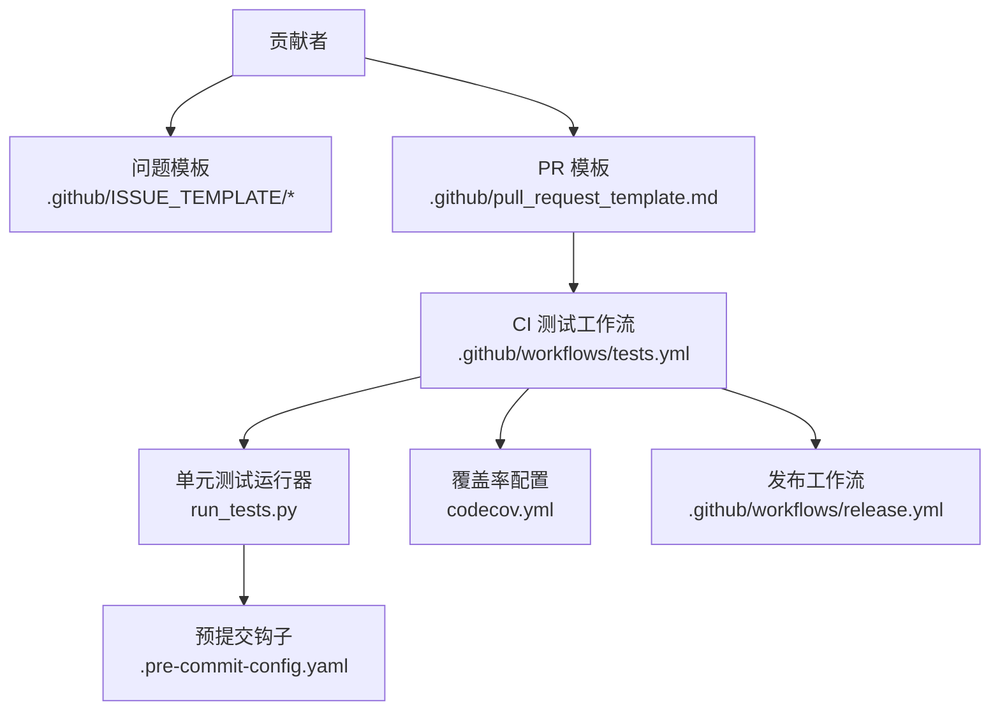
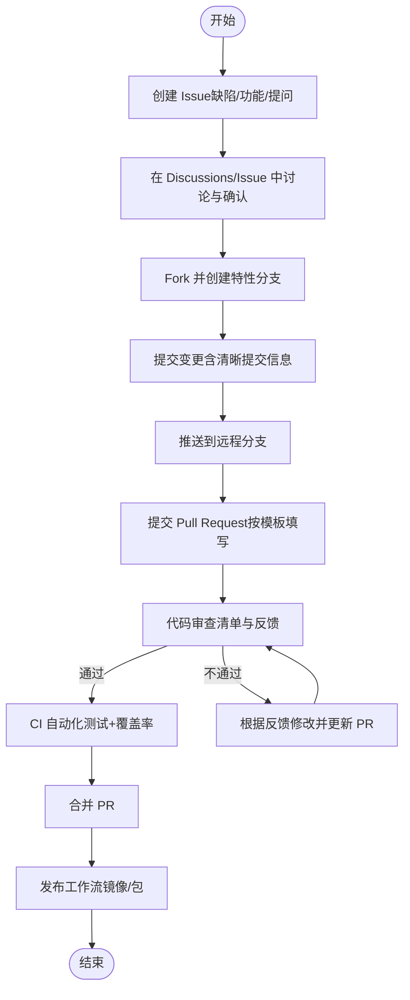
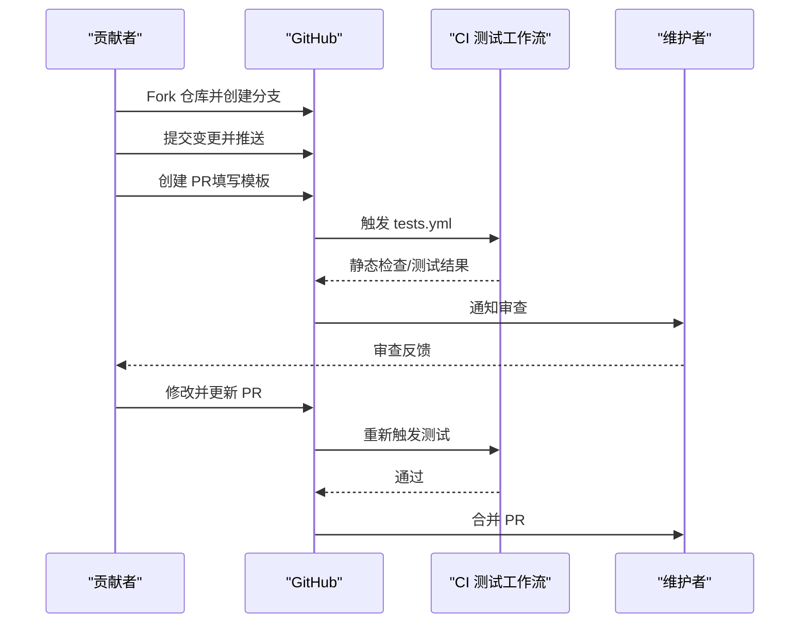
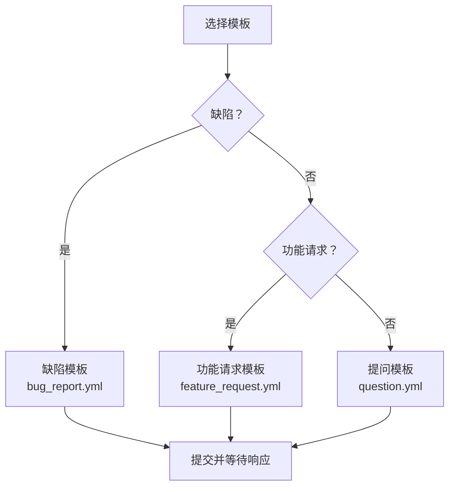
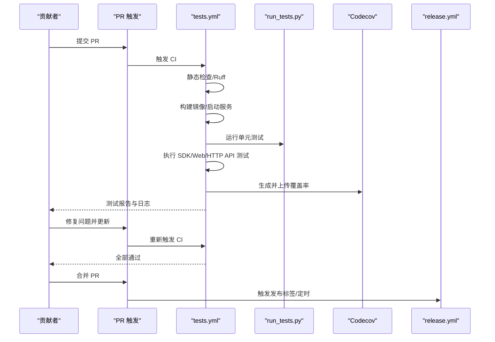
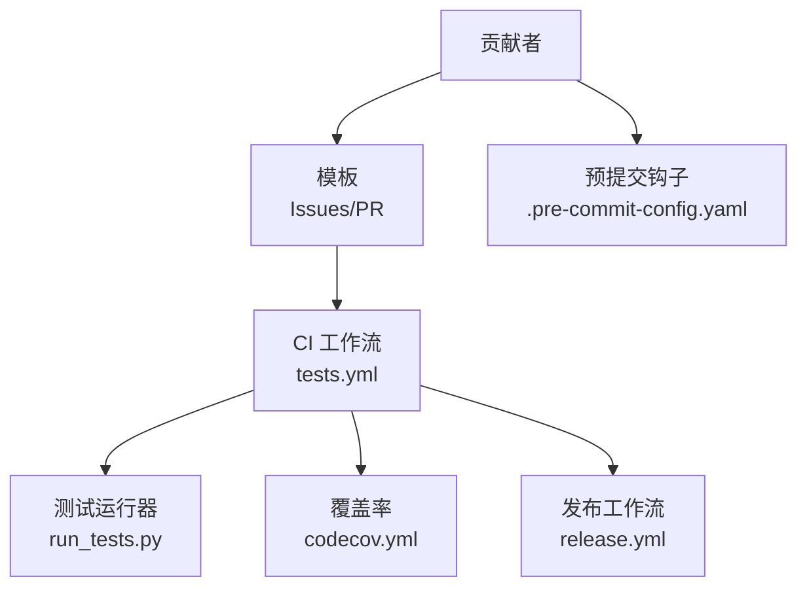

# 贡献流程

<cite>
**本文引用的文件**
- [README.md](file://README.md)
- [贡献指南（docs/develop/contributing.md）](file://docs/develop/contributing.md)
- [拉取请求模板（.github/pull_request_template.md）](file://.github/pull_request_template.md)
- [问题模板：缺陷（.github/ISSUE_TEMPLATE/bug_report.yml）](file://.github/ISSUE_TEMPLATE/bug_report.yml)
- [问题模板：功能请求（.github/ISSUE_TEMPLATE/feature_request.yml）](file://.github/ISSUE_TEMPLATE/feature_request.yml)
- [问题模板：提问（.github/ISSUE_TEMPLATE/question.yml）](file://.github/ISSUE_TEMPLATE/question.yml)
- [子任务模板（.github/ISSUE_TEMPLATE/subtask.yml）](file://.github/ISSUE_TEMPLATE/subtask.yml)
- [CI 测试工作流（.github/workflows/tests.yml）](file://.github/workflows/tests.yml)
- [CI 发布工作流（.github/workflows/release.yml）](file://.github/workflows/release.yml)
- [预提交配置（.pre-commit-config.yaml）](file://.pre-commit-config.yaml)
- [覆盖率配置（codecov.yml）](file://codecov.yml)
- [单元测试运行器（run_tests.py）](file://run_tests.py)
</cite>

## 目录
1. [简介](#简介)
2. [项目结构与入口](#项目结构与入口)
3. [核心流程概览](#核心流程概览)
4. [从问题报告到代码合并的完整流程](#从问题报告到代码合并的完整流程)
5. [Pull Request 提交流程详解](#pull-request-提交流程详解)
6. [代码审查标准与质量保证](#代码审查标准与质量保证)
7. [问题报告模板与使用指南](#问题报告模板与使用指南)
8. [持续集成与测试要求](#持续集成与测试要求)
9. [社区协作规范与治理](#社区协作规范与治理)
10. [依赖关系与架构视图](#依赖关系与架构视图)
11. [性能与可维护性建议](#性能与可维护性建议)
12. [故障排查与常见问题](#故障排查与常见问题)
13. [结论](#结论)

## 简介
本指南面向希望为 RAGFlow 做出贡献的新老贡献者，系统化说明从“问题报告”到“代码合并”的完整协作流程；涵盖 Pull Request 的提交规范、代码审查清单、问题模板、CI 自动化测试与覆盖率策略、社区治理与版本发布等内容，帮助你高效、高质量地参与开源协作。

## 项目结构与入口
- 官方文档与贡献指南位于 docs/develop/contributing.md，提供通用的贡献原则与 PR 工作流。
- GitHub 模板位于 .github/ISSUE_TEMPLATE 与 .github/pull_request_template.md，用于统一问题与 PR 的填写格式。
- CI/CD 由 .github/workflows 下的 tests.yml 与 release.yml 驱动，覆盖多引擎测试与镜像发布。
- 开发环境与本地测试可通过 run_tests.py 与 .pre-commit-config.yaml 协同完成。

**图表来源**
- [.github/ISSUE_TEMPLATE/bug_report.yml:1-73](file://.github/ISSUE_TEMPLATE/bug_report.yml#L1-L73)
- [.github/ISSUE_TEMPLATE/feature_request.yml:1-52](file://.github/ISSUE_TEMPLATE/feature_request.yml#L1-L52)
- [.github/ISSUE_TEMPLATE/question.yml:1-28](file://.github/ISSUE_TEMPLATE/question.yml#L1-L28)
- [.github/ISSUE_TEMPLATE/subtask.yml:1-30](file://.github/ISSUE_TEMPLATE/subtask.yml#L1-L30)
- [.github/pull_request_template.md:1-13](file://.github/pull_request_template.md#L1-L13)
- [.github/workflows/tests.yml:1-611](file://.github/workflows/tests.yml#L1-L611)
- [.github/workflows/release.yml:1-102](file://.github/workflows/release.yml#L1-L102)
- [run_tests.py:1-275](file://run_tests.py#L1-L275)
- [.pre-commit-config.yaml:1-20](file://.pre-commit-config.yaml#L1-L20)
- [codecov.yml:1-4](file://codecov.yml#L1-L4)

**章节来源**
- [README.md:410-414](file://README.md#L410-L414)
- [贡献指南（docs/develop/contributing.md）:1-59](file://docs/develop/contributing.md#L1-L59)

## 核心流程概览
- 问题报告：通过 GitHub Issues 的模板提交缺陷、功能请求或提问。
- 讨论与确认：在 Discussions 或 Issues 中沟通需求与设计。
- 分支与提交：Fork 仓库、创建特性分支、提交信息清晰、推送远程。
- 提交 PR：按模板填写 PR 描述、类型与影响范围。
- 代码审查：审查清单、反馈处理、修改与复审。
- CI 自动化：静态检查、单元测试、SDK/Web/HTTP API 测试、覆盖率收集。
- 合并与发布：通过审查后合并，触发发布工作流产出镜像与 SDK 包。

**图表来源**
- [贡献指南（docs/develop/contributing.md）:30-59](file://docs/develop/contributing.md#L30-L59)
- [.github/pull_request_template.md:1-13](file://.github/pull_request_template.md#L1-L13)
- [.github/workflows/tests.yml:1-611](file://.github/workflows/tests.yml#L1-L611)
- [.github/workflows/release.yml:1-102](file://.github/workflows/release.yml#L1-L102)

## 从问题报告到代码合并的完整流程
- 选择模板：根据场景选择缺陷、功能请求或提问模板，确保必填字段完整。
- 提交前搜索：在现有 Issues 中搜索是否已有类似问题，避免重复。
- 使用英文标题与描述：语言政策要求英文提交，非英文标题会被直接关闭。
- 描述清晰：提供复现步骤、期望行为、实际行为、环境信息与日志等。
- 讨论与确认：在 Discussions 或 Issue 中与维护者沟通，明确实现方案与边界。
- 分支与提交：遵循 PR 规范，保持单主题、小步快跑、可回溯。
- PR 描述：简洁明了的标题、关联 Issue、必要时补充设计细节。
- CI 通过：确保所有自动化检查通过后再合并。
- 合并与跟进：合并后关注回归与用户反馈。

**章节来源**
- [问题模板：缺陷（.github/ISSUE_TEMPLATE/bug_report.yml）:1-73](file://.github/ISSUE_TEMPLATE/bug_report.yml#L1-L73)
- [问题模板：功能请求（.github/ISSUE_TEMPLATE/feature_request.yml）:1-52](file://.github/ISSUE_TEMPLATE/feature_request.yml#L1-L52)
- [问题模板：提问（.github/ISSUE_TEMPLATE/question.yml）:1-28](file://.github/ISSUE_TEMPLATE/question.yml#L1-L28)
- [贡献指南（docs/develop/contributing.md）:30-59](file://docs/develop/contributing.md#L30-L59)

## Pull Request 提交流程详解
- Fork 仓库：在 GitHub 上 Fork 主仓库到个人账户。
- 创建分支：基于 main 分支创建特性分支，命名清晰、语义明确。
- 提交信息：提供足够信息，便于回溯与审查。
- 推送与 PR：推送分支到远端，发起 PR 并填写模板。
- PR 类型：在模板中勾选类型（缺陷修复、新功能、文档更新、重构、性能改进等）。
- 描述要求：标题简洁、描述充分、关联 Issue、说明设计与影响。
- 变更粒度：避免一次 PR 包含多个无关主题，拆分为多个小 PR 更易审查。

**图表来源**
- [.github/pull_request_template.md:1-13](file://.github/pull_request_template.md#L1-L13)
- [.github/workflows/tests.yml:1-611](file://.github/workflows/tests.yml#L1-L611)
- [贡献指南（docs/develop/contributing.md）:30-59](file://docs/develop/contributing.md#L30-L59)

**章节来源**
- [贡献指南（docs/develop/contributing.md）:30-59](file://docs/develop/contributing.md#L30-L59)
- [.github/pull_request_template.md:1-13](file://.github/pull_request_template.md#L1-L13)

## 代码审查标准与质量保证
- 审查清单（建议项）
  - 是否与 Issue 对齐、目标明确？
  - 是否满足最小可用原则（小步快跑、单一职责）？
  - 是否有必要的测试用例（新增功能需配套测试）？
  - 是否考虑了兼容性与破坏性变更的影响范围？
  - 是否通过静态检查与 CI 测试？
  - 文档与注释是否同步更新？
- 反馈处理
  - 明确每条反馈的修改点与原因；
  - 修改后重新触发 CI，确保所有检查通过；
  - 在 PR 中进行“已处理”标注与简要说明。
- 合并条件
  - 至少一名维护者批准；
  - CI 全部通过；
  - 无未解决的审查意见。

**章节来源**
- [贡献指南（docs/develop/contributing.md）:57-59](file://docs/develop/contributing.md#L57-L59)
- [.github/workflows/tests.yml:1-611](file://.github/workflows/tests.yml#L1-L611)

## 问题报告模板与使用指南
- 缺陷报告（bug_report.yml）
  - 必填字段：工作区提交 ID、镜像版本、实际行为、复现步骤。
  - 环境信息：硬件参数、操作系统、其他相关信息。
  - 日志与附加信息：有助于定位根因。
- 功能请求（feature_request.yml）
  - 问题背景、期望功能、考虑的实现方案、文档/采用场景与用例。
- 提问（question.yml）
  - 清晰描述问题，优先使用现有模板。
- 子任务（subtask.yml）
  - 关联父 Issue，明确子任务功能与实现思路。

**图表来源**
- [.github/ISSUE_TEMPLATE/bug_report.yml:1-73](file://.github/ISSUE_TEMPLATE/bug_report.yml#L1-L73)
- [.github/ISSUE_TEMPLATE/feature_request.yml:1-52](file://.github/ISSUE_TEMPLATE/feature_request.yml#L1-L52)
- [.github/ISSUE_TEMPLATE/question.yml:1-28](file://.github/ISSUE_TEMPLATE/question.yml#L1-L28)
- [.github/ISSUE_TEMPLATE/subtask.yml:1-30](file://.github/ISSUE_TEMPLATE/subtask.yml#L1-L30)

**章节来源**
- [.github/ISSUE_TEMPLATE/bug_report.yml:1-73](file://.github/ISSUE_TEMPLATE/bug_report.yml#L1-L73)
- [.github/ISSUE_TEMPLATE/feature_request.yml:1-52](file://.github/ISSUE_TEMPLATE/feature_request.yml#L1-L52)
- [.github/ISSUE_TEMPLATE/question.yml:1-28](file://.github/ISSUE_TEMPLATE/question.yml#L1-L28)
- [.github/ISSUE_TEMPLATE/subtask.yml:1-30](file://.github/ISSUE_TEMPLATE/subtask.yml#L1-L30)

## 持续集成与测试要求
- 触发时机
  - push 到 main 与特定分支；
  - pull_request（同步/ready_for_review）；
  - 定时任务（夜间构建）。
- 静态检查
  - 使用 Ruff 进行代码风格与潜在问题检查。
- 构建与测试
  - Go 服务构建、Docker 镜像构建；
  - 单元测试运行器 run_tests.py；
  - SDK/Web/HTTP API 多套测试矩阵；
  - 支持 Elasticsearch 与 Infinity 两种文档引擎。
- 覆盖率
  - 服务端覆盖率生成与上传至 Codecov；
  - 项目级覆盖率状态关闭（不强制阈值）。
- 日志与产物
  - 收集服务日志作为工件保存；
  - 失败时保留日志便于诊断。

**图表来源**
- [.github/workflows/tests.yml:1-611](file://.github/workflows/tests.yml#L1-L611)
- [run_tests.py:1-275](file://run_tests.py#L1-L275)
- [codecov.yml:1-4](file://codecov.yml#L1-L4)
- [.github/workflows/release.yml:1-102](file://.github/workflows/release.yml#L1-L102)

**章节来源**
- [.github/workflows/tests.yml:1-611](file://.github/workflows/tests.yml#L1-L611)
- [run_tests.py:1-275](file://run_tests.py#L1-L275)
- [codecov.yml:1-4](file://codecov.yml#L1-L4)

## 社区协作规范与治理
- 讨论渠道
  - 使用 GitHub Discussions 进行开放讨论与需求澄清。
- 版本与路线图
  - 通过 Releases 与 Roadmap 管理版本节奏与里程碑。
- 语言与礼仪
  - Issue/PR 使用英文标题与描述，遵守语言政策。
- 代码质量
  - 预提交钩子自动执行 YAML/JSON/换行/冲突等基础检查；
  - 统一代码风格与格式化工具链。

**章节来源**
- [README.md:400-414](file://README.md#L400-L414)
- [.pre-commit-config.yaml:1-20](file://.pre-commit-config.yaml#L1-L20)

## 依赖关系与架构视图
- 贡献者 → 模板（Issues/PR）→ CI（tests.yml）→ 测试与覆盖率 → 发布（release.yml）
- 本地开发：run_tests.py + 预提交钩子 + Docker 依赖服务

**图表来源**
- [.github/workflows/tests.yml:1-611](file://.github/workflows/tests.yml#L1-L611)
- [run_tests.py:1-275](file://run_tests.py#L1-L275)
- [codecov.yml:1-4](file://codecov.yml#L1-L4)
- [.github/workflows/release.yml:1-102](file://.github/workflows/release.yml#L1-L102)
- [.pre-commit-config.yaml:1-20](file://.pre-commit-config.yaml#L1-L20)

## 性能与可维护性建议
- 将大改动拆分为多个小 PR，降低审查成本与风险。
- 新增功能必须附带测试用例，确保回归保护。
- 优先使用统一的静态检查与格式化工具，减少风格分歧。
- 在 PR 描述中说明性能影响与兼容性注意事项。

[本节为通用建议，无需特定文件引用]

## 故障排查与常见问题
- CI 未触发或被取消
  - 检查是否命中路径过滤、是否为草稿 PR、是否带有 ci 标签（PR 条件判断）。
- 静态检查失败
  - 使用 Ruff 修复或调整规则；确保预提交钩子通过。
- 测试失败
  - 查看 CI 日志与工件中的 ragflow_server.log；
  - 确认依赖服务（Elasticsearch/Infinity/MySQL/Redis/MinIO）已正确启动。
- 覆盖率未上传
  - 确认 Codecov Action 配置与令牌有效；检查覆盖率文件生成路径。

**章节来源**
- [.github/workflows/tests.yml:1-611](file://.github/workflows/tests.yml#L1-L611)
- [codecov.yml:1-4](file://codecov.yml#L1-L4)

## 结论
遵循本指南，你可以高效、规范地完成从问题报告到代码合并的全流程。请始终以清晰的描述、严格的测试与良好的协作礼仪为基础，共同提升 RAGFlow 的质量与社区活力。