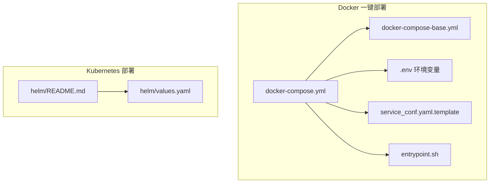
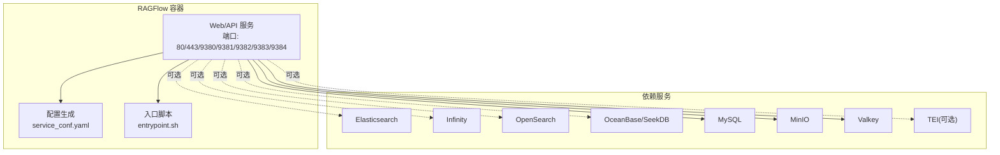
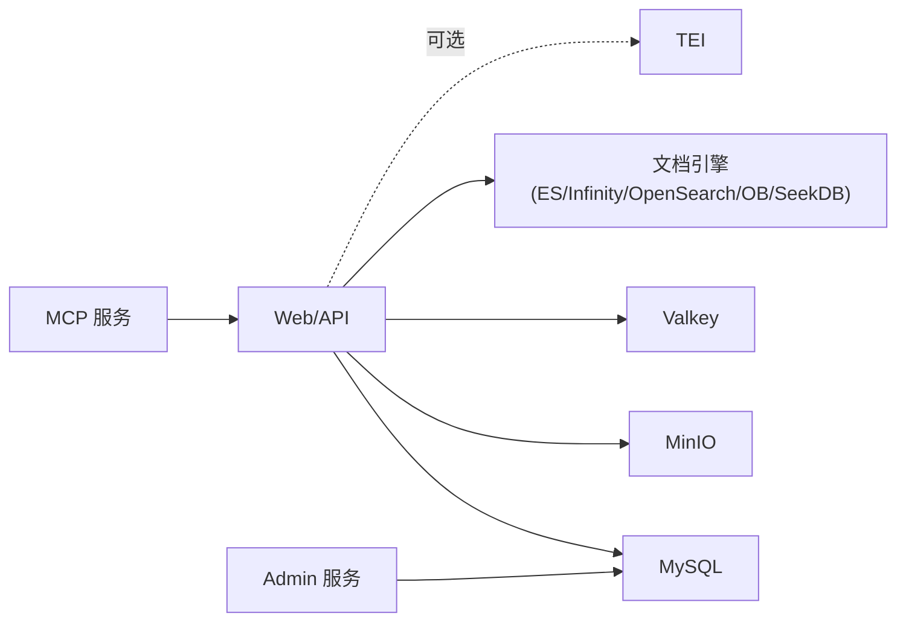

# 快速开始

<cite>
**本文引用的文件**
- [README.md](file://README.md)
- [docs/quickstart.mdx](file://docs/quickstart.mdx)
- [docker/README.md](file://docker/README.md)
- [docker/docker-compose.yml](file://docker/docker-compose.yml)
- [docker/docker-compose-base.yml](file://docker/docker-compose-base.yml)
- [docker/.env](file://docker/.env)
- [docker/service_conf.yaml.template](file://docker/service_conf.yaml.template)
- [docker/entrypoint.sh](file://docker/entrypoint.sh)
- [docker/init.sql](file://docker/init.sql)
- [docker/launch_backend_service.sh](file://docker/launch_backend_service.sh)
- [helm/README.md](file://helm/README.md)
- [helm/values.yaml](file://helm/values.yaml)
</cite>

## 目录
1. [简介](#简介)
2. [项目结构](#项目结构)
3. [核心组件](#核心组件)
4. [架构总览](#架构总览)
5. [详细组件分析](#详细组件分析)
6. [依赖关系分析](#依赖关系分析)
7. [性能与资源建议](#性能与资源建议)
8. [故障排除指南](#故障排除指南)
9. [结论](#结论)
10. [附录](#附录)

## 简介
本指南面向首次接触 RAGFlow 的用户，提供从零到运行的完整流程，覆盖系统环境要求、多种部署方式（Docker 一键部署、源码编译部署、Kubernetes 部署）、环境准备（如 vm.max_map_count 设置）、启动流程（容器启动、服务状态检查、首次登录配置）、关键配置文件说明以及常见问题排查。目标是帮助你在最短时间内成功运行 RAGFlow。

## 项目结构
RAGFlow 提供了多套部署入口：
- Docker 一键部署：通过 docker-compose 启动，包含 Web/API、数据库、对象存储、缓存、可选嵌入服务等。
- 源码开发部署：本地拉起依赖服务后，分别启动前端与后端服务。
- Kubernetes 部署：使用 Helm Chart 在集群中部署 RAGFlow 及其依赖。

图表来源
- [docker/docker-compose.yml:1-135](file://docker/docker-compose.yml#L1-L135)
- [docker/docker-compose-base.yml:1-326](file://docker/docker-compose-base.yml#L1-L326)
- [docker/.env:1-292](file://docker/.env#L1-L292)
- [docker/service_conf.yaml.template:1-172](file://docker/service_conf.yaml.template#L1-L172)
- [docker/entrypoint.sh:1-340](file://docker/entrypoint.sh#L1-L340)
- [helm/README.md:1-134](file://helm/README.md#L1-L134)
- [helm/values.yaml:1-266](file://helm/values.yaml#L1-L266)

章节来源
- [README.md:146-275](file://README.md#L146-L275)
- [docs/quickstart.mdx:40-248](file://docs/quickstart.mdx#L40-L248)
- [docker/README.md:13-271](file://docker/README.md#L13-L271)

## 核心组件
- Web/API 服务：提供前端界面与 HTTP API，支持 Admin 服务与 MCP 服务可选启用。
- 数据库：默认使用 MySQL，也可对接外部数据库。
- 对象存储：默认使用 MinIO，也可对接外部 S3 兼容存储。
- 缓存：默认使用 Valkey（原 Redis），也可对接外部缓存。
- 文档引擎：默认 Elasticsearch，可切换为 Infinity、OpenSearch 或 OceanBase/SeekDB。
- 嵌入服务：可选 TEI（Text Embeddings Inference）CPU/GPU 模式。
- 可选组件：gVisor（沙箱执行器）、Kibana、MinerU、Docling 等。

章节来源
- [docker/docker-compose.yml:4-135](file://docker/docker-compose.yml#L4-L135)
- [docker/docker-compose-base.yml:1-326](file://docker/docker-compose-base.yml#L1-L326)
- [docker/.env:13-292](file://docker/.env#L13-L292)
- [docker/service_conf.yaml.template:1-172](file://docker/service_conf.yaml.template#L1-L172)

## 架构总览
下图展示了 Docker 一键部署的典型拓扑：Web/API 容器挂载配置模板与入口脚本；依赖服务（ES/Infinity/MySQL/MinIO/Redis/可选 TEI）由基础 compose 文件定义；容器间通过自定义网络互通。

图表来源
- [docker/docker-compose.yml:4-135](file://docker/docker-compose.yml#L4-L135)
- [docker/docker-compose-base.yml:1-326](file://docker/docker-compose-base.yml#L1-L326)
- [docker/entrypoint.sh:151-176](file://docker/entrypoint.sh#L151-L176)

## 详细组件分析

### 系统环境要求与前置准备
- 硬件要求：CPU ≥ 4 核、内存 ≥ 16 GB、磁盘 ≥ 50 GB。
- 软件要求：Docker ≥ 24.0.0、Docker Compose ≥ v2.26.1。
- 特殊依赖：若使用沙箱执行器（代码执行），需安装 gVisor。
- 关键内核参数：Linux 上 vm.max_map_count 至少 262144；macOS/Windows 有相应设置方法。

章节来源
- [README.md:148-194](file://README.md#L148-L194)
- [docs/quickstart.mdx:28-182](file://docs/quickstart.mdx#L28-L182)

### Docker 一键部署（推荐）
- 步骤概览
  1) 设置 vm.max_map_count 并持久化。
  2) 克隆仓库并进入 docker 目录。
  3) 切换到稳定版本标签（如 v0.24.0）。
  4) 使用 docker compose 启动（CPU 模式或 GPU 模式）。
  5) 查看日志确认服务就绪。
  6) 浏览器访问服务器 IP 进行首次登录与配置。
- 端口映射与服务
  - Web/API：80/443/9380/9381/9382/9383/9384
  - 数据库：MySQL 默认 3306（可暴露宿主机端口）
  - 对象存储：MinIO 控制台 9001、API 9000
  - 缓存：Valkey 6379
  - 可选：Elasticsearch 9200、Infinity 23817/23820/5432、OpenSearch 9201、TEI 6380
- HTTPS 配置（可选）
  - 使用 Let’s Encrypt 获取证书，修改 docker-compose.yml 挂载证书并切换到 HTTPS 配置文件。
- 切换文档引擎
  - 修改 .env 中 DOC_ENGINE 并重启，支持 Elasticsearch、Infinity、OpenSearch、OceanBase/SeekDB。

章节来源
- [README.md:159-254](file://README.md#L159-L254)
- [docs/quickstart.mdx:40-248](file://docs/quickstart.mdx#L40-L248)
- [docker/README.md:13-271](file://docker/README.md#L13-L271)
- [docker/docker-compose.yml:31-98](file://docker/docker-compose.yml#L31-L98)

### 源码编译部署（开发调试）
- 适用场景：在本地开发与调试，需要同时启动前端与后端。
- 步骤概览
  1) 安装 uv、pre-commit。
  2) 克隆源码并安装 Python 依赖，下载第三方依赖。
  3) 使用 docker compose 启动基础依赖服务（ES/Infinity/MySQL/MinIO/Redis）。
  4) 配置 /etc/hosts 将 .env 中的主机名解析到 127.0.0.1。
  5) 如无法访问 HuggingFace，设置 HF_ENDPOINT。
  6) 安装 jemalloc。
  7) 启动后端服务脚本。
  8) 前端目录安装依赖并启动开发服务器。
  9) 停止时通过进程名清理后端服务。
- 注意：该模式适合开发，生产请使用 Docker 一键部署或 Kubernetes。

章节来源
- [README.md:318-389](file://README.md#L318-L389)
- [docker/docker-compose-base.yml:1-326](file://docker/docker-compose-base.yml#L1-L326)
- [docker/launch_backend_service.sh:1-130](file://docker/launch_backend_service.sh#L1-L130)

### Kubernetes 部署（Helm）
- 适用场景：在 Kubernetes 集群中部署 RAGFlow，支持 Ingress 暴露、外部数据库/对象存储/缓存接入。
- 步骤概览
  1) 准备命名空间与 Helm Chart。
  2) 使用 helm upgrade --install 安装。
  3) 可通过 values.yaml 覆盖默认值（如 DOC_ENGINE、外部服务地址、Ingress 主机等）。
  4) 卸载使用 helm uninstall。
- 外部服务接入：当禁用内置服务时，通过 env.* 参数注入外部服务连接信息。

章节来源
- [helm/README.md:1-134](file://helm/README.md#L1-L134)
- [helm/values.yaml:1-266](file://helm/values.yaml#L1-L266)

### 启动流程与服务状态检查
- 容器启动
  - Docker：docker compose -f docker-compose.yml up -d
  - 开发：bash docker/launch_backend_service.sh
- 服务状态检查
  - 查看容器日志：docker logs -f <容器名>
  - 日志中出现“Running on all addresses”即表示服务已就绪
- 首次登录与配置
  - 在浏览器输入服务器 IP（默认 HTTP 80 端口可省略）
  - 在 service_conf.yaml.template 中选择默认 LLM 工厂并填写 API Key

章节来源
- [README.md:220-254](file://README.md#L220-L254)
- [docs/quickstart.mdx:222-248](file://docs/quickstart.mdx#L222-L248)

### 关键配置文件说明
- .env（环境变量）
  - DOC_ENGINE：文档引擎类型（elasticsearch/infinity/opensearch/oceanbase/seekdb）
  - DEVICE：推理设备（cpu/gpu）
  - 端口映射：SVR_WEB_HTTP_PORT、SVR_HTTP_PORT、ADMIN_SVR_HTTP_PORT、SVR_MCP_PORT、GO_HTTP_PORT、GO_ADMIN_PORT
  - MySQL/MinIO/Redis 密码与主机名
  - TEI 嵌入服务镜像、模型、端口
  - 日志级别、文件大小限制、批处理大小、注册开关、沙箱开关等
- service_conf.yaml.template（服务配置模板）
  - ragflow/admin 服务监听地址与端口
  - MySQL/MinIO/Redis/ES/OpenSearch/Infinity/OceanBase/SeekDB 连接参数
  - user_default_llm：默认 LLM 工厂与 API Key
  - 可选：S3/OSS/Azure 等对象存储配置
- entrypoint.sh（容器入口）
  - 解析命令行参数以启用/禁用 Web 服务、Admin 服务、MCP 服务、任务执行器、数据同步
  - 将 .env 中的变量替换进 service_conf.yaml
  - 根据 API_PROXY_SCHEME 选择 Nginx 配置
  - 初始化数据库表、等待依赖服务就绪、启动各子进程

章节来源
- [docker/.env:1-292](file://docker/.env#L1-L292)
- [docker/service_conf.yaml.template:1-172](file://docker/service_conf.yaml.template#L1-L172)
- [docker/entrypoint.sh:1-340](file://docker/entrypoint.sh#L1-L340)

### 配置示例与最佳实践
- HTTPS 部署
  - 申请证书并挂载至容器，切换到 HTTPS 配置文件，重启服务
- 外部数据库/对象存储/缓存
  - 在 values.yaml 或 .env 中设置外部主机、端口、用户名、密码
- 文档引擎切换
  - 修改 .env 中 DOC_ENGINE 并重启，注意不同引擎的兼容性与性能差异
- 批处理与并发
  - 通过 DOC_BULK_SIZE、EMBEDDING_BATCH_SIZE、THREAD_POOL_MAX_WORKERS 调整吞吐
- 沙箱执行器
  - 若启用，需安装 gVisor，并在 /etc/hosts 中添加对应主机名

章节来源
- [docker/README.md:200-271](file://docker/README.md#L200-L271)
- [docker/.env:242-292](file://docker/.env#L242-L292)

## 依赖关系分析
- 组件耦合
  - Web/API 服务依赖 MySQL、MinIO、Redis、文档引擎（ES/Infinity/OpenSearch/OceanBase/SeekDB）
  - 可选 TEI 作为嵌入服务，提升向量生成性能
  - Admin/MCP 服务可独立启用，便于管理与扩展
- 外部依赖
  - Docker 与 Docker Compose
  - 可选：gVisor（沙箱执行器）、Certbot（HTTPS）
- 循环依赖
  - 无直接循环依赖，服务通过容器网络与共享卷进行通信

图表来源
- [docker/docker-compose.yml:4-135](file://docker/docker-compose.yml#L4-L135)
- [docker/docker-compose-base.yml:1-326](file://docker/docker-compose-base.yml#L1-L326)

章节来源
- [docker/docker-compose.yml:4-135](file://docker/docker-compose.yml#L4-L135)
- [docker/docker-compose-base.yml:1-326](file://docker/docker-compose-base.yml#L1-L326)

## 性能与资源建议
- 硬件建议
  - CPU ≥ 4 核、内存 ≥ 16 GB、磁盘 ≥ 50 GB
  - GPU 推理可显著加速深度文档处理（DeepDoc），需在 .env 中设置 DEVICE=gpu 并确保宿主机具备 NVIDIA 驱动与 nvidia-container-toolkit
- 内核参数
  - Linux：vm.max_map_count 至少 262144；macOS/Windows 有专用设置步骤
- 网络与存储
  - 为 MinIO/MySQL/Redis/TEI 等分配合理容量与 IOPS
  - 文档引擎根据数据规模选择合适的副本与分片策略
- 并发与批处理
  - 适当提高 THREAD_POOL_MAX_WORKERS、DOC_BULK_SIZE、EMBEDDING_BATCH_SIZE 以提升吞吐
- HTTPS 与 Ingress
  - 生产建议开启 HTTPS 并通过 Ingress 管理域名与 TLS

[本节为通用指导，不直接分析具体文件]

## 故障排除指南
- vm.max_map_count 不足导致 ES/Infinity 连接失败
  - 检查并设置为至少 262144，Linux/macOS/Windows 有不同设置方法
- Docker 镜像拉取失败
  - 使用国内镜像源或代理，或手动指定镜像地址
- 端口冲突
  - 修改 .env 中的端口映射或停止占用端口的服务
- HTTPS 证书问题
  - 确认证书路径正确、权限只读、域名匹配；必要时使用自签名证书（浏览器会提示安全警告）
- 数据库初始化失败
  - 确认 init.sql 已挂载且 MySQL 已健康；查看容器日志定位错误
- 沙箱执行器不可用
  - 确认已安装 gVisor、/etc/hosts 中解析 sandbox 主机名、必要时调整 seccomp 策略
- 任务执行器或服务异常退出
  - 查看容器日志与重试机制；检查依赖服务是否就绪

章节来源
- [docs/quickstart.mdx:44-182](file://docs/quickstart.mdx#L44-L182)
- [docker/README.md:200-271](file://docker/README.md#L200-L271)
- [docker/init.sql:1-2](file://docker/init.sql#L1-L2)
- [docker/entrypoint.sh:242-258](file://docker/entrypoint.sh#L242-L258)

## 结论
通过本快速开始指南，你可以基于 Docker 一键部署在本地或服务器上快速运行 RAGFlow；若需要更灵活的定制，可参考源码开发部署与 Kubernetes Helm 部署。建议在生产环境中启用 HTTPS、合理规划资源与并发参数，并结合监控与备份策略保障稳定性。

[本节为总结性内容，不直接分析具体文件]

## 附录

### A. Docker 一键部署命令速查
- 设置 vm.max_map_count 并持久化
- 克隆仓库并进入 docker 目录
- 切换到稳定版本标签（如 v0.24.0）
- 启动（CPU 模式）：docker compose -f docker-compose.yml up -d
- 启动（GPU 模式）：先在 .env 中设置 DEVICE=gpu，再启动
- 查看日志：docker logs -f <容器名>
- 访问：浏览器打开 http://IP（默认 80 端口）

章节来源
- [README.md:159-254](file://README.md#L159-L254)
- [docs/quickstart.mdx:186-248](file://docs/quickstart.mdx#L186-L248)

### B. 关键配置项一览
- .env
  - DOC_ENGINE、DEVICE、端口映射、MySQL/MinIO/Redis 密码、TEI 模型与端口、日志级别、文件大小限制、批处理大小、注册开关、沙箱开关等
- service_conf.yaml.template
  - ragflow/admin 服务监听、MySQL/MinIO/Redis/ES/OpenSearch/Infinity/OceanBase/SeekDB 连接、user_default_llm、S3/OSS/Azure 等对象存储配置
- entrypoint.sh
  - 命令行参数控制服务启停、Nginx 配置选择、依赖等待、数据库初始化、MCP/Admin/Web 服务启动

章节来源
- [docker/.env:1-292](file://docker/.env#L1-L292)
- [docker/service_conf.yaml.template:1-172](file://docker/service_conf.yaml.template#L1-L172)
- [docker/entrypoint.sh:1-340](file://docker/entrypoint.sh#L1-L340)