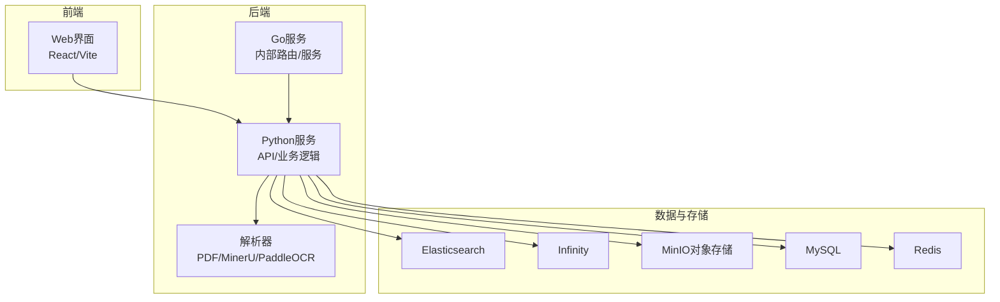
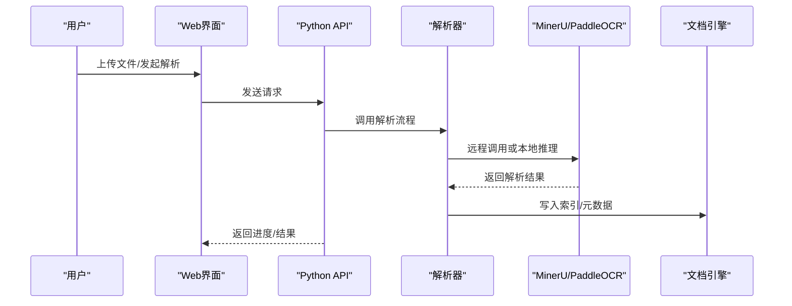
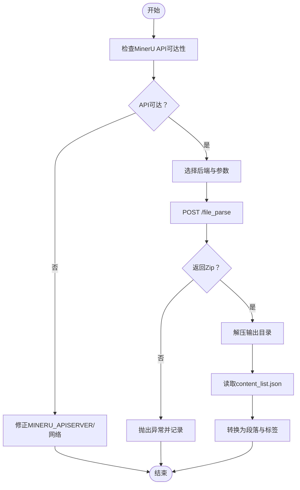
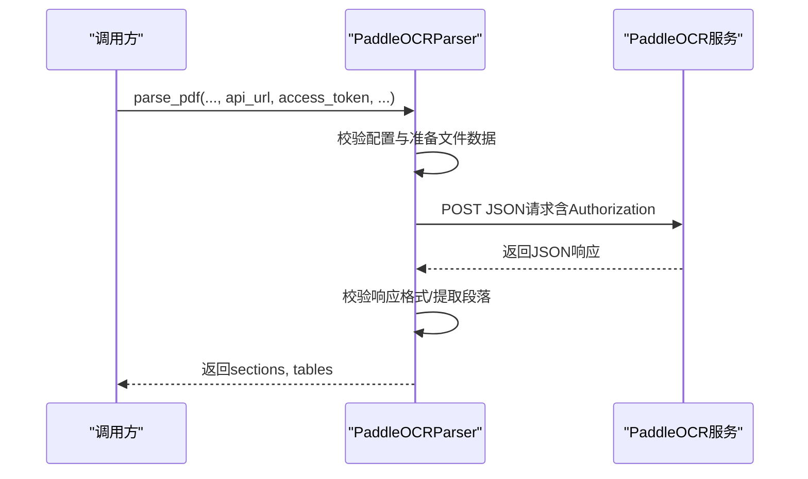
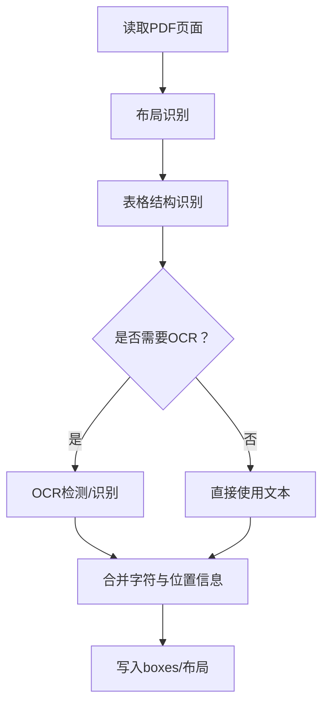
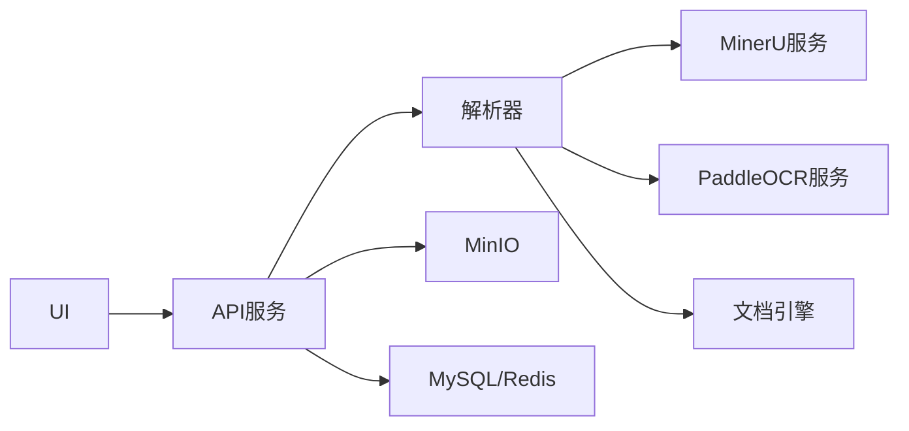

# 常见问题解答

<cite>
**本文引用的文件**
- [docs/faq.mdx](file://docs/faq.mdx)
- [README.md](file://README.md)
- [docker/.env](file://docker/.env)
- [docker/docker-compose.yml](file://docker/docker-compose.yml)
- [deepdoc/parser/pdf_parser.py](file://deepdoc/parser/pdf_parser.py)
- [deepdoc/parser/mineru_parser.py](file://deepdoc/parser/mineru_parser.py)
- [deepdoc/parser/paddleocr_parser.py](file://deepdoc/parser/paddleocr_parser.py)
- [rag/llm/ocr_model.py](file://rag/llm/ocr_model.py)
- [internal/common/error_code.go](file://internal/common/error_code.go)
- [web/src/pages/user-setting/data-source/log-table.tsx](file://web/src/pages/user-setting/data-source/log-table.tsx)
- [rag/flow/parser/parser.py](file://rag/flow/parser/parser.py)
- [internal/cli/benchmark.go](file://internal/cli/benchmark.go)
- [common/data_source/utils.py](file://common/data_source/utils.py)
- [web/src/components/fallback-component/index.tsx](file://web/src/components/fallback-component/index.tsx)
- [rag/llm/chat_model.py](file://rag/llm/chat_model.py)
</cite>

## 目录
1. [简介](#简介)
2. [项目结构](#项目结构)
3. [核心组件](#核心组件)
4. [架构总览](#架构总览)
5. [详细组件分析](#详细组件分析)
6. [依赖关系分析](#依赖关系分析)
7. [性能考虑](#性能考虑)
8. [故障排查指南](#故障排查指南)
9. [结论](#结论)
10. [附录](#附录)

## 简介
本FAQ面向RAGFlow使用者，聚焦于部署、性能与使用三大类高频问题，覆盖如下主题：
- 部署相关：无法访问HuggingFace导致的PDF解析失败、网络异常导致的登录问题、ES容器启动失败等诊断与修复。
- 性能相关：文档解析卡在百分比进度、内存不足导致的解析中断、批量处理吞吐量优化等调优方案。
- 使用问题：如何获取API密钥、如何切换文档引擎、如何配置MinerU与PaddleOCR等操作指南。

## 项目结构
RAGFlow采用多语言混合架构，后端以Go/Python为主，前端基于React/Vite，容器化通过Docker Compose编排，文档与FAQ集中在docs目录，部署配置位于docker目录，核心解析能力位于deepdoc与rag模块，API与服务层位于api与internal目录。

图表来源
- [docker/docker-compose.yml:1-135](file://docker/docker-compose.yml#L1-L135)
- [README.md:140-144](file://README.md#L140-L144)

章节来源
- [docker/docker-compose.yml:1-135](file://docker/docker-compose.yml#L1-L135)
- [README.md:140-144](file://README.md#L140-L144)

## 核心组件
- 文档解析与OCR
  - PDF解析器：支持布局识别、表格结构识别、OCR回退策略、字体编码检测与纠偏。
  - MinerU解析器：远程调用MinerU API进行多后端解析（pipeline、vlm-*），支持公式与表格抽取。
  - PaddleOCR解析器：远程调用PaddleOCR API或自托管服务，支持多算法参数配置。
- 引擎与存储
  - 文档引擎：默认Elasticsearch，可切换Infinity、OpenSearch、OceanBase、SeekDB。
  - 对象存储：MinIO用于文件上传与缓存。
- 错误码与日志
  - 统一错误码映射，前端日志表格展示异常堆栈，便于定位问题。
- 批处理与并发
  - 线程池执行器、批大小控制、基准测试工具，支撑高吞吐场景。

章节来源
- [deepdoc/parser/pdf_parser.py:56-110](file://deepdoc/parser/pdf_parser.py#L56-L110)
- [deepdoc/parser/mineru_parser.py:137-243](file://deepdoc/parser/mineru_parser.py#L137-L243)
- [deepdoc/parser/paddleocr_parser.py:161-235](file://deepdoc/parser/paddleocr_parser.py#L161-L235)
- [docker/.env:13-28](file://docker/.env#L13-L28)
- [web/src/pages/user-setting/data-source/log-table.tsx:93-126](file://web/src/pages/user-setting/data-source/log-table.tsx#L93-L126)
- [internal/cli/benchmark.go:53-190](file://internal/cli/benchmark.go#L53-L190)

## 架构总览
RAGFlow的解析链路从Web/UI触发，经由API/服务层进入解析器，解析器根据配置选择本地模型或远程服务（MinerU/PaddleOCR），并将结果写入文档引擎与对象存储。日志与错误通过统一错误码与前端日志面板呈现。

图表来源
- [rag/flow/parser/parser.py:374-405](file://rag/flow/parser/parser.py#L374-L405)
- [deepdoc/parser/mineru_parser.py:245-325](file://deepdoc/parser/mineru_parser.py#L245-L325)
- [deepdoc/parser/paddleocr_parser.py:237-301](file://deepdoc/parser/paddleocr_parser.py#L237-L301)

## 详细组件分析

### 组件A：MinerU解析器
- 功能要点
  - 支持多种后端：pipeline、vlm-transformers、vlm-mlx-engine、vlm-vllm-engine、vlm-vllm-async-engine、vlm-lmdeploy-engine、vlm-http-client。
  - 自动探测MinerU API可用性与远程vLLM服务可达性。
  - 流式下载并解压MinerU输出Zip，解析content_list.json生成段落与位置标签。
- 典型问题
  - 无法访问MinerU API或远程vLLM服务。
  - 输出目录权限或路径不安全导致解压失败。
- 解决步骤
  - 检查MINERU_APISERVER与MINERU_SERVER_URL配置，确认HTTP可达。
  - 若使用临时目录，确保删除策略与权限设置正确。
  - 在UI或环境变量中配置后端与语言参数，避免pipeline后端的语言限制。

图表来源
- [deepdoc/parser/mineru_parser.py:205-325](file://deepdoc/parser/mineru_parser.py#L205-L325)
- [deepdoc/parser/mineru_parser.py:504-554](file://deepdoc/parser/mineru_parser.py#L504-L554)

章节来源
- [deepdoc/parser/mineru_parser.py:137-243](file://deepdoc/parser/mineru_parser.py#L137-L243)
- [deepdoc/parser/mineru_parser.py:590-682](file://deepdoc/parser/mineru_parser.py#L590-L682)

### 组件B：PaddleOCR解析器
- 功能要点
  - 支持官方API与自托管服务两种模式。
  - 将PDF转为图像序列，按位置标签裁剪图片，支持Markdown清理与可视化。
  - 参数映射到API字段，支持丰富的算法配置项。
- 典型问题
  - API URL未配置或鉴权失败。
  - 远程服务响应格式异常或超时。
- 解决步骤
  - 在UI或环境变量中配置PADDLEOCR_API_URL、PADDLEOCR_ALGORITHM、PADDLEOCR_ACCESS_TOKEN。
  - 确认API返回的errorCode与result结构符合预期。
  - 调整请求超时与算法参数，提升稳定性与效果。

图表来源
- [deepdoc/parser/paddleocr_parser.py:237-301](file://deepdoc/parser/paddleocr_parser.py#L237-L301)
- [deepdoc/parser/paddleocr_parser.py:347-385](file://deepdoc/parser/paddleocr_parser.py#L347-L385)

章节来源
- [deepdoc/parser/paddleocr_parser.py:161-235](file://deepdoc/parser/paddleocr_parser.py#L161-L235)
- [deepdoc/parser/paddleocr_parser.py:237-301](file://deepdoc/parser/paddleocr_parser.py#L237-L301)

### 组件C：PDF解析器（DeepDoc）
- 功能要点
  - 布局识别、表格结构识别、OCR回退策略、字体编码检测与纠偏。
  - 多设备并行限制、特征工程辅助上下文拼接。
- 典型问题
  - 字体编码异常导致文本乱码，需OCR回退。
  - Subset字体导致的ASCII符号填充，需检测并回退。
- 解决步骤
  - 检查PDF字体嵌入与编码，必要时启用OCR回退策略。
  - 调整并行设备数与内存限制，避免解析卡顿。

图表来源
- [deepdoc/parser/pdf_parser.py:798-800](file://deepdoc/parser/pdf_parser.py#L798-L800)
- [deepdoc/parser/pdf_parser.py:707-796](file://deepdoc/parser/pdf_parser.py#L707-L796)

章节来源
- [deepdoc/parser/pdf_parser.py:56-110](file://deepdoc/parser/pdf_parser.py#L56-L110)
- [deepdoc/parser/pdf_parser.py:204-320](file://deepdoc/parser/pdf_parser.py#L204-L320)

## 依赖关系分析
- 组件耦合
  - 解析器依赖OCR与布局识别模型，同时依赖文档引擎写入索引。
  - UI通过API层间接依赖MinerU/PaddleOCR服务，需关注网络连通性。
- 外部依赖
  - HuggingFace镜像源（HF_ENDPOINT）、MinIO、Elasticsearch/Infinity、MySQL、Redis。
- 可能的循环依赖
  - 解析器与服务层通过接口调用，未见直接循环导入。

图表来源
- [docker/docker-compose.yml:4-49](file://docker/docker-compose.yml#L4-L49)
- [docker/.env:13-28](file://docker/.env#L13-L28)

章节来源
- [docker/docker-compose.yml:1-135](file://docker/docker-compose.yml#L1-L135)
- [docker/.env:13-28](file://docker/.env#L13-L28)

## 性能考虑
- 批量处理吞吐量优化
  - 通过环境变量控制批大小：DOC_BULK_SIZE与EMBEDDING_BATCH_SIZE，默认分别为4与16。
  - 合理设置线程池最大工作线程数（THREAD_POOL_MAX_WORKERS），平衡并发与资源占用。
- 并发与资源
  - GPU/CPU设备选择影响解析速度；合理分配并行设备数量。
  - 内存限制（MEM_LIMIT）需与批大小匹配，避免解析中断。
- 基准测试
  - 提供并发基准测试工具，支持单并发与多并发对比，便于评估系统瓶颈。

章节来源
- [docker/.env:211-217](file://docker/.env#L211-L217)
- [docker/.env:287-288](file://docker/.env#L287-L288)
- [internal/cli/benchmark.go:53-190](file://internal/cli/benchmark.go#L53-L190)

## 故障排查指南

### 部署与网络
- 无法访问HuggingFace导致的PDF解析失败
  - 现象：下载OCR模型失败，报错找不到缓存文件。
  - 原因：默认从huggingface.co下载，内网不可达。
  - 解决步骤：
    - 设置HF_ENDPOINT为镜像站（如https://hf-mirror.com）。
    - 若仍无法访问，手动下载资源至本地并挂载到容器。
  - 预防措施：在部署前确认网络策略与代理配置。

章节来源
- [docs/faq.mdx:154-182](file://docs/faq.mdx#L154-L182)
- [docs/faq.mdx:185-195](file://docs/faq.mdx#L185-L195)
- [README.md:344-349](file://README.md#L344-L349)

- 网络异常导致登录问题
  - 现象：浏览器提示网络异常，无法登录。
  - 原因：RAGFlow未完全初始化或容器健康状态异常。
  - 解决步骤：
    - 查看容器日志，等待初始化完成（出现特定启动日志）。
    - 确认端口映射与防火墙放行。
  - 预防措施：遵循启动顺序，先启动依赖服务再启动应用。

章节来源
- [docs/faq.mdx:204-224](file://docs/faq.mdx#L204-L224)
- [README.md:220-242](file://README.md#L220-L242)

- ES容器启动失败
  - 现象：ES容器退出或重启。
  - 原因：vm.max_map_count未设置或过低。
  - 解决步骤：
    - 设置vm.max_map_count>=262144，并持久化到系统配置。
    - 检查ES健康状态与端口映射。
  - 预防措施：首次部署即配置内核参数。

章节来源
- [docs/faq.mdx:336-340](file://docs/faq.mdx#L336-L340)
- [docs/faq.mdx:332-333](file://docs/faq.mdx#L332-L333)

### 解析与性能
- 文档解析卡在百分比进度
  - 现象：解析进度长时间停滞。
  - 原因：依赖外部服务（如MinerU/PaddleOCR）不可达或超时。
  - 解决步骤：
    - 重试解析任务。
    - 检查MinerU/PaddleOCR服务可用性与网络连通。
    - 查看RAGFlow服务器日志定位具体阶段。
  - 预防措施：提前验证外部服务可达性与超时阈值。

章节来源
- [docs/faq.mdx:235-250](file://docs/faq.mdx#L235-L250)

- PDF解析在接近完成时被杀
  - 现象：解析接近完成但被终止。
  - 原因：内存不足触发OOMKiller。
  - 解决步骤：
    - 提升MEM_LIMIT，重启服务使变更生效。
  - 预防措施：根据文档规模调整内存上限与批大小。

章节来源
- [docs/faq.mdx:252-269](file://docs/faq.mdx#L252-L269)
- [docker/.env:63-65](file://docker/.env#L63-L65)

- 文档引擎索引失败
  - 现象：Index failure。
  - 原因：Elasticsearch服务不可用。
  - 解决步骤：
    - 检查ES容器健康状态与端口。
    - 调整vm.max_map_count与资源配额。
  - 预防措施：定期监控ES健康与资源使用。

章节来源
- [docs/faq.mdx:273-276](file://docs/faq.mdx#L273-L276)
- [docs/faq.mdx:312-333](file://docs/faq.mdx#L312-L333)

- 日志查看与组件状态检查
  - 日志：使用tail命令查看容器日志。
  - 状态：docker ps检查容器运行状态，结合健康检查脚本验证服务可用性。
  - 建议：将关键服务加入健康检查，避免仅凭容器状态判断。

章节来源
- [docs/faq.mdx:279-284](file://docs/faq.mdx#L279-L284)
- [docs/faq.mdx:287-310](file://docs/faq.mdx#L287-L310)

### 使用问题
- 如何获取API密钥
  - 通过UI或文档指引申请与配置API密钥，确保在服务配置中填写对应字段。
  - 参考：获取API密钥的操作指南。

章节来源
- [docs/faq.mdx:440-442](file://docs/faq.mdx#L440-L442)

- 如何切换文档引擎
  - 步骤：停止容器、设置DOC_ENGINE为infinity、重启容器。
  - 注意：该操作会删除卷内数据，请提前备份。
  - 参考：切换文档引擎的详细说明。

章节来源
- [docs/faq.mdx:452-471](file://docs/faq.mdx#L452-L471)
- [README.md:276-298](file://README.md#L276-L298)

- 如何配置MinerU
  - 方法一：通过环境变量自动配置（MINERU_APISERVER、MINERU_BACKEND、MINERU_SERVER_URL、MINERU_OUTPUT_DIR、MINERU_DELETE_OUTPUT）。
  - 方法二：通过UI在Model providers页面配置MinerU参数。
  - 在数据集配置中选择MinerU作为PDF解析器。
  - 注意：MinerU第三方视觉模型为实验特性，建议谨慎使用。

章节来源
- [docs/faq.mdx:496-527](file://docs/faq.mdx#L496-L527)
- [docs/faq.mdx:529-550](file://docs/faq.mdx#L529-L550)
- [docs/faq.mdx:553-569](file://docs/faq.mdx#L553-L569)
- [rag/llm/ocr_model.py:33-94](file://rag/llm/ocr_model.py#L33-L94)

- 如何配置PaddleOCR
  - 官方API模式：配置PADDLEOCR_API_URL、PADDLEOCR_ALGORITHM、PADDLEOCR_ACCESS_TOKEN。
  - 自托管模式：配置PADDLEOCR_API_URL指向自建服务，无需Token。
  - 在数据集配置中选择PaddleOCR作为PDF解析器。
  - 环境变量与UI均可配置，UI优先级更高。

章节来源
- [docs/faq.mdx:588-665](file://docs/faq.mdx#L588-L665)
- [rag/llm/ocr_model.py:97-137](file://rag/llm/ocr_model.py#L97-L137)

- 批量处理吞吐量优化
  - 调整DOC_BULK_SIZE与EMBEDDING_BATCH_SIZE，结合THREAD_POOL_MAX_WORKERS与MEM_LIMIT。
  - 使用基准测试工具评估不同配置下的吞吐与延迟。

章节来源
- [docker/.env:211-217](file://docker/.env#L211-L217)
- [docker/.env:287-288](file://docker/.env#L287-L288)
- [internal/cli/benchmark.go:146-190](file://internal/cli/benchmark.go#L146-L190)

- 前端错误与异常展示
  - 前端提供错误边界组件，支持显示错误详情与重试。
  - 数据源详情页的日志表格可展开查看完整异常堆栈。

章节来源
- [web/src/components/fallback-component/index.tsx:1-65](file://web/src/components/fallback-component/index.tsx#L1-L65)
- [web/src/pages/user-setting/data-source/log-table.tsx:93-126](file://web/src/pages/user-setting/data-source/log-table.tsx#L93-L126)

- LLM错误分类与处理
  - 统一错误码映射，便于前端与后端识别与提示。
  - 常见错误类型：配额/计费、速率限制、认证、请求格式、服务器、超时、网络、内容过滤、模型不存在等。

章节来源
- [internal/common/error_code.go:49-82](file://internal/common/error_code.go#L49-L82)
- [rag/llm/chat_model.py:1280-1299](file://rag/llm/chat_model.py#L1280-L1299)

## 结论
本FAQ围绕部署、性能与使用三类高频问题，提供了从现象、原因到解决步骤与预防措施的闭环指导。建议在部署前完成网络与内核参数配置，在生产环境中结合日志与健康检查持续监控，并通过批大小与并发参数进行性能调优。对于MinerU与PaddleOCR等外部服务，务必提前验证其可用性与超时策略，确保解析链路稳定。

## 附录
- 快速参考
  - 网络与镜像：HF_ENDPOINT、MinIO、ES/Infinity、MySQL、Redis。
  - 批处理：DOC_BULK_SIZE、EMBEDDING_BATCH_SIZE、THREAD_POOL_MAX_WORKERS、MEM_LIMIT。
  - 引擎切换：DOC_ENGINE、docker-compose down -v（注意数据丢失风险）。
  - 外部解析：MinerU后端与PaddleOCR算法参数。

章节来源
- [docker/.env:13-28](file://docker/.env#L13-L28)
- [docker/.env:211-217](file://docker/.env#L211-L217)
- [docker/.env:287-288](file://docker/.env#L287-L288)
- [README.md:276-298](file://README.md#L276-L298)
- [docs/faq.mdx:452-471](file://docs/faq.mdx#L452-L471)