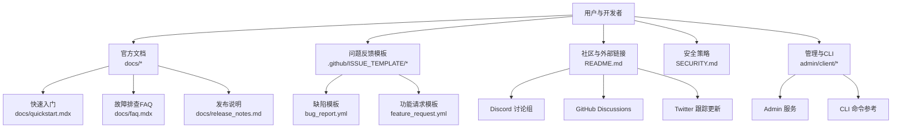
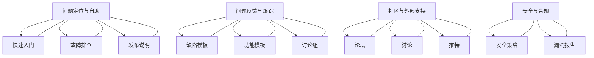
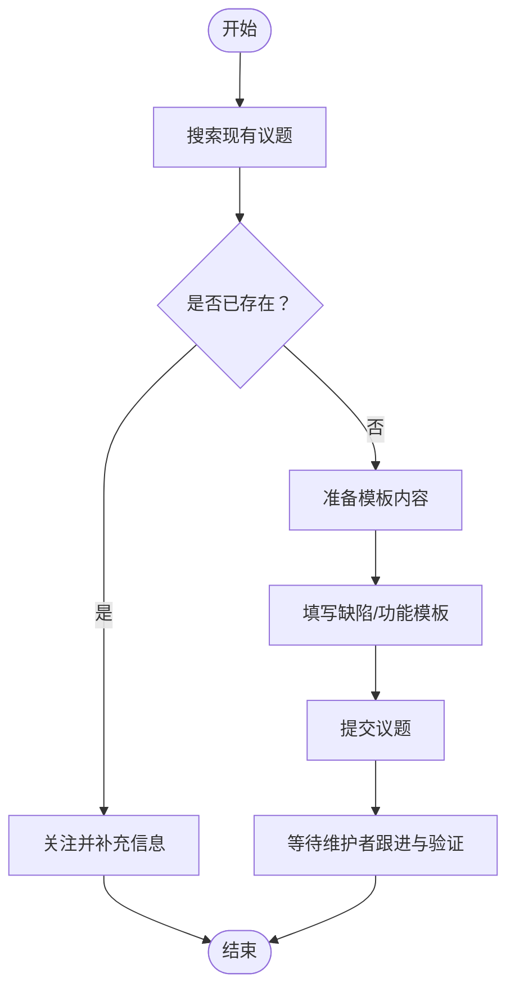
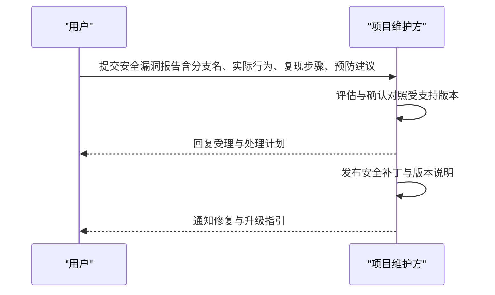
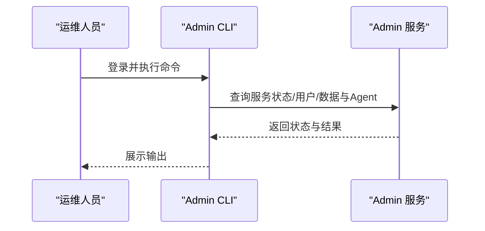
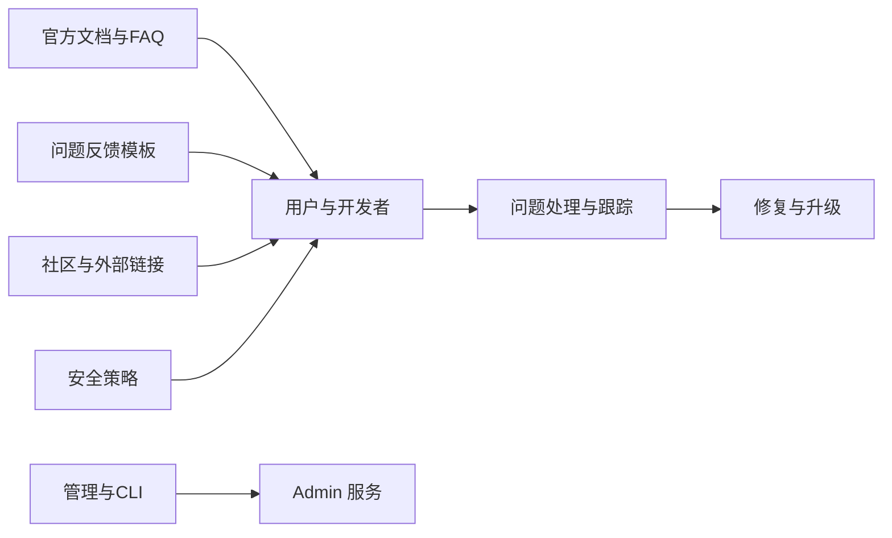

# 支持资源与联系方式

<cite>
**本文引用的文件**
- [README.md](file://README.md)
- [docs/faq.mdx](file://docs/faq.mdx)
- [docs/quickstart.mdx](file://docs/quickstart.mdx)
- [docs/release_notes.md](file://docs/release_notes.md)
- [SECURITY.md](file://SECURITY.md)
- [.github/ISSUE_TEMPLATE/bug_report.yml](file://.github/ISSUE_TEMPLATE/bug_report.yml)
- [.github/ISSUE_TEMPLATE/feature_request.yml](file://.github/ISSUE_TEMPLATE/feature_request.yml)
- [docs/develop/contributing.md](file://docs/develop/contributing.md)
- [admin/client/README.md](file://admin/client/README.md)
- [admin/client/COMMAND.md](file://admin/client/COMMAND.md)
</cite>

## 目录
1. [简介](#简介)
2. [项目结构](#项目结构)
3. [核心组件](#核心组件)
4. [架构总览](#架构总览)
5. [详细组件分析](#详细组件分析)
6. [依赖关系分析](#依赖关系分析)
7. [性能考虑](#性能考虑)
8. [故障排查指南](#故障排查指南)
9. [结论](#结论)
10. [附录](#附录)

## 简介
本指南面向RAGFlow用户与开发者，系统性梳理官方支持渠道、问题反馈流程、技术社区资源、付费支持选项以及安全漏洞报告流程，帮助您快速获得及时有效的技术支持。

## 项目结构
- 官方文档与FAQ：位于 docs 目录，涵盖快速入门、故障排查、发布说明等。
- 支持与反馈模板：位于 .github/ISSUE_TEMPLATE，提供缺陷与功能请求的标准表单。
- 社区与外部链接：位于仓库根目录 README.md，包含Discord、Twitter、GitHub Discussions等官方渠道。
- 安全策略：位于 SECURITY.md，明确受支持版本与漏洞报告流程。
- 管理与运维工具：位于 admin/client，提供管理服务与CLI命令参考，便于系统运维与排障。

**图表来源**
- [README.md](file://README.md)
- [docs/quickstart.mdx](file://docs/quickstart.mdx)
- [docs/faq.mdx](file://docs/faq.mdx)
- [docs/release_notes.md](file://docs/release_notes.md)
- [.github/ISSUE_TEMPLATE/bug_report.yml](file://.github/ISSUE_TEMPLATE/bug_report.yml)
- [.github/ISSUE_TEMPLATE/feature_request.yml](file://.github/ISSUE_TEMPLATE/feature_request.yml)
- [SECURITY.md](file://SECURITY.md)
- [admin/client/README.md](file://admin/client/README.md)
- [admin/client/COMMAND.md](file://admin/client/COMMAND.md)

**章节来源**
- [README.md](file://README.md)
- [docs/quickstart.mdx](file://docs/quickstart.mdx)
- [docs/faq.mdx](file://docs/faq.mdx)
- [docs/release_notes.md](file://docs/release_notes.md)
- [.github/ISSUE_TEMPLATE/bug_report.yml](file://.github/ISSUE_TEMPLATE/bug_report.yml)
- [.github/ISSUE_TEMPLATE/feature_request.yml](file://.github/ISSUE_TEMPLATE/feature_request.yml)
- [SECURITY.md](file://SECURITY.md)
- [admin/client/README.md](file://admin/client/README.md)
- [admin/client/COMMAND.md](file://admin/client/COMMAND.md)

## 核心组件
- 官方文档与FAQ
  - 快速入门：部署、配置、创建数据集与对话的完整流程。
  - 故障排查FAQ：覆盖网络异常、解析卡顿、ES连接失败、HuggingFace访问等问题的定位与修复步骤。
  - 发布说明：版本特性、改进与已知问题，便于升级与回溯。
- 问题反馈模板
  - 缺陷模板：强制填写工作区提交ID、镜像版本、环境信息、实际行为、期望行为、复现步骤与附加信息。
  - 功能请求模板：描述问题背景、期望功能、实现思路、文档/采用场景与补充信息。
- 社区与外部链接
  - Discord 讨论组、GitHub Discussions、Twitter。
- 安全策略
  - 明确受支持版本范围、漏洞报告流程（分支名、实际行为、复现步骤、预防建议）。
- 管理与CLI
  - Admin 服务与CLI用于系统监控、用户与资源管理、服务状态查询与运维操作。

**章节来源**
- [docs/quickstart.mdx](file://docs/quickstart.mdx)
- [docs/faq.mdx](file://docs/faq.mdx)
- [docs/release_notes.md](file://docs/release_notes.md)
- [.github/ISSUE_TEMPLATE/bug_report.yml](file://.github/ISSUE_TEMPLATE/bug_report.yml)
- [.github/ISSUE_TEMPLATE/feature_request.yml](file://.github/ISSUE_TEMPLATE/feature_request.yml)
- [README.md](file://README.md)
- [SECURITY.md](file://SECURITY.md)
- [admin/client/README.md](file://admin/client/README.md)
- [admin/client/COMMAND.md](file://admin/client/COMMAND.md)

## 架构总览
下图展示用户在不同支持渠道之间的交互路径，以及与官方文档、FAQ、模板、社区与安全策略的关联。

**图表来源**
- [docs/quickstart.mdx](file://docs/quickstart.mdx)
- [docs/faq.mdx](file://docs/faq.mdx)
- [docs/release_notes.md](file://docs/release_notes.md)
- [.github/ISSUE_TEMPLATE/bug_report.yml](file://.github/ISSUE_TEMPLATE/bug_report.yml)
- [.github/ISSUE_TEMPLATE/feature_request.yml](file://.github/ISSUE_TEMPLATE/feature_request.yml)
- [README.md](file://README.md)
- [SECURITY.md](file://SECURITY.md)

## 详细组件分析

### 官方支持渠道与使用指南
- 官方文档与FAQ
  - 快速入门：包含前置条件、启动服务、配置LLM、创建数据集、干预解析与设置AI对话的步骤。
  - 故障排查FAQ：覆盖网络异常、HuggingFace访问、ES健康检查、解析卡顿、内存不足、容器重启等常见问题。
  - 发布说明：按版本汇总新特性、模型支持、数据源扩展、API变更与已修复问题。
- 社区与外部链接
  - Discord 讨论组、GitHub Discussions、Twitter，适合提问、分享经验与获取最新动态。
- 安全策略
  - 受支持版本范围、漏洞报告流程（含分支名、实际行为、复现步骤、预防建议）。

**章节来源**
- [docs/quickstart.mdx](file://docs/quickstart.mdx)
- [docs/faq.mdx](file://docs/faq.mdx)
- [docs/release_notes.md](file://docs/release_notes.md)
- [README.md](file://README.md)
- [SECURITY.md](file://SECURITY.md)

### 问题反馈流程（缺陷与功能请求）
- 提交前准备
  - 在现有议题中搜索是否已有类似问题；确认使用英文提交；按模板填写必要字段。
- 缺陷反馈（Bug Report）
  - 强制字段：工作区提交ID、镜像版本、其他环境信息、实际行为、期望行为、复现步骤、附加信息。
- 功能请求（Feature Request）
  - 描述问题背景、期望功能、实现思路、文档/采用场景与补充信息。
- 提交后
  - 维护者将根据模板完整性与复现情况评估优先级与处理计划。

**图表来源**
- [.github/ISSUE_TEMPLATE/bug_report.yml](file://.github/ISSUE_TEMPLATE/bug_report.yml)
- [.github/ISSUE_TEMPLATE/feature_request.yml](file://.github/ISSUE_TEMPLATE/feature_request.yml)

**章节来源**
- [.github/ISSUE_TEMPLATE/bug_report.yml](file://.github/ISSUE_TEMPLATE/bug_report.yml)
- [.github/ISSUE_TEMPLATE/feature_request.yml](file://.github/ISSUE_TEMPLATE/feature_request.yml)

### 技术社区资源与使用指南
- Discord 讨论组：适合实时交流与快速答疑。
- GitHub Discussions：适合深入讨论与长期追踪。
- Twitter：关注官方动态与路线图更新。
- 贡献指南：欢迎通过PR、测试用例、文档更新等方式参与开源协作。

**章节来源**
- [README.md](file://README.md)
- [docs/develop/contributing.md](file://docs/develop/contributing.md)

### 付费技术支持选项
- 当前仓库未提供付费技术支持的申请流程、合同条款或紧急响应时间承诺等信息。若需商业支持，请联系项目维护方或查看官方网站公告以获取最新信息。

[本节为通用说明，不直接分析具体文件]

### 安全漏洞报告流程
- 受支持版本范围：明确当前受支持的版本区间。
- 报告流程：
  - 分支名：main
  - 实际行为：示例中指出某函数仍存在可通过pickle导入导致的代码执行风险
  - 复现步骤：提供PoC与预期结果截图
  - 预防建议：在getattr调用前严格过滤模块与名称
- 建议在提交前先查阅“故障排查FAQ”中的相关章节，确认是否为已知问题或可规避场景。

**图表来源**
- [SECURITY.md](file://SECURITY.md)

**章节来源**
- [SECURITY.md](file://SECURITY.md)

### 管理与CLI工具（运维与排障）
- Admin 服务与CLI
  - 服务端：监控RAGFlow服务器、任务执行器与MySQL、Infinity、Elasticsearch、Redis、MinIO等依赖服务的健康状态与资源使用。
  - CLI：支持服务列表、用户管理、数据与Agent查询、基准测试等命令。
- 使用要点
  - 启动Admin服务或启用Docker编排中的Admin服务端口。
  - 通过CLI连接Admin服务，输入超级用户密码登录，使用分号结尾的命令进行操作。

**图表来源**
- [admin/client/README.md](file://admin/client/README.md)
- [admin/client/COMMAND.md](file://admin/client/COMMAND.md)

**章节来源**
- [admin/client/README.md](file://admin/client/README.md)
- [admin/client/COMMAND.md](file://admin/client/COMMAND.md)

## 依赖关系分析
- 支持渠道与文档的耦合度低，便于独立演进与维护。
- 管理CLI与Admin服务存在直接依赖，运维排障能力依赖于Admin服务的可用性。
- 安全策略与问题反馈模板共同构成安全事件处理闭环。

**图表来源**
- [docs/faq.mdx](file://docs/faq.mdx)
- [.github/ISSUE_TEMPLATE/bug_report.yml](file://.github/ISSUE_TEMPLATE/bug_report.yml)
- [README.md](file://README.md)
- [SECURITY.md](file://SECURITY.md)
- [admin/client/README.md](file://admin/client/README.md)

**章节来源**
- [docs/faq.mdx](file://docs/faq.mdx)
- [.github/ISSUE_TEMPLATE/bug_report.yml](file://.github/ISSUE_TEMPLATE/bug_report.yml)
- [README.md](file://README.md)
- [SECURITY.md](file://SECURITY.md)
- [admin/client/README.md](file://admin/client/README.md)

## 性能考虑
- 解析性能与资源占用：FAQ中提供解析卡顿、内存不足、ES健康检查等指导，有助于定位性能瓶颈。
- 版本升级：发布说明中记录了性能优化与改进，建议在升级时关注相关变更。

**章节来源**
- [docs/faq.mdx](file://docs/faq.mdx)
- [docs/release_notes.md](file://docs/release_notes.md)

## 故障排查指南
- 常见问题定位步骤
  - 网络异常：确认服务完全初始化后再登录，查看容器日志与健康检查。
  - HuggingFace访问失败：切换镜像源或挂载本地缓存目录。
  - ES连接失败：检查vm.max_map_count、容器健康状态与端口映射。
  - 解析卡顿：重试解析、检查任务进程、确认网络可达性。
  - 内存不足：提高MEM_LIMIT并重启服务。
- 日志与状态检查
  - 查看RAGFlow日志与各组件状态，结合发布说明中的已知问题进行比对。

**章节来源**
- [docs/faq.mdx](file://docs/faq.mdx)
- [docs/quickstart.mdx](file://docs/quickstart.mdx)
- [docs/release_notes.md](file://docs/release_notes.md)

## 结论
- 建议优先通过官方文档与FAQ自助解决问题；遇到复杂问题时，使用缺陷模板提交清晰的问题描述与复现步骤。
- 对于安全问题，请遵循安全策略中的报告流程。
- 如需更深入的运维支持，可使用Admin服务与CLI进行系统状态检查与资源管理。
- 商业支持请以项目维护方公告为准。

[本节为总结性内容，不直接分析具体文件]

## 附录
- 快速入口
  - 官方文档与FAQ：docs/quickstart.mdx、docs/faq.mdx、docs/release_notes.md
  - 问题反馈模板：.github/ISSUE_TEMPLATE/bug_report.yml、.github/ISSUE_TEMPLATE/feature_request.yml
  - 社区与外部链接：README.md
  - 安全策略：SECURITY.md
  - 管理与CLI：admin/client/README.md、admin/client/COMMAND.md

**章节来源**
- [docs/quickstart.mdx](file://docs/quickstart.mdx)
- [docs/faq.mdx](file://docs/faq.mdx)
- [docs/release_notes.md](file://docs/release_notes.md)
- [.github/ISSUE_TEMPLATE/bug_report.yml](file://.github/ISSUE_TEMPLATE/bug_report.yml)
- [.github/ISSUE_TEMPLATE/feature_request.yml](file://.github/ISSUE_TEMPLATE/feature_request.yml)
- [README.md](file://README.md)
- [SECURITY.md](file://SECURITY.md)
- [admin/client/README.md](file://admin/client/README.md)
- [admin/client/COMMAND.md](file://admin/client/COMMAND.md)