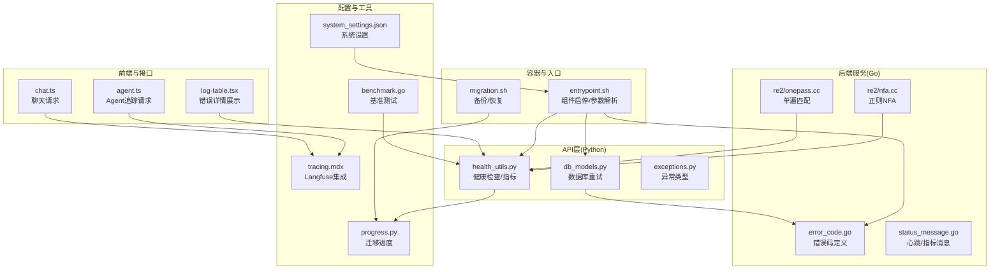
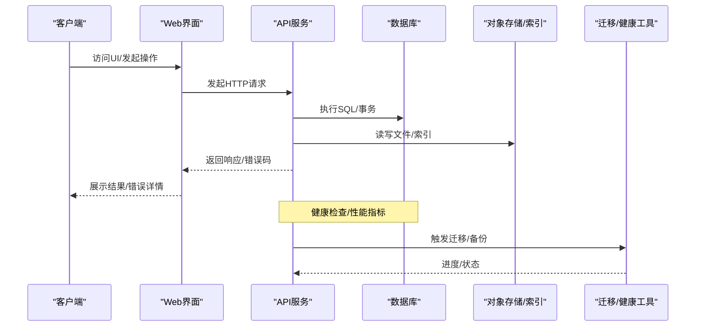
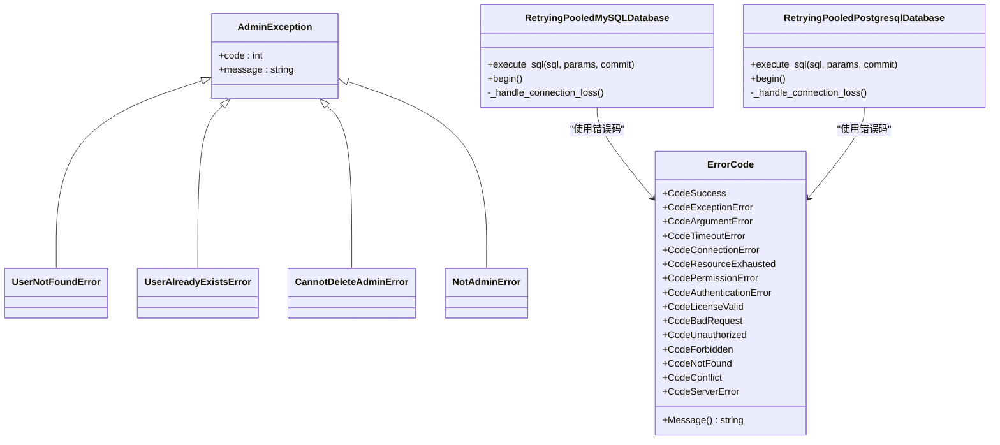
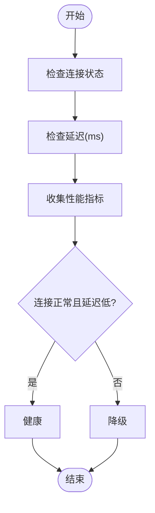
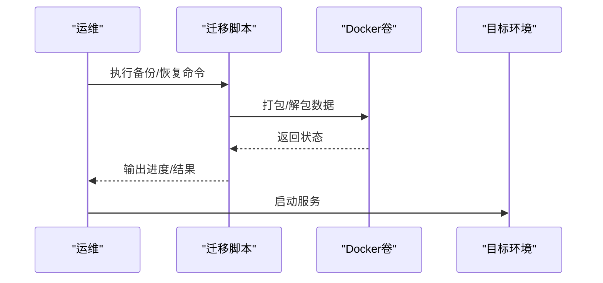
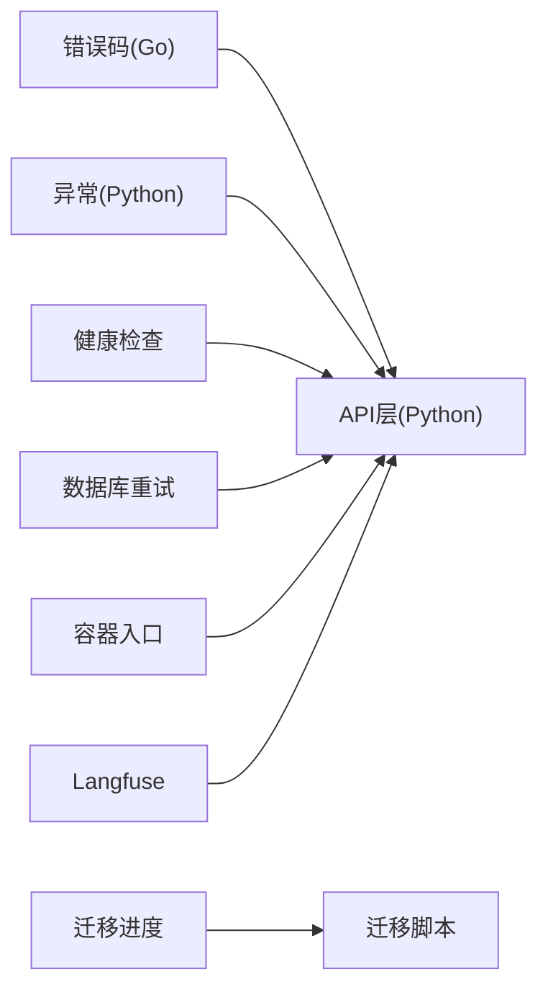

# 故障排除

<cite>
**本文引用的文件**
- [internal/common/error_code.go](file://internal/common/error_code.go)
- [api/common/exceptions.py](file://api/common/exceptions.py)
- [common/exceptions.py](file://common/exceptions.py)
- [docs/faq.mdx](file://docs/faq.mdx)
- [docs/administrator/backup_and_migration.md](file://docs/administrator/backup_and_migration.md)
- [docs/administrator/upgrade_ragflow.mdx](file://docs/administrator/upgrade_ragflow.mdx)
- [docs/administrator/tracing.mdx](file://docs/administrator/tracing.mdx)
- [docker/entrypoint.sh](file://docker/entrypoint.sh)
- [docker/migration.sh](file://docker/migration.sh)
- [tools/es-to-oceanbase-migration/src/es_ob_migration/progress.py](file://tools/es-to-oceanbase-migration/src/es_ob_migration/progress.py)
- [api/utils/health_utils.py](file://api/utils/health_utils.py)
- [internal/cpp/re2/nfa.cc](file://internal/cpp/re2/nfa.cc)
- [internal/cpp/re2/onepass.cc](file://internal/cpp/re2/onepass.cc)
- [internal/cli/benchmark.go](file://internal/cli/benchmark.go)
- [api/db/db_models.py](file://api/db/db_models.py)
- [web/src/pages/user-setting/data-source/data-source-detail-page/log-table.tsx](file://web/src/pages/user-setting/data-source/data-source-detail-page/log-table.tsx)
- [conf/system_settings.json](file://conf/system_settings.json)
- [internal/common/status_message.go](file://internal/common/status_message.go)
- [web/src/interfaces/request/agent.ts](file://web/src/interfaces/request/agent.ts)
- [web/src/interfaces/request/chat.ts](file://web/src/interfaces/request/chat.ts)
</cite>

## 目录
1. 引言
2. 项目结构
3. 核心组件
4. 架构总览
5. 详细组件分析
6. 依赖分析
7. 性能考虑
8. 故障排除指南
9. 结论
10. 附录

## 引言
本指南面向RAGFlow使用者与运维工程师，聚焦于部署、性能、集成与升级等常见故障场景，提供系统化的定位思路、排障步骤、错误码对照与应急方案。内容基于仓库内源码与官方文档，覆盖错误码体系、健康检查、日志与可观测性、备份迁移、升级与回滚、以及调试工具推荐。

## 项目结构
RAGFlow由多语言模块构成：Go后端服务、Python API层、前端Web界面、容器化脚本与工具链。故障排查涉及以下关键路径：
- 后端错误码与异常类型（Go）
- Python异常与数据库重试机制
- 健康检查与性能指标
- 容器入口参数与组件启停控制
- 备份迁移脚本与进度管理
- 文档引擎正则匹配实现（影响解析性能）
- 可观测性与追踪（Langfuse）

**图表来源**
- [docker/entrypoint.sh:1-149](file://docker/entrypoint.sh#L1-L149)
- [internal/common/error_code.go:1-83](file://internal/common/error_code.go#L1-L83)
- [api/utils/health_utils.py:174-198](file://api/utils/health_utils.py#L174-L198)
- [api/db/db_models.py:260-413](file://api/db/db_models.py#L260-L413)
- [web/src/pages/user-setting/data-source/data-source-detail-page/log-table.tsx:93-126](file://web/src/pages/user-setting/data-source/data-source-detail-page/log-table.tsx#L93-L126)
- [web/src/interfaces/request/agent.ts:1-9](file://web/src/interfaces/request/agent.ts#L1-L9)
- [web/src/interfaces/request/chat.ts:1-11](file://web/src/interfaces/request/chat.ts#L1-L11)
- [conf/system_settings.json:1-88](file://conf/system_settings.json#L1-L88)
- [docs/administrator/tracing.mdx:1-75](file://docs/administrator/tracing.mdx#L1-L75)
- [internal/cli/benchmark.go:95-144](file://internal/cli/benchmark.go#L95-L144)
- [tools/es-to-oceanbase-migration/src/es_ob_migration/progress.py:1-220](file://tools/es-to-oceanbase-migration/src/es_ob_migration/progress.py#L1-L220)

**章节来源**
- [docker/entrypoint.sh:1-149](file://docker/entrypoint.sh#L1-L149)
- [docs/administrator/backup_and_migration.md:1-314](file://docs/administrator/backup_and_migration.md#L1-L314)

## 核心组件
- 错误码与异常
  - Go侧统一错误码枚举与消息映射，便于跨服务一致化返回。
  - Python侧自定义异常类型，用于管理员与业务异常分层。
- 健康检查与性能指标
  - 数据库连接、延迟、慢查询、连接数、存储使用等指标采集与健康判定。
- 容器入口与组件启停
  - 支持禁用Web服务器、任务执行器、数据同步、启用MCP/Admin服务、初始化超级用户等参数。
- 迁移与备份
  - 提供一键备份/恢复脚本，支持单桶/多桶对象存储模式切换与数据迁移。
- 正则与解析性能
  - 内置正则引擎实现对复杂模式的NFA构建与单遍匹配优化，影响解析吞吐与资源占用。
- 可观测性
  - 集成Langfuse，可追踪检索、重排与生成各阶段，辅助定位瓶颈。

**章节来源**
- [internal/common/error_code.go:1-83](file://internal/common/error_code.go#L1-L83)
- [api/common/exceptions.py:1-44](file://api/common/exceptions.py#L1-L44)
- [common/exceptions.py:1-29](file://common/exceptions.py#L1-L29)
- [api/utils/health_utils.py:174-198](file://api/utils/health_utils.py#L174-L198)
- [docker/entrypoint.sh:66-149](file://docker/entrypoint.sh#L66-L149)
- [docker/migration.sh:26-278](file://docker/migration.sh#L26-L278)
- [internal/cpp/re2/nfa.cc:592-628](file://internal/cpp/re2/nfa.cc#L592-L628)
- [internal/cpp/re2/onepass.cc:363-398](file://internal/cpp/re2/onepass.cc#L363-L398)
- [docs/administrator/tracing.mdx:1-75](file://docs/administrator/tracing.mdx#L1-L75)

## 架构总览
下图展示从客户端到后端服务、数据库与对象存储的关键交互路径，以及健康检查与迁移流程。

**图表来源**
- [api/utils/health_utils.py:174-198](file://api/utils/health_utils.py#L174-L198)
- [docker/migration.sh:26-278](file://docker/migration.sh#L26-L278)
- [api/db/db_models.py:260-413](file://api/db/db_models.py#L260-L413)

## 详细组件分析

### 错误码与异常体系
- Go错误码
  - 覆盖成功、未生效、异常、参数、数据、运行中、超时、连接、资源耗尽、权限、认证、许可证、HTTP语义错误等。
  - 提供Message()方法将错误码映射为可读消息。
- Python异常
  - 管理员异常与用户不存在/已存在/不可删除管理员/非管理员等具体异常类型。
- 数据库重试
  - 对MySQL/PG/OceanBase连接池封装重试逻辑，自动处理断连与重连，降低瞬时网络抖动影响。

**图表来源**
- [internal/common/error_code.go:19-83](file://internal/common/error_code.go#L19-L83)
- [api/common/exceptions.py:18-44](file://api/common/exceptions.py#L18-L44)
- [api/db/db_models.py:260-413](file://api/db/db_models.py#L260-L413)

**章节来源**
- [internal/common/error_code.go:1-83](file://internal/common/error_code.go#L1-L83)
- [api/common/exceptions.py:1-44](file://api/common/exceptions.py#L1-L44)
- [common/exceptions.py:1-29](file://common/exceptions.py#L1-L29)
- [api/db/db_models.py:260-413](file://api/db/db_models.py#L260-L413)

### 健康检查与性能指标
- 指标采集
  - 连接状态、延迟(ms)、存储使用/总量、QPS、慢查询数、活跃/最大连接数、版本信息、错误字段。
- 健康判定
  - 连接正常且延迟低于阈值视为健康；否则降级。
- 使用建议
  - 结合容器日志与健康端点，定位网络、DNS、端口映射与资源限制等问题。

**图表来源**
- [api/utils/health_utils.py:174-198](file://api/utils/health_utils.py#L174-L198)

**章节来源**
- [api/utils/health_utils.py:174-198](file://api/utils/health_utils.py#L174-L198)

### 容器入口参数与组件启停
- 典型参数
  - 禁用Web服务器/任务执行器/数据同步；启用MCP/Admin服务；初始化超级用户；消费者范围/工作进程数；主机ID。
- 排障要点
  - 若仅需后台任务或仅访问API，可通过参数禁用Web层以节省资源。
  - 初始化失败时检查超级用户参数与权限。

**章节来源**
- [docker/entrypoint.sh:66-149](file://docker/entrypoint.sh#L66-L149)

### 迁移与备份
- 备份
  - 停止服务 → 打包所有数据卷 → 传输至目标机。
- 恢复
  - 目标机停止服务 → 创建/恢复数据卷 → 启动服务。
- 单桶/多桶模式
  - 通过配置前缀路径实现单桶目录化组织，简化IAM策略与计费。
- 迁移进度
  - 记录总文档数、已迁移、失败、最后排序值/批次ID、状态与错误信息，支持断点续传。

**图表来源**
- [docker/migration.sh:26-278](file://docker/migration.sh#L26-L278)
- [tools/es-to-oceanbase-migration/src/es_ob_migration/progress.py:1-220](file://tools/es-to-oceanbase-migration/src/es_ob_migration/progress.py#L1-L220)

**章节来源**
- [docker/migration.sh:26-278](file://docker/migration.sh#L26-L278)
- [docs/administrator/backup_and_migration.md:1-314](file://docs/administrator/backup_and_migration.md#L1-L314)
- [tools/es-to-oceanbase-migration/src/es_ob_migration/progress.py:1-220](file://tools/es-to-oceanbase-migration/src/es_ob_migration/progress.py#L1-L220)

### 正则与解析性能
- 实现要点
  - NFA计算可达空转移数量，评估分支/扇出；单遍匹配条件校验，避免回溯开销。
- 影响
  - 复杂查询模式可能导致NFA膨胀与匹配时间增加，需结合索引与查询优化。
- 建议
  - 简化检索表达式、合理分页与TopK、开启缓存与预热。

**章节来源**
- [internal/cpp/re2/nfa.cc:592-628](file://internal/cpp/re2/nfa.cc#L592-L628)
- [internal/cpp/re2/onepass.cc:363-398](file://internal/cpp/re2/onepass.cc#L363-L398)

### 可观测性与追踪
- Langfuse集成
  - 每租户配置公钥/密钥/主机；自动注入追踪，无需代码改动。
  - 在Langfuse中按名称过滤“ragflow-*”查看检索/重排/生成链路。
- 调试接口
  - Agent/Webhook追踪请求携带唯一ID与时间戳，便于端到端回放。

**章节来源**
- [docs/administrator/tracing.mdx:1-75](file://docs/administrator/tracing.mdx#L1-L75)
- [web/src/interfaces/request/agent.ts:1-9](file://web/src/interfaces/request/agent.ts#L1-L9)

## 依赖分析
- 组件耦合
  - 错误码与异常类型在Go与Python层分别定义，API层通过统一的健康检查与数据库重试降低耦合。
  - 容器入口参数驱动服务启停，避免硬编码，提升可维护性。
- 外部依赖
  - Elasticsearch/Infinity索引、MinIO/S3对象存储、Langfuse可观测性平台。
- 循环依赖
  - 未见直接循环导入；健康检查与迁移工具相互独立。

**图表来源**
- [internal/common/error_code.go:1-83](file://internal/common/error_code.go#L1-L83)
- [api/common/exceptions.py:1-44](file://api/common/exceptions.py#L1-L44)
- [api/utils/health_utils.py:174-198](file://api/utils/health_utils.py#L174-L198)
- [api/db/db_models.py:260-413](file://api/db/db_models.py#L260-L413)
- [docker/entrypoint.sh:66-149](file://docker/entrypoint.sh#L66-L149)
- [tools/es-to-oceanbase-migration/src/es_ob_migration/progress.py:1-220](file://tools/es-to-oceanbase-migration/src/es_ob_migration/progress.py#L1-L220)
- [docs/administrator/tracing.mdx:1-75](file://docs/administrator/tracing.mdx#L1-L75)

**章节来源**
- [internal/common/error_code.go:1-83](file://internal/common/error_code.go#L1-L83)
- [api/common/exceptions.py:1-44](file://api/common/exceptions.py#L1-L44)
- [api/db/db_models.py:260-413](file://api/db/db_models.py#L260-L413)
- [api/utils/health_utils.py:174-198](file://api/utils/health_utils.py#L174-L198)
- [docker/entrypoint.sh:66-149](file://docker/entrypoint.sh#L66-L149)
- [tools/es-to-oceanbase-migration/src/es_ob_migration/progress.py:1-220](file://tools/es-to-oceanbase-migration/src/es_ob_migration/progress.py#L1-L220)
- [docs/administrator/tracing.mdx:1-75](file://docs/administrator/tracing.mdx#L1-L75)

## 性能考虑
- 解析与嵌入
  - 批大小可通过环境变量调节，平衡吞吐与内存占用。
- 索引与查询
  - 合理设置TopK与相似度阈值，减少匹配分支与回溯。
- 并发与资源
  - 任务执行器工作进程数与消费者范围需与CPU/GPU资源匹配。
- 缓存与预热
  - 对高频模型与索引进行预热，减少首查询延迟。

[本节为通用建议，不直接分析特定文件]

## 故障排除指南

### 一、部署问题
- 无法访问UI或登录受限
  - 检查容器是否完全初始化完成；确认端口映射与防火墙；核对默认端口与URL。
  - 参考：FAQ中关于端口与初始化日志提示。
- 容器启动失败或ES重启
  - 更新内核参数vm.max_map_count并持久化；检查容器日志与健康状态。
- 无法连接外部服务（如HuggingFace镜像站）
  - 切换镜像源或离线挂载资源；验证网络连通性。
- 仅启用API/禁用Web
  - 使用容器入口参数禁用Web层，仅保留API与任务执行器。

**章节来源**
- [docs/faq.mdx:146-333](file://docs/faq.mdx#L146-L333)
- [docker/entrypoint.sh:66-149](file://docker/entrypoint.sh#L66-L149)

### 二、性能问题
- 文档解析卡顿
  - 查看解析状态栏与日志；检查任务执行器进程是否存在；确认网络可达性。
  - 若接近完成时被杀，通常为内存不足，提高MEM_LIMIT后重启。
- 检索/问答变慢
  - 减少TopK、提高相似度阈值；优化检索表达式；启用缓存与预热。
- 正则匹配导致延迟
  - 简化查询模式，避免过度分支；关注NFA扇出与单遍匹配可行性。

**章节来源**
- [docs/faq.mdx:235-270](file://docs/faq.mdx#L235-L270)
- [internal/cpp/re2/nfa.cc:592-628](file://internal/cpp/re2/nfa.cc#L592-L628)
- [internal/cpp/re2/onepass.cc:363-398](file://internal/cpp/re2/onepass.cc#L363-L398)

### 三、集成问题
- Elasticsearch不可用
  - 检查容器状态与健康端点；核对网络/DNS/端口；必要时调整vm.max_map_count。
- MinIO/S3对象存储
  - 核对凭据、桶名与前缀路径；单桶模式下IAM策略应授权单一桶。
- LLM集成
  - 确保RAGFlow与Ollama/Xinference在同一局域网或公网可访问；检查端口与白名单。

**章节来源**
- [docs/faq.mdx:273-383](file://docs/faq.mdx#L273-L383)
- [docs/administrator/backup_and_migration.md:190-214](file://docs/administrator/backup_and_migration.md#L190-L214)

### 四、数据库与连接
- 连接丢失/瞬断
  - 数据库重试机制会自动处理部分断连；若持续失败，检查网络、超时与连接池配置。
- 许可证相关错误
  - 许可证无效/过期/摘要错误等，需重新激活或更新许可文件。

**章节来源**
- [api/db/db_models.py:260-413](file://api/db/db_models.py#L260-L413)
- [internal/common/error_code.go:34-40](file://internal/common/error_code.go#L34-L40)

### 五、日志与错误详情
- UI中查看完整异常堆栈
  - 在数据源详情的日志表格中，悬浮卡片可展开显示全量异常信息，便于定位根因。
- 健康检查端点
  - 通过健康工具输出的连接、延迟、慢查询、连接数等指标判断系统状态。

**章节来源**
- [web/src/pages/user-setting/data-source/data-source-detail-page/log-table.tsx:93-126](file://web/src/pages/user-setting/data-source/data-source-detail-page/log-table.tsx#L93-L126)
- [api/utils/health_utils.py:174-198](file://api/utils/health_utils.py#L174-L198)

### 六、升级与回滚
- 升级流程
  - 停止服务 → 拉取最新代码 → 更新镜像标签 → 拉取并重启。
  - 备注：升级本身不会删除数据，但“down -v”会删除卷，需谨慎。
- 离线升级
  - 在有网环境保存镜像tar，拷贝至目标机后加载并重启。
- 回滚
  - 切换到上一个稳定版本标签，重复升级步骤逆向执行。

**章节来源**
- [docs/administrator/upgrade_ragflow.mdx:1-102](file://docs/administrator/upgrade_ragflow.mdx#L1-L102)

### 七、备份与迁移
- 备份
  - 停止服务 → 打包数据卷 → 传输到目标机。
- 恢复
  - 目标机停止服务 → 创建/恢复数据卷 → 启动服务。
- 单桶模式
  - 通过prefix_path实现目录化组织，简化IAM与成本控制。
- 断点续迁
  - 迁移进度持久化，支持失败/暂停后恢复。

**章节来源**
- [docker/migration.sh:26-278](file://docker/migration.sh#L26-L278)
- [docs/administrator/backup_and_migration.md:1-314](file://docs/administrator/backup_and_migration.md#L1-L314)
- [tools/es-to-oceanbase-migration/src/es_ob_migration/progress.py:1-220](file://tools/es-to-oceanbase-migration/src/es_ob_migration/progress.py#L1-L220)

### 八、调试工具与方法
- 健康检查
  - 使用健康工具采集连接、延迟、慢查询、连接数等指标，结合容器日志定位问题。
- 基准测试
  - CLI基准测试输出成功/失败计数与耗时，辅助对比不同配置下的性能差异。
- 可观测性
  - 配置Langfuse后，在Langfuse中查看检索/重排/生成链路，定位长尾与瓶颈。
- 日志
  - 使用FAQ提供的日志查看方式，结合UI中的异常堆栈面板。

**章节来源**
- [api/utils/health_utils.py:174-198](file://api/utils/health_utils.py#L174-L198)
- [internal/cli/benchmark.go:95-144](file://internal/cli/benchmark.go#L95-L144)
- [docs/administrator/tracing.mdx:1-75](file://docs/administrator/tracing.mdx#L1-L75)
- [docs/faq.mdx:279-284](file://docs/faq.mdx#L279-L284)

### 九、错误码对照表
- 系统与业务错误
  - 成功、未生效、异常、参数错误、数据错误、运行中、超时、连接错误、资源耗尽、权限/认证失败、HTTP语义错误等。
- 许可证错误
  - 有效、未激活、已过期、摘要错误、时间回滚、未找到、意外错误。
- 数据库重试
  - 针对MySQL/PG/OceanBase的连接异常与断连场景，自动重试与重连。

**章节来源**
- [internal/common/error_code.go:21-75](file://internal/common/error_code.go#L21-L75)
- [api/db/db_models.py:260-413](file://api/db/db_models.py#L260-L413)

### 十、紧急恢复方案
- 快速隔离
  - 临时禁用Web层与任务执行器，仅保留API与索引服务，降低资源消耗。
- 降级策略
  - 降低TopK、提高阈值、关闭高开销组件；启用缓存预热。
- 回滚与恢复
  - 使用备份快速恢复；若为配置变更导致的问题，回退到上一个稳定配置。
- 单桶模式切换
  - 在对象存储侧切换为单桶模式，减少桶数量带来的管理与成本压力。

**章节来源**
- [docker/entrypoint.sh:66-149](file://docker/entrypoint.sh#L66-L149)
- [docs/administrator/backup_and_migration.md:190-214](file://docs/administrator/backup_and_migration.md#L190-L214)

### 十一、社区支持与反馈
- FAQ与参考文档
  - 包含常见问题、HTTP/Python API参考、升级与迁移指南、可观测性说明等。
- 社区贡献
  - 多个章节由社区贡献者编写，涵盖迁移与单桶模式等实践案例。

**章节来源**
- [docs/faq.mdx:1-666](file://docs/faq.mdx#L1-L666)
- [docs/administrator/backup_and_migration.md:1-314](file://docs/administrator/backup_and_migration.md#L1-L314)
- [docs/administrator/upgrade_ragflow.mdx:1-102](file://docs/administrator/upgrade_ragflow.mdx#L1-L102)
- [docs/administrator/tracing.mdx:1-75](file://docs/administrator/tracing.mdx#L1-L75)

## 结论
通过统一的错误码体系、完善的健康检查与可观测性、标准化的备份迁移流程与升级回滚策略，RAGFlow能够在复杂环境中保持稳定运行。建议在日常运维中：
- 将健康检查纳入巡检自动化；
- 使用Langfuse进行端到端追踪；
- 定期演练备份/恢复与升级流程；
- 依据错误码与日志面板快速定位根因并闭环修复。

[本节为总结性内容，不直接分析特定文件]

## 附录

### A. 关键配置项速览
- 系统设置
  - 白名单开关、默认角色、邮件服务器、沙箱提供方与参数、第三方集成等。
- 容器入口参数
  - 禁用Web/任务执行器/数据同步、启用MCP/Admin、初始化超级用户、消费者范围/工作进程数、主机ID等。

**章节来源**
- [conf/system_settings.json:1-88](file://conf/system_settings.json#L1-L88)
- [docker/entrypoint.sh:66-149](file://docker/entrypoint.sh#L66-L149)