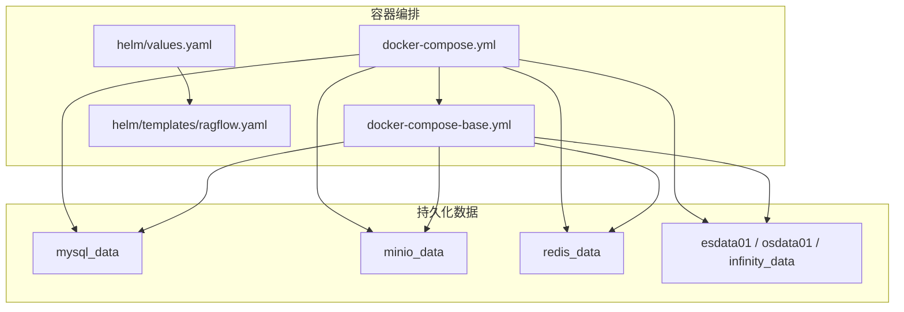
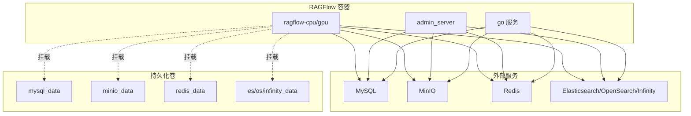
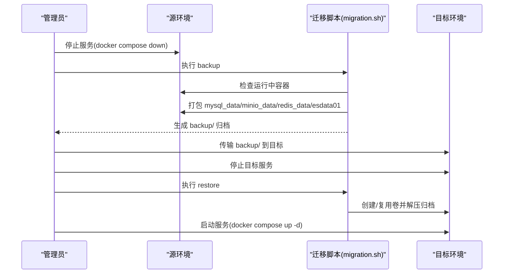
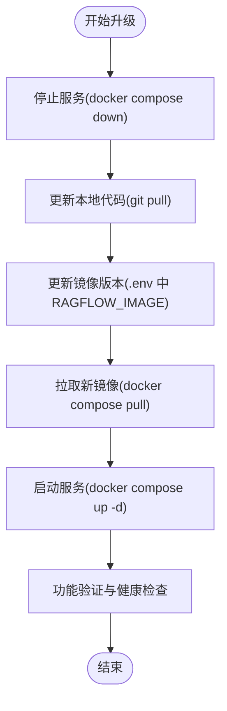
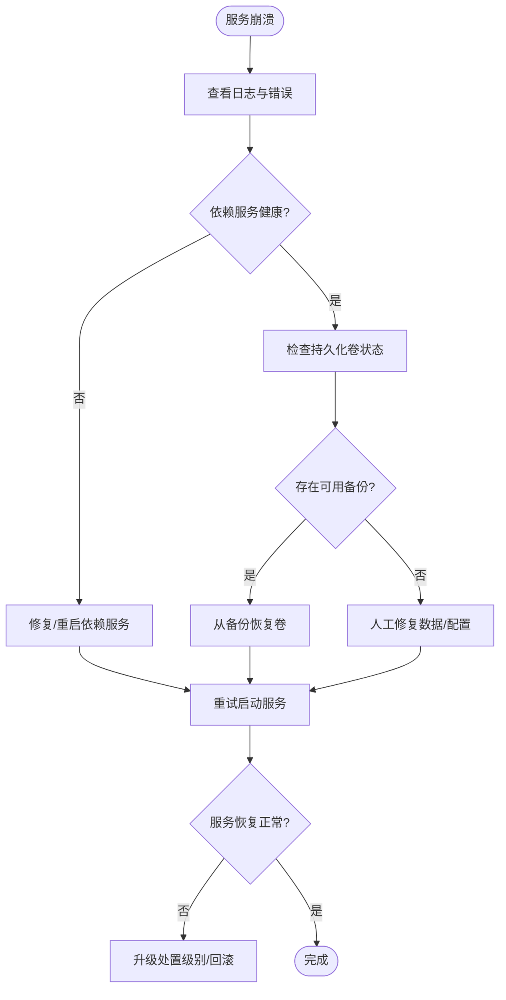
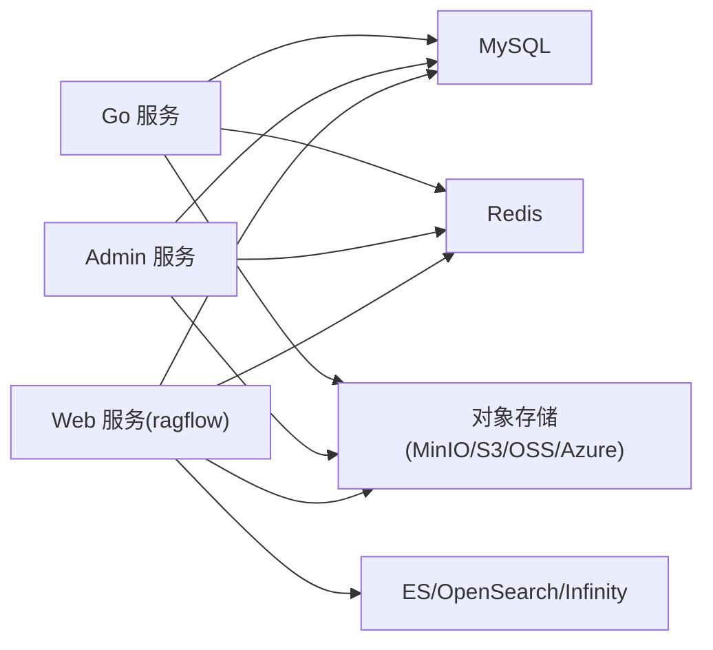

# 紧急恢复与数据保护

<cite>
**本文引用的文件**
- [backup_and_migration.md](file://docs/administrator/backup_and_migration.md)
- [upgrade_ragflow.mdx](file://docs/administrator/upgrade_ragflow.mdx)
- [migration.sh](file://docker/migration.sh)
- [docker-compose.yml](file://docker/docker-compose.yml)
- [docker-compose-base.yml](file://docker/docker-compose-base.yml)
- [service_conf.yaml](file://conf/service_conf.yaml)
- [service_conf.yaml.template](file://docker/service_conf.yaml.template)
- [values.yaml](file://helm/values.yaml)
- [ragflow.yaml](file://helm/templates/ragflow.yaml)
- [entrypoint.sh](file://docker/entrypoint.sh)
- [launch_backend_service.sh](file://docker/launch_backend_service.sh)
- [init.sql](file://docker/init.sql)
</cite>

## 目录
1. [简介](#简介)
2. [项目结构](#项目结构)
3. [核心组件](#核心组件)
4. [架构总览](#架构总览)
5. [详细组件分析](#详细组件分析)
6. [依赖关系分析](#依赖关系分析)
7. [性能考量](#性能考量)
8. [故障排查指南](#故障排查指南)
9. [结论](#结论)
10. [附录](#附录)

## 简介
本指南面向运维与平台工程团队，围绕 RAGFlow 的紧急恢复与数据保护，提供系统化的备份策略、升级最佳实践、故障恢复流程与灾难恢复方案。内容覆盖数据库、对象存储、配置文件等关键数据的备份方法与频率建议；涵盖升级前准备、升级过程风险控制与升级后验证；并给出服务崩溃重启、数据损坏修复、网络中断恢复等应急处理步骤，以及异地备份、服务降级与业务连续性保障等高级恢复措施。

## 项目结构
RAGFlow 采用容器化部署，核心持久化数据通过 Docker 卷保存，包括数据库、对象存储、缓存与搜索引擎索引。官方提供了迁移脚本以打包与恢复这些卷，便于跨环境迁移与灾备演练。

图表来源
- [docker-compose.yml:1-135](file://docker/docker-compose.yml#L1-L135)
- [docker-compose-base.yml:301-321](file://docker/docker-compose-base.yml#L301-L321)
- [values.yaml:1-266](file://helm/values.yaml#L1-L266)
- [ragflow.yaml:1-150](file://helm/templates/ragflow.yaml#L1-L150)

章节来源
- [docker-compose.yml:1-135](file://docker/docker-compose.yml#L1-L135)
- [docker-compose-base.yml:301-321](file://docker/docker-compose-base.yml#L301-L321)
- [values.yaml:1-266](file://helm/values.yaml#L1-L266)
- [ragflow.yaml:1-150](file://helm/templates/ragflow.yaml#L1-L150)

## 核心组件
- 数据库（MySQL）：用于存储用户、租户、任务、系统设置等结构化元数据。
- 对象存储（MinIO/S3/OSS/Azure Blob/OpenDAL）：用于存储上传的文件、向量索引与中间产物。
- 缓存（Redis）：用于消息队列、会话与临时状态。
- 搜索引擎（Elasticsearch/OpenSearch/Infinity/OceanBase/SeekDB）：用于检索与查询加速。
- 配置与密钥：通过模板与环境变量注入，支持本地与 Helm 渲染两种方式。

章节来源
- [service_conf.yaml:1-160](file://conf/service_conf.yaml#L1-L160)
- [service_conf.yaml.template:1-172](file://docker/service_conf.yaml.template#L1-L172)
- [docker-compose-base.yml:176-242](file://docker/docker-compose-base.yml#L176-L242)

## 架构总览
下图展示容器编排与持久化卷的关系，以及迁移脚本对卷的备份/恢复范围。

图表来源
- [docker-compose.yml:5-101](file://docker/docker-compose.yml#L5-L101)
- [docker-compose-base.yml:176-242](file://docker/docker-compose-base.yml#L176-L242)

章节来源
- [docker-compose.yml:5-101](file://docker/docker-compose.yml#L5-L101)
- [docker-compose-base.yml:176-242](file://docker/docker-compose-base.yml#L176-L242)

## 详细组件分析

### 备份与迁移策略
- 备份范围：脚本默认备份以下卷：mysql_data、minio_data、redis_data、esdata01（或 opensearch 对应卷）。备份时会将卷内容打包为压缩归档，便于传输与归档。
- 迁移流程：先停止源环境服务，使用迁移脚本打包备份，再将备份拷贝到目标环境，最后在目标环境执行恢复并启动服务。
- 单桶模式切换：支持将多桶结构迁移到单桶目录结构，便于云厂商计费与 IAM 策略简化。

图表来源
- [migration.sh:151-200](file://docker/migration.sh#L151-L200)
- [migration.sh:202-293](file://docker/migration.sh#L202-L293)
- [backup_and_migration.md:46-148](file://docs/administrator/backup_and_migration.md#L46-L148)

章节来源
- [backup_and_migration.md:14-148](file://docs/administrator/backup_and_migration.md#L14-L148)
- [migration.sh:1-350](file://docker/migration.sh#L1-L350)

### 升级注意事项
- 升级前准备：停止服务、拉取最新代码、更新镜像版本、可选离线导入镜像。
- 升级过程：按顺序执行停止、更新代码、更新镜像、启动服务。
- 升级后验证：检查各服务健康状态与日志，确认功能可用。
- 风险提示：使用带 -v 的 down 会删除卷导致数据丢失，需谨慎。

图表来源
- [upgrade_ragflow.mdx:18-82](file://docs/administrator/upgrade_ragflow.mdx#L18-L82)

章节来源
- [upgrade_ragflow.mdx:12-102](file://docs/administrator/upgrade_ragflow.mdx#L12-L102)

### 紧急故障恢复方案
- 服务崩溃重启
  - 优先通过容器编排自动重启策略恢复（restart: unless-stopped）。
  - 若容器无法自启，检查日志与依赖服务健康状态，必要时手动重建卷并恢复数据。
- 数据损坏修复
  - 使用迁移脚本从最近备份恢复对应卷。
  - 对于数据库，可在初始化 SQL 的基础上进行结构校验与修复。
- 网络中断恢复
  - 检查容器间网络连通性与端口映射。
  - 确认对象存储、数据库、搜索引擎等外部依赖可达。

图表来源
- [docker-compose.yml:49-101](file://docker/docker-compose.yml#L49-L101)
- [docker-compose-base.yml:176-242](file://docker/docker-compose-base.yml#L176-L242)
- [migration.sh:202-293](file://docker/migration.sh#L202-L293)
- [init.sql:1-2](file://docker/init.sql#L1-L2)

章节来源
- [docker-compose.yml:49-101](file://docker/docker-compose.yml#L49-L101)
- [docker-compose-base.yml:176-242](file://docker/docker-compose-base.yml#L176-L242)
- [migration.sh:202-293](file://docker/migration.sh#L202-L293)
- [init.sql:1-2](file://docker/init.sql#L1-L2)

### 灾难恢复计划
- 异地备份
  - 将备份归档定期复制到异地存储（对象存储/磁带库），并验证可恢复性。
- 服务降级策略
  - 在部分组件不可用时，优先保证核心检索与问答能力；禁用非关键组件（如 MCP/Admin 服务）。
- 业务连续性保障
  - 通过 Helm/Kubernetes 部署时启用滚动更新与健康检查，减少停机窗口。
  - 使用多副本与亲和性策略提升可用性。

章节来源
- [values.yaml:106-123](file://helm/values.yaml#L106-L123)
- [ragflow.yaml:10-18](file://helm/templates/ragflow.yaml#L10-L18)

## 依赖关系分析
- 组件耦合
  - Web 服务依赖数据库、对象存储、缓存与搜索引擎；Admin 服务与 Go 服务在混合模式下共享健康检查。
  - 配置通过模板渲染注入，支持本地与 Helm 两种部署形态。
- 外部依赖
  - MySQL、MinIO、Redis、Elasticsearch/OpenSearch/Infinity 等均以独立服务形式提供，通过卷与网络连接。

图表来源
- [docker-compose.yml:5-101](file://docker/docker-compose.yml#L5-L101)
- [docker-compose-base.yml:176-242](file://docker/docker-compose-base.yml#L176-L242)
- [service_conf.yaml.template:7-58](file://docker/service_conf.yaml.template#L7-L58)

章节来源
- [docker-compose.yml:5-101](file://docker/docker-compose.yml#L5-L101)
- [docker-compose-base.yml:176-242](file://docker/docker-compose-base.yml#L176-L242)
- [service_conf.yaml.template:7-58](file://docker/service_conf.yaml.template#L7-L58)

## 性能考量
- 单桶模式 vs 多桶模式：单桶模式在桶列表操作上可能更高效，但多桶模式在隔离与组织方面更优，需结合基础设施约束选择。
- 存储后端：MinIO/S3/OSS/Azure Blob/OpenDAL 支持度不同，需根据 IAM 与成本策略选择。
- 搜索引擎：ES/OpenSearch/Infinity 的资源与容量规划需匹配业务规模。

章节来源
- [backup_and_migration.md:301-314](file://docs/administrator/backup_and_migration.md#L301-L314)
- [docker-compose-base.yml:2-34](file://docker/docker-compose-base.yml#L2-L34)

## 故障排查指南
- 常见问题定位
  - 依赖服务未就绪：检查健康检查与日志，等待服务启动。
  - 权限与证书：对象存储访问失败时，核对凭据与 TLS 设置。
  - 端口冲突：确认端口映射与防火墙策略。
- 回滚预案
  - 使用迁移脚本恢复至上一个稳定版本的备份。
  - 如涉及镜像升级，回退至已知稳定的镜像版本并重新部署。

章节来源
- [backup_and_migration.md:287-314](file://docs/administrator/backup_and_migration.md#L287-L314)
- [migration.sh:140-149](file://docker/migration.sh#L140-L149)

## 结论
通过规范的备份与迁移流程、严谨的升级管理、完善的故障恢复与灾难恢复机制，RAGFlow 可在复杂环境中保持高可用与数据安全。建议将备份纳入自动化流水线，定期演练恢复，持续优化升级与容灾策略。

## 附录

### 备份策略与频率建议
- 数据库：每日增量 + 每周全量，保留至少 4 周。
- 对象存储：按业务重要性分级，高频数据每日增量，低频数据每周全量。
- 配置文件：随变更同步备份，保留最近 30 版本。
- 搜索索引：可按需备份，或在重建代价较低时直接重建。

章节来源
- [backup_and_migration.md:14-148](file://docs/administrator/backup_and_migration.md#L14-L148)
- [migration.sh:151-200](file://docker/migration.sh#L151-L200)

### 升级流程最佳实践
- 升级前：停止服务、备份所有关键卷、记录当前镜像版本。
- 升级中：严格遵循升级文档步骤，避免误用 -v 参数。
- 升级后：进行功能与性能回归测试，监控日志与指标。

章节来源
- [upgrade_ragflow.mdx:18-82](file://docs/administrator/upgrade_ragflow.mdx#L18-L82)

### 应急处理步骤清单
- 服务崩溃：检查日志 → 重启容器 → 校验依赖 → 必要时回滚。
- 数据损坏：确认备份有效性 → 停止服务 → 恢复卷 → 启动服务。
- 网络中断：检查网络策略与 DNS → 修复后重试 → 观察指标。

章节来源
- [docker-compose.yml:49-101](file://docker/docker-compose.yml#L49-L101)
- [migration.sh:202-293](file://docker/migration.sh#L202-L293)