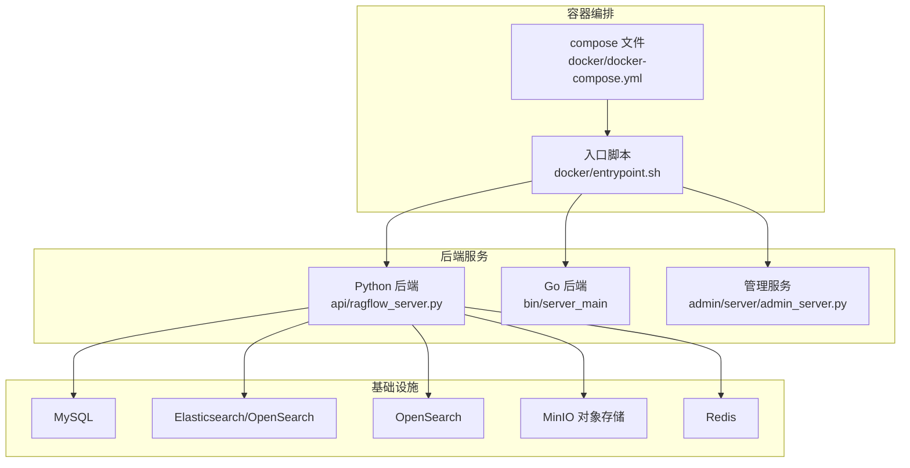
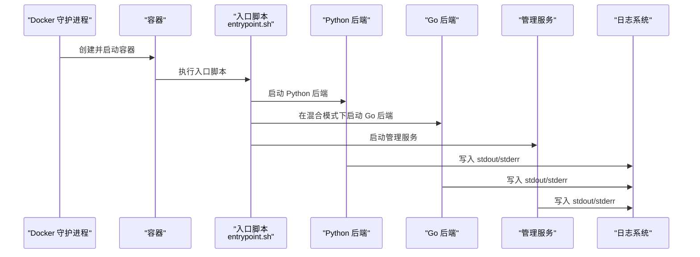
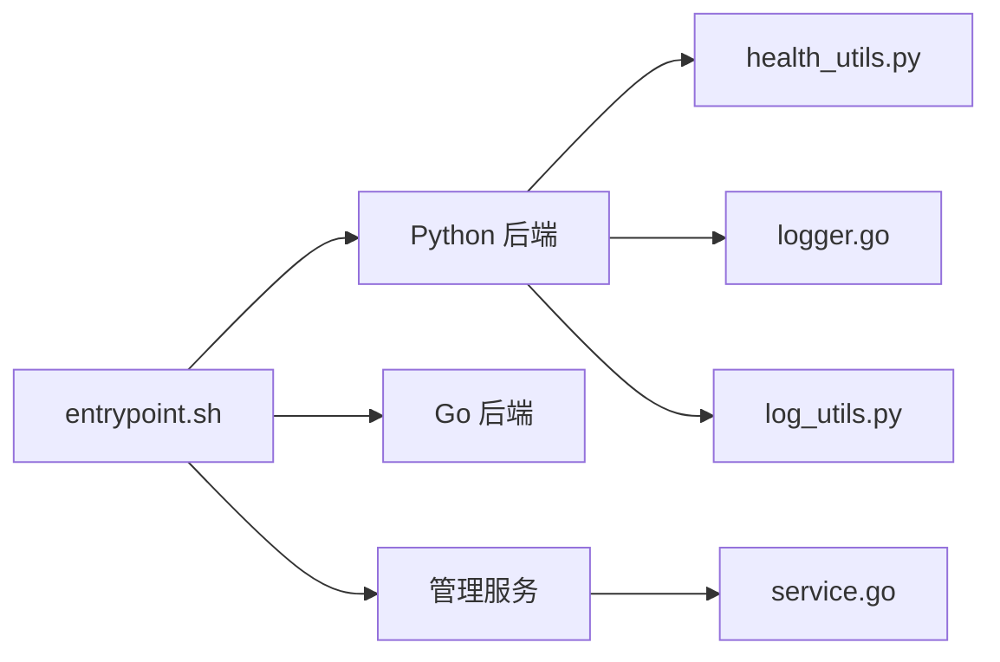

# 调试工具与方法

<cite>
**本文引用的文件**
- [docker-compose.yml](file://docker/docker-compose.yml)
- [service_conf.yaml](file://conf/service_conf.yaml)
- [entrypoint.sh](file://docker/entrypoint.sh)
- [logger.go](file://internal/logger/logger.go)
- [log_utils.py](file://common/log_utils.py)
- [health_utils.py](file://api/utils/health_utils.py)
- [service.go](file://internal/admin/service.go)
- [wait-for-it.sh](file://agent/sandbox/scripts/wait-for-it.sh)
- [wait-for-it-http.sh](file://agent/sandbox/scripts/wait-for-it-http.sh)
- [canvas_app.py](file://api/apps/canvas_app.py)
- [faq.mdx](file://docs/faq.mdx)
</cite>

## 目录
1. [简介](#简介)
2. [项目结构](#项目结构)
3. [核心组件](#核心组件)
4. [架构总览](#架构总览)
5. [详细组件分析](#详细组件分析)
6. [依赖关系分析](#依赖关系分析)
7. [性能考量](#性能考量)
8. [故障排查指南](#故障排查指南)
9. [结论](#结论)
10. [附录](#附录)

## 简介
本指南面向开发者与运维人员，围绕 RAGFlow 的日志查看、系统状态检查、性能分析、网络连通性与数据库/第三方服务可用性检测，提供可操作的调试工具与方法。内容覆盖：
- 日志查看：容器日志、日志文件位置与格式、日志级别配置
- 系统状态检查：各组件健康状态、Elasticsearch/OpenSearch、MinIO 存储服务
- 性能分析：内存/CPU/网络等诊断建议
- 网络与数据库：连通性测试、数据库连接测试、第三方服务可用性检查

## 项目结构
RAGFlow 采用多语言混合架构（Go/Python），通过 Docker Compose 编排多个服务，并在容器内挂载统一的日志目录用于集中查看。

图表来源
- [docker-compose.yml:1-135](file://docker/docker-compose.yml#L1-L135)
- [entrypoint.sh:260-340](file://docker/entrypoint.sh#L260-L340)

章节来源
- [docker-compose.yml:1-135](file://docker/docker-compose.yml#L1-L135)
- [service_conf.yaml:1-160](file://conf/service_conf.yaml#L1-L160)

## 核心组件
- 日志系统
  - Go 侧：Zap 全局日志初始化与格式化输出
  - Python 侧：根日志器初始化、轮转文件处理器、按包设置日志级别
- 健康检查工具
  - Python 健康检查模块：数据库、Redis、文档引擎、存储、MinIO、RAGFlow 服务、任务执行器
  - Go 管理服务：MinIO 健康检查、服务详情查询
- 启动与等待脚本
  - 等待 TCP 端口可用与 HTTP 可达
- 配置中心
  - 服务配置模板与运行时替换

章节来源
- [logger.go:34-86](file://internal/logger/logger.go#L34-L86)
- [log_utils.py:25-72](file://common/log_utils.py#L25-L72)
- [health_utils.py:330-365](file://api/utils/health_utils.py#L330-L365)
- [service.go:996-1078](file://internal/admin/service.go#L996-L1078)
- [wait-for-it.sh:41-49](file://agent/sandbox/scripts/wait-for-it.sh#L41-L49)
- [wait-for-it-http.sh:22-31](file://agent/sandbox/scripts/wait-for-it-http.sh#L22-L31)

## 架构总览
下图展示容器启动流程、日志落盘路径以及健康检查调用链路。

图表来源
- [entrypoint.sh:266-306](file://docker/entrypoint.sh#L266-L306)
- [logger.go:76-85](file://internal/logger/logger.go#L76-L85)

## 详细组件分析

### 日志系统与查看方法
- 日志输出位置
  - 容器标准输出/错误：Go/Zap 输出到 stdout/stderr
  - Python 根日志器：写入文件与控制台，文件位于容器内的 logs 目录
  - Docker Compose 将宿主机目录挂载到容器的 /ragflow/logs，便于持久化查看
- 日志文件位置与格式
  - Python 日志文件：容器内 logs 目录下的以基础名命名的日志文件，支持轮转
  - 日志格式：时间戳、级别、进程号、消息；可通过环境变量调整包级日志级别
- 日志级别配置
  - Go：通过初始化函数设置全局日志级别
  - Python：通过环境变量设置包级日志级别，未指定默认 INFO

使用示例与解读
- 查看容器日志
  - 使用 docker logs 查看特定服务容器的标准输出，结合时间戳定位异常
- 调整日志级别
  - 设置环境变量以提升或降低日志详细度，便于问题定位与生产降噪

章节来源
- [docker-compose.yml:40-45](file://docker/docker-compose.yml#L40-L45)
- [logger.go:34-86](file://internal/logger/logger.go#L34-L86)
- [log_utils.py:48-72](file://common/log_utils.py#L48-L72)

### 系统状态检查工具
- 组件健康检查接口
  - 数据库：轻量探测 SELECT 1，返回耗时与错误信息
  - Redis：健康探测，返回耗时与错误信息
  - 文档引擎：根据当前选择的文档引擎（Elasticsearch/OpenSearch/Infinity/OceanBase）进行健康检查
  - 存储：对象存储实现健康检查
  - MinIO：基于 /minio/health/live 探活，支持 http/https 与证书校验开关
  - RAGFlow 服务：访问 /v1/system/ping
  - 任务执行器：从 Redis 集合中读取心跳，判断是否存活
- 管理服务健康检查
  - 支持按服务类型调用具体检查逻辑，如 MySQL、Redis、检索引擎、RAGFlow 服务、MinIO、任务执行器等

使用示例与解读
- 运行健康检查
  - 调用健康检查聚合函数，得到各组件状态与元数据
- 解读输出
  - status 字段：ok/nok 或 alive/timeout/degraded/unhealthy
  - message/细节字段：包含耗时、连接状态、版本、慢查询数、连接池统计等

章节来源
- [health_utils.py:34-61](file://api/utils/health_utils.py#L34-L61)
- [health_utils.py:72-85](file://api/utils/health_utils.py#L72-L85)
- [health_utils.py:256-275](file://api/utils/health_utils.py#L256-L275)
- [health_utils.py:290-305](file://api/utils/health_utils.py#L290-L305)
- [health_utils.py:308-326](file://api/utils/health_utils.py#L308-L326)
- [service.go:996-1078](file://internal/admin/service.go#L996-L1078)
- [service.go:1278-1322](file://internal/admin/service.go#L1278-L1322)

### 性能分析工具与建议
- 内存使用监控
  - Linux 工具：top、htop、free、smem；Docker 容器：docker stats
  - Python：使用 tracemalloc、memory_profiler；Go：pprof
- CPU 占用分析
  - top/htop、pidstat、perf；Docker：docker stats
- 网络连接检查
  - netstat/ss、tcpdump、iftop、nethogs；容器内使用 nc/curl
- 文档引擎性能指标
  - OceanBase 健康检查返回连接状态、延迟、QPS、慢查询、连接池等指标
  - Elasticsearch/OpenSearch 集群状态与分片健康度

章节来源
- [health_utils.py:136-216](file://api/utils/health_utils.py#L136-L216)
- [health_utils.py:72-85](file://api/utils/health_utils.py#L72-L85)

### 网络连通性与数据库/第三方服务检查
- 等待端口可用
  - wait-for-it.sh：循环探测主机与端口，超时退出
  - wait-for-it-http.sh：对 URL 发起 HTTP 请求探测
- 数据库连接测试
  - 提供通用接口，支持多种数据库类型（MySQL/MariaDB、Postgres、MSSQL、DB2、Trino）
  - 自动构造连接字符串并执行轻量查询以验证连通性
- 第三方服务可用性
  - MinIO：基于 /minio/health/live 探活，支持自签名证书跳过校验
  - Elasticsearch/OpenSearch：通过健康检查模块获取集群状态
  - RAGFlow 服务：访问 /v1/system/ping

使用示例与解读
- 等待服务就绪
  - 在启动脚本中使用等待脚本，避免因依赖未就绪导致失败
- 数据库连通性
  - 按需传入参数，执行成功即表示连接可用
- MinIO 探活
  - 根据配置决定 http/https 与证书校验策略，返回探活结果与耗时

章节来源
- [wait-for-it.sh:41-49](file://agent/sandbox/scripts/wait-for-it.sh#L41-L49)
- [wait-for-it-http.sh:22-31](file://agent/sandbox/scripts/wait-for-it-http.sh#L22-L31)
- [canvas_app.py:447-506](file://api/apps/canvas_app.py#L447-L506)
- [health_utils.py:256-275](file://api/utils/health_utils.py#L256-L275)
- [health_utils.py:290-305](file://api/utils/health_utils.py#L290-L305)

## 依赖关系分析
- 启动顺序与依赖
  - Python 后端与管理服务在入口脚本中启动，Go 后端在混合模式下等待 Python 服务健康后再启动
  - 任务执行器与数据同步作为后台守护进程启动
- 日志落盘
  - Go/Zap 输出到 stdout/stderr，由 Docker 引擎收集；Python 根日志器同时写文件与控制台
- 健康检查依赖
  - 健康检查模块依赖配置中心提供的连接信息与环境变量（如 DOC_ENGINE）

图表来源
- [entrypoint.sh:266-306](file://docker/entrypoint.sh#L266-L306)
- [health_utils.py:330-365](file://api/utils/health_utils.py#L330-L365)
- [service.go:996-1078](file://internal/admin/service.go#L996-L1078)
- [logger.go:76-85](file://internal/logger/logger.go#L76-L85)
- [log_utils.py:31-44](file://common/log_utils.py#L31-L44)

章节来源
- [entrypoint.sh:242-285](file://docker/entrypoint.sh#L242-L285)
- [docker-compose.yml:40-45](file://docker/docker-compose.yml#L40-L45)

## 性能考量
- 日志级别与开销
  - 生产环境建议 INFO 或更高，避免过多 DEBUG 日志带来的 I/O 压力
- 健康检查频率
  - 避免过于频繁的探测造成额外负载，合理设置间隔
- 文档引擎选择
  - 不同引擎的健康指标不同，结合业务场景选择合适的检索引擎并关注其性能指标

## 故障排查指南
- 容器状态与服务状态不一致
  - FAQ 指出容器“已启动”不代表服务“健康”，可能由网络、端口或 DNS 导致
- Elasticsearch 连接失败
  - 检查容器健康状态与服务健康检查结果，确认端口映射与网络连通性
- MinIO 探活失败
  - 根据配置决定是否启用 https 与证书校验；若为自签名证书，可在配置中关闭校验
- 数据库连接失败
  - 使用数据库连接测试接口，核对连接参数与权限
- 服务启动卡住
  - 使用等待脚本确保前置服务就绪后再启动后续组件

章节来源
- [faq.mdx:304-330](file://docs/faq.mdx#L304-L330)
- [health_utils.py:256-275](file://api/utils/health_utils.py#L256-L275)
- [canvas_app.py:447-506](file://api/apps/canvas_app.py#L447-L506)
- [wait-for-it.sh:41-49](file://agent/sandbox/scripts/wait-for-it.sh#L41-L49)
- [wait-for-it-http.sh:22-31](file://agent/sandbox/scripts/wait-for-it-http.sh#L22-L31)

## 结论
通过统一的日志落盘、完善的健康检查与网络等待脚本，RAGFlow 提供了系统化的调试能力。建议在生产环境中：
- 明确日志级别与保留策略
- 使用健康检查与等待脚本保障启动顺序
- 结合性能指标持续优化检索与存储配置

## 附录
- 常用命令速查
  - 查看日志：docker logs -f <容器名>
  - 查看资源：docker stats <容器名>
  - 等待端口：./agent/sandbox/scripts/wait-for-it.sh host port
  - 等待 HTTP：./agent/sandbox/scripts/wait-for-it-http.sh http://host:port/path