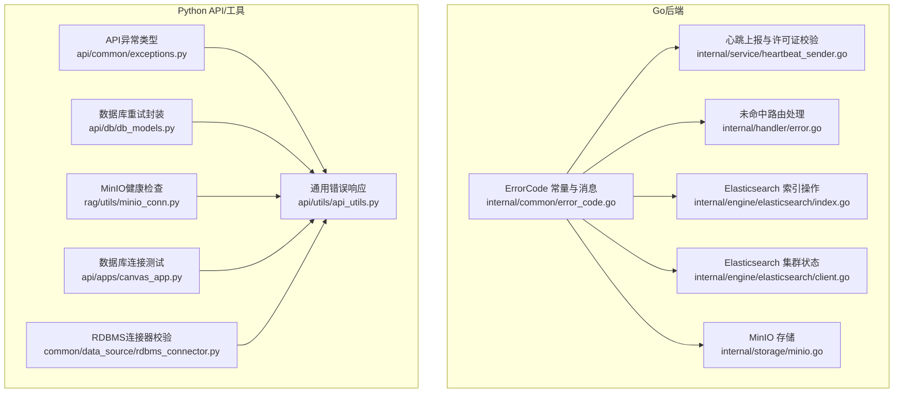
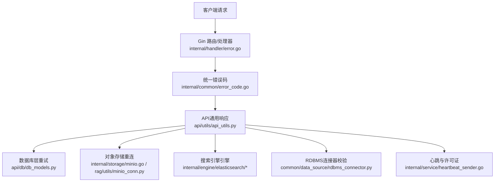
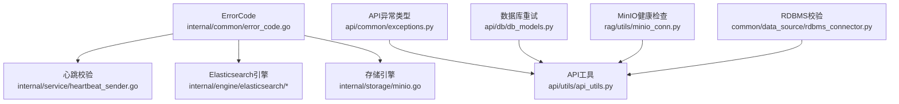

# 错误码对照表

<cite>
**本文引用的文件**
- [internal/common/error_code.go](file://internal/common/error_code.go)
- [api/common/exceptions.py](file://api/common/exceptions.py)
- [common/exceptions.py](file://common/exceptions.py)
- [common/data_source/exceptions.py](file://common/data_source/exceptions.py)
- [internal/handler/error.go](file://internal/handler/error.go)
- [api/utils/api_utils.py](file://api/utils/api_utils.py)
- [api/apps/canvas_app.py](file://api/apps/canvas_app.py)
- [common/data_source/rdbms_connector.py](file://common/data_source/rdbms_connector.py)
- [internal/engine/elasticsearch/index.go](file://internal/engine/elasticsearch/index.go)
- [internal/engine/elasticsearch/client.go](file://internal/engine/elasticsearch/client.go)
- [rag/utils/es_conn.py](file://rag/utils/es_conn.py)
- [internal/storage/minio.go](file://internal/storage/minio.go)
- [rag/utils/minio_conn.py](file://rag/utils/minio_conn.py)
- [api/db/db_models.py](file://api/db/db_models.py)
- [internal/service/heartbeat_sender.go](file://internal/service/heartbeat_sender.go)
- [internal/admin/handler.go](file://internal/admin/handler.go)
- [internal/admin/service.go](file://internal/admin/service.go)
- [agent/sandbox/scripts/wait-for-it.sh](file://agent/sandbox/scripts/wait-for-it.sh)
</cite>

## 目录
1. [简介](#简介)
2. [项目结构](#项目结构)
3. [核心组件](#核心组件)
4. [架构总览](#架构总览)
5. [详细组件分析](#详细组件分析)
6. [依赖分析](#依赖分析)
7. [性能考虑](#性能考虑)
8. [故障排查指南](#故障排查指南)
9. [结论](#结论)
10. [附录：错误码分类索引](#附录错误码分类索引)

## 简介
本对照表面向RAGFlow使用者与运维人员，系统性梳理并解释以下三类错误：
- API错误码：HTTP状态码与统一返回体中的业务错误码（如400、401、403、404、409、500等）的含义、成因与处置建议。
- 系统错误码：内部统一ErrorCode枚举（如超时、连接失败、资源耗尽、鉴权失败、授权许可相关等），以及常见系统级问题（如索引创建失败、文件存储不可用、数据库连接异常等）的诊断与修复路径。
- 数据库错误码：数据库连接失败、权限不足、事务中断、完整性约束冲突等的识别、定位与恢复策略。

每条错误均包含：错误描述、可能原因、具体解决步骤与预防措施，并提供分类索引以便快速检索。

## 项目结构
RAGFlow采用多语言混合架构，后端Go服务负责核心引擎与管理接口，Python生态负责API网关、数据源连接器与工具模块。错误处理分布在：
- Go侧：统一ErrorCode常量与消息映射、HTTP路由未命中处理、心跳上报与许可证校验、存储与搜索引擎引擎层错误封装。
- Python侧：API通用异常类型、数据库连接池重试封装、对象存储健康检查与重连逻辑、RDBMS连接器参数校验与连接测试。

**图表来源**
- [internal/common/error_code.go:19-82](file://internal/common/error_code.go#L19-L82)
- [internal/handler/error.go:28-46](file://internal/handler/error.go#L28-L46)
- [internal/service/heartbeat_sender.go:116-133](file://internal/service/heartbeat_sender.go#L116-L133)
- [internal/engine/elasticsearch/index.go:44-144](file://internal/engine/elasticsearch/index.go#L44-L144)
- [internal/engine/elasticsearch/client.go:106-133](file://internal/engine/elasticsearch/client.go#L106-L133)
- [internal/storage/minio.go:56-86](file://internal/storage/minio.go#L56-L86)
- [api/common/exceptions.py:18-44](file://api/common/exceptions.py#L18-L44)
- [api/db/db_models.py:260-401](file://api/db/db_models.py#L260-L401)
- [rag/utils/minio_conn.py:132-168](file://rag/utils/minio_conn.py#L132-L168)
- [api/apps/canvas_app.py:447-514](file://api/apps/canvas_app.py#L447-L514)
- [common/data_source/rdbms_connector.py:336-372](file://common/data_source/rdbms_connector.py#L336-L372)
- [api/utils/api_utils.py:120-150](file://api/utils/api_utils.py#L120-L150)

**章节来源**
- [internal/common/error_code.go:19-82](file://internal/common/error_code.go#L19-L82)
- [api/common/exceptions.py:18-44](file://api/common/exceptions.py#L18-L44)
- [api/db/db_models.py:260-401](file://api/db/db_models.py#L260-L401)
- [internal/storage/minio.go:56-86](file://internal/storage/minio.go#L56-L86)
- [api/apps/canvas_app.py:447-514](file://api/apps/canvas_app.py#L447-L514)
- [common/data_source/rdbms_connector.py:336-372](file://common/data_source/rdbms_connector.py#L336-L372)
- [internal/engine/elasticsearch/index.go:44-144](file://internal/engine/elasticsearch/index.go#L44-L144)
- [internal/engine/elasticsearch/client.go:106-133](file://internal/engine/elasticsearch/client.go#L106-L133)
- [rag/utils/es_conn.py:282-296](file://rag/utils/es_conn.py#L282-L296)
- [internal/handler/error.go:28-46](file://internal/handler/error.go#L28-L46)
- [api/utils/api_utils.py:120-150](file://api/utils/api_utils.py#L120-L150)
- [internal/service/heartbeat_sender.go:116-133](file://internal/service/heartbeat_sender.go#L116-L133)
- [internal/admin/handler.go:1101-1142](file://internal/admin/handler.go#L1101-L1142)
- [internal/admin/service.go:1226-1282](file://internal/admin/service.go#L1226-L1282)
- [agent/sandbox/scripts/wait-for-it.sh:18-50](file://agent/sandbox/scripts/wait-for-it.sh#L18-L50)

## 核心组件
- 统一错误码与消息映射：定义了业务与系统层面的错误码及对应中文消息，便于前后端一致化呈现。
- API异常类型：定义了管理员相关异常（如用户不存在、重复、权限不足等）及其HTTP状态码。
- 数据库重试封装：对MySQL/PG/OceanBase连接异常进行指数回退重试，提升稳定性。
- 对象存储健康检查与重连：MinIO上传/下载/签名URL获取失败时自动重连与重试。
- RDBMS连接器参数校验：在建立连接前验证关键配置，避免无效连接导致的异常传播。
- Elasticsearch引擎：封装索引创建/删除/存在性检查与集群状态查询，返回明确错误信息。
- 心跳与许可证校验：服务端向管理端上报心跳，若许可证不合法则返回相应错误码并记录日志。

**章节来源**
- [internal/common/error_code.go:19-82](file://internal/common/error_code.go#L19-L82)
- [api/common/exceptions.py:18-44](file://api/common/exceptions.py#L18-L44)
- [api/db/db_models.py:260-401](file://api/db/db_models.py#L260-L401)
- [internal/storage/minio.go:129-198](file://internal/storage/minio.go#L129-L198)
- [common/data_source/rdbms_connector.py:336-372](file://common/data_source/rdbms_connector.py#L336-L372)
- [internal/engine/elasticsearch/index.go:44-144](file://internal/engine/elasticsearch/index.go#L44-L144)
- [internal/service/heartbeat_sender.go:116-133](file://internal/service/heartbeat_sender.go#L116-L133)

## 架构总览
下图展示错误码在系统中的流转与使用位置，帮助理解从API到引擎再到存储与数据库的错误传播路径。

**图表来源**
- [internal/handler/error.go:28-46](file://internal/handler/error.go#L28-L46)
- [internal/common/error_code.go:19-82](file://internal/common/error_code.go#L19-L82)
- [api/utils/api_utils.py:120-150](file://api/utils/api_utils.py#L120-L150)
- [api/db/db_models.py:260-401](file://api/db/db_models.py#L260-L401)
- [internal/storage/minio.go:129-198](file://internal/storage/minio.go#L129-L198)
- [rag/utils/minio_conn.py:132-168](file://rag/utils/minio_conn.py#L132-L168)
- [internal/engine/elasticsearch/index.go:44-144](file://internal/engine/elasticsearch/index.go#L44-L144)
- [common/data_source/rdbms_connector.py:336-372](file://common/data_source/rdbms_connector.py#L336-L372)
- [internal/service/heartbeat_sender.go:116-133](file://internal/service/heartbeat_sender.go#L116-L133)

## 详细组件分析

### API错误码（HTTP状态码与业务错误）
- 400 Bad Request：请求参数非法或格式错误。常见于API请求体解析失败或必填字段缺失。
- 401 Unauthorized：未认证或令牌无效。需检查鉴权头、令牌有效期与作用域。
- 403 Forbidden：权限不足或非管理员访问受限接口。确认用户角色与租户权限。
- 404 Not Found：资源不存在（如用户、文件、索引）。检查路径与ID是否正确。
- 409 Conflict：资源冲突（如重复创建用户）。先清理冲突再重试。
- 500 Internal Server Error：服务器内部异常。查看日志定位具体模块。

解决步骤
- 检查请求路径、方法与头部（Authorization、Content-Type）。
- 校验必填参数与数据类型，参考API文档。
- 若为鉴权问题，重新登录或刷新令牌。
- 若为资源不存在，确认ID与租户上下文。
- 若为冲突，先删除或修改冲突项再提交。
- 服务器错误时，收集日志并反馈给运维团队。

预防措施
- 在调用前进行参数校验与示例请求验证。
- 使用统一SDK或封装的HTTP客户端，确保头部与序列化一致。
- 对幂等性敏感的操作增加去重与重试策略。

**章节来源**
- [internal/handler/error.go:28-46](file://internal/handler/error.go#L28-L46)
- [api/common/exceptions.py:18-44](file://api/common/exceptions.py#L18-L44)
- [api/utils/api_utils.py:120-150](file://api/utils/api_utils.py#L120-L150)
- [internal/admin/handler.go:1101-1142](file://internal/admin/handler.go#L1101-L1142)

### 系统错误码（ErrorCode）
- 成功与运行态：成功、系统运行中。
- 异常与参数：系统异常、参数非法、数据错误、操作错误。
- 超时与连接：超时、连接错误、资源耗尽。
- 权限与认证：权限不足、认证失败。
- 许可证：有效、未激活、已过期、摘要错误、时间回滚、未找到、意外错误。
- HTTP语义错误：400、401、403、404、409、500。

解决步骤
- 参数/数据错误：修正输入或导入模板，确保字段完整与格式正确。
- 超时/连接失败：检查网络连通性、DNS解析、防火墙与代理；必要时增加超时与重试。
- 权限/认证失败：核对API密钥、租户权限与角色；更新令牌。
- 许可证问题：检查许可证文件、时间同步与签名校验；必要时重新上传或续期。
- 运行中/资源耗尽：降低并发、扩容资源或优化任务队列。

预防措施
- 在部署阶段完成连通性与鉴权测试。
- 对外部服务调用实现指数回退与熔断。
- 定期检查许可证有效期与系统时间。

**章节来源**
- [internal/common/error_code.go:19-82](file://internal/common/error_code.go#L19-L82)
- [internal/service/heartbeat_sender.go:116-133](file://internal/service/heartbeat_sender.go#L116-L133)

### 数据库错误码与处理
- 连接失败与中断：MySQL/PG/OceanBase连接丢失（如2006、2013）、连接异常（08006等）。
- 事务中断：连接丢失导致事务无法提交，触发重试与重连。
- 权限不足：用户无访问权限或缺少必要权限。
- 完整性约束冲突：主键/唯一键冲突、外键约束失败。
- 连接池与重试：内置重试机制与指数回退，失败后自动重建连接。

解决步骤
- 连接失败：检查主机、端口、凭据与网络；确认数据库服务状态。
- 事务中断：捕获异常后回滚并按策略重试；必要时降级写入。
- 权限不足：授予所需权限或切换账户；检查角色与白名单。
- 完整性冲突：修正数据或调整约束；避免重复插入。
- 连接池问题：增大最大连接数、缩短空闲超时、启用健康检查。

预防措施
- 在配置中设置合理的重试次数与退避间隔。
- 对DDL变更与批量写入进行灰度与监控。
- 定期备份与演练恢复流程。

**章节来源**
- [api/db/db_models.py:260-401](file://api/db/db_models.py#L260-L401)

### 对象存储错误（MinIO）
- 健康检查失败：无法列举桶或桶不存在。
- 上传/下载/签名失败：网络抖动或服务端异常，触发自动重连与重试。
- 权限与路径：单桶模式与前缀路径组合导致的权限或命名问题。

解决步骤
- 健康检查：确认服务地址、证书与TLS验证开关；检查桶是否存在。
- 上传/下载：重试多次后仍失败，检查网络与磁盘空间；必要时更换节点。
- 权限：确保IAM策略允许目标操作；核对租户隔离与前缀路径。

预防措施
- 将对象存储作为独立服务治理，定期巡检。
- 对关键路径启用多副本与跨区域冗余。
- 使用预签名URL时控制有效期与范围。

**章节来源**
- [internal/storage/minio.go:108-127](file://internal/storage/minio.go#L108-L127)
- [internal/storage/minio.go:129-198](file://internal/storage/minio.go#L129-L198)
- [rag/utils/minio_conn.py:132-168](file://rag/utils/minio_conn.py#L132-L168)

### RDBMS连接器与数据库测试
- 参数校验：主机、数据库名、内容列必须配置；连接测试通过后方可入库。
- 远程数据库测试：支持MySQL/MariaDB、Postgres、SQL Server、DB2、Trino等，失败时返回明确提示并记录依赖缺失信息。

解决步骤
- 缺少凭据或必填项：补齐凭据与连接参数。
- 连接测试失败：检查网络、防火墙与驱动安装；确认数据库服务可达。
- Trino依赖缺失：按提示安装trino驱动。

预防措施
- 在配置界面先行“测试连接”，避免生产环境失败。
- 对不同数据库类型准备独立的凭据与参数模板。

**章节来源**
- [common/data_source/rdbms_connector.py:336-372](file://common/data_source/rdbms_connector.py#L336-L372)
- [api/apps/canvas_app.py:447-514](file://api/apps/canvas_app.py#L447-L514)

### Elasticsearch引擎错误
- 索引创建/删除：失败时返回错误状态码与拒绝确认信息。
- 索引存在性检查：空索引名、HTTP 404等场景需明确报错。
- 集群状态：请求失败或解码失败时返回详细错误。

解决步骤
- 索引创建失败：检查映射、权限与集群状态；必要时清理冲突映射。
- 索引不存在：确认知识库初始化流程与索引名称。
- 集群异常：检查ES服务可用性与网络连通性。

预防措施
- 在写入前确保索引已创建且映射正确。
- 对高并发写入启用批量与重试策略。

**章节来源**
- [internal/engine/elasticsearch/index.go:44-144](file://internal/engine/elasticsearch/index.go#L44-L144)
- [internal/engine/elasticsearch/client.go:106-133](file://internal/engine/elasticsearch/client.go#L106-L133)
- [rag/utils/es_conn.py:282-296](file://rag/utils/es_conn.py#L282-L296)

### 心跳与许可证校验
- 心跳上报：若返回非“许可证有效”错误码，服务端会记录并返回对应消息。
- 管理端路由：对未命中路由返回404；对不支持的报告类型返回400。

解决步骤
- 许可证无效：检查许可证文件、时间同步与签名校验；重新上传或续期。
- 未命中路由：检查API版本与路径拼写。

预防措施
- 定期校准系统时间，避免时间回滚触发许可证回滚检测。
- 对管理端接口进行白名单与速率限制防护。

**章节来源**
- [internal/service/heartbeat_sender.go:116-133](file://internal/service/heartbeat_sender.go#L116-L133)
- [internal/admin/handler.go:1101-1142](file://internal/admin/handler.go#L1101-L1142)

## 依赖分析
- Go侧ErrorCode与各引擎/存储模块强耦合，统一错误消息便于前端一致性展示。
- Python侧异常类型与API工具函数共同构成统一错误响应层，向上游服务屏蔽底层差异。
- 数据库与存储模块通过重试与重连策略降低瞬时故障影响。

**图表来源**
- [internal/common/error_code.go:19-82](file://internal/common/error_code.go#L19-L82)
- [internal/service/heartbeat_sender.go:116-133](file://internal/service/heartbeat_sender.go#L116-L133)
- [internal/engine/elasticsearch/index.go:44-144](file://internal/engine/elasticsearch/index.go#L44-L144)
- [internal/storage/minio.go:129-198](file://internal/storage/minio.go#L129-L198)
- [api/common/exceptions.py:18-44](file://api/common/exceptions.py#L18-L44)
- [api/utils/api_utils.py:120-150](file://api/utils/api_utils.py#L120-L150)
- [api/db/db_models.py:260-401](file://api/db/db_models.py#L260-L401)
- [rag/utils/minio_conn.py:132-168](file://rag/utils/minio_conn.py#L132-L168)
- [common/data_source/rdbms_connector.py:336-372](file://common/data_source/rdbms_connector.py#L336-L372)

**章节来源**
- [internal/common/error_code.go:19-82](file://internal/common/error_code.go#L19-L82)
- [api/common/exceptions.py:18-44](file://api/common/exceptions.py#L18-L44)
- [api/db/db_models.py:260-401](file://api/db/db_models.py#L260-L401)
- [internal/storage/minio.go:129-198](file://internal/storage/minio.go#L129-L198)
- [common/data_source/rdbms_connector.py:336-372](file://common/data_source/rdbms_connector.py#L336-L372)
- [internal/engine/elasticsearch/index.go:44-144](file://internal/engine/elasticsearch/index.go#L44-L144)
- [api/utils/api_utils.py:120-150](file://api/utils/api_utils.py#L120-L150)

## 性能考虑
- 指数回退与并发控制：数据库与存储重试应结合并发上限，避免雪崩。
- 超时与重试：合理设置连接超时与读取超时，区分网络与业务超时。
- 缓存与批处理：对高频查询与写入启用缓存与批量提交，减少往返。
- 监控与告警：对错误率、超时与重试次数建立阈值告警。

## 故障排查指南
- 未命中路由（404）：检查API版本、路径与大小写；确认服务端路由注册。
- 鉴权失败（401/403）：核对令牌、租户与角色；检查中间件拦截规则。
- 数据库异常：查看错误码与消息，优先处理连接丢失与权限不足；对事务失败执行回滚与重试。
- 对象存储异常：确认服务地址、证书与桶权限；对上传/下载失败进行重试与重连。
- Elasticsearch异常：检查索引映射与集群状态；对批量写入启用重试与错误聚合。
- 许可证异常：核对时间同步、签名校验与许可证文件；必要时重新上传。

**章节来源**
- [internal/handler/error.go:28-46](file://internal/handler/error.go#L28-L46)
- [api/utils/api_utils.py:120-150](file://api/utils/api_utils.py#L120-L150)
- [api/db/db_models.py:260-401](file://api/db/db_models.py#L260-L401)
- [internal/storage/minio.go:129-198](file://internal/storage/minio.go#L129-L198)
- [internal/engine/elasticsearch/index.go:44-144](file://internal/engine/elasticsearch/index.go#L44-L144)
- [internal/service/heartbeat_sender.go:116-133](file://internal/service/heartbeat_sender.go#L116-L133)

## 结论
通过统一的ErrorCode体系、完善的异常类型与工具函数、以及针对数据库与存储的重试与重连策略，RAGFlow在多语言环境下实现了较为一致的错误处理体验。建议在部署与运维中：
- 明确错误分类与处置流程；
- 对关键链路实施监控与演练；
- 规范化配置与测试流程，前置发现潜在问题。

## 附录：错误码分类索引
- API错误码（HTTP语义）
  - 400：请求参数非法或格式错误
  - 401：未认证或令牌无效
  - 403：权限不足
  - 404：资源不存在
  - 409：资源冲突
  - 500：服务器内部异常
- 系统错误码（ErrorCode）
  - 成功、运行中、系统异常、参数非法、数据错误、操作错误、超时、连接错误、资源耗尽、权限不足、认证失败
  - 许可证相关：有效、未激活、已过期、摘要错误、时间回滚、未找到、意外错误
- 数据库错误码
  - 连接丢失（MySQL：2006/2013；PG：08006等）、事务中断、权限不足、完整性约束冲突
- 对象存储错误
  - 健康检查失败、上传/下载/签名失败、桶权限与路径问题
- Elasticsearch错误
  - 索引创建/删除失败、索引不存在、集群状态异常

**章节来源**
- [internal/common/error_code.go:19-82](file://internal/common/error_code.go#L19-L82)
- [api/common/exceptions.py:18-44](file://api/common/exceptions.py#L18-L44)
- [api/db/db_models.py:260-401](file://api/db/db_models.py#L260-L401)
- [internal/storage/minio.go:108-127](file://internal/storage/minio.go#L108-L127)
- [internal/engine/elasticsearch/index.go:44-144](file://internal/engine/elasticsearch/index.go#L44-L144)
- [internal/service/heartbeat_sender.go:116-133](file://internal/service/heartbeat_sender.go#L116-L133)