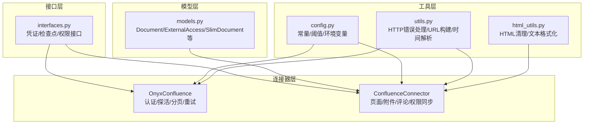
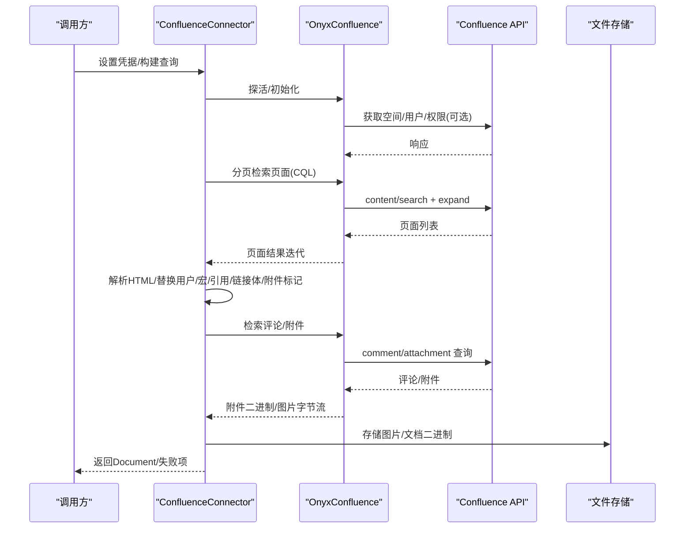
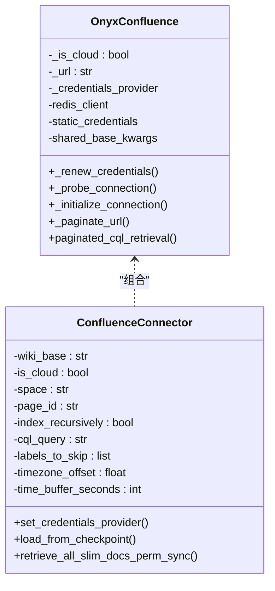
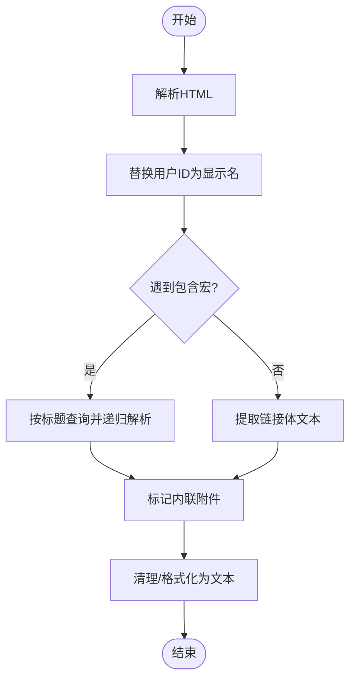
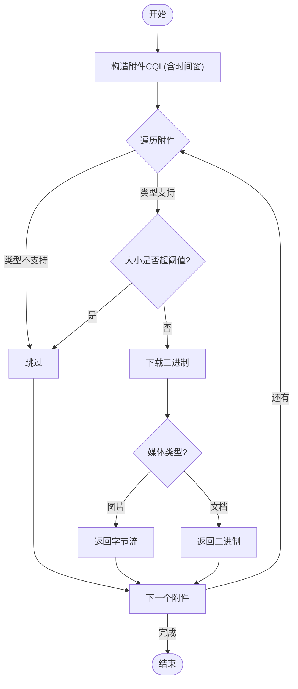
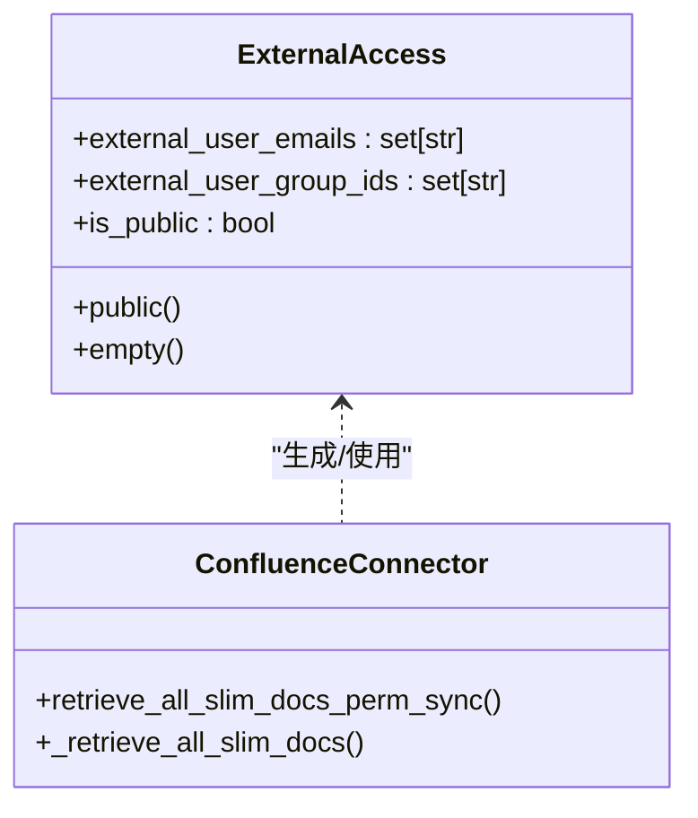
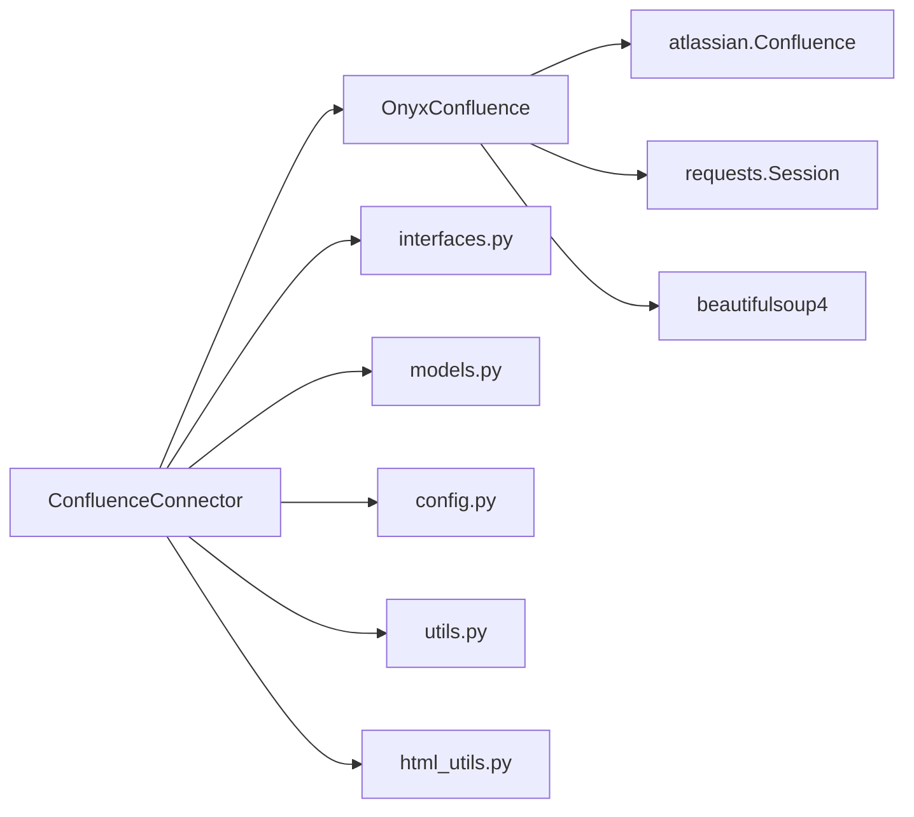

# Confluence集成

<cite>
**本文引用的文件**
- [confluence_connector.py](file://common/data_source/confluence_connector.py)
- [interfaces.py](file://common/data_source/interfaces.py)
- [models.py](file://common/data_source/models.py)
- [config.py](file://common/data_source/config.py)
- [utils.py](file://common/data_source/utils.py)
- [exceptions.py](file://common/data_source/exceptions.py)
- [html_utils.py](file://common/data_source/html_utils.py)
- [confluence-constant.tsx](file://web/src/pages/user-setting/data-source/constant/confluence-constant.tsx)
</cite>

## 目录
1. [简介](#简介)
2. [项目结构](#项目结构)
3. [核心组件](#核心组件)
4. [架构总览](#架构总览)
5. [详细组件分析](#详细组件分析)
6. [依赖关系分析](#依赖关系分析)
7. [性能考量](#性能考量)
8. [故障排查指南](#故障排查指南)
9. [结论](#结论)
10. [附录](#附录)

## 简介
本技术文档面向开发者与运维人员，系统性阐述如何在本项目中集成与使用Confluence数据源。文档覆盖以下关键主题：
- 连接器实现原理：认证机制（个人访问令牌、OAuth刷新）、分页与重试、CQL查询构建
- 内容抽取流程：Wiki标记语言解析、内联宏与页面引用处理、附件下载与类型过滤、评论聚合
- 权限模型集成：页面级与空间级访问限制、继承关系、外部访问标识
- 配置与实践：凭据设置、同步范围、复杂页面结构处理
- 性能优化与安全建议：速率限制、超时、缓存与最小化权限

## 项目结构
Confluence连接器位于通用数据源模块下，采用“接口-模型-工具-连接器”的分层设计：
- 接口层：定义统一的连接器契约（凭证、检查点、权限同步）
- 模型层：抽象文档、外部访问、失败信息等数据结构
- 工具层：HTML清理、时间解析、URL拼接、重试与退避
- 连接器层：OnyxConfluence封装第三方客户端、ConfluenceConnector实现具体业务逻辑

图表来源
- [interfaces.py:108-154](file://common/data_source/interfaces.py#L108-L154)
- [models.py:89-130](file://common/data_source/models.py#L89-L130)
- [config.py:147-227](file://common/data_source/config.py#L147-L227)
- [utils.py:112-158](file://common/data_source/utils.py#L112-L158)
- [html_utils.py:66-160](file://common/data_source/html_utils.py#L66-L160)
- [confluence_connector.py:63-125](file://common/data_source/confluence_connector.py#L63-L125)

章节来源
- [confluence_connector.py:1-120](file://common/data_source/confluence_connector.py#L1-L120)
- [interfaces.py:21-103](file://common/data_source/interfaces.py#L21-L103)
- [models.py:89-130](file://common/data_source/models.py#L89-L130)
- [config.py:147-227](file://common/data_source/config.py#L147-L227)
- [utils.py:112-158](file://common/data_source/utils.py#L112-L158)
- [html_utils.py:66-160](file://common/data_source/html_utils.py#L66-L160)

## 核心组件
- OnyxConfluence：对第三方Atlassian Confluence客户端进行增强，提供：
  - 自定义CQL方法与统一探活/初始化
  - 动态凭据更新（支持OAuth刷新令牌轮换）
  - 统一的分页与错误处理（含500回退逐条拉取）
  - 扩展字段与限制字段的处理
- ConfluenceConnector：实现具体业务：
  - 构建CQL查询（空间/页面/标签/时间范围）
  - 页面内容抽取（HTML解析、用户替换、内联宏/页面引用/链接体/附件标记）
  - 附件处理（类型校验、大小阈值、下载、图片直存）
  - 评论聚合与元数据提取
  - 权限同步（空间/页面/祖先继承）与外部访问标识

章节来源
- [confluence_connector.py:63-125](file://common/data_source/confluence_connector.py#L63-L125)
- [confluence_connector.py:1275-1367](file://common/data_source/confluence_connector.py#L1275-L1367)
- [interfaces.py:365-373](file://common/data_source/interfaces.py#L365-L373)
- [models.py:10-67](file://common/data_source/models.py#L10-L67)

## 架构总览
下图展示了从调用到产出文档的端到端流程，包括认证、内容抽取、附件处理与权限同步。

图表来源
- [confluence_connector.py:1864-1882](file://common/data_source/confluence_connector.py#L1864-L1882)
- [confluence_connector.py:1502-1619](file://common/data_source/confluence_connector.py#L1502-L1619)
- [confluence_connector.py:1620-1786](file://common/data_source/confluence_connector.py#L1620-L1786)
- [confluence_connector.py:1144-1242](file://common/data_source/confluence_connector.py#L1144-L1242)

## 详细组件分析

### 认证与连接管理
- 支持两种认证方式：
  - 个人访问令牌（Server/Cloud均可）
  - OAuth 2.0（Cloud）：通过刷新令牌自动轮换，使用Redis缓存与分布式锁保证一致性
- 探活与初始化：
  - 使用短超时探测端点，区分Cloud与Server差异
  - 初始化时根据凭据选择对应客户端构造参数
- 动态凭据更新：
  - 定期检查过期时间，提前半程刷新
  - 刷新后写入Redis与持久化提供者，确保多实例一致

图表来源
- [confluence_connector.py:63-125](file://common/data_source/confluence_connector.py#L63-L125)
- [confluence_connector.py:1275-1367](file://common/data_source/confluence_connector.py#L1275-L1367)

章节来源
- [confluence_connector.py:126-194](file://common/data_source/confluence_connector.py#L126-L194)
- [confluence_connector.py:206-298](file://common/data_source/confluence_connector.py#L206-L298)
- [confluence_connector.py:299-348](file://common/data_source/confluence_connector.py#L299-L348)
- [utils.py:987-1001](file://common/data_source/utils.py#L987-L1001)
- [config.py:221-227](file://common/data_source/config.py#L221-L227)

### 页面内容抽取与Wiki标记语言解析
- HTML解析与清理：
  - 使用BeautifulSoup解析，移除宏样式参数
  - 替换ri:user为显示名，防止脱敏导致LLM无法识别
  - 处理include宏：递归抓取被包含页面内容，避免循环与重复
  - 提取ac:link-body与ri:attachment为纯文本占位，便于后续处理
- 文本格式化：
  - 将HTML转换为扁平文本，保留标题/段落/列表/表格等结构化信息
  - 可选启用Trafilatura进行更深层的正文抽取

图表来源
- [confluence_connector.py:910-1022](file://common/data_source/confluence_connector.py#L910-L1022)
- [html_utils.py:66-160](file://common/data_source/html_utils.py#L66-L160)

章节来源
- [confluence_connector.py:910-1022](file://common/data_source/confluence_connector.py#L910-L1022)
- [html_utils.py:66-160](file://common/data_source/html_utils.py#L66-L160)

### 附件处理与评论数据获取
- 附件过滤与下载：
  - 类型校验：排除不支持类型（如视频/gliffy）
  - 大小阈值控制：超过阈值跳过，避免内存与带宽压力
  - 图片直存：返回原始字节流，延迟到下游解析
  - 文档类附件：返回二进制供后续解析
- 评论聚合：
  - 以CQL查询评论，展开body.view或body.storage
  - 对评论内容同样执行HTML解析与文本抽取

图表来源
- [confluence_connector.py:1620-1786](file://common/data_source/confluence_connector.py#L1620-L1786)
- [confluence_connector.py:1144-1242](file://common/data_source/confluence_connector.py#L1144-L1242)
- [confluence_connector.py:1484-1500](file://common/data_source/confluence_connector.py#L1484-L1500)

章节来源
- [confluence_connector.py:1144-1242](file://common/data_source/confluence_connector.py#L1144-L1242)
- [confluence_connector.py:1620-1786](file://common/data_source/confluence_connector.py#L1620-L1786)
- [confluence_connector.py:1484-1500](file://common/data_source/confluence_connector.py#L1484-L1500)
- [config.py:164-172](file://common/data_source/config.py#L164-L172)

### 权限模型集成与继承处理
- 外部访问标识：
  - 使用ExternalAccess表示外部用户邮箱集合、外部组ID集合与公开状态
  - 提供空集与全集辅助构造器，便于在不确定时保守处理
- 页面与空间权限：
  - 通过扩展字段获取页面/祖先/空间级限制
  - 合并策略：页面限制优先，其次祖先继承，最后空间级限制
  - Cloud/Server差异：Server通过JSON-RPC获取空间权限；Cloud通过扩展字段
- 权限同步：
  - 生成SlimDocument仅携带ID与外部访问信息，用于增量权限同步
  - 支持回调进度上报，便于长任务监控

图表来源
- [models.py:10-67](file://common/data_source/models.py#L10-L67)
- [confluence_connector.py:1922-2022](file://common/data_source/confluence_connector.py#L1922-L2022)
- [confluence_connector.py:796-824](file://common/data_source/confluence_connector.py#L796-L824)

章节来源
- [models.py:10-67](file://common/data_source/models.py#L10-L67)
- [confluence_connector.py:1922-2022](file://common/data_source/confluence_connector.py#L1922-L2022)
- [confluence_connector.py:796-824](file://common/data_source/confluence_connector.py#L796-L824)

### 配置与使用示例
- 凭据与基础信息：
  - 用户名/访问令牌、Wiki基础URL、是否Cloud
  - 可选：作用域令牌、时区偏移、时间缓冲
- 同步范围：
  - 全量、按空间、按页面（可递归包含祖先）
  - 标签过滤：跳过敏感标签
- 实践场景：
  - 企业内部文档：按空间同步，开启权限同步
  - 产品知识库：按页面递归，开启评论与附件
  - 跨时区部署：设置CONFLUENCE_TIMEZONE_OFFSET与CONFLUENCE_SYNC_TIME_BUFFER_SECONDS

章节来源
- [confluence_connector.py:1281-1367](file://common/data_source/confluence_connector.py#L1281-L1367)
- [config.py:147-227](file://common/data_source/config.py#L147-L227)
- [confluence-constant.tsx:4-53](file://web/src/pages/user-setting/data-source/constant/confluence-constant.tsx#L4-L53)

## 依赖关系分析
- 第三方依赖：
  - atlassian-python-api：Confluence REST客户端
  - requests：底层HTTP请求与会话
  - beautifulsoup4：HTML解析与清洗
- 内部依赖：
  - 接口契约：统一凭证、检查点、权限同步协议
  - 数据模型：Document/SlimDocument/ExternalAccess
  - 工具函数：HTTP错误处理、URL构建、时间解析、HTML格式化

图表来源
- [confluence_connector.py:1275-1367](file://common/data_source/confluence_connector.py#L1275-L1367)
- [interfaces.py:21-103](file://common/data_source/interfaces.py#L21-L103)
- [models.py:89-130](file://common/data_source/models.py#L89-L130)
- [config.py:147-227](file://common/data_source/config.py#L147-L227)
- [utils.py:112-158](file://common/data_source/utils.py#L112-L158)
- [html_utils.py:66-160](file://common/data_source/html_utils.py#L66-L160)

章节来源
- [confluence_connector.py:1275-1367](file://common/data_source/confluence_connector.py#L1275-L1367)
- [interfaces.py:21-103](file://common/data_source/interfaces.py#L21-L103)
- [models.py:89-130](file://common/data_source/models.py#L89-L130)
- [config.py:147-227](file://common/data_source/config.py#L147-L227)
- [utils.py:112-158](file://common/data_source/utils.py#L112-L158)
- [html_utils.py:66-160](file://common/data_source/html_utils.py#L66-L160)

## 性能考量
- 分页与批量：
  - 默认分页上限可配置，结合游标/偏移分页策略
  - 批量输出文档，减少下游处理开销
- 速率限制与退避：
  - 429/403统一处理，支持Retry-After头或指数退避
  - 500错误在Server端回退为逐条拉取，避免丢失数据
- 缓存与最小化请求：
  - 用户显示名与邮箱缓存，降低重复查询
  - 附件大小阈值与类型过滤，减少无效I/O
- 超时与并发：
  - 低超时探活客户端用于快速验证
  - 会话复用与连接池提升吞吐

章节来源
- [confluence_connector.py:498-648](file://common/data_source/confluence_connector.py#L498-L648)
- [utils.py:112-158](file://common/data_source/utils.py#L112-L158)
- [confluence_connector.py:853-870](file://common/data_source/confluence_connector.py#L853-L870)
- [config.py:164-172](file://common/data_source/config.py#L164-L172)

## 故障排查指南
- 常见错误与处理：
  - 401凭据失效：抛出CredentialExpiredError，需重新配置
  - 403权限不足：抛出InsufficientPermissionsError，检查角色与范围
  - 429/403速率限制：自动退避或等待Retry-After
  - 时间字段异常：捕获特定日期错误，必要时调整时间缓冲
- 日志与定位：
  - 请求URL、响应体、异常堆栈均记录，便于复现
  - 分页过程中的空页检测与回调更新，避免死循环
- 建议操作：
  - 先用低超时客户端探活
  - 逐步缩小同步范围（空间→页面→递归）
  - 调整时间缓冲与分页上限

章节来源
- [confluence_connector.py:2024-2058](file://common/data_source/confluence_connector.py#L2024-L2058)
- [confluence_connector.py:1864-1882](file://common/data_source/confluence_connector.py#L1864-L1882)
- [exceptions.py:4-30](file://common/data_source/exceptions.py#L4-L30)
- [utils.py:112-158](file://common/data_source/utils.py#L112-L158)

## 结论
本实现以清晰的分层与完善的工具链，提供了稳定、可扩展的Confluence数据源接入能力。通过严格的认证与权限模型集成、健壮的分页与错误处理、以及可配置的性能参数，能够满足从企业知识库到产品文档的多样化需求。建议在生产环境中配合最小权限原则、合理的超时与退避策略，并定期校验凭据有效性与权限范围。

## 附录
- 关键配置项
  - CONFLUENCE_CONNECTOR_ATTACHMENT_SIZE_THRESHOLD：附件大小阈值（默认10MB）
  - CONFLUENCE_CONNECTOR_ATTACHMENT_CHAR_COUNT_THRESHOLD：附件字符数阈值（默认20万）
  - CONFLUENCE_TIMEZONE_OFFSET：时区偏移（默认本地时区）
  - CONFLUENCE_SYNC_TIME_BUFFER_SECONDS：同步时间缓冲（默认一天）
  - OAUTH_CONFLUENCE_CLOUD_CLIENT_ID/SECRET：Cloud OAuth凭据
- 前端表单字段参考
  - 用户名、访问令牌、Wiki基础URL、是否Cloud、索引模式（全部/空间/页面）、页面ID（可选）

章节来源
- [config.py:164-227](file://common/data_source/config.py#L164-L227)
- [confluence-constant.tsx:4-53](file://web/src/pages/user-setting/data-source/constant/confluence-constant.tsx#L4-L53)