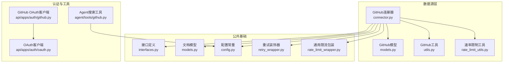
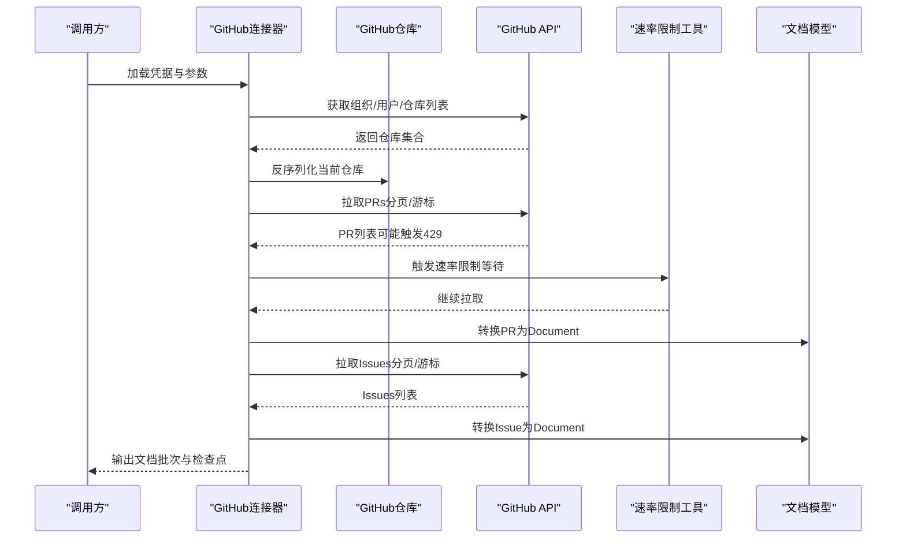
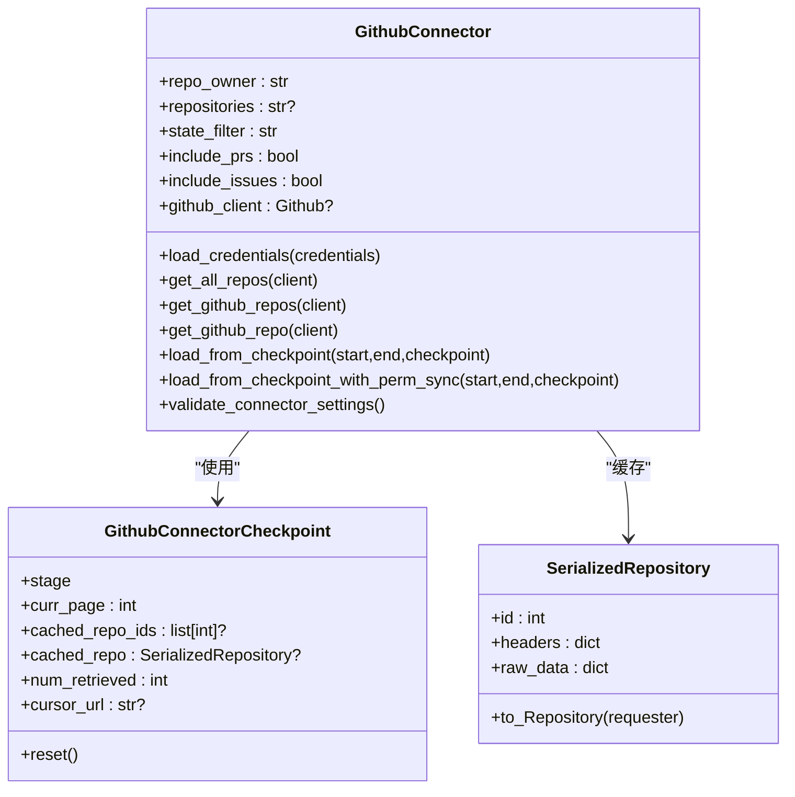
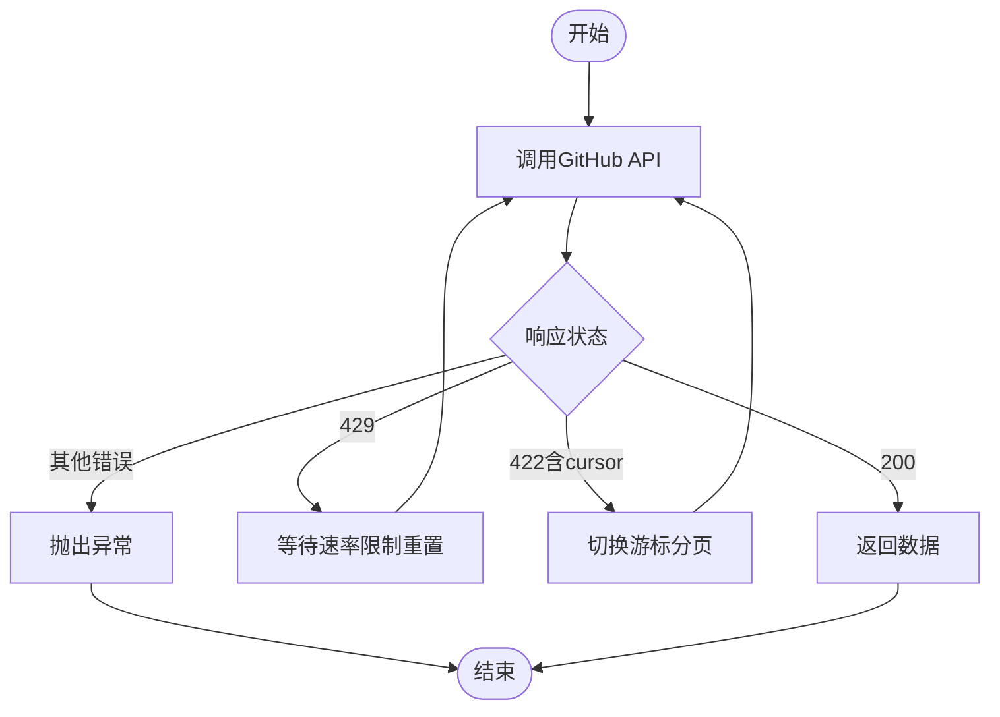
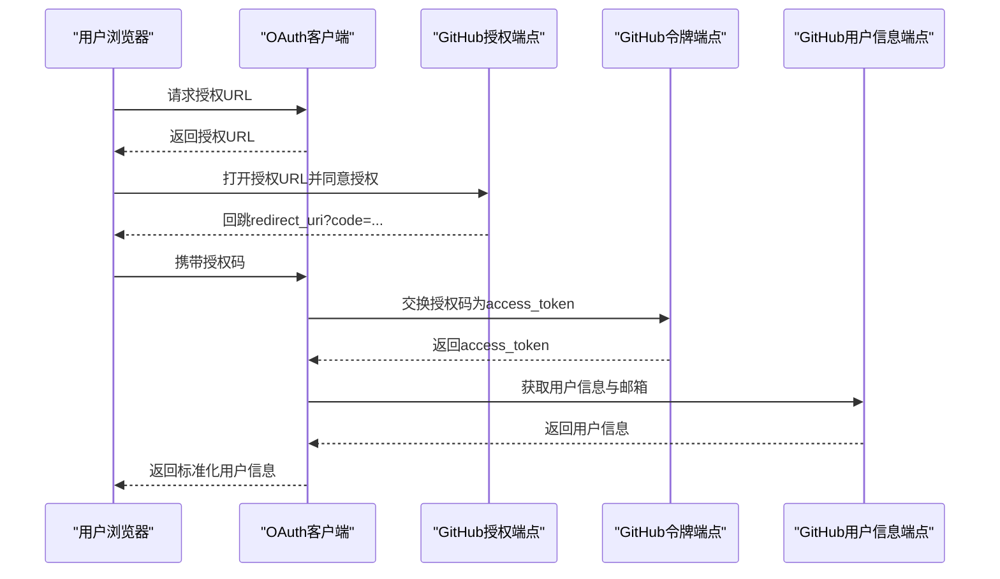
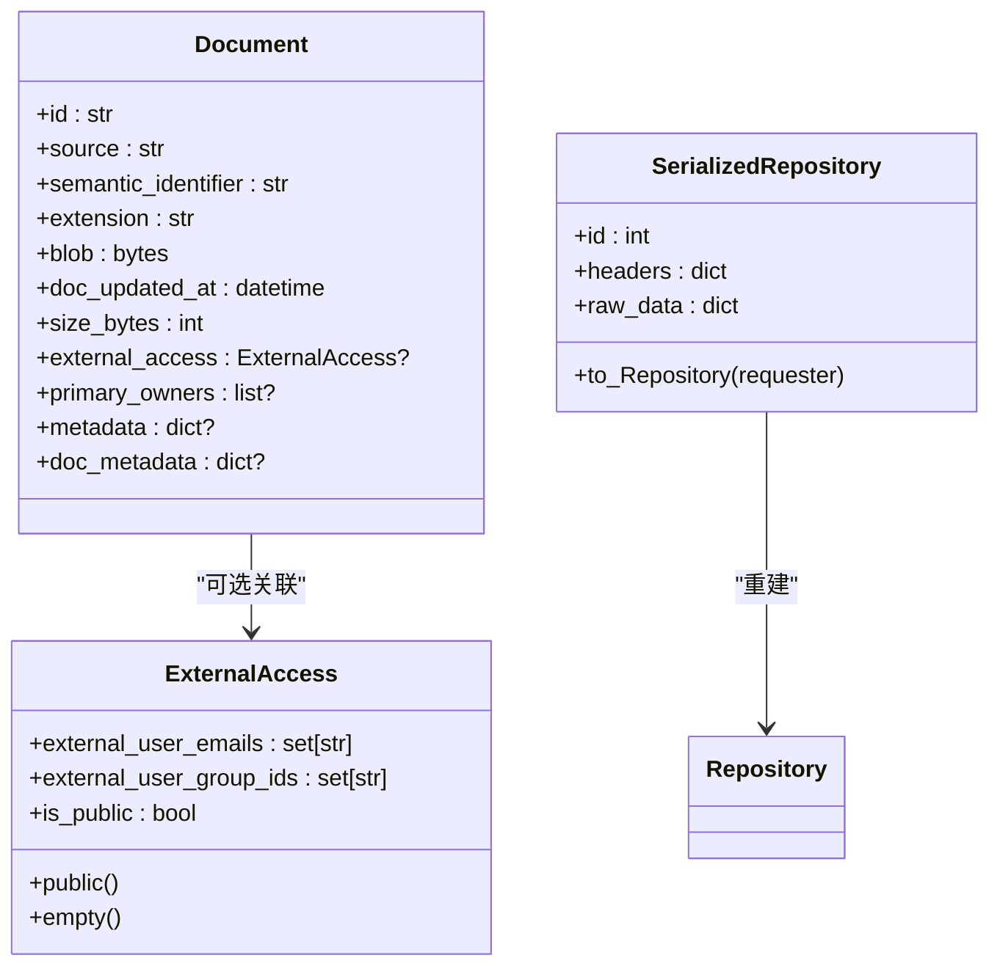
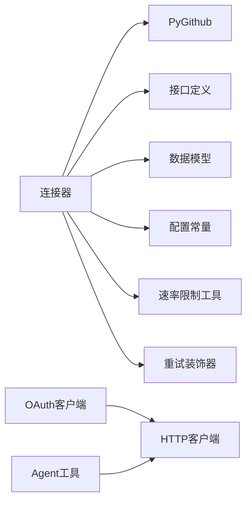

# GitHub集成

<cite>
**本文引用的文件**
- [common/data_source/github/connector.py](file://common/data_source/github/connector.py)
- [common/data_source/github/models.py](file://common/data_source/github/models.py)
- [common/data_source/github/rate_limit_utils.py](file://common/data_source/github/rate_limit_utils.py)
- [common/data_source/github/utils.py](file://common/data_source/github/utils.py)
- [common/data_source/cross_connector_utils/rate_limit_wrapper.py](file://common/data_source/cross_connector_utils/rate_limit_wrapper.py)
- [common/data_source/cross_connector_utils/retry_wrapper.py](file://common/data_source/cross_connector_utils/retry_wrapper.py)
- [common/data_source/interfaces.py](file://common/data_source/interfaces.py)
- [common/data_source/config.py](file://common/data_source/config.py)
- [common/data_source/models.py](file://common/data_source/models.py)
- [api/apps/auth/github.py](file://api/apps/auth/github.py)
- [api/apps/auth/oauth.py](file://api/apps/auth/oauth.py)
- [agent/tools/github.py](file://agent/tools/github.py)
</cite>

## 目录
1. [简介](#简介)
2. [项目结构](#项目结构)
3. [核心组件](#核心组件)
4. [架构总览](#架构总览)
5. [详细组件分析](#详细组件分析)
6. [依赖分析](#依赖分析)
7. [性能考虑](#性能考虑)
8. [故障排查指南](#故障排查指南)
9. [结论](#结论)
10. [附录](#附录)

## 简介
本文件面向需要在系统中集成GitHub数据源的开发者与运维人员，系统性阐述GitHub连接器的实现原理与使用方法，覆盖以下主题：
- 连接器架构与控制流：仓库同步、分支管理、文件变更监控（Issues/PRs）、权限同步与检查点机制
- 认证与授权：个人访问令牌加载、OAuth流程（用户信息获取）
- API速率限制与错误重试：PyGithub速率限制处理、游标分页回退策略
- 数据模型与转换：文档对象生成、外部访问权限封装、序列化仓库对象
- 配置与部署：环境变量、访问令牌、同步范围与时间窗口
- 性能优化与安全最佳实践：分页策略、重试与退避、日志与可观测性
- 常见问题与排障：权限不足、速率限制、组织授权缺失、404/401/403异常

## 项目结构
围绕GitHub集成的相关模块主要分布在如下位置：
- 数据源连接器与工具：common/data_source/github、agent/tools/github.py
- 公共接口与模型：common/data_source/interfaces.py、common/data_source/models.py
- 通用限流与重试：common/data_source/cross_connector_utils/rate_limit_wrapper.py、cross_connector_utils/retry_wrapper.py
- 配置常量：common/data_source/config.py
- OAuth认证：api/apps/auth/github.py、api/apps/auth/oauth.py

**图表来源**
- [common/data_source/github/connector.py:413-792](file://common/data_source/github/connector.py#L413-L792)
- [common/data_source/github/models.py:8-17](file://common/data_source/github/models.py#L8-L17)
- [common/data_source/github/utils.py:11-44](file://common/data_source/github/utils.py#L11-L44)
- [common/data_source/github/rate_limit_utils.py:10-24](file://common/data_source/github/rate_limit_utils.py#L10-L24)
- [common/data_source/interfaces.py:71-103](file://common/data_source/interfaces.py#L71-L103)
- [common/data_source/models.py:89-156](file://common/data_source/models.py#L89-L156)
- [common/data_source/config.py:248-248](file://common/data_source/config.py#L248-L248)
- [common/data_source/cross_connector_utils/retry_wrapper.py:16-44](file://common/data_source/cross_connector_utils/retry_wrapper.py#L16-L44)
- [common/data_source/cross_connector_utils/rate_limit_wrapper.py:93-126](file://common/data_source/cross_connector_utils/rate_limit_wrapper.py#L93-L126)
- [api/apps/auth/oauth.py:32-152](file://api/apps/auth/oauth.py#L32-L152)
- [api/apps/auth/github.py:21-89](file://api/apps/auth/github.py#L21-L89)
- [agent/tools/github.py:57-105](file://agent/tools/github.py#L57-L105)

**章节来源**
- [common/data_source/github/connector.py:413-792](file://common/data_source/github/connector.py#L413-L792)
- [common/data_source/github/models.py:8-17](file://common/data_source/github/models.py#L8-L17)
- [common/data_source/github/utils.py:11-44](file://common/data_source/github/utils.py#L11-L44)
- [common/data_source/github/rate_limit_utils.py:10-24](file://common/data_source/github/rate_limit_utils.py#L10-L24)
- [common/data_source/interfaces.py:71-103](file://common/data_source/interfaces.py#L71-L103)
- [common/data_source/models.py:89-156](file://common/data_source/models.py#L89-L156)
- [common/data_source/config.py:248-248](file://common/data_source/config.py#L248-L248)
- [common/data_source/cross_connector_utils/retry_wrapper.py:16-44](file://common/data_source/cross_connector_utils/retry_wrapper.py#L16-L44)
- [common/data_source/cross_connector_utils/rate_limit_wrapper.py:93-126](file://common/data_source/cross_connector_utils/rate_limit_wrapper.py#L93-L126)
- [api/apps/auth/oauth.py:32-152](file://api/apps/auth/oauth.py#L32-L152)
- [api/apps/auth/github.py:21-89](file://api/apps/auth/github.py#L21-L89)
- [agent/tools/github.py:57-105](file://agent/tools/github.py#L57-L105)

## 核心组件
- GitHub连接器（CheckpointedConnectorWithPermSyncGH）：负责从指定仓库或组织的所有仓库中抓取Issues与PRs，支持游标分页回退、速率限制退避、时间窗口过滤、权限同步与检查点恢复。
- 文档模型与外部访问模型：统一输出Document对象，携带元数据、扩展名、更新时间、大小等；ExternalAccess用于权限同步占位。
- 速率限制与重试：基于PyGithub的RateLimitExceededException自动休眠等待；对“大集合”场景回退到游标分页；通用重试装饰器提供指数退避与抖动。
- OAuth认证：提供GitHub OAuth授权URL生成、令牌交换、用户信息获取与标准化。
- 工具函数：序列化/反序列化仓库对象、获取外部访问权限占位。

**章节来源**
- [common/data_source/github/connector.py:413-792](file://common/data_source/github/connector.py#L413-L792)
- [common/data_source/models.py:89-156](file://common/data_source/models.py#L89-L156)
- [common/data_source/github/rate_limit_utils.py:10-24](file://common/data_source/github/rate_limit_utils.py#L10-L24)
- [common/data_source/cross_connector_utils/retry_wrapper.py:16-44](file://common/data_source/cross_connector_utils/retry_wrapper.py#L16-L44)
- [api/apps/auth/github.py:21-89](file://api/apps/auth/github.py#L21-L89)
- [common/data_source/github/utils.py:11-44](file://common/data_source/github/utils.py#L11-L44)

## 架构总览
下图展示了从连接器到GitHub API、再到文档产出的整体流程，以及OAuth认证路径与速率限制处理。

**图表来源**
- [common/data_source/github/connector.py:529-740](file://common/data_source/github/connector.py#L529-L740)
- [common/data_source/github/rate_limit_utils.py:10-24](file://common/data_source/github/rate_limit_utils.py#L10-L24)
- [common/data_source/models.py:89-156](file://common/data_source/models.py#L89-L156)

## 详细组件分析

### GitHub连接器（GithubConnector）
- 职责
  - 加载凭据（Token），支持自定义基础URL
  - 获取仓库集合：单个、多个、全部（组织或用户）
  - 拉取PRs与Issues，按更新时间倒序，支持时间窗口过滤
  - 游标分页回退：当出现“大集合不支持页码分页”的错误时，自动切换到after/before游标分页
  - 速率限制处理：捕获RateLimitExceededException后等待至重置时间
  - 权限同步：可选返回ExternalAccess占位
  - 检查点：记录阶段、页码、游标URL、已检索数量、缓存仓库ID与序列化仓库
- 关键流程
  - 初始化与凭据加载
  - 仓库枚举与缓存
  - PR阶段：offset分页或游标分页，时间窗口过滤，转Document
  - Issues阶段：排除PR类型，时间窗口过滤，转Document
  - 切换仓库与收尾

**图表来源**
- [common/data_source/github/connector.py:413-792](file://common/data_source/github/connector.py#L413-L792)
- [common/data_source/github/models.py:8-17](file://common/data_source/github/models.py#L8-L17)
- [common/data_source/github/models.py:14-17](file://common/data_source/github/models.py#L14-L17)

**章节来源**
- [common/data_source/github/connector.py:413-792](file://common/data_source/github/connector.py#L413-L792)
- [common/data_source/github/models.py:8-17](file://common/data_source/github/models.py#L8-L17)

### 速率限制与游标分页
- 速率限制
  - 捕获RateLimitExceededException，读取core.reset并等待重置时间（额外加1分钟缓冲）
- 游标分页回退
  - 当API返回422且消息包含“cursor”关键词时，切换到after/before游标分页
  - 支持断点续传：记录cursor_url与已检索数量，失败重试时可回退到起始页
- 重试装饰器
  - 提供指数退避与抖动的通用重试包装，适用于其他HTTP请求场景

**图表来源**
- [common/data_source/github/rate_limit_utils.py:10-24](file://common/data_source/github/rate_limit_utils.py#L10-L24)
- [common/data_source/github/connector.py:189-217](file://common/data_source/github/connector.py#L189-L217)
- [common/data_source/cross_connector_utils/retry_wrapper.py:16-44](file://common/data_source/cross_connector_utils/retry_wrapper.py#L16-L44)

**章节来源**
- [common/data_source/github/rate_limit_utils.py:10-24](file://common/data_source/github/rate_limit_utils.py#L10-L24)
- [common/data_source/github/connector.py:189-217](file://common/data_source/github/connector.py#L189-L217)
- [common/data_source/cross_connector_utils/retry_wrapper.py:16-44](file://common/data_source/cross_connector_utils/retry_wrapper.py#L16-L44)

### OAuth认证流程（GitHub）
- 授权URL生成：拼接client_id、redirect_uri、response_type=code、scope
- 令牌交换：使用授权码换取access_token
- 用户信息获取：调用/user与/user/emails，合并主邮箱，标准化UserInfo
- 异步版本：基于httpx的异步实现

**图表来源**
- [api/apps/auth/oauth.py:48-111](file://api/apps/auth/oauth.py#L48-L111)
- [api/apps/auth/github.py:35-80](file://api/apps/auth/github.py#L35-L80)

**章节来源**
- [api/apps/auth/oauth.py:32-152](file://api/apps/auth/oauth.py#L32-L152)
- [api/apps/auth/github.py:21-89](file://api/apps/auth/github.py#L21-L89)

### 文档模型与外部访问
- Document：统一文档载体，包含id、source、semantic_identifier、extension、blob、doc_updated_at、size_bytes、external_access、primary_owners、metadata、doc_metadata
- ExternalAccess：外部访问权限占位，支持public/empty两种默认态
- SerializedRepository：仓库对象序列化/反序列化，便于检查点持久化

**图表来源**
- [common/data_source/models.py:89-156](file://common/data_source/models.py#L89-L156)
- [common/data_source/models.py:10-66](file://common/data_source/models.py#L10-L66)
- [common/data_source/github/models.py:8-17](file://common/data_source/github/models.py#L8-L17)

**章节来源**
- [common/data_source/models.py:89-156](file://common/data_source/models.py#L89-L156)
- [common/data_source/models.py:10-66](file://common/data_source/models.py#L10-L66)
- [common/data_source/github/models.py:8-17](file://common/data_source/github/models.py#L8-L17)

### Agent工具：GitHub仓库搜索
- 功能：基于关键词搜索GitHub仓库，返回标题、链接、描述与星数等字段
- 实现：构造查询URL，发送GET请求，解析JSON并格式化输出
- 安全：通过超时与重试参数控制执行时长与稳定性

**章节来源**
- [agent/tools/github.py:57-105](file://agent/tools/github.py#L57-L105)

## 依赖分析
- 内部耦合
  - 连接器依赖PyGithub（Repository、PaginatedList、RateLimitExceededException等）
  - 依赖通用接口与模型（Checkpoint、Document、ExternalAccess）
  - 依赖配置常量（如GITHUB_CONNECTOR_BASE_URL）
- 外部依赖
  - GitHub API（REST/GQL）
  - OAuth端点（authorize/token/userinfo）

**图表来源**
- [common/data_source/github/connector.py:12-44](file://common/data_source/github/connector.py#L12-L44)
- [common/data_source/interfaces.py:71-103](file://common/data_source/interfaces.py#L71-L103)
- [common/data_source/models.py:89-156](file://common/data_source/models.py#L89-L156)
- [common/data_source/config.py:248-248](file://common/data_source/config.py#L248-L248)
- [common/data_source/github/rate_limit_utils.py:10-24](file://common/data_source/github/rate_limit_utils.py#L10-L24)
- [common/data_source/cross_connector_utils/retry_wrapper.py:16-44](file://common/data_source/cross_connector_utils/retry_wrapper.py#L16-L44)
- [api/apps/auth/oauth.py:17-18](file://api/apps/auth/oauth.py#L17-L18)
- [agent/tools/github.py:18-22](file://agent/tools/github.py#L18-L22)

**章节来源**
- [common/data_source/github/connector.py:12-44](file://common/data_source/github/connector.py#L12-L44)
- [common/data_source/interfaces.py:71-103](file://common/data_source/interfaces.py#L71-L103)
- [common/data_source/models.py:89-156](file://common/data_source/models.py#L89-L156)
- [common/data_source/config.py:248-248](file://common/data_source/config.py#L248-L248)
- [common/data_source/github/rate_limit_utils.py:10-24](file://common/data_source/github/rate_limit_utils.py#L10-L24)
- [common/data_source/cross_connector_utils/retry_wrapper.py:16-44](file://common/data_source/cross_connector_utils/retry_wrapper.py#L16-L44)
- [api/apps/auth/oauth.py:17-18](file://api/apps/auth/oauth.py#L17-L18)
- [agent/tools/github.py:18-22](file://agent/tools/github.py#L18-L22)

## 性能考虑
- 分页策略
  - 默认每页100条，优先使用offset分页；遇到“大集合不支持页码分页”时自动回退到游标分页
  - 游标分页会记录cursor_url与已检索数量，避免重复拉取历史页面
- 速率限制
  - 基于core.reset精确等待；额外1分钟缓冲，降低重试抖动
  - 对PR与Issue分别进行分页，减少单次请求负载
- 时间窗口过滤
  - 按updated_at倒序遍历，到达start边界即停止，避免扫描全量历史
- 重试与退避
  - 使用指数退避与抖动，降低集中重试导致的二次限流风险
- 日志与可观测性
  - 定期记录已检索数量与当前游标URL，便于定位卡顿与异常

[本节为通用性能建议，无需特定文件引用]

## 故障排查指南
- 401 未授权/令牌过期
  - 现象：校验或运行时报错
  - 处理：重新生成或刷新令牌，确保scope正确
  - 参考
    - [common/data_source/github/connector.py:888-896](file://common/data_source/github/connector.py#L888-L896)
- 403 权限不足
  - 现象：访问仓库/组织报错
  - 处理：确认令牌scope与组织授权；必要时申请组织级权限
  - 参考
    - [common/data_source/github/connector.py:893-896](file://common/data_source/github/connector.py#L893-L896)
- 404 仓库/用户/组织不存在
  - 现象：指定owner或repo不存在
  - 处理：核对owner与repo名称；多仓库逗号分隔时逐个验证
  - 参考
    - [common/data_source/github/connector.py:897-910](file://common/data_source/github/connector.py#L897-L910)
- 429 速率限制
  - 现象：频繁请求被限流
  - 处理：等待core.reset；降低并发或增加延迟；启用检查点断点续跑
  - 参考
    - [common/data_source/github/rate_limit_utils.py:10-24](file://common/data_source/github/rate_limit_utils.py#L10-L24)
- “大集合不支持页码分页”
  - 现象：API返回422且消息包含cursor
  - 处理：自动回退到游标分页；若多次重试仍失败，检查网络与API可用性
  - 参考
    - [common/data_source/github/connector.py:200-217](file://common/data_source/github/connector.py#L200-L217)
- 组织授权缺失（SSO）
  - 现象：提示需授权给组织
  - 处理：根据指引完成SAML SSO授权
  - 参考
    - [common/data_source/github/connector.py:860-871](file://common/data_source/github/connector.py#L860-L871)
- 检查点异常
  - 现象：断点恢复时游标过期或数据不一致
  - 处理：允许自动回退到起始页重试；关注日志中的警告信息
  - 参考
    - [common/data_source/github/connector.py:143-155](file://common/data_source/github/connector.py#L143-L155)

**章节来源**
- [common/data_source/github/connector.py:888-910](file://common/data_source/github/connector.py#L888-L910)
- [common/data_source/github/rate_limit_utils.py:10-24](file://common/data_source/github/rate_limit_utils.py#L10-L24)
- [common/data_source/github/connector.py:200-217](file://common/data_source/github/connector.py#L200-L217)
- [common/data_source/github/connector.py:860-871](file://common/data_source/github/connector.py#L860-L871)

## 结论
该GitHub数据源集成以“检查点+游标分页+速率限制退避”为核心设计，兼顾了大规模仓库的稳定性与增量同步的效率。结合OAuth认证与权限占位模型，能够满足企业级的合规与权限需求。通过合理的配置与重试策略，可在保证可靠性的同时提升吞吐。

[本节为总结，无需特定文件引用]

## 附录

### 配置示例与最佳实践
- 访问令牌
  - 在连接器凭据中提供github_access_token
  - 若使用GitHub Enterprise，请设置GITHUB_CONNECTOR_BASE_URL指向企业实例地址
  - 参考
    - [common/data_source/config.py:248-248](file://common/data_source/config.py#L248-L248)
    - [common/data_source/github/connector.py:429-446](file://common/data_source/github/connector.py#L429-L446)
- 同步规则
  - 指定repo_owner与repositories（单个或逗号分隔的多个）
  - 设置state_filter（如open/closed/all）
  - 控制include_prs与include_issues开关
  - 参考
    - [common/data_source/github/connector.py:414-427](file://common/data_source/github/connector.py#L414-L427)
- 时间窗口
  - start/end以秒为单位的时间戳；内部会做时区与边界调整
  - 参考
    - [common/data_source/github/connector.py:742-769](file://common/data_source/github/connector.py#L742-L769)
- 大文件与内容大小
  - 可通过环境变量调整下载块大小与阈值（适用于其他连接器）
  - 参考
    - [common/data_source/config.py:120-121](file://common/data_source/config.py#L120-L121)
- 安全建议
  - 使用最小权限令牌（scope仅包含所需范围）
  - 对组织访问启用SSO授权
  - 限制连接器并发，避免触发API限流
  - 开启检查点，支持断点续跑
  - 参考
    - [common/data_source/github/connector.py:860-871](file://common/data_source/github/connector.py#L860-L871)
    - [common/data_source/github/rate_limit_utils.py:10-24](file://common/data_source/github/rate_limit_utils.py#L10-L24)

**章节来源**
- [common/data_source/config.py:248-248](file://common/data_source/config.py#L248-L248)
- [common/data_source/github/connector.py:414-427](file://common/data_source/github/connector.py#L414-L427)
- [common/data_source/github/connector.py:742-769](file://common/data_source/github/connector.py#L742-L769)
- [common/data_source/config.py:120-121](file://common/data_source/config.py#L120-L121)
- [common/data_source/github/connector.py:860-871](file://common/data_source/github/connector.py#L860-L871)
- [common/data_source/github/rate_limit_utils.py:10-24](file://common/data_source/github/rate_limit_utils.py#L10-L24)