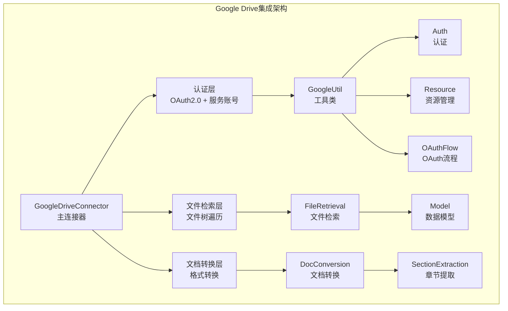
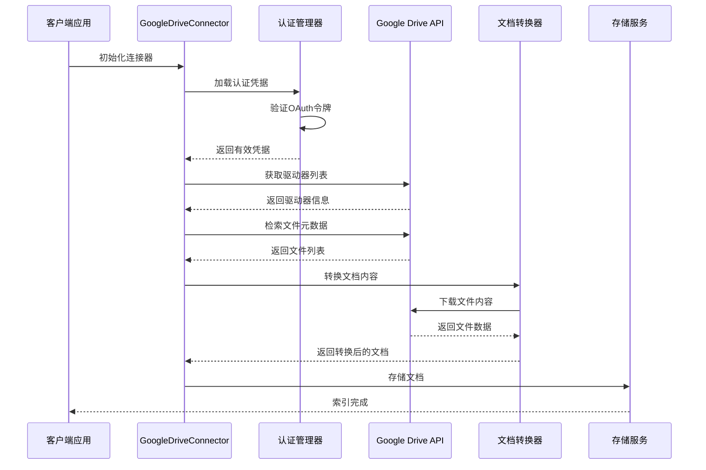
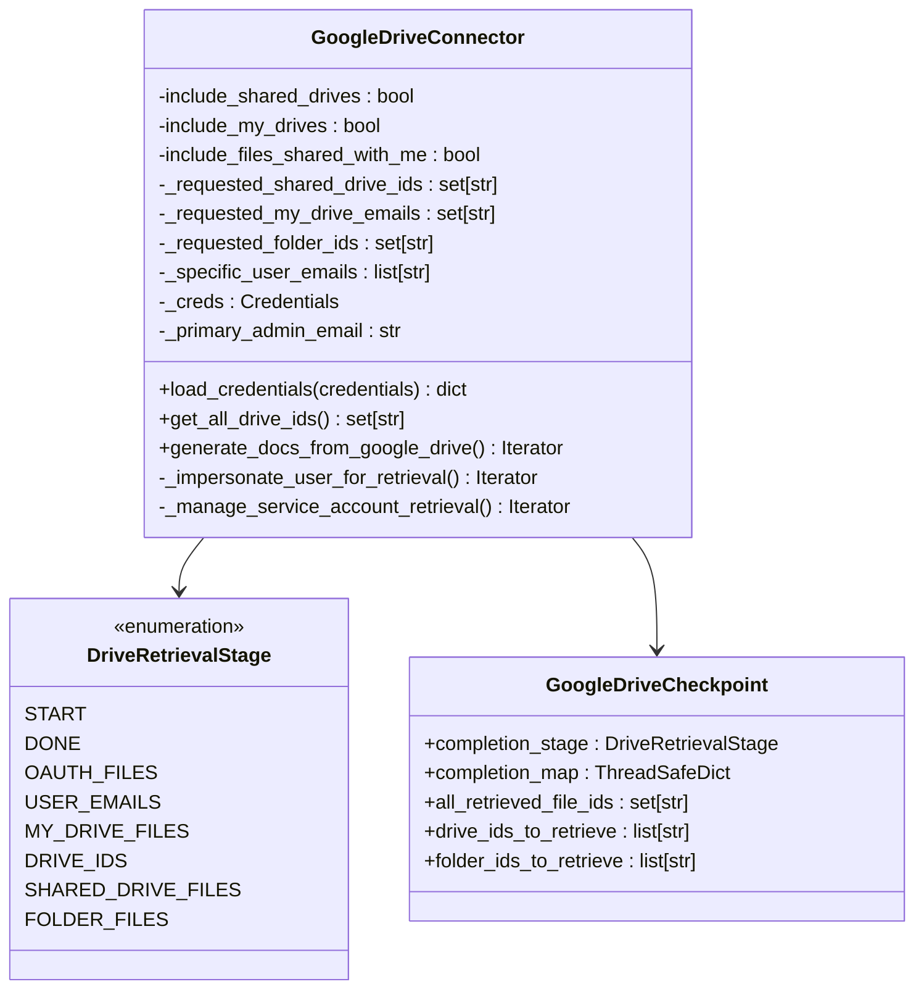
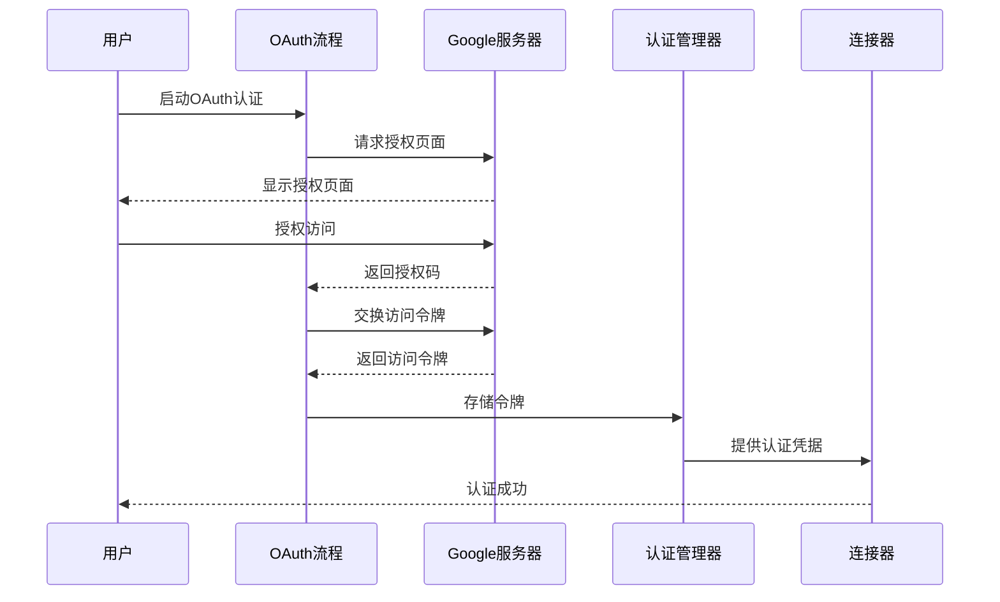
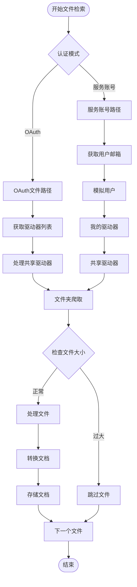
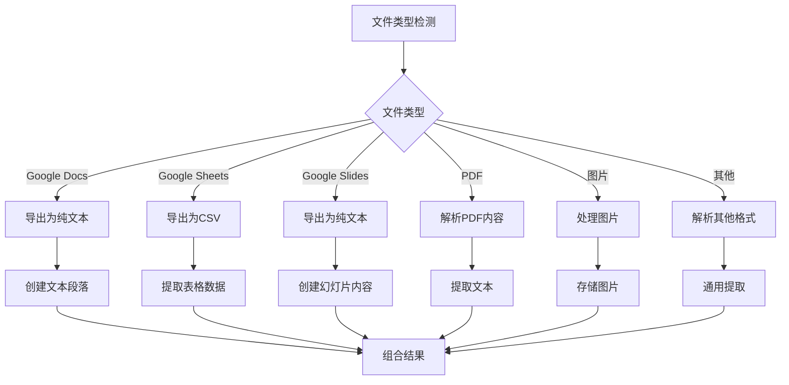
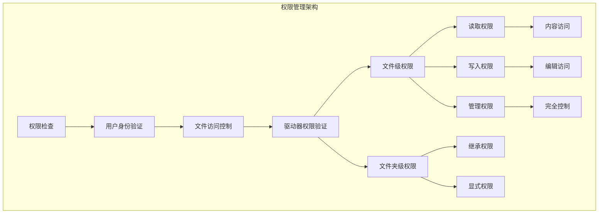
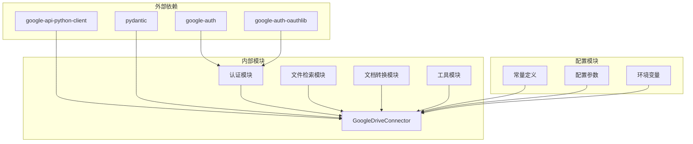
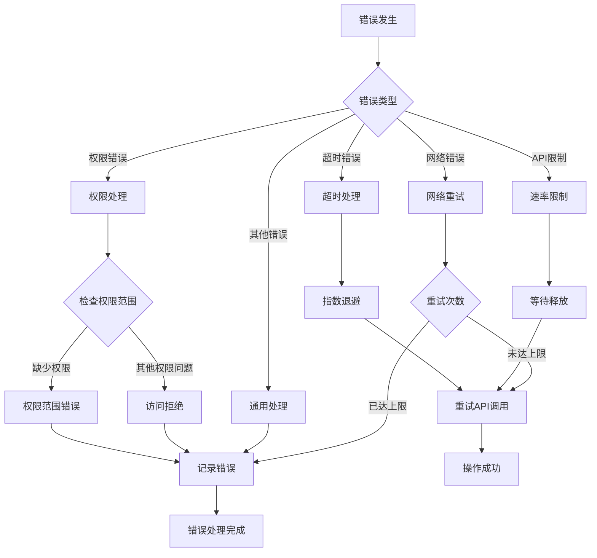

# Google Drive集成

<cite>
**本文档引用的文件**
- [connector.py](file://common/data_source/google_drive/connector.py)
- [doc_conversion.py](file://common/data_source/google_drive/doc_conversion.py)
- [file_retrieval.py](file://common/data_source/google_drive/file_retrieval.py)
- [model.py](file://common/data_source/google_drive/model.py)
- [constant.py](file://common/data_source/google_drive/constant.py)
- [section_extraction.py](file://common/data_source/google_drive/section_extraction.py)
- [auth.py](file://common/data_source/google_util/auth.py)
- [oauth_flow.py](file://common/data_source/google_util/oauth_flow.py)
- [resource.py](file://common/data_source/google_util/resource.py)
- [util.py](file://common/data_source/google_util/util.py)
- [constant.py](file://common/data_source/google_util/constant.py)
- [config.py](file://common/data_source/config.py)
</cite>

## 目录
1. [简介](#简介)
2. [项目结构](#项目结构)
3. [核心组件](#核心组件)
4. [架构概览](#架构概览)
5. [详细组件分析](#详细组件分析)
6. [依赖关系分析](#依赖关系分析)
7. [性能考虑](#性能考虑)
8. [故障排除指南](#故障排除指南)
9. [结论](#结论)
10. [附录](#附录)

## 简介

Google Drive数据源集成为RAGFlow平台提供了与Google Workspace深度集成的能力，支持从Google Drive中自动索引和提取文档内容。该集成实现了完整的OAuth 2.0认证流程、API访问权限管理、文件元数据获取、文档转换机制以及智能文件检索算法。

本系统支持两种主要的认证模式：OAuth 2.0用户认证和Google服务账号认证。通过智能的文件树遍历和文件夹层级管理，系统能够高效地处理大规模的Google Drive存储空间。同时，系统具备强大的文档内容提取能力，支持Google Docs、Sheets、Slides等多种格式的转换处理。

## 项目结构

Google Drive集成模块采用分层架构设计，主要包含以下核心层次：

**图表来源**
- [connector.py:112-170](file://common/data_source/google_drive/connector.py#L112-L170)
- [auth.py:37-127](file://common/data_source/google_util/auth.py#L37-L127)
- [file_retrieval.py:107-180](file://common/data_source/google_drive/file_retrieval.py#L107-L180)
- [doc_conversion.py:418-509](file://common/data_source/google_drive/doc_conversion.py#L418-L509)

**章节来源**
- [connector.py:1-1258](file://common/data_source/google_drive/connector.py#L1-L1258)
- [auth.py:1-158](file://common/data_source/google_util/auth.py#L1-L158)
- [file_retrieval.py:1-347](file://common/data_source/google_drive/file_retrieval.py#L1-L347)
- [doc_conversion.py:1-608](file://common/data_source/google_drive/doc_conversion.py#L1-L608)

## 核心组件

### 主连接器 (GoogleDriveConnector)

GoogleDriveConnector是整个Google Drive集成的核心组件，负责协调所有数据源操作。它实现了检查点式连接器接口，支持断点续传和状态恢复。

**关键特性：**
- 支持OAuth 2.0和Google服务账号两种认证模式
- 智能文件树遍历和文件夹层级管理
- 多线程并发处理和负载均衡
- 完整的错误处理和重试机制
- 权限同步和访问控制

**章节来源**
- [connector.py:112-170](file://common/data_source/google_drive/connector.py#L112-L170)
- [connector.py:508-598](file://common/data_source/google_drive/connector.py#L508-L598)

### 认证管理层

认证管理层提供了灵活的认证机制，支持多种认证方式：

**OAuth 2.0认证流程：**
- 本地服务器流和控制台回退机制
- 自动令牌刷新和轮换
- 超时管理和错误处理
- 客户端凭据验证

**服务账号认证：**
- Google Workspace域内用户模拟
- 动态令牌生成和管理
- 权限范围验证和限制

**章节来源**
- [auth.py:37-127](file://common/data_source/google_util/auth.py#L37-L127)
- [oauth_flow.py:52-121](file://common/data_source/google_util/oauth_flow.py#L52-L121)

### 文件检索层

文件检索层实现了高效的文件发现和元数据获取机制：

**检索策略：**
- 共享驱动器文件检索
- 我的驱动器文件检索
- 文件夹递归爬取
- 时间范围过滤
- 权限感知检索

**章节来源**
- [file_retrieval.py:107-180](file://common/data_source/google_drive/file_retrieval.py#L107-L180)
- [file_retrieval.py:182-346](file://common/data_source/google_drive/file_retrieval.py#L182-L346)

### 文档转换层

文档转换层提供了强大的多格式文档处理能力：

**支持的格式：**
- Google Docs文档转换
- Google Sheets电子表格处理
- Google Slides演示文稿提取
- PDF文档解析
- 图片文件处理

**章节来源**
- [doc_conversion.py:418-509](file://common/data_source/google_drive/doc_conversion.py#L418-L509)
- [section_extraction.py:16-184](file://common/data_source/google_drive/section_extraction.py#L16-L184)

## 架构概览

Google Drive集成采用了模块化的分层架构，确保了系统的可扩展性和维护性：

**图表来源**
- [connector.py:740-767](file://common/data_source/google_drive/connector.py#L740-L767)
- [auth.py:37-127](file://common/data_source/google_util/auth.py#L37-L127)
- [doc_conversion.py:418-509](file://common/data_source/google_drive/doc_conversion.py#L418-L509)

## 详细组件分析

### GoogleDriveConnector类分析

GoogleDriveConnector是系统的核心控制器，负责协调所有Google Drive相关的操作。

**图表来源**
- [connector.py:112-170](file://common/data_source/google_drive/connector.py#L112-L170)
- [model.py:40-145](file://common/data_source/google_drive/model.py#L40-L145)

#### 认证流程序列图

**图表来源**
- [oauth_flow.py:52-121](file://common/data_source/google_util/oauth_flow.py#L52-L121)
- [auth.py:37-127](file://common/data_source/google_util/auth.py#L37-L127)

**章节来源**
- [connector.py:112-170](file://common/data_source/google_drive/connector.py#L112-L170)
- [connector.py:193-213](file://common/data_source/google_drive/connector.py#L193-L213)

### 文件检索算法分析

文件检索算法采用了智能的分层遍历策略，确保高效处理大规模文件系统：

**图表来源**
- [file_retrieval.py:107-180](file://common/data_source/google_drive/file_retrieval.py#L107-L180)
- [connector.py:508-598](file://common/data_source/google_drive/connector.py#L508-L598)

#### 文件类型处理流程

**图表来源**
- [doc_conversion.py:332-416](file://common/data_source/google_drive/doc_conversion.py#L332-L416)
- [section_extraction.py:16-184](file://common/data_source/google_drive/section_extraction.py#L16-L184)

**章节来源**
- [file_retrieval.py:107-180](file://common/data_source/google_drive/file_retrieval.py#L107-L180)
- [doc_conversion.py:332-416](file://common/data_source/google_drive/doc_conversion.py#L332-L416)

### 权限管理系统

权限管理系统确保了对Google Drive文件访问的安全控制：

**图表来源**
- [doc_conversion.py:91-98](file://common/data_source/google_drive/doc_conversion.py#L91-L98)
- [file_retrieval.py:15-19](file://common/data_source/google_drive/file_retrieval.py#L15-L19)

**章节来源**
- [doc_conversion.py:91-98](file://common/data_source/google_drive/doc_conversion.py#L91-L98)
- [file_retrieval.py:15-19](file://common/data_source/google_drive/file_retrieval.py#L15-L19)

## 依赖关系分析

Google Drive集成模块展现了清晰的依赖层次结构：

**图表来源**
- [connector.py:14-43](file://common/data_source/google_drive/connector.py#L14-L43)
- [auth.py:5-18](file://common/data_source/google_util/auth.py#L5-L18)

**章节来源**
- [connector.py:14-43](file://common/data_source/google_drive/connector.py#L14-L43)
- [auth.py:5-18](file://common/data_source/google_util/auth.py#L5-L18)

### 错误处理策略

系统实现了多层次的错误处理机制：

**图表来源**
- [util.py:117-157](file://common/data_source/google_util/util.py#L117-L157)
- [connector.py:346-367](file://common/data_source/google_drive/connector.py#L346-L367)

**章节来源**
- [util.py:117-157](file://common/data_source/google_util/util.py#L117-L157)
- [connector.py:346-367](file://common/data_source/google_drive/connector.py#L346-L367)

## 性能考虑

### 并发处理优化

Google Drive集成实现了高效的并发处理机制：

**线程池配置：**
- 最大工作线程数：4个（可通过环境变量调整）
- 分页处理：每批次2页文件
- 内存管理：流式下载避免内存溢出

**缓存策略：**
- 文件夹缓存：在文件夹爬取前预加载
- 权限缓存：减少重复的权限查询
- 令牌缓存：避免频繁的令牌刷新

### 大文件处理

系统针对大文件下载进行了专门优化：

**分块下载机制：**
- 默认分块大小：1MB
- 大小阈值：10MB（可配置）
- 断点续传支持

**内存优化：**
- 流式处理避免完整文件加载
- 及时释放临时资源
- 压缩处理减少存储占用

## 故障排除指南

### 常见问题诊断

**认证相关问题：**
- OAuth令牌过期：检查令牌刷新机制
- 权限不足：验证Google Workspace管理员权限
- 客户端凭据错误：确认OAuth客户端配置

**API限制问题：**
- 429错误：实现指数退避重试
- 5xx错误：检查Google API状态
- 403错误：验证API启用状态

**文件处理问题：**
- 大文件超时：调整超时参数
- 格式不支持：检查文件类型映射
- 权限拒绝：验证文件访问权限

### 调试工具

系统提供了丰富的调试功能：

**日志级别：**
- 调试模式：详细的操作跟踪
- 信息模式：关键操作记录
- 错误模式：异常情况报告

**监控指标：**
- API调用计数
- 文件处理统计
- 错误率监控

**章节来源**
- [util.py:151-157](file://common/data_source/google_util/util.py#L151-L157)
- [connector.py:758-761](file://common/data_source/google_drive/connector.py#L758-L761)

## 结论

Google Drive数据源集成为RAGFlow平台提供了强大而灵活的文档索引能力。通过模块化的设计和完善的错误处理机制，系统能够稳定地处理各种复杂的Google Workspace场景。

**主要优势：**
- 支持多种认证模式，适应不同部署场景
- 智能的文件检索算法，高效处理大规模数据
- 完善的文档转换机制，支持多格式内容提取
- 强大的权限管理，确保数据安全访问

**未来改进方向：**
- 增强对复杂文件夹结构的支持
- 优化大文件处理性能
- 扩展对新文件格式的支持
- 提升并发处理能力

## 附录

### 配置参数说明

| 参数名称 | 类型 | 默认值 | 描述 |
|---------|------|--------|------|
| GOOGLE_DRIVE_CONNECTOR_SIZE_THRESHOLD | int | 10MB | 文件大小阈值 |
| MAX_DRIVE_WORKERS | int | 4 | 最大并发工作线程数 |
| GOOGLE_OAUTH_SCOPE_OVERRIDE | str | 空 | 自定义OAuth作用域 |
| REQUEST_TIMEOUT_SECONDS | int | 60秒 | API请求超时时间 |

### 支持的文件格式

**文档格式：**
- Google Docs (.gdoc)
- Google Sheets (.gsheet)  
- Google Slides (.gslides)
- PDF (.pdf)
- Microsoft Office (.docx, .xlsx, .pptx)

**图片格式：**
- PNG, JPEG, WebP
- 不支持：BMP, TIFF, GIF, SVG, AVIF

### 安全最佳实践

**认证安全：**
- 使用HTTPS传输令牌
- 定期轮换OAuth客户端密钥
- 最小权限原则授予API访问

**数据保护：**
- 令牌存储加密
- 敏感信息脱敏处理
- 日志中避免泄露凭证

**章节来源**
- [config.py:200-202](file://common/data_source/config.py#L200-L202)
- [constant.py:21-28](file://common/data_source/google_util/constant.py#L21-L28)
- [doc_conversion.py:21-28](file://common/data_source/google_drive/doc_conversion.py#L21-L28)