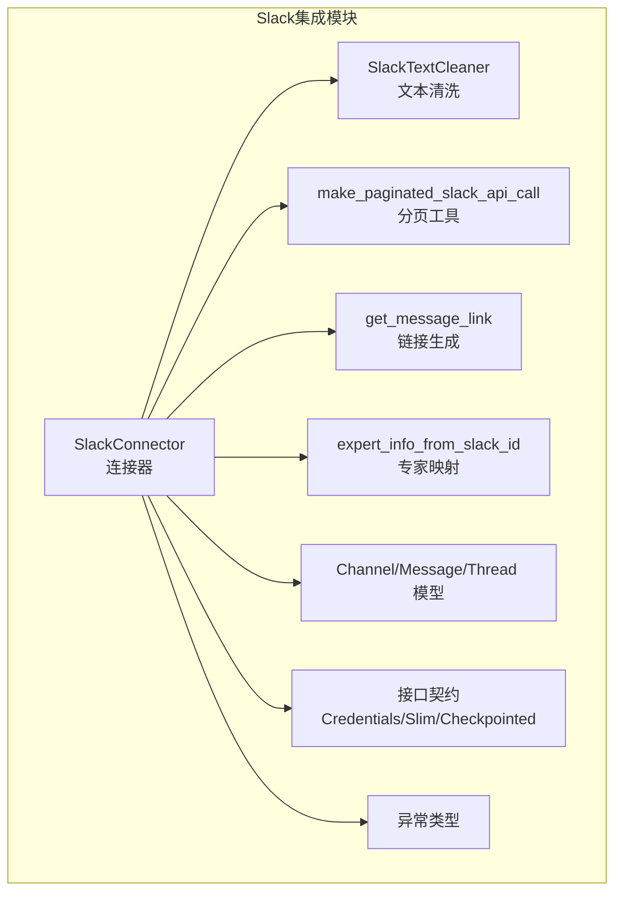
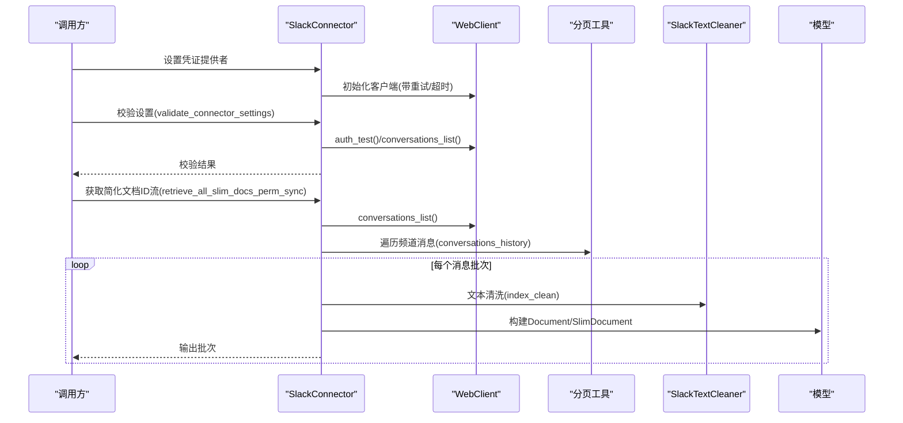
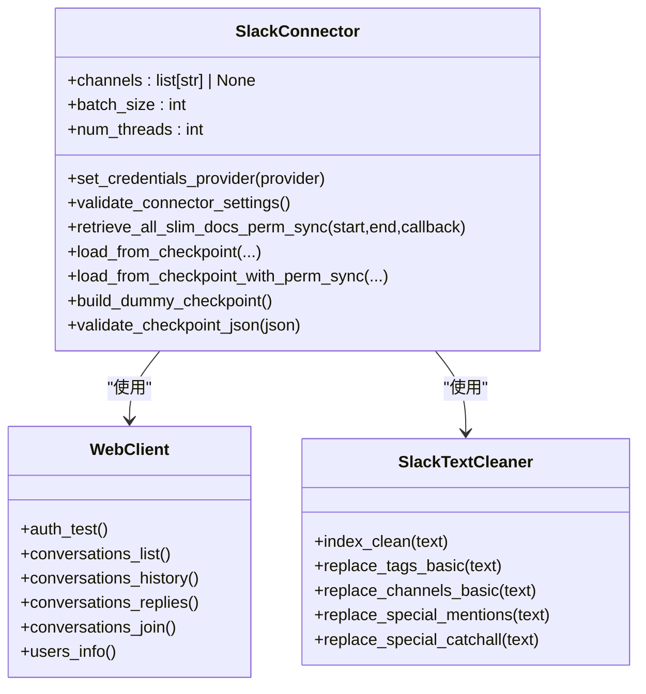
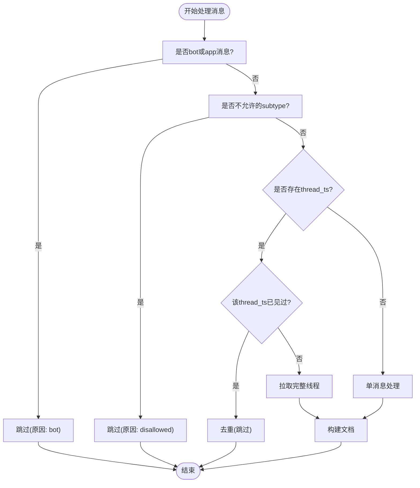
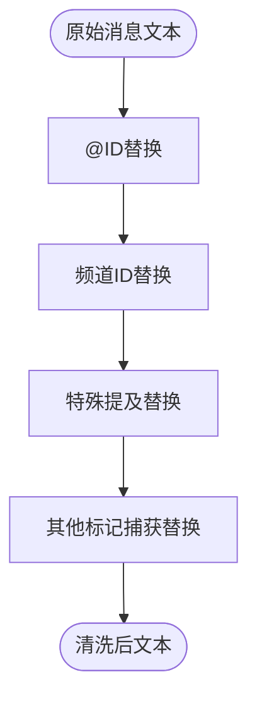
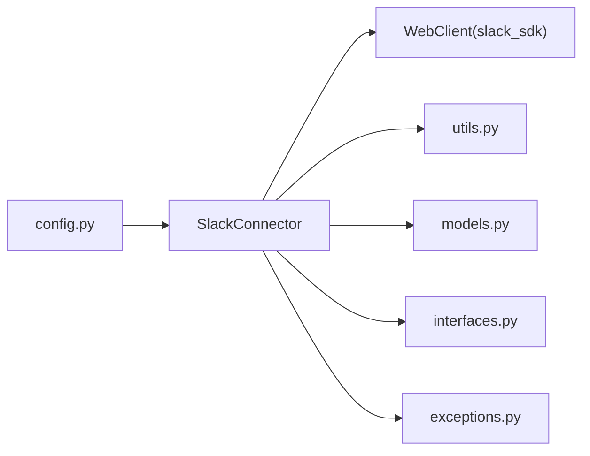

# Slack集成

<cite>
**本文引用的文件**
- [slack_connector.py](file://common/data_source/slack_connector.py)
- [config.py](file://common/data_source/config.py)
- [models.py](file://common/data_source/models.py)
- [utils.py](file://common/data_source/utils.py)
- [interfaces.py](file://common/data_source/interfaces.py)
- [exceptions.py](file://common/data_source/exceptions.py)
</cite>

## 目录
1. [简介](#简介)
2. [项目结构](#项目结构)
3. [核心组件](#核心组件)
4. [架构总览](#架构总览)
5. [详细组件分析](#详细组件分析)
6. [依赖分析](#依赖分析)
7. [性能考虑](#性能考虑)
8. [故障排查指南](#故障排查指南)
9. [结论](#结论)
10. [附录](#附录)

## 简介
本技术文档面向Slack数据源集成，系统性阐述Slack连接器的架构设计与实现要点，覆盖以下主题：
- OAuth认证流程与令牌管理（基于环境变量配置）
- Webhook配置与事件订阅（概念性说明）
- 消息历史获取与分页处理
- 频道管理机制：公共频道、私有频道、直接消息（IM）的处理策略
- 消息内容提取算法：文本解析、用户ID/频道替换、富文本格式转换
- 权限模型：外部访问控制、专家信息映射与权限同步接口
- 配置指南：Slack应用设置、事件订阅、大规模消息数据处理
- 实时同步策略、消息去重机制、性能优化与安全最佳实践

## 项目结构
Slack集成位于通用数据源模块中，采用“连接器+工具+模型+接口+异常”的分层组织方式：
- 连接器：负责与Slack API交互、频道枚举、消息拉取、文档构建
- 工具：封装Slack SDK调用、分页、文本清洗、链接生成、专家信息查询
- 模型：定义Slack消息、频道、线程、文档、检查点等数据结构
- 接口：统一连接器能力契约（凭证、权限同步、断点续传）
- 异常：标准化错误类型，便于上层处理

图表来源
- [slack_connector.py:461-665](file://common/data_source/slack_connector.py#L461-L665)
- [utils.py:578-717](file://common/data_source/utils.py#L578-L717)
- [models.py:218-320](file://common/data_source/models.py#L218-L320)
- [interfaces.py:48-103](file://common/data_source/interfaces.py#L48-L103)
- [exceptions.py:1-30](file://common/data_source/exceptions.py#L1-L30)

章节来源
- [slack_connector.py:1-665](file://common/data_source/slack_connector.py#L1-L665)
- [config.py:1-307](file://common/data_source/config.py#L1-L307)
- [models.py:1-320](file://common/data_source/models.py#L1-L320)
- [utils.py:1-800](file://common/data_source/utils.py#L1-L800)
- [interfaces.py:1-420](file://common/data_source/interfaces.py#L1-L420)
- [exceptions.py:1-30](file://common/data_source/exceptions.py#L1-L30)

## 核心组件
- SlackConnector：实现凭证加载、设置校验、频道枚举、消息分页拉取、线程聚合、文档构建与输出
- SlackTextCleaner：将Slack标记语法（用户ID、频道ID、特殊提及）转换为可索引文本
- 分页工具：自动处理Slack API游标分页，限制每页条数
- 链接生成：根据消息TS与线程TS生成可点击的Slack消息链接
- 专家映射：通过users.info按需查询用户显示名、邮箱等信息，支持权限同步
- 数据模型：ChannelType、MessageType、ThreadType、Document、SlimDocument、ExternalAccess等
- 接口契约：CredentialsConnector、SlimConnectorWithPermSync、CheckpointedConnectorWithPermSync
- 异常体系：凭证缺失、验证失败、过期、权限不足、意外错误、限流重试过多

章节来源
- [slack_connector.py:461-665](file://common/data_source/slack_connector.py#L461-L665)
- [utils.py:555-717](file://common/data_source/utils.py#L555-L717)
- [models.py:210-320](file://common/data_source/models.py#L210-L320)
- [interfaces.py:48-103](file://common/data_source/interfaces.py#L48-L103)
- [exceptions.py:1-30](file://common/data_source/exceptions.py#L1-L30)

## 架构总览
下图展示Slack连接器从初始化到消息拉取、清洗与文档产出的整体流程。

图表来源
- [slack_connector.py:501-665](file://common/data_source/slack_connector.py#L501-L665)
- [utils.py:578-717](file://common/data_source/utils.py#L578-L717)
- [models.py:89-130](file://common/data_source/models.py#L89-L130)

## 详细组件分析

### 组件A：SlackConnector（连接器）
职责与关键行为：
- 凭证加载：通过CredentialsProvider注入Slack Bot Token，初始化标准与快速客户端
- 设置校验：auth_test与conversations_list验证工作区连通性与权限范围
- 频道枚举：支持公共/私有频道组合拉取，并在权限不足时回退策略
- 消息拉取：对每个频道执行分页历史读取，必要时先加入频道
- 线程处理：对存在thread_ts的消息，拉取完整线程并过滤子类型
- 文档构建：将线程消息清洗后转为Document，记录首次发送者、时间戳、外部访问等
- 简化文档输出：仅输出ID与权限信息，用于权限同步场景

图表来源
- [slack_connector.py:461-665](file://common/data_source/slack_connector.py#L461-L665)
- [utils.py:638-717](file://common/data_source/utils.py#L638-L717)

章节来源
- [slack_connector.py:461-665](file://common/data_source/slack_connector.py#L461-L665)

### 组件B：消息过滤与去重
默认过滤规则：
- 跳过机器人消息（bot_id/app_id），保留特定测试机器人
- 过滤非信息类子类型（如频道加入/离开、归档、置顶等）

去重策略：
- 线程级别：以thread_ts为键，避免重复处理同一线程
- 文档ID：由channel_id与thread_ts拼接，确保唯一性

图表来源
- [slack_connector.py:49-71](file://common/data_source/slack_connector.py#L49-L71)
- [slack_connector.py:316-417](file://common/data_source/slack_connector.py#L316-L417)
- [slack_connector.py:169-171](file://common/data_source/slack_connector.py#L169-L171)

章节来源
- [slack_connector.py:49-71](file://common/data_source/slack_connector.py#L49-L71)
- [slack_connector.py:316-417](file://common/data_source/slack_connector.py#L316-L417)

### 组件C：文本清洗与富文本转换
SlackTextCleaner提供多步替换：
- 用户ID替换：将<@user_id>替换为@用户名（缓存用户名映射）
- 频道ID替换：将<#channel_id|name>替换为#name
- 特殊提及：<!channel>、<!here>、<!everyone>替换为@语义形式
- 其他标记：通用<！label|text>捕获替换
- 可选零宽空格插入：增强检索体验

图表来源
- [utils.py:638-717](file://common/data_source/utils.py#L638-L717)

章节来源
- [utils.py:638-717](file://common/data_source/utils.py#L638-L717)

### 组件D：分页与批量处理
- 自动分页：基于response_metadata.next_cursor循环拉取
- 批量大小：受全局常量与环境变量控制
- 快速客户端：短超时用于健康检查与轻量操作

章节来源
- [utils.py:578-598](file://common/data_source/utils.py#L578-L598)
- [config.py:107-118](file://common/data_source/config.py#L107-L118)

### 组件E：权限模型与外部访问
- 外部访问模型：ExternalAccess定义外部邮箱集合、组ID集合与公开标志
- 专家信息：BasicExpertInfo承载显示名、姓名、邮箱，用于文档归属与检索
- 权限同步接口：SlimConnectorWithPermSync与CheckpointedConnectorWithPermSync提供权限同步能力契约
- 当前实现：简化版本未启用Redis锁与完整权限同步逻辑，但接口已预留

章节来源
- [models.py:10-67](file://common/data_source/models.py#L10-L67)
- [models.py:104-123](file://common/data_source/models.py#L104-L123)
- [interfaces.py:57-103](file://common/data_source/interfaces.py#L57-L103)
- [slack_connector.py:474-486](file://common/data_source/slack_connector.py#L474-L486)

### 组件F：配置与常量
- Slack相关常量：批量大小、线程数、快速超时、最大重试次数、每页上限
- OAuth相关：Slack OAuth客户端ID/密钥（用于Web回调场景）
- 环境变量：请求超时、批量大小、线程数等

章节来源
- [config.py:107-118](file://common/data_source/config.py#L107-L118)
- [config.py:219-220](file://common/data_source/config.py#L219-L220)

## 依赖分析
- 外部SDK：slack_sdk.WebClient
- 内部模块：utils（分页、链接、清洗、专家映射）、models（数据结构）、interfaces（接口）、exceptions（异常）
- 环境变量：Slack Bot Token、OAuth客户端凭据、请求超时等

图表来源
- [slack_connector.py:11-47](file://common/data_source/slack_connector.py#L11-L47)
- [config.py:1-307](file://common/data_source/config.py#L1-L307)

章节来源
- [slack_connector.py:11-47](file://common/data_source/slack_connector.py#L11-L47)
- [config.py:1-307](file://common/data_source/config.py#L1-L307)

## 性能考虑
- 并发与批处理：通过num_threads与batch_size控制并发度与输出批次大小
- 分页与限流：固定每页上限，结合重试与指数退避应对限流
- 快速路径：fast_client用于健康检查与轻量操作，降低阻塞风险
- 缓存：SlackTextCleaner与专家映射使用LRU缓存减少重复API调用
- 去重：线程级去重避免重复处理，提升吞吐

章节来源
- [config.py:107-118](file://common/data_source/config.py#L107-L118)
- [utils.py:555-560](file://common/data_source/utils.py#L555-L560)
- [utils.py:638-636](file://common/data_source/utils.py#L638-L636)

## 故障排查指南
常见问题与定位：
- 凭证缺失：初始化时未设置凭证提供者，触发ConnectorMissingCredentialError
- 认证失败：auth_test返回错误或invalid_auth/not_authed，触发ConnectorValidationError/CredentialExpiredError
- 权限不足：missing_scope，提示缺少channels:read等scope
- 限流：ratelimited，记录建议的Retry-After并进行重试
- 频道不可读：is_archived导致跳过；私有频道需要先加入
- 异常链路：消息处理异常被捕获并包装为ConnectorFailure，包含文档ID与链接

章节来源
- [slack_connector.py:575-637](file://common/data_source/slack_connector.py#L575-L637)
- [exceptions.py:1-30](file://common/data_source/exceptions.py#L1-L30)

## 结论
本Slack连接器以简洁清晰的分层设计实现了从频道枚举、消息分页、线程聚合到文档构建的全链路能力。通过默认过滤与去重策略保障数据质量，借助文本清洗与专家映射提升检索效果。接口层已预留权限同步与断点续传能力，便于后续扩展至更复杂的权限模型与增量同步场景。

## 附录

### OAuth认证流程（基于环境变量）
- 在Slack应用后台配置OAuth Scopes（如channels:read、groups:read、users:read等）
- 设置OAuth回调地址（与OAUTH_SLACK_CLIENT_ID/SECRET配合）
- 将Bot Token作为环境变量注入凭证提供者，连接器通过WebClient完成认证测试

章节来源
- [config.py:219-220](file://common/data_source/config.py#L219-L220)
- [slack_connector.py:501-527](file://common/data_source/slack_connector.py#L501-L527)

### Webhook配置与事件订阅（概念性说明）
- 在Slack应用后台启用事件订阅，配置事件类型（如message.channels、message.groups、member_joined_channel等）
- 设置事件回调URL与验证令牌
- 本仓库当前未实现Webhook接收端逻辑，建议在上层服务中接入并结合连接器的增量拉取策略

[本节为概念性说明，不直接分析具体文件]

### 消息历史获取与实时同步策略
- 历史拉取：基于conversations_history与分页工具，支持时间窗口参数
- 实时同步：当前简化版本未实现事件驱动的实时同步；可结合外部调度器定期触发增量拉取

章节来源
- [utils.py:578-598](file://common/data_source/utils.py#L578-L598)
- [slack_connector.py:125-153](file://common/data_source/slack_connector.py#L125-L153)

### 频道管理机制
- 公共频道：默认启用，权限要求较低
- 私有频道：需要具备相应scope；若权限不足则回退为仅拉取公共频道
- 直接消息（IM）：属于频道类型之一，可通过is_im识别并按需处理

章节来源
- [slack_connector.py:90-122](file://common/data_source/slack_connector.py#L90-L122)
- [models.py:218-244](file://common/data_source/models.py#L218-L244)

### 安全配置最佳实践
- 最小权限原则：仅授予channels:read、groups:read、users:read等必要scope
- 使用Bot Token而非用户令牌，限制作用域
- 合理设置超时与重试，避免长时间阻塞
- 对外暴露的回调需进行签名验证与方法白名单校验（概念性说明）

章节来源
- [slack_connector.py:595-620](file://common/data_source/slack_connector.py#L595-L620)
- [config.py:107-118](file://common/data_source/config.py#L107-L118)