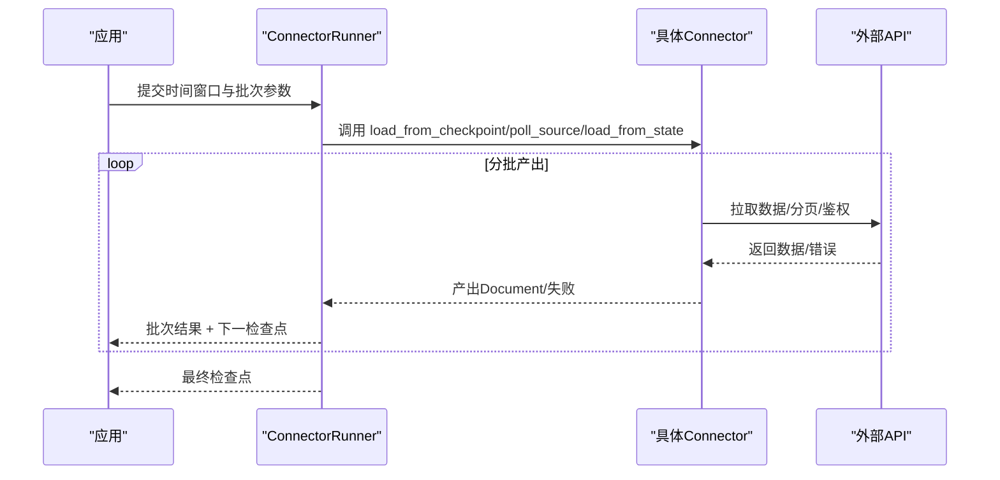
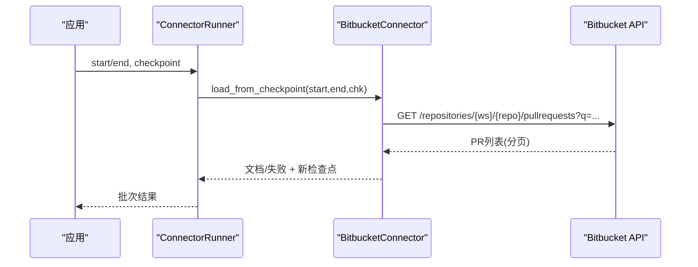
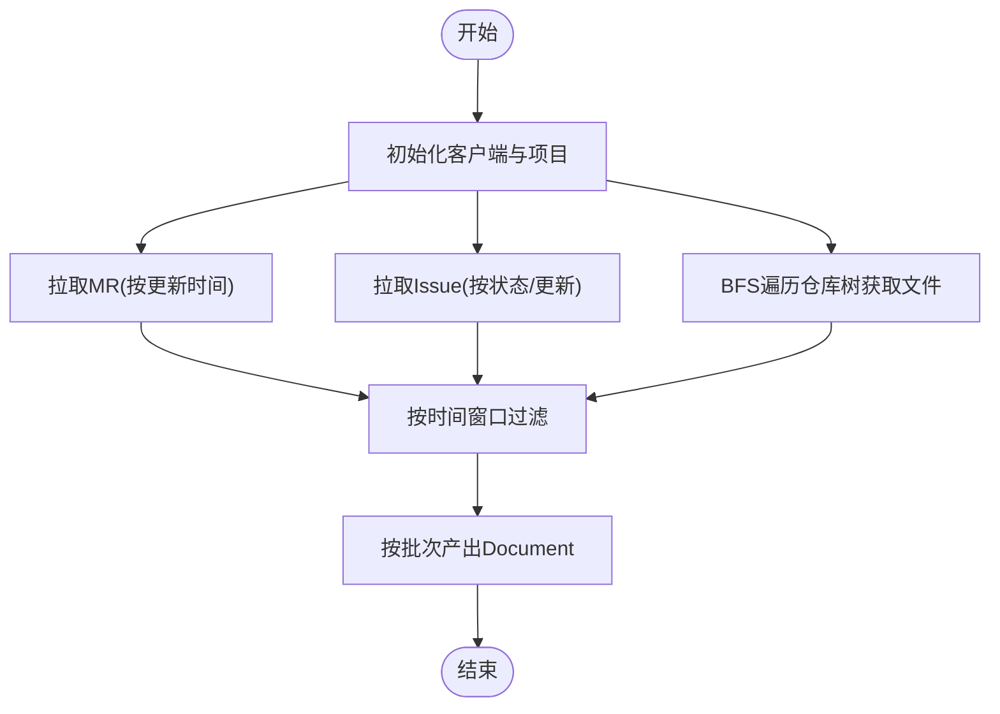
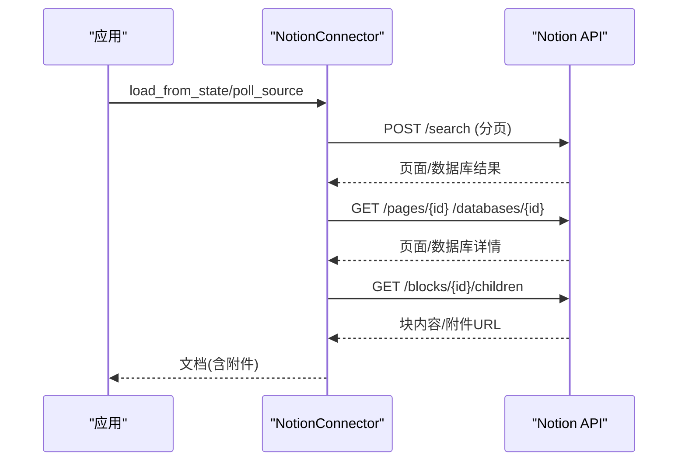
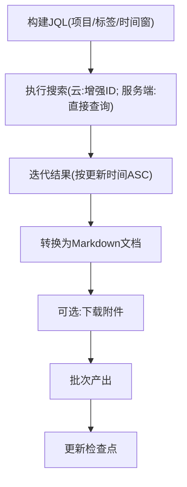
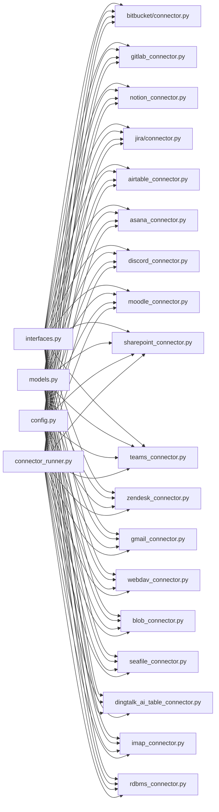

# 其他数据源

<cite>
**本文引用的文件**
- [common/data_source/__init__.py](file://common/data_source/__init__.py)
- [common/data_source/interfaces.py](file://common/data_source/interfaces.py)
- [common/data_source/models.py](file://common/data_source/models.py)
- [common/data_source/config.py](file://common/data_source/config.py)
- [common/data_source/connector_runner.py](file://common/data_source/connector_runner.py)
- [common/data_source/bitbucket/connector.py](file://common/data_source/bitbucket/connector.py)
- [common/data_source/bitbucket/utils.py](file://common/data_source/bitbucket/utils.py)
- [common/data_source/gitlab_connector.py](file://common/data_source/gitlab_connector.py)
- [common/data_source/notion_connector.py](file://common/data_source/notion_connector.py)
- [common/data_source/jira/connector.py](file://common/data_source/jira/connector.py)
- [common/data_source/jira/utils.py](file://common/data_source/jira/utils.py)
- [common/data_source/airtable_connector.py](file://common/data_source/airtable_connector.py)
- [common/data_source/asana_connector.py](file://common/data_source/asana_connector.py)
- [common/data_source/discord_connector.py](file://common/data_source/discord_connector.py)
- [common/data_source/moodle_connector.py](file://common/data_source/moodle_connector.py)
- [common/data_source/sharepoint_connector.py](file://common/data_source/sharepoint_connector.py)
- [common/data_source/teams_connector.py](file://common/data_source/teams_connector.py)
- [common/data_source/zendesk_connector.py](file://common/data_source/zendesk_connector.py)
- [common/data_source/gmail_connector.py](file://common/data_source/gmail_connector.py)
- [common/data_source/webdav_connector.py](file://common/data_source/webdav_connector.py)
- [common/data_source/blob_connector.py](file://common/data_source/blob_connector.py)
- [common/data_source/seafile_connector.py](file://common/data_source/seafile_connector.py)
- [common/data_source/dingtalk_ai_table_connector.py](file://common/data_source/dingtalk_ai_table_connector.py)
- [common/data_source/imap_connector.py](file://common/data_source/imap_connector.py)
- [common/data_source/rdbms_connector.py](file://common/data_source/rdbms_connector.py)
- [common/data_source/google_util/auth.py](file://common/data_source/google_util/auth.py)
- [common/data_source/google_util/oauth_flow.py](file://common/data_source/google_util/oauth_flow.py)
- [common/data_source/google_util/util.py](file://common/data_source/google_util/util.py)
- [common/data_source/google_util/resource.py](file://common/data_source/google_util/resource.py)
- [common/data_source/google_util/util_threadpool_concurrency.py](file://common/data_source/google_util/util_threadpool_concurrency.py)
- [common/data_source/google_util/constant.py](file://common/data_source/google_util/constant.py)
- [common/data_source/google_drive/connector.py](file://common/data_source/google_drive/connector.py)
- [common/data_source/google_drive/model.py](file://common/data_source/google_drive/model.py)
- [common/data_source/google_drive/doc_conversion.py](file://common/data_source/google_drive/doc_conversion.py)
- [common/data_source/google_drive/file_retrieval.py](file://common/data_source/google_drive/file_retrieval.py)
- [common/data_source/google_drive/constant.py](file://common/data_source/google_drive/constant.py)
- [common/data_source/google_drive/section_extraction.py](file://common/data_source/google_drive/section_extraction.py)
- [common/data_source/confluence_connector.py](file://common/data_source/confluence_connector.py)
- [common/data_source/slack_connector.py](file://common/data_source/slack_connector.py)
- [common/data_source/dropbox_connector.py](file://common/data_source/dropbox_connector.py)
- [common/data_source/box_connector.py](file://common/data_source/box_connector.py)
- [common/data_source/exceptions.py](file://common/data_source/exceptions.py)
- [common/data_source/utils.py](file://common/data_source/utils.py)
</cite>

## 目录
1. [简介](#简介)
2. [项目结构](#项目结构)
3. [核心组件](#核心组件)
4. [架构总览](#架构总览)
5. [详细组件分析](#详细组件分析)
6. [依赖分析](#依赖分析)
7. [性能考虑](#性能考虑)
8. [故障排查指南](#故障排查指南)
9. [结论](#结论)
10. [附录](#附录)

## 简介
本文件面向需要集成多种外部数据源（如 Bitbucket、GitLab、Notion、Jira、Airtable、Asana、Discord、Moodle、SharePoint、Teams、Zendesk、Gmail、WebDAV、Blob 存储、Seafile、钉钉 AI 表格、IMAP、关系型数据库等）的开发者，系统性梳理该仓库中“其他数据源”模块的设计与实现，覆盖认证机制、API 使用方式、数据同步策略、错误处理与性能优化等关键细节，并提供可复用的通用工具类与最佳实践，帮助快速构建统一的企业知识管理平台。

## 项目结构
数据源集成主要集中在 common/data_source 目录下，采用“按数据源分包 + 通用接口/模型/配置”的组织方式：
- 通用层：接口定义、数据模型、配置常量、运行器、异常与工具函数
- 各数据源：每个数据源一个独立模块或子包，遵循统一的 Connector 接口规范
- Google 生态：google_util 与 google_drive 单独子包，提供 OAuth、资源访问与文档转换能力

```mermaid
graph TB
subgraph "通用层"
IF["interfaces.py<br/>接口定义"]
MD["models.py<br/>数据模型"]
CFG["config.py<br/>配置常量"]
RUN["connector_runner.py<br/>运行器"]
EXC["exceptions.py<br/>异常类型"]
UTL["utils.py<br/>工具函数"]
end
subgraph "各数据源"
BB["bitbucket/connector.py"]
GL["gitlab_connector.py"]
NT["notion_connector.py"]
JR["jira/connector.py"]
AT["airtable_connector.py"]
AS["asana_connector.py"]
DC["discord_connector.py"]
MDL["moodle_connector.py"]
SP["sharepoint_connector.py"]
TM["teams_connector.py"]
ZD["zendesk_connector.py"]
GM["gmail_connector.py"]
WD["webdav_connector.py"]
BL["blob_connector.py"]
SF["seafile_connector.py"]
DT["dingtalk_ai_table_connector.py"]
IM["imap_connector.py"]
RDB["rdbms_connector.py"]
end
IF --> BB
IF --> GL
IF --> NT
IF --> JR
IF --> AT
IF --> AS
IF --> DC
IF --> MDL
IF --> SP
IF --> TM
IF --> ZD
IF --> GM
IF --> WD
IF --> BL
IF --> SF
IF --> DT
IF --> IM
IF --> RDB
MD --> BB
MD --> GL
MD --> NT
MD --> JR
MD --> AT
MD --> AS
MD --> DC
MD --> MDL
MD --> SP
MD --> TM
MD --> ZD
MD --> GM
MD --> WD
MD --> BL
MD --> SF
MD --> DT
MD --> IM
MD --> RDB
CFG --> BB
CFG --> GL
CFG --> NT
CFG --> JR
CFG --> AT
CFG --> AS
CFG --> DC
CFG --> MDL
CFG --> SP
CFG --> TM
CFG --> ZD
CFG --> GM
CFG --> WD
CFG --> BL
CFG --> SF
CFG --> DT
CFG --> IM
CFG --> RDB
RUN --> BB
RUN --> GL
RUN --> NT
RUN --> JR
RUN --> AT
RUN --> AS
RUN --> DC
RUN --> MDL
RUN --> SP
RUN --> TM
RUN --> ZD
RUN --> GM
RUN --> WD
RUN --> BL
RUN --> SF
RUN --> DT
RUN --> IM
RUN --> RDB
EXC --> BB
EXC --> GL
EXC --> NT
EXC --> JR
EXC --> AT
EXC --> AS
EXC --> DC
EXC --> MDL
EXC --> SP
EXC --> TM
EXC --> ZD
EXC --> GM
EXC --> WD
EXC --> BL
EXC --> SF
EXC --> DT
EXC --> IM
EXC --> RDB
UTL --> BB
UTL --> GL
UTL --> NT
UTL --> JR
UTL --> AT
UTL --> AS
UTL --> DC
UTL --> MDL
UTL --> SP
UTL --> TM
UTL --> ZD
UTL --> GM
UTL --> WD
UTL --> BL
UTL --> SF
UTL --> DT
UTL --> IM
UTL --> RDB
```

图表来源
- [common/data_source/__init__.py:26-88](file://common/data_source/__init__.py#L26-L88)
- [common/data_source/interfaces.py:21-103](file://common/data_source/interfaces.py#L21-L103)
- [common/data_source/models.py:89-155](file://common/data_source/models.py#L89-L155)
- [common/data_source/config.py:41-70](file://common/data_source/config.py#L41-L70)
- [common/data_source/connector_runner.py:91-195](file://common/data_source/connector_runner.py#L91-L195)

章节来源
- [common/data_source/__init__.py:26-88](file://common/data_source/__init__.py#L26-L88)
- [common/data_source/config.py:41-70](file://common/data_source/config.py#L41-L70)

## 核心组件
- 接口体系：抽象出 Load/Poll/Slim/Checkpointed 等多种 Connector 接口，统一不同数据源的接入方式
- 数据模型：Document、SlimDocument、ConnectorCheckpoint、失败信息等标准化结构
- 配置常量：统一的超时、批量大小、阈值、链接策略等配置项
- 运行器：ConnectorRunner 封装批次化、异常日志、时间窗口与权限同步逻辑
- 工具与异常：统一的错误分类、重试装饰器、速率限制请求封装、通用工具函数

章节来源
- [common/data_source/interfaces.py:21-103](file://common/data_source/interfaces.py#L21-L103)
- [common/data_source/models.py:89-155](file://common/data_source/models.py#L89-L155)
- [common/data_source/config.py:16-120](file://common/data_source/config.py#L16-L120)
- [common/data_source/connector_runner.py:91-195](file://common/data_source/connector_runner.py#L91-L195)
- [common/data_source/exceptions.py:1-120](file://common/data_source/exceptions.py#L1-L120)
- [common/data_source/utils.py:1-200](file://common/data_source/utils.py#L1-L200)

## 架构总览
下图展示了通用接口与具体数据源的交互关系，以及运行器对 Connector 的统一封装：

图表来源
- [common/data_source/connector_runner.py:119-195](file://common/data_source/connector_runner.py#L119-L195)
- [common/data_source/interfaces.py:21-103](file://common/data_source/interfaces.py#L21-L103)

## 详细组件分析

### Bitbucket 集成
- 认证机制：基于邮箱 + API Token 的基础认证
- API 使用：通过自定义分页器遍历 Pull Requests，支持时间窗口过滤
- 同步策略：CheckpointedConnector，支持断点续传；SlimConnector 支持仅 ID 清单用于权限同步
- 错误处理：缺失凭据、401/403/其他错误分别抛出对应异常
- 性能优化：批量大小、字段裁剪、时间窗口限定

图表来源
- [common/data_source/bitbucket/connector.py:183-256](file://common/data_source/bitbucket/connector.py#L183-L256)
- [common/data_source/connector_runner.py:119-195](file://common/data_source/connector_runner.py#L119-L195)

章节来源
- [common/data_source/bitbucket/connector.py:91-106](file://common/data_source/bitbucket/connector.py#L91-L106)
- [common/data_source/bitbucket/connector.py:183-256](file://common/data_source/bitbucket/connector.py#L183-L256)
- [common/data_source/bitbucket/connector.py:304-346](file://common/data_source/bitbucket/connector.py#L304-L346)

### GitLab 集成
- 认证机制：私有令牌 + REST API
- API 使用：项目维度拉取 MR、Issue、代码文件树，支持增量窗口过滤
- 同步策略：Load/Poll 双接口，支持 BFS 遍历目录树
- 错误处理：鉴权失败、权限不足、资源不存在、未知错误分类
- 性能优化：批量大小、排除规则、增量时间窗口

图表来源
- [common/data_source/gitlab_connector.py:218-314](file://common/data_source/gitlab_connector.py#L218-L314)

章节来源
- [common/data_source/gitlab_connector.py:181-216](file://common/data_source/gitlab_connector.py#L181-L216)
- [common/data_source/gitlab_connector.py:218-314](file://common/data_source/gitlab_connector.py#L218-L314)

### Notion 集成
- 认证机制：Integration Token + Notion API v2
- API 使用：搜索页面/数据库、递归读取块内容、下载附件、解析富文本/公式/表格
- 同步策略：Load/Poll 双接口，支持根页面递归索引
- 错误处理：401/403/404/429 等状态码映射到特定异常
- 性能优化：重试装饰器、批量生成、路径缓存、递归开关

图表来源
- [common/data_source/notion_connector.py:560-604](file://common/data_source/notion_connector.py#L560-L604)

章节来源
- [common/data_source/notion_connector.py:555-558](file://common/data_source/notion_connector.py#L555-L558)
- [common/data_source/notion_connector.py:560-604](file://common/data_source/notion_connector.py#L560-L604)
- [common/data_source/notion_connector.py:606-644](file://common/data_source/notion_connector.py#L606-L644)

### Jira 集成
- 认证机制：API Token/Bearer 或用户名+密码；支持云/服务端版本差异
- API 使用：JQL 查询、分页、增强 ID 搜索、评论/附件提取
- 同步策略：CheckpointedConnectorWithPermSync，支持带重试的时间缓冲与重复保护
- 错误处理：401/403/404/429 映射，日期边界问题自动回退重试
- 性能优化：分页大小、字段裁剪、时间缓冲、附件大小限制

图表来源
- [common/data_source/jira/connector.py:435-460](file://common/data_source/jira/connector.py#L435-L460)
- [common/data_source/jira/connector.py:297-364](file://common/data_source/jira/connector.py#L297-L364)

章节来源
- [common/data_source/jira/connector.py:140-185](file://common/data_source/jira/connector.py#L140-L185)
- [common/data_source/jira/connector.py:218-242](file://common/data_source/jira/connector.py#L218-L242)
- [common/data_source/jira/connector.py:297-364](file://common/data_source/jira/connector.py#L297-L364)
- [common/data_source/jira/connector.py:378-430](file://common/data_source/jira/connector.py#L378-L430)

### Airtable 集成
- 认证机制：Access Token
- API 使用：全量记录扫描，提取附件并作为原始二进制文档
- 同步策略：Load/Poll 双接口，按更新时间窗口过滤
- 错误处理：下载失败跳过，大小阈值控制
- 性能优化：批量大小、大小阈值、简单字段抽取

章节来源
- [common/data_source/airtable_connector.py:45-53](file://common/data_source/airtable_connector.py#L45-L53)
- [common/data_source/airtable_connector.py:58-132](file://common/data_source/airtable_connector.py#L58-L132)
- [common/data_source/airtable_connector.py:134-153](file://common/data_source/airtable_connector.py#L134-L153)

### Asana 集成
- 认证机制：API Token + Asana SDK
- API 使用：项目筛选、任务历史、评论、附件下载
- 同步策略：Poll/Lazy 加载，按修改时间窗口过滤
- 错误处理：API 异常计数、继续/中断策略
- 性能优化：批量大小、大小阈值、用户邮箱集合用于权限

章节来源
- [common/data_source/asana_connector.py:356-365](file://common/data_source/asana_connector.py#L356-L365)
- [common/data_source/asana_connector.py:367-391](file://common/data_source/asana_connector.py#L367-L391)
- [common/data_source/asana_connector.py:393-431](file://common/data_source/asana_connector.py#L393-L431)

### Discord 集成
- 认证机制：Bot Token + Discord.py
- API 使用：服务器/频道筛选、消息历史、线程历史、代理支持
- 同步策略：Poll/Lazy 加载，支持按时间窗口过滤
- 错误处理：权限不足、类型过滤
- 性能优化：异步事件循环、批量合并消息为单一文档

章节来源
- [common/data_source/discord_connector.py:299-301](file://common/data_source/discord_connector.py#L299-L301)
- [common/data_source/discord_connector.py:308-317](file://common/data_source/discord_connector.py#L308-L317)
- [common/data_source/discord_connector.py:168-228](file://common/data_source/discord_connector.py#L168-L228)

### Moodle 集成
- 认证机制：Token + 官方 SDK
- API 使用：课程列表、课程内容、资源/论坛/页面/作业/测验等模块处理
- 同步策略：Poll/Lazy 加载，按最后修改时间窗口过滤
- 错误处理：无效 token、权限不足、网络异常
- 性能优化：批量大小、Markdown 转换、元数据丰富

章节来源
- [common/data_source/moodle_connector.py:69-84](file://common/data_source/moodle_connector.py#L69-L84)
- [common/data_source/moodle_connector.py:110-138](file://common/data_source/moodle_connector.py#L110-L138)
- [common/data_source/moodle_connector.py:200-275](file://common/data_source/moodle_connector.py#L200-L275)

### SharePoint/Teams 集成
- 认证机制：MSAL 获取访问令牌，GraphClient/SharePoint ClientContext
- API 使用：站点/团队信息校验
- 同步策略：接口已声明，当前实现为占位
- 错误处理：401/403 映射到权限错误
- 性能优化：令牌复用、最小权限范围

章节来源
- [common/data_source/sharepoint_connector.py:29-61](file://common/data_source/sharepoint_connector.py#L29-L61)
- [common/data_source/sharepoint_connector.py:63-77](file://common/data_source/sharepoint_connector.py#L63-L77)
- [common/data_source/teams_connector.py:37-65](file://common/data_source/teams_connector.py#L37-L65)
- [common/data_source/teams_connector.py:67-81](file://common/data_source/teams_connector.py#L67-L81)

### Gmail/WebDAV/Blob/Seafile/IMAP/关系型数据库
- Gmail：基于 OAuth/令牌的邮件/线程/消息抓取（见 gmail_connector.py）
- WebDAV：通用 WebDAV 协议适配（见 webdav_connector.py）
- Blob：S3/R2/OCI/GCS/S3兼容等对象存储适配（见 blob_connector.py）
- Seafile：仓库/目录/文件同步（见 seafile_connector.py）
- IMAP：邮件协议适配（见 imap_connector.py）
- 关系型数据库：统一 SQL 抽象（见 rdbms_connector.py）

章节来源
- [common/data_source/gmail_connector.py:1-200](file://common/data_source/gmail_connector.py#L1-L200)
- [common/data_source/webdav_connector.py:1-200](file://common/data_source/webdav_connector.py#L1-L200)
- [common/data_source/blob_connector.py:1-200](file://common/data_source/blob_connector.py#L1-L200)
- [common/data_source/seafile_connector.py:1-200](file://common/data_source/seafile_connector.py#L1-L200)
- [common/data_source/imap_connector.py:1-200](file://common/data_source/imap_connector.py#L1-L200)
- [common/data_source/rdbms_connector.py:1-200](file://common/data_source/rdbms_connector.py#L1-L200)

### 钉钉 AI 表格
- 认证机制：企业内应用凭证
- API 使用：表格数据读取与文档化
- 同步策略：Poll/Lazy 加载
- 错误处理：凭据缺失、权限不足、网络异常

章节来源
- [common/data_source/dingtalk_ai_table_connector.py:1-200](file://common/data_source/dingtalk_ai_table_connector.py#L1-L200)

### Google 生态（OAuth/资源/文档转换）
- 认证：OAuth 流程、令牌刷新、作用域
- 资源：文件/驱动器/文档读取与转换
- 工具：并发工具、速率限制、链接策略

章节来源
- [common/data_source/google_util/auth.py:1-200](file://common/data_source/google_util/auth.py#L1-L200)
- [common/data_source/google_util/oauth_flow.py:1-200](file://common/data_source/google_util/oauth_flow.py#L1-L200)
- [common/data_source/google_util/util.py:1-200](file://common/data_source/google_util/util.py#L1-L200)
- [common/data_source/google_util/resource.py:1-200](file://common/data_source/google_util/resource.py#L1-L200)
- [common/data_source/google_util/util_threadpool_concurrency.py:1-200](file://common/data_source/google_util/util_threadpool_concurrency.py#L1-L200)
- [common/data_source/google_util/constant.py:1-200](file://common/data_source/google_util/constant.py#L1-L200)
- [common/data_source/google_drive/connector.py:1-200](file://common/data_source/google_drive/connector.py#L1-L200)
- [common/data_source/google_drive/model.py:1-200](file://common/data_source/google_drive/model.py#L1-L200)
- [common/data_source/google_drive/doc_conversion.py:1-200](file://common/data_source/google_drive/doc_conversion.py#L1-L200)
- [common/data_source/google_drive/file_retrieval.py:1-200](file://common/data_source/google_drive/file_retrieval.py#L1-L200)
- [common/data_source/google_drive/constant.py:1-200](file://common/data_source/google_drive/constant.py#L1-L200)
- [common/data_source/google_drive/section_extraction.py:1-200](file://common/data_source/google_drive/section_extraction.py#L1-L200)

## 依赖分析
- 组件耦合：各 Connector 仅依赖通用接口/模型/配置/工具，低耦合高内聚
- 外部依赖：各数据源自有 SDK/HTTP 库，统一通过异常体系与运行器解耦
- 循环依赖：未发现循环导入；接口/模型/配置/运行器形成稳定上层依赖

图表来源
- [common/data_source/__init__.py:26-88](file://common/data_source/__init__.py#L26-L88)
- [common/data_source/interfaces.py:21-103](file://common/data_source/interfaces.py#L21-L103)
- [common/data_source/models.py:89-155](file://common/data_source/models.py#L89-L155)
- [common/data_source/config.py:41-70](file://common/data_source/config.py#L41-L70)
- [common/data_source/connector_runner.py:91-195](file://common/data_source/connector_runner.py#L91-L195)

## 性能考虑
- 批量与分页：统一的 INDEX_BATCH_SIZE 控制批次大小，避免内存峰值
- 速率限制：统一的 REQUEST_TIMEOUT_SECONDS 与重试装饰器，降低外部限流影响
- 时间窗口：Jira/Notion/Moodle 等均支持 start/end 窗口，减少重复抓取
- 并发与异步：Discord 使用异步事件循环；Google 工具提供线程池并发工具
- 缓存与去重：Notion 路径缓存、Jira 重复保护（时间缓冲）
- 大小阈值：Airtable/Asana/Moodle 等对附件/文件大小设置阈值，避免超大对象阻塞

章节来源
- [common/data_source/config.py:16-120](file://common/data_source/config.py#L16-L120)
- [common/data_source/notion_connector.py:477-537](file://common/data_source/notion_connector.py#L477-L537)
- [common/data_source/jira/connector.py:257-278](file://common/data_source/jira/connector.py#L257-L278)
- [common/data_source/discord_connector.py:168-228](file://common/data_source/discord_connector.py#L168-L228)
- [common/data_source/google_util/util_threadpool_concurrency.py:1-200](file://common/data_source/google_util/util_threadpool_concurrency.py#L1-L200)

## 故障排查指南
- 凭据缺失：ConnectorMissingCredentialError，检查凭据加载流程
- 凭据过期/无效：CredentialExpiredError，重新授权或刷新令牌
- 权限不足：InsufficientPermissionsError，确认授权范围与资源可见性
- 参数校验失败：ConnectorValidationError，核对必填参数与格式
- 未知异常：UnexpectedValidationError，结合运行器附加的本地变量日志定位

章节来源
- [common/data_source/exceptions.py:1-120](file://common/data_source/exceptions.py#L1-L120)
- [common/data_source/connector_runner.py:196-217](file://common/data_source/connector_runner.py#L196-L217)
- [common/data_source/notion_connector.py:606-644](file://common/data_source/notion_connector.py#L606-L644)
- [common/data_source/jira/connector.py:280-295](file://common/data_source/jira/connector.py#L280-L295)

## 结论
该数据源集成体系以统一接口为核心，辅以标准化模型、配置与运行器，实现了对多种外部系统的可插拔接入。通过明确的认证机制、API 使用模式、同步策略与错误处理，开发者可以快速扩展新的数据源并将其纳入统一的知识管理平台。建议在生产环境中结合配置阈值、重试与限速策略，确保稳定性与性能平衡。

## 附录
- 通用工具类
  - 速率限制包装器：统一的 rl_requests 与重试装饰器
  - 批量生成器：batch_generator、CheckpointOutputWrapper
  - 链接策略：HTML 基础连接转换策略
- 配置要点
  - REQUEST_TIMEOUT_SECONDS、INDEX_BATCH_SIZE、大小阈值、链接策略等环境变量
- 最佳实践
  - 优先使用 Checkpointed 接口实现断点续传
  - 在 Poll 模式下严格限定时间窗口
  - 对大文件/附件设置合理阈值
  - 使用运行器捕获异常并输出上下文日志

章节来源
- [common/data_source/utils.py:1-200](file://common/data_source/utils.py#L1-L200)
- [common/data_source/config.py:120-307](file://common/data_source/config.py#L120-L307)
- [common/data_source/connector_runner.py:46-88](file://common/data_source/connector_runner.py#L46-L88)