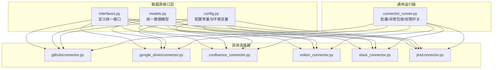
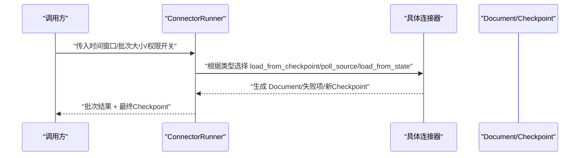
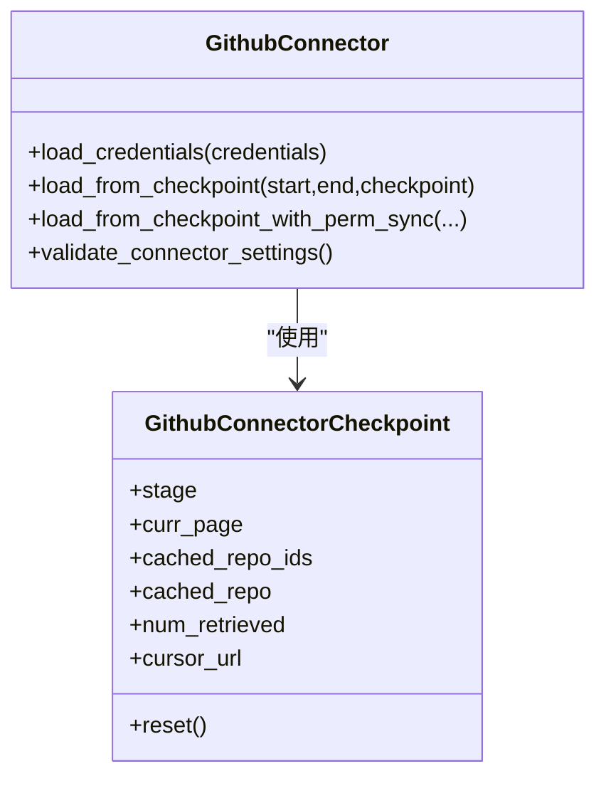
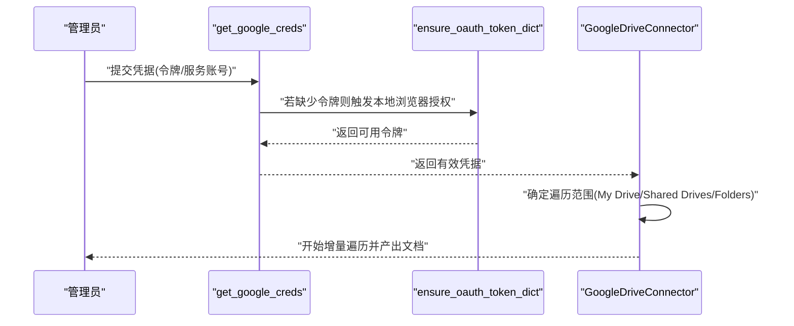
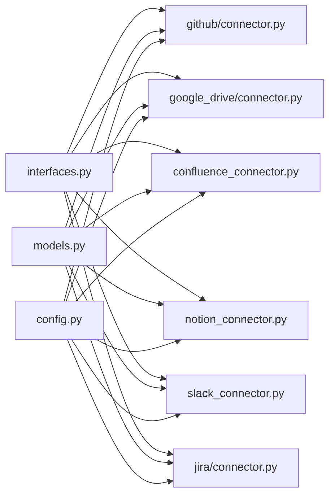

# 数据源集成

<cite>
**本文引用的文件**
- [common/data_source/__init__.py](file://common/data_source/__init__.py)
- [common/data_source/interfaces.py](file://common/data_source/interfaces.py)
- [common/data_source/models.py](file://common/data_source/models.py)
- [common/data_source/config.py](file://common/data_source/config.py)
- [common/data_source/connector_runner.py](file://common/data_source/connector_runner.py)
- [common/data_source/github/connector.py](file://common/data_source/github/connector.py)
- [common/data_source/github/models.py](file://common/data_source/github/models.py)
- [common/data_source/google_drive/connector.py](file://common/data_source/google_drive/connector.py)
- [common/data_source/google_util/auth.py](file://common/data_source/google_util/auth.py)
- [common/data_source/google_util/oauth_flow.py](file://common/data_source/google_util/oauth_flow.py)
- [common/data_source/confluence_connector.py](file://common/data_source/confluence_connector.py)
- [common/data_source/notion_connector.py](file://common/data_source/notion_connector.py)
- [common/data_source/slack_connector.py](file://common/data_source/slack_connector.py)
- [common/data_source/jira/connector.py](file://common/data_source/jira/connector.py)
</cite>

## 目录
1. [简介](#简介)
2. [项目结构](#项目结构)
3. [核心组件](#核心组件)
4. [架构总览](#架构总览)
5. [详细组件分析](#详细组件分析)
6. [依赖分析](#依赖分析)
7. [性能考虑](#性能考虑)
8. [故障排除指南](#故障排除指南)
9. [结论](#结论)
10. [附录](#附录)

## 简介
本技术文档面向RAGFlow数据源集成系统，系统性介绍其对多种外部数据源的支持与同步机制。重点覆盖以下方面：
- GitHub：仓库同步、文件变更监控、权限访问控制
- Google Drive：OAuth认证流程、文件树遍历、实时同步更新
- 其他重要数据源：Confluence页面内容提取、Slack消息同步、Notion页面管理、Jira问题跟踪
- 配置示例与使用指南
- 安全配置建议、性能优化策略、故障排除方法

## 项目结构
数据源集成采用“接口抽象 + 多种具体连接器”的模块化设计，所有连接器遵循统一的接口规范，并通过通用运行器进行批量处理与错误日志增强。

图示来源
- [common/data_source/interfaces.py:1-420](file://common/data_source/interfaces.py#L1-L420)
- [common/data_source/models.py:1-320](file://common/data_source/models.py#L1-L320)
- [common/data_source/config.py:1-307](file://common/data_source/config.py#L1-L307)
- [common/data_source/connector_runner.py:1-217](file://common/data_source/connector_runner.py#L1-L217)
- [common/data_source/github/connector.py:1-973](file://common/data_source/github/connector.py#L1-L973)
- [common/data_source/google_drive/connector.py:1-1258](file://common/data_source/google_drive/connector.py#L1-L1258)
- [common/data_source/confluence_connector.py:1-2107](file://common/data_source/confluence_connector.py#L1-L2107)
- [common/data_source/notion_connector.py:1-656](file://common/data_source/notion_connector.py#L1-L656)
- [common/data_source/slack_connector.py:1-665](file://common/data_source/slack_connector.py#L1-L665)
- [common/data_source/jira/connector.py:1-1004](file://common/data_source/jira/connector.py#L1-L1004)

章节来源
- [common/data_source/__init__.py:1-89](file://common/data_source/__init__.py#L1-L89)
- [common/data_source/interfaces.py:1-420](file://common/data_source/interfaces.py#L1-L420)
- [common/data_source/models.py:1-320](file://common/data_source/models.py#L1-L320)
- [common/data_source/config.py:1-307](file://common/data_source/config.py#L1-L307)
- [common/data_source/connector_runner.py:1-217](file://common/data_source/connector_runner.py#L1-L217)

## 核心组件
- 接口体系：定义加载、轮询、凭证、带权限同步等统一接口，确保不同数据源以一致方式接入。
- 运行器：封装批次聚合、异常日志记录、权限同步开关、时间窗口过滤等通用逻辑。
- 数据模型：统一文档、外部访问权限、失败信息等模型，便于跨连接器处理。
- 配置中心：集中管理各连接器的超时、批量大小、阈值、OAuth客户端参数等。

章节来源
- [common/data_source/interfaces.py:21-420](file://common/data_source/interfaces.py#L21-L420)
- [common/data_source/connector_runner.py:91-217](file://common/data_source/connector_runner.py#L91-L217)
- [common/data_source/models.py:89-156](file://common/data_source/models.py#L89-L156)
- [common/data_source/config.py:16-307](file://common/data_source/config.py#L16-L307)

## 架构总览
下图展示了从调用侧到具体连接器的执行路径，以及通用运行器如何统一对接不同连接器类型。

图示来源
- [common/data_source/connector_runner.py:91-196](file://common/data_source/connector_runner.py#L91-L196)
- [common/data_source/interfaces.py:21-103](file://common/data_source/interfaces.py#L21-L103)

## 详细组件分析

### GitHub 集成（仓库同步、变更监控、权限）
- 连接器职责
  - 支持单仓/多仓/全组织仓库扫描
  - 按更新时间倒序拉取PR与Issue，支持游标回退与分页重试
  - 权限同步：基于仓库级ExternalAccess，支持带权限模式的增量拉取
- 关键机制
  - 分阶段状态机：START → PRs → ISSUES → 下一仓库
  - 增量时间窗口：支持start/end过滤，避免重复索引
  - 速率限制：自动休眠与重试，必要时切换游标分页
  - 文档转换：PR转Markdown，Issue正文转Markdown，附加元数据
- 配置要点
  - 凭证：个人访问令牌
  - 可选：自定义基础URL（企业版）
- 使用建议
  - 对大仓库启用游标回退策略
  - 合理设置批次大小与时间缓冲，避免漏掉近实时更新

图示来源
- [common/data_source/github/connector.py:413-791](file://common/data_source/github/connector.py#L413-L791)
- [common/data_source/github/models.py:8-17](file://common/data_source/github/models.py#L8-L17)

章节来源
- [common/data_source/github/connector.py:1-973](file://common/data_source/github/connector.py#L1-L973)
- [common/data_source/github/models.py:1-17](file://common/data_source/github/models.py#L1-L17)

### Google Drive 集成（OAuth认证、文件树遍历、实时同步）
- 认证与凭据
  - 支持OAuth用户令牌与服务账号两种模式
  - 自动刷新与缺失作用域检测
- 文件遍历策略
  - My Drive：按用户遍历，支持共享与我的文件
  - 共享盘：并发遍历多个共享盘，支持断点续传
  - 指定目录：递归爬取指定文件夹，去重已遍历父节点
- 实时同步
  - 基于modifiedTime增量拉取，支持start/end时间窗口
  - 并发线程池控制，支持多用户模拟
- 配置要点
  - OAuth客户端ID/Secret、回调地址
  - 并发工作线程数、文件大小阈值
  - 特定范围：共享盘/我的驱动器/指定目录

图示来源
- [common/data_source/google_util/auth.py:37-127](file://common/data_source/google_util/auth.py#L37-L127)
- [common/data_source/google_util/oauth_flow.py:107-122](file://common/data_source/google_util/oauth_flow.py#L107-L122)
- [common/data_source/google_drive/connector.py:112-767](file://common/data_source/google_drive/connector.py#L112-L767)

章节来源
- [common/data_source/google_util/auth.py:1-158](file://common/data_source/google_util/auth.py#L1-L158)
- [common/data_source/google_util/oauth_flow.py:1-122](file://common/data_source/google_util/oauth_flow.py#L1-L122)
- [common/data_source/google_drive/connector.py:1-1258](file://common/data_source/google_drive/connector.py#L1-L1258)

### Confluence 集成（页面内容提取、权限与扩展字段）
- 连接器能力
  - CQL查询与分页，支持问题扩展字段替换与逐条恢复
  - 用户与组权限查询，支持云/服务器端差异
  - 附件大小与字符数阈值控制，避免超大文件阻塞
- 关键特性
  - 动态凭据刷新（Redis缓存），支持OAuth与个人令牌
  - 时间窗口与标签过滤，支持跳过归档页面
- 配置要点
  - 云/服务器端凭据与客户端ID/Secret
  - 扩展字段兼容性、时区偏移、同步缓冲

章节来源
- [common/data_source/confluence_connector.py:1-2107](file://common/data_source/confluence_connector.py#L1-L2107)
- [common/data_source/config.py:148-235](file://common/data_source/config.py#L148-L235)

### Notion 集成（页面与数据库内容提取）
- 能力概述
  - 页面与数据库内容提取，支持递归子页面与数据库内页
  - 表格转HTML、富文本解析、附件下载
  - 支持根页面起始的递归加载与时间窗口轮询
- 配置要点
  - 集成令牌版本、递归索引开关、批量大小

章节来源
- [common/data_source/notion_connector.py:1-656](file://common/data_source/notion_connector.py#L1-L656)
- [common/data_source/config.py:123-135](file://common/data_source/config.py#L123-L135)

### Slack 集成（消息同步、权限与过滤）
- 能力概述
  - 频道列表与历史消息获取，支持正则/白名单过滤
  - 线程消息合并为文档，支持专家信息抽取
  - 消息子类型过滤、机器人消息过滤
- 配置要点
  - Bot Token、线程/频道过滤、批量大小与并发线程数

章节来源
- [common/data_source/slack_connector.py:1-665](file://common/data_source/slack_connector.py#L1-L665)
- [common/data_source/config.py:219-236](file://common/data_source/config.py#L219-L236)

### Jira 集成（问题跟踪与附件）
- 能力概述
  - JQL查询、分页与ID增强搜索（云）/服务端搜索（服务器）
  - 问题正文、评论、附件格式化为文档
  - 标签过滤、时间缓冲、大小限制
- 配置要点
  - 用户名/密码或API Token、项目/查询语句、时区偏移、附件大小限制

章节来源
- [common/data_source/jira/connector.py:1-1004](file://common/data_source/jira/connector.py#L1-L1004)
- [common/data_source/config.py:204-218](file://common/data_source/config.py#L204-L218)

## 依赖分析
- 组件耦合
  - 连接器均依赖统一接口与模型，降低耦合度
  - 运行器对连接器类型进行适配，统一异常与日志
- 外部依赖
  - GitHub：PyGithub
  - Google Drive：google-api-python-client、OAuth2/Service Account
  - Confluence：atlassian-python-api
  - Notion：requests + 自定义rl_requests
  - Slack：slack-sdk
  - Jira：jira库
- 配置与环境变量
  - OAuth客户端、回调地址、批量大小、超时、阈值、时区偏移等集中管理

图示来源
- [common/data_source/interfaces.py:1-420](file://common/data_source/interfaces.py#L1-L420)
- [common/data_source/models.py:1-320](file://common/data_source/models.py#L1-L320)
- [common/data_source/config.py:1-307](file://common/data_source/config.py#L1-L307)
- [common/data_source/github/connector.py:1-973](file://common/data_source/github/connector.py#L1-L973)
- [common/data_source/google_drive/connector.py:1-1258](file://common/data_source/google_drive/connector.py#L1-L1258)
- [common/data_source/confluence_connector.py:1-2107](file://common/data_source/confluence_connector.py#L1-L2107)
- [common/data_source/notion_connector.py:1-656](file://common/data_source/notion_connector.py#L1-L656)
- [common/data_source/slack_connector.py:1-665](file://common/data_source/slack_connector.py#L1-L665)
- [common/data_source/jira/connector.py:1-1004](file://common/data_source/jira/connector.py#L1-L1004)

## 性能考虑
- 批量与并发
  - INDEX_BATCH_SIZE、SLACK_NUM_THREADS、MAX_DRIVE_WORKERS等参数可调
  - Google Drive：多用户模拟与共享盘并发，注意API配额
- 速率限制与重试
  - GitHub：自动休眠与游标回退；Jira/Confluence：内置重试与错误恢复
- 增量与去重
  - 基于modifiedTime/updated时间窗口与已遍历集合去重
- I/O与存储
  - 设置大小阈值，避免超大文件占用资源
  - 合理的日志级别与异常上下文输出，便于定位瓶颈

## 故障排除指南
- GitHub
  - 速率限制：自动休眠与重试；游标回退；检查TOKEN权限
  - 权限不足：确认仓库可见性与分支保护策略
- Google Drive
  - 缺少作用域：OAuth流程需补充Drive与Admin目录读取权限
  - 令牌刷新失败：检查refresh_token有效性与客户端配置
- Confluence
  - 扩展字段兼容：自动替换问题扩展字段；服务器端逐条恢复
  - 凭据失效：动态刷新与Redis缓存校验
- Notion
  - 404/403：检查集成共享状态与权限
- Slack
  - 缺少频道读取权限：确认bot加入频道与scope
- Jira
  - 401/403/429：核对API Token/用户名密码与配额
  - 时间精度：分钟级JQL边界，使用时间缓冲避免遗漏

章节来源
- [common/data_source/github/connector.py:158-218](file://common/data_source/github/connector.py#L158-L218)
- [common/data_source/google_util/auth.py:96-127](file://common/data_source/google_util/auth.py#L96-L127)
- [common/data_source/google_util/oauth_flow.py:73-104](file://common/data_source/google_util/oauth_flow.py#L73-L104)
- [common/data_source/confluence_connector.py:126-194](file://common/data_source/confluence_connector.py#L126-L194)
- [common/data_source/notion_connector.py:606-644](file://common/data_source/notion_connector.py#L606-L644)
- [common/data_source/slack_connector.py:575-637](file://common/data_source/slack_connector.py#L575-L637)
- [common/data_source/jira/connector.py:280-295](file://common/data_source/jira/connector.py#L280-L295)

## 结论
RAGFlow数据源集成通过统一接口与运行器，实现了对GitHub、Google Drive、Confluence、Notion、Slack、Jira等多源的标准化接入。结合OAuth认证、权限同步、增量遍历与性能优化策略，可在保证稳定性的同时高效构建统一知识平台。

## 附录
- 配置清单（示例）
  - GitHub：github_access_token、GITHUB_CONNECTOR_BASE_URL
  - Google Drive：GOOGLE_OAUTH_CLIENT_ID/CLIENT_SECRET、GOOGLE_DRIVE_WEB_OAUTH_REDIRECT_URI、GOOGLE_DRIVE_CONNECTOR_SIZE_THRESHOLD、MAX_DRIVE_WORKERS
  - Confluence：OAUTH_CONFLUENCE_CLOUD_CLIENT_ID/CLIENT_SECRET、CONFLUENCE_TIMEZONE_OFFSET、CONFLUENCE_CONNECTOR_ATTACHMENT_SIZE_THRESHOLD
  - Notion：NOTION_INTEGRATION_TOKEN、NOTION_ROOT_PAGE_ID
  - Slack：SLACK_BOT_TOKEN、SLACK_NUM_THREADS
  - Jira：JIRA_USER_EMAIL/JIRA_API_TOKEN 或 JIRA_PASSWORD、JIRA_TIMEZONE_OFFSET、JIRA_CONNECTOR_LABELS_TO_SKIP
- 安全建议
  - 严格最小权限原则，分离OAuth客户端与服务账号
  - 定期轮换令牌与密钥，启用Redis凭据缓存与刷新
  - 限制批量与并发，避免触发平台限流
- 使用步骤（以Google Drive为例）
  1) 在Google Cloud Console创建OAuth应用，配置回调地址
  2) 通过本地浏览器完成OAuth授权，复制返回的令牌JSON
  3) 在RAGFlow中配置OAuth客户端ID/Secret与回调地址
  4) 选择遍历范围（My Drive/Shared Drives/Folders），启动增量同步

章节来源
- [common/data_source/config.py:219-286](file://common/data_source/config.py#L219-L286)
- [common/data_source/google_util/oauth_flow.py:52-104](file://common/data_source/google_util/oauth_flow.py#L52-L104)
- [common/data_source/google_util/auth.py:37-127](file://common/data_source/google_util/auth.py#L37-L127)
- [common/data_source/google_drive/connector.py:112-173](file://common/data_source/google_drive/connector.py#L112-L173)