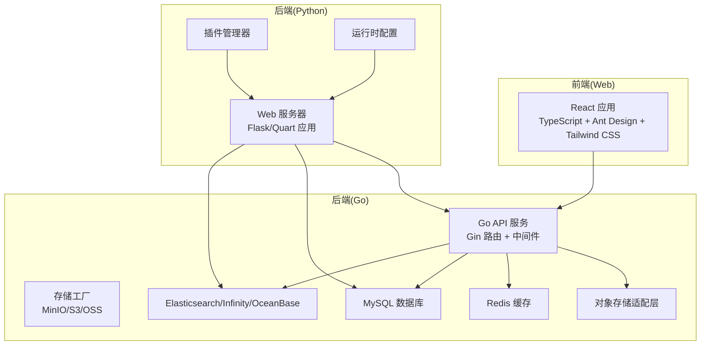
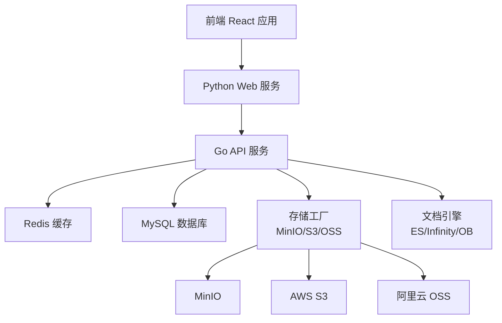
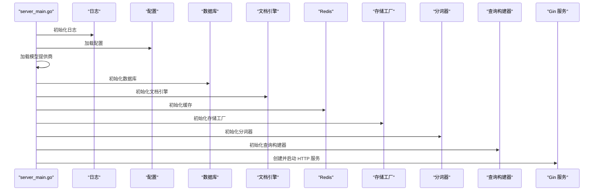
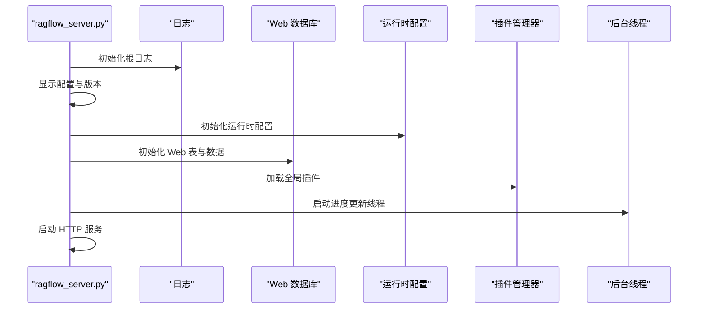
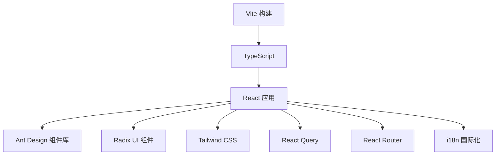
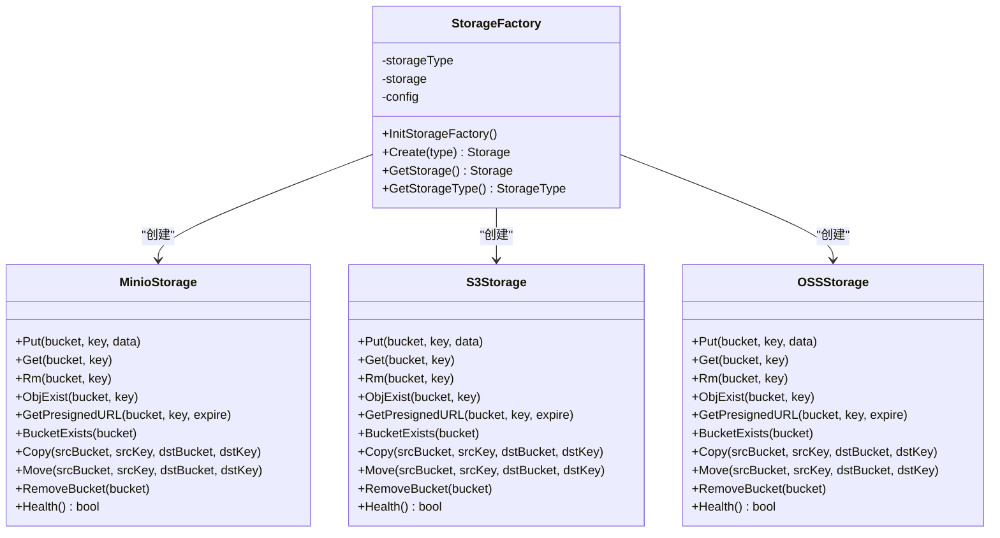
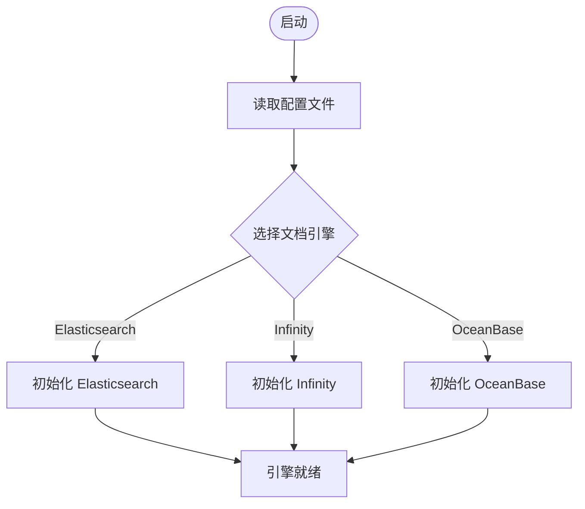
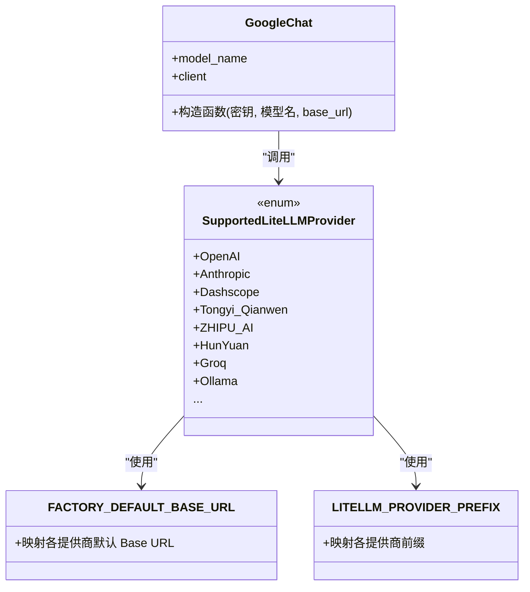

# 技术栈选型

<cite>
**本文档引用的文件**
- [go.mod](file://go.mod)
- [pyproject.toml](file://pyproject.toml)
- [package.json](file://web/package.json)
- [docker-compose.yml](file://docker/docker-compose.yml)
- [service_conf.yaml](file://conf/service_conf.yaml)
- [server_main.go](file://cmd/server_main.go)
- [ragflow_server.py](file://api/ragflow_server.py)
- [app.tsx](file://web/src/app.tsx)
- [storage_factory.go](file://internal/storage/storage_factory.go)
- [minio.go](file://internal/storage/minio.go)
- [s3.go](file://internal/storage/s3.go)
- [oss.go](file://internal/storage/oss.go)
- [chat_model.py](file://rag/llm/chat_model.py)
- [health_utils.py](file://api/utils/health_utils.py)
</cite>

## 目录
1. [引言](#引言)
2. [项目结构](#项目结构)
3. [核心组件](#核心组件)
4. [架构总览](#架构总览)
5. [详细组件分析](#详细组件分析)
6. [依赖关系分析](#依赖关系分析)
7. [性能考量](#性能考量)
8. [故障排查指南](#故障排查指南)
9. [结论](#结论)

## 引言
本文件系统性阐述 RAGFlow 的技术栈选型与实现依据，覆盖后端语言分工（Go 与 Python）、前端 React 技术栈、数据库与搜索引擎选型、对象存储集成方案，以及多提供商 AI 模型接入策略。通过对关键源码文件的分析，给出可操作的架构图、流程图与最佳实践建议。

## 项目结构
RAGFlow 采用“Go 后端 + Python Web + React 前端”的分层架构：
- Go 层负责高性能 API 服务、路由、缓存、存储工厂与心跳上报
- Python 层负责 Web 应用初始化、运行时配置、插件管理与任务调度
- 前端使用 React + TypeScript，配合 Ant Design 与 Tailwind CSS 构建用户界面
- 存储层通过统一工厂抽象对接 MinIO、AWS S3、阿里云 OSS 等对象存储
- 数据库与检索引擎通过配置文件集中管理，支持 MySQL、Elasticsearch、Infinity、OceanBase 等

图表来源
- [server_main.go:155-231](file://cmd/server_main.go#L155-L231)
- [ragflow_server.py:74-155](file://api/ragflow_server.py#L74-L155)
- [storage_factory.go:47-75](file://internal/storage/storage_factory.go#L47-L75)

章节来源
- [docker-compose.yml:1-135](file://docker/docker-compose.yml#L1-L135)
- [service_conf.yaml:1-160](file://conf/service_conf.yaml#L1-L160)

## 核心组件
- Go 后端：基于 Gin 的高性能 HTTP 服务，负责路由、中间件、服务初始化与心跳上报；通过存储工厂统一接入对象存储；集成 Redis 缓存与 MySQL 数据库；支持 Elasticsearch/Infinity/OceanBase 文档检索引擎。
- Python Web：负责应用启动、数据库表初始化、运行时配置加载、超级用户初始化、插件加载与后台任务调度。
- 前端 React：基于 Vite 构建，使用 TypeScript、Ant Design 组件库与 Tailwind CSS 样式体系，提供国际化、主题切换与路由管理。
- 对象存储：统一工厂模式支持 MinIO、AWS S3、阿里云 OSS，具备健康检查、上传下载、预签名 URL、桶级操作等能力。
- 多提供商 AI：通过统一枚举与前缀映射支持 OpenAI、Anthropic、阿里 Dashscope/Qwen、腾讯混元、Groq、Ollama 等多家模型厂商。

章节来源
- [server_main.go:95-153](file://cmd/server_main.go#L95-L153)
- [ragflow_server.py:94-155](file://api/ragflow_server.py#L94-L155)
- [package.json:28-135](file://web/package.json#L28-L135)

## 架构总览
下图展示 Go 与 Python 双后端协同、前端交互、对象存储与数据库/搜索引擎的总体关系：

图表来源
- [server_main.go:155-231](file://cmd/server_main.go#L155-L231)
- [storage_factory.go:64-75](file://internal/storage/storage_factory.go#L64-L75)
- [service_conf.yaml:16-46](file://conf/service_conf.yaml#L16-L46)

## 详细组件分析

### Go 后端服务初始化与路由
- 初始化顺序：日志、配置、模型提供商、数据库、文档引擎、Redis、存储工厂、变量、分词器、查询构建器
- 启动 Gin 服务，设置中间件（日志/恢复），注册路由并监听端口
- 心跳上报：周期性向管理服务发送心跳，维护可用状态

图表来源
- [server_main.go:45-153](file://cmd/server_main.go#L45-L153)

章节来源
- [server_main.go:45-153](file://cmd/server_main.go#L45-L153)

### Python Web 服务启动与插件管理
- 初始化根日志、版本信息、环境与运行时配置
- 初始化 Web 数据库与基础数据，加载全局插件管理器
- 后台线程定期更新进度，信号处理优雅关闭
- 支持调试模式与超级用户初始化参数

图表来源
- [ragflow_server.py:74-155](file://api/ragflow_server.py#L74-L155)

章节来源
- [ragflow_server.py:74-155](file://api/ragflow_server.py#L74-L155)

### 前端 React 技术栈
- 构建工具：Vite，开发/生产模式，Storybook 支持
- 语言与类型：TypeScript，严格类型约束
- UI 组件：Ant Design Pro 组件库与 Radix UI 基础组件
- 样式：Tailwind CSS + 自定义 Less，支持暗/亮主题与响应式断点
- 国际化：i18n 配置与多语言资源，动态切换语言
- 状态与网络：React Query 管理请求缓存与重试，路由基于 React Router

图表来源
- [package.json:7-196](file://web/package.json#L7-L196)
- [app.tsx:1-178](file://web/src/app.tsx#L1-L178)

章节来源
- [package.json:28-135](file://web/package.json#L28-L135)
- [app.tsx:79-178](file://web/src/app.tsx#L79-L178)

### 对象存储集成（统一工厂）
- 工厂模式：根据配置类型创建 MinIO、S3 或 OSS 实例
- 统一接口：Put/Get/Rm/ObjExist/PresignedURL/BucketExists/Copy/Move/RemoveBucket
- 健康检查：针对 MinIO/S3/OSS 分别进行桶存在性与上传测试
- 连接复用：失败自动重连与重试策略

图表来源
- [storage_factory.go:47-75](file://internal/storage/storage_factory.go#L47-L75)
- [minio.go:129-257](file://internal/storage/minio.go#L129-L257)
- [s3.go:156-291](file://internal/storage/s3.go#L156-L291)
- [oss.go:148-283](file://internal/storage/oss.go#L148-L283)

章节来源
- [storage_factory.go:47-128](file://internal/storage/storage_factory.go#L47-L128)
- [minio.go:108-127](file://internal/storage/minio.go#L108-L127)
- [s3.go:114-154](file://internal/storage/s3.go#L114-L154)
- [oss.go:106-146](file://internal/storage/oss.go#L106-L146)

### 数据库与搜索引擎选型
- 数据库：MySQL（ORM：GORM）作为主数据存储
- 检索引擎：
  - Elasticsearch：默认文档检索与查询
  - Infinity：高性能向量/文本混合检索
  - OceanBase：企业级关系型数据库，支持向量扩展
- 配置集中于 YAML，支持按需启用不同引擎

图表来源
- [service_conf.yaml:22-41](file://conf/service_conf.yaml#L22-L41)
- [health_utils.py:88-133](file://api/utils/health_utils.py#L88-L133)

章节来源
- [service_conf.yaml:1-160](file://conf/service_conf.yaml#L1-L160)
- [health_utils.py:88-133](file://api/utils/health_utils.py#L88-L133)

### 多提供商 AI 模型集成
- 提供商枚举与默认 Base URL、前缀映射覆盖 OpenAI、Anthropic、阿里 DashScope/Qwen、腾讯 HunYuan、Groq、Ollama 等
- Google Cloud 支持通过服务账号与区域参数调用 Vertex AI 或 Claude
- Web 层根据工厂名称解析密钥与参数，构造统一 LLM 客户端

图表来源
- [chat_model.py:974-1005](file://rag/llm/chat_model.py#L974-L1005)
- [pyproject.toml:125-148](file://pyproject.toml#L125-L148)

章节来源
- [chat_model.py:974-1005](file://rag/llm/chat_model.py#L974-L1005)
- [pyproject.toml:125-148](file://pyproject.toml#L125-L148)

## 依赖关系分析
- Go 依赖：Gin（Web 框架）、GORM（MySQL ORM）、Elasticsearch SDK、Redis 客户端、AWS SDK、MinIO SDK、日志与配置管理
- Python 依赖：Flask/Quart、各类 AI SDK（OpenAI、Anthropic、DashScope、Qwen、Groq、Ollama 等）、对象存储 SDK（MinIO、AWS S3、阿里云 OSS）、数据库驱动与搜索客户端
- 前端依赖：React 生态、Ant Design、Tailwind CSS、i18n、React Query、路由与构建工具链

```mermaid
graph TB
Go_Mod["go.mod 依赖"] --> Gin["gin-gonic/gin"]
Go_Mod --> GORM["gorm.io/driver/mysql"]
Go_Mod --> ES["elastic/go-elasticsearch"]
Go_Mod --> Redis["redis/go-redis"]
Go_Mod --> AWS["aws-sdk-go-v2"]
Go_Mod --> MinIO["minio/minio-go"]
Py_Toml["pyproject.toml 依赖"] --> Flask["Flask/Quart"]
Py_Toml --> OpenAI["openai"]
Py_Toml --> Anthropic["anthropic"]
Py_Toml --> DashScope["dashscope"]
Py_Toml --> Qwen["qianfan"]
Py_Toml --> Groq["groq"]
Py_Toml --> Ollama["ollama"]
Py_Toml --> MinioPy["minio"]
Py_Toml --> S3Py["mypy-boto3-s3"]
Py_Toml --> OSSPy["oss2"]
FE_Pkg["web/package.json 依赖"] --> React["react"]
FE_Pkg --> AntD["@ant-design/*"]
FE_Pkg --> Tailwind["tailwindcss"]
FE_Pkg --> TS["typescript"]
```

图表来源
- [go.mod:5-25](file://go.mod#L5-L25)
- [pyproject.toml:9-160](file://pyproject.toml#L9-L160)
- [package.json:28-135](file://web/package.json#L28-L135)

章节来源
- [go.mod:5-25](file://go.mod#L5-L25)
- [pyproject.toml:9-160](file://pyproject.toml#L9-L160)
- [package.json:28-135](file://web/package.json#L28-L135)

## 性能考量
- Go 侧采用 Gin 的 Release 模式与连接池、中间件优化；Redis 缓存降低数据库压力；对象存储统一工厂减少分支判断开销
- Python 侧后台线程与分布式锁控制定期任务，避免重复执行；日志与异常捕获保证稳定性
- 前端使用 React Query 缓存与去重请求，Tailwind CSS 减少样式体积；Vite 开发体验与按需打包提升构建效率
- 文档检索引擎支持多后端切换，结合配置文件按需启用，兼顾成本与性能

## 故障排查指南
- 存储健康检查：MinIO/S3/OSS 健康检查分别验证桶存在性与上传能力，出现异常时查看日志与重试机制
- OceanBase/Infinity 健康检查：通过环境变量与连接池刷新机制保障可用性
- 心跳上报：若管理服务不可达，心跳失败会更新可用状态，便于运维监控

章节来源
- [minio.go:108-127](file://internal/storage/minio.go#L108-L127)
- [s3.go:114-154](file://internal/storage/s3.go#L114-L154)
- [oss.go:106-146](file://internal/storage/oss.go#L106-L146)
- [health_utils.py:88-133](file://api/utils/health_utils.py#L88-L133)
- [server_main.go:239-261](file://cmd/server_main.go#L239-L261)

## 结论
RAGFlow 的技术栈选型以“Go 高性能 + Python 生态 + React 前端”为核心，结合统一存储工厂与多提供商 AI 模型，形成可扩展、可维护、易部署的 RAG 基础设施。通过配置文件集中管理数据库与检索引擎，满足从单机到企业级的多样化场景需求。