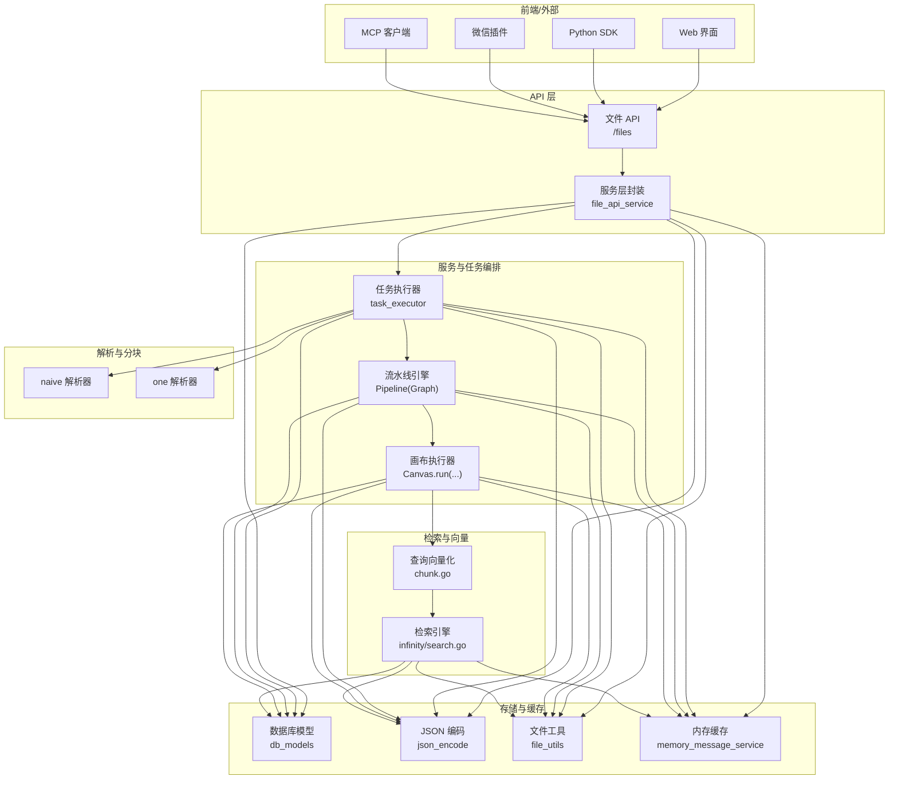
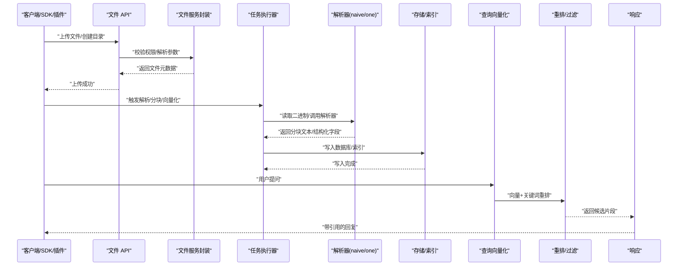
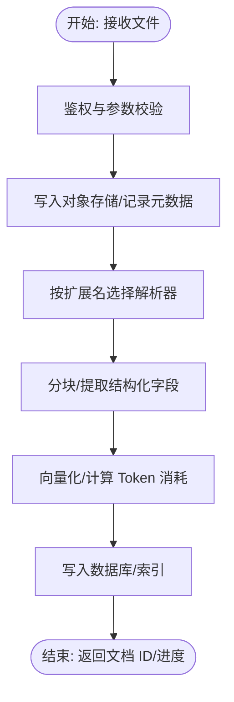
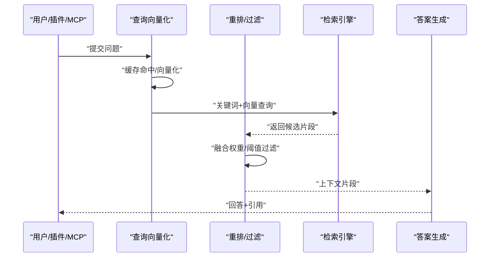
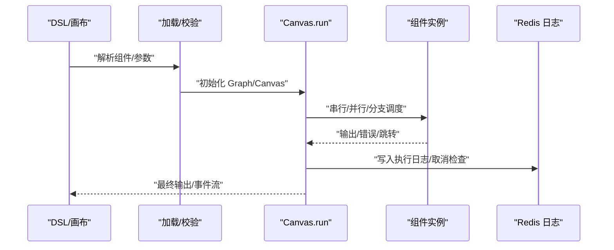
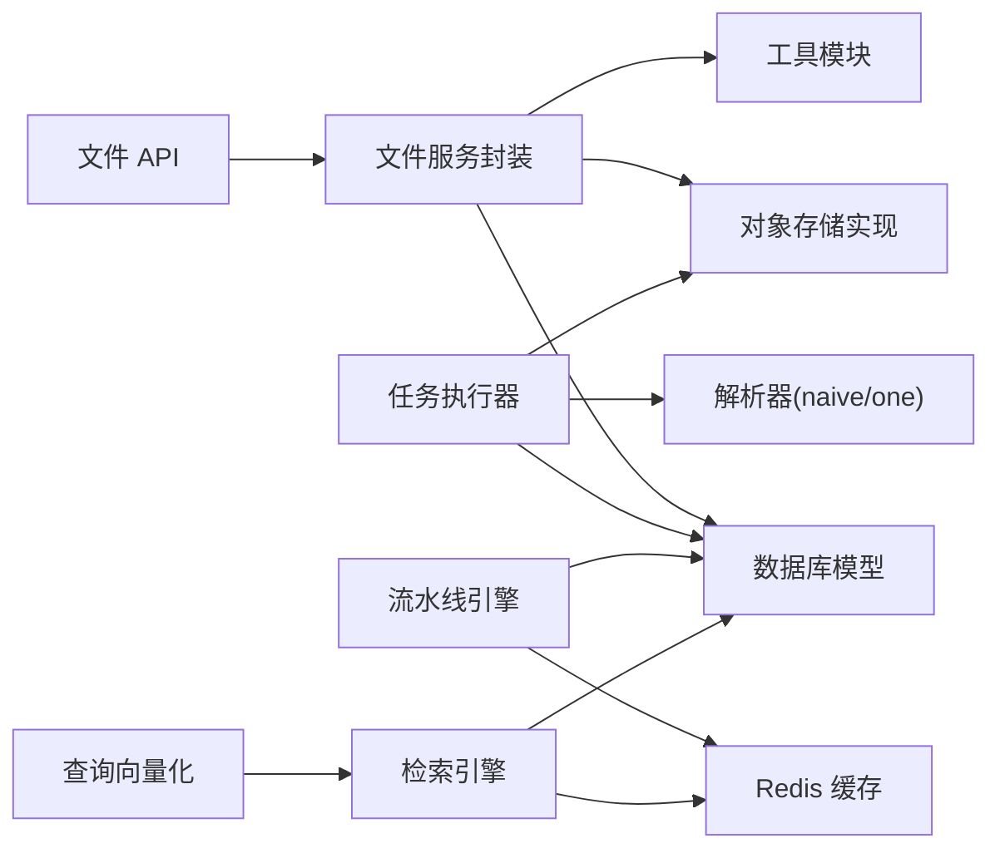

# 数据流设计

<cite>
**本文引用的文件**
- [api/apps/restful_apis/file_api.py](file://api/apps/restful_apis/file_api.py)
- [api/apps/services/file_api_service.py](file://api/apps/services/file_api_service.py)
- [rag/app/naive.py](file://rag/app/naive.py)
- [rag/app/one.py](file://rag/app/one.py)
- [rag/svr/task_executor.py](file://rag/svr/task_executor.py)
- [internal/service/chunk.go](file://internal/service/chunk.go)
- [internal/engine/infinity/search.go](file://internal/engine/infinity/search.go)
- [rag/flow/pipeline.py](file://rag/flow/pipeline.py)
- [agent/canvas.py](file://agent/canvas.py)
- [mcp/server/server.py](file://mcp/server/server.py)
- [tools/chatgpt-on-wechat/plugins/ragflow_chat.py](file://tools/chatgpt-on-wechat/plugins/ragflow_chat.py)
- [api/db/db_models.py](file://api/db/db_models.py)
- [api/utils/json_encode.py](file://api/utils/json_encode.py)
- [api/utils/file_utils.py](file://api/utils/file_utils.py)
- [common/constants.py](file://common/constants.py)
- [memory/utils/ob_conn.py](file://memory/utils/ob_conn.py)
- [rag/utils/ob_conn.py](file://rag/utils/ob_conn.py)
- [common/doc_store/ob_conn_base.py](file://common/doc_store/ob_conn_base.py)
- [api/db/joint_services/memory_message_service.py](file://api/db/joint_services/memory_message_service.py)
</cite>

## 目录
1. [引言](#引言)
2. [项目结构](#项目结构)
3. [核心组件](#核心组件)
4. [架构总览](#架构总览)
5. [详细组件分析](#详细组件分析)
6. [依赖分析](#依赖分析)
7. [性能考虑](#性能考虑)
8. [故障排查指南](#故障排查指南)
9. [结论](#结论)
10. [附录](#附录)

## 引言
本文件系统化梳理 RAGFlow 的数据流设计，覆盖从“文件上传与解析”到“分块与向量化存储”的完整文档处理链路；从“用户提问与检索”到“上下文构建与答案生成”的 RAG 查询链路；以及从“工作流定义加载”到“组件串并行执行与结果聚合”的代理执行链路。文档还总结了数据在内存、数据库与缓存之间的传递机制，以及数据格式转换与标准化策略，并通过多种图示帮助读者快速理解复杂业务逻辑。

## 项目结构
RAGFlow 的数据流由多层协作组成：前端/SDK 与后端 API 层负责文件与会话入口；服务层负责任务编排与执行；引擎层负责检索与向量化；存储层负责持久化与缓存；工具与插件层提供外部集成能力。

图表来源
- [api/apps/restful_apis/file_api.py:43-96](file://api/apps/restful_apis/file_api.py#L43-L96)
- [api/apps/services/file_api_service.py:32-102](file://api/apps/services/file_api_service.py#L32-L102)
- [rag/svr/task_executor.py:271-300](file://rag/svr/task_executor.py#L271-L300)
- [rag/app/naive.py:948-1087](file://rag/app/naive.py#L948-L1087)
- [rag/app/one.py:144-175](file://rag/app/one.py#L144-L175)
- [rag/flow/pipeline.py:117-175](file://rag/flow/pipeline.py#L117-L175)
- [agent/canvas.py:375-668](file://agent/canvas.py#L375-L668)
- [internal/service/chunk.go:188-311](file://internal/service/chunk.go#L188-L311)
- [internal/engine/infinity/search.go:508-565](file://internal/engine/infinity/search.go#L508-L565)
- [api/db/db_models.py:667-720](file://api/db/db_models.py#L667-L720)
- [api/utils/json_encode.py:52-95](file://api/utils/json_encode.py#L52-L95)
- [api/utils/file_utils.py:58-81](file://api/utils/file_utils.py#L58-L81)
- [api/db/joint_services/memory_message_service.py:296-318](file://api/db/joint_services/memory_message_service.py#L296-L318)

章节来源
- [api/apps/restful_apis/file_api.py:43-96](file://api/apps/restful_apis/file_api.py#L43-L96)
- [api/apps/services/file_api_service.py:32-102](file://api/apps/services/file_api_service.py#L32-L102)

## 核心组件
- 文件上传与目录管理：提供文件上传、列表、删除、移动/重命名、下载与父级路径查询等接口，统一进行权限校验与存储落盘。
- 任务执行与编排：负责解析器选择、分块、向量化、写入索引与持久化，支持并发与进度追踪。
- 检索与排序：对查询进行向量化，结合关键词与向量相似度进行重排与过滤，支持多表/多知识库检索。
- 工作流与代理执行：以 DSL 描述的组件图，支持串行/并行/分支/循环/迭代等控制流，异步事件驱动输出。
- 存储与缓存：数据库模型统一序列化/反序列化，Redis 缓存用于日志与内存大小统计，文件存储抽象屏蔽底层对象存储差异。
- 外部集成：MCP 服务器提供检索工具，微信插件桥接聊天消息与 RAGFlow API。

章节来源
- [api/apps/services/file_api_service.py:105-140](file://api/apps/services/file_api_service.py#L105-L140)
- [rag/svr/task_executor.py:271-300](file://rag/svr/task_executor.py#L271-L300)
- [internal/service/chunk.go:188-311](file://internal/service/chunk.go#L188-L311)
- [rag/flow/pipeline.py:28-175](file://rag/flow/pipeline.py#L28-L175)
- [agent/canvas.py:283-668](file://agent/canvas.py#L283-L668)
- [api/db/db_models.py:667-720](file://api/db/db_models.py#L667-L720)
- [api/db/joint_services/memory_message_service.py:296-318](file://api/db/joint_services/memory_message_service.py#L296-L318)

## 架构总览
下图展示从“文件上传”到“检索与回答”的全链路数据流，标注关键节点的数据形态与传递方式（内存/数据库/缓存）。

图表来源
- [api/apps/restful_apis/file_api.py:43-96](file://api/apps/restful_apis/file_api.py#L43-L96)
- [api/apps/services/file_api_service.py:32-102](file://api/apps/services/file_api_service.py#L32-L102)
- [rag/svr/task_executor.py:271-300](file://rag/svr/task_executor.py#L271-L300)
- [rag/app/naive.py:948-1087](file://rag/app/naive.py#L948-L1087)
- [rag/app/one.py:144-175](file://rag/app/one.py#L144-L175)
- [internal/service/chunk.go:188-311](file://internal/service/chunk.go#L188-L311)
- [internal/engine/infinity/search.go:508-565](file://internal/engine/infinity/search.go#L508-L565)

## 详细组件分析

### 文档处理流程（上传 → 解析 → 分块 → 向量化 → 存储）
- 入口与权限：文件 API 负责鉴权与参数校验，支持表单上传与 JSON 创建目录两种模式。
- 存储落盘：服务层将文件写入对象存储，记录文件元数据至数据库。
- 解析与分块：根据扩展名选择解析器（如 naive/one），按配置切分文本，生成标题与分块字段。
- 向量化与写入：对分块进行向量化，写入数据库或文档引擎（Infinity/OceanBase/ES/OpenSearch）。
- 进度与并发：任务执行器限制并发，回调进度，异常中断并回滚。

图表来源
- [api/apps/restful_apis/file_api.py:43-96](file://api/apps/restful_apis/file_api.py#L43-L96)
- [api/apps/services/file_api_service.py:32-102](file://api/apps/services/file_api_service.py#L32-L102)
- [rag/svr/task_executor.py:271-300](file://rag/svr/task_executor.py#L271-L300)
- [rag/app/naive.py:948-1087](file://rag/app/naive.py#L948-L1087)
- [rag/app/one.py:144-175](file://rag/app/one.py#L144-L175)

章节来源
- [api/apps/restful_apis/file_api.py:43-96](file://api/apps/restful_apis/file_api.py#L43-L96)
- [api/apps/services/file_api_service.py:32-102](file://api/apps/services/file_api_service.py#L32-L102)
- [rag/svr/task_executor.py:271-300](file://rag/svr/task_executor.py#L271-L300)
- [rag/app/naive.py:948-1087](file://rag/app/naive.py#L948-L1087)
- [rag/app/one.py:144-175](file://rag/app/one.py#L144-L175)

### RAG 查询流程（提问 → 向量化 → 检索 → 重排 → 上下文 → 生成）
- 提问接收：支持网页、SDK、MCP、微信插件等多种入口。
- 查询向量化：优先命中嵌入缓存，未命中则调用嵌入模型编码。
- 检索与重排：根据关键词与向量相似度融合权重，对多表/多 KB 结果进行重排与阈值过滤。
- 上下文构建：将候选片段与元数据拼装为提示上下文。
- 答案生成：调用 LLM 生成最终回答并返回引用。

图表来源
- [internal/service/chunk.go:188-311](file://internal/service/chunk.go#L188-L311)
- [internal/engine/infinity/search.go:508-565](file://internal/engine/infinity/search.go#L508-L565)
- [mcp/server/server.py:503-528](file://mcp/server/server.py#L503-L528)
- [tools/chatgpt-on-wechat/plugins/ragflow_chat.py:56-127](file://tools/chatgpt-on-wechat/plugins/ragflow_chat.py#L56-L127)

章节来源
- [internal/service/chunk.go:188-311](file://internal/service/chunk.go#L188-L311)
- [internal/engine/infinity/search.go:508-565](file://internal/engine/infinity/search.go#L508-L565)
- [mcp/server/server.py:503-528](file://mcp/server/server.py#L503-L528)
- [tools/chatgpt-on-wechat/plugins/ragflow_chat.py:56-127](file://tools/chatgpt-on-wechat/plugins/ragflow_chat.py#L56-L127)

### 代理执行流程（DSL 加载 → 组件解析 → 串并行执行 → 结果聚合）
- DSL 加载：从用户画布或流水线日志中加载 DSL，初始化组件图。
- 组件解析：根据组件类型构造参数对象并校验，实例化组件对象。
- 执行模型：Canvas.run 支持串行、并行、分支、循环、迭代等控制流，异步事件驱动输出。
- 日志与取消：通过 Redis 记录执行日志与取消信号，支持任务取消与进度更新。
- 输出聚合：最终输出汇聚到下游组件或返回给调用方。

图表来源
- [rag/flow/pipeline.py:28-175](file://rag/flow/pipeline.py#L28-L175)
- [agent/canvas.py:283-668](file://agent/canvas.py#L283-L668)

章节来源
- [rag/flow/pipeline.py:28-175](file://rag/flow/pipeline.py#L28-L175)
- [agent/canvas.py:283-668](file://agent/canvas.py#L283-L668)

### 数据在组件间的传递机制
- 内存传递：组件间通过输出字典与变量引用传递，Canvas 提供全局变量与跨组件取值机制。
- 数据库持久化：文件、文档、任务、租户、LLM 配置等均以 ORM 模型持久化，支持连接池与自动重试。
- 缓存共享：Redis 用于执行日志、取消标记、内存大小统计等，提升可观测性与运行时效率。

章节来源
- [agent/canvas.py:193-270](file://agent/canvas.py#L193-L270)
- [api/db/db_models.py:667-720](file://api/db/db_models.py#L667-L720)
- [api/db/joint_services/memory_message_service.py:296-318](file://api/db/joint_services/memory_message_service.py#L296-L318)

### 数据格式转换与标准化
- JSON 序列化：自定义编码器支持枚举、日期、集合、类类型等，确保跨语言传输一致性。
- 文件类型识别：基于扩展名的稳健类型判定，避免路径与长度异常。
- 字段标准化：解析器输出统一为标题、分块文本、结构化 JSON 等字段，适配不同文档引擎映射。

章节来源
- [api/utils/json_encode.py:52-95](file://api/utils/json_encode.py#L52-L95)
- [api/utils/file_utils.py:58-81](file://api/utils/file_utils.py#L58-L81)
- [rag/app/table.py:470-494](file://rag/app/table.py#L470-L494)

## 依赖分析
- 组件耦合：API 层仅依赖服务层；服务层依赖存储抽象与工具模块；任务执行器依赖解析器与引擎；引擎依赖数据库与缓存。
- 外部依赖：对象存储（MinIO/AWS S3/OSS/GCS）、文档引擎（Infinity/OceanBase/ES/OpenSearch）、Redis、MCP 服务。
- 循环依赖：当前代码未发现直接循环导入；各层职责清晰，通过接口与服务解耦。

图表来源
- [api/apps/restful_apis/file_api.py:43-96](file://api/apps/restful_apis/file_api.py#L43-L96)
- [api/apps/services/file_api_service.py:32-102](file://api/apps/services/file_api_service.py#L32-L102)
- [rag/svr/task_executor.py:271-300](file://rag/svr/task_executor.py#L271-L300)
- [rag/flow/pipeline.py:28-175](file://rag/flow/pipeline.py#L28-L175)
- [internal/service/chunk.go:188-311](file://internal/service/chunk.go#L188-L311)
- [internal/engine/infinity/search.go:508-565](file://internal/engine/infinity/search.go#L508-L565)

章节来源
- [common/constants.py:167-175](file://common/constants.py#L167-L175)
- [api/db/db_models.py:484-494](file://api/db/db_models.py#L484-L494)

## 性能考虑
- 并发与限流：任务执行器与解析器采用线程池与信号量控制并发，避免资源争用。
- 缓存策略：查询向量化使用嵌入缓存，减少重复计算；Redis 缓存日志与取消标志，降低 IO 压力。
- 存储优化：不同文档引擎采用不同的字段映射与索引策略，按需选择以平衡写入与查询性能。
- 错误重试：数据库连接具备指数退避重试，提升稳定性。

## 故障排查指南
- 上传失败：检查鉴权头、文件大小限制、对象存储可用性与权限。
- 解析异常：确认扩展名与解析器匹配，查看解析器回调进度与错误信息。
- 检索无结果：调整相似度阈值与融合权重，确认索引是否存在与表名映射正确。
- 执行中断：检查 Redis 取消键与任务状态，查看日志 trace 中的组件进度与错误。
- 缓存失效：确认 Redis 连接与键空间，核对缓存命中率与维度。

章节来源
- [api/apps/restful_apis/file_api.py:94-96](file://api/apps/restful_apis/file_api.py#L94-L96)
- [rag/svr/task_executor.py:286-291](file://rag/svr/task_executor.py#L286-L291)
- [internal/engine/infinity/search.go:561-565](file://internal/engine/infinity/search.go#L561-L565)
- [agent/canvas.py:106-114](file://agent/canvas.py#L106-L114)

## 结论
RAGFlow 的数据流设计以“可扩展、可观测、可维护”为目标，通过清晰的分层与组件化实现，将文件上传、解析分块、向量化存储、检索重排与代理执行串联为一条高吞吐、低延迟的数据通路。配合数据库与缓存的标准化策略，满足多场景下的性能与可靠性要求。

## 附录
- 外部检索工具：MCP 服务器提供 ragflow_retrieval 工具，支持指定数据集/文档、分页与重排参数。
- 微信插件：将聊天消息转发至 RAGFlow API，实现即开即用的问答能力。

章节来源
- [mcp/server/server.py:437-528](file://mcp/server/server.py#L437-L528)
- [tools/chatgpt-on-wechat/plugins/ragflow_chat.py:56-127](file://tools/chatgpt-on-wechat/plugins/ragflow_chat.py#L56-L127)