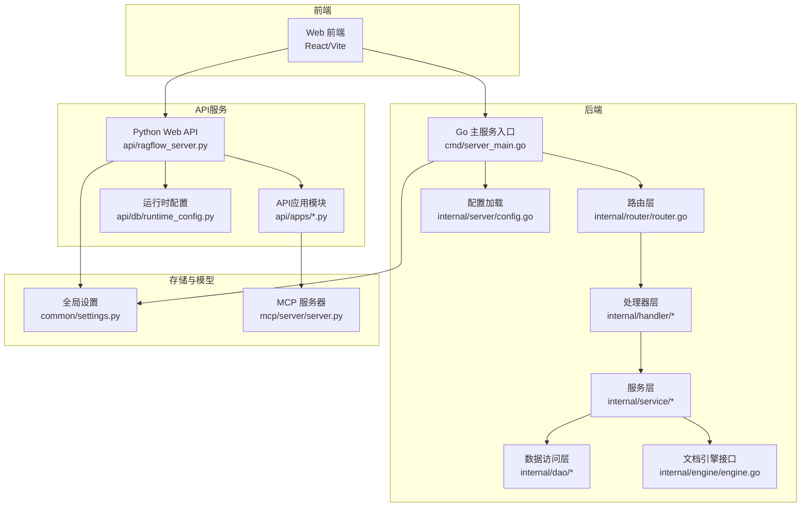
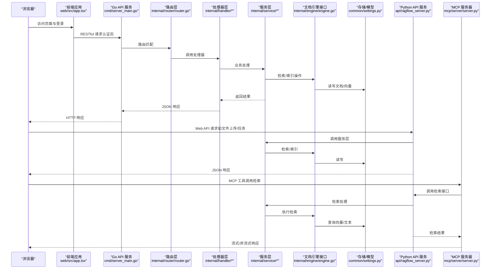
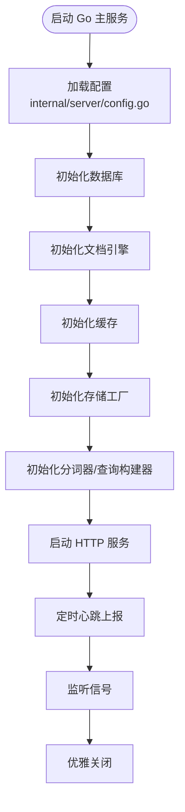
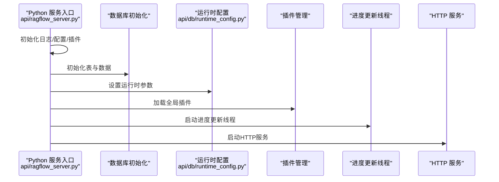
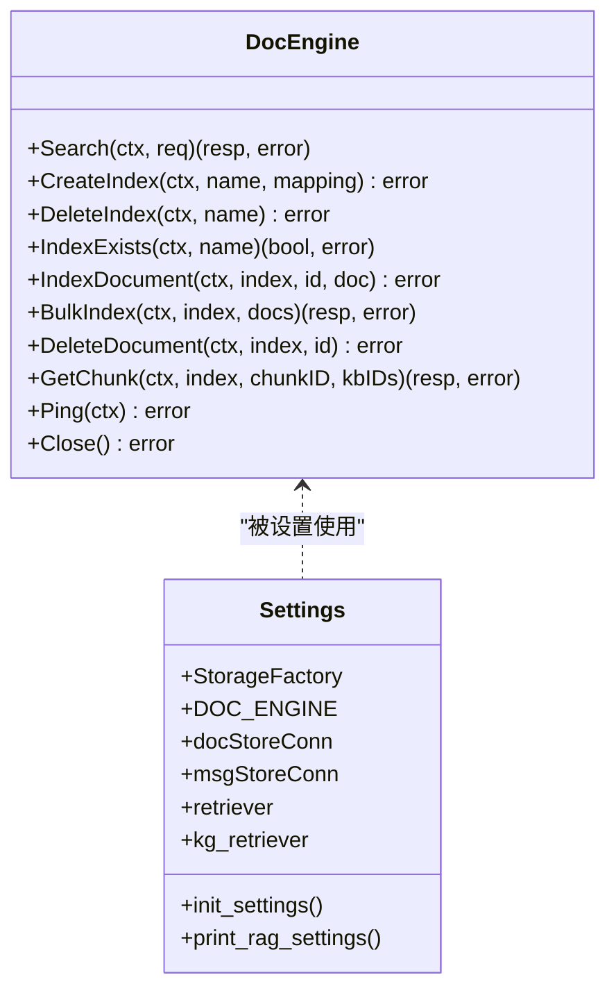
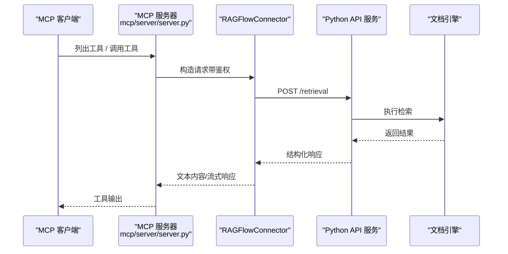
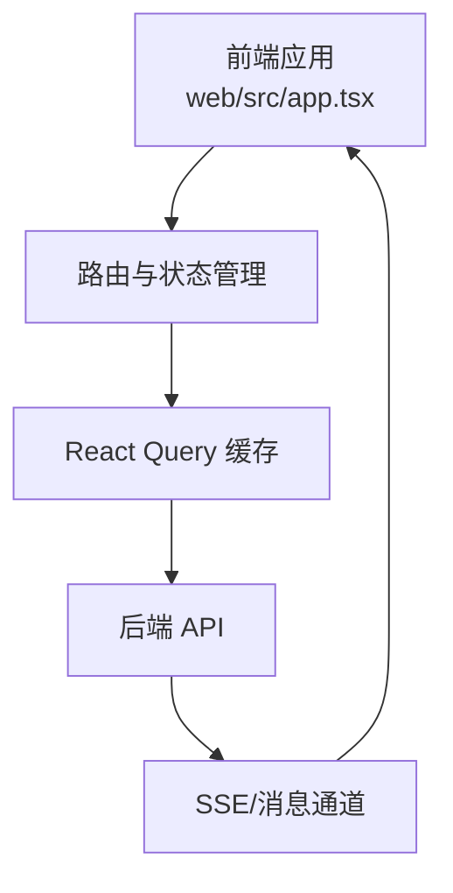
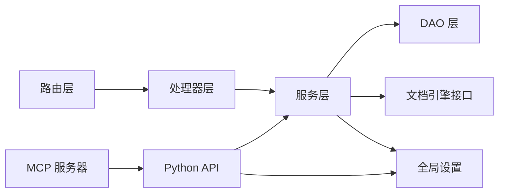

# 整体架构设计

<cite>
**本文档引用的文件**
- [README.md](file://README.md)
- [api/ragflow_server.py](file://api/ragflow_server.py)
- [cmd/server_main.go](file://cmd/server_main.go)
- [internal/server/config.go](file://internal/server/config.go)
- [api/apps/api_app.py](file://api/apps/api_app.py)
- [internal/router/router.go](file://internal/router/router.go)
- [api/db/runtime_config.py](file://api/db/runtime_config.py)
- [internal/engine/engine.go](file://internal/engine/engine.go)
- [common/settings.py](file://common/settings.py)
- [internal/model/chat.go](file://internal/model/chat.go)
- [api/apps/mcp_server_app.py](file://api/apps/mcp_server_app.py)
- [mcp/server/server.py](file://mcp/server/server.py)
- [web/src/app.tsx](file://web/src/app.tsx)
</cite>

## 目录
1. [引言](#引言)
2. [项目结构](#项目结构)
3. [核心组件](#核心组件)
4. [架构总览](#架构总览)
5. [详细组件分析](#详细组件分析)
6. [依赖分析](#依赖分析)
7. [性能考虑](#性能考虑)
8. [故障排查指南](#故障排查指南)
9. [结论](#结论)
10. [附录](#附录)

## 引言
本文件面向RAGFlow的整体架构设计，系统性阐述其分层架构（前端UI层、API接口层、业务服务层、数据访问层）、微服务化与模块化设计、代理系统、RAG引擎、存储系统、模型管理等核心模块之间的边界与交互关系，并结合RESTful API、WebSocket实时通信、MCP协议集成等技术方案，帮助开发者快速理解系统设计思路与实现要点。

## 项目结构
RAGFlow采用多语言混合架构：Go语言作为后端主服务入口，负责路由、中间件、服务编排与心跳上报；Python用于Web API服务与RAG相关工具链；前端使用React/Vite构建；同时提供MCP（Model Context Protocol）服务器以支持外部工具调用与检索增强。

**图示来源**
- [cmd/server_main.go:155-280](file://cmd/server_main.go#L155-L280)
- [internal/router/router.go:78-259](file://internal/router/router.go#L78-L259)
- [api/ragflow_server.py:74-155](file://api/ragflow_server.py#L74-L155)
- [api/apps/api_app.py:1-118](file://api/apps/api_app.py#L1-L118)
- [internal/server/config.go:211-703](file://internal/server/config.go#L211-L703)
- [common/settings.py:174-414](file://common/settings.py#L174-L414)
- [mcp/server/server.py:558-778](file://mcp/server/server.py#L558-L778)

**章节来源**
- [README.md:140-144](file://README.md#L140-L144)
- [cmd/server_main.go:45-153](file://cmd/server_main.go#L45-L153)
- [api/ragflow_server.py:17-44](file://api/ragflow_server.py#L17-L44)

## 核心组件
- 分层架构
  - 前端UI层：基于React/Vite的单页应用，提供用户界面与交互。
  - API接口层：Go Gin框架路由与处理器，提供RESTful API与中间件。
  - 业务服务层：Go服务层封装领域逻辑，DAO层访问数据库。
  - 数据访问层：ORM映射与数据库连接，支持MySQL。
  - 存储与模型：统一配置与工厂初始化，支持多种文档引擎与存储实现。
  - MCP协议：独立的MCP服务器，提供检索工具与流式传输能力。

- 微服务与模块化
  - 后端通过Go主服务启动多个子服务（用户、文档、知识库、聊天、搜索、文件等），并通过路由聚合对外暴露。
  - Python API服务作为补充，提供特定API与任务调度能力。
  - 配置中心：Go与Python分别加载配置，支持环境变量覆盖与YAML配置文件。

- 代理系统与RAG引擎
  - 文档引擎接口抽象，支持Elasticsearch与Infinity等后端。
  - 检索器与知识图谱检索器在公共设置中初始化，贯穿服务层调用。

- 存储系统
  - 支持MinIO、S3、OSS、GCS等多种对象存储，通过工厂模式按需选择。
  - 加密存储可选启用，提升数据安全性。

- 模型管理
  - 统一加载默认模型配置（聊天、嵌入、重排序、ASR、图像转文本），支持工厂与API Key注入。

**章节来源**
- [internal/router/router.go:25-76](file://internal/router/router.go#L25-L76)
- [internal/engine/engine.go:39-60](file://internal/engine/engine.go#L39-L60)
- [common/settings.py:174-414](file://common/settings.py#L174-L414)
- [internal/server/config.go:211-703](file://internal/server/config.go#L211-L703)

## 架构总览
下图展示从浏览器到后端服务、再到RAG引擎与存储的完整调用链路，以及MCP工具集成路径。

**图示来源**
- [cmd/server_main.go:155-280](file://cmd/server_main.go#L155-L280)
- [internal/router/router.go:78-259](file://internal/router/router.go#L78-L259)
- [api/ragflow_server.py:74-155](file://api/ragflow_server.py#L74-L155)
- [mcp/server/server.py:503-555](file://mcp/server/server.py#L503-L555)

## 详细组件分析

### Go主服务与路由层
- 入口与生命周期
  - 主程序解析命令行参数与配置，初始化日志、数据库、文档引擎、缓存、存储工厂、变量与心跳上报。
  - 启动Gin引擎，注册中间件与路由，监听指定端口。
- 路由组织
  - 系统级健康检查、版本信息、配置查询。
  - 受保护路由组，包含用户、租户、知识库、文档、块、LLM、对话、会话、连接器、搜索、文件等资源接口。
- 心跳与优雅停机
  - 定时向管理服务发送心跳，支持SIGINT/SIGTERM优雅关闭。

**图示来源**
- [cmd/server_main.go:45-153](file://cmd/server_main.go#L45-L153)
- [internal/server/config.go:211-703](file://internal/server/config.go#L211-L703)

**章节来源**
- [cmd/server_main.go:155-280](file://cmd/server_main.go#L155-L280)
- [internal/router/router.go:78-259](file://internal/router/router.go#L78-L259)

### Python Web API服务
- 启动流程
  - 初始化根日志、数据库表与基础数据，加载运行时配置，初始化插件管理器。
  - 启动后台线程定期更新进度，启动HTTP服务。
- API应用模块
  - 提供令牌管理、统计查询、MCP服务器管理等API。
  - 使用装饰器进行登录校验与请求参数验证。

**图示来源**
- [api/ragflow_server.py:74-155](file://api/ragflow_server.py#L74-L155)
- [api/db/runtime_config.py:20-55](file://api/db/runtime_config.py#L20-L55)
- [api/apps/api_app.py:1-118](file://api/apps/api_app.py#L1-L118)

**章节来源**
- [api/ragflow_server.py:17-44](file://api/ragflow_server.py#L17-L44)
- [api/apps/api_app.py:26-118](file://api/apps/api_app.py#L26-L118)

### 文档引擎与存储
- 文档引擎接口
  - 抽象出检索、索引、文档与块操作、健康检查等方法，便于切换底层实现。
- 存储与模型设置
  - 统一加载默认模型配置与工厂，支持多种文档引擎（Elasticsearch、Infinity、OpenSearch、OceanBase等）。
  - 支持多种对象存储（MinIO、S3、OSS、GCS），可选加密存储。

**图示来源**
- [internal/engine/engine.go:39-60](file://internal/engine/engine.go#L39-L60)
- [common/settings.py:174-414](file://common/settings.py#L174-L414)

**章节来源**
- [internal/engine/engine.go:25-70](file://internal/engine/engine.go#L25-L70)
- [common/settings.py:260-342](file://common/settings.py#L260-L342)

### MCP协议与工具调用
- MCP服务器
  - 提供列表工具、调用工具、测试工具、缓存工具、导出导入等管理接口。
  - 支持SSE与Streamable HTTP两种传输方式，兼容不同客户端。
- 工具实现
  - 通过RAGFlowConnector访问后端API，执行检索并返回结构化结果。
  - 支持多租户模式与鉴权头传递。

**图示来源**
- [api/apps/mcp_server_app.py:29-440](file://api/apps/mcp_server_app.py#L29-L440)
- [mcp/server/server.py:432-555](file://mcp/server/server.py#L432-L555)

**章节来源**
- [api/apps/mcp_server_app.py:70-123](file://api/apps/mcp_server_app.py#L70-L123)
- [mcp/server/server.py:649-778](file://mcp/server/server.py#L649-L778)

### 前后端分离与实时通信
- 前端应用
  - 使用React Query进行数据拉取与缓存，Ant Design主题与国际化配置，路由由React Router管理。
- WebSocket与实时通信
  - 路由层定义了SSE与消息通道，配合MCP服务器的SSE/Streamable HTTP传输，满足实时与流式场景需求。

**图示来源**
- [web/src/app.tsx:171-178](file://web/src/app.tsx#L171-L178)
- [internal/router/router.go:599-604](file://internal/router/router.go#L599-L604)
- [mcp/server/server.py:588-646](file://mcp/server/server.py#L588-L646)

**章节来源**
- [web/src/app.tsx:90-178](file://web/src/app.tsx#L90-L178)
- [internal/router/router.go:78-259](file://internal/router/router.go#L78-L259)

## 依赖分析
- 组件耦合与内聚
  - 路由层对处理器层松耦合，处理器对服务层松耦合，服务层对DAO与引擎接口松耦合。
  - 配置通过全局设置与运行时配置注入，避免硬编码。
- 外部依赖与集成点
  - 文档引擎：Elasticsearch、Infinity、OpenSearch、OceanBase。
  - 对象存储：MinIO、S3、OSS、GCS、Azure Blob、OpenDAL。
  - 模型工厂：统一加载默认模型配置，支持多厂商API。
- 接口契约
  - 文档引擎接口定义清晰，便于替换实现。
  - MCP协议接口标准化，便于第三方扩展。

**图示来源**
- [internal/router/router.go:25-76](file://internal/router/router.go#L25-L76)
- [internal/engine/engine.go:39-60](file://internal/engine/engine.go#L39-L60)
- [common/settings.py:174-414](file://common/settings.py#L174-L414)
- [api/ragflow_server.py:74-155](file://api/ragflow_server.py#L74-L155)

**章节来源**
- [internal/server/config.go:211-703](file://internal/server/config.go#L211-L703)
- [api/db/runtime_config.py:20-55](file://api/db/runtime_config.py#L20-L55)

## 性能考虑
- 并发与异步
  - Python API服务使用线程池执行耗时任务（如MCP工具发现），避免阻塞主线程。
  - MCP服务器支持SSE与Streamable HTTP，降低延迟并提升吞吐。
- 缓存策略
  - 文档元数据与数据集元数据缓存，减少重复查询。
  - Redis分布式锁用于进度更新等关键操作，避免竞争条件。
- 存储与检索
  - 支持多种文档引擎与对象存储，可根据部署环境选择最优实现。
  - 检索参数可调（阈值、权重、topK等），平衡召回与性能。

[本节为通用指导，不直接分析具体文件]

## 故障排查指南
- 启动失败
  - 检查端口占用与配置文件加载是否成功。
  - 查看日志级别与配置项（如文档引擎类型、存储实现）是否正确。
- 进度更新异常
  - 确认Redis可用与分布式锁获取逻辑。
- MCP工具调用失败
  - 校验鉴权头或API Key是否正确传递。
  - 检查后端检索接口返回码与错误信息。
- 前端无法连接后端
  - 确认跨域与反向代理配置，检查端口与主机地址。

**章节来源**
- [api/ragflow_server.py:67-73](file://api/ragflow_server.py#L67-L73)
- [mcp/server/server.py:408-429](file://mcp/server/server.py#L408-L429)

## 结论
RAGFlow采用清晰的分层架构与模块化设计，结合Go与Python双栈实现，既保证了高性能的后端服务，又提供了灵活的Web API与MCP工具生态。通过抽象文档引擎接口与统一配置体系，系统具备良好的可扩展性与可维护性。前后端分离与实时通信能力进一步提升了用户体验与开发效率。

## 附录
- 关键配置项
  - 文档引擎类型：Elasticsearch、Infinity、OpenSearch、OceanBase。
  - 存储实现：MinIO、S3、OSS、GCS、Azure Blob、OpenDAL。
  - 模型工厂与默认模型配置：聊天、嵌入、重排序、ASR、图像转文本。
- 常见部署建议
  - 生产环境建议启用HTTPS与鉴权，合理设置日志级别与监控指标。
  - 根据数据规模选择合适的文档引擎与对象存储方案。

[本节为概览性内容，不直接分析具体文件]