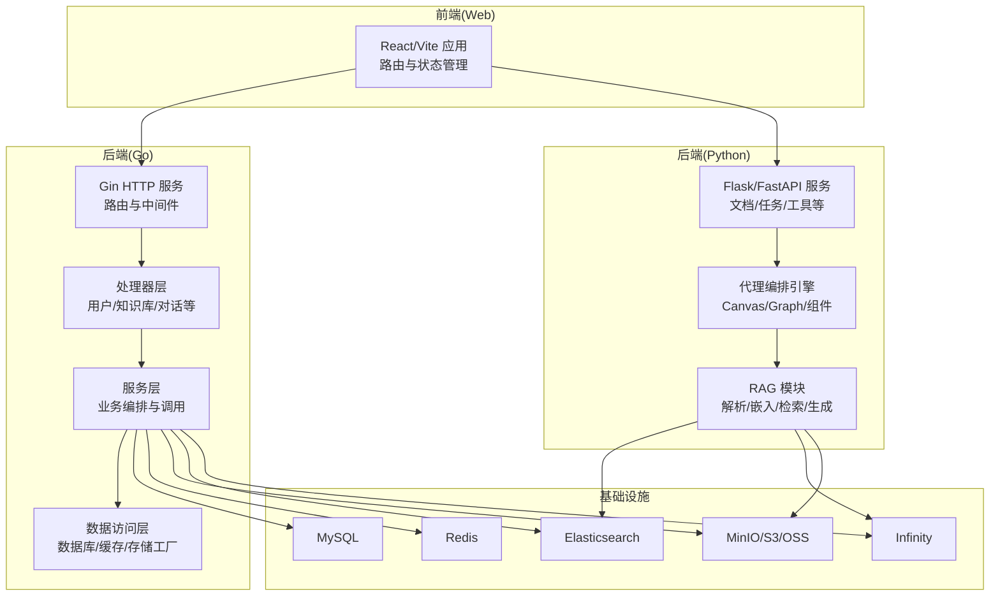
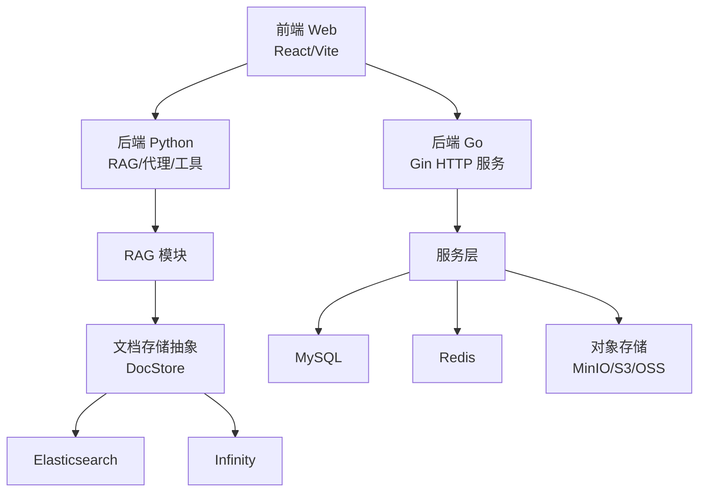
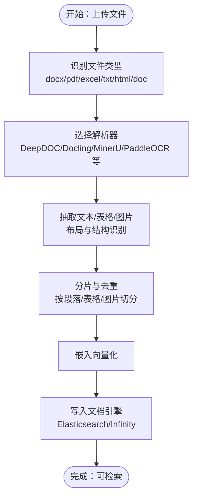
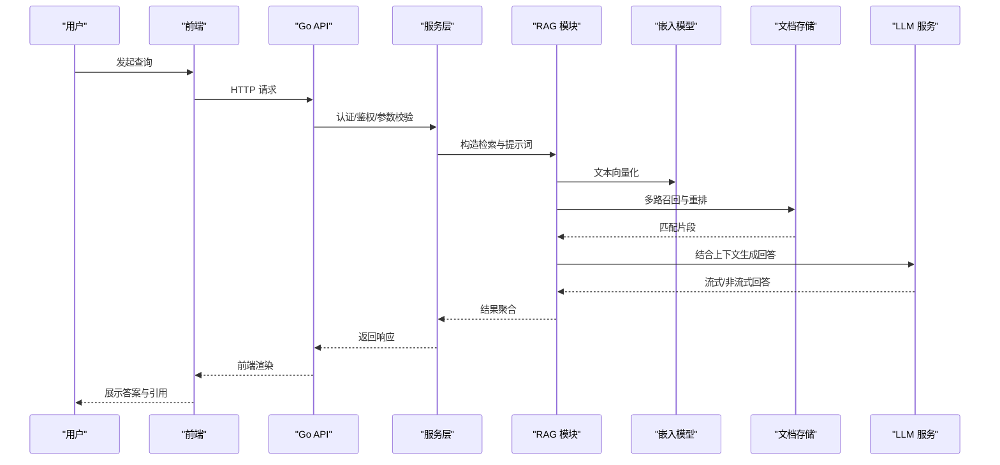
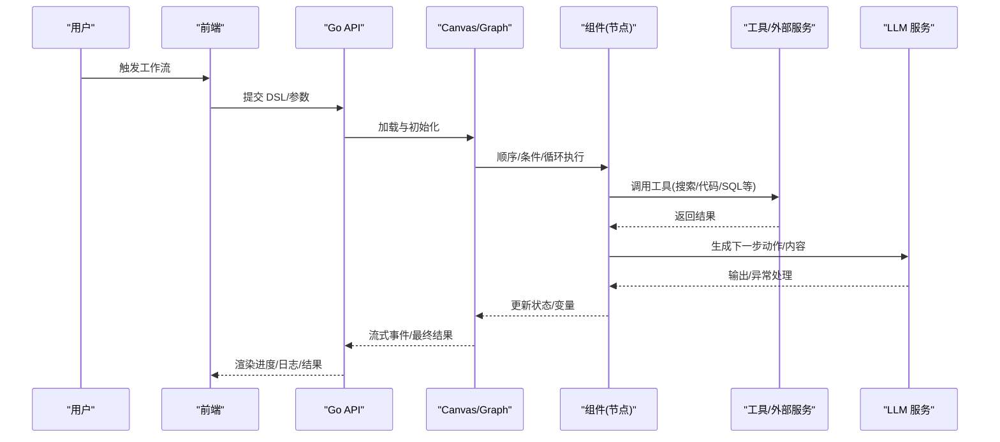
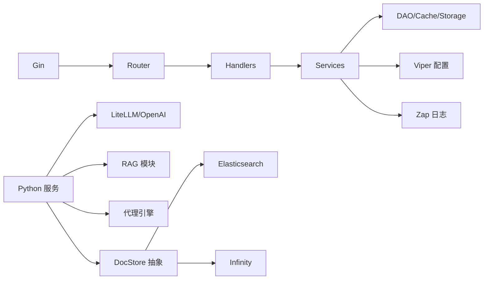

# 核心架构

<cite>
**本文引用的文件**
- [README.md](file://README.md)
- [server_main.go](file://cmd/server_main.go)
- [config.go](file://internal/server/config.go)
- [service_conf.yaml](file://conf/service_conf.yaml)
- [router.go](file://internal/router/router.go)
- [engine.go](file://internal/engine/engine.go)
- [canvas.py](file://agent/canvas.py)
- [one.py](file://rag/app/one.py)
- [chat_model.py](file://rag/llm/chat_model.py)
- [doc_store_base.py](file://common/doc_store/doc_store_base.py)
- [docker-compose.yml](file://docker/docker-compose.yml)
- [ragflow_server.py](file://api/ragflow_server.py)
- [app.tsx](file://web/src/app.tsx)
- [package.json](file://web/package.json)
</cite>

## 目录
1. [引言](#引言)
2. [项目结构](#项目结构)
3. [核心组件](#核心组件)
4. [架构总览](#架构总览)
5. [详细组件分析](#详细组件分析)
6. [依赖分析](#依赖分析)
7. [性能考虑](#性能考虑)
8. [故障排查指南](#故障排查指南)
9. [结论](#结论)
10. [附录](#附录)

## 引言
本文件面向开发者与架构师，系统性阐述 RAGFlow 的高层设计与架构模式。RAGFlow 是一个开源的检索增强生成（RAG）引擎，融合了智能体（Agent）能力与强大的上下文引擎，提供从文档解析、索引、检索、生成到代理执行的全链路能力。本文将从分层架构、微服务模块化、技术栈选型、数据流设计、系统边界与组件交互等方面进行深入解析，并辅以图示帮助理解。

## 项目结构
RAGFlow 采用多语言混合架构：后端主服务由 Go 实现，提供高性能 API 与路由；Python 负责业务逻辑、RAG 模块、代理编排与前端 SDK；前端使用 React/Vite 构建。容器编排通过 Docker Compose 部署，支持 Elasticsearch 或 Infinity 作为文档引擎，MySQL、Redis、MinIO 等作为基础设施。

**图示来源**
- [server_main.go:45-153](file://cmd/server_main.go#L45-L153)
- [router.go:78-258](file://internal/router/router.go#L78-L258)
- [config.go:32-70](file://internal/server/config.go#L32-L70)
- [service_conf.yaml:1-160](file://conf/service_conf.yaml#L1-L160)
- [docker-compose.yml:1-135](file://docker/docker-compose.yml#L1-L135)

**章节来源**
- [README.md:140-144](file://README.md#L140-L144)
- [server_main.go:45-153](file://cmd/server_main.go#L45-L153)
- [router.go:78-258](file://internal/router/router.go#L78-L258)
- [config.go:32-70](file://internal/server/config.go#L32-L70)
- [service_conf.yaml:1-160](file://conf/service_conf.yaml#L1-L160)
- [docker-compose.yml:1-135](file://docker/docker-compose.yml#L1-L135)

## 核心组件
- 前端 UI 层（React/Vite）
  - 提供路由、主题、国际化、状态管理与组件生态，通过 HTTP 接口与后端交互。
  - 参考：[app.tsx:1-178](file://web/src/app.tsx#L1-L178)，[package.json:1-197](file://web/package.json#L1-L197)

- API 接口层（Go Gin）
  - 路由注册、认证中间件、健康检查、版本信息与系统配置接口。
  - 参考：[router.go:78-258](file://internal/router/router.go#L78-L258)，[server_main.go:155-280](file://cmd/server_main.go#L155-L280)

- 业务服务层（Go/Python）
  - Go 层负责用户、知识库、对话、搜索、文件等资源管理与编排。
  - Python 层负责 RAG 解析、嵌入、检索、LLM 调用、代理编排与工具执行。
  - 参考：[config.go:32-70](file://internal/server/config.go#L32-L70)，[ragflow_server.py:74-155](file://api/ragflow_server.py#L74-L155)

- 数据访问层（Go/Python）
  - Go 侧通过 DAO/Service/Cache/Storage 工厂对接 MySQL、Redis、对象存储。
  - Python 侧通过统一的文档存储抽象与向量引擎交互。
  - 参考：[engine.go:39-60](file://internal/engine/engine.go#L39-L60)，[doc_store_base.py:143-271](file://common/doc_store/doc_store_base.py#L143-L271)

**章节来源**
- [app.tsx:1-178](file://web/src/app.tsx#L1-L178)
- [package.json:1-197](file://web/package.json#L1-L197)
- [router.go:78-258](file://internal/router/router.go#L78-L258)
- [server_main.go:155-280](file://cmd/server_main.go#L155-L280)
- [config.go:32-70](file://internal/server/config.go#L32-L70)
- [ragflow_server.py:74-155](file://api/ragflow_server.py#L74-L155)
- [engine.go:39-60](file://internal/engine/engine.go#L39-L60)
- [doc_store_base.py:143-271](file://common/doc_store/doc_store_base.py#L143-L271)

## 架构总览
RAGFlow 采用“前后端分离 + 多语言后端协同”的分层架构：
- 前端通过 HTTP 与后端通信，后端以 Go 为主提供高并发 API，Python 提供深度 RAG 与代理能力。
- 文档引擎可切换为 Elasticsearch 或 Infinity，底层通过统一的 DocStore 抽象屏蔽差异。
- 存储层支持 MinIO/S3/OSS 等对象存储，结合 MySQL 与 Redis 实现元数据与缓存。
- 容器化部署通过 Docker Compose 统一编排，便于开发与生产环境一致性。

**图示来源**
- [docker-compose.yml:1-135](file://docker/docker-compose.yml#L1-L135)
- [engine.go:39-60](file://internal/engine/engine.go#L39-L60)
- [doc_store_base.py:143-271](file://common/doc_store/doc_store_base.py#L143-L271)

**章节来源**
- [docker-compose.yml:1-135](file://docker/docker-compose.yml#L1-L135)
- [engine.go:39-60](file://internal/engine/engine.go#L39-L60)
- [doc_store_base.py:143-271](file://common/doc_store/doc_store_base.py#L143-L271)

## 详细组件分析

### 分层架构与职责划分
- 前端 UI 层
  - 负责页面路由、主题切换、国际化、状态管理与第三方组件集成。
  - 参考：[app.tsx:1-178](file://web/src/app.tsx#L1-L178)

- API 接口层（Go）
  - 初始化配置、数据库、文档引擎、缓存与存储工厂，构建 Gin 路由并挂载处理器。
  - 参考：[server_main.go:45-153](file://cmd/server_main.go#L45-L153)，[router.go:78-258](file://internal/router/router.go#L78-L258)

- 业务服务层（Go/Python）
  - Go 侧：用户、租户、知识库、对话、搜索、文件等资源管理与编排。
  - Python 侧：RAG 解析、嵌入、检索、LLM 调用、代理编排与工具执行。
  - 参考：[config.go:32-70](file://internal/server/config.go#L32-L70)，[ragflow_server.py:74-155](file://api/ragflow_server.py#L74-L155)

- 数据访问层（Go/Python）
  - Go 侧：DAO/Service/Cache/Storage 工厂；Python 侧：DocStore 抽象与向量引擎交互。
  - 参考：[engine.go:39-60](file://internal/engine/engine.go#L39-L60)，[doc_store_base.py:143-271](file://common/doc_store/doc_store_base.py#L143-L271)

**章节来源**
- [app.tsx:1-178](file://web/src/app.tsx#L1-L178)
- [server_main.go:45-153](file://cmd/server_main.go#L45-L153)
- [router.go:78-258](file://internal/router/router.go#L78-L258)
- [config.go:32-70](file://internal/server/config.go#L32-L70)
- [ragflow_server.py:74-155](file://api/ragflow_server.py#L74-L155)
- [engine.go:39-60](file://internal/engine/engine.go#L39-L60)
- [doc_store_base.py:143-271](file://common/doc_store/doc_store_base.py#L143-L271)

### 微服务架构与模块化
- 模块化设计
  - Go 后端按领域拆分为 handler/service/dao 层，接口清晰、职责单一。
  - Python 后端按功能拆分为 RAG、代理、工具、存储等子模块，便于扩展与替换。
- 接口解耦
  - 通过统一的 DocStore 抽象屏蔽 Elasticsearch/Infinity 差异。
  - 通过配置中心与环境变量实现运行时可插拔的存储与模型提供商。
- 事件驱动
  - 使用 Redis 作为消息队列与分布式锁，支撑任务调度与心跳上报。
  - 参考：[config.go:32-70](file://internal/server/config.go#L32-L70)，[service_conf.yaml:1-160](file://conf/service_conf.yaml#L1-L160)

**章节来源**
- [config.go:32-70](file://internal/server/config.go#L32-L70)
- [service_conf.yaml:1-160](file://conf/service_conf.yaml#L1-L160)

### 技术栈选型决策
- Go 语言
  - 高并发、低延迟、强类型与简洁语法适合构建高性能 API 服务与路由层。
  - 参考：[server_main.go:45-153](file://cmd/server_main.go#L45-L153)，[router.go:78-258](file://internal/router/router.go#L78-L258)
- Python
  - 生态丰富、易扩展，适合 RAG 解析、嵌入、检索与代理编排。
  - 参考：[ragflow_server.py:74-155](file://api/ragflow_server.py#L74-L155)，[canvas.py:1-800](file://agent/canvas.py#L1-L800)
- React/Vite
  - 现代前端开发体验、组件化与生态完善，适配多语言与主题切换。
  - 参考：[app.tsx:1-178](file://web/src/app.tsx#L1-L178)，[package.json:1-197](file://web/package.json#L1-L197)
- 文档引擎
  - Elasticsearch 默认提供全文与向量检索；Infinity 提供替代方案，支持 Postgres 协议。
  - 参考：[engine.go:39-60](file://internal/engine/engine.go#L39-L60)，[service_conf.yaml:22-33](file://conf/service_conf.yaml#L22-L33)
- 存储
  - MinIO/S3/OSS 对象存储统一抽象，结合 MySQL 与 Redis 实现元数据与缓存。
  - 参考：[doc_store_base.py:143-271](file://common/doc_store/doc_store_base.py#L143-L271)，[service_conf.yaml:16-48](file://conf/service_conf.yaml#L16-L48)

**章节来源**
- [server_main.go:45-153](file://cmd/server_main.go#L45-L153)
- [router.go:78-258](file://internal/router/router.go#L78-L258)
- [ragflow_server.py:74-155](file://api/ragflow_server.py#L74-L155)
- [canvas.py:1-800](file://agent/canvas.py#L1-L800)
- [app.tsx:1-178](file://web/src/app.tsx#L1-L178)
- [package.json:1-197](file://web/package.json#L1-L197)
- [engine.go:39-60](file://internal/engine/engine.go#L39-L60)
- [service_conf.yaml:22-33](file://conf/service_conf.yaml#L22-L33)
- [service_conf.yaml:16-48](file://conf/service_conf.yaml#L16-L48)
- [doc_store_base.py:143-271](file://common/doc_store/doc_store_base.py#L143-L271)

### 数据流设计

#### 文档处理流程

**图示来源**
- [one.py:58-166](file://rag/app/one.py#L58-L166)

**章节来源**
- [one.py:58-166](file://rag/app/one.py#L58-L166)

#### RAG 查询流程

**图示来源**
- [chat_model.py:189-298](file://rag/llm/chat_model.py#L189-L298)
- [engine.go:39-60](file://internal/engine/engine.go#L39-L60)

**章节来源**
- [chat_model.py:189-298](file://rag/llm/chat_model.py#L189-L298)
- [engine.go:39-60](file://internal/engine/engine.go#L39-L60)

#### 代理执行流程（Agent）

**图示来源**
- [canvas.py:148-668](file://agent/canvas.py#L148-L668)

**章节来源**
- [canvas.py:148-668](file://agent/canvas.py#L148-L668)

### 系统边界与组件交互
- 边界
  - 前端与后端通过 HTTP 接口交互；Go 与 Python 通过进程内或进程间通信协作。
  - 文档引擎与对象存储作为独立外部系统，通过统一抽象接入。
- 关键交互
  - 配置中心：Go 通过 viper 读取 YAML/环境变量；Python 通过 settings 与配置文件。
  - 缓存与队列：Redis 用于会话、锁与任务调度。
  - 存储：MySQL 存放元数据，MinIO/S3/OSS 存放原始文件与中间产物。
  - 参考：[config.go:453-703](file://internal/server/config.go#L453-L703)，[service_conf.yaml:1-160](file://conf/service_conf.yaml#L1-L160)

**章节来源**
- [config.go:453-703](file://internal/server/config.go#L453-L703)
- [service_conf.yaml:1-160](file://conf/service_conf.yaml#L1-L160)

## 依赖分析
- Go 后端依赖
  - Gin：HTTP 路由与中间件
  - Viper：配置加载与环境变量映射
  - Zap：日志
  - 自定义 DAO/Service/Cache/Storage 工厂
- Python 后端依赖
  - Flask/FastAPI：服务启动与路由
  - LiteLLM/OpenAI：LLM 调用与工具调用
  - asyncio：异步执行与流式输出
  - 自定义 RAG/代理/存储模块
- 前端依赖
  - React Query：数据获取与缓存
  - Ant Design：UI 组件库
  - i18n：国际化
  - 参考：[package.json:1-197](file://web/package.json#L1-L197)

**图示来源**
- [server_main.go:155-280](file://cmd/server_main.go#L155-L280)
- [router.go:78-258](file://internal/router/router.go#L78-L258)
- [config.go:453-703](file://internal/server/config.go#L453-L703)
- [package.json:1-197](file://web/package.json#L1-L197)

**章节来源**
- [server_main.go:155-280](file://cmd/server_main.go#L155-L280)
- [router.go:78-258](file://internal/router/router.go#L78-L258)
- [config.go:453-703](file://internal/server/config.go#L453-L703)
- [package.json:1-197](file://web/package.json#L1-L197)

## 性能考虑
- 并发与吞吐
  - Go Gin 服务在高并发场景下具备良好表现；建议合理设置端口与模式（release/debug）。
  - Python 侧使用线程池与异步协程处理 I/O 密集任务，避免阻塞。
- 缓存与索引
  - Redis 用于热点数据与分布式锁；MySQL 用于持久化元数据。
  - 文档引擎支持向量检索与多路召回，结合重排提升检索质量。
- 存储与网络
  - 对象存储采用 MinIO/S3/OSS，建议根据地域与带宽优化访问路径。
- 部署与扩缩容
  - Docker Compose 支持 CPU/GPU 两种镜像；可通过环境变量与配置文件调整资源与端口。

[本节为通用指导，不直接分析具体文件]

## 故障排查指南
- 启动与健康检查
  - Go 服务启动后打印版本与端口信息；可通过 /health 与 /v1/system/ping 检查健康。
  - 参考：[server_main.go:218-231](file://cmd/server_main.go#L218-L231)，[router.go:80-85](file://internal/router/router.go#L80-L85)
- 配置问题
  - 检查 service_conf.yaml 与环境变量映射是否正确；确认文档引擎、存储与数据库连接参数。
  - 参考：[config.go:453-703](file://internal/server/config.go#L453-L703)，[service_conf.yaml:1-160](file://conf/service_conf.yaml#L1-L160)
- 文档引擎切换
  - 切换 Elasticsearch 与 Infinity 需重启容器并清理卷（注意数据丢失风险）。
  - 参考：[README.md:276-298](file://README.md#L276-L298)，[docker-compose.yml:1-135](file://docker/docker-compose.yml#L1-L135)
- LLM 与工具调用
  - 检查 API Key、超时与重试策略；关注流式输出与错误码分类。
  - 参考：[chat_model.py:38-50](file://rag/llm/chat_model.py#L38-L50)，[chat_model.py:129-151](file://rag/llm/chat_model.py#L129-L151)

**章节来源**
- [server_main.go:218-231](file://cmd/server_main.go#L218-L231)
- [router.go:80-85](file://internal/router/router.go#L80-L85)
- [config.go:453-703](file://internal/server/config.go#L453-L703)
- [service_conf.yaml:1-160](file://conf/service_conf.yaml#L1-L160)
- [README.md:276-298](file://README.md#L276-L298)
- [docker-compose.yml:1-135](file://docker/docker-compose.yml#L1-L135)
- [chat_model.py:38-50](file://rag/llm/chat_model.py#L38-L50)
- [chat_model.py:129-151](file://rag/llm/chat_model.py#L129-L151)

## 结论
RAGFlow 通过“前后端分离 + 多语言后端协同”的架构，实现了高性能 API 与深度 RAG 能力的有机结合。其分层清晰、模块化程度高、接口解耦良好，并通过统一的文档存储抽象与配置中心实现灵活部署与可插拔扩展。结合容器化与现代化前端技术栈，RAGFlow 能够满足从个人到企业级的多样化需求。

[本节为总结性内容，不直接分析具体文件]

## 附录
- 快速启动与配置参考
  - Docker Compose 启动、端口映射与环境变量配置。
  - 参考：[README.md:159-254](file://README.md#L159-L254)，[docker-compose.yml:1-135](file://docker/docker-compose.yml#L1-L135)
- 文档引擎切换
  - 从 Elasticsearch 切换到 Infinity 的步骤与注意事项。
  - 参考：[README.md:276-298](file://README.md#L276-L298)

**章节来源**
- [README.md:159-254](file://README.md#L159-L254)
- [docker-compose.yml:1-135](file://docker/docker-compose.yml#L1-L135)
- [README.md:276-298](file://README.md#L276-L298)