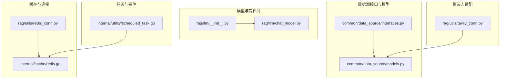
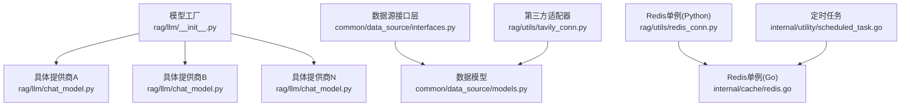
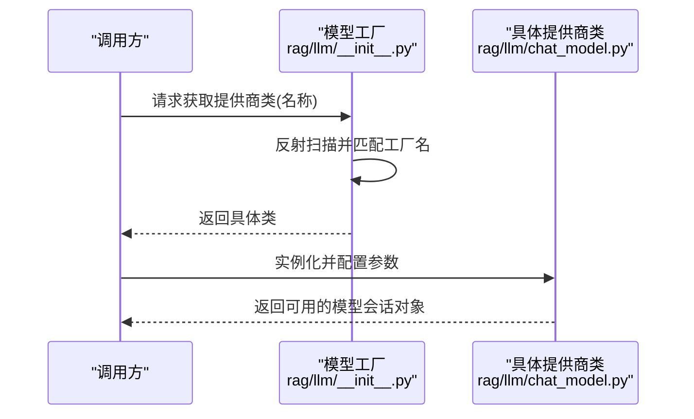
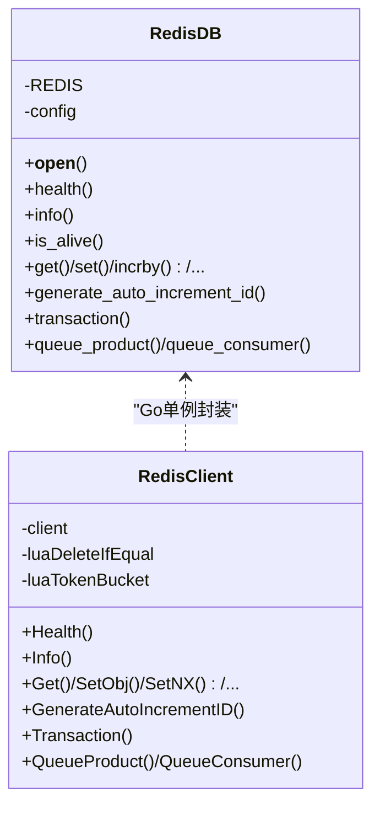
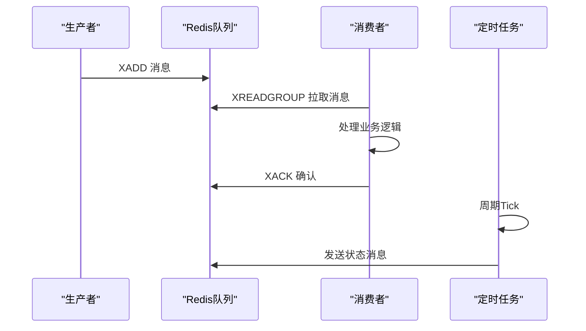
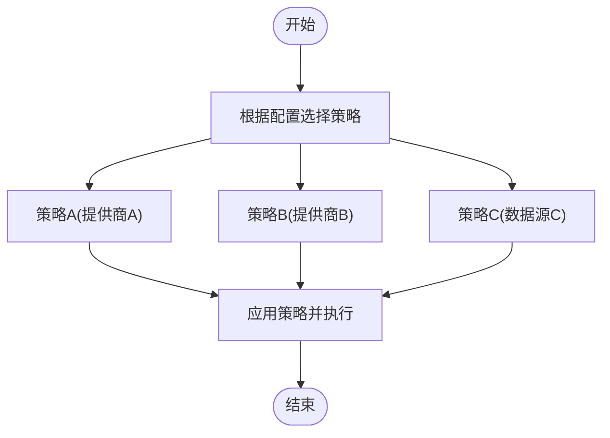
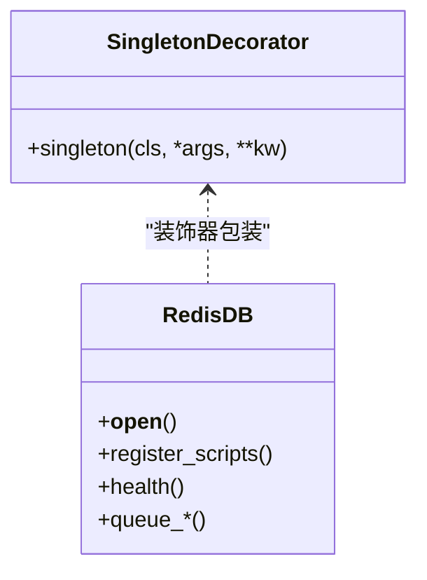
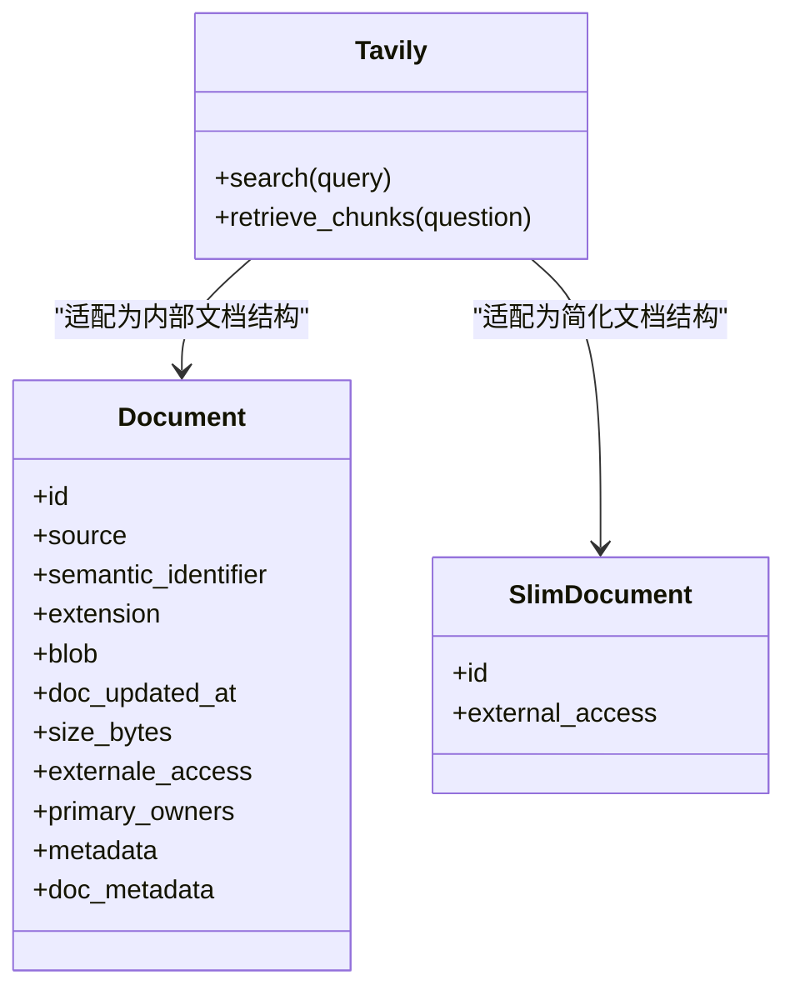
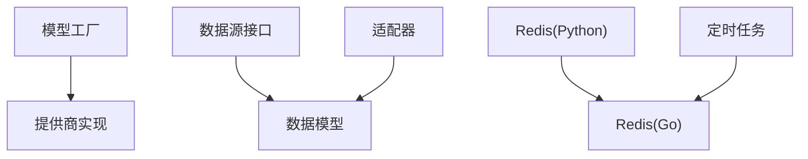

# 设计模式应用

<cite>
**本文引用的文件**   
- [rag/llm/__init__.py](file://rag/llm/__init__.py)
- [rag/llm/chat_model.py](file://rag/llm/chat_model.py)
- [common/decorator.py](file://common/decorator.py)
- [rag/utils/redis_conn.py](file://rag/utils/redis_conn.py)
- [internal/cache/redis.go](file://internal/cache/redis.go)
- [common/data_source/interfaces.py](file://common/data_source/interfaces.py)
- [common/data_source/models.py](file://common/data_source/models.py)
- [internal/utility/scheduled_task.go](file://internal/utility/scheduled_task.go)
- [rag/utils/tavily_conn.py](file://rag/utils/tavily_conn.py)
</cite>

## 目录
1. [引言](#引言)
2. [项目结构](#项目结构)
3. [核心组件](#核心组件)
4. [架构总览](#架构总览)
5. [详细组件分析](#详细组件分析)
6. [依赖分析](#依赖分析)
7. [性能考虑](#性能考虑)
8. [故障排查指南](#故障排查指南)
9. [结论](#结论)
10. [附录](#附录)

## 引言
本文件聚焦于RAGFlow在“模型提供商与数据源连接器”中的设计模式实践，系统梳理并解析以下模式在代码中的落地方式与使用场景：
- 工厂模式（含抽象工厂思想）：用于统一创建不同模型提供商与数据源连接器实例
- 单例模式：用于Redis连接等全局资源的唯一性管理
- 观察者模式：通过事件驱动与任务调度体现的松耦合通知机制
- 策略模式：在多数据源处理与模型提供商切换中的可替换策略
- 装饰器模式：中间件与拦截器的横切关注点封装
- 适配器模式：对第三方服务（如Tavily）的接口适配

## 项目结构
围绕设计模式的应用，相关模块主要分布在如下路径：
- 模型与提供商：rag/llm/*（工厂映射、具体提供商类）
- 数据源接口与模型：common/data_source/*（抽象接口、数据模型）
- 缓存与连接：internal/cache/redis.go、rag/utils/redis_conn.py（单例连接）
- 任务与事件：internal/utility/scheduled_task.go（定时任务与状态广播）
- 第三方适配：rag/utils/tavily_conn.py（外部服务适配）

**图表来源**
- [rag/llm/__init__.py:151-181](file://rag/llm/__init__.py#L151-L181)
- [rag/llm/chat_model.py:597-625](file://rag/llm/chat_model.py#L597-L625)
- [common/data_source/interfaces.py:21-103](file://common/data_source/interfaces.py#L21-L103)
- [common/data_source/models.py:89-156](file://common/data_source/models.py#L89-L156)
- [rag/utils/redis_conn.py:60-145](file://rag/utils/redis_conn.py#L60-L145)
- [internal/cache/redis.go:107-145](file://internal/cache/redis.go#L107-L145)
- [internal/utility/scheduled_task.go:79-151](file://internal/utility/scheduled_task.go#L79-L151)
- [rag/utils/tavily_conn.py:22-70](file://rag/utils/tavily_conn.py#L22-L70)

**章节来源**
- [rag/llm/__init__.py:151-181](file://rag/llm/__init__.py#L151-L181)
- [rag/llm/chat_model.py:597-625](file://rag/llm/chat_model.py#L597-L625)
- [common/data_source/interfaces.py:21-103](file://common/data_source/interfaces.py#L21-L103)
- [common/data_source/models.py:89-156](file://common/data_source/models.py#L89-L156)
- [rag/utils/redis_conn.py:60-145](file://rag/utils/redis_conn.py#L60-L145)
- [internal/cache/redis.go:107-145](file://internal/cache/redis.go#L107-L145)
- [internal/utility/scheduled_task.go:79-151](file://internal/utility/scheduled_task.go#L79-L151)
- [rag/utils/tavily_conn.py:22-70](file://rag/utils/tavily_conn.py#L22-L70)

## 核心组件
- 模型工厂与映射：通过包内动态导入与反射，构建“提供商名称 -> 具体类”的映射表，支持后续按名称选择具体实现
- 提供商具体实现：每个提供商以独立类实现统一接口约定（如工厂名标识），便于扩展与替换
- 数据源接口层：定义加载、轮询、凭证、权限同步等抽象接口，屏蔽具体实现差异
- Redis连接：Python侧采用单例装饰器包装；Go侧采用全局客户端+Once初始化，保证唯一性
- 定时任务：基于时间轮的周期任务，内置并发安全与异常恢复
- 第三方适配：对外部检索服务进行统一封装，输出内部标准数据结构

**章节来源**
- [rag/llm/__init__.py:151-181](file://rag/llm/__init__.py#L151-L181)
- [rag/llm/chat_model.py:597-625](file://rag/llm/chat_model.py#L597-L625)
- [common/data_source/interfaces.py:21-103](file://common/data_source/interfaces.py#L21-L103)
- [rag/utils/redis_conn.py:60-145](file://rag/utils/redis_conn.py#L60-L145)
- [internal/cache/redis.go:107-145](file://internal/cache/redis.go#L107-L145)
- [internal/utility/scheduled_task.go:79-151](file://internal/utility/scheduled_task.go#L79-L151)
- [rag/utils/tavily_conn.py:22-70](file://rag/utils/tavily_conn.py#L22-L70)

## 架构总览
下图展示“模型提供商工厂”“数据源连接器接口层”“Redis连接单例”“定时任务”“第三方适配器”的交互关系。

**图表来源**
- [rag/llm/__init__.py:151-181](file://rag/llm/__init__.py#L151-L181)
- [rag/llm/chat_model.py:597-625](file://rag/llm/chat_model.py#L597-L625)
- [common/data_source/interfaces.py:21-103](file://common/data_source/interfaces.py#L21-L103)
- [common/data_source/models.py:89-156](file://common/data_source/models.py#L89-L156)
- [rag/utils/redis_conn.py:60-145](file://rag/utils/redis_conn.py#L60-L145)
- [internal/cache/redis.go:107-145](file://internal/cache/redis.go#L107-L145)
- [internal/utility/scheduled_task.go:79-151](file://internal/utility/scheduled_task.go#L79-L151)
- [rag/utils/tavily_conn.py:22-70](file://rag/utils/tavily_conn.py#L22-L70)

## 详细组件分析

### 工厂模式：模型提供商与数据源连接器
- 抽象工厂思想：通过“工厂映射字典”统一收集与注册具体实现，调用方仅需提供名称即可获取对应类
- 具体工厂实现：
  - 模型提供商工厂：在包初始化阶段扫描子模块，收集标注了工厂名的类，建立名称到类的映射
  - 数据源连接器：接口层定义统一抽象，具体连接器实现遵循相同契约，便于替换与扩展
- 使用场景：
  - 动态选择不同提供商（如本地推理、HuggingFace、ModelScope等）
  - 在不修改上层调用逻辑的前提下，新增或替换提供商实现

**图表来源**
- [rag/llm/__init__.py:151-181](file://rag/llm/__init__.py#L151-L181)
- [rag/llm/chat_model.py:597-625](file://rag/llm/chat_model.py#L597-L625)

**章节来源**
- [rag/llm/__init__.py:151-181](file://rag/llm/__init__.py#L151-L181)
- [rag/llm/chat_model.py:597-625](file://rag/llm/chat_model.py#L597-L625)
- [common/data_source/interfaces.py:21-103](file://common/data_source/interfaces.py#L21-L103)

### 单例模式：Redis连接
- Python侧：通过装饰器实现进程内单例，确保全局仅有一个RedisDB实例
- Go侧：采用全局客户端+Once初始化，避免重复初始化并保证健康检查与方法可用
- 使用场景：
  - 统一管理连接池、脚本注册、分布式锁与队列操作
  - 避免多实例导致的资源浪费与状态不一致

**图表来源**
- [rag/utils/redis_conn.py:60-145](file://rag/utils/redis_conn.py#L60-L145)
- [internal/cache/redis.go:107-145](file://internal/cache/redis.go#L107-L145)

**章节来源**
- [common/decorator.py:18-27](file://common/decorator.py#L18-L27)
- [rag/utils/redis_conn.py:60-145](file://rag/utils/redis_conn.py#L60-L145)
- [internal/cache/redis.go:107-145](file://internal/cache/redis.go#L107-L145)

### 观察者模式：事件驱动与任务执行
- 事件驱动：通过Redis流式队列实现生产/消费模型，消息到达即触发处理流程
- 任务执行：定时任务周期性执行，内部采用原子标志防止重入，捕获panic并记录日志
- 使用场景：
  - 周期性健康上报、状态广播
  - 基于消息的异步处理链路

**图表来源**
- [internal/utility/scheduled_task.go:79-151](file://internal/utility/scheduled_task.go#L79-L151)
- [rag/utils/redis_conn.py:386-444](file://rag/utils/redis_conn.py#L386-L444)
- [internal/cache/redis.go:631-726](file://internal/cache/redis.go#L631-L726)

**章节来源**
- [internal/utility/scheduled_task.go:79-151](file://internal/utility/scheduled_task.go#L79-L151)
- [rag/utils/redis_conn.py:386-444](file://rag/utils/redis_conn.py#L386-L444)
- [internal/cache/redis.go:631-726](file://internal/cache/redis.go#L631-L726)

### 策略模式：多数据源处理与模型提供商切换
- 策略选择：通过工厂映射与配置决定使用哪个提供商或数据源策略
- 可替换性：新增策略只需实现统一接口或遵循约定的工厂名标识
- 使用场景：
  - 不同提供商的参数清洗、错误分类、重试策略
  - 数据源轮询与断点续传策略

[此图为概念流程图，无需图表来源]

**章节来源**
- [rag/llm/__init__.py:151-181](file://rag/llm/__init__.py#L151-L181)
- [rag/llm/chat_model.py:597-625](file://rag/llm/chat_model.py#L597-L625)
- [common/data_source/interfaces.py:21-103](file://common/data_source/interfaces.py#L21-L103)

### 装饰器模式：中间件与拦截器
- 横切关注点：通过装饰器实现统一的连接管理、健康检查、脚本注册等
- 应用位置：Redis连接封装、HTTP客户端中间件（在其他模块中常见）
- 使用场景：
  - 为不同连接器提供一致的生命周期管理与异常处理

**图表来源**
- [common/decorator.py:18-27](file://common/decorator.py#L18-L27)
- [rag/utils/redis_conn.py:60-145](file://rag/utils/redis_conn.py#L60-L145)

**章节来源**
- [common/decorator.py:18-27](file://common/decorator.py#L18-L27)
- [rag/utils/redis_conn.py:60-145](file://rag/utils/redis_conn.py#L60-L145)

### 适配器模式：第三方服务集成
- 适配目标：将外部检索服务（如Tavily）的响应转换为内部统一的数据结构
- 输出规范：统一字段（标题、URL、内容、相似度等），便于后续检索与聚合
- 使用场景：
  - 快速接入新检索源，保持上层调用一致性

**图表来源**
- [rag/utils/tavily_conn.py:22-70](file://rag/utils/tavily_conn.py#L22-L70)
- [common/data_source/models.py:89-156](file://common/data_source/models.py#L89-L156)

**章节来源**
- [rag/utils/tavily_conn.py:22-70](file://rag/utils/tavily_conn.py#L22-L70)
- [common/data_source/models.py:89-156](file://common/data_source/models.py#L89-L156)

## 依赖分析
- 模型工厂依赖：通过运行时反射收集具体提供商类，降低编译期耦合
- 数据源接口依赖：所有连接器实现统一接口，便于替换与测试替身
- Redis依赖：Python与Go双栈单例，分别服务于不同运行环境
- 任务依赖：定时任务依赖Redis进行状态广播与消息处理
- 适配器依赖：第三方SDK与内部数据模型之间的转换

**图表来源**
- [rag/llm/__init__.py:151-181](file://rag/llm/__init__.py#L151-L181)
- [rag/llm/chat_model.py:597-625](file://rag/llm/chat_model.py#L597-L625)
- [common/data_source/interfaces.py:21-103](file://common/data_source/interfaces.py#L21-L103)
- [common/data_source/models.py:89-156](file://common/data_source/models.py#L89-L156)
- [rag/utils/redis_conn.py:60-145](file://rag/utils/redis_conn.py#L60-L145)
- [internal/cache/redis.go:107-145](file://internal/cache/redis.go#L107-L145)
- [internal/utility/scheduled_task.go:79-151](file://internal/utility/scheduled_task.go#L79-L151)
- [rag/utils/tavily_conn.py:22-70](file://rag/utils/tavily_conn.py#L22-L70)

**章节来源**
- [rag/llm/__init__.py:151-181](file://rag/llm/__init__.py#L151-L181)
- [rag/llm/chat_model.py:597-625](file://rag/llm/chat_model.py#L597-L625)
- [common/data_source/interfaces.py:21-103](file://common/data_source/interfaces.py#L21-L103)
- [common/data_source/models.py:89-156](file://common/data_source/models.py#L89-L156)
- [rag/utils/redis_conn.py:60-145](file://rag/utils/redis_conn.py#L60-L145)
- [internal/cache/redis.go:107-145](file://internal/cache/redis.go#L107-L145)
- [internal/utility/scheduled_task.go:79-151](file://internal/utility/scheduled_task.go#L79-L151)
- [rag/utils/tavily_conn.py:22-70](file://rag/utils/tavily_conn.py#L22-L70)

## 性能考虑
- 工厂映射：运行时扫描与反射带来一定开销，建议在启动阶段完成初始化并缓存结果
- Redis单例：统一连接与脚本注册减少连接数与网络往返；注意批量操作与管道使用
- 定时任务：原子标志避免重入，panic恢复保障稳定性；合理设置间隔与超时
- 适配器：外部调用存在网络延迟，建议结合重试与超时控制

[本节为通用指导，无需章节来源]

## 故障排查指南
- Redis连接失败
  - 检查连接参数与认证信息
  - 观察健康检查与脚本注册是否成功
  - 查看异常日志与重连逻辑
- 定时任务未执行
  - 确认任务已Start且未被Stop
  - 检查原子执行标志与panic恢复日志
- 第三方适配器异常
  - 校验API密钥与请求参数
  - 关注异常捕获与返回空列表的兜底逻辑

**章节来源**
- [rag/utils/redis_conn.py:147-154](file://rag/utils/redis_conn.py#L147-L154)
- [internal/cache/redis.go:165-186](file://internal/cache/redis.go#L165-L186)
- [internal/utility/scheduled_task.go:124-142](file://internal/utility/scheduled_task.go#L124-L142)
- [rag/utils/tavily_conn.py:35-38](file://rag/utils/tavily_conn.py#L35-L38)

## 结论
RAGFlow在模型提供商与数据源连接器中广泛运用了工厂、单例、观察者、策略、装饰器与适配器等设计模式：
- 工厂与策略使系统具备良好的可扩展性与可替换性
- 单例确保关键资源的稳定与高效
- 观察者与定时任务支撑事件驱动与异步处理
- 装饰器与适配器提升横切关注点的复用与第三方集成能力

这些模式协同工作，既满足了快速迭代的需求，也保证了系统的稳定性与可维护性。

[本节为总结，无需章节来源]

## 附录
- 关键实现路径参考
  - 模型工厂映射与反射：[rag/llm/__init__.py:151-181](file://rag/llm/__init__.py#L151-L181)
  - 具体提供商类（示例）：[rag/llm/chat_model.py:597-625](file://rag/llm/chat_model.py#L597-L625)
  - 数据源接口与模型：[common/data_source/interfaces.py:21-103](file://common/data_source/interfaces.py#L21-L103)、[common/data_source/models.py:89-156](file://common/data_source/models.py#L89-L156)
  - Redis单例（Python/Go）：[rag/utils/redis_conn.py:60-145](file://rag/utils/redis_conn.py#L60-L145)、[internal/cache/redis.go:107-145](file://internal/cache/redis.go#L107-L145)
  - 定时任务：[internal/utility/scheduled_task.go:79-151](file://internal/utility/scheduled_task.go#L79-L151)
  - 第三方适配器：[rag/utils/tavily_conn.py:22-70](file://rag/utils/tavily_conn.py#L22-L70)

[本节为补充说明，无需章节来源]