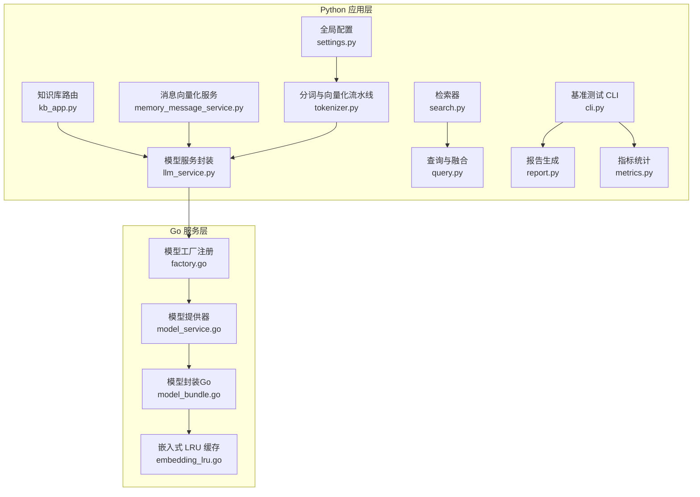
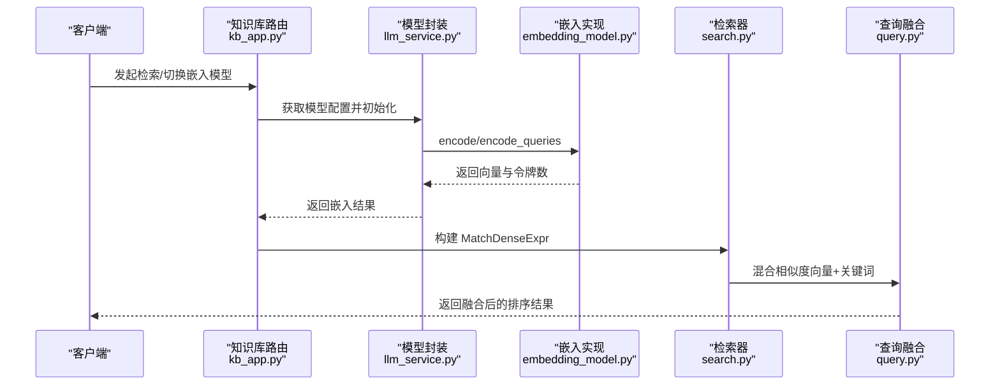
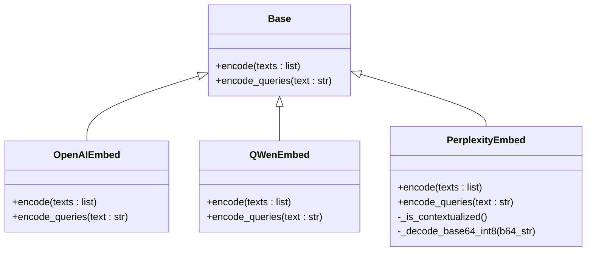
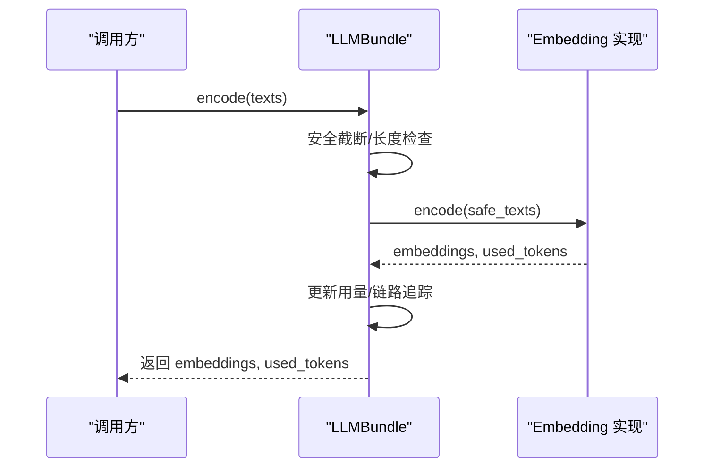
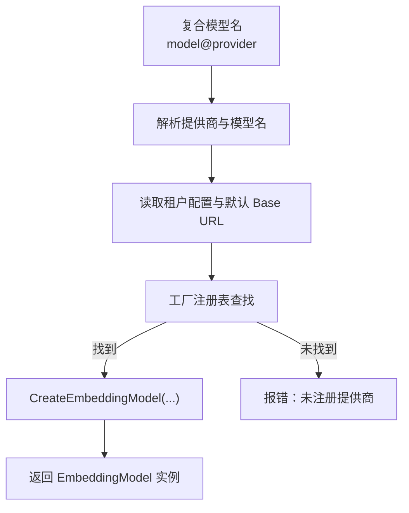
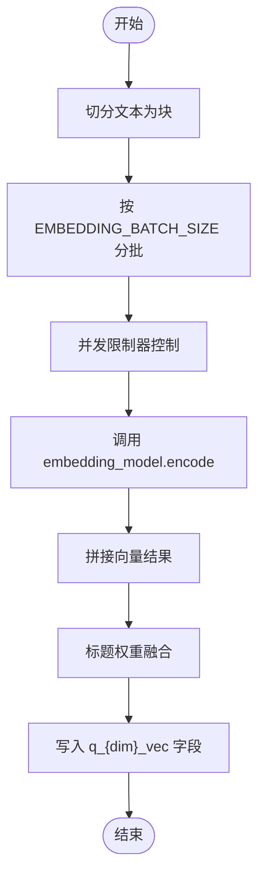
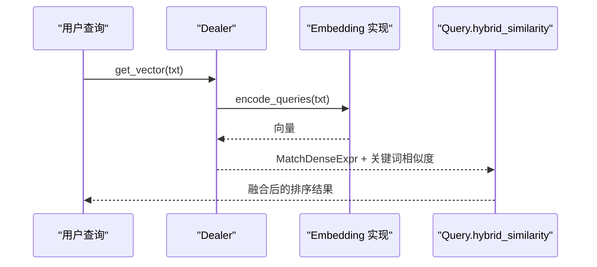
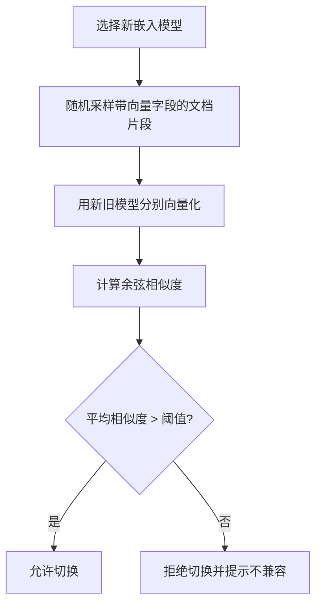
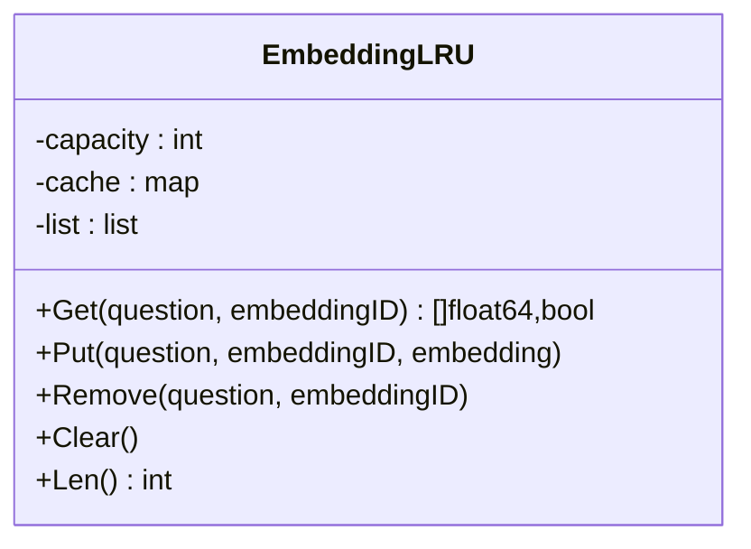
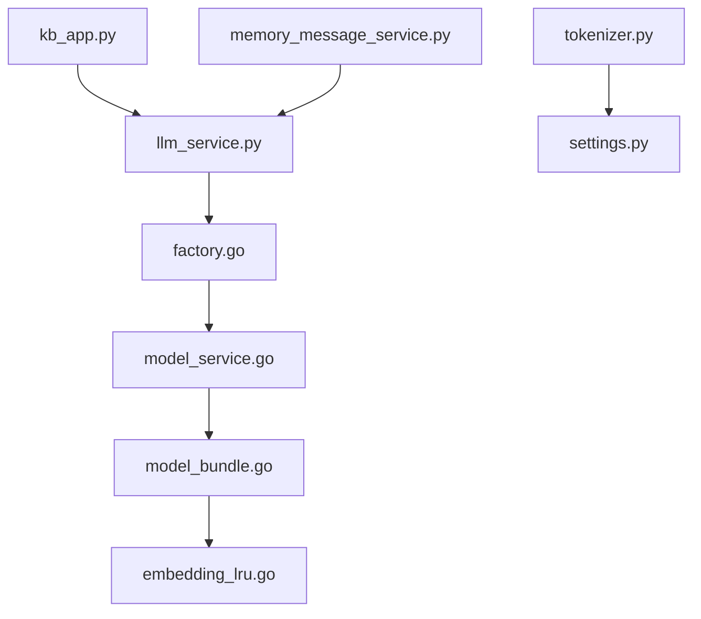

# 嵌入模型管理

<cite>
**本文引用的文件**
- [embedding_model.py](file://rag/llm/embedding_model.py)
- [llm_service.py](file://api/db/services/llm_service.py)
- [kb_app.py](file://api/apps/kb_app.py)
- [memory_message_service.py](file://api/db/joint_services/memory_message_service.py)
- [tokenizer.py](file://rag/flow/tokenizer/tokenizer.py)
- [settings.py](file://common/settings.py)
- [embedding_lru.go](file://internal/utility/embedding_lru.go)
- [factory.go](file://internal/service/models/factory.go)
- [model_service.go](file://internal/service/model_service.go)
- [model_bundle.go](file://internal/service/model_bundle.go)
- [validation_utils.py](file://api/utils/validation_utils.py)
- [api_utils.py](file://api/utils/api_utils.py)
- [search.py](file://rag/nlp/search.py)
- [query.py](file://rag/nlp/query.py)
- [cli.py](file://test/benchmark/cli.py)
- [report.py](file://test/benchmark/report.py)
- [metrics.py](file://test/benchmark/metrics.py)
</cite>

## 目录
1. [简介](#简介)
2. [项目结构](#项目结构)
3. [核心组件](#核心组件)
4. [架构总览](#架构总览)
5. [详细组件分析](#详细组件分析)
6. [依赖分析](#依赖分析)
7. [性能考量](#性能考量)
8. [故障排查指南](#故障排查指南)
9. [结论](#结论)
10. [附录](#附录)

## 简介
本技术文档围绕 RAGFlow 中嵌入模型（Embedding）的管理与使用展开，系统阐述嵌入模型在向量化、语义表示、相似度计算中的作用原理；详细说明模型注册与配置流程（含模型类型识别、维度设置、批处理）、性能监控机制（延迟统计、吞吐量测量、资源使用）、优化策略（缓存、批处理、内存管理），并给出模型选择、参数配置、性能监控与版本管理、回滚与兼容性处理等实践建议，帮助开发者高效构建语义检索与相似度匹配系统。

## 项目结构
RAGFlow 的嵌入模型管理横跨 Python 与 Go 双栈：Python 层负责业务编排、模型封装与调用；Go 层负责模型工厂注册、统一模型提供器与底层模型实例化；同时配合通用设置、工具模块与检索查询模块完成端到端的向量化与相似度检索。

图示来源
- [kb_app.py:851-1012](file://api/apps/kb_app.py#L851-L1012)
- [llm_service.py:85-138](file://api/db/services/llm_service.py#L85-L138)
- [memory_message_service.py:175-195](file://api/db/joint_services/memory_message_service.py#L175-L195)
- [tokenizer.py:81-106](file://rag/flow/tokenizer/tokenizer.py#L81-L106)
- [search.py:52-60](file://rag/nlp/search.py#L52-L60)
- [query.py:174-182](file://rag/nlp/query.py#L174-L182)
- [settings.py:125-125](file://common/settings.py#L125-L125)
- [factory.go:26-58](file://internal/service/models/factory.go#L26-L58)
- [model_service.go:68-95](file://internal/service/model_service.go#L68-L95)
- [model_bundle.go:26-101](file://internal/service/model_bundle.go#L26-L101)
- [embedding_lru.go:24-141](file://internal/utility/embedding_lru.go#L24-L141)
- [cli.py:407-449](file://test/benchmark/cli.py#L407-L449)
- [report.py:32-70](file://test/benchmark/report.py#L32-L70)
- [metrics.py:1-67](file://test/benchmark/metrics.py#L1-L67)

章节来源
- [kb_app.py:851-1012](file://api/apps/kb_app.py#L851-L1012)
- [llm_service.py:85-138](file://api/db/services/llm_service.py#L85-L138)
- [memory_message_service.py:175-195](file://api/db/joint_services/memory_message_service.py#L175-L195)
- [tokenizer.py:81-106](file://rag/flow/tokenizer/tokenizer.py#L81-L106)
- [search.py:52-60](file://rag/nlp/search.py#L52-L60)
- [query.py:174-182](file://rag/nlp/query.py#L174-L182)
- [settings.py:125-125](file://common/settings.py#L125-L125)
- [factory.go:26-58](file://internal/service/models/factory.go#L26-L58)
- [model_service.go:68-95](file://internal/service/model_service.go#L68-L95)
- [model_bundle.go:26-101](file://internal/service/model_bundle.go#L26-L101)
- [embedding_lru.go:24-141](file://internal/utility/embedding_lru.go#L24-L141)
- [cli.py:407-449](file://test/benchmark/cli.py#L407-L449)
- [report.py:32-70](file://test/benchmark/report.py#L32-L70)
- [metrics.py:1-67](file://test/benchmark/metrics.py#L1-L67)

## 核心组件
- 嵌入模型实现层（Python）
  - 多厂商适配：OpenAI、Azure-OpenAI、Qwen/Tongyi、Zhipu、Ollama、Gemini、NVIDIA、Perplexity、Bedrock、HuggingFace、VolcEngine 等。
  - 统一接口：Base 抽象类定义 encode/encode_queries，各厂商实现遵循统一签名。
  - 批处理与格式：内置批大小控制、编码格式（如 base64_int8）、长度截断与安全文本处理。
- 模型服务封装（Python）
  - LLMBundle：对底层模型进行统一封装，提供 encode/encode_queries/similarity 等方法，并集成令牌用量统计与链路追踪。
- Go 模型工厂与提供器（Go）
  - 工厂注册：按提供商名称注册工厂函数，支持动态扩展新提供商。
  - 提供器：根据租户与复合模型名解析出具体提供商与模型，构造底层模型实例。
  - 模型封装：Go 版本的 ModelBundle 对接 EmbeddingModel 接口，提供统一 Encode/EncodeQuery 能力。
- 缓存与批处理（Go/Python）
  - Go LRU 缓存：以“问题+嵌入ID”为键，缓存向量结果，降低重复计算。
  - Python 批处理：通过 EMBEDDING_BATCH_SIZE 控制批大小，结合线程池并发执行。
- 配置与校验（Python）
  - settings：全局嵌入模型批大小、默认模型等配置项。
  - 校验：模型标识符格式校验（model@provider），可用性验证。
- 检索与相似度（Python）
  - Dealer：将查询文本向量化，生成 MatchDenseExpr，用于稠密向量检索。
  - Query：提供混合相似度（向量+关键词）融合策略。

章节来源
- [embedding_model.py:36-122](file://rag/llm/embedding_model.py#L36-L122)
- [llm_service.py:85-138](file://api/db/services/llm_service.py#L85-L138)
- [factory.go:26-58](file://internal/service/models/factory.go#L26-L58)
- [model_service.go:68-95](file://internal/service/model_service.go#L68-L95)
- [model_bundle.go:26-101](file://internal/service/model_bundle.go#L26-L101)
- [embedding_lru.go:24-141](file://internal/utility/embedding_lru.go#L24-L141)
- [settings.py:125-125](file://common/settings.py#L125-L125)
- [validation_utils.py:494-528](file://api/utils/validation_utils.py#L494-L528)
- [api_utils.py:552-583](file://api/utils/api_utils.py#L552-L583)
- [search.py:52-60](file://rag/nlp/search.py#L52-L60)
- [query.py:174-182](file://rag/nlp/query.py#L174-L182)

## 架构总览
下图展示了从请求到向量检索的整体流程，涵盖模型选择、向量化、索引与相似度融合。

图示来源
- [kb_app.py:851-1012](file://api/apps/kb_app.py#L851-L1012)
- [llm_service.py:95-134](file://api/db/services/llm_service.py#L95-L134)
- [embedding_model.py:1126-1169](file://rag/llm/embedding_model.py#L1126-L1169)
- [search.py:52-60](file://rag/nlp/search.py#L52-L60)
- [query.py:174-182](file://rag/nlp/query.py#L174-L182)

## 详细组件分析

### 嵌入模型实现与批处理
- 实现模式
  - 抽象基类 Base 定义 encode/encode_queries 接口，各厂商子类按需实现。
  - 批处理：不同提供商设定不同的批大小上限，统一循环分批发送请求。
  - 编码格式：部分提供商支持 base64_int8 等压缩格式，减少传输体积。
  - 上下文化嵌入：Perplexity 等模型区分 contextualized 与非上下文化路径，自动选择接口。
- 关键点
  - 文本截断：依据模型最大长度限制进行安全截断，避免超限错误。
  - 令牌统计：多数实现返回 total_tokens 或等效统计，便于计费与用量记录。
  - 错误处理：统一异常捕获与日志记录，保证稳定性。

图示来源
- [embedding_model.py:36-122](file://rag/llm/embedding_model.py#L36-L122)
- [embedding_model.py:1104-1174](file://rag/llm/embedding_model.py#L1104-L1174)

章节来源
- [embedding_model.py:90-122](file://rag/llm/embedding_model.py#L90-L122)
- [embedding_model.py:173-220](file://rag/llm/embedding_model.py#L173-L220)
- [embedding_model.py:1104-1174](file://rag/llm/embedding_model.py#L1104-L1174)

### 模型服务封装与令牌用量
- LLMBundle
  - 统一对外接口：encode/encode_queries/similarity。
  - 安全文本处理：根据模型 max_length 截断输入，避免超限。
  - 令牌用量：调用底层实现后，更新租户/模型用量；内置模型不更新用量。
  - 链路追踪：可选 Langfuse 记录 generation 事件与 token 使用。

图示来源
- [llm_service.py:95-118](file://api/db/services/llm_service.py#L95-L118)

章节来源
- [llm_service.py:85-138](file://api/db/services/llm_service.py#L85-L138)

### Go 模型工厂与提供器
- 工厂注册
  - RegisterEmbeddingModelFactory：按提供商名称注册工厂。
  - GetEmbeddingModelFactory/CreateEmbeddingModel：按提供商动态创建模型实例。
- 模型提供器
  - 解析复合模型名（model@provider），读取租户配置与默认提供商基础地址。
  - 通过工厂创建具体 EmbeddingModel 实例，供 Go 侧统一调用。

图示来源
- [factory.go:26-58](file://internal/service/models/factory.go#L26-L58)
- [model_service.go:68-95](file://internal/service/model_service.go#L68-L95)

章节来源
- [factory.go:26-58](file://internal/service/models/factory.go#L26-L58)
- [model_service.go:68-95](file://internal/service/model_service.go#L68-L95)

### 向量化流水线与批处理
- 流水线
  - Tokenizer 将文本切分为块，按 settings.EMBEDDING_BATCH_SIZE 分批调用 embedding_model.encode。
  - 并发受 embed_limiter 控制，避免过载。
  - 结果拼接后与标题权重融合，写入 q_{dim}_vec 字段。
- 批处理优化
  - 批大小由环境变量 EMBEDDING_BATCH_SIZE 控制，默认 16。
  - 文本截断：truncate(c, embedding_model.max_length - 10)，确保安全。

图示来源
- [tokenizer.py:81-106](file://rag/flow/tokenizer/tokenizer.py#L81-L106)
- [settings.py:125-125](file://common/settings.py#L125-L125)

章节来源
- [tokenizer.py:81-106](file://rag/flow/tokenizer/tokenizer.py#L81-L106)
- [settings.py:125-125](file://common/settings.py#L125-L125)

### 检索与相似度计算
- 查询向量化
  - Dealer.get_vector：对查询文本调用 embedding_model.encode_queries，生成 MatchDenseExpr。
- 相似度融合
  - Query.hybrid_similarity：将向量余弦相似度与关键词相似度按权重融合，提升召回质量。

图示来源
- [search.py:52-60](file://rag/nlp/search.py#L52-L60)
- [query.py:174-182](file://rag/nlp/query.py#L174-L182)

章节来源
- [search.py:52-60](file://rag/nlp/search.py#L52-L60)
- [query.py:174-182](file://rag/nlp/query.py#L174-L182)

### 嵌入模型切换与兼容性校验
- 切换流程
  - 随机采样知识库中的带向量字段的文档片段，分别用新旧模型向量化，计算余弦相似度。
  - 若平均相似度高于阈值（例如 0.9），则认为向量空间兼容，允许切换；否则拒绝并提示向量空间不兼容。
- 兼容性保障
  - 严格要求向量维度一致与语义空间稳定，避免检索结果大幅波动。

图示来源
- [kb_app.py:851-1012](file://api/apps/kb_app.py#L851-L1012)

章节来源
- [kb_app.py:851-1012](file://api/apps/kb_app.py#L851-L1012)

### 缓存机制（LRU）
- 目标
  - 缓解重复查询的计算压力，提升响应速度。
- 键设计
  - 采用“问题+嵌入ID”的组合键，避免同问题在不同模型下的缓存冲突。
- 行为
  - Get/Put/Remove/Clear 等操作均支持并发安全，容量超过阈值时逐出最久未使用项。

图示来源
- [embedding_lru.go:24-141](file://internal/utility/embedding_lru.go#L24-L141)

章节来源
- [embedding_lru.go:24-141](file://internal/utility/embedding_lru.go#L24-L141)

### 配置与校验
- 模型标识符格式
  - 必须满足 “model_name@provider” 格式，且两者均不能为空。
- 可用性校验
  - 校验模型是否属于内置或租户已授权，以及是否存在于服务端模型列表中。
- 默认与覆盖
  - settings 支持从环境变量与配置文件中读取默认模型与批大小，并可按租户覆盖。

章节来源
- [validation_utils.py:494-528](file://api/utils/validation_utils.py#L494-L528)
- [api_utils.py:552-583](file://api/utils/api_utils.py#L552-L583)
- [settings.py:125-125](file://common/settings.py#L125-L125)

## 依赖分析
- Python 层
  - kb_app 依赖 LLMBundle 与检索模块，用于模型切换与相似度评估。
  - memory_message_service 在消息向量化时依赖 LLMBundle 与索引创建。
  - tokenizer 依赖 settings 与线程池，实现批处理与并发控制。
- Go 层
  - factory 与 model_service 协作，完成模型工厂注册与实例化。
  - model_bundle 作为 Go 侧统一入口，对接 EmbeddingModel 接口。
- 交叉依赖
  - Python 的 LLMBundle 与 Go 的 ModelProvider/Factory 形成双向协作：Python 负责业务编排与计费统计，Go 负责模型工厂与实例化。

图示来源
- [kb_app.py:851-1012](file://api/apps/kb_app.py#L851-L1012)
- [llm_service.py:85-138](file://api/db/services/llm_service.py#L85-L138)
- [memory_message_service.py:175-195](file://api/db/joint_services/memory_message_service.py#L175-L195)
- [tokenizer.py:81-106](file://rag/flow/tokenizer/tokenizer.py#L81-L106)
- [settings.py:125-125](file://common/settings.py#L125-L125)
- [factory.go:26-58](file://internal/service/models/factory.go#L26-L58)
- [model_service.go:68-95](file://internal/service/model_service.go#L68-L95)
- [model_bundle.go:26-101](file://internal/service/model_bundle.go#L26-L101)
- [embedding_lru.go:24-141](file://internal/utility/embedding_lru.go#L24-L141)

章节来源
- [kb_app.py:851-1012](file://api/apps/kb_app.py#L851-L1012)
- [llm_service.py:85-138](file://api/db/services/llm_service.py#L85-L138)
- [memory_message_service.py:175-195](file://api/db/joint_services/memory_message_service.py#L175-L195)
- [tokenizer.py:81-106](file://rag/flow/tokenizer/tokenizer.py#L81-L106)
- [settings.py:125-125](file://common/settings.py#L125-L125)
- [factory.go:26-58](file://internal/service/models/factory.go#L26-L58)
- [model_service.go:68-95](file://internal/service/model_service.go#L68-L95)
- [model_bundle.go:26-101](file://internal/service/model_bundle.go#L26-L101)
- [embedding_lru.go:24-141](file://internal/utility/embedding_lru.go#L24-L141)

## 性能考量
- 延迟与吞吐
  - 基准测试 CLI 提供多并发场景下的总延迟与首 token 延迟统计，支持输出 JSON 与人类可读报告。
  - 通过并发与批处理优化，结合 LRU 缓存减少重复计算。
- 资源使用
  - 令牌用量统计：LLMBundle 在 encode/encode_queries 后更新租户/模型用量，便于成本控制。
  - 内存管理：Go LRU 缓存按容量逐出，Python 批处理按 EMBEDDING_BATCH_SIZE 控制峰值内存占用。
- 优化建议
  - 选择合适模型：优先选择高吞吐、低延迟的本地或边缘部署模型。
  - 批处理调优：根据硬件与网络状况调整 EMBEDDING_BATCH_SIZE。
  - 缓存策略：启用并合理设置 LRU 容量，避免频繁重建向量。
  - 相似度融合：向量与关键词相似度加权融合，平衡准确率与召回。

章节来源
- [cli.py:407-449](file://test/benchmark/cli.py#L407-L449)
- [report.py:32-70](file://test/benchmark/report.py#L32-L70)
- [metrics.py:1-67](file://test/benchmark/metrics.py#L1-L67)
- [llm_service.py:108-118](file://api/db/services/llm_service.py#L108-L118)
- [embedding_lru.go:24-141](file://internal/utility/embedding_lru.go#L24-L141)
- [settings.py:125-125](file://common/settings.py#L125-L125)
- [query.py:174-182](file://rag/nlp/query.py#L174-L182)

## 故障排查指南
- 模型不可用/未授权
  - 现象：返回“不支持/未授权模型”提示。
  - 排查：确认模型标识符格式正确（model@provider），并在租户模型列表中存在。
- 切换失败（相似度低）
  - 现象：平均余弦相似度低于阈值，拒绝切换。
  - 排查：检查新旧模型是否来自同一语义空间，必要时回滚或更换模型。
- 向量化失败
  - 现象：encode/encode_queries 抛出异常或返回空向量。
  - 排查：检查网络连通、API Key、模型最大长度限制与编码格式。
- 索引创建失败
  - 现象：消息向量化后无法创建向量索引。
  - 排查：确认向量维度一致、存储引擎可用、权限充足。

章节来源
- [api_utils.py:552-583](file://api/utils/api_utils.py#L552-L583)
- [kb_app.py:1000-1012](file://api/apps/kb_app.py#L1000-L1012)
- [embedding_model.py:1126-1169](file://rag/llm/embedding_model.py#L1126-L1169)
- [memory_message_service.py:189-195](file://api/db/joint_services/memory_message_service.py#L189-L195)

## 结论
RAGFlow 的嵌入模型管理通过“Python 业务编排 + Go 模型工厂”的双栈架构，实现了对多厂商嵌入模型的统一接入与高效使用。借助 LLMBundle 的统一封装、Go 模型工厂的动态扩展、LRU 缓存与批处理优化，系统在准确性与性能之间取得良好平衡。结合相似度兼容性校验与基准测试工具，开发者可以安全地进行模型切换与性能优化，构建稳健的语义检索与相似度匹配系统。

## 附录
- 实战建议
  - 模型选择：优先考虑与业务领域匹配度高、延迟低、成本可控的模型。
  - 参数配置：通过 settings 与环境变量统一管理批大小与默认模型，按租户覆盖。
  - 性能监控：定期运行基准测试，关注总延迟、首 token 延迟与 QPS，结合缓存命中率优化。
  - 版本管理：切换前先做相似度兼容性评估，保留回滚方案；对关键变更进行灰度发布。
  - 兼容性处理：严格校验模型标识符格式与可用性，确保向量维度一致与语义空间稳定。