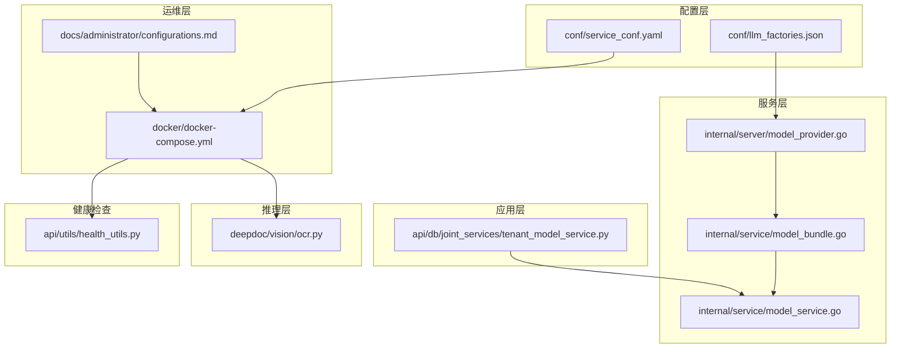
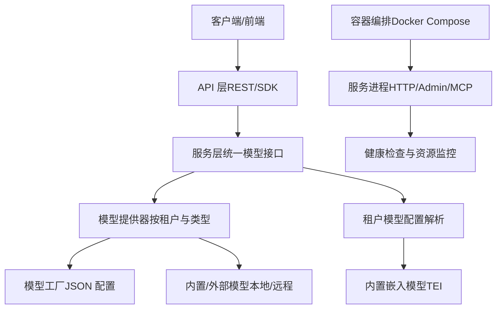
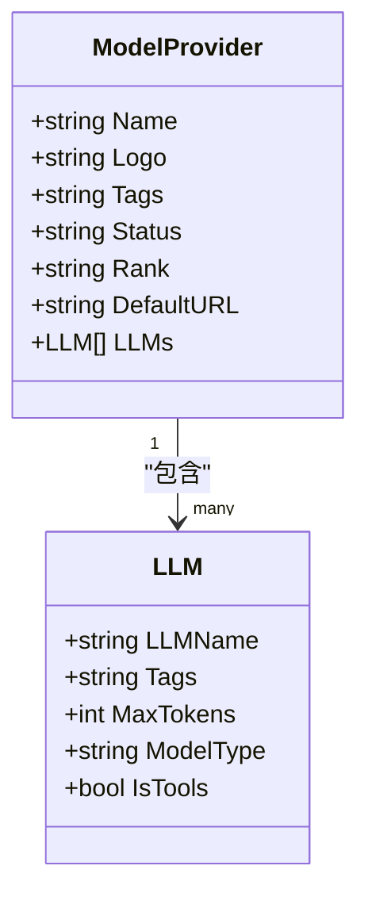
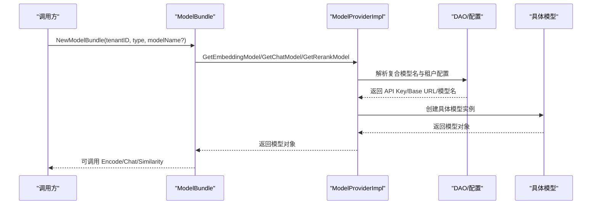
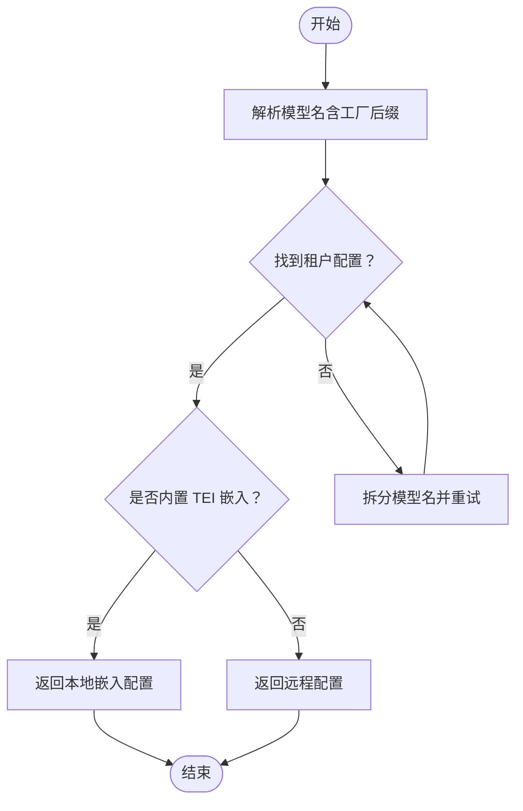
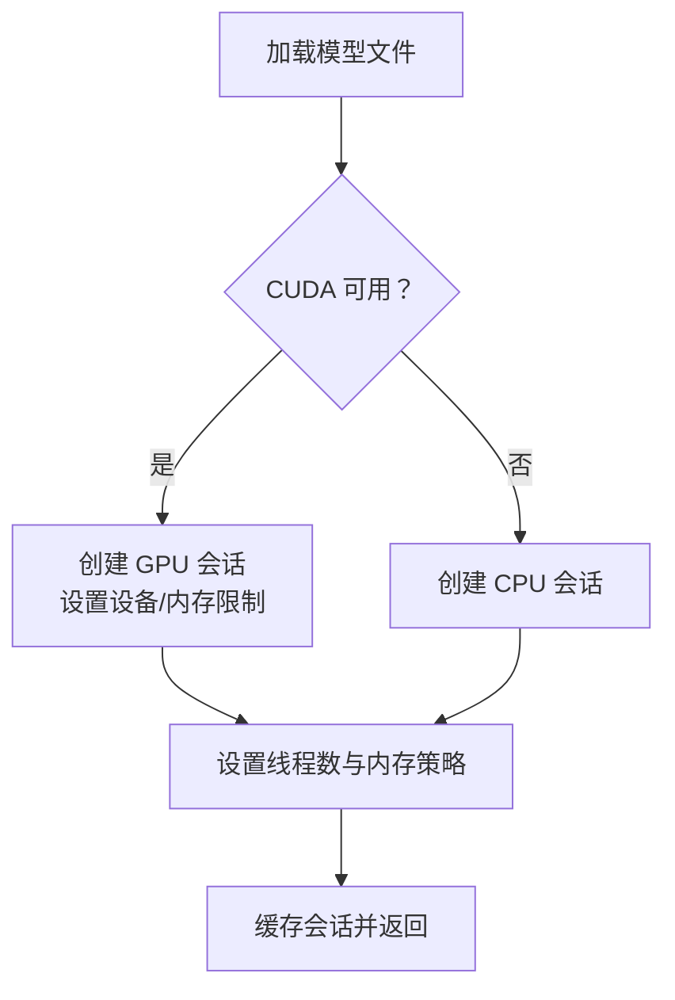
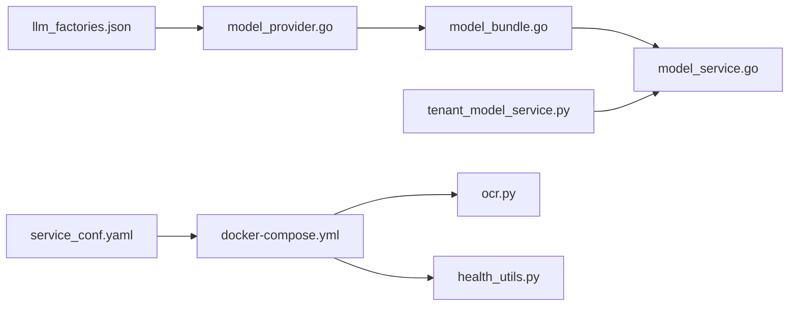

# 本地模型部署

<cite>
**本文引用的文件**
- [internal/server/model_provider.go](file://internal/server/model_provider.go)
- [conf/llm_factories.json](file://conf/llm_factories.json)
- [internal/service/model_bundle.go](file://internal/service/model_bundle.go)
- [internal/service/model_service.go](file://internal/service/model_service.go)
- [api/db/joint_services/tenant_model_service.py](file://api/db/joint_services/tenant_model_service.py)
- [conf/service_conf.yaml](file://conf/service_conf.yaml)
- [docker/docker-compose.yml](file://docker/docker-compose.yml)
- [deepdoc/vision/ocr.py](file://deepdoc/vision/ocr.py)
- [internal/model/llm.go](file://internal/model/llm.go)
- [api/utils/health_utils.py](file://api/utils/health_utils.py)
- [docs/administrator/configurations.md](file://docs/administrator/configurations.md)
</cite>

## 目录
1. [简介](#简介)
2. [项目结构](#项目结构)
3. [核心组件](#核心组件)
4. [架构总览](#架构总览)
5. [详细组件分析](#详细组件分析)
6. [依赖分析](#依赖分析)
7. [性能考虑](#性能考虑)
8. [故障排查指南](#故障排查指南)
9. [结论](#结论)
10. [附录](#附录)

## 简介
本章节面向需要在本地环境中部署与运行模型（如嵌入、重排序、语音识别等）的工程师与运维人员，系统性说明 RAGFlow 在本地模型支持上的能力边界、部署架构、配置要点与运维实践。重点覆盖以下方面：
- 本地模型优势与适用场景：隐私保护、低延迟、离线可用、可控成本
- 部署架构：模型工厂与供应商配置、模型实例化与统一接口、资源与并发控制
- 支持的本地模型类型：开源大模型、专用推理引擎、自定义模型
- 配置指南：硬件要求、内存分配、GPU 加速、模型量化与线程调优
- 监控与维护：健康检查、资源使用、故障诊断、自动重启
- 成本效益与迁移策略：与云端模型对比、迁移路径与风险评估

## 项目结构
围绕本地模型部署的关键目录与文件如下：
- 配置层：conf/llm_factories.json（模型工厂与模型清单）、conf/service_conf.yaml（服务端口与默认模型）
- 服务层：internal/server/model_provider.go（加载与查询模型工厂）、internal/service/model_bundle.go（统一模型接口封装）、internal/service/model_service.go（模型提供器实现）
- 应用层：api/db/joint_services/tenant_model_service.py（租户模型配置解析与内置嵌入模型适配）
- 运维层：docker/docker-compose.yml（容器编排与 GPU 资源声明）、docs/administrator/configurations.md（配置说明）
- 推理层：deepdoc/vision/ocr.py（ONNX Runtime 推理会话与 GPU/CPU 选择、线程数调优）
- 健康检查：api/utils/health_utils.py（数据库与服务健康状态）

**图表来源**
- [conf/llm_factories.json](file://conf/llm_factories.json)
- [conf/service_conf.yaml](file://conf/service_conf.yaml)
- [internal/server/model_provider.go](file://internal/server/model_provider.go)
- [internal/service/model_bundle.go](file://internal/service/model_bundle.go)
- [internal/service/model_service.go](file://internal/service/model_service.go)
- [api/db/joint_services/tenant_model_service.py](file://api/db/joint_services/tenant_model_service.py)
- [docker/docker-compose.yml](file://docker/docker-compose.yml)
- [deepdoc/vision/ocr.py](file://deepdoc/vision/ocr.py)
- [api/utils/health_utils.py](file://api/utils/health_utils.py)
- [docs/administrator/configurations.md](file://docs/administrator/configurations.md)

**章节来源**
- [conf/llm_factories.json](file://conf/llm_factories.json)
- [conf/service_conf.yaml](file://conf/service_conf.yaml)
- [internal/server/model_provider.go](file://internal/server/model_provider.go)
- [internal/service/model_bundle.go](file://internal/service/model_bundle.go)
- [internal/service/model_service.go](file://internal/service/model_service.go)
- [api/db/joint_services/tenant_model_service.py](file://api/db/joint_services/tenant_model_service.py)
- [docker/docker-compose.yml](file://docker/docker-compose.yml)
- [deepdoc/vision/ocr.py](file://deepdoc/vision/ocr.py)
- [api/utils/health_utils.py](file://api/utils/health_utils.py)
- [docs/administrator/configurations.md](file://docs/administrator/configurations.md)

## 核心组件
- 模型工厂与供应商配置：通过 conf/llm_factories.json 定义模型工厂与模型清单，内部以 JSON 结构描述模型名称、类型、标签、最大上下文等元数据；服务启动时读取该文件并建立名称到索引的映射，便于快速查找。
- 统一模型接口封装：internal/service/model_bundle.go 提供 ModelBundle，按租户与模型类型（嵌入、对话、重排序）统一获取底层模型实例，并提供 Encode、EncodeQuery、Chat、Similarity 等通用操作接口。
- 模型提供器实现：internal/service/model_service.go 实现 ModelProvider 接口，负责根据租户与复合模型名（含工厂后缀）解析并构造具体模型实例，当前嵌入模型已实现，对话与重排序尚在开发中。
- 租户模型配置解析：api/db/joint_services/tenant_model_service.py 从数据库或环境变量中解析租户模型配置，支持“模型名@工厂”格式；当检测到内置 TEI 嵌入模型时，直接返回本地嵌入配置。
- 服务配置与容器编排：conf/service_conf.yaml 定义默认模型与服务端口；docker/docker-compose.yml 支持 CPU/GPU 两种运行模式，GPU 模式通过 NVIDIA 设备保留声明启用容器 GPU 访问。

**章节来源**
- [internal/server/model_provider.go](file://internal/server/model_provider.go)
- [conf/llm_factories.json](file://conf/llm_factories.json)
- [internal/service/model_bundle.go](file://internal/service/model_bundle.go)
- [internal/service/model_service.go](file://internal/service/model_service.go)
- [api/db/joint_services/tenant_model_service.py](file://api/db/joint_services/tenant_model_service.py)
- [conf/service_conf.yaml](file://conf/service_conf.yaml)
- [docker/docker-compose.yml](file://docker/docker-compose.yml)

## 架构总览
下图展示了本地模型部署的总体架构：配置层提供模型工厂与默认模型；服务层通过统一接口封装模型实例；应用层解析租户配置并适配内置模型；运维层通过容器编排与健康检查保障稳定性。

**图表来源**
- [internal/server/model_provider.go](file://internal/server/model_provider.go)
- [internal/service/model_bundle.go](file://internal/service/model_bundle.go)
- [internal/service/model_service.go](file://internal/service/model_service.go)
- [api/db/joint_services/tenant_model_service.py](file://api/db/joint_services/tenant_model_service.py)
- [docker/docker-compose.yml](file://docker/docker-compose.yml)
- [api/utils/health_utils.py](file://api/utils/health_utils.py)

## 详细组件分析

### 模型工厂与供应商配置
- 加载流程：LoadModelProviders 从 conf/llm_factories.json 读取 JSON，解析出 factory_llm_infos 列表，构建模型提供商数组与名称到索引的映射，便于后续按名称快速定位。
- 查询接口：GetModelProviderByName 与 GetLLMByProviderAndName 提供按工厂与模型名的精确查询，用于后续模型实例化与参数校验。
- 数据模型：ModelProvider 与 LLM 结构体定义了模型工厂与模型条目的字段，包括名称、标签、最大上下文、工具支持等。

**图表来源**
- [internal/server/model_provider.go](file://internal/server/model_provider.go)

**章节来源**
- [internal/server/model_provider.go](file://internal/server/model_provider.go)
- [conf/llm_factories.json](file://conf/llm_factories.json)

### 统一模型接口封装（ModelBundle）
- 功能概述：NewModelBundle 根据租户 ID 与模型类型（嵌入/对话/重排序）获取对应模型实例；随后提供 Encode、EncodeQuery、Chat、Similarity 等方法，屏蔽底层差异。
- 错误处理：对不支持的模型类型与非目标模型类型进行显式错误提示，便于上层快速定位问题。
- 兼容性：返回值包含近似 token 数，便于计费与统计。

**图表来源**
- [internal/service/model_bundle.go](file://internal/service/model_bundle.go)
- [internal/service/model_service.go](file://internal/service/model_service.go)

**章节来源**
- [internal/service/model_bundle.go](file://internal/service/model_bundle.go)
- [internal/service/model_service.go](file://internal/service/model_service.go)

### 租户模型配置解析与内置嵌入模型适配
- 复合模型名解析：支持“模型名@工厂”的格式，若未提供工厂，将尝试拆分并回退到默认工厂。
- 内置嵌入模型：当检测到 TEI（内置）嵌入模型且满足条件时，直接返回本地嵌入配置（API Key/Base URL），避免远程调用。
- 默认模型：conf/service_conf.yaml 中 user_default_llm.default_models.embedding_model 指定默认嵌入模型工厂与地址。

**图表来源**
- [api/db/joint_services/tenant_model_service.py](file://api/db/joint_services/tenant_model_service.py)
- [conf/service_conf.yaml](file://conf/service_conf.yaml)

**章节来源**
- [api/db/joint_services/tenant_model_service.py](file://api/db/joint_services/tenant_model_service.py)
- [conf/service_conf.yaml](file://conf/service_conf.yaml)

### 推理与资源管理（以 OCR 为例）
- ONNX Runtime 会话：deepdoc/vision/ocr.py 展示了如何加载模型、选择执行提供程序（GPU/CPU）、设置线程数与内存策略，从而在多工作器环境下避免 CPU 过度订阅。
- 环境变量：OCR_INTRA_OP_NUM_THREADS、OCR_INTER_OP_NUM_THREADS 控制推理线程数，可根据 CPU/GPU 资源动态调整。
- GPU 内存与设备：当 CUDA 可用时优先使用 GPU，并记录设备号与内存限制，便于排障与容量规划。

**图表来源**
- [deepdoc/vision/ocr.py](file://deepdoc/vision/ocr.py)

**章节来源**
- [deepdoc/vision/ocr.py](file://deepdoc/vision/ocr.py)

### 健康检查与运维
- 健康检查：api/utils/health_utils.py 对连接状态、延迟、慢查询、活动连接等指标进行聚合，输出健康状态与详情，便于自动化监控与告警。
- 容器编排：docker/docker-compose.yml 支持 CPU/GPU 两种运行模式，GPU 模式通过 NVIDIA 设备保留声明启用容器 GPU 访问；服务端口映射与日志挂载可按需调整。
- 配置说明：docs/administrator/configurations.md 提供 Docker 部署的配置指引，强调更新配置后需重启容器生效。

**章节来源**
- [api/utils/health_utils.py](file://api/utils/health_utils.py)
- [docker/docker-compose.yml](file://docker/docker-compose.yml)
- [docs/administrator/configurations.md](file://docs/administrator/configurations.md)

## 依赖分析
- 配置依赖：模型工厂配置（conf/llm_factories.json）被服务层（internal/server/model_provider.go）直接依赖；服务配置（conf/service_conf.yaml）被容器编排（docker/docker-compose.yml）与健康检查（api/utils/health_utils.py）间接依赖。
- 运行时依赖：统一模型接口（internal/service/model_bundle.go）依赖模型提供器实现（internal/service/model_service.go），后者依赖 DAO 与租户配置（api/db/joint_services/tenant_model_service.py）。
- 推理依赖：推理层（deepdoc/vision/ocr.py）依赖 ONNX Runtime 与 CUDA/Torch 环境，受容器 GPU 配置影响。

**图表来源**
- [conf/llm_factories.json](file://conf/llm_factories.json)
- [conf/service_conf.yaml](file://conf/service_conf.yaml)
- [internal/server/model_provider.go](file://internal/server/model_provider.go)
- [internal/service/model_bundle.go](file://internal/service/model_bundle.go)
- [internal/service/model_service.go](file://internal/service/model_service.go)
- [api/db/joint_services/tenant_model_service.py](file://api/db/joint_services/tenant_model_service.py)
- [docker/docker-compose.yml](file://docker/docker-compose.yml)
- [deepdoc/vision/ocr.py](file://deepdoc/vision/ocr.py)
- [api/utils/health_utils.py](file://api/utils/health_utils.py)

**章节来源**
- [conf/llm_factories.json](file://conf/llm_factories.json)
- [conf/service_conf.yaml](file://conf/service_conf.yaml)
- [internal/server/model_provider.go](file://internal/server/model_provider.go)
- [internal/service/model_bundle.go](file://internal/service/model_bundle.go)
- [internal/service/model_service.go](file://internal/service/model_service.go)
- [api/db/joint_services/tenant_model_service.py](file://api/db/joint_services/tenant_model_service.py)
- [docker/docker-compose.yml](file://docker/docker-compose.yml)
- [deepdoc/vision/ocr.py](file://deepdoc/vision/ocr.py)
- [api/utils/health_utils.py](file://api/utils/health_utils.py)

## 性能考虑
- 线程与并发：通过环境变量（如 OCR_INTRA_OP_NUM_THREADS、OCR_INTER_OP_NUM_THREADS）控制推理线程数，避免 CPU 过度订阅；在多工作器环境下建议合理分配线程数。
- GPU 加速：GPU 模式通过容器编排启用 NVIDIA 设备访问；推理层优先使用 GPU 并记录设备号与内存限制，便于容量规划与排障。
- 内存策略：ONNX Runtime 支持内存 Arena 收缩与策略配置，结合容器内存限制与模型大小进行调优。
- 健康阈值：健康检查将连接状态与延迟作为健康判定依据，建议将延迟阈值与慢查询数量纳入告警策略。

[本节为通用指导，无需列出具体文件来源]

## 故障排查指南
- 模型工厂加载失败：检查 conf/llm_factories.json 文件是否存在、格式是否正确、路径是否可读。
- 模型提供器未找到：确认模型工厂名称与模型名匹配，以及 conf/service_conf.yaml 中默认模型配置是否正确。
- 推理失败（GPU/CPU）：检查 CUDA/Torch 是否可用、GPU 设备号与内存限制是否合理、线程数设置是否过高。
- 健康检查异常：查看 api/utils/health_utils.py 输出的连接状态、延迟、慢查询与活动连接数，结合容器日志定位问题。
- 配置未生效：确认 docker/docker-compose.yml 的端口映射与卷挂载、环境变量是否正确，更新后需重启容器。

**章节来源**
- [internal/server/model_provider.go](file://internal/server/model_provider.go)
- [conf/llm_factories.json](file://conf/llm_factories.json)
- [conf/service_conf.yaml](file://conf/service_conf.yaml)
- [docker/docker-compose.yml](file://docker/docker-compose.yml)
- [deepdoc/vision/ocr.py](file://deepdoc/vision/ocr.py)
- [api/utils/health_utils.py](file://api/utils/health_utils.py)

## 结论
RAGFlow 在本地模型部署方面提供了清晰的配置与运行框架：通过模型工厂配置与统一接口封装，实现了对多种模型类型的抽象与调度；借助容器编排与健康检查，保障了本地部署的稳定性与可观测性。对于需要隐私保护、低延迟与离线可用的场景，建议优先采用本地模型方案，并结合硬件资源与线程调优持续优化性能与成本。

[本节为总结性内容，无需列出具体文件来源]

## 附录

### 本地模型支持类型与适用场景
- 开源大模型：通过模型工厂配置接入，适合通用对话与生成任务；需关注上下文长度与工具支持。
- 专用推理引擎：如 TEI 嵌入模型，适合向量检索与嵌入计算；可通过内置适配减少网络往返。
- 自定义模型：通过租户模型配置与复合模型名（模型名@工厂）灵活扩展，满足特定业务需求。

**章节来源**
- [conf/llm_factories.json](file://conf/llm_factories.json)
- [api/db/joint_services/tenant_model_service.py](file://api/db/joint_services/tenant_model_service.py)

### 配置指南（硬件与参数）
- 硬件要求：GPU 模式需具备 NVIDIA 设备与驱动；CPU 模式适用于轻量推理。
- 内存分配：结合模型大小与批处理策略，合理设置容器内存限制与 ONNX Runtime 内存策略。
- 线程调优：通过 OCR_INTRA_OP_NUM_THREADS、OCR_INTER_OP_NUM_THREADS 控制推理线程数。
- 模型量化：可在模型侧进行量化以降低显存占用，需配合推理引擎支持。

**章节来源**
- [docker/docker-compose.yml](file://docker/docker-compose.yml)
- [deepdoc/vision/ocr.py](file://deepdoc/vision/ocr.py)

### 监控与维护
- 健康检查：基于 api/utils/health_utils.py 的指标输出，建立自动化监控与告警。
- 日志与重启：容器日志挂载至宿主机，结合 restart: unless-stopped 策略提升可用性。
- 配置更新：遵循 docs/administrator/configurations.md 的更新流程，确保配置生效。

**章节来源**
- [api/utils/health_utils.py](file://api/utils/health_utils.py)
- [docker/docker-compose.yml](file://docker/docker-compose.yml)
- [docs/administrator/configurations.md](file://docs/administrator/configurations.md)