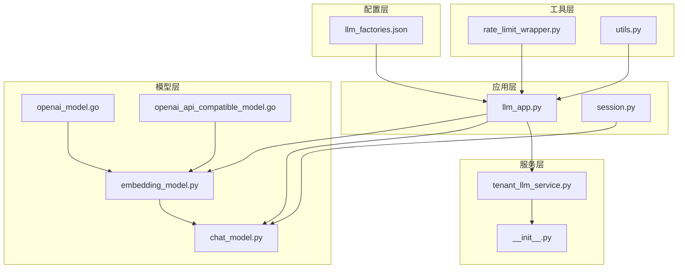
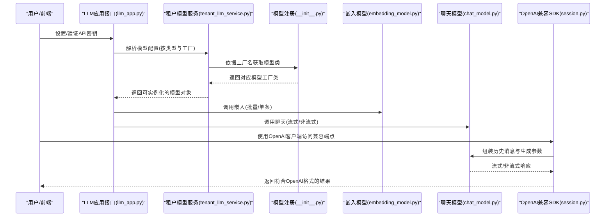
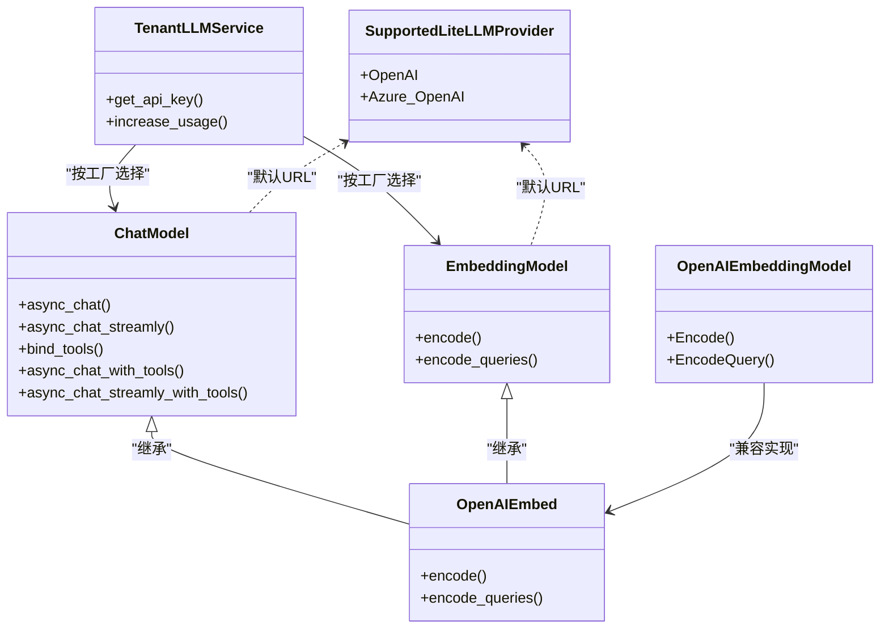

# OpenAI集成

<cite>
**本文引用的文件**
- [llm_factories.json](file://conf/llm_factories.json)
- [openai_model.go](file://internal/service/models/openai_model.go)
- [openai_api_compatible_model.go](file://internal/service/models/openai_api_compatible_model.go)
- [llm_app.py](file://api/apps/llm_app.py)
- [embedding_model.py](file://rag/llm/embedding_model.py)
- [chat_model.py](file://rag/llm/chat_model.py)
- [__init__.py](file://rag/llm/__init__.py)
- [session.py](file://api/apps/sdk/session.py)
- [tenant_llm_service.py](file://api/db/services/tenant_llm_service.py)
- [rate_limit_wrapper.py](file://common/data_source/cross_connector_utils/rate_limit_wrapper.py)
- [utils.py](file://common/data_source/utils.py)
</cite>

## 目录
1. [简介](#简介)
2. [项目结构](#项目结构)
3. [核心组件](#核心组件)
4. [架构总览](#架构总览)
5. [详细组件分析](#详细组件分析)
6. [依赖关系分析](#依赖关系分析)
7. [性能考虑](#性能考虑)
8. [故障排查指南](#故障排查指南)
9. [结论](#结论)
10. [附录](#附录)

## 简介
本技术文档面向在RAGFlow中集成OpenAI模型提供商的开发者与运维人员，系统性阐述OpenAI API的集成实现，包括API密钥配置、请求参数设置、响应处理机制；覆盖支持的模型类型（如gpt-4、gpt-3.5-turbo、text-embedding系列等）及其特性与使用场景；详解认证机制、速率限制处理、错误重试策略等关键技术点，并提供配置示例与代码片段路径，帮助快速在RAGFlow中正确配置与使用OpenAI模型，同时给出性能优化建议、成本控制策略与故障排查指南。

## 项目结构
围绕OpenAI集成的关键目录与文件如下：
- 配置层：通过配置文件定义可用的OpenAI工厂与模型清单
- 应用层：提供LLM工厂管理、API密钥设置、模型添加与校验接口
- 模型层：封装OpenAI聊天与嵌入调用，统一错误分类与重试策略
- SDK层：提供OpenAI兼容风格的聊天补全接口，便于直接对接OpenAI客户端
- 工具层：提供通用的速率限制与重试包装器，保障外部服务交互稳定性

图表来源
- [llm_factories.json](file://conf/llm_factories.json)
- [llm_app.py](file://api/apps/llm_app.py)
- [embedding_model.py](file://rag/llm/embedding_model.py)
- [chat_model.py](file://rag/llm/chat_model.py)
- [openai_model.go](file://internal/service/models/openai_model.go)
- [openai_api_compatible_model.go](file://internal/service/models/openai_api_compatible_model.go)
- [session.py](file://api/apps/sdk/session.py)
- [tenant_llm_service.py](file://api/db/services/tenant_llm_service.py)
- [rate_limit_wrapper.py](file://common/data_source/cross_connector_utils/rate_limit_wrapper.py)
- [utils.py](file://common/data_source/utils.py)
- [__init__.py](file://rag/llm/__init__.py)

章节来源
- [llm_factories.json](file://conf/llm_factories.json)
- [llm_app.py](file://api/apps/llm_app.py)
- [embedding_model.py](file://rag/llm/embedding_model.py)
- [chat_model.py](file://rag/llm/chat_model.py)
- [openai_model.go](file://internal/service/models/openai_model.go)
- [openai_api_compatible_model.go](file://internal/service/models/openai_api_compatible_model.go)
- [session.py](file://api/apps/sdk/session.py)
- [tenant_llm_service.py](file://api/db/services/tenant_llm_service.py)
- [rate_limit_wrapper.py](file://common/data_source/cross_connector_utils/rate_limit_wrapper.py)
- [utils.py](file://common/data_source/utils.py)
- [__init__.py](file://rag/llm/__init__.py)

## 核心组件
- OpenAI工厂与模型清单：通过配置文件集中声明OpenAI工厂、标签、默认URL以及可用模型列表（含名称、类型、最大token数、是否支持工具等）
- LLM工厂管理接口：提供查询工厂、设置API密钥、添加/删除/启用模型、列出可用模型等功能
- OpenAI嵌入模型：封装OpenAI嵌入调用，支持批量请求、排序返回、错误处理
- OpenAI聊天模型：封装异步流式与非流式对话，统一参数清洗、工具调用、错误分类与指数退避重试
- OpenAI兼容SDK：提供OpenAI风格的聊天补全端点，支持流式与非流式返回、引用信息与元数据
- 速率限制与重试：提供通用的速率限制装饰器与请求级重试包装，适配429等限流场景
- 租户模型服务：根据租户与模型类型解析实际使用的API Key与Base URL，支持多模型类型与默认值回退

章节来源
- [llm_factories.json](file://conf/llm_factories.json)
- [llm_app.py](file://api/apps/llm_app.py)
- [embedding_model.py](file://rag/llm/embedding_model.py)
- [chat_model.py](file://rag/llm/chat_model.py)
- [openai_model.go](file://internal/service/models/openai_model.go)
- [openai_api_compatible_model.go](file://internal/service/models/openai_api_compatible_model.go)
- [session.py](file://api/apps/sdk/session.py)
- [rate_limit_wrapper.py](file://common/data_source/cross_connector_utils/rate_limit_wrapper.py)
- [utils.py](file://common/data_source/utils.py)
- [tenant_llm_service.py](file://api/db/services/tenant_llm_service.py)

## 架构总览
下图展示了从用户配置到模型调用的完整链路，涵盖工厂注册、模型选择、参数清洗、错误重试与SDK兼容层：

图表来源
- [llm_app.py](file://api/apps/llm_app.py)
- [tenant_llm_service.py](file://api/db/services/tenant_llm_service.py)
- [__init__.py](file://rag/llm/__init__.py)
- [embedding_model.py](file://rag/llm/embedding_model.py)
- [chat_model.py](file://rag/llm/chat_model.py)
- [session.py](file://api/apps/sdk/session.py)

## 详细组件分析

### OpenAI工厂与模型清单
- 工厂信息：包含名称、标签、状态、排序、默认URL等
- 模型列表：包含聊天、嵌入、重排、语音转文本、图像转文本、TTS等类型，每项含模型名、标签、最大token数、是否支持工具等
- 默认URL：OpenAI工厂默认指向官方v1端点，可在租户配置或添加模型时覆盖

章节来源
- [llm_factories.json](file://conf/llm_factories.json)

### LLM工厂管理接口
- 查询工厂：返回允许的LLM工厂及其支持的模型类型
- 设置API密钥：对指定工厂进行连通性测试（嵌入/聊天/重排），成功后持久化保存
- 添加模型：按工厂类型组装特殊字段（如Azure-OpenAI需要api_key与api_version），并进行可用性校验
- 列出模型：结合租户已配置与全局模型清单，返回可用模型集合

章节来源
- [llm_app.py](file://api/apps/llm_app.py)

### OpenAI嵌入模型
- 请求体构造：包含模型名与输入文本数组
- 认证头设置：Authorization使用Bearer方案
- 响应解析：按索引排序确保顺序一致
- 错误处理：非200状态码抛出错误，包含HTTP状态与响应体

章节来源
- [openai_model.go](file://internal/service/models/openai_model.go)

### OpenAI兼容嵌入模型
- 兼容工厂：OpenAI-API-Compatible工厂复用OpenAI嵌入实现，便于对接自建或代理端点

章节来源
- [openai_api_compatible_model.go](file://internal/service/models/openai_api_compatible_model.go)

### OpenAI聊天模型
- 客户端初始化：支持同步与异步OpenAI客户端，超时时间可配置
- 参数清洗：仅保留允许的生成参数，移除不兼容字段（如部分GPT-5端点）
- 错误分类：基于关键词识别速率限制、鉴权失败、服务器错误、超时、连接错误、内容过滤、配额耗尽等
- 重试策略：指数退避延迟，仅对可重试错误执行重试，超过最大次数后返回错误信息
- 工具调用：支持函数调用与流式工具调用，自动拼接历史消息与工具结果
- 流式输出：支持增量内容与思考内容（reasoning）输出，末尾追加长度截断提示

章节来源
- [chat_model.py](file://rag/llm/chat_model.py)

### OpenAI兼容SDK
- 端点设计：提供OpenAI风格的聊天补全端点，支持流式与非流式
- 参考信息：可通过extra_body开启引用信息与元数据字段
- 请求校验：校验消息合法性、最后一条必须来自用户
- 异步生成：内部调用聊天模型生成答案，聚合引用信息

章节来源
- [session.py](file://api/apps/sdk/session.py)

### 速率限制与重试
- 通用装饰器：基于时间窗口与最大调用数的滑动窗口限速，超过阈值等待并重试
- 请求级重试：对429状态自动读取Retry-After或指数退避等待，达到最大重试次数后抛错
- 并发控制：通过信号量与延迟控制并发请求节奏

章节来源
- [rate_limit_wrapper.py](file://common/data_source/cross_connector_utils/rate_limit_wrapper.py)
- [utils.py](file://common/data_source/utils.py)

### 租户模型服务
- 模型解析：根据租户与模型类型解析实际使用的API Key与Base URL，支持默认值回退
- 工厂映射：按模型类型与工厂名选择具体模型类（聊天/嵌入/重排/语音/OCR/TTS）
- 使用统计：按模型类型更新租户使用的token用量

章节来源
- [tenant_llm_service.py](file://api/db/services/tenant_llm_service.py)

## 依赖关系分析
- 模型注册：通过包导入与反射机制，将各模型类注册到对应工厂字典
- 工厂默认URL：为OpenAI与Azure-OpenAI提供默认基础URL，便于未显式配置时使用
- 多模型类型支持：同一工厂可同时支持聊天、嵌入、重排、语音、OCR、TTS等多种类型

图表来源
- [chat_model.py](file://rag/llm/chat_model.py)
- [embedding_model.py](file://rag/llm/embedding_model.py)
- [openai_model.go](file://internal/service/models/openai_model.go)
- [tenant_llm_service.py](file://api/db/services/tenant_llm_service.py)
- [__init__.py](file://rag/llm/__init__.py)

章节来源
- [chat_model.py](file://rag/llm/chat_model.py)
- [embedding_model.py](file://rag/llm/embedding_model.py)
- [openai_model.go](file://internal/service/models/openai_model.go)
- [tenant_llm_service.py](file://api/db/services/tenant_llm_service.py)
- [__init__.py](file://rag/llm/__init__.py)

## 性能考虑
- 批量嵌入：嵌入接口按批次发送，减少网络往返开销
- 流式输出：聊天接口支持流式增量返回，降低首字节延迟
- 参数清洗：移除不兼容字段，避免无效参数导致的额外开销
- 重试退避：指数退避降低雪崩风险，提升整体成功率
- 速率限制：滑动窗口与请求级重试避免触发外部限流

## 故障排查指南
- 鉴权失败：检查API Key是否正确、是否被禁用或过期
- 速率限制：关注错误分类中的“速率限制”标识，适当降低并发或增加等待时间
- 服务器错误：确认上游服务可用性，必要时切换备用节点或工厂
- 超时与连接错误：检查网络连通性与超时配置，适当增大超时时间
- 内容过滤：调整提示词或启用安全模式，避免触发内容策略
- 配额耗尽：检查账户余额与配额设置，及时充值或升级套餐
- 模型不可用：确认模型名称与类型是否匹配，必要时切换到兼容模型

章节来源
- [chat_model.py](file://rag/llm/chat_model.py)
- [rate_limit_wrapper.py](file://common/data_source/cross_connector_utils/rate_limit_wrapper.py)
- [utils.py](file://common/data_source/utils.py)

## 结论
RAGFlow对OpenAI的集成采用“配置驱动+工厂注册+统一模型抽象”的架构设计，既保证了与OpenAI生态的兼容性，又提供了灵活的扩展能力。通过完善的错误分类与重试策略、速率限制控制与SDK兼容层，开发者可以稳定地在生产环境中使用OpenAI模型，并根据业务需求进行性能优化与成本控制。

## 附录

### 支持的模型类型与使用场景
- 聊天模型（Chat）
  - 适用场景：问答、对话、推理、Agent编排
  - 关键特性：支持工具调用、流式输出、参数清洗、错误重试
- 嵌入模型（Embedding）
  - 适用场景：向量化检索、语义相似度计算
  - 关键特性：批量请求、排序返回、错误处理
- 重排模型（Rerank）
  - 适用场景：检索结果重排、提升相关性
- 语音转文本（Speech-to-Text）
  - 适用场景：音频转文字、会议记录
- 图像转文本（Image-to-Text）
  - 适用场景：视觉理解、图文描述
- 文本转语音（TTS）
  - 适用场景：语音播报、有声读物

章节来源
- [llm_factories.json](file://conf/llm_factories.json)
- [embedding_model.py](file://rag/llm/embedding_model.py)
- [chat_model.py](file://rag/llm/chat_model.py)

### 配置示例与代码片段路径
- 设置/验证OpenAI API密钥
  - 接口路径：[llm_app.py](file://api/apps/llm_app.py)
  - 功能要点：对嵌入、聊天、重排进行连通性测试，成功后持久化保存
- 添加OpenAI模型（含Azure-OpenAI）
  - 接口路径：[llm_app.py](file://api/apps/llm_app.py)
  - 功能要点：按工厂组装特殊字段（如Azure-OpenAI的api_key与api_version），并进行可用性校验
- 使用OpenAI兼容SDK进行聊天
  - 接口路径：[session.py](file://api/apps/sdk/session.py)
  - 功能要点：支持流式与非流式返回、引用信息与元数据字段
- 模型工厂与默认URL
  - 路径：[__init__.py](file://rag/llm/__init__.py)
  - 功能要点：为OpenAI/Azure-OpenAI提供默认基础URL
- 租户模型解析与使用统计
  - 路径：[tenant_llm_service.py](file://api/db/services/tenant_llm_service.py)
  - 功能要点：按模型类型与工厂选择具体模型类，更新token用量

章节来源
- [llm_app.py](file://api/apps/llm_app.py)
- [session.py](file://api/apps/sdk/session.py)
- [__init__.py](file://rag/llm/__init__.py)
- [tenant_llm_service.py](file://api/db/services/tenant_llm_service.py)