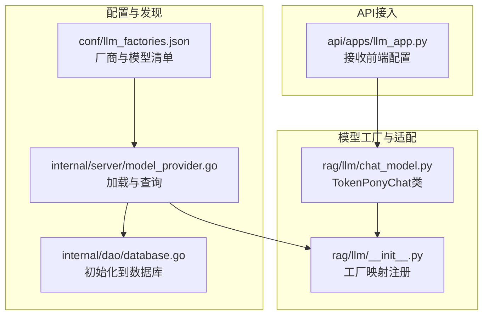
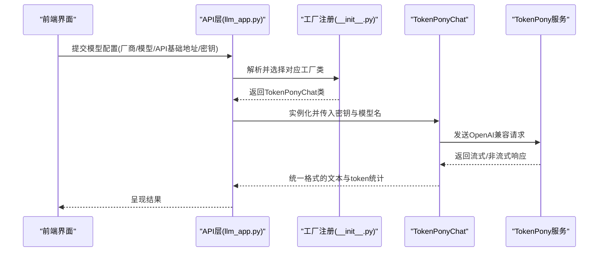
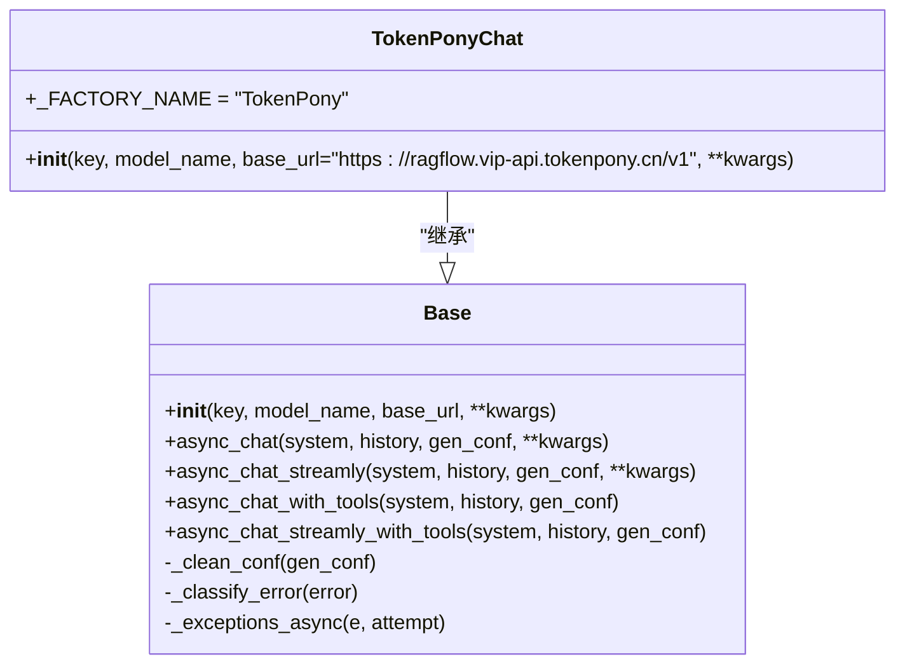
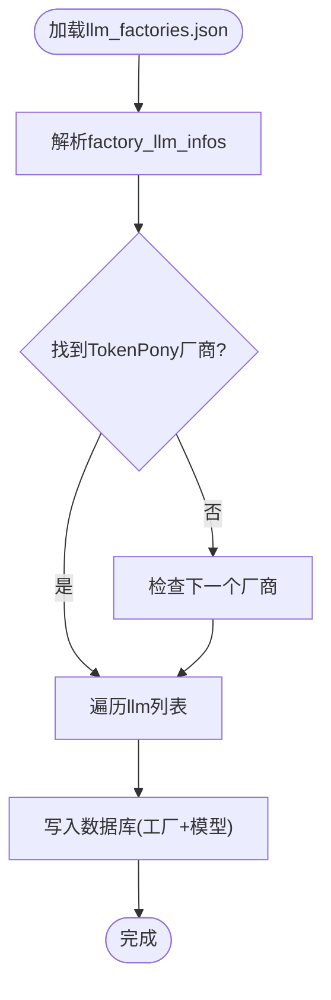
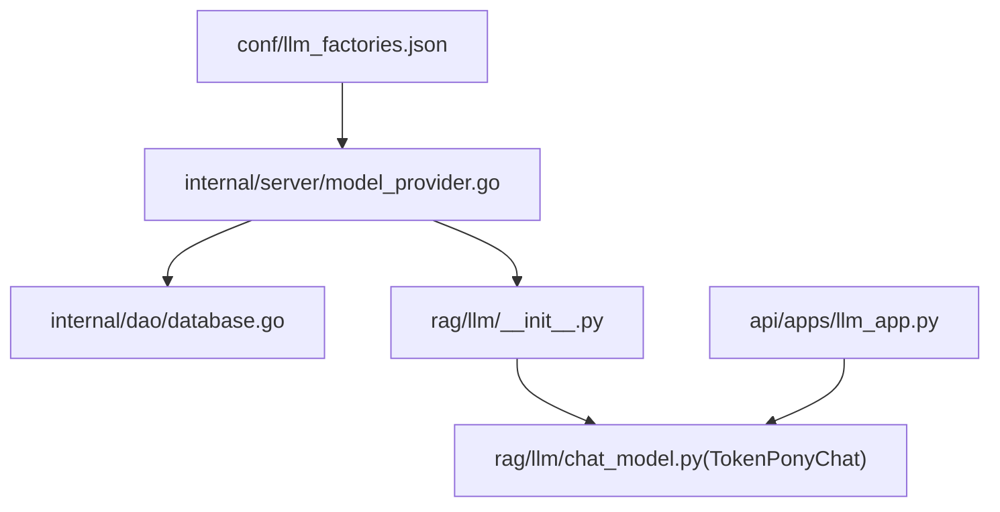

# TokenPony集成

<cite>
**本文档引用的文件**
- [chat_model.py](file://rag/llm/chat_model.py)
- [llm_factories.json](file://conf/llm_factories.json)
- [model_provider.go](file://internal/server/model_provider.go)
- [database.go](file://internal/dao/database.go)
- [llm_app.py](file://api/apps/llm_app.py)
- [__init__.py](file://rag/llm/__init__.py)
- [cv_model.py](file://rag/llm/cv_model.py)
</cite>

## 目录
1. [简介](#简介)
2. [项目结构](#项目结构)
3. [核心组件](#核心组件)
4. [架构概览](#架构概览)
5. [详细组件分析](#详细组件分析)
6. [依赖分析](#依赖分析)
7. [性能考虑](#性能考虑)
8. [故障排查指南](#故障排查指南)
9. [结论](#结论)
10. [附录](#附录)

## 简介
本文件面向开发者，系统性阐述在RAGFlow中集成TokenPony模型提供商的技术方案与最佳实践。TokenPony作为多模型聚合平台，提供大语言模型（LLM）、代码模型、视觉理解等多种能力。RAGFlow通过统一的模型工厂机制与配置化管理，将TokenPony的多个模型（如qwen3-8b、deepseek-v3-0324、qwen3-32b等）无缝接入到RAGFlow的推理与检索流程中。

本技术文档涵盖以下关键内容：
- TokenPony平台多模型支持与配置方式
- RAGFlow中的模型工厂注册与调用链路
- API配置、请求参数与响应处理机制
- 在RAGFlow中正确配置TokenPony模型的步骤与示例
- 性能优化建议、API使用限制与常见问题排查

## 项目结构
围绕TokenPony集成的关键目录与文件如下：
- 模型工厂与适配层：rag/llm/chat_model.py 中定义了TokenPonyChat类，继承自通用Base类，负责与TokenPony API交互
- 配置与发现：conf/llm_factories.json 提供TokenPony厂商及其模型清单；internal/server/model_provider.go 负责加载与查询
- 数据初始化：internal/dao/database.go 将llm_factories.json中的厂商与模型写入数据库
- API接入：api/apps/llm_app.py 处理前端提交的模型配置，构造后端存储结构
- 统一工厂映射：rag/llm/__init__.py 动态收集各模型工厂类，建立名称到类的映射

**图表来源**
- [llm_factories.json:254-373](file://conf/llm_factories.json#L254-L373)
- [model_provider.go:53-102](file://internal/server/model_provider.go#L53-L102)
- [database.go:198-232](file://internal/dao/database.go#L198-L232)
- [chat_model.py:1190-1197](file://rag/llm/chat_model.py#L1190-L1197)
- [__init__.py:173-181](file://rag/llm/__init__.py#L173-L181)
- [llm_app.py:229-237](file://api/apps/llm_app.py#L229-L237)

**章节来源**
- [llm_factories.json:254-373](file://conf/llm_factories.json#L254-L373)
- [model_provider.go:53-102](file://internal/server/model_provider.go#L53-L102)
- [database.go:198-232](file://internal/dao/database.go#L198-L232)
- [chat_model.py:1190-1197](file://rag/llm/chat_model.py#L1190-L1197)
- [__init__.py:173-181](file://rag/llm/__init__.py#L173-L181)
- [llm_app.py:229-237](file://api/apps/llm_app.py#L229-L237)

## 核心组件
- TokenPonyChat：基于OpenAI兼容接口的TokenPony适配器，默认基地址为 https://ragflow.vip-api.tokenpony.cn/v1，继承通用Base类以获得统一的错误分类、重试策略、流式输出与工具调用能力
- 模型工厂注册：通过rag/llm/__init__.py动态扫描并注册各模型工厂类，包括TokenPonyChat
- 配置与发现：llm_factories.json声明TokenPony厂商及模型清单；model_provider.go负责读取与按名称查询；database.go在启动时将配置写入数据库
- API接入：llm_app.py接收前端提交的模型配置（厂商、模型名、API基础地址、密钥等），构造后端存储结构

**章节来源**
- [chat_model.py:1190-1197](file://rag/llm/chat_model.py#L1190-L1197)
- [__init__.py:173-181](file://rag/llm/__init__.py#L173-L181)
- [llm_factories.json:254-373](file://conf/llm_factories.json#L254-L373)
- [model_provider.go:53-102](file://internal/server/model_provider.go#L53-L102)
- [database.go:198-232](file://internal/dao/database.go#L198-L232)
- [llm_app.py:229-237](file://api/apps/llm_app.py#L229-L237)

## 架构概览
下图展示了从配置到推理的完整链路：

**图表来源**
- [llm_app.py:229-237](file://api/apps/llm_app.py#L229-L237)
- [__init__.py:173-181](file://rag/llm/__init__.py#L173-L181)
- [chat_model.py:1190-1197](file://rag/llm/chat_model.py#L1190-L1197)

## 详细组件分析

### TokenPonyChat类分析
TokenPonyChat继承自通用Base类，具备以下特性：
- 默认基地址：https://ragflow.vip-api.tokenpony.cn/v1
- 统一错误分类与重试策略：基于关键词匹配进行速率限制、鉴权、无效请求、服务器错误、超时、连接、内容过滤、模型不存在、配额、最大重试等分类
- 流式与非流式对话：支持异步流式输出与非流式输出，并自动处理长度截断提示
- 工具调用：支持函数调用与工具执行，适用于RAGFlow的Agent工作流
- 参数清洗：根据模型家族策略清理或调整生成参数，确保与TokenPony兼容

**图表来源**
- [chat_model.py:115-595](file://rag/llm/chat_model.py#L115-L595)
- [chat_model.py:1190-1197](file://rag/llm/chat_model.py#L1190-L1197)

**章节来源**
- [chat_model.py:115-595](file://rag/llm/chat_model.py#L115-L595)
- [chat_model.py:1190-1197](file://rag/llm/chat_model.py#L1190-L1197)

### TokenPony模型清单与配置
llm_factories.json中定义了TokenPony厂商及其模型清单，包括但不限于：
- qwen3-8b、deepseek-v3-0324、qwen3-32b 等聊天模型
- 支持工具调用（is_tools=true）
- 各模型的最大上下文长度（max_tokens）

**图表来源**
- [llm_factories.json:254-373](file://conf/llm_factories.json#L254-L373)
- [database.go:198-232](file://internal/dao/database.go#L198-L232)

**章节来源**
- [llm_factories.json:254-373](file://conf/llm_factories.json#L254-L373)
- [database.go:198-232](file://internal/dao/database.go#L198-L232)

### API配置与请求参数
在API层，llm_app.py接收前端提交的模型配置，构造后端存储结构：
- llm_factory：厂商名称（如TokenPony）
- model_type：模型类型（chat/embedding等）
- llm_name：具体模型名（如qwen3-8b）
- api_base：API基础地址（默认可为空，由工厂类提供）
- api_key：令牌
- max_tokens：最大生成长度（可选）

随后，RAGFlow通过工厂映射获取TokenPonyChat类并实例化，发起OpenAI兼容请求。

**章节来源**
- [llm_app.py:229-237](file://api/apps/llm_app.py#L229-L237)
- [__init__.py:173-181](file://rag/llm/__init__.py#L173-L181)
- [chat_model.py:1190-1197](file://rag/llm/chat_model.py#L1190-L1197)

### 视觉理解与多模态支持
RAGFlow同时支持视觉理解任务。cv_model.py提供了通用的图像描述与带提示词的描述能力，可通过统一的客户端接口调用。对于TokenPony的视觉模型（如qwen3-vl系列），可在相同框架下进行适配与调用。

**章节来源**
- [cv_model.py:711-1061](file://rag/llm/cv_model.py#L711-L1061)

## 依赖分析
TokenPony集成涉及的模块间依赖关系如下：

**图表来源**
- [llm_factories.json:254-373](file://conf/llm_factories.json#L254-L373)
- [model_provider.go:53-102](file://internal/server/model_provider.go#L53-L102)
- [database.go:198-232](file://internal/dao/database.go#L198-L232)
- [__init__.py:173-181](file://rag/llm/__init__.py#L173-L181)
- [chat_model.py:1190-1197](file://rag/llm/chat_model.py#L1190-L1197)
- [llm_app.py:229-237](file://api/apps/llm_app.py#L229-L237)

**章节来源**
- [llm_factories.json:254-373](file://conf/llm_factories.json#L254-L373)
- [model_provider.go:53-102](file://internal/server/model_provider.go#L53-L102)
- [database.go:198-232](file://internal/dao/database.go#L198-L232)
- [__init__.py:173-181](file://rag/llm/__init__.py#L173-L181)
- [chat_model.py:1190-1197](file://rag/llm/chat_model.py#L1190-L1197)
- [llm_app.py:229-237](file://api/apps/llm_app.py#L229-L237)

## 性能考虑
- 超时与重试：Base类内置超时控制与指数退避重试，针对速率限制与服务器错误自动重试，降低偶发网络波动对业务的影响
- 流式输出：优先使用流式接口，提升用户感知延迟；在需要工具调用时，结合异步并发执行工具以减少总等待时间
- 参数清洗：根据模型家族策略清理不兼容参数，避免不必要的错误重试
- 上下文截断：当达到模型最大上下文时，自动附加截断提示，保证用户体验一致性

[本节为通用指导，无需特定文件引用]

## 故障排查指南
- 认证失败：检查api_key是否正确、是否过期；确认TokenPony服务端权限
- 速率限制：查看错误分类中的速率限制标识，适当降低并发或增加重试间隔
- 服务器错误：关注5xx类错误，检查TokenPony服务可用性与网络连通性
- 内容过滤/安全策略：若返回被过滤，检查输入内容是否符合规范
- 最大重试耗尽：若多次重试仍失败，建议记录错误码与请求ID，定位上游问题
- 上下文过长：当出现长度截断提示时，考虑缩短历史消息或采用分段检索策略

**章节来源**
- [chat_model.py:132-152](file://rag/llm/chat_model.py#L132-L152)
- [chat_model.py:267-298](file://rag/llm/chat_model.py#L267-L298)

## 结论
通过统一的模型工厂机制与配置化管理，RAGFlow能够高效集成TokenPony平台的多模型能力。开发者只需在配置文件中声明所需模型，配合API层的标准化接入，即可在RAGFlow中灵活选用qwen3-8b、deepseek-v3-0324、qwen3-32b等模型，并在大语言模型、代码模型与视觉理解等场景中发挥其优势。建议在生产环境中结合重试策略、流式输出与参数清洗等优化手段，持续监控错误分类与性能指标，确保稳定高效的推理体验。

[本节为总结性内容，无需特定文件引用]

## 附录

### 在RAGFlow中配置TokenPony模型的步骤
- 准备配置文件：在conf/llm_factories.json中确认TokenPony厂商与目标模型已存在
- 初始化数据库：启动时由database.go读取配置并写入数据库
- 前端配置：在RAGFlow前端界面添加TokenPony厂商与模型，填写API基础地址与密钥
- 后端接入：llm_app.py接收配置并实例化TokenPonyChat，发起推理请求
- 验证与监控：通过日志与错误分类验证集成效果，关注超时、重试与截断提示

**章节来源**
- [llm_factories.json:254-373](file://conf/llm_factories.json#L254-L373)
- [database.go:198-232](file://internal/dao/database.go#L198-L232)
- [llm_app.py:229-237](file://api/apps/llm_app.py#L229-L237)
- [chat_model.py:1190-1197](file://rag/llm/chat_model.py#L1190-L1197)