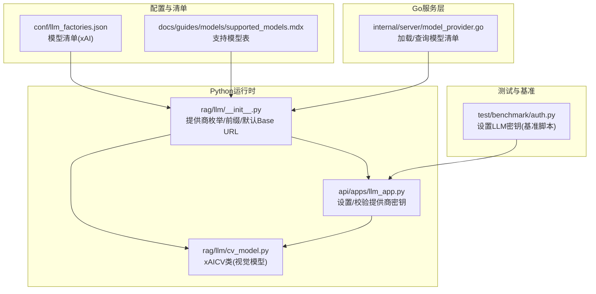
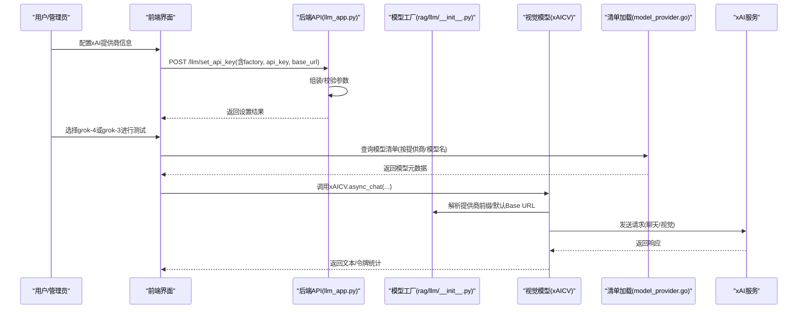
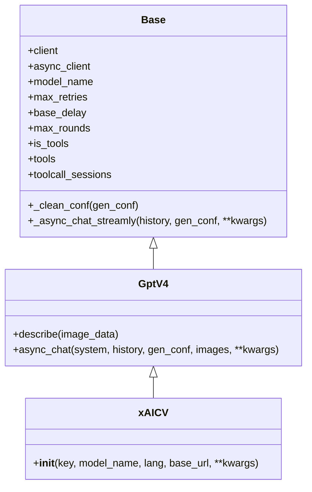
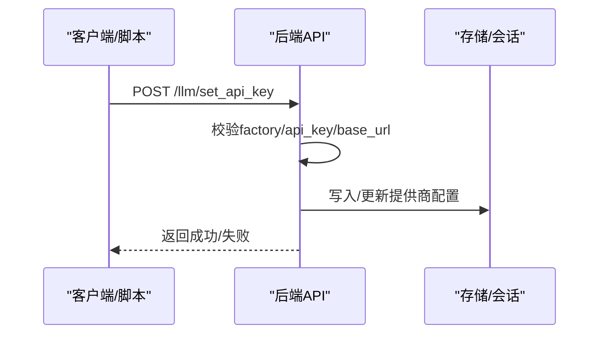
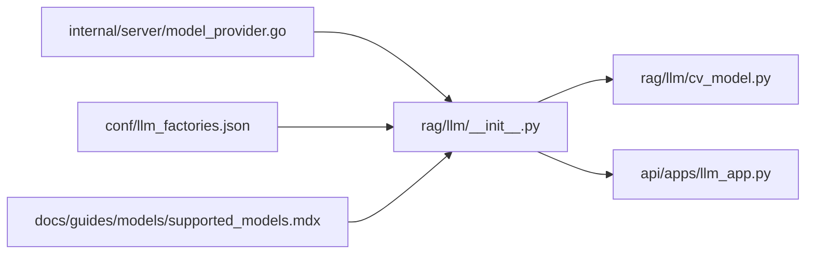

# xAI集成

<cite>
**本文引用的文件**
- [rag/llm/__init__.py](file://rag/llm/__init__.py)
- [rag/llm/cv_model.py](file://rag/llm/cv_model.py)
- [conf/llm_factories.json](file://conf/llm_factories.json)
- [docs/guides/models/supported_models.mdx](file://docs/guides/models/supported_models.mdx)
- [internal/server/model_provider.go](file://internal/server/model_provider.go)
- [api/apps/llm_app.py](file://api/apps/llm_app.py)
- [test/benchmark/auth.py](file://test/benchmark/auth.py)
</cite>

## 目录
1. [简介](#简介)
2. [项目结构](#项目结构)
3. [核心组件](#核心组件)
4. [架构总览](#架构总览)
5. [详细组件分析](#详细组件分析)
6. [依赖关系分析](#依赖关系分析)
7. [性能考量](#性能考量)
8. [故障排查指南](#故障排查指南)
9. [结论](#结论)
10. [附录](#附录)

## 简介
本技术文档面向在RAGFlow中集成xAI（Grok）模型提供商的开发者，系统性说明grok-4、grok-3等Grok系列模型的配置、认证、请求与响应处理、以及在RAGFlow中的接入方式。文档同时阐述Grok模型在视觉理解与推理方面的特点，并提供完整的配置示例、使用指南、API限制、性能优化与最佳实践建议，帮助开发者高效利用xAI模型的强大能力。

## 项目结构
围绕xAI/Grok模型的集成涉及以下关键位置：
- 模型工厂与提供商映射：定义支持的提供商与前缀、默认Base URL
- 模型清单：声明grok-4、grok-3等可用模型及其特性
- 视觉模型适配：针对图像/视频理解的GPT-4V适配类
- 后端服务：加载模型清单并提供查询接口
- 前后端API：设置与验证提供商密钥、调用模型
- 文档与清单：官方支持模型列表

**图表来源**
- [conf/llm_factories.json:202-251](file://conf/llm_factories.json#L202-L251)
- [rag/llm/__init__.py:25-130](file://rag/llm/__init__.py#L25-L130)
- [rag/llm/cv_model.py:293-300](file://rag/llm/cv_model.py#L293-L300)
- [api/apps/llm_app.py:172-237](file://api/apps/llm_app.py#L172-L237)
- [internal/server/model_provider.go:53-116](file://internal/server/model_provider.go#L53-L116)
- [test/benchmark/auth.py:64-88](file://test/benchmark/auth.py#L64-L88)

**章节来源**
- [conf/llm_factories.json:202-251](file://conf/llm_factories.json#L202-L251)
- [rag/llm/__init__.py:25-130](file://rag/llm/__init__.py#L25-L130)
- [rag/llm/cv_model.py:293-300](file://rag/llm/cv_model.py#L293-L300)
- [api/apps/llm_app.py:172-237](file://api/apps/llm_app.py#L172-L237)
- [internal/server/model_provider.go:53-116](file://internal/server/model_provider.go#L53-L116)
- [docs/guides/models/supported_models.mdx:65-65](file://docs/guides/models/supported_models.mdx#L65-L65)
- [test/benchmark/auth.py:64-88](file://test/benchmark/auth.py#L64-L88)

## 核心组件
- 提供商枚举与前缀
  - 在提供商枚举中新增“xAI”，并为其配置统一前缀与默认Base URL，确保通过通用接口路由到xAI服务。
- 模型清单
  - 在模型清单中声明grok-4、grok-3、grok-3-fast、grok-3-mini、grok-2-vision等模型，标注最大token数与是否支持工具调用。
- 视觉模型适配
  - 定义xAICV类继承GPT-4V适配器，指定默认Base URL为xAI官方API，并复用通用的多模态对话能力。
- 清单加载与查询
  - Go侧加载JSON清单，提供按提供商与模型名查询的能力，便于前端与服务端统一管理。
- 前后端API
  - 后端提供设置/校验提供商密钥的接口；前端通过该接口完成xAI密钥的保存与验证；基准脚本提供自动化设置密钥的示例。

**章节来源**
- [rag/llm/__init__.py:25-130](file://rag/llm/__init__.py#L25-L130)
- [conf/llm_factories.json:202-251](file://conf/llm_factories.json#L202-L251)
- [rag/llm/cv_model.py:293-300](file://rag/llm/cv_model.py#L293-L300)
- [internal/server/model_provider.go:53-116](file://internal/server/model_provider.go#L53-L116)
- [api/apps/llm_app.py:172-237](file://api/apps/llm_app.py#L172-L237)
- [test/benchmark/auth.py:64-88](file://test/benchmark/auth.py#L64-L88)

## 架构总览
下图展示了从用户配置到模型调用的关键路径，涵盖密钥设置、模型发现、请求转发与响应处理。

**图表来源**
- [api/apps/llm_app.py:172-237](file://api/apps/llm_app.py#L172-L237)
- [rag/llm/__init__.py:25-130](file://rag/llm/__init__.py#L25-L130)
- [rag/llm/cv_model.py:293-300](file://rag/llm/cv_model.py#L293-L300)
- [internal/server/model_provider.go:53-116](file://internal/server/model_provider.go#L53-L116)

## 详细组件分析

### 组件A：提供商枚举与前缀/默认Base URL
- 功能要点
  - 定义“xAI”提供商常量，并将其映射到统一前缀“xai/”，以便在通用路由中识别。
  - 提供默认Base URL字典，xAI默认指向官方v1端点，便于直接调用。
- 关键路径
  - 提供商枚举与前缀映射：[rag/llm/__init__.py:25-130](file://rag/llm/__init__.py#L25-L130)
- 使用建议
  - 若需自定义代理或特定区域端点，可在调用侧传入base_url覆盖默认值。

**章节来源**
- [rag/llm/__init__.py:25-130](file://rag/llm/__init__.py#L25-L130)

### 组件B：模型清单与Grok系列模型
- 功能要点
  - 在模型清单中声明grok-4、grok-3、grok-3-fast、grok-3-mini、grok-2-vision等模型，标注最大token数与工具调用支持情况。
  - 支持模型列表页面展示“xAI”列，表明其在视觉与聊天场景的支持状态。
- 关键路径
  - 模型清单（xAI部分）：[conf/llm_factories.json:202-251](file://conf/llm_factories.json#L202-L251)
  - 支持模型表（xAI列）：[docs/guides/models/supported_models.mdx:65-65](file://docs/guides/models/supported_models.mdx#L65-L65)
- 使用建议
  - grok-4具备更大上下文与工具调用能力，适合复杂推理与RAG任务；grok-3系列适合通用对话与视觉理解。

**章节来源**
- [conf/llm_factories.json:202-251](file://conf/llm_factories.json#L202-L251)
- [docs/guides/models/supported_models.mdx:65-65](file://docs/guides/models/supported_models.mdx#L65-L65)

### 组件C：xAI视觉模型适配（xAICV）
- 功能要点
  - 继承GPT-4V适配器，构造函数中默认Base URL为“https://api.x.ai/v1”，复用通用多模态对话能力。
  - 通过统一的async_chat接口对外提供服务，内部按提供商前缀与Base URL进行请求转发。
- 关键路径
  - xAICV类定义：[rag/llm/cv_model.py:293-300](file://rag/llm/cv_model.py#L293-L300)
- 使用建议
  - 视觉理解场景优先选用grok-2-vision；通用聊天可选grok-4或grok-3。

**图表来源**
- [rag/llm/cv_model.py:293-300](file://rag/llm/cv_model.py#L293-L300)

**章节来源**
- [rag/llm/cv_model.py:293-300](file://rag/llm/cv_model.py#L293-L300)

### 组件D：模型清单加载与查询（Go服务）
- 功能要点
  - 读取JSON清单，构建提供商索引，支持按提供商名称与模型名称查询LLM元数据。
- 关键路径
  - 清单加载与查询：[internal/server/model_provider.go:53-116](file://internal/server/model_provider.go#L53-L116)
- 使用建议
  - 前端或服务端在渲染可用模型列表或进行模型校验时，可通过该接口获取最新清单。

**章节来源**
- [internal/server/model_provider.go:53-116](file://internal/server/model_provider.go#L53-L116)

### 组件E：前后端API与密钥设置
- 功能要点
  - 后端提供设置/校验提供商密钥的接口，支持多种提供商的特殊字段组装。
  - 基准脚本提供统一的设置密钥方法，便于自动化测试与部署。
- 关键路径
  - 设置密钥接口（后端）：[api/apps/llm_app.py:172-237](file://api/apps/llm_app.py#L172-L237)
  - 设置密钥方法（基准脚本）：[test/benchmark/auth.py:64-88](file://test/benchmark/auth.py#L64-L88)

**图表来源**
- [api/apps/llm_app.py:172-237](file://api/apps/llm_app.py#L172-L237)
- [test/benchmark/auth.py:64-88](file://test/benchmark/auth.py#L64-L88)

**章节来源**
- [api/apps/llm_app.py:172-237](file://api/apps/llm_app.py#L172-L237)
- [test/benchmark/auth.py:64-88](file://test/benchmark/auth.py#L64-L88)

## 依赖关系分析
- 模块耦合
  - 模型工厂与提供商前缀/默认Base URL由Python侧集中维护，视觉模型类通过统一前缀与Base URL进行请求转发。
  - 清单加载由Go侧负责，提供稳定的查询接口，避免重复解析与缓存问题。
- 外部依赖
  - xAI官方API v1端点，遵循OpenAI兼容的请求格式与响应结构。
- 潜在风险
  - 若Base URL变更或网络异常，需通过重试与超时策略保障稳定性。

**图表来源**
- [rag/llm/__init__.py:25-130](file://rag/llm/__init__.py#L25-L130)
- [rag/llm/cv_model.py:293-300](file://rag/llm/cv_model.py#L293-L300)
- [api/apps/llm_app.py:172-237](file://api/apps/llm_app.py#L172-L237)
- [internal/server/model_provider.go:53-116](file://internal/server/model_provider.go#L53-L116)
- [conf/llm_factories.json:202-251](file://conf/llm_factories.json#L202-L251)
- [docs/guides/models/supported_models.mdx:65-65](file://docs/guides/models/supported_models.mdx#L65-L65)

**章节来源**
- [rag/llm/__init__.py:25-130](file://rag/llm/__init__.py#L25-L130)
- [rag/llm/cv_model.py:293-300](file://rag/llm/cv_model.py#L293-L300)
- [api/apps/llm_app.py:172-237](file://api/apps/llm_app.py#L172-L237)
- [internal/server/model_provider.go:53-116](file://internal/server/model_provider.go#L53-L116)
- [conf/llm_factories.json:202-251](file://conf/llm_factories.json#L202-L251)
- [docs/guides/models/supported_models.mdx:65-65](file://docs/guides/models/supported_models.mdx#L65-L65)

## 性能考量
- 上下文长度与工具调用
  - grok-4具备更大上下文与工具调用能力，适合长文档检索增强与复杂推理任务；grok-3系列适合通用场景。
- 请求超时与重试
  - 建议结合环境变量配置超时与重试次数，以应对网络抖动与限流。
- 视觉理解
  - grok-2-vision适用于图像/视频理解任务，注意控制输入尺寸与帧率以平衡质量与延迟。

[本节为通用指导，无需具体文件分析]

## 故障排查指南
- 认证失败
  - 确认已通过后端接口正确设置xAI密钥与Base URL；检查密钥有效期与权限范围。
- 请求超时/限流
  - 调整超时时间与重试间隔；必要时切换至代理Base URL或降低并发。
- 视觉模型错误
  - 检查输入图像/视频格式与大小；确认模型名称与提供商匹配。

**章节来源**
- [api/apps/llm_app.py:172-237](file://api/apps/llm_app.py#L172-L237)
- [rag/llm/cv_model.py:293-300](file://rag/llm/cv_model.py#L293-L300)

## 结论
通过在RAGFlow中集成xAI（Grok）模型，开发者可以便捷地使用grok-4、grok-3等高能力模型进行对话与视觉理解任务。依托统一的提供商前缀、默认Base URL与模型清单，配合Go侧的清单加载与查询能力，以及前后端的密钥设置接口，能够快速完成配置与上线。建议在生产环境中结合上下文长度、工具调用与视觉理解需求选择合适的模型，并通过合理的超时与重试策略提升稳定性。

[本节为总结，无需具体文件分析]

## 附录

### A. 配置示例与使用步骤
- 设置xAI提供商密钥
  - 通过后端接口提交factory为“xAI”、api_key为你的xAI密钥、base_url为官方v1端点或自定义代理端点。
  - 参考路径：[api/apps/llm_app.py:172-237](file://api/apps/llm_app.py#L172-L237)
- 选择模型
  - 在模型清单中选择grok-4、grok-3或grok-2-vision；参考清单路径：[conf/llm_factories.json:202-251](file://conf/llm_factories.json#L202-L251)
- 调用视觉模型
  - 使用xAICV类的异步接口进行图像/视频理解；参考类定义：[rag/llm/cv_model.py:293-300](file://rag/llm/cv_model.py#L293-L300)
- 自动化设置密钥（基准脚本）
  - 使用基准脚本提供的方法统一设置LLM密钥；参考路径：[test/benchmark/auth.py:64-88](file://test/benchmark/auth.py#L64-L88)

**章节来源**
- [api/apps/llm_app.py:172-237](file://api/apps/llm_app.py#L172-L237)
- [conf/llm_factories.json:202-251](file://conf/llm_factories.json#L202-L251)
- [rag/llm/cv_model.py:293-300](file://rag/llm/cv_model.py#L293-L300)
- [test/benchmark/auth.py:64-88](file://test/benchmark/auth.py#L64-L88)

### B. API限制与最佳实践
- API限制
  - 请以xAI官方文档为准，关注速率限制、并发与配额。
- 最佳实践
  - 优先使用grok-4进行复杂推理与RAG；通用对话可选grok-3；视觉理解优先grok-2-vision。
  - 控制请求超时与重试次数，合理设置并发度。
  - 对于长文档，优先采用分段检索与摘要策略，减少上下文开销。

[本节为通用指导，无需具体文件分析]