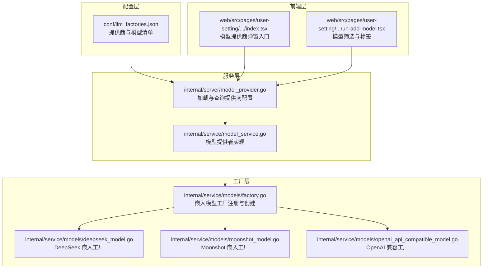
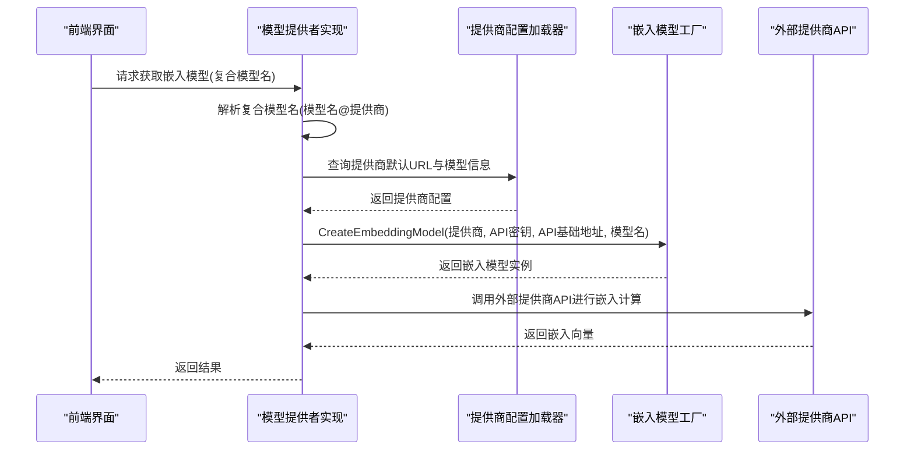
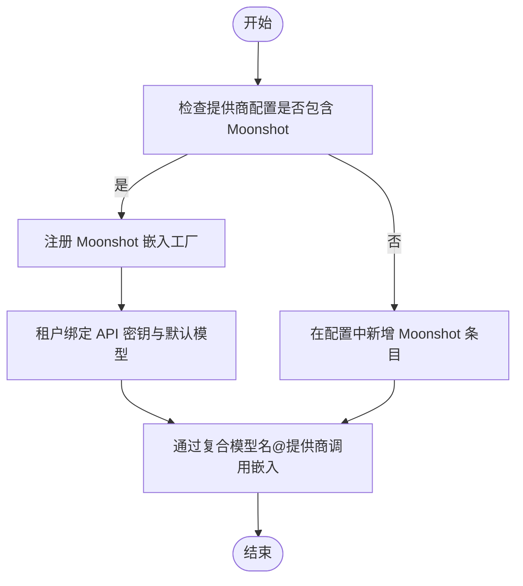
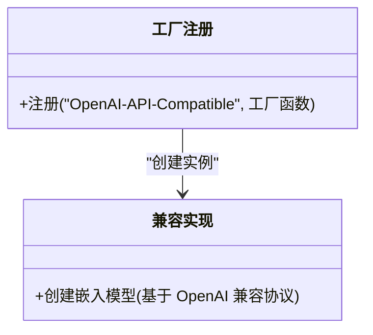
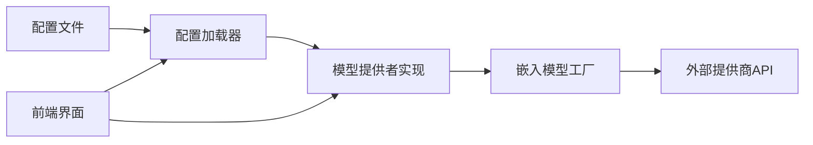

# 其他提供商集成

<cite>
**本文引用的文件**
- [llm_factories.json](file://conf/llm_factories.json)
- [model_provider.go](file://internal/server/model_provider.go)
- [factory.go](file://internal/service/models/factory.go)
- [deepseek_model.go](file://internal/service/models/deepseek_model.go)
- [moonshot_model.go](file://internal/service/models/moonshot_model.go)
- [openai_api_compatible_model.go](file://internal/service/models/openai_api_compatible_model.go)
- [model_service.go](file://internal/service/model_service.go)
- [model_providers.py](file://test/playwright/helpers/model_providers.py)
- [index.tsx](file://web/src/pages/user-setting/setting-model/index.tsx)
- [un-add-model.tsx](file://web/src/pages/user-setting/setting-model/components/un-add-model.tsx)
</cite>

## 目录
1. [简介](#简介)
2. [项目结构](#项目结构)
3. [核心组件](#核心组件)
4. [架构总览](#架构总览)
5. [详细组件分析](#详细组件分析)
6. [依赖分析](#依赖分析)
7. [性能考虑](#性能考虑)
8. [故障排查指南](#故障排查指南)
9. [结论](#结论)
10. [附录](#附录)

## 简介
本文件面向希望在 RAGFlow 中集成第三方模型提供商（如 DeepSeek、Moonshot 等）的开发者，系统性说明以下内容：
- 各提供商的 API 特点与支持的模型类型
- 在 RAGFlow 中的集成方式与扩展路径
- 配置示例与集成步骤
- API 限制、性能特征与使用建议
- 如何基于现有框架添加新的模型提供商

## 项目结构
RAGFlow 的模型提供商集成主要由以下模块协同完成：
- 配置层：通过 JSON 文件集中声明提供商与模型清单
- 服务层：加载配置、解析复合模型名、按租户选择可用模型
- 工厂层：按提供商名称动态创建嵌入模型实例
- 前端层：提供模型添加与校验的用户界面

**图表来源**
- [llm_factories.json](file://conf/llm_factories.json)
- [model_provider.go](file://internal/server/model_provider.go)
- [model_service.go](file://internal/service/model_service.go)
- [factory.go](file://internal/service/models/factory.go)
- [deepseek_model.go](file://internal/service/models/deepseek_model.go)
- [moonshot_model.go](file://internal/service/models/moonshot_model.go)
- [openai_api_compatible_model.go](file://internal/service/models/openai_api_compatible_model.go)
- [index.tsx](file://web/src/pages/user-setting/setting-model/index.tsx)
- [un-add-model.tsx](file://web/src/pages/user-setting/setting-model/components/un-add-model.tsx)

**章节来源**
- [llm_factories.json](file://conf/llm_factories.json)
- [model_provider.go](file://internal/server/model_provider.go)
- [model_service.go](file://internal/service/model_service.go)
- [factory.go](file://internal/service/models/factory.go)
- [index.tsx](file://web/src/pages/user-setting/setting-model/index.tsx)
- [un-add-model.tsx](file://web/src/pages/user-setting/setting-model/components/un-add-model.tsx)

## 核心组件
- 提供商配置加载器：从 JSON 加载提供商与模型清单，并建立名称到索引的映射，便于快速查找
- 模型工厂注册与创建：以“提供商名称”为键注册工厂函数，运行时按提供商创建对应嵌入模型实例
- 租户模型提供者：根据租户与复合模型名（格式：模型名@提供商），解析出提供商与模型名，结合配置生成实际调用地址
- 前端模型管理：提供模型添加弹窗、搜索与标签筛选，辅助用户选择合适的提供商与模型

**章节来源**
- [model_provider.go](file://internal/server/model_provider.go)
- [factory.go](file://internal/service/models/factory.go)
- [model_service.go](file://internal/service/model_service.go)
- [index.tsx](file://web/src/pages/user-setting/setting-model/index.tsx)
- [un-add-model.tsx](file://web/src/pages/user-setting/setting-model/components/un-add-model.tsx)

## 架构总览
下图展示了从配置到运行时创建嵌入模型的完整流程。

**图表来源**
- [model_service.go](file://internal/service/model_service.go)
- [model_provider.go](file://internal/server/model_provider.go)
- [factory.go](file://internal/service/models/factory.go)

## 详细组件分析

### DeepSeek 集成
- API 特点
  - 默认访问地址在提供商配置中定义
  - 支持多种聊天与推理模型，适用于代码理解与复杂推理场景
- 集成方式
  - 通过嵌入模型工厂注册，复用 OpenAI 兼容的嵌入调用逻辑
  - 在配置文件中声明 DeepSeek 提供商及其模型清单
- 使用场景
  - 需要强代码理解与推理能力的任务，可优先选择 DeepSeek 的推理类模型
- 配置示例
  - 在提供商配置中添加 DeepSeek 提供商条目，并列出支持的模型
  - 在租户侧绑定 API 密钥与默认模型
- 性能与限制
  - 嵌入调用遵循提供商默认 URL 与模型参数
  - 建议结合最大上下文长度与工具调用能力选择合适模型

**图表来源**
- [deepseek_model.go](file://internal/service/models/deepseek_model.go)
- [llm_factories.json](file://conf/llm_factories.json)

**章节来源**
- [deepseek_model.go](file://internal/service/models/deepseek_model.go)
- [llm_factories.json](file://conf/llm_factories.json)

### Moonshot 集成
- API 特点
  - 默认访问地址在提供商配置中定义
  - 提供多尺寸上下文的聊天与视觉模型，适合长文本处理与图文理解
- 集成方式
  - 通过嵌入模型工厂注册，复用 OpenAI 兼容的嵌入调用逻辑
  - 在配置文件中声明 Moonshot 提供商及其模型清单
- 使用场景
  - 长文档问答、报告生成、多轮对话与图文结合任务
- 配置示例
  - 在提供商配置中添加 Moonshot 提供商条目，并列出支持的模型
  - 在租户侧绑定 API 密钥与默认模型
- 性能与限制
  - 嵌入调用遵循提供商默认 URL 与模型参数
  - 注意不同模型的最大上下文长度与工具调用能力差异

**图表来源**
- [moonshot_model.go](file://internal/service/models/moonshot_model.go)
- [llm_factories.json](file://conf/llm_factories.json)

**章节来源**
- [moonshot_model.go](file://internal/service/models/moonshot_model.go)
- [llm_factories.json](file://conf/llm_factories.json)

### OpenAI 兼容提供商集成
- API 特点
  - 通过统一的兼容工厂，适配遵循 OpenAI 协议的第三方提供商
- 集成方式
  - 注册“OpenAI-API-Compatible”工厂，复用 OpenAI 兼容的嵌入调用逻辑
- 使用场景
  - 快速接入遵循 OpenAI 协议的自建或第三方服务
- 配置示例
  - 在提供商配置中添加兼容提供商条目，并设置默认 URL
  - 在租户侧绑定 API 密钥与默认模型

**图表来源**
- [openai_api_compatible_model.go](file://internal/service/models/openai_api_compatible_model.go)
- [factory.go](file://internal/service/models/factory.go)

**章节来源**
- [openai_api_compatible_model.go](file://internal/service/models/openai_api_compatible_model.go)
- [factory.go](file://internal/service/models/factory.go)

### 配置与前端集成要点
- 配置文件
  - 在提供商配置中新增条目，包含提供商名称、默认 URL、模型清单与标签
  - 模型清单包含模型名、标签、最大上下文、模型类型与是否支持工具调用
- 前端
  - 提供模型添加弹窗与筛选标签，便于用户选择合适的提供商与模型
  - 通过本地存储中的认证信息进行 API 校验与资源准备

**章节来源**
- [llm_factories.json](file://conf/llm_factories.json)
- [index.tsx](file://web/src/pages/user-setting/setting-model/index.tsx)
- [un-add-model.tsx](file://web/src/pages/user-setting/setting-model/components/un-add-model.tsx)

## 依赖分析
- 配置依赖
  - 服务层依赖配置文件加载提供商与模型信息
- 运行时依赖
  - 工厂层按提供商名称创建模型实例
  - 服务层根据租户与复合模型名解析提供商与模型
- 前后端依赖
  - 前端负责模型选择与校验，后端负责实际调用与返回结果

**图表来源**
- [llm_factories.json](file://conf/llm_factories.json)
- [model_provider.go](file://internal/server/model_provider.go)
- [model_service.go](file://internal/service/model_service.go)
- [factory.go](file://internal/service/models/factory.go)

**章节来源**
- [model_provider.go](file://internal/server/model_provider.go)
- [model_service.go](file://internal/service/model_service.go)
- [factory.go](file://internal/service/models/factory.go)

## 性能考虑
- 上下文长度与成本
  - 不同模型的最大上下文长度差异较大，应根据任务长度选择合适模型
- 工具调用能力
  - 部分模型支持工具调用，可提升复杂任务的自动化程度
- 嵌入调用稳定性
  - 通过统一的工厂与配置加载，减少调用错误与超时风险
- 前端筛选效率
  - 前端提供标签与搜索功能，有助于快速定位目标模型

[本节为通用指导，无需引用具体文件]

## 故障排查指南
- 常见问题
  - 复合模型名格式不正确：确保采用“模型名@提供商”的格式
  - 未找到提供商默认 URL：检查配置文件中提供商条目的默认 URL 是否填写
  - 租户未绑定 API 密钥：确认租户侧已绑定有效密钥
  - 前端无法获取模型列表：检查本地存储中的认证信息是否正确
- 定位方法
  - 通过测试辅助脚本验证提供商与模型是否存在
  - 查看服务层日志，确认解析与创建流程是否成功

**章节来源**
- [model_service.go](file://internal/service/model_service.go)
- [model_providers.py](file://test/playwright/helpers/model_providers.py)

## 结论
通过统一的配置文件、工厂注册与服务层封装，RAGFlow 能够以较低成本集成 DeepSeek、Moonshot 等第三方提供商。开发者只需在配置中声明提供商与模型清单，并在租户侧绑定密钥，即可通过复合模型名完成调用。对于新提供商，遵循相同的工厂注册与配置加载模式即可快速接入。

[本节为总结，无需引用具体文件]

## 附录

### 添加新提供商的步骤清单
- 在配置文件中新增提供商条目，填写名称、默认 URL、模型清单与标签
- 在工厂层注册对应的嵌入模型工厂（若与 OpenAI 协议兼容，可直接复用兼容工厂）
- 在前端完善模型添加弹窗与筛选逻辑
- 在租户侧绑定 API 密钥与默认模型
- 进行集成测试，验证调用链路与返回结果

**章节来源**
- [llm_factories.json](file://conf/llm_factories.json)
- [factory.go](file://internal/service/models/factory.go)
- [index.tsx](file://web/src/pages/user-setting/setting-model/index.tsx)
- [un-add-model.tsx](file://web/src/pages/user-setting/setting-model/components/un-add-model.tsx)