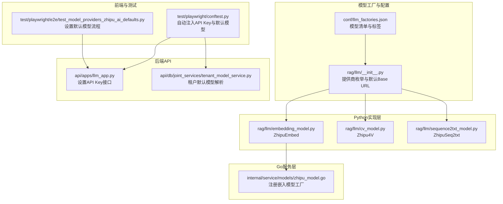
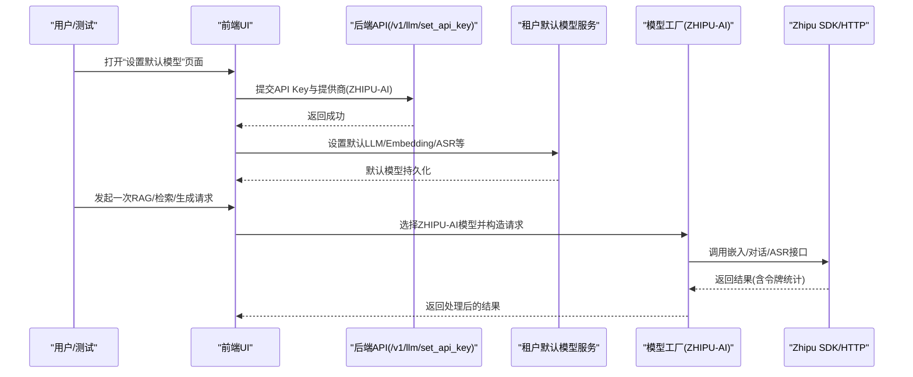
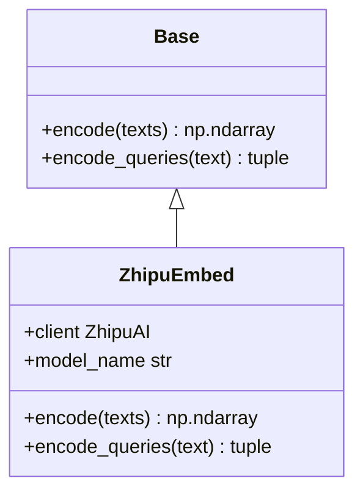
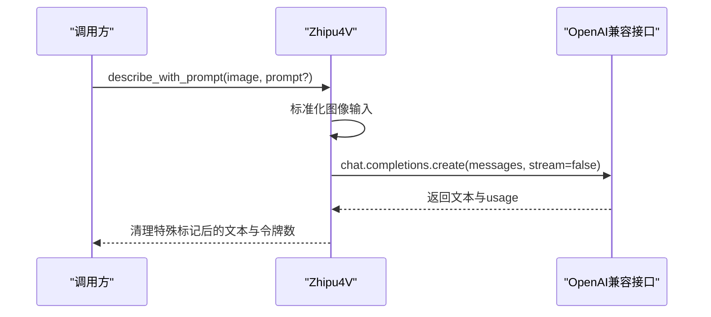
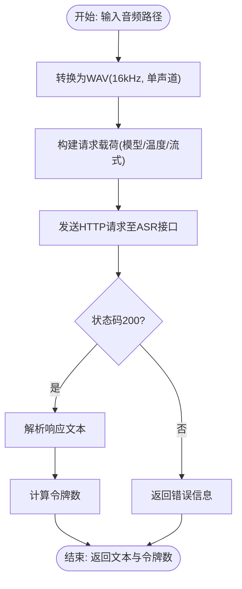
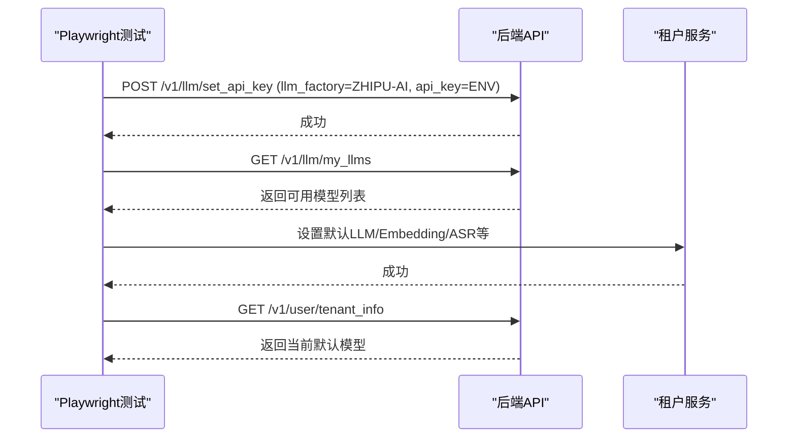
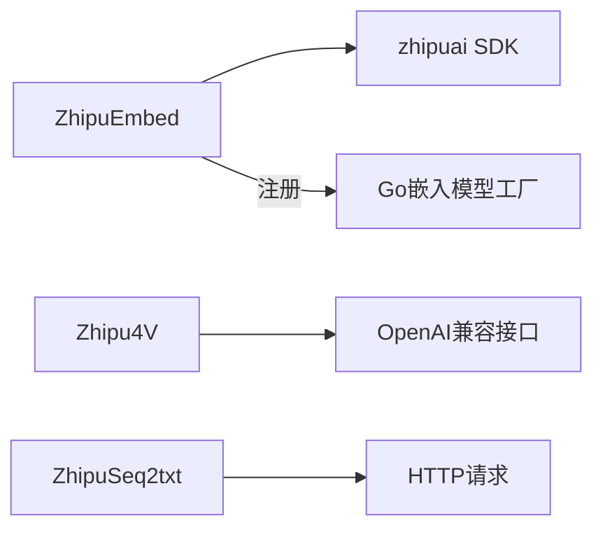

# 智谱AI集成

<cite>
**本文档引用的文件**
- [rag/llm/__init__.py](file://rag/llm/__init__.py)
- [rag/llm/embedding_model.py](file://rag/llm/embedding_model.py)
- [rag/llm/cv_model.py](file://rag/llm/cv_model.py)
- [rag/llm/sequence2txt_model.py](file://rag/llm/sequence2txt_model.py)
- [internal/service/models/zhipu_model.go](file://internal/service/models/zhipu_model.go)
- [conf/llm_factories.json](file://conf/llm_factories.json)
- [test/playwright/e2e/test_model_providers_zhipu_ai_defaults.py](file://test/playwright/e2e/test_model_providers_zhipu_ai_defaults.py)
- [test/playwright/conftest.py](file://test/playwright/conftest.py)
- [api/apps/llm_app.py](file://api/apps/llm_app.py)
- [api/db/joint_services/tenant_model_service.py](file://api/db/joint_services/tenant_model_service.py)
</cite>

## 目录
1. [简介](#简介)
2. [项目结构](#项目结构)
3. [核心组件](#核心组件)
4. [架构总览](#架构总览)
5. [详细组件分析](#详细组件分析)
6. [依赖关系分析](#依赖关系分析)
7. [性能考量](#性能考量)
8. [故障排查指南](#故障排查指南)
9. [结论](#结论)
10. [附录](#附录)

## 简介
本文件面向在RAGFlow中集成智谱AI（ZHIPU-AI）模型提供商的技术与非技术读者，系统性阐述智谱清言平台在RAGFlow中的实现方式与使用方法。重点覆盖以下方面：
- 支持的模型类型：大模型对话（Chat）、视觉理解（Image2Text/Vision）、文本嵌入（Embedding）、语音识别（Speech2Text/ASR）、重排序（ReRank）等。
- 认证流程与配置：API Key注入、默认模型设置、租户级默认模型持久化。
- 请求参数与响应处理：统一的模型工厂映射、OpenAI兼容接口、流式与非流式响应处理。
- 平台特色与应用场景：中文理解与多模态能力在RAG场景中的应用。
- 配置示例与最佳实践：环境变量、前端设置流程、后端API调用方式。
- 性能与限制：批量处理、超时与重试策略、令牌计数与成本估算。

## 项目结构
智谱AI在RAGFlow中的集成主要分布在以下模块：
- 模型工厂与默认基地址：定义支持的提供商枚举与默认Base URL。
- 具体模型实现：嵌入、视觉理解、语音识别等适配层。
- 后端服务注册：Go侧嵌入模型工厂注册。
- 前端与测试：通过Playwright自动化测试验证API Key添加与默认模型设置流程。
- 配置清单：llm_factories.json中声明可用模型列表与标签。

**图表来源**
- [rag/llm/__init__.py:1-192](file://rag/llm/__init__.py#L1-L192)
- [rag/llm/embedding_model.py:222-257](file://rag/llm/embedding_model.py#L222-L257)
- [rag/llm/cv_model.py:417-512](file://rag/llm/cv_model.py#L417-L512)
- [rag/llm/sequence2txt_model.py:317-379](file://rag/llm/sequence2txt_model.py#L317-L379)
- [internal/service/models/zhipu_model.go:24-33](file://internal/service/models/zhipu_model.go#L24-L33)
- [conf/llm_factories.json:796-850](file://conf/llm_factories.json#L796-L850)
- [test/playwright/e2e/test_model_providers_zhipu_ai_defaults.py:122-257](file://test/playwright/e2e/test_model_providers_zhipu_ai_defaults.py#L122-L257)
- [test/playwright/conftest.py:1020-1139](file://test/playwright/conftest.py#L1020-L1139)
- [api/apps/llm_app.py:172-237](file://api/apps/llm_app.py#L172-L237)
- [api/db/joint_services/tenant_model_service.py:35-62](file://api/db/joint_services/tenant_model_service.py#L35-L62)

**章节来源**
- [rag/llm/__init__.py:1-192](file://rag/llm/__init__.py#L1-L192)
- [conf/llm_factories.json:796-850](file://conf/llm_factories.json#L796-L850)

## 核心组件
- 模型工厂与提供商枚举
  - 定义了ZHIPU-AI提供商名称与默认Base URL，确保后续模型实例化时使用正确的API端点。
- 嵌入模型（ZhipuEmbed）
  - 使用官方Python SDK进行文本嵌入生成，支持不同模型的最大输入长度裁剪。
- 视觉理解（Zhipu4V）
  - 基于OpenAI兼容接口实现图像描述与多模态对话，支持清理特殊标记与流式/非流式响应。
- 语音识别（ZhipuSeq2txt）
  - 通过HTTP请求调用智谱ASR接口，支持音频格式转换与分片上传。
- Go侧嵌入模型工厂注册
  - 在后端以通用OpenAI兼容方式注册ZHIPU-AI嵌入模型工厂，便于统一调度。

**章节来源**
- [rag/llm/__init__.py:25-90](file://rag/llm/__init__.py#L25-L90)
- [rag/llm/embedding_model.py:222-257](file://rag/llm/embedding_model.py#L222-L257)
- [rag/llm/cv_model.py:417-512](file://rag/llm/cv_model.py#L417-L512)
- [rag/llm/sequence2txt_model.py:317-379](file://rag/llm/sequence2txt_model.py#L317-L379)
- [internal/service/models/zhipu_model.go:24-33](file://internal/service/models/zhipu_model.go#L24-L33)

## 架构总览
下图展示了从用户配置到模型调用的关键路径，以及前后端交互与测试验证流程：

**图表来源**
- [test/playwright/e2e/test_model_providers_zhipu_ai_defaults.py:158-257](file://test/playwright/e2e/test_model_providers_zhipu_ai_defaults.py#L158-L257)
- [test/playwright/conftest.py:1020-1139](file://test/playwright/conftest.py#L1020-L1139)
- [api/apps/llm_app.py:172-237](file://api/apps/llm_app.py#L172-L237)
- [api/db/joint_services/tenant_model_service.py:35-62](file://api/db/joint_services/tenant_model_service.py#L35-L62)
- [rag/llm/__init__.py:64-90](file://rag/llm/__init__.py#L64-L90)

## 详细组件分析

### 模型工厂与默认Base URL
- 提供商枚举：包含ZHIPU-AI标识，用于在模型工厂映射中定位具体实现。
- 默认Base URL：ZHIPU-AI指向开放平台PAAS v4接口，确保所有OpenAI兼容调用走统一入口。
- 前缀映射：ZHIPU-AI使用"openai/"前缀，便于统一路由与代理。

**章节来源**
- [rag/llm/__init__.py:25-90](file://rag/llm/__init__.py#L25-L90)

### 嵌入模型（ZhipuEmbed）
- 实现要点
  - 使用官方SDK初始化客户端，传入API Key。
  - 根据模型名对输入文本进行最大长度裁剪，避免超出模型限制。
  - 统一返回向量数组与令牌计数，便于后续检索与成本统计。
- 错误处理
  - 对异常响应进行日志记录与异常抛出，保证上层可感知错误。

**图表来源**
- [rag/llm/embedding_model.py:36-50](file://rag/llm/embedding_model.py#L36-L50)
- [rag/llm/embedding_model.py:222-257](file://rag/llm/embedding_model.py#L222-L257)

**章节来源**
- [rag/llm/embedding_model.py:222-257](file://rag/llm/embedding_model.py#L222-L257)

### 视觉理解（Zhipu4V）
- 实现要点
  - 基于OpenAI兼容接口，支持图像描述与多模态对话。
  - 清理特殊标记（如边界框标记），提升输出稳定性。
  - 支持流式与非流式两种响应模式，流式模式按增量返回并统计令牌。
- 图像输入标准化
  - 将多种图像输入格式统一转为data URL或base64，确保API兼容性。

**图表来源**
- [rag/llm/cv_model.py:417-512](file://rag/llm/cv_model.py#L417-L512)

**章节来源**
- [rag/llm/cv_model.py:417-512](file://rag/llm/cv_model.py#L417-L512)

### 语音识别（ZhipuSeq2txt）
- 实现要点
  - 通过HTTP请求调用智谱ASR接口，支持温度、流式等参数传递。
  - 自动将输入音频转换为16kHz单声道WAV，满足平台要求。
  - 返回识别文本与令牌计数，便于后续处理。
- 流式识别
  - 支持分片返回中间结果，最终返回完整文本。

**图表来源**
- [rag/llm/sequence2txt_model.py:317-379](file://rag/llm/sequence2txt_model.py#L317-L379)

**章节来源**
- [rag/llm/sequence2txt_model.py:317-379](file://rag/llm/sequence2txt_model.py#L317-L379)

### Go侧嵌入模型工厂注册
- 注册逻辑
  - 在Go服务启动时注册ZHIPU-AI嵌入模型工厂，使用通用OpenAI兼容实现，确保与Python侧一致的调用体验。
- 适用场景
  - 后端直接调用嵌入模型或在某些服务中复用统一的嵌入工厂。

**章节来源**
- [internal/service/models/zhipu_model.go:24-33](file://internal/service/models/zhipu_model.go#L24-L33)

### 前端与测试：默认模型设置流程
- 自动化测试步骤
  - 登录后打开“设置默认模型”，搜索并添加ZHIPU-AI提供商，填写API Key。
  - 选择默认LLM（如glm-4-flash@ZHIPU-AI）、默认Embedding（如embedding-2@ZHIPU-AI）等。
  - 刷新页面验证默认值已持久化。
- 自动注入机制
  - 若存在环境变量ZHIPU_AI_API_KEY，则自动为当前租户设置API Key并推断默认模型。

**图表来源**
- [test/playwright/e2e/test_model_providers_zhipu_ai_defaults.py:158-257](file://test/playwright/e2e/test_model_providers_zhipu_ai_defaults.py#L158-L257)
- [test/playwright/conftest.py:1020-1139](file://test/playwright/conftest.py#L1020-L1139)

**章节来源**
- [test/playwright/e2e/test_model_providers_zhipu_ai_defaults.py:158-257](file://test/playwright/e2e/test_model_providers_zhipu_ai_defaults.py#L158-L257)
- [test/playwright/conftest.py:1020-1139](file://test/playwright/conftest.py#L1020-L1139)

### 后端API与租户默认模型解析
- 设置API Key
  - 后端根据提供商类型组装JSON键值（如ZHIPU-AI仅需api_key），写入数据库。
- 租户默认模型解析
  - 当模型名采用"name@factory"格式时，解析出纯模型名与工厂名，优先匹配ZHIPU-AI。
  - 若为内置嵌入且符合特定条件，回退到本地嵌入配置。

**章节来源**
- [api/apps/llm_app.py:172-237](file://api/apps/llm_app.py#L172-L237)
- [api/db/joint_services/tenant_model_service.py:35-62](file://api/db/joint_services/tenant_model_service.py#L35-L62)

## 依赖关系分析
- Python侧依赖
  - zhipuai SDK用于嵌入与ASR；OpenAI兼容客户端用于视觉理解与对话。
- Go侧依赖
  - 通过通用OpenAI兼容实现注册嵌入模型工厂，减少重复适配。
- 配置依赖
  - llm_factories.json声明可用模型与标签，前端与测试依据此清单进行选择。

**图表来源**
- [rag/llm/embedding_model.py:222-257](file://rag/llm/embedding_model.py#L222-L257)
- [rag/llm/cv_model.py:417-512](file://rag/llm/cv_model.py#L417-L512)
- [rag/llm/sequence2txt_model.py:317-379](file://rag/llm/sequence2txt_model.py#L317-L379)
- [internal/service/models/zhipu_model.go:24-33](file://internal/service/models/zhipu_model.go#L24-L33)

**章节来源**
- [rag/llm/embedding_model.py:222-257](file://rag/llm/embedding_model.py#L222-L257)
- [rag/llm/cv_model.py:417-512](file://rag/llm/cv_model.py#L417-L512)
- [rag/llm/sequence2txt_model.py:317-379](file://rag/llm/sequence2txt_model.py#L317-L379)
- [internal/service/models/zhipu_model.go:24-33](file://internal/service/models/zhipu_model.go#L24-L33)

## 性能考量
- 批量处理与令牌统计
  - 嵌入模型与对话均返回令牌计数，便于成本控制与预算管理。
- 超时与重试
  - 部分模型实现包含重试逻辑（如某些嵌入服务），建议在高并发场景下合理设置超时与并发度。
- 输入裁剪
  - 不同模型有最大输入长度限制，应在入库前进行裁剪，避免API错误。
- 流式响应
  - 视觉理解与语音识别支持流式返回，可改善用户体验，但需注意累积令牌统计的准确性。

[本节为通用指导，不直接分析具体文件]

## 故障排查指南
- API Key未配置
  - 现象：前端无法看到ZHIPU-AI提供商或默认模型为空。
  - 处理：在测试环境中设置ZHIPU_AI_API_KEY，或通过前端“设置默认模型”页面手动添加。
- 默认模型未生效
  - 现象：刷新页面后默认模型恢复为默认值。
  - 处理：确认已调用设置默认模型接口，并检查租户信息是否更新成功。
- 响应异常
  - 现象：嵌入/对话/ASR返回错误信息。
  - 处理：查看日志中的异常堆栈与响应体，确认模型名、API Key与Base URL是否正确。

**章节来源**
- [test/playwright/conftest.py:1020-1139](file://test/playwright/conftest.py#L1020-L1139)
- [test/playwright/e2e/test_model_providers_zhipu_ai_defaults.py:158-257](file://test/playwright/e2e/test_model_providers_zhipu_ai_defaults.py#L158-L257)
- [rag/llm/embedding_model.py:222-257](file://rag/llm/embedding_model.py#L222-L257)

## 结论
RAGFlow对智谱AI的集成采用“统一工厂 + OpenAI兼容”的设计，既保证了与智谱平台的无缝对接，又保持了与RAGFlow整体架构的一致性。通过明确的默认Base URL、模型工厂映射与前端自动化测试流程，开发者可以快速完成ZHIPU-AI的配置与上线。在实际部署中，建议结合令牌统计与输入裁剪策略，优化成本与稳定性。

[本节为总结性内容，不直接分析具体文件]

## 附录

### 配置清单与模型标签
- ZHIPU-AI提供商在llm_factories.json中声明，包含LLM、TEXT EMBEDDING、SPEECH2TEXT、MODERATION等标签。
- 常用模型示例
  - 对话：glm-4-flash、glm-4、glm-4.5v
  - 嵌入：embedding-2、embedding-3
  - ASR：glm-asr

**章节来源**
- [conf/llm_factories.json:796-850](file://conf/llm_factories.json#L796-L850)

### 环境变量与API Key注入
- 环境变量
  - ZHIPU_AI_API_KEY：用于测试与自动化脚本自动注入API Key。
- 自动注入流程
  - 若检测到ZHIPU_AI_API_KEY且租户未配置ZHIPU-AI，则自动调用设置API Key接口并设置默认模型。

**章节来源**
- [test/playwright/conftest.py:1020-1139](file://test/playwright/conftest.py#L1020-L1139)

### 后端API调用参考
- 设置API Key
  - 请求：POST /v1/llm/set_api_key
  - 参数：llm_factory=ZHIPU-AI, api_key=你的API Key
- 获取我的模型
  - 请求：GET /v1/llm/my_llms
- 设置租户默认模型
  - 请求：POST /v1/user/set_tenant_info
  - 参数：llm_id、embd_id、img2txt_id、asr_id、rerank_id、tts_id

**章节来源**
- [api/apps/llm_app.py:172-237](file://api/apps/llm_app.py#L172-L237)
- [test/playwright/e2e/test_model_providers_zhipu_ai_defaults.py:158-257](file://test/playwright/e2e/test_model_providers_zhipu_ai_defaults.py#L158-L257)