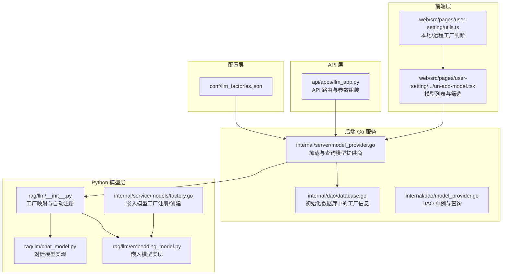
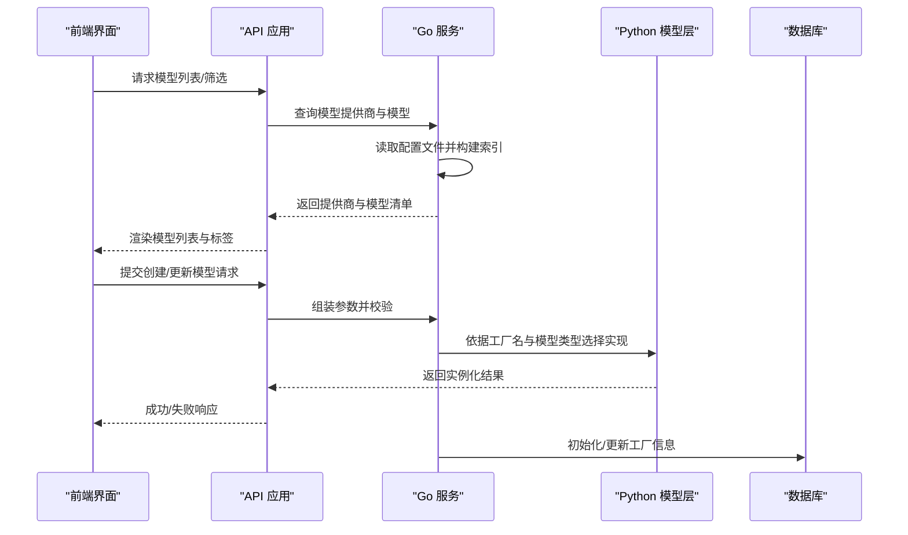
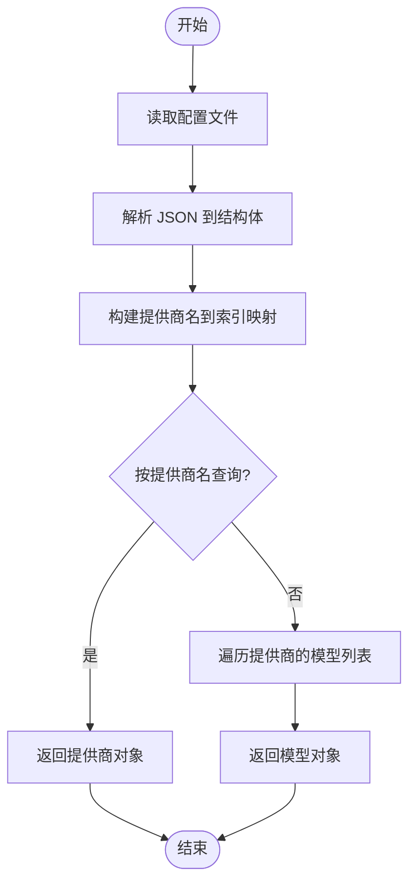
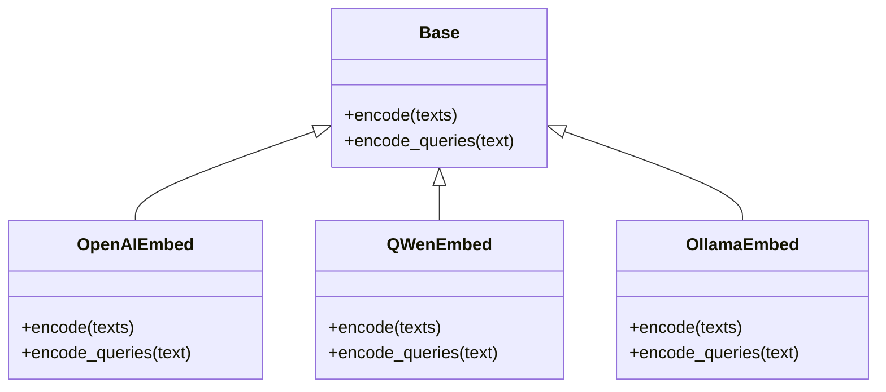
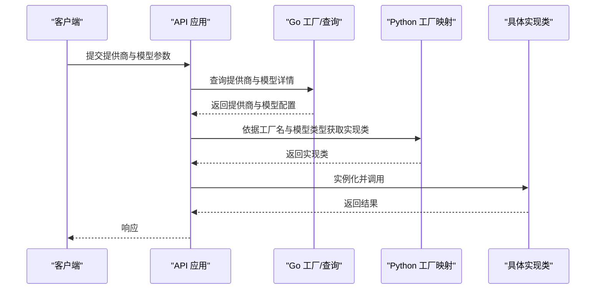
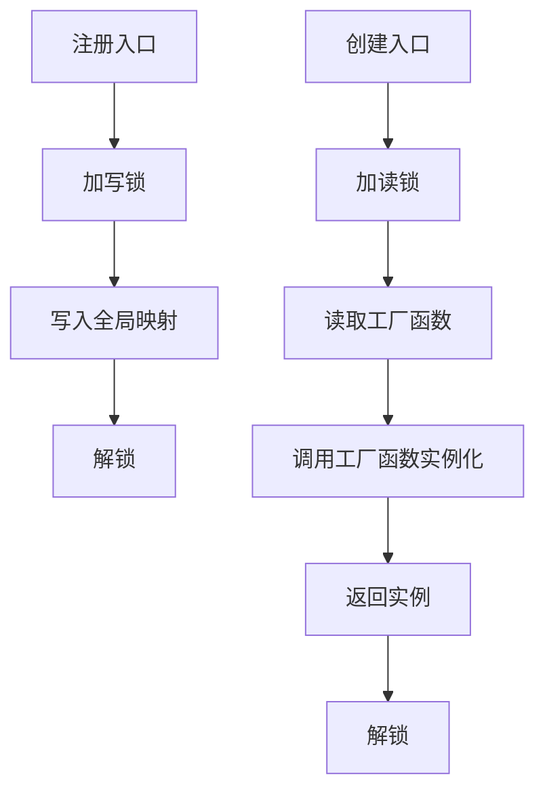
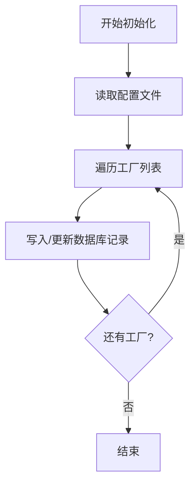
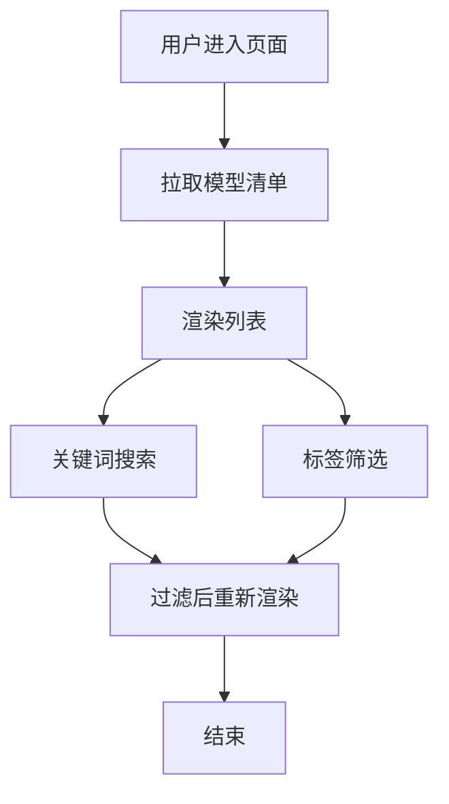
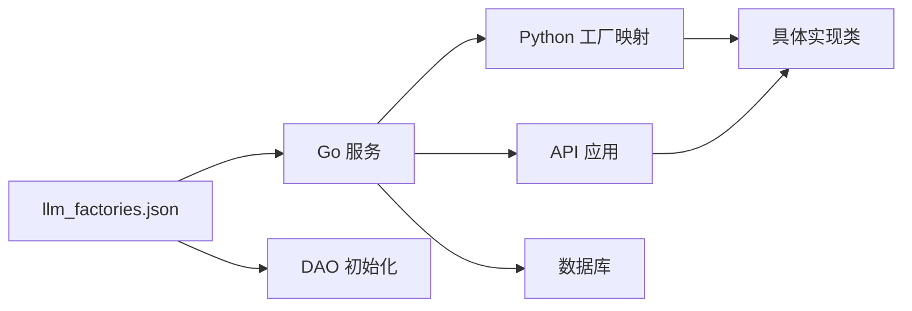

# 模型工厂模式

<cite>
**本文档引用的文件**
- [llm_factories.json](file://conf/llm_factories.json)
- [model_provider.go](file://internal/server/model_provider.go)
- [database.go](file://internal/dao/database.go)
- [llm_app.py](file://api/apps/llm_app.py)
- [chat_model.py](file://rag/llm/chat_model.py)
- [embedding_model.py](file://rag/llm/embedding_model.py)
- [__init__.py](file://rag/llm/__init__.py)
- [factory.go](file://internal/service/models/factory.go)
- [model_provider.go](file://internal/dao/model_provider.go)
- [un-add-model.tsx](file://web/src/pages/user-setting/setting-model/components/un-add-model.tsx)
- [utils.ts](file://web/src/pages/user-setting/utils.ts)
</cite>

## 目录
1. [简介](#简介)
2. [项目结构](#项目结构)
3. [核心组件](#核心组件)
4. [架构总览](#架构总览)
5. [详细组件分析](#详细组件分析)
6. [依赖关系分析](#依赖关系分析)
7. [性能考虑](#性能考虑)
8. [故障排查指南](#故障排查指南)
9. [结论](#结论)
10. [附录：扩展新模型提供商指南](#附录扩展新模型提供商指南)

## 简介
本文件系统性阐述 RAGFlow 中“模型工厂模式”的设计理念与实现原理，覆盖多模型提供商的统一管理、动态加载、注册机制、提供商发现流程、模型实例化过程、配置文件管理（模型名称、类型、参数）以及扩展新提供商的完整步骤。同时给出性能优化、内存管理与并发控制等高级主题，帮助开发者理解并扩展 RAGFlow 的模型管理架构。

## 项目结构
RAGFlow 的模型工厂相关能力横跨后端 Go 服务、Python 模型层、API 层与前端展示层：
- 配置层：以 JSON 文件集中描述各模型提供商及其模型清单
- 后端 Go 层：负责加载配置、提供查询接口、初始化数据库中的工厂信息
- Python 模型层：按工厂名映射到具体实现类，支持多种模型类型（对话、嵌入、重排序等）
- API 层：接收前端请求，组装模型参数并调用后端服务
- 前端层：展示可用模型、过滤与选择

图表来源
- [llm_factories.json:1-800](file://conf/llm_factories.json#L1-L800)
- [model_provider.go:53-116](file://internal/server/model_provider.go#L53-L116)
- [database.go:198-232](file://internal/dao/database.go#L198-L232)
- [llm_app.py:211-237](file://api/apps/llm_app.py#L211-L237)
- [__init__.py:151-181](file://rag/llm/__init__.py#L151-L181)
- [chat_model.py:115-120](file://rag/llm/chat_model.py#L115-L120)
- [embedding_model.py:36-50](file://rag/llm/embedding_model.py#L36-L50)
- [factory.go:26-58](file://internal/service/models/factory.go#L26-L58)
- [model_provider.go:24-43](file://internal/dao/model_provider.go#L24-L43)
- [un-add-model.tsx:50-79](file://web/src/pages/user-setting/setting-model/components/un-add-model.tsx#L50-L79)
- [utils.ts:1-4](file://web/src/pages/user-setting/utils.ts#L1-L4)

章节来源
- [llm_factories.json:1-800](file://conf/llm_factories.json#L1-L800)
- [model_provider.go:53-116](file://internal/server/model_provider.go#L53-L116)
- [database.go:198-232](file://internal/dao/database.go#L198-L232)
- [llm_app.py:211-237](file://api/apps/llm_app.py#L211-L237)
- [__init__.py:151-181](file://rag/llm/__init__.py#L151-L181)
- [chat_model.py:115-120](file://rag/llm/chat_model.py#L115-L120)
- [embedding_model.py:36-50](file://rag/llm/embedding_model.py#L36-L50)
- [factory.go:26-58](file://internal/service/models/factory.go#L26-L58)
- [model_provider.go:24-43](file://internal/dao/model_provider.go#L24-L43)
- [un-add-model.tsx:50-79](file://web/src/pages/user-setting/setting-model/components/un-add-model.tsx#L50-L79)
- [utils.ts:1-4](file://web/src/pages/user-setting/utils.ts#L1-L4)

## 核心组件
- 模型提供商配置文件：集中定义提供商名称、Logo、标签、状态、排序、默认 URL 以及该提供商下的多个模型条目（名称、标签、最大上下文、模型类型、是否支持工具等）
- Go 层模型提供商加载器：从配置文件读取并构建内存索引，提供按名称查找提供商与模型的能力
- Python 模型层工厂映射：通过模块扫描与属性检查，将具体实现类注册到工厂映射表；同时维护默认基础 URL 与提供商前缀映射
- API 层参数组装：根据前端输入与提供商信息，组装最终的模型调用参数
- 嵌入模型工厂注册/创建：在 Go 层为嵌入模型提供注册与创建接口，确保线程安全
- DAO 层初始化：将配置文件中的工厂信息写入数据库，便于运行时持久化管理
- 前端展示与筛选：提供模型列表、标签筛选与本地/远程工厂识别

章节来源
- [llm_factories.json:1-800](file://conf/llm_factories.json#L1-L800)
- [model_provider.go:53-116](file://internal/server/model_provider.go#L53-L116)
- [__init__.py:151-181](file://rag/llm/__init__.py#L151-L181)
- [llm_app.py:211-237](file://api/apps/llm_app.py#L211-L237)
- [factory.go:26-58](file://internal/service/models/factory.go#L26-L58)
- [database.go:198-232](file://internal/dao/database.go#L198-L232)
- [un-add-model.tsx:50-79](file://web/src/pages/user-setting/setting-model/components/un-add-model.tsx#L50-L79)
- [utils.ts:1-4](file://web/src/pages/user-setting/utils.ts#L1-L4)

## 架构总览
RAGFlow 的模型工厂采用“配置驱动 + 运行时映射 + 动态注册”的架构：
- 配置文件作为单一事实源，描述所有可用的模型提供商与模型
- 后端 Go 服务负责加载配置并建立快速查找索引
- Python 模型层通过反射式扫描与属性约定完成自动注册
- API 层根据提供商与模型类型选择合适的实现类
- 前端基于后端提供的模型清单进行展示与筛选

图表来源
- [llm_app.py:211-237](file://api/apps/llm_app.py#L211-L237)
- [model_provider.go:53-116](file://internal/server/model_provider.go#L53-L116)
- [database.go:198-232](file://internal/dao/database.go#L198-L232)
- [un-add-model.tsx:50-79](file://web/src/pages/user-setting/setting-model/components/un-add-model.tsx#L50-L79)

## 详细组件分析

### 配置文件与提供商发现流程
- 配置文件结构要点：包含提供商数组，每个提供商包含名称、Logo、标签、状态、排序、默认 URL 以及模型数组（模型名、标签、最大上下文、模型类型、是否支持工具等）
- 发现流程：Go 服务加载配置文件，解析为结构体切片；同时建立“提供商名到索引”的映射，实现 O(1) 查找；提供按提供商名与模型名的二次检索

图表来源
- [model_provider.go:53-116](file://internal/server/model_provider.go#L53-L116)
- [llm_factories.json:1-800](file://conf/llm_factories.json#L1-L800)

章节来源
- [model_provider.go:53-116](file://internal/server/model_provider.go#L53-L116)
- [llm_factories.json:1-800](file://conf/llm_factories.json#L1-L800)

### Python 工厂映射与自动注册
- 映射机制：通过导入各模型模块，扫描其中的基类与实现类，依据类属性约定（如 _FACTORY_NAME）将实现类注册到对应工厂映射表
- 默认基础 URL 与前缀：维护一个“提供商到默认基础 URL”和“提供商到请求前缀”的映射，用于兼容不同提供商的 API 形态
- 类型覆盖：对特定模型族（如某些推理模型）应用参数清理与策略，保证生成参数一致性

图表来源
- [embedding_model.py:36-50](file://rag/llm/embedding_model.py#L36-L50)
- [embedding_model.py:90-122](file://rag/llm/embedding_model.py#L90-L122)
- [embedding_model.py:173-220](file://rag/llm/embedding_model.py#L173-L220)
- [embedding_model.py:259-295](file://rag/llm/embedding_model.py#L259-L295)

章节来源
- [__init__.py:151-181](file://rag/llm/__init__.py#L151-L181)
- [embedding_model.py:36-50](file://rag/llm/embedding_model.py#L36-L50)
- [embedding_model.py:90-122](file://rag/llm/embedding_model.py#L90-L122)
- [embedding_model.py:173-220](file://rag/llm/embedding_model.py#L173-L220)
- [embedding_model.py:259-295](file://rag/llm/embedding_model.py#L259-L295)

### API 参数组装与模型实例化
- API 层根据前端提交的提供商与模型类型，组装最终调用参数（租户 ID、提供商、模型类型、模型名、API 基础地址、密钥、最大上下文等）
- Python 层依据提供商名与模型类型，从工厂映射中选择具体实现类并实例化
- 对于嵌入模型，Go 层提供工厂注册与创建接口，确保并发安全

图表来源
- [llm_app.py:211-237](file://api/apps/llm_app.py#L211-L237)
- [model_provider.go:104-116](file://internal/server/model_provider.go#L104-L116)
- [__init__.py:151-181](file://rag/llm/__init__.py#L151-L181)

章节来源
- [llm_app.py:211-237](file://api/apps/llm_app.py#L211-L237)
- [model_provider.go:104-116](file://internal/server/model_provider.go#L104-L116)
- [__init__.py:151-181](file://rag/llm/__init__.py#L151-L181)

### 嵌入模型工厂注册与创建（Go 层）
- 注册接口：在各提供商嵌入模型实现模块的初始化函数中调用注册函数，将“提供商名 -> 工厂函数”登记到全局映射
- 创建接口：根据提供商名获取工厂函数并传入密钥、基础地址、模型名与 HTTP 客户端，返回嵌入模型实例
- 并发安全：注册与获取均使用互斥锁保护

图表来源
- [factory.go:26-58](file://internal/service/models/factory.go#L26-L58)

章节来源
- [factory.go:26-58](file://internal/service/models/factory.go#L26-L58)

### 数据库初始化与持久化
- 初始化流程：读取配置文件，逐条写入数据库，若存在则更新，否则新增
- 字段映射：配置中的字段映射到数据库实体，包含名称、Logo、标签、排序、状态等

图表来源
- [database.go:198-232](file://internal/dao/database.go#L198-L232)

章节来源
- [database.go:198-232](file://internal/dao/database.go#L198-L232)

### 前端展示与筛选
- 列表渲染：根据后端返回的模型清单，渲染模型卡片与标签
- 筛选逻辑：支持关键词搜索与标签筛选，前端维护标签顺序映射并排序
- 本地/远程工厂识别：辅助判断是否为本地模型工厂，影响 UI 行为

图表来源
- [un-add-model.tsx:50-79](file://web/src/pages/user-setting/setting-model/components/un-add-model.tsx#L50-L79)
- [utils.ts:1-4](file://web/src/pages/user-setting/utils.ts#L1-L4)

章节来源
- [un-add-model.tsx:50-79](file://web/src/pages/user-setting/setting-model/components/un-add-model.tsx#L50-L79)
- [utils.ts:1-4](file://web/src/pages/user-setting/utils.ts#L1-L4)

## 依赖关系分析
- 配置文件依赖：Go 服务与 DAO 层均依赖配置文件；Python 模型层通过工厂映射间接依赖配置中的提供商名
- 运行时依赖：API 层依赖 Go 服务的查询能力；Python 层依赖工厂映射与默认 URL/前缀映射
- 并发依赖：Go 层的工厂注册/获取使用互斥锁；Python 层的内置嵌入模型使用线程锁保护共享模型实例

图表来源
- [llm_factories.json:1-800](file://conf/llm_factories.json#L1-L800)
- [model_provider.go:53-116](file://internal/server/model_provider.go#L53-L116)
- [database.go:198-232](file://internal/dao/database.go#L198-L232)
- [llm_app.py:211-237](file://api/apps/llm_app.py#L211-L237)
- [__init__.py:151-181](file://rag/llm/__init__.py#L151-L181)

章节来源
- [llm_factories.json:1-800](file://conf/llm_factories.json#L1-L800)
- [model_provider.go:53-116](file://internal/server/model_provider.go#L53-L116)
- [database.go:198-232](file://internal/dao/database.go#L198-L232)
- [llm_app.py:211-237](file://api/apps/llm_app.py#L211-L237)
- [__init__.py:151-181](file://rag/llm/__init__.py#L151-L181)

## 性能考虑
- 配置加载与缓存：配置文件仅在启动时加载一次，Go 层通过内存映射实现 O(1) 查找，避免重复 IO
- 批处理与分页：嵌入模型编码采用批处理（如批量大小 16），减少网络往返；对超长文本进行截断，避免超出模型上下文
- 超时与重试：模型调用设置超时与指数退避重试，提升稳定性
- 并发安全：嵌入模型工厂注册/获取使用互斥锁；内置嵌入模型使用线程锁保护共享模型实例
- 内存管理：批处理聚合向量结果，避免频繁分配；对临时变量及时释放
- 前端渲染：列表渲染与筛选在前端完成，减少后端压力；标签排序与去重使用集合与预计算

## 故障排查指南
- 配置文件错误
  - 现象：加载失败或解析异常
  - 排查：确认配置文件路径正确、JSON 结构合法、字段齐全
  - 参考：[model_provider.go:53-84](file://internal/server/model_provider.go#L53-L84)
- 提供商/模型未找到
  - 现象：按提供商名或模型名查询为空
  - 排查：确认提供商名与模型名与配置一致；检查映射表是否正确注册
  - 参考：[model_provider.go:93-116](file://internal/server/model_provider.go#L93-L116), [__init__.py:151-181](file://rag/llm/__init__.py#L151-L181)
- 嵌入模型工厂未注册
  - 现象：创建嵌入模型时报错“未注册”
  - 排查：确认对应提供商的嵌入模型实现模块已初始化并调用注册函数
  - 参考：[factory.go:26-58](file://internal/service/models/factory.go#L26-L58)
- 前端筛选异常
  - 现象：标签筛选无效或排序异常
  - 排查：确认标签字符串格式与顺序映射；检查前端筛选逻辑
  - 参考：[un-add-model.tsx:50-79](file://web/src/pages/user-setting/setting-model/components/un-add-model.tsx#L50-L79), [utils.ts:1-4](file://web/src/pages/user-setting/utils.ts#L1-L4)

章节来源
- [model_provider.go:53-116](file://internal/server/model_provider.go#L53-L116)
- [__init__.py:151-181](file://rag/llm/__init__.py#L151-L181)
- [factory.go:26-58](file://internal/service/models/factory.go#L26-L58)
- [un-add-model.tsx:50-79](file://web/src/pages/user-setting/setting-model/components/un-add-model.tsx#L50-L79)
- [utils.ts:1-4](file://web/src/pages/user-setting/utils.ts#L1-L4)

## 结论
RAGFlow 的模型工厂模式通过“配置驱动 + 运行时映射 + 动态注册”的方式，实现了多模型提供商的统一管理与动态加载。Go 层负责配置加载与查询，Python 层负责实现类的自动注册与适配，API 层负责参数组装与调用，前端负责展示与筛选。该架构具备良好的可扩展性与可维护性，便于新增模型提供商与模型类型。

## 附录：扩展新模型提供商指南
- 步骤一：完善配置文件
  - 在配置文件中新增提供商条目，填写名称、Logo、标签、状态、排序、默认 URL 以及模型数组
  - 参考：[llm_factories.json:1-800](file://conf/llm_factories.json#L1-L800)
- 步骤二：实现模型类
  - 在 Python 模型层新增实现类，继承相应基类，并设置类属性约定（如 _FACTORY_NAME）
  - 参考：[embedding_model.py:36-50](file://rag/llm/embedding_model.py#L36-L50), [chat_model.py:115-120](file://rag/llm/chat_model.py#L115-L120)
- 步骤三：注册工厂（如需）
  - 若为嵌入模型，在对应模块的初始化函数中调用注册接口，将“提供商名 -> 工厂函数”登记
  - 参考：[factory.go:26-58](file://internal/service/models/factory.go#L26-L58)
- 步骤四：更新默认 URL/前缀映射（如需要）
  - 如提供商有特殊 API 形态，可在默认映射中补充
  - 参考：[__init__.py:64-90](file://rag/llm/__init__.py#L64-L90)
- 步骤五：API 参数组装
  - 在 API 层根据提供商类型补充参数解析逻辑
  - 参考：[llm_app.py:211-237](file://api/apps/llm_app.py#L211-L237)
- 步骤六：数据库初始化
  - 确保初始化流程会写入新提供商信息
  - 参考：[database.go:198-232](file://internal/dao/database.go#L198-L232)
- 步骤七：前端展示与测试
  - 前端渲染新模型并进行筛选测试
  - 参考：[un-add-model.tsx:50-79](file://web/src/pages/user-setting/setting-model/components/un-add-model.tsx#L50-L79), [utils.ts:1-4](file://web/src/pages/user-setting/utils.ts#L1-L4)

章节来源
- [llm_factories.json:1-800](file://conf/llm_factories.json#L1-L800)
- [embedding_model.py:36-50](file://rag/llm/embedding_model.py#L36-L50)
- [chat_model.py:115-120](file://rag/llm/chat_model.py#L115-L120)
- [factory.go:26-58](file://internal/service/models/factory.go#L26-L58)
- [__init__.py:64-90](file://rag/llm/__init__.py#L64-L90)
- [llm_app.py:211-237](file://api/apps/llm_app.py#L211-L237)
- [database.go:198-232](file://internal/dao/database.go#L198-L232)
- [un-add-model.tsx:50-79](file://web/src/pages/user-setting/setting-model/components/un-add-model.tsx#L50-L79)
- [utils.ts:1-4](file://web/src/pages/user-setting/utils.ts#L1-L4)