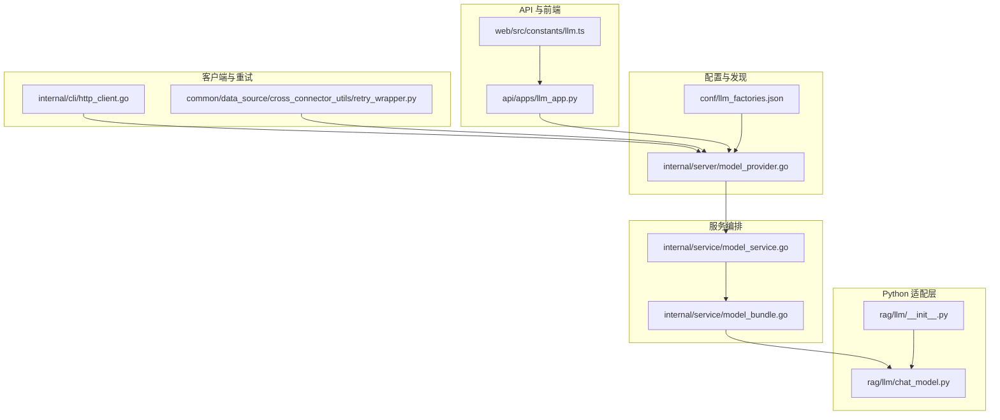
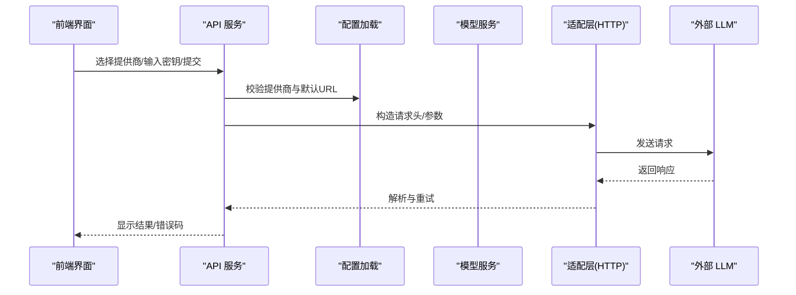
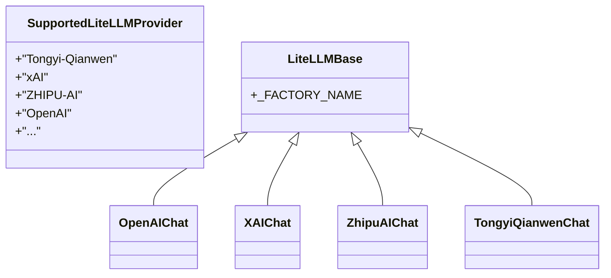
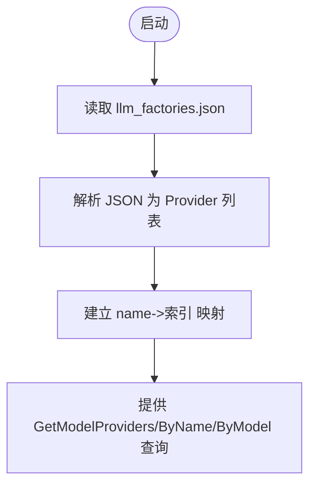
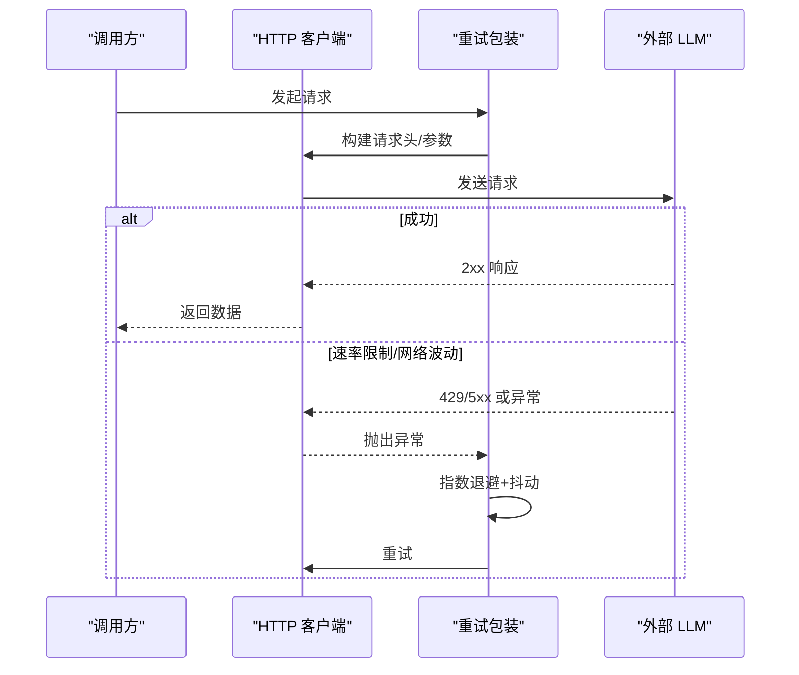
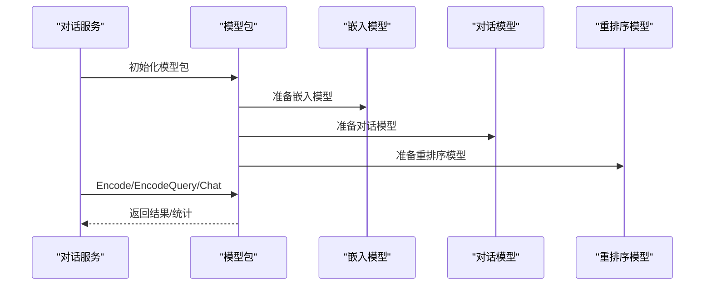
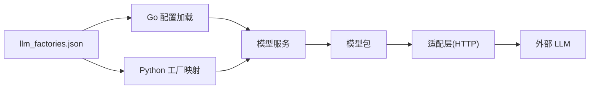

# 模型提供商集成

<cite>
**本文引用的文件**
- [llm_factories.json](file://conf/llm_factories.json)
- [model_provider.go](file://internal/server/model_provider.go)
- [model_provider.go](file://internal/dao/model_provider.go)
- [model_service.go](file://internal/service/model_service.go)
- [model_bundle.go](file://internal/service/model_bundle.go)
- [llm_app.py](file://api/apps/llm_app.py)
- [chat_model.py](file://rag/llm/chat_model.py)
- [__init__.py](file://rag/llm/__init__.py)
- [http_client.go](file://internal/cli/http_client.go)
- [http_client.py](file://admin/client/http_client.py)
- [dialog_service.py](file://api/db/services/dialog_service.py)
- [tenant_llm_service.py](file://api/db/services/tenant_llm_service.py)
- [retry_wrapper.py](file://common/data_source/cross_connector_utils/retry_wrapper.py)
- [utils.py](file://common/data_source/utils.py)
- [settings.py](file://common/settings.py)
- [llm.ts](file://web/src/constants/llm.ts)
</cite>

## 目录
1. [简介](#简介)
2. [项目结构](#项目结构)
3. [核心组件](#核心组件)
4. [架构总览](#架构总览)
5. [详细组件分析](#详细组件分析)
6. [依赖分析](#依赖分析)
7. [性能考虑](#性能考虑)
8. [故障排查指南](#故障排查指南)
9. [结论](#结论)
10. [附录](#附录)

## 简介
本文件面向开发者与运维人员，系统性阐述 RAGFlow 的多提供商 LLM 集成方案。内容覆盖 OpenAI、xAI、TokenPony、Tongyi-Qianwen、ZHIPU-AI 等主流模型提供商的接入方式与配置要点；深入解析模型工厂模式（含注册机制、提供商发现、动态加载）；详解 API 适配层（认证、请求封装、响应处理、错误重试）；并提供新增提供商的实操步骤、配置示例与最佳实践，帮助快速扩展与稳定运行。

## 项目结构
RAGFlow 的多提供商集成横跨后端 Go 服务、Python 嵌入与推理模块、前端常量与配置，以及统一的配置文件。关键位置如下：
- 后端配置与发现：conf/llm_factories.json 提供提供商清单与默认 URL；Go 层通过 internal/server/model_provider.go 加载并建立索引。
- Python 推理与适配：rag/llm 下的工厂映射与适配类，负责按提供商动态选择实现。
- API 服务与前端：api/apps/llm_app.py 负责密钥校验与保存；web/src/constants/llm.ts 定义前端枚举与图标映射。
- 服务编排：internal/service/model_service.go 与 internal/service/model_bundle.go 组合模型实例并执行任务。
- 错误重试与 HTTP 客户端：common/data_source/cross_connector_utils/retry_wrapper.py 与 internal/cli/http_client.go 提供通用重试与请求封装。

**图表来源**
- [llm_factories.json](file://conf/llm_factories.json)
- [model_provider.go](file://internal/server/model_provider.go)
- [model_service.go](file://internal/service/model_service.go)
- [model_bundle.go](file://internal/service/model_bundle.go)
- [llm_app.py](file://api/apps/llm_app.py)
- [chat_model.py](file://rag/llm/chat_model.py)
- [__init__.py](file://rag/llm/__init__.py)
- [http_client.go](file://internal/cli/http_client.go)
- [retry_wrapper.py](file://common/data_source/cross_connector_utils/retry_wrapper.py)
- [llm.ts](file://web/src/constants/llm.ts)

**章节来源**
- [llm_factories.json](file://conf/llm_factories.json)
- [model_provider.go](file://internal/server/model_provider.go)
- [model_service.go](file://internal/service/model_service.go)
- [model_bundle.go](file://internal/service/model_bundle.go)
- [llm_app.py](file://api/apps/llm_app.py)
- [chat_model.py](file://rag/llm/chat_model.py)
- [__init__.py](file://rag/llm/__init__.py)
- [http_client.go](file://internal/cli/http_client.go)
- [retry_wrapper.py](file://common/data_source/cross_connector_utils/retry_wrapper.py)
- [llm.ts](file://web/src/constants/llm.ts)

## 核心组件
- 模型提供商配置与发现
  - 配置文件：conf/llm_factories.json 定义各提供商名称、默认 URL、模型清单与标签。
  - 加载与索引：internal/server/model_provider.go 在启动时读取 JSON 并建立 name->索引映射，便于快速查找。
- 工厂模式与动态加载
  - Python 工厂映射：rag/llm/__init__.py 动态扫描 chat_model.py 中的 Base 及 LiteLLMBase 子类，构建“提供商名 -> 实现类”的字典。
  - Go 注册机制：internal/service/models/factory.go 提供嵌入模型工厂注册表，按提供商名分发创建。
- API 适配层
  - 认证与请求封装：internal/cli/http_client.go 与 admin/client/http_client.py 提供统一的 Header 构建、URL 组装、超时与重试。
  - 错误分类与重试：common/data_source/cross_connector_utils/retry_wrapper.py 与 common/data_source/utils.py 提供指数退避与 Retry-After 处理。
- 服务编排与前端交互
  - 模型实例化：api/db/services/tenant_llm_service.py 根据配置构造具体模型对象。
  - 对话编排：api/db/services/dialog_service.py 将对话、检索与重排序模型组合为工作流。
  - 前端常量：web/src/constants/llm.ts 定义 LLMFactory 枚举与图标映射，支撑 UI 展示与选择。

**章节来源**
- [llm_factories.json](file://conf/llm_factories.json)
- [model_provider.go](file://internal/server/model_provider.go)
- [model_service.go](file://internal/service/model_service.go)
- [model_bundle.go](file://internal/service/model_bundle.go)
- [llm_app.py](file://api/apps/llm_app.py)
- [chat_model.py](file://rag/llm/chat_model.py)
- [__init__.py](file://rag/llm/__init__.py)
- [http_client.go](file://internal/cli/http_client.go)
- [http_client.py](file://admin/client/http_client.py)
- [retry_wrapper.py](file://common/data_source/cross_connector_utils/retry_wrapper.py)
- [utils.py](file://common/data_source/utils.py)
- [dialog_service.py](file://api/db/services/dialog_service.py)
- [tenant_llm_service.py](file://api/db/services/tenant_llm_service.py)
- [llm.ts](file://web/src/constants/llm.ts)

## 架构总览
RAGFlow 的多提供商集成采用“配置驱动 + 工厂模式 + 适配层 + 编排服务”的分层架构：
- 配置层：集中于 llm_factories.json，定义提供商、默认 Base URL、模型清单。
- 发现层：Go 侧加载配置并建立索引；Python 侧动态构建工厂映射。
- 适配层：针对不同提供商的认证、头部、URL、参数差异进行统一封装。
- 服务层：根据租户与对话场景，组合嵌入、对话、重排序等模型完成任务。
- 前端层：提供模型选择、密钥配置与验证入口。

**图表来源**
- [llm_app.py](file://api/apps/llm_app.py)
- [model_provider.go](file://internal/server/model_provider.go)
- [http_client.go](file://internal/cli/http_client.go)
- [http_client.py](file://admin/client/http_client.py)
- [retry_wrapper.py](file://common/data_source/cross_connector_utils/retry_wrapper.py)

## 详细组件分析

### 模型工厂模式与动态加载
- Python 工厂映射
  - rag/llm/__init__.py 扫描 chat_model.py 中的 Base 与 LiteLLMBase 子类，将 _FACTORY_NAME（字符串或列表）映射到对应实现类，形成 ChatModel 字典。
  - 支持的提供商枚举在 rag/llm/__init__.py 的 SupportedLiteLLMProvider 中集中管理，确保前后端一致性。
- Go 工厂注册
  - internal/service/models/factory.go 定义 EmbeddingModelFactory 类型与注册/获取函数，CreateEmbeddingModel 按提供商名调用对应工厂创建实例。
- 动态加载策略
  - Python 侧通过 importlib 动态导入模块并反射获取类，避免硬编码分支。
  - Go 侧通过全局注册表按名称分发，便于扩展新提供商。

**图表来源**
- [__init__.py](file://rag/llm/__init__.py)
- [chat_model.py](file://rag/llm/chat_model.py)

**章节来源**
- [__init__.py](file://rag/llm/__init__.py)
- [chat_model.py](file://rag/llm/chat_model.py)
- [model_service.go](file://internal/service/model_service.go)

### 提供商发现与配置加载
- 配置文件结构
  - conf/llm_factories.json 的 factory_llm_infos 数组中，每个元素代表一个提供商，包含 name、tags、status、rank、url（可选）、llm 列表（模型清单）。
- 加载与索引
  - internal/server/model_provider.go 在首次调用时读取 JSON，解析为 ModelProvider 列表，并建立 name->索引映射，提供 GetModelProviderByName 与 GetLLMByProviderAndName 快速查询。
- 前端枚举与图标
  - web/src/constants/llm.ts 定义 LLMFactory 枚举与图标映射，用于 UI 展示与选择。

**图表来源**
- [llm_factories.json](file://conf/llm_factories.json)
- [model_provider.go](file://internal/server/model_provider.go)
- [llm.ts](file://web/src/constants/llm.ts)

**章节来源**
- [llm_factories.json](file://conf/llm_factories.json)
- [model_provider.go](file://internal/server/model_provider.go)
- [llm.ts](file://web/src/constants/llm.ts)

### API 适配层设计
- 认证机制
  - internal/cli/http_client.go 与 admin/client/http_client.py 提供 Headers 构建逻辑，支持 Bearer Token、登录态等鉴权方式。
- 请求封装
  - 统一的 Request/RequestJSON 方法，自动拼接 URL、设置 Content-Type、合并额外头部。
- 响应处理
  - Response 结构体包含状态码、Body、Headers、耗时；JSON() 方法用于解析响应体。
- 错误重试
  - common/data_source/cross_connector_utils/retry_wrapper.py 提供带指数退避与抖动的重试装饰器，支持自定义异常类型与最大延迟。
  - common/data_source/utils.py 针对特定 429/403 场景处理 Retry-After 与固定延迟。

**图表来源**
- [http_client.go](file://internal/cli/http_client.go)
- [http_client.py](file://admin/client/http_client.py)
- [retry_wrapper.py](file://common/data_source/cross_connector_utils/retry_wrapper.py)
- [utils.py](file://common/data_source/utils.py)

**章节来源**
- [http_client.go](file://internal/cli/http_client.go)
- [http_client.py](file://admin/client/http_client.py)
- [retry_wrapper.py](file://common/data_source/cross_connector_utils/retry_wrapper.py)
- [utils.py](file://common/data_source/utils.py)

### 服务编排与模型实例化
- 模型实例化
  - api/db/services/tenant_llm_service.py 根据 model_type 与 llm_factory 选择对应工厂，构造具体模型对象（嵌入、重排序、图像理解等）。
- 对话编排
  - api/db/services/dialog_service.py 将知识库嵌入模型、对话模型与重排序模型组合，形成完整的检索增强生成链路。
- 模型包封装
  - internal/service/model_bundle.go 提供 Encode/EncodeQuery/Chat 等统一接口，屏蔽底层提供商差异。

**图表来源**
- [tenant_llm_service.py](file://api/db/services/tenant_llm_service.py)
- [dialog_service.py](file://api/db/services/dialog_service.py)
- [model_bundle.go](file://internal/service/model_bundle.go)

**章节来源**
- [tenant_llm_service.py](file://api/db/services/tenant_llm_service.py)
- [dialog_service.py](file://api/db/services/dialog_service.py)
- [model_bundle.go](file://internal/service/model_bundle.go)

### 主要提供商集成要点

#### OpenAI
- 默认 Base URL：conf/llm_factories.json 中 OpenAI 节点的 url 字段；若未指定则使用工厂默认值。
- 参数与头部：通过 LiteLLMBase 的 _construct_completion_args 统一注入 api_key、api_base、extra_headers 等。
- 工具调用：支持 tools 与 tool_choice 自动注入。

**章节来源**
- [llm_factories.json](file://conf/llm_factories.json)
- [chat_model.py](file://rag/llm/chat_model.py)
- [__init__.py](file://rag/llm/__init__.py)

#### xAI
- 模型族：grok-* 系列，支持聊天与视觉能力。
- 认证与 Base URL：遵循 LiteLLMBase 的统一封装，必要时在 _construct_completion_args 中注入额外参数。

**章节来源**
- [llm_factories.json](file://conf/llm_factories.json)
- [chat_model.py](file://rag/llm/chat_model.py)

#### TokenPony
- 默认 Base URL：conf/llm_factories.json 中 TokenPony 的 url 字段。
- 模型清单：包含多种大模型，适合国内合规与定制场景。

**章节来源**
- [llm_factories.json](file://conf/llm_factories.json)

#### Tongyi-Qianwen（通义千问）
- 默认 Base URL：conf/llm_factories.json 中 Tongyi-Qianwen 的 url 字段。
- 模型族：qwen-*、qwen-vl-*、qwq-* 等，覆盖对话、视觉理解、推理等。
- 前缀与兼容：工厂前缀与默认 Base URL 在 rag/llm/__init__.py 中集中维护。

**章节来源**
- [llm_factories.json](file://conf/llm_factories.json)
- [__init__.py](file://rag/llm/__init__.py)

#### ZHIPU-AI（智谱）
- 默认 Base URL：conf/llm_factories.json 中 ZHIPU-AI 的 url 字段。
- 模型族：glm-* 系列，支持对话、视觉理解与长文本。

**章节来源**
- [llm_factories.json](file://conf/llm_factories.json)

### 新增提供商接入指南
- 步骤一：在 conf/llm_factories.json 中新增提供商节点，填写 name、url（可选）、llm 清单。
- 步骤二：在 rag/llm/chat_model.py 中新增适配类，继承 LiteLLMBase 或 Base，设置 _FACTORY_NAME，并在 _construct_completion_args 中处理特殊认证与参数。
- 步骤三：在 rag/llm/__init__.py 中确认 SupportedLiteLLMProvider 与 FACTORY_DEFAULT_BASE_URL/LITELLM_PROVIDER_PREFIX 包含该提供商。
- 步骤四：在 api/apps/llm_app.py 中完善密钥字段校验逻辑（如需要）。
- 步骤五：在 web/src/constants/llm.ts 中补充前端枚举与图标映射。
- 步骤六：在 internal/server/model_provider.go 与 internal/dao/model_provider.go 中确认配置加载与查询可用。
- 步骤七：在 internal/service/models/factory.go 中注册嵌入模型工厂（如适用）。
- 步骤八：编写单元测试与集成测试，验证认证、请求、重试与错误码处理。

**章节来源**
- [llm_factories.json](file://conf/llm_factories.json)
- [chat_model.py](file://rag/llm/chat_model.py)
- [__init__.py](file://rag/llm/__init__.py)
- [llm_app.py](file://api/apps/llm_app.py)
- [llm.ts](file://web/src/constants/llm.ts)
- [model_provider.go](file://internal/server/model_provider.go)
- [model_provider.go](file://internal/dao/model_provider.go)
- [model_service.go](file://internal/service/model_service.go)

## 依赖分析
- 配置依赖：llm_factories.json 是所有提供商的权威来源，Go 与 Python 两侧均依赖其结构与字段。
- 运行时依赖：Python 工厂映射依赖 chat_model.py 中的类结构；Go 工厂注册依赖 models 包的工厂函数。
- 适配层依赖：HTTP 客户端与重试包装被广泛复用，降低各提供商适配成本。
- 前后端依赖：web/src/constants/llm.ts 与 Python 枚举保持一致，避免 UI 与后端不一致导致的错误。

**图表来源**
- [llm_factories.json](file://conf/llm_factories.json)
- [model_provider.go](file://internal/server/model_provider.go)
- [model_service.go](file://internal/service/model_service.go)
- [model_bundle.go](file://internal/service/model_bundle.go)
- [chat_model.py](file://rag/llm/chat_model.py)
- [http_client.go](file://internal/cli/http_client.go)

**章节来源**
- [llm_factories.json](file://conf/llm_factories.json)
- [model_provider.go](file://internal/server/model_provider.go)
- [model_service.go](file://internal/service/model_service.go)
- [model_bundle.go](file://internal/service/model_bundle.go)
- [chat_model.py](file://rag/llm/chat_model.py)
- [http_client.go](file://internal/cli/http_client.go)

## 性能考虑
- 连接池与超时：HTTP 客户端统一设置超时时间，建议结合业务峰值调整。
- 指数退避与抖动：retry_wrapper.py 提供可配置的重试策略，避免雪崩效应。
- Token 估算：model_bundle.go 中对 token 数量采用粗略估算，实际计费以提供商返回为准。
- 并发与限流：针对外部提供商的速率限制，优先使用 Retry-After；其次采用指数退避与固定延迟策略。
- 前缀与 Base URL：合理设置工厂前缀与默认 Base URL，减少请求路径拼接开销。

[本节为通用指导，无需特定文件引用]

## 故障排查指南
- 认证失败
  - 检查密钥是否正确、是否过期；确认 Headers 是否包含 Authorization。
  - 参考：http_client.go 与 http_client.py 的 Headers 构建逻辑。
- 速率限制
  - 观察 429/403 状态码，检查 Retry-After；启用 retry_wrapper.py 的指数退避。
  - 参考：retry_wrapper.py 与 utils.py 的重试策略。
- URL 与 Base URL
  - 若未配置默认 Base URL，需在前端或配置中显式填写；确认提供商前缀是否正确。
  - 参考：llm_factories.json 与 __init__.py 中的默认 Base URL 与前缀映射。
- 模型不可用
  - 确认模型名与提供商匹配；检查 conf/llm_factories.json 中 llm 清单是否存在。
  - 参考：model_provider.go 的 GetLLMByProviderAndName 查询。
- 错误码分类
  - chat_model.py 中定义了 LLMErrorCode，便于前端与日志统一识别错误类型。

**章节来源**
- [http_client.go](file://internal/cli/http_client.go)
- [http_client.py](file://admin/client/http_client.py)
- [retry_wrapper.py](file://common/data_source/cross_connector_utils/retry_wrapper.py)
- [utils.py](file://common/data_source/utils.py)
- [llm_factories.json](file://conf/llm_factories.json)
- [model_provider.go](file://internal/server/model_provider.go)
- [chat_model.py](file://rag/llm/chat_model.py)

## 结论
RAGFlow 的多提供商 LLM 集成以“配置驱动 + 工厂模式 + 适配层 + 编排服务”为核心，既保证了对多家提供商的统一接入，又提供了灵活的扩展能力。通过标准化的认证、请求封装与错误重试机制，开发者可以快速对接新提供商并稳定运行。建议在生产环境中结合业务特点优化超时、重试与并发策略，并持续完善配置与监控体系。

[本节为总结，无需特定文件引用]

## 附录

### 配置示例与使用指南
- 配置 API 密钥
  - 通过 API 接口提交 llm_factory、api_key、base_url（可选）等字段，系统会进行连通性验证。
  - 参考：api/apps/llm_app.py 的 set_api_key 路由与密钥校验逻辑。
- 设置请求参数
  - 在对话或嵌入调用时传入 gen_conf（温度、采样等），工厂层会清理并注入允许的参数。
  - 参考：rag/llm/chat_model.py 的 _clean_conf 与 _construct_completion_args。
- 添加新提供商
  - 在 conf/llm_factories.json 中新增节点；在 rag/llm/chat_model.py 中新增适配类；在 rag/llm/__init__.py 中完善枚举与默认 Base URL；在 web/src/constants/llm.ts 中补充前端枚举。
  - 参考：上述各文件的对应段落。

**章节来源**
- [llm_app.py](file://api/apps/llm_app.py)
- [chat_model.py](file://rag/llm/chat_model.py)
- [llm_factories.json](file://conf/llm_factories.json)
- [__init__.py](file://rag/llm/__init__.py)
- [llm.ts](file://web/src/constants/llm.ts)