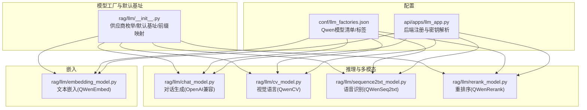
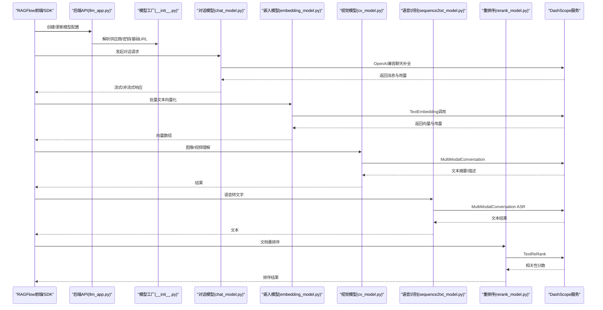
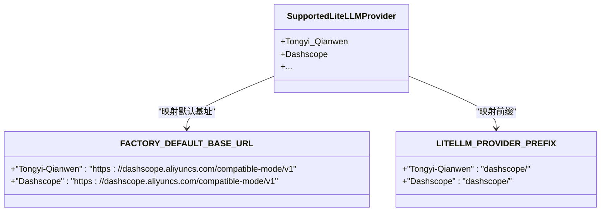
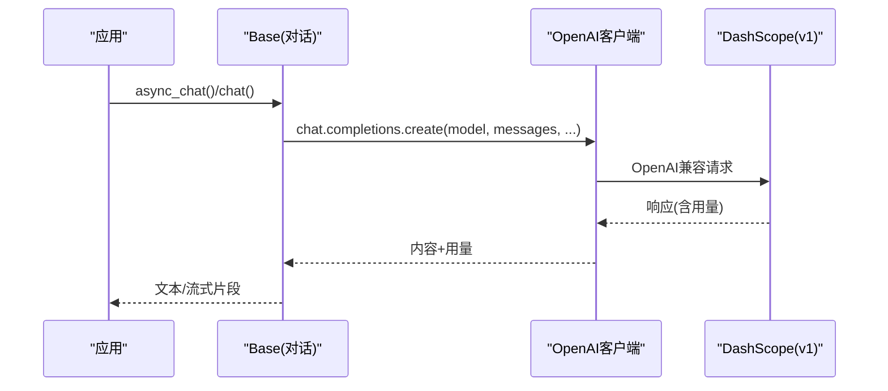
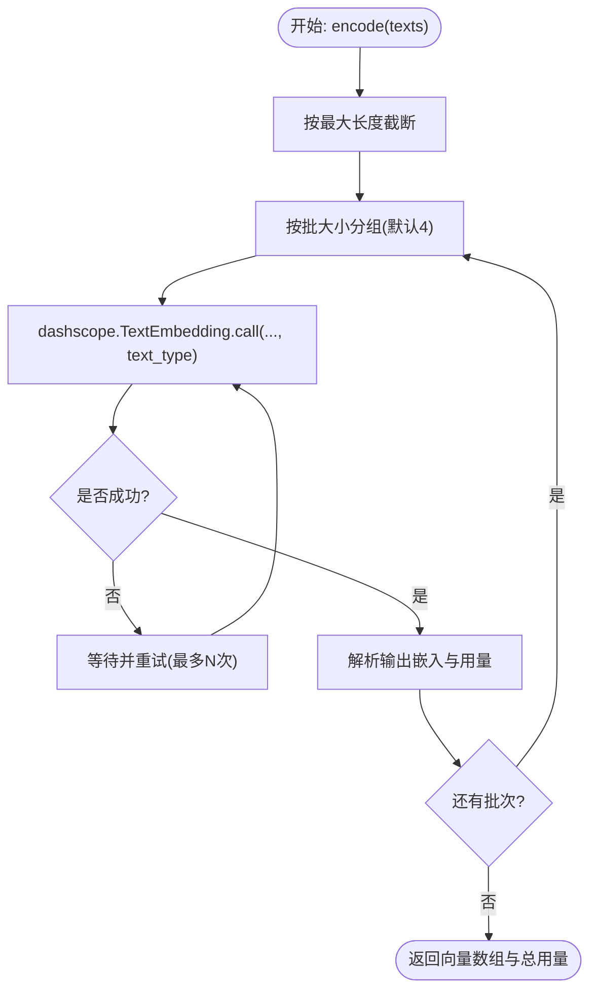
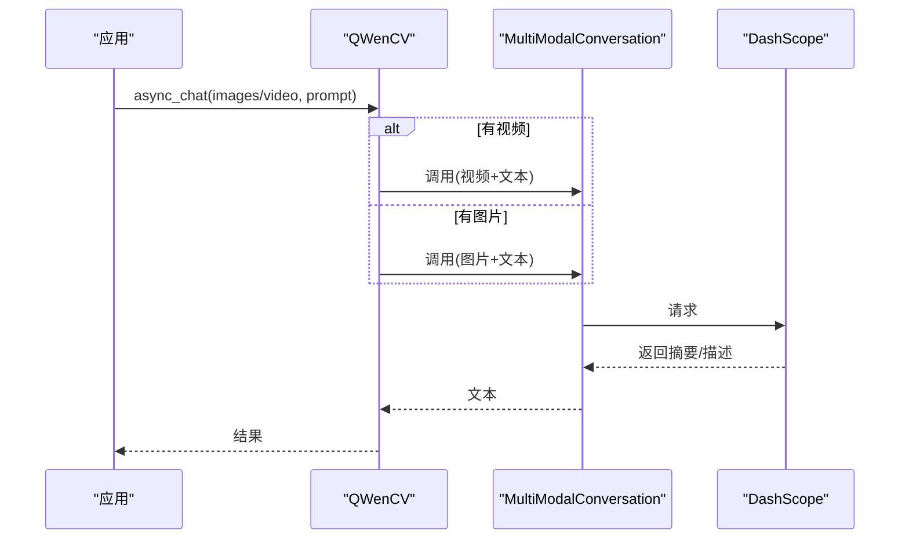
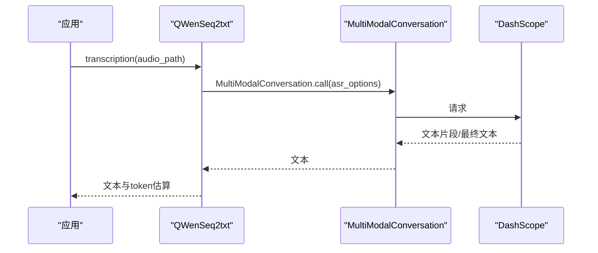
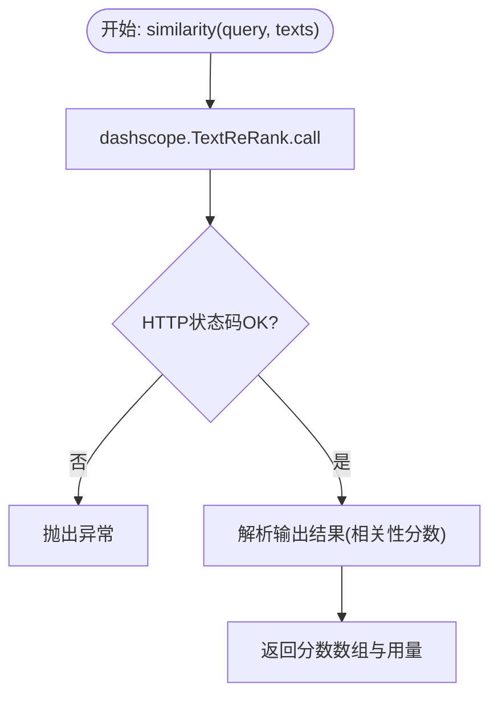
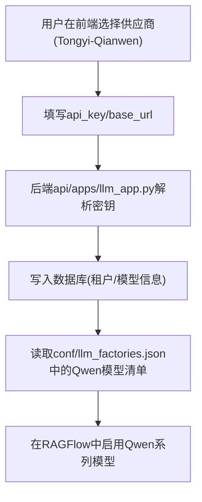
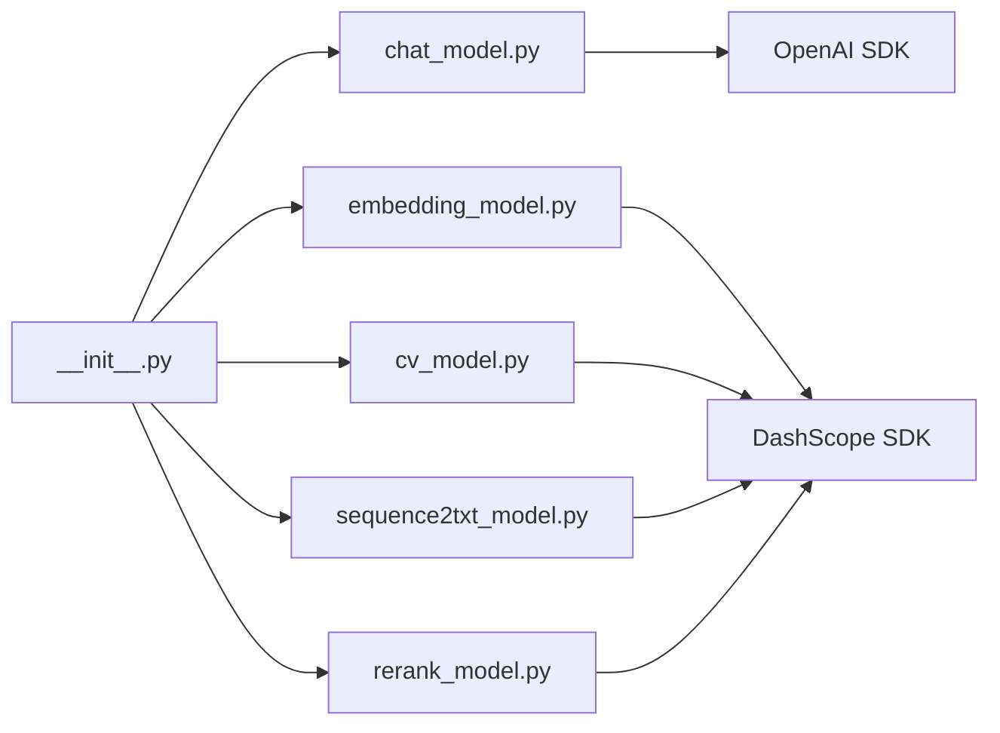

# 通义千问集成

<cite>
**本文引用的文件**
- [rag/llm/__init__.py](file://rag/llm/__init__.py)
- [rag/llm/chat_model.py](file://rag/llm/chat_model.py)
- [rag/llm/embedding_model.py](file://rag/llm/embedding_model.py)
- [rag/llm/cv_model.py](file://rag/llm/cv_model.py)
- [rag/llm/rerank_model.py](file://rag/llm/rerank_model.py)
- [rag/llm/sequence2txt_model.py](file://rag/llm/sequence2txt_model.py)
- [conf/llm_factories.json](file://conf/llm_factories.json)
- [api/apps/llm_app.py](file://api/apps/llm_app.py)
</cite>

## 目录
1. [简介](#简介)
2. [项目结构](#项目结构)
3. [核心组件](#核心组件)
4. [架构总览](#架构总览)
5. [详细组件分析](#详细组件分析)
6. [依赖分析](#依赖分析)
7. [性能考虑](#性能考虑)
8. [故障排除指南](#故障排除指南)
9. [结论](#结论)
10. [附录](#附录)

## 简介
本技术文档面向在 RAGFlow 中集成通义千问（DashScope 平台）的开发者与运维人员，系统性说明通义千问模型提供商的完整实现，覆盖以下关键点：
- DashScope 平台的认证机制与兼容 OpenAI 的请求/响应格式
- 支持的能力矩阵：对话生成、文本嵌入、图像理解（视觉语言）、语音识别（ASR）、重排序（rerank）
- Qwen 系列模型的完整支持：qwen3.5、qwen3、qwen-max 等
- 在 RAGFlow 中的配置方式、使用流程与最佳实践
- 性能优化策略、成本控制方法与常见问题排查

## 项目结构
通义千问集成主要分布在以下模块：
- 模型工厂与默认基地址映射：用于统一管理供应商、前缀与默认 base_url
- 对话模型：封装 OpenAI 兼容接口，适配 Qwen 家族推理
- 文本嵌入：基于 DashScope TextEmbedding 调用
- 视觉语言：基于 MultiModalConversation，支持图片与视频理解
- 重排序：基于 DashScope TextReRank
- 语音识别：基于 MultiModalConversation 的 ASR 能力
- 配置文件：llm_factories.json 中声明 Qwen 模型清单与标签

图表来源
- [rag/llm/__init__.py:64-130](file://rag/llm/__init__.py#L64-L130)
- [rag/llm/chat_model.py:115-128](file://rag/llm/chat_model.py#L115-L128)
- [rag/llm/cv_model.py:302-308](file://rag/llm/cv_model.py#L302-L308)
- [rag/llm/sequence2txt_model.py:71-79](file://rag/llm/sequence2txt_model.py#L71-L79)
- [rag/llm/rerank_model.py:364-372](file://rag/llm/rerank_model.py#L364-L372)
- [rag/llm/embedding_model.py:173-179](file://rag/llm/embedding_model.py#L173-L179)
- [conf/llm_factories.json:374-795](file://conf/llm_factories.json#L374-L795)
- [api/apps/llm_app.py:229-237](file://api/apps/llm_app.py#L229-L237)

章节来源
- [rag/llm/__init__.py:25-130](file://rag/llm/__init__.py#L25-L130)
- [conf/llm_factories.json:374-795](file://conf/llm_factories.json#L374-L795)

## 核心组件
- 供应商与默认基址
  - 通过枚举定义“Tongyi-Qianwen”“Dashscope”，并设置默认 base_url 与前缀
  - 默认 base_url 指向 DashScope 兼容 OpenAI 的 v1 接口
- 对话模型
  - 基于 OpenAI 兼容客户端，自动注入 base_url 与 api_key
  - 针对 Qwen3 家族请求参数进行策略化清理，禁用“思考”以提升稳定性
- 文本嵌入
  - 使用 DashScope TextEmbedding，按批处理与重试策略调用
- 视觉语言
  - 使用 MultiModalConversation，支持图片与视频输入；失败时回退至国际域名
- 语音识别
  - 使用 MultiModalConversation 的 ASR 能力，支持流式与非流式
- 重排序
  - 使用 DashScope TextReRank，返回相关性分数

章节来源
- [rag/llm/__init__.py:64-130](file://rag/llm/__init__.py#L64-L130)
- [rag/llm/chat_model.py:63-112](file://rag/llm/chat_model.py#L63-L112)
- [rag/llm/embedding_model.py:173-220](file://rag/llm/embedding_model.py#L173-L220)
- [rag/llm/cv_model.py:302-406](file://rag/llm/cv_model.py#L302-L406)
- [rag/llm/sequence2txt_model.py:71-155](file://rag/llm/sequence2txt_model.py#L71-L155)
- [rag/llm/rerank_model.py:364-389](file://rag/llm/rerank_model.py#L364-L389)

## 架构总览
下图展示了从 RAGFlow 后端到 DashScope 的调用链路与关键组件交互。

图表来源
- [api/apps/llm_app.py:229-237](file://api/apps/llm_app.py#L229-L237)
- [rag/llm/__init__.py:64-130](file://rag/llm/__init__.py#L64-L130)
- [rag/llm/chat_model.py:115-128](file://rag/llm/chat_model.py#L115-L128)
- [rag/llm/embedding_model.py:173-220](file://rag/llm/embedding_model.py#L173-L220)
- [rag/llm/cv_model.py:302-406](file://rag/llm/cv_model.py#L302-L406)
- [rag/llm/sequence2txt_model.py:71-155](file://rag/llm/sequence2txt_model.py#L71-L155)
- [rag/llm/rerank_model.py:364-389](file://rag/llm/rerank_model.py#L364-L389)

## 详细组件分析

### 供应商与工厂映射
- 供应商枚举包含“Tongyi-Qianwen”“Dashscope”，并提供默认 base_url 与前缀
- 工厂扫描各模块类，将带 _FACTORY_NAME 的具体实现注册到对应映射表
- 便于在运行时按供应商动态选择实现

图表来源
- [rag/llm/__init__.py:25-130](file://rag/llm/__init__.py#L25-L130)

章节来源
- [rag/llm/__init__.py:25-130](file://rag/llm/__init__.py#L25-L130)

### 对话生成（Qwen 家族）
- 自动注入 base_url 与 api_key，保持 OpenAI 兼容
- 针对 Qwen3 家族请求参数进行清理，禁用“思考”以避免多余输出
- 支持同步与异步流式输出，具备重试与错误分类

图表来源
- [rag/llm/chat_model.py:115-128](file://rag/llm/chat_model.py#L115-L128)
- [rag/llm/chat_model.py:63-112](file://rag/llm/chat_model.py#L63-L112)

章节来源
- [rag/llm/chat_model.py:115-128](file://rag/llm/chat_model.py#L115-L128)
- [rag/llm/chat_model.py:63-112](file://rag/llm/chat_model.py#L63-L112)

### 文本嵌入（QwenEmbed）
- 使用 DashScope TextEmbedding，按批处理与重试策略调用
- 支持“文档”与“查询”两种 text_type，分别用于索引与检索场景
- 统计 token 数量，便于成本与性能评估

图表来源
- [rag/llm/embedding_model.py:173-220](file://rag/llm/embedding_model.py#L173-L220)

章节来源
- [rag/llm/embedding_model.py:173-220](file://rag/llm/embedding_model.py#L173-L220)

### 视觉语言（QWenCV）
- 使用 MultiModalConversation，支持图片与视频输入
- 失败时自动切换国际域名，增强可用性
- 提供视频摘要与图片描述能力

图表来源
- [rag/llm/cv_model.py:302-406](file://rag/llm/cv_model.py#L302-L406)

章节来源
- [rag/llm/cv_model.py:302-406](file://rag/llm/cv_model.py#L302-L406)

### 语音识别（QWenSeq2txt）
- 使用 MultiModalConversation 的 ASR 能力
- 支持非流式与流式两种模式，适合不同场景

图表来源
- [rag/llm/sequence2txt_model.py:71-155](file://rag/llm/sequence2txt_model.py#L71-L155)

章节来源
- [rag/llm/sequence2txt_model.py:71-155](file://rag/llm/sequence2txt_model.py#L71-L155)

### 重排序（QWenRerank）
- 使用 DashScope TextReRank，返回相关性分数
- 适用于检索后的精排阶段

图表来源
- [rag/llm/rerank_model.py:364-389](file://rag/llm/rerank_model.py#L364-L389)

章节来源
- [rag/llm/rerank_model.py:364-389](file://rag/llm/rerank_model.py#L364-L389)

### 配置与使用（RAGFlow）
- 后端在创建/更新模型时，解析供应商与密钥，并写入数据库字段
- 前端配置文件 llm_factories.json 中包含 Qwen 模型清单与标签，便于选择与展示

图表来源
- [api/apps/llm_app.py:229-237](file://api/apps/llm_app.py#L229-L237)
- [conf/llm_factories.json:374-795](file://conf/llm_factories.json#L374-L795)

章节来源
- [api/apps/llm_app.py:229-237](file://api/apps/llm_app.py#L229-L237)
- [conf/llm_factories.json:374-795](file://conf/llm_factories.json#L374-L795)

## 依赖分析
- 供应商与前缀
  - “Tongyi-Qianwen”“Dashscope”均映射到 dashscope/ 前缀与兼容 OpenAI 的 base_url
- 模块耦合
  - 各模型实现均依赖 OpenAI 兼容客户端或 DashScope SDK
  - 错误分类与重试策略集中在 Base 类中，便于复用
- 外部依赖
  - DashScope SDK 与 OpenAI SDK
  - http/requests 等网络库

图表来源
- [rag/llm/__init__.py:64-130](file://rag/llm/__init__.py#L64-L130)
- [rag/llm/chat_model.py:115-128](file://rag/llm/chat_model.py#L115-L128)
- [rag/llm/embedding_model.py:173-183](file://rag/llm/embedding_model.py#L173-L183)
- [rag/llm/cv_model.py:302-354](file://rag/llm/cv_model.py#L302-L354)
- [rag/llm/sequence2txt_model.py:71-78](file://rag/llm/sequence2txt_model.py#L71-L78)
- [rag/llm/rerank_model.py:364-367](file://rag/llm/rerank_model.py#L364-L367)

章节来源
- [rag/llm/__init__.py:64-130](file://rag/llm/__init__.py#L64-L130)

## 性能考虑
- 批处理与并发
  - 嵌入模型默认批大小为 4，可根据输入长度与服务端限制调整
  - 对话与多模态接口建议按需并发，避免超限
- 重试与退避
  - 嵌入与重排序实现内置重试逻辑，建议结合业务侧指数退避策略
- 上下文与截断
  - 对话模型针对 Qwen3 家族禁用“思考”，减少冗余输出
  - 注意服务端对最大上下文与单次输入长度的限制
- 成本控制
  - 嵌入与重排序会统计 token 用量，建议在检索前做预过滤与去重
  - 语音识别与视频理解属于高算力任务，建议按需启用

## 故障排除指南
- 认证失败
  - 确认 api_key 正确且未过期
  - 检查 base_url 是否指向 DashScope 兼容接口
- 请求超时/限流
  - 增加重试次数与退避间隔
  - 降低批大小或并发度
- 国际化访问
  - 视觉与视频理解失败时可尝试国际域名回退
- 输出为空或异常
  - 检查输入格式（图片/音频/视频路径），确保符合要求
  - 对长文本进行截断后再调用

章节来源
- [rag/llm/embedding_model.py:173-220](file://rag/llm/embedding_model.py#L173-L220)
- [rag/llm/cv_model.py:389-406](file://rag/llm/cv_model.py#L389-L406)
- [rag/llm/rerank_model.py:364-389](file://rag/llm/rerank_model.py#L364-L389)

## 结论
通过统一的模型工厂与 OpenAI 兼容层，RAGFlow 对通义千问（DashScope）实现了稳定、可扩展的集成。开发者可直接在 RAGFlow 中启用 Qwen 系列模型，覆盖对话、嵌入、视觉理解、语音识别与重排序等能力。配合合理的批处理、重试与成本控制策略，可在保证质量的同时提升整体性能与性价比。

## 附录
- 支持的 Qwen 模型（节选）
  - 对话：qwen3.5、qwen3、qwen-max、qwen-plus、qwen-turbo 等
  - 嵌入：text-embedding-v2/v3/v4
  - 视觉：qwen-vl-plus/max 等
  - 语音：qwen3-asr-flash 等
  - 重排序：gte-rerank
- 配置要点
  - 供应商选择：Tongyi-Qianwen 或 Dashscope
  - base_url：默认兼容 OpenAI 的 DashScope v1 接口
  - api_key：DashScope API 密钥
  - 模型清单：参考 llm_factories.json 中的 Qwen 条目

章节来源
- [conf/llm_factories.json:374-795](file://conf/llm_factories.json#L374-L795)